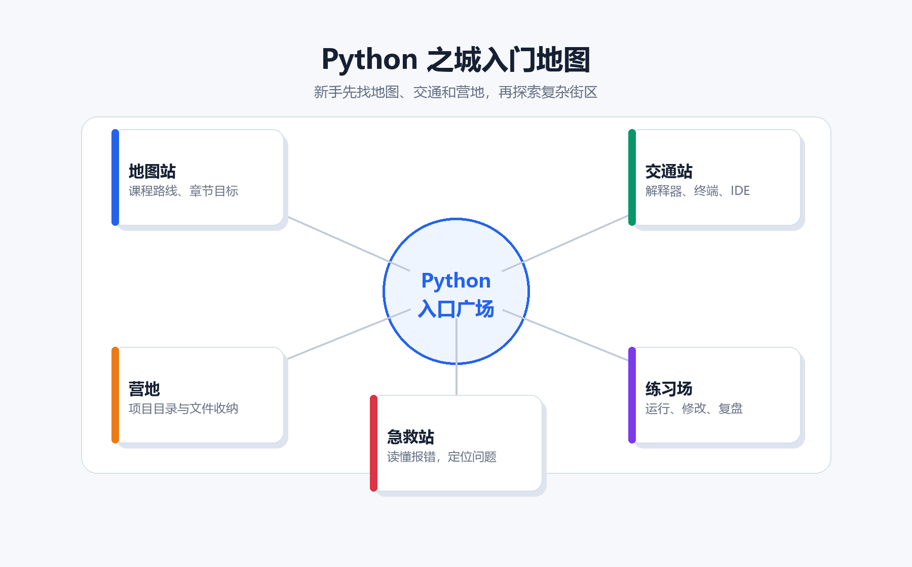
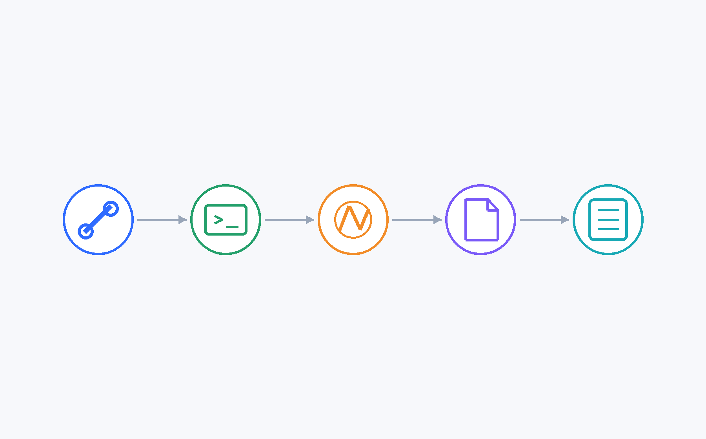
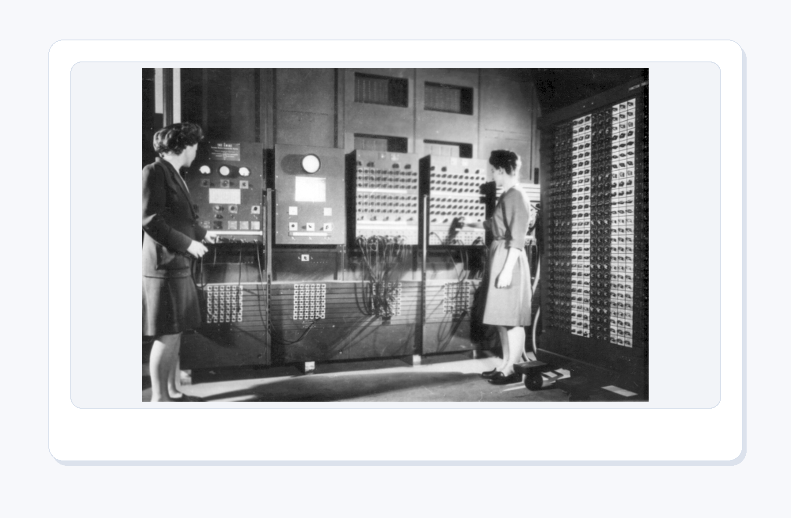
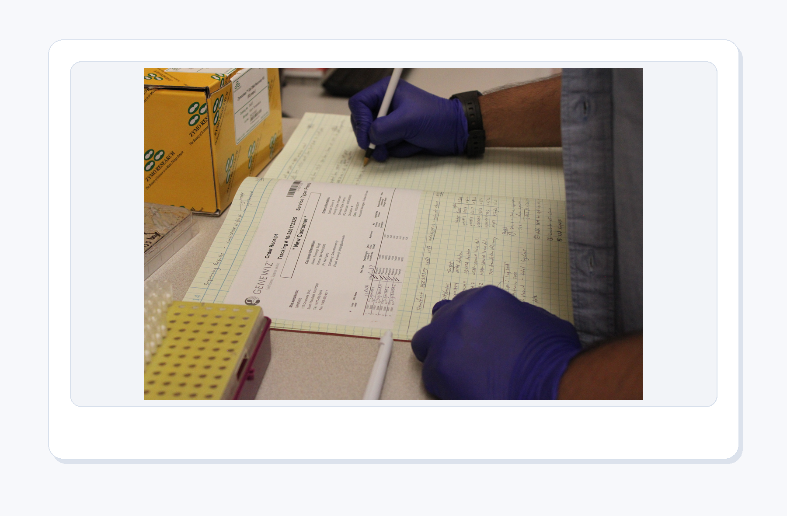
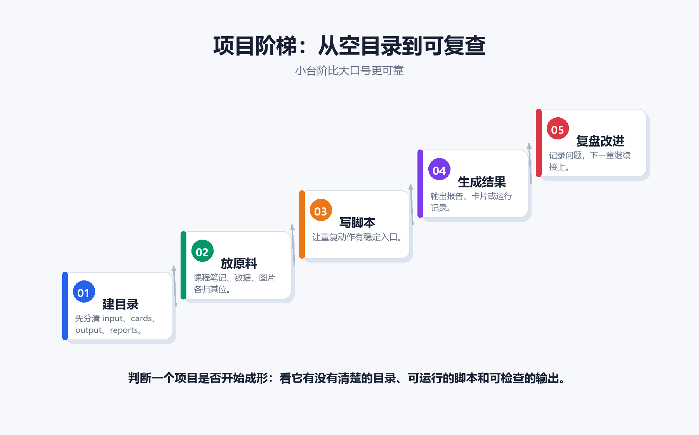
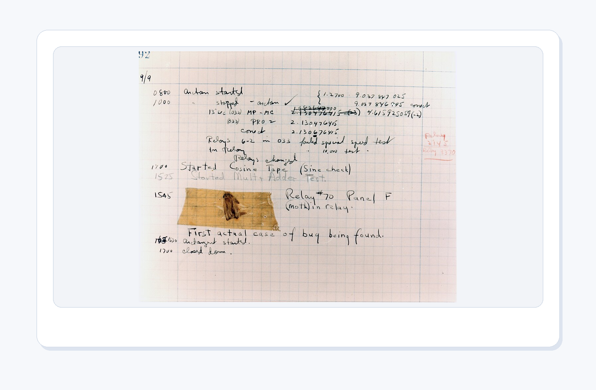

# 第0章：先别急着写代码——Python 课程地图、入门仪式与学习方法

[TOC]

<style>
figure {
  margin: 1.2em auto 1.8em;
  text-align: center;
}
figure img {
  max-width: 100%;
  display: block;
  margin: 0 auto;
}
figcaption {
  margin-top: 0.45em;
  color: #5f6673;
  font-size: 0.92em;
  line-height: 1.55;
}
figcaption strong {
  color: #2d3748;
}
</style>

<figure align="center">
  
  <figcaption><strong>图0-1 第0章封面</strong>：先拿地图，再写代码；新手村的第一件装备是方向感。</figcaption>
</figure>

> 本章定位：这是整套 Python 教程的“新手村广场”。你还不用急着打怪、刷副本、挑战 Boss。我们先把地图摊开，把装备穿好，把技能树看清楚。否则你很可能会出现一种经典惨案：代码还没写几行，文件已经不知道存哪了；Python 还没学会，桌面先变成了垃圾场。

### 本章真实任务：启动一个科研卡片工厂

从这一章开始，你不再把 Python 当成一堆散装语法来背。我们会把它当成一间正在搭建的**科研卡片工厂**：`input/` 里放原料，`cards/` 里放学习卡片，`output/` 里放生成结果，`reports/` 里放报告和运行记录，`assets/` 里放图片素材。

<figure align="center">
  
  <figcaption><strong>图0-2 图书馆卡片目录</strong>：卡片不是零散纸片，而是一套可以检索、归档、复用的知识索引。</figcaption>
</figure>

在搜索引擎出现以前，图书馆常常用一格一格的卡片目录来管理书籍。你想找一本书，不是冲进书架乱翻，而是先根据作者、题名、主题去查卡片。这个画面很适合本课程：Python 要帮你做的第一件事，不是炫技，而是把材料变得可检索、可整理、可再次使用。未来每一章都会给这间工厂添一台小机器：整理文件、生成卡片、分析数据、处理图片，最后导出 Word/PPT 报告。


## **0.0 写在前面：AI时代的编程学习**

#### 0.0.1 AI时代

这几年AI的浪潮如火如荼，顶尖大模型的能力已经能从原先的错误百出到如今媲美顶级的算法竞赛生，乃至于各类互联网大厂都开始争先恐后地裁员~

<figure align="center">
  
  <figcaption><strong>图0-3 自动化也要算账</strong>：不是所有重复任务都值得写脚本，频率、耗时和出错率才是判断依据。</figcaption>
</figure>

这里先放一个很适合本章的互联网梗图：xkcd 1205《Is It Worth the Time?》。这张图不是在劝你别自动化，而是在提醒你：**自动化也要算账。**

很多初学者一听 Python 能自动化，脑子里会立刻出现一种热血画面：所有重复工作都交给脚本，自己从此坐在椅子上喝茶。这个画面很好，但现实会稍微冷静一点。写脚本需要时间，调试脚本需要时间，维护脚本也需要时间。如果一个任务一年只做一次，手动做 5 分钟就结束，那么花三小时写自动化脚本，很可能不是效率，而是仪式感。

但如果一件事每天都要重复、每次都容易出错、结果还要留痕，那 Python 就很值得出场。学习 Python 的意义，不是把世界上所有事情都变成代码，而是学会判断：什么任务值得自动化，什么任务应该先手动理解流程，什么任务适合交给 AI 辅助生成，再由你来检查。

所以第0章不急着写复杂代码。我们先训练一种工程直觉：**会写脚本之前，先学会判断脚本该不该写。**

#### 0.0.2 AI 时代为什么仍要学 Python

你可能不是计算机专业，也可能从来没有系统学过编程。你已经见过 AI 写代码、改文档、生成表格，甚至帮人做小工具，于是很自然会问：既然 AI 都这么强了，我还需要学 Python 吗？

这要从目前阶段AI的原理和局限性出发考虑：

##### 1. 大模型幻觉

大模型最典型的局限之一就是幻觉。所谓幻觉，就是 AI 生成了看起来完整、自信、合理，但实际上并不正确的内容。这种问题的根本原因在于，大模型不是传统意义上的数据库或编译器。它并不是逐条查询真实事实后再回答，而是根据概率生成“最像正确答案的文本”。目前，某些大模型已经具备自我测试和验证的能力，但是仍然避免不了此类问题。

在实际开发的过程中，对于不懂代码的用户而言，大模型的产物是一个完全纯粹的黑盒，假如黑盒中藏着一点微小的bug，就如睡觉时床上藏着一小只毒虫，又或者是蚊帐里藏着一只嗡嗡的蚊子，令人辗转反侧。最要命的是，这些bug在某些情况下导致了严重的后果，而人却难以定位，只能干着急。

##### 2. 上下文长度限制

很多人以为只要把材料全部发给 AI，它就能完整理解。但现实中，大模型有上下文窗口限制。即使模型支持很长上下文，也不等于它能像人一样稳定、均匀、准确地理解所有内容。例如你给 AI 一个很长的项目需求文档，让它生成代码，它可能前面说“不要改变数据库结构”，后面却生成了修改数据库字段的代码；前面要求“英文报告不能混入中文”，后面却仍然输出中文标签。

##### 3. 自然语言的模糊性

人类语言天然是模糊的。比如“帮我做一个好用的系统”“帮我分析数据”“帮我自动处理文件”，这些说法对人类交流没问题，但对程序执行来说远远不够。程序需要的是精确描述，学习 Python 的过程，本质上就是学习如何把模糊语言变成精确流程。这也是为什么懂一点编程的人用 AI 效果会更好。

#### 0.0.3 学习Python的意义何在？

我们暂不考虑AI在短时间内飞速进化到完全替代人类，但至少在目前阶段：

##### 1. 学 Python 不是为了和 AI 比写代码速度

AI 时代，代码生成已经变得很快，所以学习编程的核心意义不再是“我能不能一行一行手写代码”，而是“我能不能理解代码在做什么、判断它是否正确、知道如何修改和验证”。AI 可以帮你写，但你必须知道它写出来的东西能不能用。

AI 写代码经常会出现“看起来对，实际错”的情况。比如字段名错、数据类型错、边界条件没处理、逻辑判断不严谨、异常情况没考虑。学过 Python 后，你至少能看懂基础代码，知道哪里可能出错，也能通过运行、调试和测试来验证结果。

<figure align="center">
  
  <figcaption><strong>图0-4 Ada Lovelace</strong>：真正重要的不是敲键盘，而是把想法拆成机器可以执行的步骤。</figcaption>
</figure>

这件事并不新。Ada Lovelace 在 19 世纪写下算法说明时，手边没有今天这样的电脑、IDE 和 AI 助手。她真正厉害的地方，不是“会敲键盘”，而是看见了一个更深的东西：**符号可以被规则处理，想法可以被拆成步骤。**

学 Python 也从这里开始。你要训练的不是手速，而是把一句模糊的话改写成清楚流程的能力。比如“帮我统计费用异常”，听起来像一句普通需求，但程序需要知道：数据从哪里来，异常怎么定义，结果保存在哪里，出错时怎么办。这个拆解动作，就是编程最早、也最值钱的部分。

<figure align="center">
  
  <figcaption><strong>图0-5 Babbage 差分机</strong>：程序的老愿望很朴素，把重复、精确、容易出错的计算交给机器。</figcaption>
</figure>

Ada 想象中的机器，并不是今天这种轻薄电脑，而是由齿轮、轴和机械结构组成的庞然大物。Babbage 的差分机看起来像一座金属迷宫，提醒我们一件事：程序并不是凭空出现的，它来自人类一个很朴素的愿望：把重复、精确、容易出错的计算交给机器。

这也解释了为什么 Python 入门不能只学“某个符号怎么写”。符号背后真正重要的是流程：先做什么，再做什么，出错时怎样停下来检查。你今天写下的一行 `print()`，和那台机械计算机器隔了快两百年，但它们背后的想法是同一件事：让机器按清楚的步骤工作。

##### 2. 编程能训练你拆解问题的能力，而python是初学者最合适的入口

编程的本质不是语法，而是把一个模糊问题拆成清晰步骤。比如“帮我统计费用异常”，程序上就要拆成：数据从哪里来、字段有哪些、异常标准是什么、如何筛选、如何输出结果。学 Python 能让你逐渐形成这种结构化思维。不会编程的人只能对 AI 说“帮我做一个系统”“帮我写个脚本”。懂 Python 后，你可以更准确地描述输入、输出、数据格式、处理逻辑、异常情况和测试要求。你的提示词会更具体，AI 生成的结果也会更接近可用状态。

##### 3. AI时代的竞争力

大模型生成代码的本质，是根据大量训练数据和当前上下文，预测最可能出现的代码片段。它可以模仿大量优秀代码的写法，但并不天然理解你真实任务中的业务边界。AI 时代真正有竞争力的人，不一定是纯程序员，也不是只会问 AI 的人，而是懂业务、懂数据、懂基础代码、会使用 AI、能判断结果是否可靠、能把想法快速做成原型的人。学习 Python 的真正意义，是让你从“让 AI 帮我写点东西的人”，升级为“能设计、指挥、监督和检查 AI 项目的人”，某一种意义上说，每个人都可以成为指挥AI的“领导”，但是“领导”一定要懂一点技术。

## 0.1 本章你会得到什么

学完第0章，你应该能够回答五个问题：

1. 这门 Python 课到底学什么，不学什么。
2. 每一章之间是什么关系，为什么要按这个顺序学。
3. 初学者应该如何搭建最小可用的 Python 工作环境。
4. 遇到报错时，如何像侦探一样定位问题，而不是像电视剧主角一样原地崩溃。
5. 本章结束后，你能亲手创建一个干净、可维护、能继续长大的 Python 学习项目目录。

请注意，这一章不是“鸡血动员大会”。我们不讲“只要努力就一定成功”这种听起来热血、操作起来迷路的话。我们讲路线、工具、习惯和项目。编程学习最怕的不是笨，最怕的是没有反馈、没有结构、没有文件夹管理，最后把自己学成一团数据线。

## 0.2 欢迎来到 Python 之城

<figure align="center">
  
  <figcaption><strong>图0-6 Python 之城</strong>：先找到地图、交通和营地，再去探索更复杂的街区。</figcaption>
</figure>

假设你第一次来到一座陌生城市。你下了高铁，拖着行李箱，手机电量 7%，肚子还饿。此时最不应该做的事情是什么？

不是去研究这座城市的地下排水系统，不是背诵市政规划条例，也不是立刻报名参加马拉松。你最应该做的是：

先找地图，找到住处，知道哪里吃饭，知道怎么坐车，知道自己别一脚走进河里。

学习 Python 也是一样。

很多初学者一上来就问：“Python 的内存模型是什么？解释器底层怎么执行字节码？装饰器和元类有什么哲学意义？”

我一般会先问：“你能让电脑打印一句 `hello world` 吗？”

如果还不能，那我们先别急着研究宇宙起源。先把门打开。

本章的核心任务，就是帮你完成三件事：拿到城市地图、搞懂基础交通、建立自己的营地。

---

## 0.3 这门课到底是什么：不是语法背诵课，而是作品生产课

这套课程的目标不是让你背完 Python 所有语法。背语法很像背菜谱：你背得再熟，不开火也吃不上饭。

<figure align="center">
  
  <figcaption><strong>图0-7 Guido van Rossum</strong>：Python 从一开始就重视可读、清楚、能快速把想法做出来。</figcaption>
</figure>

Python 的诞生也很符合这种气质。Guido van Rossum 在 1989 年前后开始设计 Python 时，并不是想制造一门让初学者望而生畏的语言，而是想要一门更容易读、更容易写、更适合把想法快速做出来的工具。Python 这个名字还来自他喜欢的喜剧节目 Monty Python，而不是蛇。这个小插曲挺好：一门严肃可用的语言，也可以有一点松弛感。

所以你学 Python，不是在参加“谁能把语法背得最完整”的比赛。你是在学习怎样把真实问题做成可运行的小作品。可读、清楚、能改，是 Python 很重要的审美。

我们的目标是让你逐步拥有“让电脑替你做事”的能力。更具体一点，是以下五种能力：

| 能力 | 你能做什么 | 对应章节 |
|---|---|---|
| 基础表达能力 | 用变量、数据类型、条件和循环表达想法 | 第1-2章 |
| 文件管理能力 | 批量读取、写入、复制、移动、整理文件 | 第3章 |
| 程序组织能力 | 用函数和对象把代码组织得不乱 | 第2-5章 |
| 数据与图像能力 | 分析表格、画图、处理图片 | 第6、9章 |
| 应用开发能力 | 做 GUI、游戏、爬虫、办公自动化 | 第4、7、8、10章 |

<figure align="center">
  
  <figcaption><strong>图0-8 Jacquard 打孔卡</strong>：规则写清楚，机器就能稳定重复；这正是脚本自动化的底层气质。</figcaption>
</figure>

自动化这个词听起来很现代，其实很早就出现在机器里了。Jacquard 织机用打孔卡控制花纹：哪里有孔，机器就按规则行动；哪里没有孔，机器就换一种动作。织机不懂艺术，也不会临场发挥，但只要规则写得清楚，它就能稳定地把图案织出来。

Python 脚本也是这样。你把“打开文件、读取数据、筛选、计算、保存结果”写成一串明确步骤，电脑就能一次又一次重复执行。真正让人省心的不是“我会写一段很炫的代码”，而是“这件重复的事终于有了稳定流程”。所以本教程才会强调项目目录、脚本文件、输入输出和复盘记录：它们都是让规则能被重复使用的基础设施。

如果用游戏来形容，这门课不是“看别人通关视频”，而是你自己从新手村一路打到能做装备、能组队、能开副本。

如果用厨房来形容，这门课不是“认识锅碗瓢盆”，而是你最后真的能端出菜来。可能第一盘菜有点咸，第二盘菜有点糊，但至少它是一盘菜，不是一份锅具说明书。

---

## 0.4 课程总路线图


整套课程采用“基础 → 组织 → 应用 → 项目”的顺序。为什么不能一上来就爬虫、游戏、图像处理？因为这样很容易变成“开飞机之前先学习如何在空中修发动机”。不是不能学，是容易坠机。

| 章节 | 主题 | 核心问题 | 学完你能做到 |
|---:|---|---|---|
| 第0章 | 课程地图与入门仪式 | 我到底怎么学 Python？ | 会规划学习、检查环境、建立项目目录 |
| 第1章 | Python 基础知识与工作环境 | Python 是什么？代码在哪里跑？ | 会安装、运行、理解解释器/IDE/终端 |
| 第2章 | 编程基础：数据类型 | 数据如何被命名、保存和使用？ | 会用字符串、数字、列表、字典组织信息 |
| 第3章 | 文件读写与文件夹管理 | 如何让程序处理真实文件？ | 会读写文本、批量整理文件夹 |
| 第4章 | Tkinter 图形界面 | 如何让程序有窗口和按钮？ | 会做简单 GUI，理解事件和回调 |
| 第5章 | 面向对象程序设计 | 代码变多后如何不乱？ | 会定义类、对象、属性、方法、继承 |
| 第6章 | 数据分析与可视化 | 如何从数据中看出规律？ | 会用 NumPy、Pandas、Matplotlib 做分析与图表 |
| 第7章 | PyGame 游戏开发 | 如何做动画和交互？ | 会理解游戏循环、事件、绘制、碰撞 |
| 第8章 | 网络爬虫开发实战 | 如何从网页获取信息？ | 会发送请求、解析 HTML、保存数据，并理解边界 |
| 第9章 | 图像处理 | 图片在电脑里到底是什么？ | 会理解像素、颜色模式、数组化图像处理 |
| 第10章 | 办公自动化 | 如何让电脑替我做重复办公？ | 会联动表格、文档、演示材料，提高效率 |

这张表很重要。你可以把它理解成整套课程的“地铁线路图”。每一站都有风景，但你不能把所有站点都叫“终点站”。初学者真正需要的是一站一站下车，看看站牌，知道自己在哪。

---

## 0.5 本课程的主线项目：科研卡片工厂

每一章都会有一个小项目。它们不是孤立的作业，而是逐渐拼成一个能处理真实材料的科研卡片工厂。

这间工厂的想象很简单：你把课程笔记、文献摘录、实验记录、网页资料放进 `input/`；Python 负责清洗、拆分、统计、画图、配图；最后把学习卡片、图表和报告送到 `cards/`、`output/`、`reports/`。听起来像流水线，但别担心，第0章只负责把厂房和货架搭好，不会要求你第一天就生产航天器。

### 0.5.1 项目成长线

| 阶段 | 项目形态 | 典型作品 | 对初学者的价值 |
|---|---|---|---|
| 起步 | 启动脚本 | 打印课程地图、生成工厂启动卡 | 建立“代码能做事”的正反馈 |
| 基础 | 卡片字段 | 用变量、列表、字典组织一张学习卡 | 学会组织信息 |
| 自动化 | 原料整理 | 批量读取、重命名、整理文件夹 | 解决真实烦人问题 |
| 交互 | 小窗口程序 | 卡片录入窗口、情绪评分器 | 让别人也能用你的程序 |
| 分析 | 数据报告 | 表格清洗、统计图、可视化报告 | 把数据变成信息 |
| 创作 | 游戏/图像/爬虫 | 小游戏、图片批处理、公开资料采集器 | 学会把知识迁移到新场景 |
| 成果 | 自动办公流水线 | Word 报告、PPT 展示、资料包 | 形成可展示、可复用成果 |

### 0.5.2 每章项目分层标准

<figure align="center">
  
  <figcaption><strong>图0-9 自动化流水线</strong>：原料、处理、检查、输出分清楚，程序就不容易变成一团乱线。</figcaption>
</figure>


传送带的厉害之处，不是每一段都神秘，而是每一段都清楚：原料从这头进入，经过切分、检查、包装，最后从另一头出来。学习 Python 也要有这种顺序感。先跑通，再改写，再扩展，最后成果；每一步都留下可检查的结果，学习就不会变成“我好像看懂了，但一合上教程什么都没有”。

每个项目分为四层：

| 等级 | 目标 | 判断标准 |
|---|---|---|
| 青铜 | 跑通 | 你能照着教程运行成功 |
| 白银 | 改写 | 你能改变量、改参数、改输出 |
| 黄金 | 扩展 | 你能自己加一个小功能 |
| 王者 | 成果 | 别人能读懂、能运行、能复用你的作品 |

很多人学编程会卡在青铜层：教程能跑，自己一改就炸。这并不可怕。真正的学习正是从“改炸了”开始的。代码不炸，你甚至不知道它哪里脆。

<figure align="center">
  
  <figcaption><strong>图0-10 Apollo 软件工程</strong>：可靠的软件不是只靠灵感，它需要清楚命名、记录和可检查的成果文件。</figcaption>
</figure>


如果你觉得“项目目录”“README”“能复查”这些要求有点正式，可以看看 Margaret Hamilton 和 Apollo 软件的故事。登月任务里的程序不能只追求“我这里运行了一次没问题”，它必须能被检查、能被理解、能在关键时刻保持可靠。我们当然不会在第0章把小脚本写成登月系统，但从第一天开始整理文件、命名清楚、记录运行方式，是同一类习惯的幼年版。

---

## 0.6 建议学习节奏

| 次数 | 本次重点 | 完成任务 |
|---:|---|---|
| 1 | 课程地图、环境、hello world | 完成科研卡片工厂启动包与环境体检 |
| 2 | 变量、字符串、数字、布尔 | 设计第一张学习卡片 |
| 3 | 列表、字典、循环、条件 | 批量管理多张卡片 |
| 4 | 文件读写、路径、批量整理 | 整理原料文件夹 |
| 5 | Tkinter 窗口、按钮、输入框 | 做卡片录入小窗口 |
| 6 | 类、对象、属性、方法 | 把卡片封装成对象 |
| 7 | NumPy/Pandas/Matplotlib | 做一份卡片统计图表 |
| 8 | PyGame 游戏循环、事件 | 做一个复习小游戏 |
| 9 | 爬虫与图像处理入门 | 获取公开资料或处理卡片配图 |
| 10 | 办公自动化与综合展示 | 导出完整 Word/PPT 报告 |

---

## 0.7 第0章的技术入门：你需要认识的四个地方

<figure align="center">
  
  <figcaption><strong>图0-11 Python 环境流水线</strong>：解释器、终端、IDE、文件和脚本共同组成代码运行的现场。</figcaption>
</figure>


初学 Python，你最先需要认识四个地方。

### 0.7.1 Python 解释器：真正干活的人

Python 解释器负责执行你的代码。你写：

```python
print("hello world")
```

解释器看懂后，告诉电脑在屏幕上显示文字。

比喻一下：你是导演，代码是剧本，解释器是剧组执行导演。你不能只对空气喊“我要一个大场面”，你要把剧本写清楚。

检查解释器是否可用，可以在终端输入：

```bash
python --version
```

或者：

```bash
python3 --version
```

如果它输出版本号，说明 Python 至少能被系统找到。如果它说找不到命令，也不要急着怀疑人生，通常是安装路径或环境变量没有配置好。

<figure align="center">
  
  <figcaption><strong>图0-12 ENIAC 早期程序员</strong>：今天运行 `python file.py` 很轻松，是因为许多复杂工作已被工具隐藏起来。</figcaption>
</figure>


今天你在终端里输入 `python file.py`，电脑就会执行脚本，这件事其实已经非常奢侈。早期的程序员面对 ENIAC 这样的机器时，编程常常意味着接线、拨开关、重新配置硬件。那时的“运行程序”更像是在给一台巨大的电气机器布置现场。

Python 把这件事大大简化了：你的程序可以是一份普通文本文件，解释器负责把它变成电脑能执行的动作。第0章让你认识解释器、终端、IDE 和项目目录，就是为了让你从第一天开始知道：代码不是飘在屏幕上的字，它有运行入口，也有工作现场。

### 0.7.2 终端：和电脑直接对话的窗口

终端有很多名字：命令行、Terminal、cmd、PowerShell、Anaconda Prompt。它们的共同点是：你输入命令，电脑执行。

初学者必须会这几个命令：

| 任务 | Windows 常用 | macOS / Linux 常用 | 人话解释 |
|---|---|---|---|
| 查看当前位置 | `cd` | `pwd` | 我现在站在哪个文件夹里 |
| 查看文件 | `dir` | `ls` | 这里有哪些东西 |
| 进入文件夹 | `cd folder_name` | `cd folder_name` | 走进某个房间 |
| 返回上级 | `cd ..` | `cd ..` | 从房间退回走廊 |
| 运行脚本 | `python file.py` | `python3 file.py` 或 `python file.py` | 让 Python 执行文件 |
| 安装包 | `pip install 包名` | `pip install 包名` | 从网上拿工具 |

终端并不神秘。它只是没有图标、没有按钮、没有温柔提示音。所以它看起来像黑社会，其实只是一个穿黑衣服的客服。

### 0.7.3 IDE：写代码的驾驶舱

IDE 是集成开发环境。你可以用 IDLE、Spyder、VS Code、PyCharm、Jupyter Notebook 等工具写 Python。

初学者可以这样选择：

| 工具 | 适合谁 | 优点 | 注意点 |
|---|---|---|---|
| IDLE | 第一次接触 Python 的学习者 | Python 自带，轻量 | 功能简单，适合入门不适合大项目 |
| Spyder | 数据分析、习惯 MATLAB 风格的学习者 | 有变量窗口，所见即所得 | 大项目管理能力一般 |
| VS Code | 希望长期写项目的学习者 | 插件强、轻量、通用 | 第一次配置略有门槛 |
| PyCharm | 想做较完整工程的学习者 | 项目管理强 | 稍重，初学可能觉得功能太多 |
| Jupyter Notebook | 数据分析、交互练习 | 一格一格运行，反馈快 | 容易把代码写散，要注意整理 |

本教程不会强制你使用某一个 IDE。工具是鞋，不是宗教。合脚最重要。

### 0.7.4 项目目录：给卡片工厂分好仓库

很多初学者有一个坏习惯：所有代码都放桌面。桌面最后变成这样：

```text
新建文件夹
新建文件夹(2)
最终版.py
最终版_修改.py
最终版_真的最终.py
最终版_这次绝对不改.py
作业.py.txt
```

这不是项目，这是灾后现场。

<figure align="center">
  
  <figcaption><strong>图0-13 实验笔记本</strong>：可复现不是口号，而是把材料、步骤、结果和问题都留下痕迹。</figcaption>
</figure>


实验笔记本的价值，不只是“写过一些字”，而是让后来的人知道：材料从哪里来，做过什么处理，结果保存在哪里，哪一步可能出错。科研卡片工厂也一样。文件夹不是装饰，它们是可复现的最低配置。材料、卡片、结果、报告混在一起时，程序还没开始跑，混乱已经赢了。

一个干净的卡片工厂目录应该像这样：

```text
python_card_factory/
├── README.md
├── code/
│   └── ch00/
├── input/
├── cards/
├── output/
├── reports/
└── assets/
```

含义如下：

| 文件夹 | 放什么 | 规则 |
|---|---|---|
| `code/` | Python 脚本 | 文件名用英文、数字、下划线 |
| `input/` | 原料，如笔记、摘录、表格 | 尽量保留原始材料 |
| `cards/` | 生成后的学习卡片 | 一张卡片讲清一个知识点 |
| `output/` | 图表、临时结果、导出文件 | 可以清空后重新跑 |
| `reports/` | 报告、运行日志、复盘记录 | 记录你踩过的坑和修复方式 |
| `assets/` | 图片、图标、素材 | 给教程或程序使用 |

---

## 0.8 本章第一个可运行程序：环境体检

在压缩包的 `code/ch00/` 中有一个脚本：

```text
code/ch00/check_python_env.py
```

运行方式：

```bash
python code/ch00/check_python_env.py
```

或者进入 `code/ch00` 后运行：

```bash
python check_python_env.py
```

代码如下：

```python
from pathlib import Path
import sys
import platform
import math

print("=" * 60)
print("Python 环境体检报告")
print("=" * 60)
print(f"Python 版本      : {sys.version.split()[0]}")
print(f"Python 可执行文件: {sys.executable}")
print(f"操作系统          : {platform.system()} {platform.release()}")
print(f"当前工作目录      : {Path.cwd()}")
print(f"圆周率 math.pi    : {math.pi}")
```

这段代码已经包含了几个重要知识点，虽然你现在不用全部掌握：

| 代码 | 作用 | 先用人话理解 |
|---|---|---|
| `import sys` | 导入系统相关模块 | 叫来一个懂 Python 自身情况的工具人 |
| `import platform` | 导入平台信息模块 | 叫来一个懂电脑系统的工具人 |
| `from pathlib import Path` | 导入路径工具 | 叫来一个会认路的工具人 |
| `print(...)` | 输出内容 | 让电脑说话 |
| `Path.cwd()` | 获取当前工作目录 | 问电脑：我现在站在哪个文件夹？ |

如果这段程序能跑通，你已经完成第一件大事：Python 能听懂你的指令了。

---

## 0.9 第0章项目：创建科研卡片工厂工作区

本章项目是：**用 Python 自动创建一个科研卡片工厂工作区**。

这听起来好像不酷。别急。它的意义很大：你从一开始就不是在“写孤零零的一行代码”，而是在建立一个可以不断扩展的小系统。工厂先有厂房，脚本才有地方开工；材料先进仓库，后面才谈得上加工。

运行：

```bash
python code/ch00/create_learning_base.py
```

程序会创建：

```text
python_card_factory/
├── README.md
├── code/ch00/
├── input/source_materials.csv
├── cards/
├── output/
├── reports/factory_log.md
└── assets/
```

### 0.9.1 项目代码

```python
from pathlib import Path
from datetime import datetime

base = Path("python_card_factory")
folders = [
    "code/ch00",
    "input",
    "cards",
    "output",
    "reports",
    "assets",
]

for folder in folders:
    path = base / folder
    path.mkdir(parents=True, exist_ok=True)
```

### 0.9.2 逐句讲人话

`Path("python_card_factory")` 的意思是：准备一个叫 `python_card_factory` 的路径对象。它还不一定存在，只是先把地址写在地图上。

`folders = [...]` 是一个列表。列表像工厂施工清单，里面写着要创建哪些仓库和车间。

`for folder in folders:` 是循环。它像一个勤快但不太聪明的小助理，你告诉它“照着清单一项一项做”，它就真的一项一项做。

`path.mkdir(parents=True, exist_ok=True)` 是创建文件夹。这里有两个关键参数：

| 参数 | 含义 | 比喻 |
|---|---|---|
| `parents=True` | 父文件夹不存在也一起创建 | 不仅建卧室，连房子一起建 |
| `exist_ok=True` | 文件夹已存在也不报错 | 已经有门了，就别再撞门 |

这就是工程化思维的第一步：用程序创造秩序。以后无论你处理的是课程笔记、实验数据还是图片素材，都要先问一句：原料放哪里，卡片放哪里，结果放哪里，报告放哪里？

<figure align="center">
  
  <figcaption><strong>图0-14 项目阶梯</strong>：先把工作区搭起来，再让脚本一点点接管重复动作；项目感就是这样从小台阶长出来的。</figcaption>
</figure>

不要小看“创建文件夹”这种基础动作。真正的项目通常不是突然冒出来的，而是先有目录，再有脚本，再有数据，再有报告。你今天搭起一个空工作区，后面每一章都会往里面增加一件能运行的工具。

---

## 0.10 第0章小作品：科研卡片工厂启动卡

第二个小脚本是：

```text
code/ch00/learning_passport.py
```

它会通过 `input()` 问你几个问题，然后生成一份 Markdown 项目启动卡：

```bash
python code/ch00/learning_passport.py
```

它会生成：

```text
output/factory_start_card.md
```

为什么要做这个？因为学习编程不只是“看懂”，还要把目标、原料和产物说清楚。没有目标的学习，就像开车不导航：你开得越努力，离目的地可能越远。

启动卡里会有：

```markdown
# 科研卡片工厂启动卡

姓名：小明

工厂目标：用 Python 自动整理实验数据

第一批原料：课程笔记

每周投入：3 小时

## 第一阶段启动清单

- [ ] 环境体检
- [ ] 原料入库
- [ ] 卡片字段设计
- [ ] 运行日志记录
```

这份文件看似简单，但它已经让你接触到了输入、字符串、文件夹、文件写入、Markdown、项目输出。第一章还没开始，你已经偷偷摸摸练了好几个技能。很好，学习就该这样：表面上只是在填启动卡，背地里已经开始涨经验。

---

## 0.11 初学者必须建立的 7 个习惯

### 习惯1：文件名用英文、数字、下划线

推荐：

```text
hello_world.py
read_student_data.py
create_learning_base.py
```

不推荐：

```text
我的第一个程序.py
最终版！！！.py
作业 1.py
hello-world.py
```

中文文件名不是绝对不能用，但初学阶段先降低复杂度。你现在的目标不是向操作系统展示汉语之美，而是让程序少出幺蛾子。

### 习惯2：每个项目有自己的文件夹

不要把所有代码丢在桌面。桌面是临时工作台，不是代码养老院。

### 习惯3：先跑通，再改写

学习代码的顺序：

1. 原样复制并运行。
2. 改一个变量，看输出怎么变。
3. 改一行逻辑，看程序怎么变。
4. 故意制造一个错误，读懂报错。
5. 写下这次错误的原因。

### 习惯4：一次只改一点点

新手最常见的灾难是：一次改 17 行，然后程序炸了。你问它为什么炸，它也问你为什么这么对它。

正确做法：每次只改一处，运行一次。像搭积木，一块一块放。

### 习惯5：把报错复制出来，不要只发截图

当你向别人或 AI 求助时，最好提供：

```text
1. 你想做什么
2. 你运行了哪段代码
3. 完整报错文本
4. 你的文件结构
5. 你已经尝试过什么
```

“它不行”不是一个问题。这句话的信息量和“医生，我不舒服”差不多。医生还得问你哪里不舒服、多久了、吃了什么。代码问题也一样。

### 习惯6：写 README

README 是项目说明书。哪怕只有几行，也要写。

一个最小 README 可以这样：

```markdown
# 我的 Python 项目

## 这个项目做什么

自动创建科研卡片工厂工作区。

## 如何运行

python create_learning_base.py

## 输入

无。

## 输出

python_card_factory 文件夹。
```

### 习惯7：记录学习日志

学习日志不是心灵鸡汤。它是你的 bug 档案馆。

建议记录：

```markdown
## 2026-xx-xx

今天学了：Path.mkdir()

遇到的错误：FileNotFoundError

原因：我在错误的工作目录运行了程序。

解决：先用 Path.cwd() 查看当前位置。
```

以后你会发现，很多坑不是第一次踩最痛苦，而是第三次踩还觉得眼熟最痛苦。

---

## 0.12 新手报错地图


报错并不可怕。可怕的是你看到红字就关闭软件，然后说“我可能没有编程天赋”。

<figure align="center">
  
  <figcaption><strong>图0-15 第一张著名 bug 照片</strong>：问题被记录下来，就从“崩溃现场”变成了可以分析的线索。</figcaption>
</figure>


“bug”这个词并不是专门用来嘲笑初学者的。1947 年那张著名的日志照片里，工程师把一个真实的小虫子贴进记录本，旁边写下故障说明。故事好笑，但它真正有用的地方在于：问题被留下了记录。你以后遇到报错，也要这样想。红字不是判决书，而是线索单；你要做的不是立刻否定自己，而是顺着错误类型、文件名、行号和上下文往回查。

常见报错如下：

| 报错 | 大概意思 | 常见原因 | 处理方式 |
|---|---|---|---|
| `SyntaxError` | 语法错 | 少括号、少冒号、引号不配对 | 看报错指向哪一行，检查符号 |
| `NameError` | 名字没定义 | 变量名拼错，或先用后定义 | 检查变量名是否一致 |
| `FileNotFoundError` | 找不到文件 | 当前目录不对，路径写错 | 打印 `Path.cwd()`，检查文件位置 |
| `ModuleNotFoundError` | 找不到模块 | 没安装包，或环境不一致 | `pip install 包名`，确认解释器 |
| `IndentationError` | 缩进错 | 空格数量不一致 | 同一级代码保持同样缩进 |
| `TypeError` | 类型不合适 | 把字符串当数字、把列表当函数 | 用 `type()` 看数据类型 |

请记住：报错信息的最后几行通常最关键。它像导航，前面可能说了一堆“道路信息”，最后一句才是“请在前方掉头”。

---

## 0.13 学习闭环：先看见反馈，再理解原理


本教程采用以下学习闭环：

```text
运行 → 观察 → 修改 → 报错 → 修复 → 解释 → 小作品
```

### 0.13.1 为什么不建议一开始死磕概念

初学者最需要的是反馈。你写一行代码，屏幕真的出现变化，大脑会立刻收到奖励信号：原来我能指挥电脑。

这种反馈很重要。没有反馈，学习会变成在黑屋子里摸家具。你摸到桌角，疼；摸到椅子，疼；摸到猫，猫也疼。

所以我们的顺序是：

1. 先跑起来。
2. 再解释它为什么能跑。
3. 再让你改一点。
4. 再让你做一个属于自己的版本。

<figure align="center">
  
  <figcaption><strong>图0-16 学习反馈曲线</strong>：信心通常不是背出来的，而是在一次次让程序动起来之后长出来的。</figcaption>
</figure>


这张图不是在说“学 Python 一定一路顺风”，而是在提醒你：信心通常不是靠背概念背出来的，而是在一次次运行、修改、修复里长出来的。你最值得保护的，是这种“我又让它动了一点”的微小胜利感。

### 0.13.2 每段代码的“三问法”

看到任何一段代码，你都问三个问题：

| 问题 | 解释 |
|---|---|
| 它输入什么？ | 数据从哪里来 |
| 它处理什么？ | 中间做了哪些变化 |
| 它输出什么？ | 结果到哪里去 |

比如：

```python
name = "小明"
print("你好，" + name)
```

输入：字符串 `"小明"`。

处理：把 `"你好，"` 和 `name` 拼接。

输出：打印到屏幕。

这就是编程最核心的骨架：输入、处理、输出。以后你学文件、图像、爬虫、办公自动化，表面上变复杂了，本质上还是这三件事。

---

## 0.14 本课程技术栈总览

你不需要现在安装所有工具。现在只是先认识它们，像走进一间科研工作台，先知道剪刀、标签纸、收纳盒和打印机大概放在哪里，不必第一天就把每个按钮都按一遍。

| 技术 | 主要用途 | 初学者理解 |
|---|---|---|
| Python 标准库 | 基础功能 | Python 自带零件库 |
| `pathlib` / `os` / `shutil` | 文件和路径管理 | 文件管家三件套 |
| `tkinter` | 图形界面 | 窗口、按钮、输入框 |
| `numpy` | 数组与数值计算 | 高速数字积木 |
| `pandas` | 表格数据处理 | Python 版超级表格 |
| `matplotlib` | 数据可视化 | 图表绘图机 |
| `pygame` | 游戏和动画 | 游戏舞台与演员系统 |
| `requests` | HTTP 请求 | 让程序访问网页 |
| `beautifulsoup4` | HTML 解析 | 网页结构拆解器 |
| `Pillow` | 图像处理 | 打开、裁剪、缩放图片 |
| `OpenCV` | 计算机视觉 | 更专业的图像处理工具 |
| `openpyxl` | Excel 自动化 | 读写表格 |
| `python-docx` | Word 自动化 | 生成文档 |
| `python-pptx` | PPT 自动化 | 生成演示文稿 |

<figure align="center">
  
  <figcaption><strong>图0-17 技术栈工作台</strong>：这些工具不是要第一天全部掌握，而是像工作台上的不同器具；遇到文件、图表、界面、图片和报告时，再拿起对应工具。</figcaption>
</figure>

这张图把一长串库名重新变成“工作台”直觉：终端负责运行，文件负责保存，脚本负责加工，图表负责表达，工具负责协作，项目目录负责收纳。你现在只要知道它们各有位置，不需要一次背完。

所以你现在不用害怕这一堆名字。它们像科研卡片工厂里的不同工位：有的负责搬运原料，有的负责清洗表格，有的负责画图，有的负责把结果装订成报告。第0章只需要知道：以后遇到不同任务，会逐步拿起对应工具。

---

## 0.15 每章的详细学习蓝图

下面是这套教程的详细学习蓝图。它比前面的总路线更细，方便你提前知道每一章会遇到什么、最后能做出什么。

### 第1章：Python 基础知识与工作环境

**开场故事**：Python 为什么叫 Python？一门语言为什么会和无厘头喜剧扯上关系？

**核心比喻**：Python 是“轻装上阵的加工台”。不是一次性搬来一座五金城，而是先把最常用的零件、按钮和操作流程认清楚。

**核心知识**：

- Python 是什么。
- 解释型语言、高级语言、跨平台的直观理解。
- Python 安装与开发工具。
- IDLE、Anaconda、Spyder、终端的关系。
- `pip install` 的基本用法。
- 第一个 `hello world`。

**项目任务**：跑通第一个 Python 脚本，并写一份环境体检报告。

**常见坑**：Python 安装了但终端找不到；`.py` 文件被保存成 `.py.txt`；复制了 Python 2 的 `print "hello"` 写法。

### 第2章：Python 编程基础——数据类型

**开场故事**：程序为什么需要“变量”？因为人类也受不了每次都说“那个坐在第三排穿蓝衣服拿黑色水杯正在打哈欠的人”。我们会给他一个名字。

**核心比喻**：变量是便利贴，数据是物品。Python 变量不是盒子，而是贴在对象上的标签。

**核心知识**：

- 常量与变量。
- 布尔值、整数、浮点数、字符串。
- 列表、元组、字典、集合。
- 类型转换。
- 字符串查找、替换、拼接。
- 列表和字典的基本操作。
- 条件判断和循环穿插练习。

**项目任务**：做一张“学习卡片”小程序，可以记录标题、关键词、来源、摘要和复习状态。

**常见坑**：字符串和数字混用；中文引号；列表索引从0开始；字典键写错。

### 第3章：文件读写与文件夹管理

**开场故事**：当你的实验数据从 3 个文件变成 3000 个文件，手工复制粘贴就从“勤奋”变成了“自我折磨”。

**核心比喻**：文件系统是一栋宿舍楼。路径是门牌号，文件夹是房间，文件是房间里的东西。你走错楼层，当然找不到人。

**核心知识**：

- `open()`、`read()`、`readline()`、`readlines()`。
- `write()`、`writelines()`。
- `with open(...) as f`。
- 编码与 UTF-8。
- `pathlib`、`os`、`shutil`。
- 文件复制、移动、删除。
- 文件夹创建、遍历、复制、移动、删除。

**项目任务**：原料文件整理器：把课程笔记、图片、表格和报告草稿自动分到不同文件夹。

**常见坑**：忘记关闭文件；相对路径和当前工作目录不一致；`w` 模式清空原文件；删除文件不可逆。

### 第4章：Tkinter 图形界面编程

**开场故事**：命令行像后厨，GUI 像前台。用户不想进后厨看你切菜，他只想点按钮上菜。

**核心比喻**：Tkinter 是一块白板，你往上贴标签、按钮、输入框，再告诉它们被点击后做什么。

**核心知识**：

- GUI 的基本概念。
- 窗口、控件、布局。
- `Label`、`Button`、`Entry`、`Text`、`Frame`。
- `pack()`、`grid()`、`place()`。
- 事件与回调函数。
- 简单绘图与交互。

**项目任务**：卡片录入小窗口：输入标题、关键词和笔记内容，保存为一张 Markdown 卡片。

**常见坑**：忘记 `mainloop()`；控件创建了但忘记布局；回调函数写成了立即执行。

<figure align="center">
  
  <figcaption><strong>图0-18 章节接力中继站</strong>：前四章先把环境、数据、文件和界面接起来；从第5章开始，类、数据分析、游戏、爬虫、图像和办公自动化会继续接棒。</figcaption>
</figure>

读到这里，可以先把前四章想成“把机器点亮、把材料装盒、把资料入库、把按钮装上”。后面的章节不是突然换赛道，而是在同一条项目线上继续升级：让代码更会组织、更会分析、更会展示，也更会处理真实材料。

### 第5章：面向对象程序设计

**开场故事**：当代码只有 50 行，你可以靠记忆；当代码 500 行，你需要组织；当代码 5000 行，你需要建筑学。

**核心比喻**：类是蓝图，对象是房子。蓝图不会住人，房子才会漏水。

**核心知识**：

- 面向过程与面向对象。
- 类、对象、实例。
- 属性与方法。
- `self`。
- 构造函数 `__init__()`。
- 类变量与实例变量。
- 继承与代码复用。

**项目任务**：学习卡片类：把标题、关键词、来源、正文和导出方法封装起来。

**常见坑**：忘记 `self`；把类当对象用；实例变量和类变量混淆；过早面向对象导致小题大做。

### 第6章：数据分析与可视化

**开场故事**：数据表像一堆散落的乐高。肉眼看，是一地塑料；分析后看，可能是一辆兰博基尼，也可能是一只缺腿的鸭子。

**核心比喻**：NumPy 是高速数字积木，Pandas 是带标签的超级表格，Matplotlib 是把数据变成图的画笔。

**核心知识**：

- NumPy 数组创建、属性、索引、形状变换。
- 随机数、统计函数。
- Pandas 的 Series 和 DataFrame。
- 数据读取、清洗、筛选、分组。
- Matplotlib 折线图、柱状图、散点图、箱线图等。

**项目任务**：卡片数据小报告：读取 CSV，统计关键词、来源和复习状态，绘制图表并输出结论。

**常见坑**：DataFrame 行列索引混淆；缺失值；数据类型是字符串却当数字算；图表好看但表达不清。

### 第7章：PyGame 游戏开发

**开场故事**：游戏不是“玩物丧志”的同义词。对心理学来说，游戏可以是实验任务、测评工具、交互场景。

**核心比喻**：PyGame 是一个剧场。窗口是舞台，图片是演员，事件循环是导演，`flip()` 是换幕。

**核心知识**：

- PyGame 初始化。
- 窗口与坐标系。
- 绘制图形、文字、图片。
- 游戏循环。
- 键盘与鼠标事件。
- 动画、定时器、碰撞。

**项目任务**：复习小游戏 / 猜关键词 GUI 游戏 / 简易反应时游戏。

**常见坑**：忘记事件循环；坐标系 y 轴方向与数学坐标不同；刷新机制理解不清；图片路径错误。

### 第8章：网络爬虫开发实战

**开场故事**：浏览器是人类上网，爬虫是程序替你上网。但程序上网也要守规矩，不是让你穿着隐身衣进别人家翻冰箱。

**核心比喻**：爬虫像快递员：先知道地址，再敲门请求，拿到网页包裹，拆开包装，取出需要的信息，最后入库。

**核心知识**：

- HTTP 请求与响应。
- `requests` 基础。
- HTML 基本结构。
- BeautifulSoup 解析。
- 数据提取与保存。
- 异常处理。
- robots、频率控制、隐私与版权边界。

**项目任务**：公开资料采集器：抓取公开页面标题、链接或图片信息，并保存到本地，作为卡片原料。

**常见坑**：把网页上看到的内容等同于源码；忽视反爬与合法边界；请求太频繁；编码乱码。

### 第9章：Python 图像处理

**开场故事**：电脑眼里的图片不是“好看的照片”，而是一堆排列整齐的数字。你觉得是猫，电脑觉得是三维数组。

**核心比喻**：图片是一张像素拼图。每个像素是一块小砖，RGB 是三桶颜料，Alpha 是透明度斗篷。

**核心知识**：

- Pillow 基本操作。
- 图像模式：二值、灰度、RGB、RGBA 等。
- 图片尺寸、裁剪、缩放、旋转。
- NumPy 数组与图像矩阵。
- OpenCV 基础。
- 亮度、文字、简单滤镜。

**项目任务**：批量生成卡片配图：统一尺寸、裁剪比例、压缩体积或添加简单滤镜。

**常见坑**：RGB/BGR 顺序混淆；路径错误；保存格式不支持透明；数组维度看不懂。

### 第10章：Python 办公自动化

**开场故事**：如果你还在手动处理 100 份 Excel、100 份 Word、100 页 PPT，那不是勤奋，那是把自己活成了打印机外设。

**核心比喻**：办公自动化是一条流水线。Excel 是原料仓库，Python 是生产线，Word 是报告车间，PPT 是展示橱窗。

**核心知识**：

- openpyxl 处理 Excel。
- python-docx 生成 Word。
- python-pptx 生成 PPT。
- 批量读取数据。
- 自动生成通知、报告、演示材料。
- 图片插入与格式控制。

**项目任务**：从卡片 CSV 表读取信息，自动生成 Word 复习资料，并生成汇报 PPT。

**常见坑**：模板路径错误；单元格格式复杂；图片比例失真；生成文件被 Word/Excel 占用导致写入失败。

<figure align="center">
  
  <figcaption><strong>图0-19 章节蓝图接力</strong>：每一章都不是孤岛：前一章留下材料，后一章接着加工，最后连成科研卡片工厂的完整成果链。</figcaption>
</figure>

所以读这份蓝图时，不必把它当成考试大纲。更好的读法是把每章看成一次接力：环境点亮以后，数据有了容器；文件能整理以后，界面能录入；对象能封装以后，数据能分析；后面再接游戏、爬虫、图像和办公自动化。

---

## 0.16 动手练习

### 练习1：环境体检

运行：

```bash
python code/ch00/check_python_env.py
```

完成后回答：

1. 你的 Python 版本是多少？
2. 当前工作目录是什么？
3. 你的 `sys.executable` 指向哪里？
4. Tkinter 是否可用？

### 练习2：创建科研卡片工厂

运行：

```bash
python code/ch00/create_learning_base.py
```

完成后截图或记录文件结构。

升级任务：把 `input/source_materials.csv` 里的三行示例材料改成你自己的课程笔记、文献摘录或实验记录。

### 练习3：修改课程地图脚本

运行：

```bash
python code/ch00/print_course_map.py
```

然后修改其中一个章节的项目名称，例如把第8章项目从“复习小游戏”改成“关键词闯关小游戏”。

观察输出是否变化。

### 练习4：生成工厂启动卡

运行：

```bash
python code/ch00/learning_passport.py
```

输入你的学习目标和第一批材料类型，生成 `output/factory_start_card.md`。

升级任务：给启动卡增加一个字段：`最担心的问题`。

---

## 0.17 本章学习评价清单

| 检查项 | 达成标准 | 自评 |
|---|---|---|
| 环境检查 | 能运行 `check_python_env.py` | □ |
| 项目目录 | 能生成 `python_card_factory` | □ |
| 路径理解 | 能说出当前工作目录是什么 | □ |
| 文件理解 | 知道 `.py` 是 Python 脚本文件 | □ |
| 终端运行 | 会用 `python 文件名.py` 运行脚本 | □ |
| 修改代码 | 至少修改一个变量并观察结果 | □ |
| 报错记录 | 至少记录一个遇到的错误 | □ |
| 工厂启动卡 | 生成 `factory_start_card.md` | □ |
| 学习方法 | 能说出“运行—修改—报错—修复”闭环 | □ |

---

## 0.18 本章小结

本章我们没有急着深入语法，而是先完成了整套课程的“地图构建”。你现在应该知道：

- Python 学习不是背语法，而是做项目。
- 整套课程从环境、数据类型、文件管理，逐步走向 GUI、对象、数据分析、游戏、爬虫、图像处理和办公自动化。
- 初学者最重要的是先跑通、再改写、再做小作品。
- 终端、解释器、IDE、项目目录是最先要熟悉的四个地方。
- 报错不是失败，而是程序给你的导航信息。
- 你已经可以通过脚本创建自己的科研卡片工厂工作区。

下一章，我们正式进入 Python 基础知识与工作环境。也就是说：地图已经拿到，鞋带已经系好。接下来，进城。

### 0.18.1 资料来源与图片授权

本章关于“AI 时代为什么仍要学 Python”的论述，采用面向初学者的改写：重点不是追逐某个模型新闻，而是解释 AI 辅助编程中仍然需要人类理解代码、定义任务、判断边界和检查结果。

本章新增的互联网梗图、历史照片与真实场景照片来自：

- xkcd 1205《Is It Worth the Time?》  
  <https://xkcd.com/1205/>
- xkcd 授权说明：CC BY-NC 2.5  
  <https://xkcd.com/license.html>
- Ada Lovelace portrait, Wikimedia Commons  
  <https://commons.wikimedia.org/wiki/File:Ada_Lovelace_portrait.jpg>
- Babbage difference engine, Wikimedia Commons  
  <https://commons.wikimedia.org/wiki/File:Babbages_difference_engine_1832.jpg>
- Guido van Rossum portrait, Wikimedia Commons  
  <https://commons.wikimedia.org/wiki/File:Guido_van_Rossum_(6984267183)_(cropped).jpg>
- Python 官方 FAQ：Why is it called Python?  
  <https://docs.python.org/3/faq/general.html#why-is-it-called-python>
- Jacquard loom cards, Wikimedia Commons  
  <https://commons.wikimedia.org/wiki/File:Jacquard_loom_cards.jpg>
- Two women operating ENIAC, Wikimedia Commons  
  <https://commons.wikimedia.org/wiki/File:Two_women_operating_ENIAC.gif>
- First Computer Bug, 1947, Wikimedia Commons  
  <https://commons.wikimedia.org/wiki/File:First_Computer_Bug,_1947.jpg>
- Margaret Hamilton, NASA Science  
  <https://science.nasa.gov/people/margaret-hamilton/>
- Copyright Card Catalog Drawer, Wikimedia Commons  
  <https://commons.wikimedia.org/wiki/File:Copyright_Card_Catalog_Drawer.jpg>
- Lab Notebook.jpg, Wikimedia Commons  
  <https://commons.wikimedia.org/wiki/File:Lab_Notebook.jpg>
- Belt-conveyor-handling2.jpg, Wikimedia Commons  
  <https://commons.wikimedia.org/wiki/File:Belt-conveyor-handling2.jpg>

使用方式：这些图片均已下载或重绘为本地素材，只作为历史故事和学习类比使用；正式学习仍要回到任务拆解、运行验证和项目产出。

---

## 0.19 本章配套文件

本章压缩包包含：

```text
python_md_tutorial_ch00_detailed/
├── README.md
├── chapters/
│   └── ch00_course_start.md
├── assets/
│   └── ch00/
│       ├── ch00_cover.png
│       ├── course_roadmap.png
│       ├── python_city_metaphor.png
│       ├── env_pipeline.png
│       ├── learning_loop.png
│       ├── learning_momentum_chart.png
│       ├── project_ladder.png
│       ├── error_map.png
│       ├── ch00_xkcd_automation_card.png
│       ├── ch00_history_ada_lovelace_card.png
│       ├── ch00_history_babbage_difference_engine.png
│       ├── ch00_history_guido_van_rossum.png
│       ├── ch00_history_jacquard_card.png
│       ├── ch00_history_eniac_programmers.png
│       ├── ch00_history_first_bug_card.png
│       ├── ch00_history_apollo_software_card.png
│       ├── ch00_factory_card_catalog.png
│       ├── ch00_factory_lab_notebook.png
│       ├── ch00_factory_conveyor.png
│       └── web/
│           ├── xkcd_1205_is_it_worth_the_time.png
│           ├── ada_lovelace_portrait.jpg
│           ├── babbage_difference_engine.jpg
│           ├── guido_van_rossum.jpg
│           ├── jacquard_loom_cards.jpg
│           ├── eniac_programmers.gif
│           ├── first_computer_bug_1947.jpg
│           ├── margaret_hamilton_apollo_code.jpg
│           ├── card_catalog_drawer.jpg
│           ├── lab_notebook.jpg
│           └── belt_conveyor_handling.jpg
├── code/
│   └── ch00/
│       ├── check_python_env.py
│       ├── create_learning_base.py
│       ├── learning_passport.py
│       ├── print_course_map.py
│       └── requirements_ch00.txt
├── source_notes/
│   ├── source_manifest_ch00.md
│   └── quality_audit_ch00.md
├── scripts/
│   ├── check_links.py
│   └── generate_ch00_visuals.py
└── manifest.json
```

文件名全部使用英文 ASCII，避免出现压缩包解压后文件名乱码的问题。中文内容保留在 Markdown 正文中。

