# 第 1 章　Python 基础知识与工作环境

[TOC]


<figure align="center">
  
  <figcaption><strong>图1-1 Guido van Rossum</strong>：Python 不是从一张语法表开始的，而是从一个程序员想把工作变得更顺手的假期项目开始的。</figcaption>
</figure>

> 本章一句话：  
> **先别急着问“Python 难不难”，先让它在你的电脑里跑起来。程序能跑，信心就有了；信心有了，后面的学习就从“害怕电脑”变成“指挥电脑”。**

欢迎来到 Python 课程的第一章。这里不再展开课程地图，只完成一个真实动作：**让 Python 在你的电脑上、在 PowerShell 里、在 PyCharm 里都能跑同一批脚本**。

本章的读法很简单：先读文字说明和命令，再看真实运行截图，最后核对四个证据：**项目目录、解释器路径、pip 路径、运行输出**。不同电脑的软件版本可能不同，按钮位置也可能变化，但这四个证据不会变。

很多初学者不是卡在复杂算法上，而是卡在第一天：路径错了、解释器选错了、包装进另一个 Python 里了。电脑并没有在嘲讽你，它只是很认真地说：“这个地址我找不到。”本章要做的，就是把这种混乱拆成几个可以核对的小证据。

---

## 本章导读：先看路线，再动手

### 1.0 本章学习目标

学完本章，你应该能够做到：

1. 用自己的话解释 Python、解释器、脚本、终端、IDE 和 pip 的关系。
2. 在 PowerShell 中确认当前目录、Python 版本、pip 路径和解释器路径。
3. 创建或识别项目 `.venv`，并知道激活失败时如何直接调用 `.venv\Scripts\python.exe`。
4. 在 PyCharm 中选择同一个解释器，并核对 Script path 与 Working directory。
5. 运行第一个 `.py` 脚本，生成 `reports/ch01_environment_log.txt`。
6. 能读懂最常见的几类新手报错，尤其是路径、包和名字错误。
7. 完成本章小项目：**科研卡片工厂通电日志**。

### 本章分区导航

| 分区 | 对应小节 | 你要抓住的主线 | 产出证据 |
| --- | --- | --- | --- |
| 第一部分：环境通电与工具对齐 | 1.1-1.2 | 让 PowerShell 和 PyCharm 使用同一套 Python | 解释器路径、pip 路径、Run 窗口输出 |
| 第二部分：认识 Python | 1.3-1.7 | 先理解 Python 是什么，再谈语法细节 | 能用自己的话解释解释器、脚本和设计哲学 |
| 第三部分：从脚本到证据 | 1.8-1.18 | 写第一段代码，并把运行结果留下来 | `reports/ch01_environment_log.txt` |
| 第四部分：实验、报错与平台差异 | 1.19-1.23 | 用小实验预告后续项目，学会按线索读报错 | 报错定位方法、Windows/macOS 差异清单 |
| 第五部分：收束与下一章 | 1.24-1.25 | 回收本章关键动作，准备进入变量和数据类型 | 本章检查表与第2章入口 |

---

## 第一部分：环境通电与工具对齐

### 1.1 先看真实运行环境：PowerShell 负责验电

第1章只做一件实在的事：让 Python 在你的电脑上真正跑起来。

先不要急着打开漂亮的 IDE。很多环境问题并不是“Python 没装好”，而是你进错了目录、选错了解释器，或者 pip 把包送到了另一个 Python 里。PowerShell 的作用很朴素：先证明这台电脑现在能找到 Python、能找到 pip、能运行本章脚本。

先补一个最容易被教程跳过的动作：**控制台到底怎么打开**。

在 Windows 上，本章默认使用 PowerShell，也可以使用 Windows Terminal 里的 PowerShell 标签页。你可以任选下面一种方式打开：

1. 按键盘上的 `Win` 键，输入 `PowerShell`，看到“Windows PowerShell”后按回车。
2. 如果你已经在资源管理器里打开了课程文件夹，可以在文件夹空白处右键，选择“在终端中打开”或“Open in Terminal”。这样打开时，当前目录通常已经是这个文件夹。
3. 也可以在资源管理器顶部地址栏直接输入 `powershell`，然后按回车。这个方法也会把 PowerShell 打开在当前文件夹里。
4. 如果你正在用 PyCharm，底部工具栏里有 `Terminal`。它是 PyCharm 内置终端，也能输入本章的大部分命令；但第一次排查环境时，建议先用系统 PowerShell，把问题范围缩小。

打开后，如果你看到类似 `PS C:\Users\你的用户名>` 的提示符，说明控制台已经准备好了。这个提示符只是告诉你“当前在哪个文件夹”，**不要把 `PS C:\...>` 一起复制进命令里**。真正要输入的，是教程代码块里的命令本身，例如 `Get-Location`、`python --version`、`python code\ch01\01_hello_python.py`。

如果你的电脑打开的是“命令提示符 cmd”，也不用紧张。`python --version` 这类命令通常也能运行；只是虚拟环境激活命令会不一样。本章为了减少分岔，统一以 PowerShell 为准。

在继续敲命令之前，先把几个名字讲白。很多同学高中接触 Python 时，会说“我下了一个编译器，然后在里面写代码”，但是实际上Python 不是像 C 语言那样先编译成一个 `.exe` 再运行。你安装的 Python，核心是一个**解释器**：它负责读懂 `.py` 文件，并把里面的语句执行出来。

| 名字 | 它到底是什么 | 你可以先怎么理解 |
| --- | --- | --- |
| `.py` 文件 | 你写的 Python 脚本 | 像一份菜谱，里面写着电脑要按什么顺序做事 |
| Python 解释器 | 真正执行代码的程序 | 像真正开火做菜的人；没有它，代码只是文字 |
| VS Code / PyCharm | 写代码、看文件、点运行的工具 | 像更舒服的书桌；它们最后也要调用某个 Python 解释器 |
| 控制台 / PowerShell | 直接给电脑发命令的窗口 | 像把幕后过程摊开看：当前在哪、用哪个 Python、跑哪个文件 |
| `pip` | 给 Python 安装第三方工具的程序 | 像补货员；以后要用 pandas、pygame、requests 这类包时会用到 |
| `.venv` | 项目自己的独立小环境 | 像给本项目准备一个单独工具箱，避免和别的项目混在一起 |

所以，本教程不是要求你以后都在控制台里写代码。你完全可以用 VS Code、PyCharm，甚至先用记事本写 `.py` 文件。控制台出现在第一章，是因为它最适合做“验电”：不经过 IDE 的包装，直接确认三件事：电脑能不能找到 Python、当前站在哪个文件夹、脚本到底由哪个解释器运行。

换句话说，VS Code 和 PyCharm 并没有绕开控制台，它们只是把命令藏在“运行按钮”和“终端面板”后面。你点击绿色运行按钮时，背后仍然是在做类似 `python 某个文件.py` 的事。第一章先让你看见这条链路，是为了以后出错时不靠玄学重装，而是能说清楚：是文件路径错了，解释器选错了，还是包没有装到当前 Python 里。

第一次读到 `python -m venv .venv`、`python -m pip --version` 时，不需要立刻把每个参数都背下来。你先记住它们的用途就够了：`venv` 用来准备独立工具箱，`pip` 用来确认和安装工具，`python -m ...` 表示“请让当前这个 Python 来执行后面的工具”。后面真正需要安装第三方包时，我们还会反复遇到它们。

这一节按 4 个动作走：

| 步骤 | 你要做什么 | 通过标准 |
| --- | --- | --- |
| 1 | 进入本章目录 | `Get-Location` 指向 `python_tutorial_ch01` |
| 2 | 检查 Python 和 pip | 能看到版本、pip 路径和 `sys.executable` |
| 3 | 创建或识别 `.venv` | 脚本由同一个 Python 执行 |
| 4 | 运行本章脚本 | `01_hello_python.py` 和 `02_environment_check.py` 都有输出 |

下面的终端图以本章项目的真实命令为准，其中环境检查图直接来自本机窗口实拍。阅读顺序统一为：**先看文字和命令，再看对应截图与图注**。图片只放命令和结果，解释放在正文和图注里。

第一步，进入本章目录。Windows 上可以在 PowerShell 中运行：

```powershell
cd C:\Users\你的用户名\Desktop\Python教程\PythonMarkdown教程书\python_tutorial_ch01
Get-Location
Get-ChildItem code\ch01
```

这里的 `C:\Users\你的用户名\...` 要换成你自己的路径。只要能看到 `01_hello_python.py` 和 `02_environment_check.py`，就说明你已经站在正确房间门口了。

<figure align="center">
  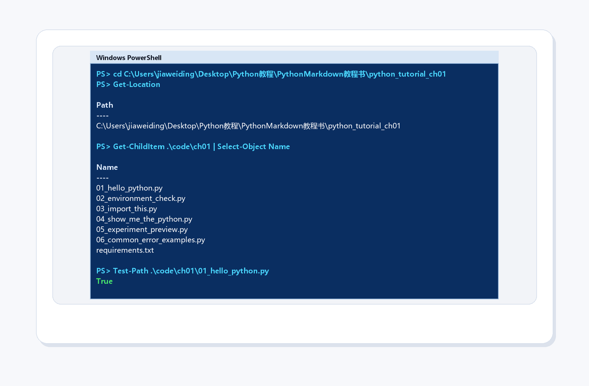
  <figcaption><strong>图1-2 PowerShell 项目目录定位</strong>：先进入本章项目目录，再确认 `code/ch01/` 里的脚本确实存在；程序找不到文件时，第一嫌疑往往是当前目录。</figcaption>
</figure>

当你输入命令时，用的就是路径。路径告诉电脑去哪里找文件或目录，分为两种：

- **相对路径**：从当前工作目录出发，比如 `code\ch01\01_hello_python.py` 表示"当前目录下的 `code/ch01/01_hello_python.py`"。
- **绝对路径**：从盘符或系统根目录出发，比如 `C:\Users\你的用户名\Desktop\...\python_tutorial_ch01`。

你可以在 Python 中查看当前工作目录：

```python
from pathlib import Path

print(Path.cwd())
```

初学阶段建议优先使用相对路径来描述项目内部的文件，这样项目换一台电脑或搬一个位置时，代码仍然能正常工作。

<figure align="center">
  
  <figcaption><strong>图1-3 路径地图</strong>：路径就是文件的地址，当前工作目录决定相对路径从哪里出发。</figcaption>
</figure>

第二步，检查解释器和 pip：

```powershell
python --version
python -m pip --version
python code\ch01\02_environment_check.py
```

请特别注意 `python -m pip --version` 这一行。它比单独写 `pip --version` 更稳，因为它明确告诉系统：请使用当前这个 Python 对应的 pip。以后遇到“明明安装了包，但代码说找不到”的情况，十有八九就要回到这一步排查。

<figure align="center">
  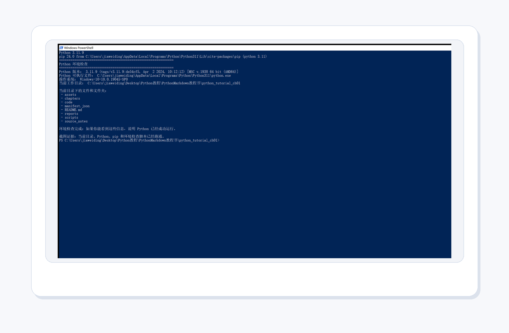
  <figcaption><strong>图1-3 本机 PowerShell 环境检查</strong>：真实运行时至少要看到 Python 版本、pip 路径、解释器路径和当前项目目录；截图里这些证据已经一次跑通。</figcaption>
</figure>

再补一个更细的“路径探针”。真实电脑经常不够“教科书”：`py -0p` 可能没有列出解释器，`where.exe python` 也可能只找到另一个入口，但 `sys.executable` 会告诉你这次真正运行脚本的是谁。后面在 PyCharm 里选解释器时，就要尽量对齐这个 `python.exe`；否则很容易出现 PowerShell 能跑、IDE 不能跑的尴尬场面。

<figure align="center">
  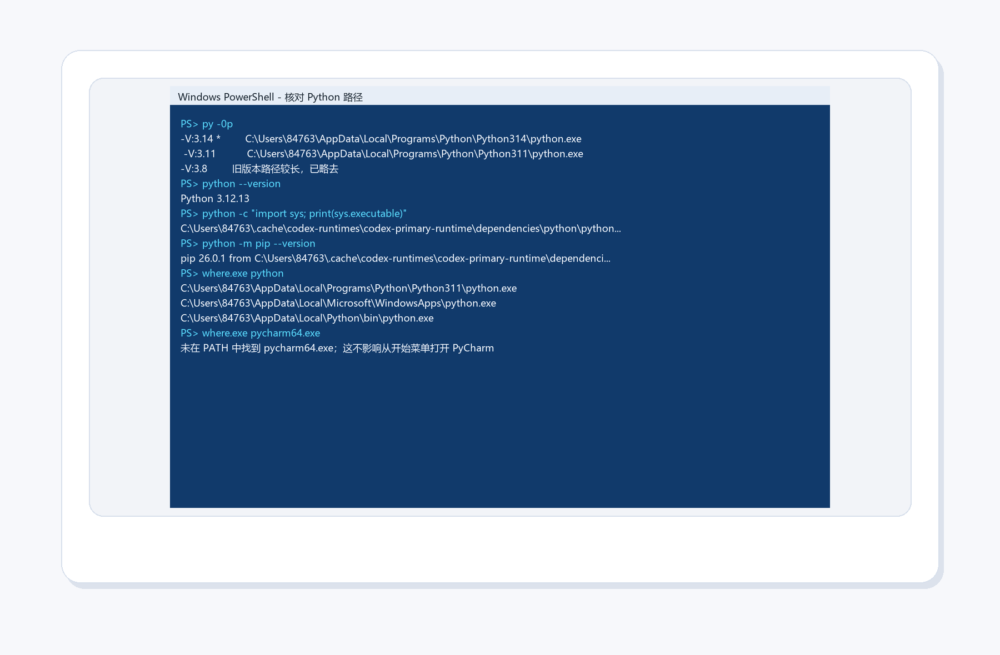
  <figcaption><strong>图1-4 PowerShell 安装与解释器总探针</strong>：这张图来自本机实际命令输出；`py -0p`、`sys.executable`、`python -m pip --version`、`where.exe python` 和 `where.exe pycharm64.exe` 要放在一起看，单看其中一个很容易误判。</figcaption>
</figure>

第三步，给本章项目准备一个独立虚拟环境：

```powershell
python -m venv .venv
.\.venv\Scripts\Activate.ps1
python -m pip --version
python code\ch01\01_hello_python.py
```

这一步的重点不是背命令，而是建立一个判断：本章脚本由哪个 Python 跑，pip 就应该属于哪个 Python。能说清楚这一点，就已经越过了新手环境配置里最容易打结的一段路。

<figure align="center">
  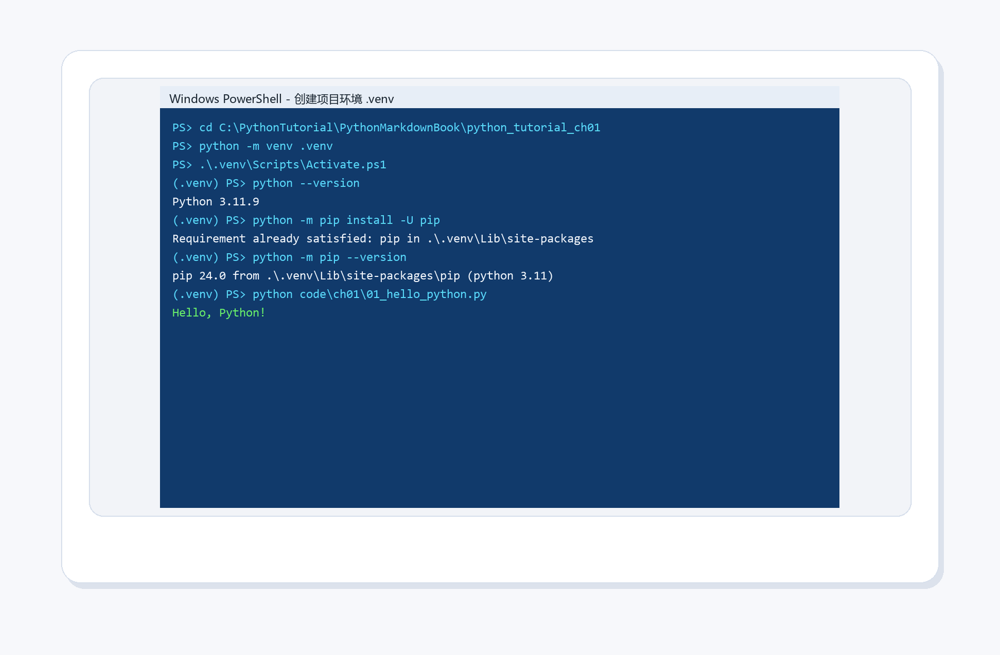
  <figcaption><strong>图1-5 PowerShell 创建 `.venv`</strong>：用 `python -m venv .venv` 给项目准备独立环境，激活后再检查 `python` 和 `pip`，可以避免把工具包装到别的 Python 里。</figcaption>
</figure>

如果 PowerShell 提示不允许运行脚本，不要慌。Windows 的执行策略有时会阻止 `Activate.ps1`。此时可以先不激活，直接使用 `.venv` 里的 Python：

```powershell
.\.venv\Scripts\python.exe -m pip --version
.\.venv\Scripts\python.exe code\ch01\01_hello_python.py
```

<figure align="center">
  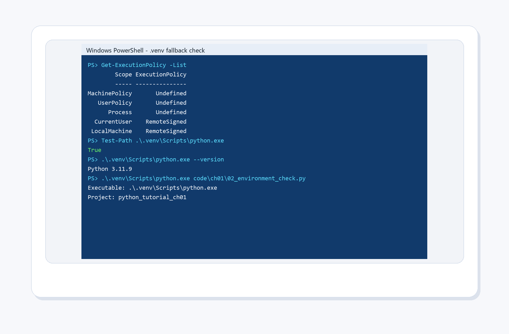
  <figcaption><strong>图1-6 PowerShell 备用运行 `.venv`</strong>：如果激活脚本被执行策略拦住，仍然可以直接调用 `.venv\Scripts\python.exe`；关键不是“有没有激活成功”，而是脚本到底由哪个 Python 执行。</figcaption>
</figure>

第四步，跑环境检查脚本：

```powershell
python code\ch01\02_environment_check.py
```

如果你能看到环境检查输出，就先小小松一口气，这表明你已经成功走完了运行一个 Python 脚本并读取运行证据的完整流程。学习编程最珍贵的不是一开始就写出华丽代码，而是清楚的知道代码真实运行的完整流程。接着可以连续运行版本检查、pip 检查、Hello 脚本和环境检查脚本，把证据一次收齐。

<figure align="center">
  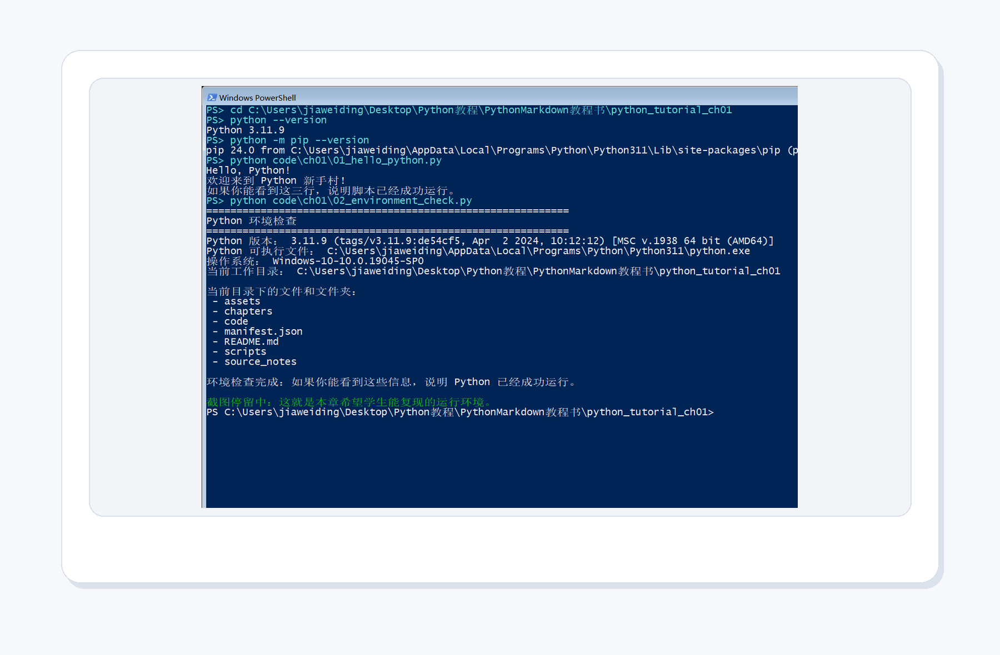
  <figcaption><strong>图1-7 PowerShell 连续运行脚本</strong>：能在终端里连续跑通版本检查、pip 检查、Hello 脚本和环境检查脚本。</figcaption>
</figure>


最后，把本章最关键的运行结果放到一张总览图里。它不是装饰图，而是环境配置的“通电证明”：以后哪里出问题，就回头核对这张图里出现过的路径、解释器和输出。

<figure align="center">
  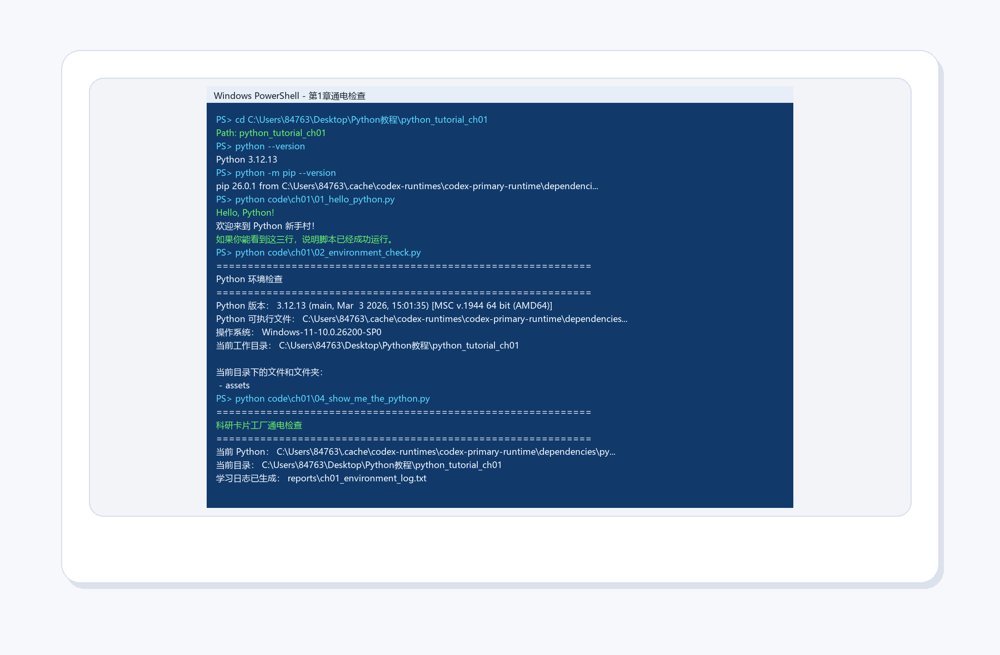
  <figcaption><strong>图1-8 PowerShell 本章运行证据总览</strong>：从版本、pip、Hello 脚本、环境检查脚本到通电日志，全部在同一个项目目录里跑通；这张图就是本章最重要的“我真的配置好了”证据。</figcaption>
</figure>

---

### 1.2 再进 PyCharm：让 IDE 使用同一个解释器

PowerShell 像验电笔，PyCharm 像工作台。验电笔证明电路通了，工作台负责让你更舒服地写代码、看文件、运行脚本和读报错。

新手最常见的问题是：PowerShell 里能运行，PyCharm 里却不能运行。原因通常不是代码突然变坏，而是 PyCharm 选了另一个 Python。下面按真实 PyCharm 配置界面完成 5 步核对；按钮名称可能随版本变化，但检查逻辑不变。

| 步骤 | PyCharm 里要核对什么 | 对应截图 |
| --- | --- | --- |
| 1 | 打开的项目目录是不是本章目录 | 图1-9、图1-10 |
| 2 | Python Interpreter 是不是 PowerShell 里验证过的解释器 | 图1-11、图1-12 |
| 3 | `.venv` 是新建还是复用已有环境 | 图1-13、图1-14 |
| 4 | Run Configuration 的脚本路径和工作目录是否正确 | 图1-15 到 图1-17 |
| 5 | 点击运行后，Run 窗口是否出现脚本输出 | 图1-18、图1-19 |

进入 PyCharm 后，先别急着写代码。第一眼只看四个位置：项目文件区、编辑区、运行按钮、底部 Run 窗口。界面再复杂，第一章只需要抓住这些“定位点”。

<figure align="center">
  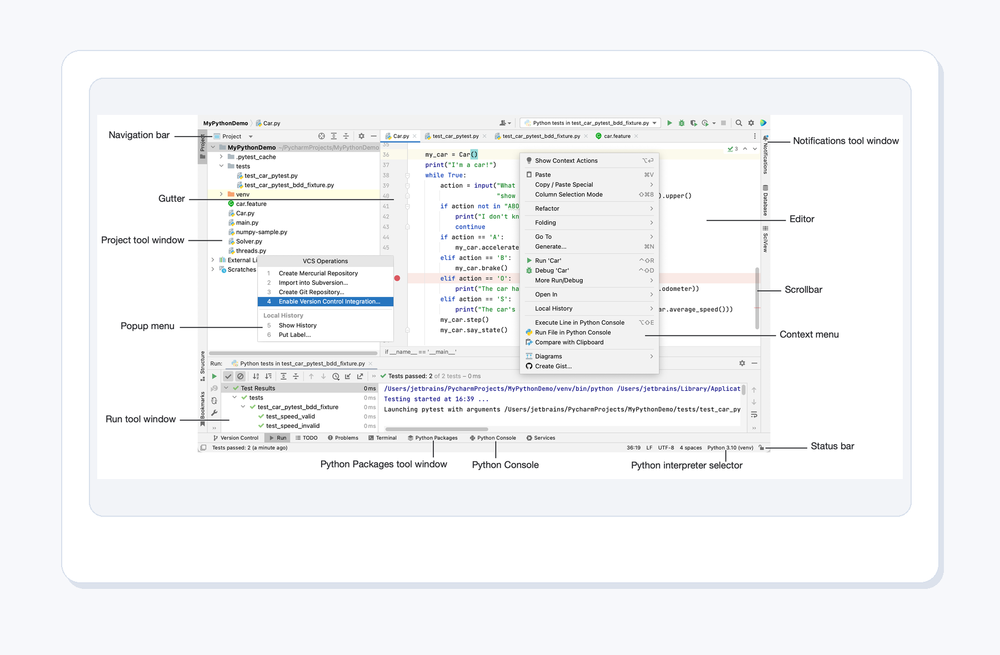
  <figcaption><strong>图1-9 PyCharm 主窗口总览</strong>：先认清项目文件区、编辑区、运行按钮和底部工具窗口；IDE 看起来复杂，其实第一章只需要盯住这些位置。</figcaption>
</figure>

打开 PyCharm 后，先选本章项目目录。不要只看项目名，要看完整位置。目标很明确：PyCharm 打开的目录，要和 PowerShell 中 `Get-Location` 显示的目录一致。

<figure align="center">
  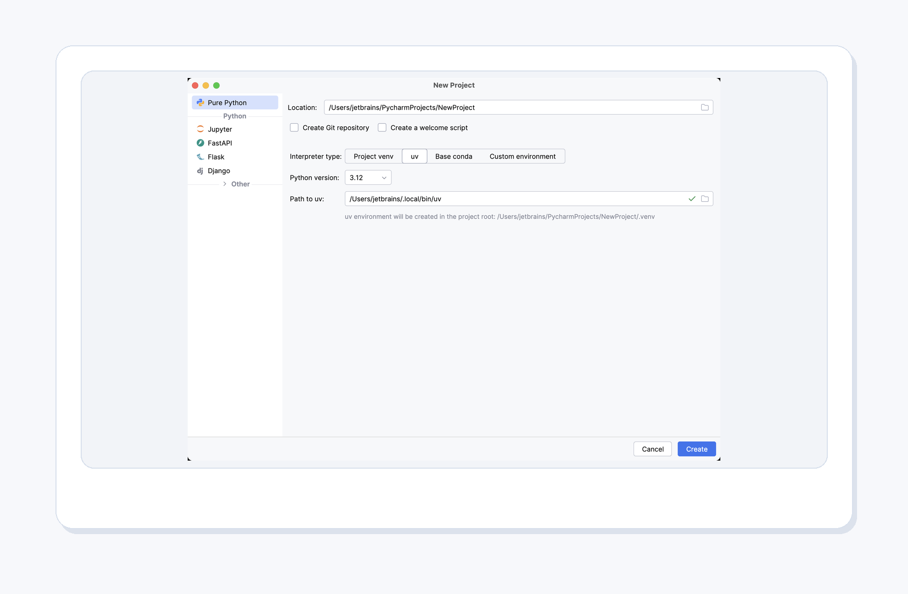
  <figcaption><strong>图1-10 PyCharm 新建项目</strong>：真实界面里先确认项目位置，再确认解释器类型；项目目录和环境目录越清楚，后面越不容易迷路。</figcaption>
</figure>

找到 Python Interpreter 入口后，不要只看 `Python 3.x` 几个字。真正要看的，是解释器路径是否和 PowerShell 里 `02_environment_check.py` 输出的 `sys.executable` 对得上。

<figure align="center">
  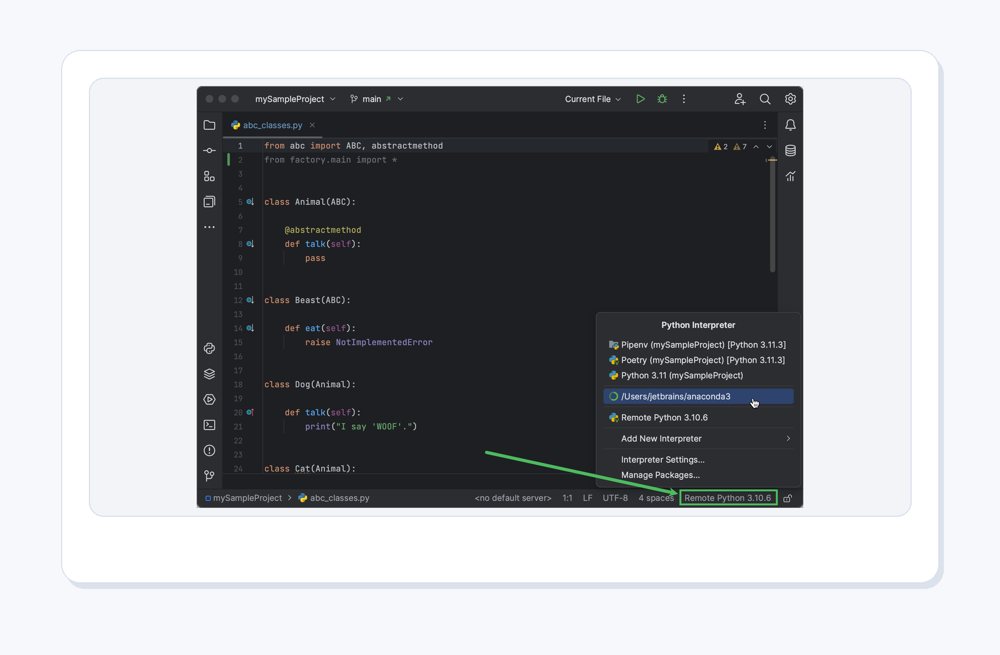
  <figcaption><strong>图1-11 PyCharm 解释器入口</strong>：在 PyCharm 中先确认当前项目正在使用哪个 Python 解释器。</figcaption>
</figure>

如果列表里有多个解释器，不要凭感觉乱选。路径比名字可靠：同样叫 Python 3.x，背后可能是官方 Python、Anaconda、`.venv`，甚至是一个你早就忘记装过的版本。

<figure align="center">
  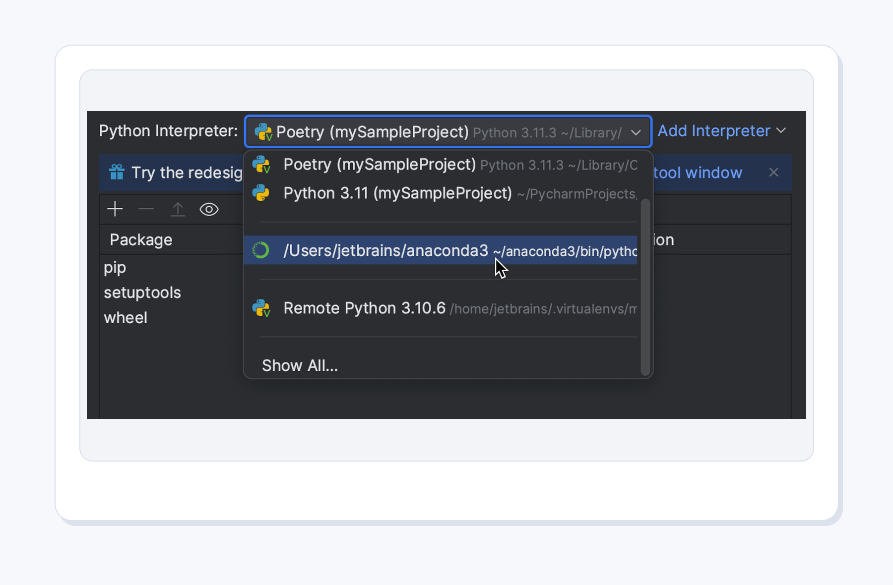
  <figcaption><strong>图1-12 PyCharm 解释器列表</strong>：如果列表里有多个解释器，要选择和当前项目匹配的一项；多个 Python 并存时，路径比名字更可靠。</figcaption>
</figure>

创建虚拟环境时，`Location` 可以放在项目目录下的 `.venv`。环境目录跟着项目走，后面查包、查路径、搬项目都会清楚很多。

<figure align="center">
  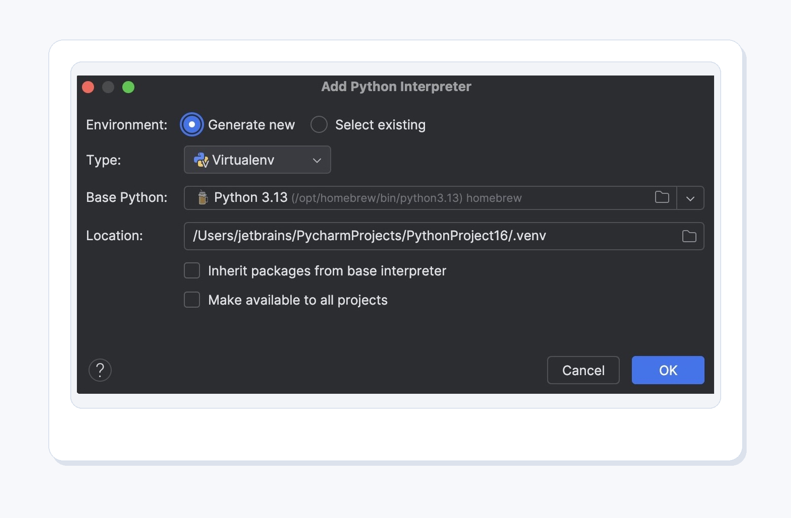
  <figcaption><strong>图1-13 PyCharm 创建 virtualenv</strong>：建议把环境放在项目目录下的 `.venv`，这样项目、解释器和依赖关系更清楚。</figcaption>
</figure>

如果你已经在 PowerShell 中创建过 `.venv`，PyCharm 里更推荐选择已有环境，并指向 `.venv\Scripts\python.exe`。环境越少，线索越清楚；同一个项目里同时冒出 `.venv`、`venv`、`PythonProject/.venv`，很容易让人怀疑自己在参加解释器捉迷藏。

<figure align="center">
  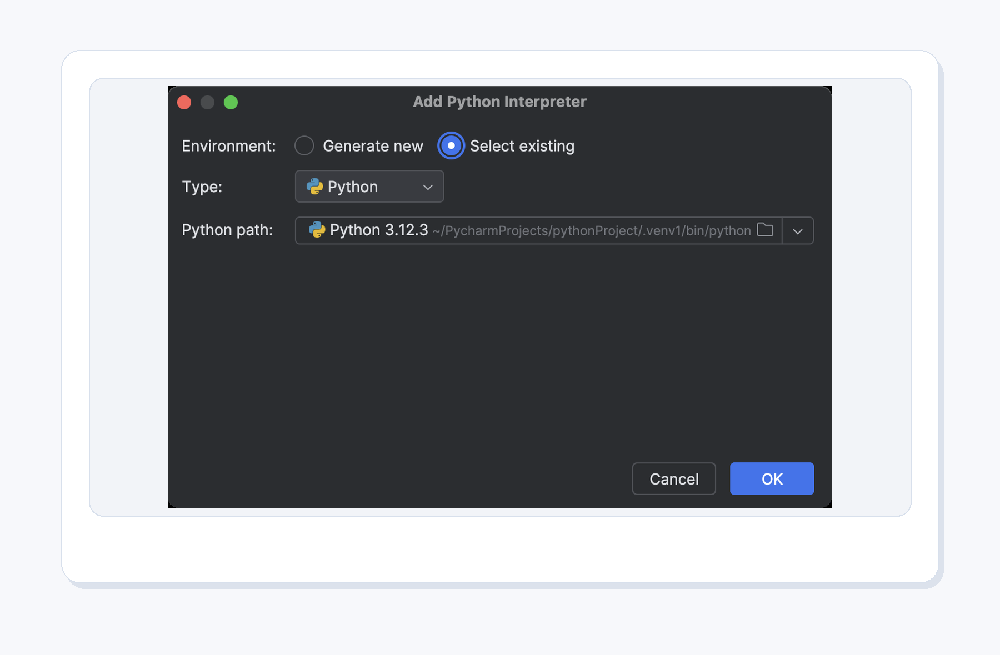
  <figcaption><strong>图1-14 PyCharm 选择已有 virtualenv</strong>：PowerShell 已经创建过 `.venv` 时，选择 Existing environment，并指向 `.venv\Scripts\python.exe`，让终端和 IDE 使用同一个解释器。</figcaption>
</figure>

解释器选对以后，还要检查“运行配置”。很多人的代码没有错，错的是 PyCharm 运行时的脚本路径或工作目录。换句话说，厨师没问题，菜谱也没问题，只是厨房地址填错了。

<figure align="center">
  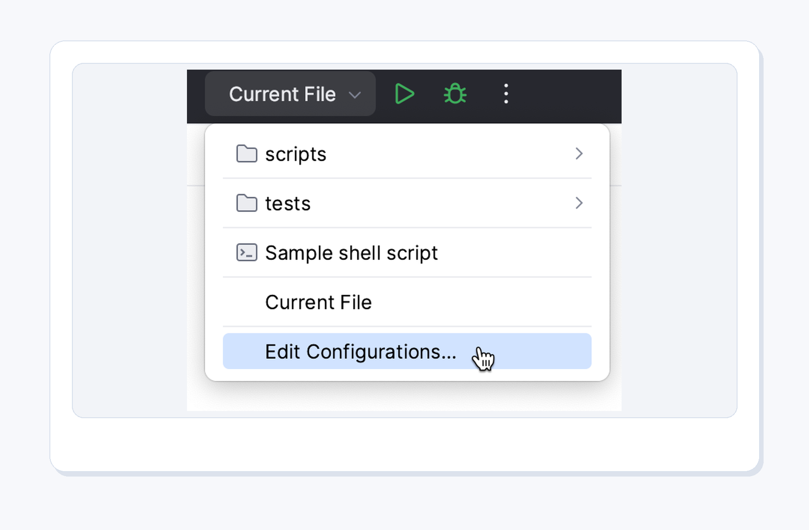
  <figcaption><strong>图1-15 PyCharm 进入运行配置</strong>：从右上角运行配置菜单进入 Edit Configurations，不要只依赖 Current File；第一章建议明确配置一次脚本路径和工作目录。</figcaption>
</figure>

如果你打开以后看到的是“未添加运行配置”或一大片空白，不要慌。这不是 Python 没装好，也不是项目坏了，只是 PyCharm 还不知道你想运行哪个 `.py` 文件。运行配置本质上是一张小卡片，记录三件事：用哪个 Python、运行哪个脚本、从哪个文件夹开始运行。

第一次可以这样新建：

1. 点击左上角的 `+`。
2. 选择 `Python`。
3. `Name` 可以写 `ch01_hello` 或 `ch01_environment_check`。
4. `Script path` 选择 `code/ch01/01_hello_python.py`；如果想检查环境，就选择 `code/ch01/02_environment_check.py`。
5. `Working directory` 选择本章项目目录，也就是 `python_tutorial_ch01`。
6. `Python interpreter` 选择前面确认过的解释器，最好能和 PowerShell 里看到的路径对上。

它的影响也很简单：没有运行配置时，PyCharm 不能稳定记住“运行谁”。你仍然可以右键某个 `.py` 文件选择 Run，让 PyCharm 自动创建一个临时配置；但对新手来说，手动建一次更清楚，因为你能亲眼确认脚本路径和工作目录。

进入配置窗口后，重点核对四件事：Python interpreter、Script path、Working directory 和环境变量。第一章的脚本路径应当指向 `code/ch01/01_hello_python.py` 或 `code/ch01/02_environment_check.py`，工作目录应当指向本章项目目录。

<figure align="center">
  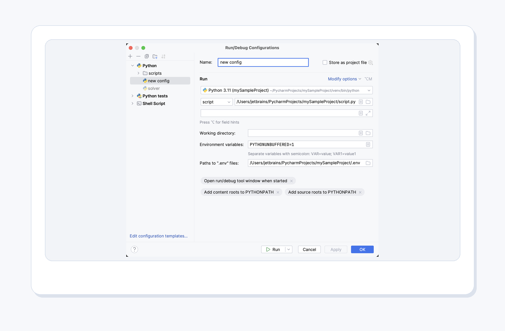
  <figcaption><strong>图1-16 PyCharm 运行配置窗口</strong>：核对解释器、脚本路径、工作目录和环境变量；尤其要保证 `script.py` 换成本章的 `code/ch01/01_hello_python.py` 或 `02_environment_check.py`。</figcaption>
</figure>

如果界面里暂时看不到 Working directory 或 Environment variables，不要以为它们不存在。PyCharm 会把一些选项收起来，可以从 Modify options 中打开；这些字段决定程序从哪里找文件、用什么参数运行。

<figure align="center">
  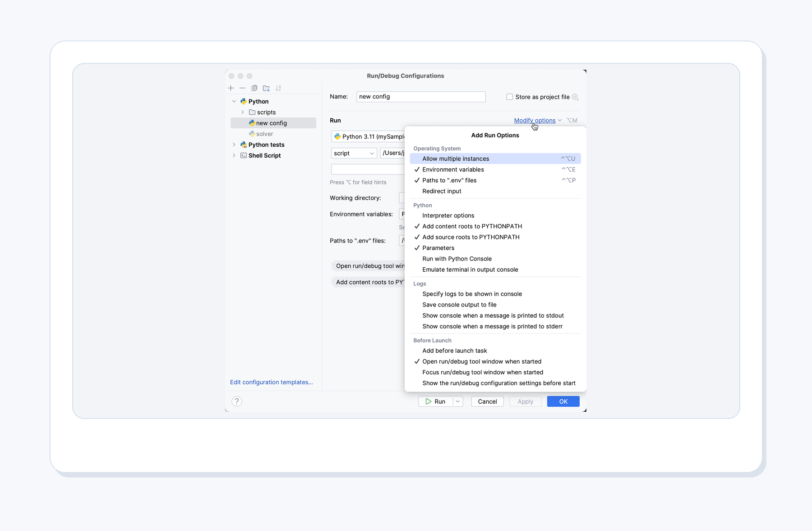
  <figcaption><strong>图1-17 PyCharm 运行选项</strong>：如果界面里暂时看不到 Working directory 或 Environment variables，可以从 Modify options 中打开；这些字段决定程序从哪里找文件、用什么参数运行。</figcaption>
</figure>

配置完成后，回到右上角运行按钮。先确认当前选中的不是随手打开的 Current File，而是你刚才核对过的运行配置；再点击绿色三角运行。

<figure align="center">
  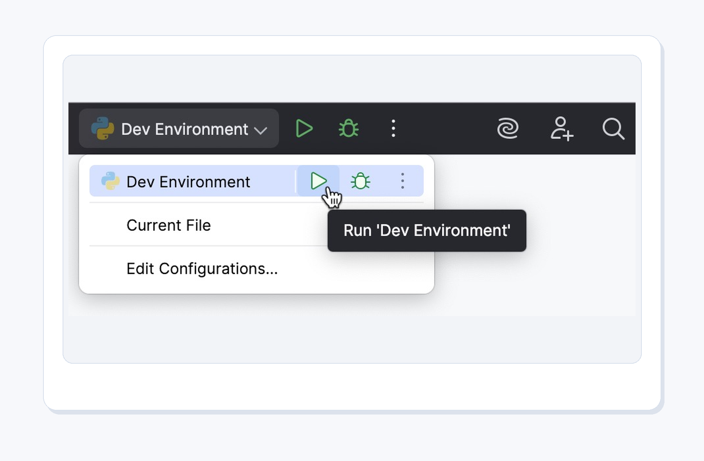
  <figcaption><strong>图1-18 PyCharm 运行按钮</strong>：确认当前选中的不是随手打开的 Current File，而是你刚才核对过的运行配置；点击绿色三角后，再到 Run 窗口看输出。</figcaption>
</figure>

运行后，底部 Run 窗口才是最终结果。能看到脚本输出、退出码正常，并且解释器路径能和 PowerShell 里对上，才算 PyCharm 真的接到了同一条环境链路上。

<figure align="center">
  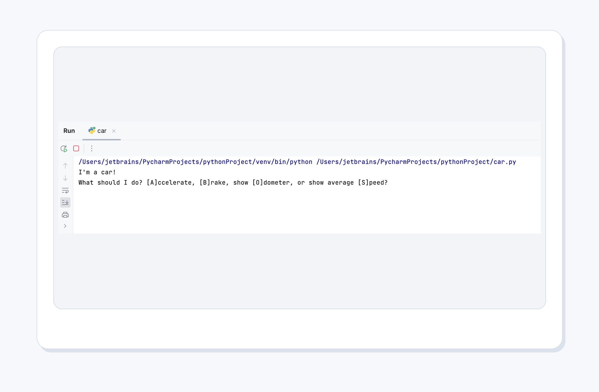
  <figcaption><strong>图1-19 PyCharm Run 窗口</strong>：最后一定要看 Run 窗口输出；能运行脚本、能看到结果、能对上解释器路径，才是真正配置完成。</figcaption>
</figure>

最后把解释器路径和 Run 输出放在一起核对。上面看“谁在运行”，下面看“运行出了什么”；这两个证据对上，IDE 配置才不是凭感觉成功。

<figure align="center">
  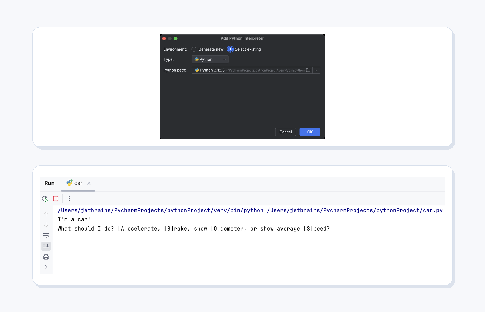
  <figcaption><strong>图1-20 PyCharm 解释器与运行结果核对</strong>：上半部分看解释器路径，下半部分看 Run 窗口输出；在 Windows 上路径会长得像 `C:\...\python.exe`，但核对逻辑完全一样。</figcaption>
</figure>

如果 PyCharm 截图里的示例脚本名和本章不同，不要被它带跑。你真正要核对的是三个位置：解释器路径、脚本路径、Run 输出。示例界面只是帮你认按钮和区域；在自己的电脑上，要把脚本换成本章的 `code/ch01/01_hello_python.py` 或 `code/ch01/02_environment_check.py`。

<figure align="center">
  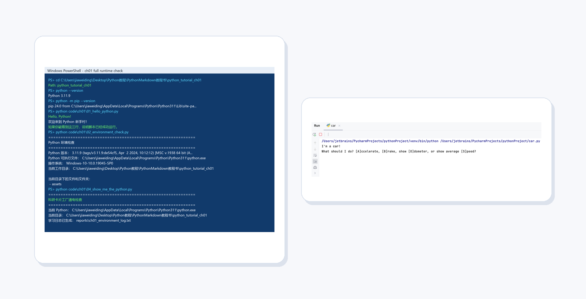
  <figcaption><strong>图1-21 PowerShell 与 PyCharm 同屏核对</strong>：左边是本章 PowerShell 运行证据，右边是真实 PyCharm Run 窗口位置；在你的电脑上，右侧也应该运行本章脚本，并对齐同一个解释器。</figcaption>
</figure>

PyCharm 的配置不用背按钮，只记住这 6 个核对点：

| 核对点 | 要看到什么 |
| --- | --- |
| Project location | 打开的目录就是 `python_tutorial_ch01` |
| Python Interpreter | 路径和 PowerShell 里验证过的 Python 对得上 |
| Existing environment | 已有 `.venv` 时优先选 `.venv\Scripts\python.exe` |
| Script path | 指向 `code/ch01/01_hello_python.py` 或 `02_environment_check.py` |
| Working directory | 指向本章项目目录 |
| Run output | Run 窗口能看到脚本输出和解释器路径 |

---

## 第二部分：认识 Python：从故事到设计哲学

### 1.3 用一个短故事记住本章重点

环境链路跑通以后，再听一个短故事就够了：Python 的名字和 BBC 喜剧《Monty Python's Flying Circus》有关。Guido van Rossum 回忆过，1989 年 12 月圣诞假期前后，他想找一个能让自己投入的业余编程项目，于是开始写一个新的脚本语言解释器。

<figure align="center">
  
  <figcaption><strong>图1-22 CWI：Python 故事的起点之一</strong>：Python 的早期想法来自真实工作环境，也服务于真实的编程需求。</figcaption>
</figure>

这个故事的重点不是“Python 很浪漫”，而是：好工具常常从真实需求里长出来。第1章也不追求宏大叙事，只抓住一条实用链路：解释器负责执行，脚本负责记录步骤，PowerShell 负责验证，PyCharm 负责日常操作，pip 负责补工具，项目目录负责放材料和结果。

| Python 概念 | 初学者讲法 | 本章要会做的动作 |
| --- | --- | --- |
| Python 解释器 | 真正执行代码的程序 | 用 `python --version` 和 `sys.executable` 找到它 |
| `.py` 文件 | 保存任务步骤的脚本 | 运行 `01_hello_python.py` |
| PowerShell | 直接和系统对话的窗口 | 检查目录、版本、pip 和脚本输出 |
| PyCharm | 写代码和看结果的工作台 | 打开项目、选解释器、运行脚本 |
| pip | 安装第三方包的工具 | 使用 `python -m pip` 确认它属于当前 Python |
| 项目目录 | 文件和结果的固定位置 | 确认代码、报告和素材没有放错地方 |
| 报错信息 | 程序给你的返工线索 | 先读错误类型，再看路径和行号 |

以后遇到环境问题，先问四件事：我站在哪个目录？我运行的是哪个 Python？pip 属于这个 Python 吗？报错提示的是路径、包，还是代码本身？

---

### 1.4 Python 到底是什么？先够用，不背定义

| 概念 | 第一章够用理解 | 马上要会做的事 |
| --- | --- | --- |
| Python 解释器 | 真正执行代码的程序 | 用 `sys.executable` 找到它 |
| `.py` 脚本 | 保存操作步骤的文件 | 运行 `01_hello_python.py` |
| 终端 / IDE | 让你运行、观察、排错的工作台 | 在 PowerShell 和 PyCharm 中看输出 |

所以第一章不急着背“跨平台、解释型、面向对象”。先让电脑回应你：

```python
print("请开始整理数据")
```

这句话很小，但它已经完成了编程的第一件事：把人的意图变成电脑能执行的步骤。能运行，才有资格继续谈语法；跑不起来，再优雅的定义都像贴在门外的说明书。

---

### 1.5 Python 为什么适合初学者？

这里不展开整套学习路线，只保留三个和本章有关的理由：Python 免费、资料多、反馈快。比如计算 1 到 10 的和：

```python
total = sum(range(1, 11))
print(total)
```

Python 的生态也丰富。需要数据分析，可以找 pandas；需要图像处理，可以找 Pillow；需要网页请求，可以找 requests。所以 `pip` 很关键，你以后会经常看到：

```bash
python -m pip install requests
python -m pip install pandas
python -m pip install pygame
```

这就是为什么本章反复核对 `python -m pip`：包不是“装在电脑里”就完事，而是要装进正在运行的那个 Python 环境里。

---

### 1.6 Python 的设计哲学：优雅就是少绕路

Python 有一套很有名的设计哲学，叫 **The Zen of Python**。在 Python 中输入：

```python
import this
```

你会看到几句特别适合初学者的话：

```text
Beautiful is better than ugly.
Explicit is better than implicit.
Simple is better than complex.
Readability counts.
```

翻译成人话：明白、简单、可读，真的会救命。三天后再打开自己的代码，如果变量名像密电码，未来的你会认真怀疑过去的你是不是在加密通讯。所以从第一章开始，变量名先写清楚：

```python
# 坏味道：看起来像密电码
x=3.14*r*r

# 好一点：变量名能说明意图
circle_area = 3.14 * radius * radius
```

代码写给电脑执行，也写给人阅读。电脑不在乎变量名好不好看，人会在乎，尤其是未来的你。

#### 1.6.1 为什么 `import antigravity` 会成为经典？

<figure align="center">
  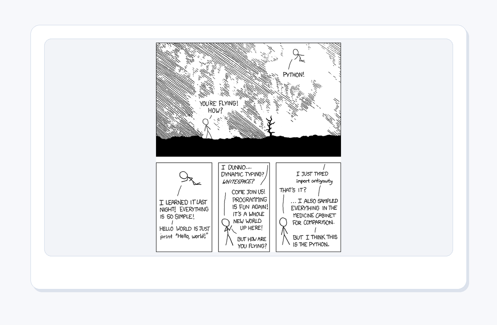
  <figcaption><strong>图1-23 import antigravity</strong></figcaption>
</figure>


这张 梗图不是说 Python 真能让人飞起来，而是在夸张表达一种体验：短代码、快反馈、立刻看见结果。它也顺手带出一个正式概念：`import` 是导入模块。以后你导入的每个工具，最终都要落到某个具体 Python 环境里，所以本章才一直核对解释器和 pip。

---

### 1.7 Python 在心理学和科研中能做什么？

<figure align="center">
  
  <figcaption><strong>图1-24 Wundt 实验室</strong>：心理学很早就和实验装置、反应记录、时间测量联系在一起；Python 只是给这些任务换上了现代工具。</figcaption>
</figure>

心理学不是只有背理论和做问卷。早期实验心理学就很关心刺激、反应、时间、记录和可重复性。Python 的价值也很直接：呈现刺激、记录按键、保存数据、清洗 CSV、画图、生成报告。

<figure align="center">
  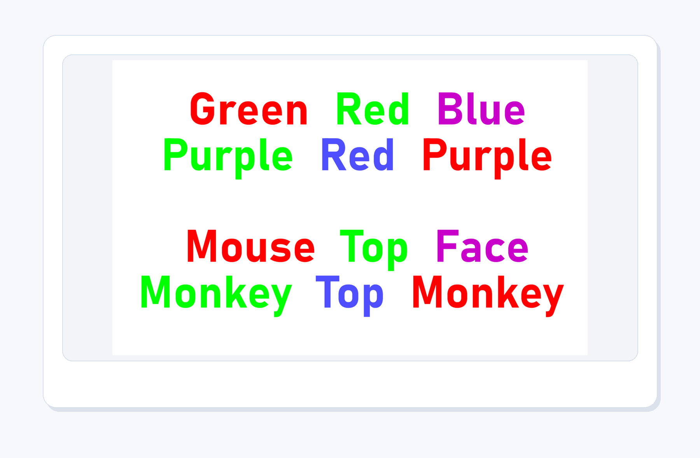
  <figcaption><strong>图1-25 Stroop 效应素材</strong>：颜色词任务很适合当 Python 入门实验例子，因为它同时包含刺激、反应、正确答案和反应时。</figcaption>
</figure>

一个极简 Stroop 任务就包含"呈现刺激、等待按键、判断正误、记录反应时"。后面章节会把这些能力拆开：第2章整理数据，第3章保存文件，第4章做界面，第6章分析与可视化，第10章导出报告。ch1 只负责一件事：先把工具通电。

---

### 1.7.1 你需要认识的四个地方

<figure align="center">
  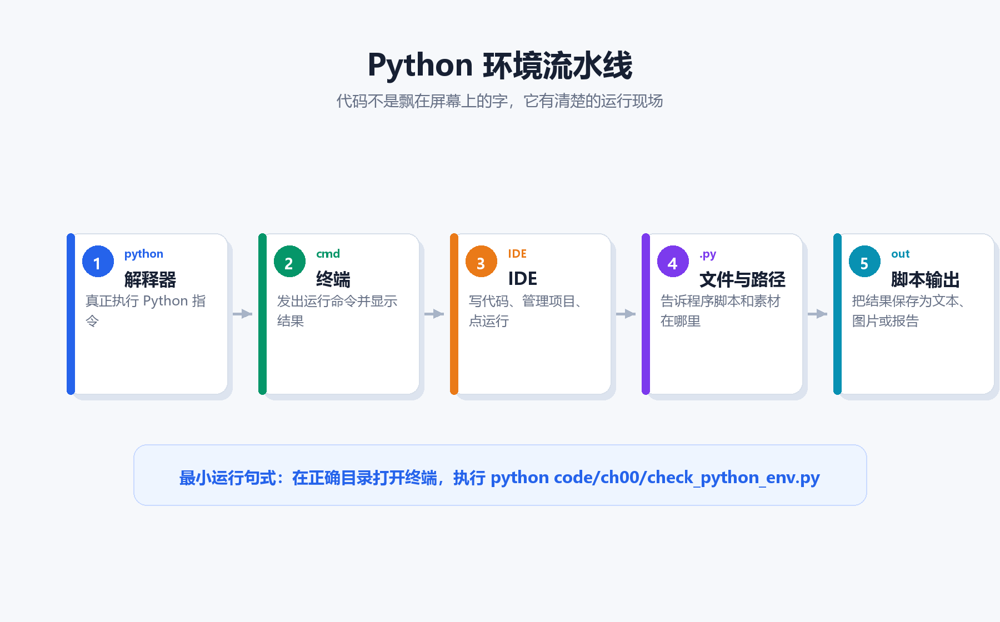
  <figcaption><strong>图1-26 Python 环境流水线</strong>：解释器、终端、IDE、文件和脚本共同组成代码运行的现场。</figcaption>
</figure>

初学 Python，你最先需要认识四个地方。

#### Python 解释器：真正干活的人

Python 解释器负责执行你的代码。你写：

```python
print("hello world")
```

解释器看懂后，告诉电脑在屏幕上显示文字。

比喻一下：你是导演，代码是剧本，解释器是剧组执行导演。你不能只对空气喊"我要一个大场面"，你要把剧本写清楚。

检查解释器是否可用，可以在终端输入：

```bash
python --version
```

或者：

```bash
python3 --version
```

如果它输出版本号，说明 Python 至少能被系统找到。如果它说找不到命令，也不要急着怀疑人生，通常是安装路径或环境变量没有配置好。

<figure align="center">
  
  <figcaption><strong>图1-27 ENIAC 早期程序员</strong>：今天运行 `python file.py` 很轻松，是因为许多复杂工作已被工具隐藏起来。</figcaption>
</figure>

今天你在终端里输入 `python file.py`，电脑就会执行脚本，这件事其实已经非常奢侈。早期的程序员面对 ENIAC 这样的机器时，编程常常意味着接线、拨开关、重新配置硬件。那时的"运行程序"更像是在给一台巨大的电气机器布置现场。

Python 把这件事大大简化了：你的程序可以是一份普通文本文件，解释器负责把它变成电脑能执行的动作。第1章让你认识解释器、终端、IDE 和项目目录，就是为了让你从第一天开始知道：代码不是飘在屏幕上的字，它有运行入口，也有工作现场。

#### 终端：和电脑直接对话的窗口

终端有很多名字：命令行、Terminal、cmd、PowerShell、Anaconda Prompt。它们的共同点是：你输入命令，电脑执行。

初学者必须会这几个命令：

| 任务 | Windows 常用 | macOS / Linux 常用 | 人话解释 |
|---|---|---|---|
| 查看当前位置 | `cd` | `pwd` | 我现在站在哪个文件夹里 |
| 查看文件 | `dir` | `ls` | 这里有哪些东西 |
| 进入文件夹 | `cd folder_name` | `cd folder_name` | 走进某个房间 |
| 返回上级 | `cd ..` | `cd ..` | 从房间退回走廊 |
| 运行脚本 | `python file.py` | `python3 file.py` 或 `python file.py` | 让 Python 执行文件 |
| 安装包 | `pip install 包名` | `pip install 包名` | 从网上拿工具 |

终端并不神秘。它只是没有图标、没有按钮、没有温柔提示音。所以它看起来像黑社会，其实只是一个穿黑衣服的客服。

#### IDE：写代码的驾驶舱

IDE 是集成开发环境。你可以用 IDLE、Spyder、VS Code、PyCharm、Jupyter Notebook 等工具写 Python。

初学者可以这样选择：

| 工具 | 适合谁 | 优点 | 注意点 |
|---|---|---|---|
| IDLE | 第一次接触 Python 的学习者 | Python 自带，轻量 | 功能简单，适合入门不适合大项目 |
| Spyder | 数据分析、习惯 MATLAB 风格的学习者 | 有变量窗口，所见即所得 | 大项目管理能力一般 |
| VS Code | 希望长期写项目的学习者 | 插件强、轻量、通用 | 第一次配置略有门槛 |
| PyCharm | 想做较完整工程的学习者 | 项目管理强 | 稍重，初学可能觉得功能太多 |
| Jupyter Notebook | 数据分析、交互练习 | 一格一格运行，反馈快 | 容易把代码写散，要注意整理 |

本教程不会强制你使用某一个 IDE。工具是鞋，不是宗教。合脚最重要。第一章前面已经带你在 PowerShell 和 PyCharm 中都跑了一遍脚本，你会发现本节提到的四个工具正好对应你刚才的操作。

#### 项目目录：给卡片工厂分好仓库

很多初学者有一个坏习惯：所有代码都放桌面。桌面最后变成这样：

```text
新建文件夹
新建文件夹(2)
最终版.py
最终版_修改.py
最终版_真的最终.py
最终版_这次绝对不改.py
作业.py.txt
```

这不是项目，这是灾后现场。

<figure align="center">
  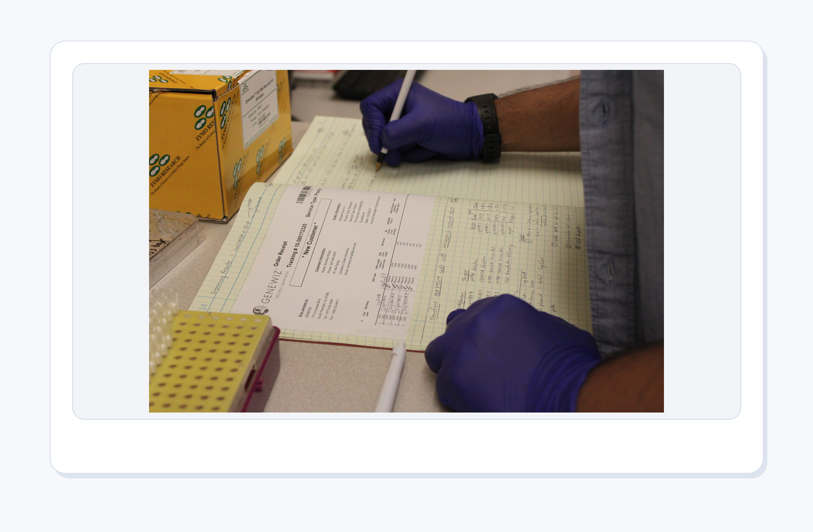
  <figcaption><strong>图1-28 实验笔记本</strong>：可复现不是口号，而是把材料、步骤、结果和问题都留下痕迹。</figcaption>
</figure>

实验笔记本的价值，不只是"写过一些字"，而是让后来的人知道：材料从哪里来，做过什么处理，结果保存在哪里，哪一步可能出错。科研卡片工厂也一样。文件夹不是装饰，它们是可复现的最低配置。材料、卡片、结果、报告混在一起时，程序还没开始跑，混乱已经赢了。

一个干净的卡片工厂目录应该像这样：

```text
python_card_factory/
├── README.md
├── code/
│   └── ch01/
├── input/
├── cards/
├── output/
├── reports/
└── assets/
```

含义如下：

| 文件夹 | 放什么 | 规则 |
|---|---|---|
| `code/` | Python 脚本 | 文件名用英文、数字、下划线 |
| `input/` | 原料，如笔记、摘录、表格 | 尽量保留原始材料 |
| `cards/` | 生成后的学习卡片 | 一张卡片讲清一个知识点 |
| `output/` | 图表、临时结果、导出文件 | 可以清空后重新跑 |
| `reports/` | 报告、运行日志、复盘记录 | 记录你踩过的坑和修复方式 |
| `assets/` | 图片、图标、素材 | 给教程或程序使用 |

本章前面已经操作过 PowerShell 目录定位、PyCharm 项目打开和脚本运行，这四个地方你已经接触过，这里只是把它们放在一起梳理清楚。

---

## 第三部分：从脚本到可检查证据

### 1.8 把“我装好了”变成可检查

前面已经把 PowerShell 和 PyCharm 的真实界面放到了本章开头。这里不再重复操作，只保留一张复盘表。以后环境出问题时，先查表，不要一上来重装。

| 你要确认的问题 | 最可靠的证据 | 在哪里得到 |
| --- | --- | --- |
| 电脑能不能找到 Python | `python --version` 有输出 | PowerShell |
| pip 属不属于当前 Python | `python -m pip --version` 的路径 | PowerShell |
| 当前脚本由哪个 Python 执行 | `sys.executable` | `02_environment_check.py` / PyCharm Run |
| 程序站在哪个目录运行 | `Path.cwd()` | `02_environment_check.py` / PyCharm Run |
| IDE 是否配置成功 | Run 窗口能显示脚本输出 | PyCharm |

如果 PowerShell 能跑、PyCharm 也能跑，并且两边的解释器路径能对上，这章的环境配置就算真正完成。以后遇到“终端能运行，IDE 不行”或“安装了包却导入失败”，先回到这张表。

#### 1.8.1 pip：给当前解释器补工具

<figure align="center">
  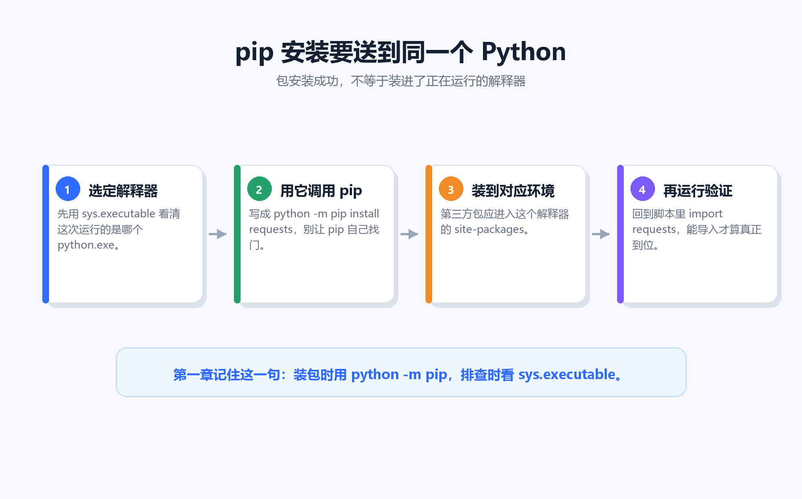
  <figcaption><strong>图1-26 pip 管线模型</strong>：第三方包从开源社区进入本机环境，关键是确认它送到了正在运行的 Python 里。</figcaption>
</figure>

pip 是 Python 常用的包安装工具。比如你需要 requests：

```bash
python -m pip install requests
```

为什么推荐写成 `python -m pip install`，而不是直接 `pip install`？因为有些电脑里可能有多个 Python。直接写 `pip` 有时会把包装到另一个 Python 环境里。你以为工具进了你的卡片工厂，实际上它被快递小哥送到隔壁楼了。你运行代码时就会出现：

```text
ModuleNotFoundError: No module named 'requests'
```

写成 `python -m pip` 可以更明确地告诉系统：请用当前这个 Python 对应的 pip 来安装。

#### 1.8.2 环境为什么会变成迷宫？

<figure align="center">
  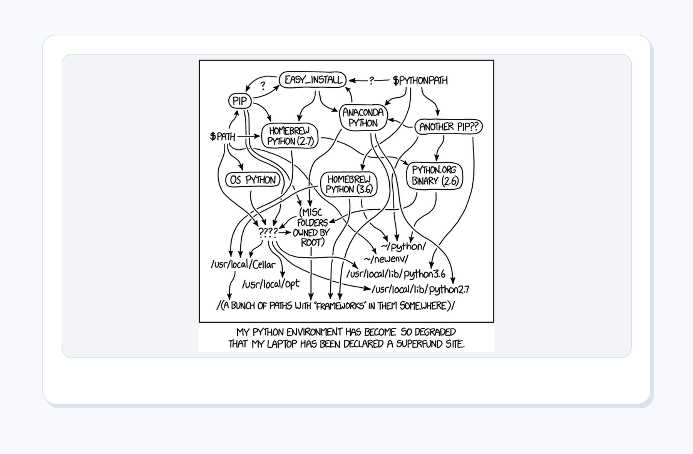
  <figcaption><strong>图1-27 xkcd 1987：Python 环境</strong>：环境问题并不玄学，先确认解释器、pip 和项目目录是不是同一套。</figcaption>
</figure>

xkcd 第 1987 期《Python Environment》把这种混乱画成了一团线：`PATH`、`PYTHONPATH`、Anaconda、系统 Python、另一个 pip、各种安装目录，全都缠在一起。它好笑，是因为很多人真的经历过：明明显示安装成功，运行时却提示 `ModuleNotFoundError`。

这张图只需要带走三句话：

1. 一台电脑可以同时存在多个 Python。
2. `pip install` 成功，不等于装进了你正在运行的那个解释器。
3. 环境出问题时，先看 `sys.executable`、`python -m pip --version` 和当前工作目录。

---

### 1.9 安装路线：先选一条能跑通的路

Python 的安装路线很多，但第一章不需要把所有工具都装一遍。当前最稳的策略是：**先让一条路线跑通，再扩展工具。**

| 如果你现在主要做什么 | 先选哪条路 |
| --- | --- |
| 基础语法、脚本、文件处理、自动化 | 官方 Python + PowerShell + PyCharm |
| 数据分析、可视化、科学计算 | 后续再补 Anaconda、Jupyter 或 Spyder |

第一章先以 **PowerShell + PyCharm + 一个明确的 Python 解释器** 为主。一上来同时安装官方 Python、Anaconda、多个 IDE，很容易把电脑变成“解释器自助餐”，每个看起来都能吃，最后不知道自己拿的是哪一盘。

不管选哪条路线，最终通关标准只有一个：

```bash
python --version
python -m pip --version
python path/to/your_script.py
```

能看到版本号，能看到 pip，能运行脚本。  
其他都是装修风格。

<figure align="center">
  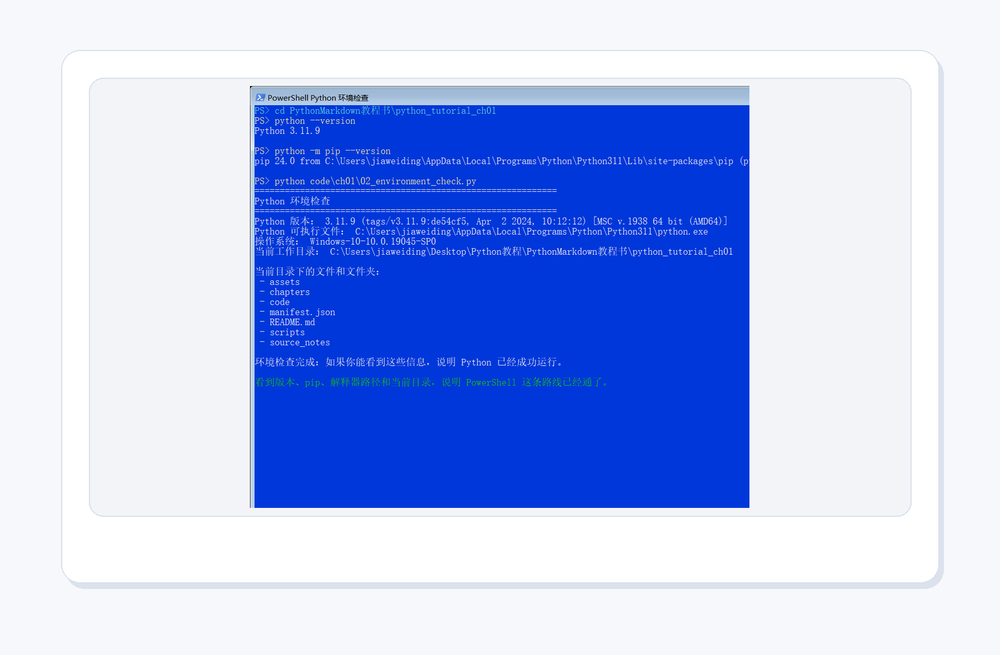
  <figcaption><strong>图1-28 PowerShell 环境检查复盘</strong>：版本、pip、解释器路径和当前目录最好放在同一次检查里看；环境问题通常藏在这些路径细节里。</figcaption>
</figure>

这张图不是让你再背一遍命令，而是在训练一种排查姿势：先确认“谁在运行”，再确认“包送到哪里”，最后确认“脚本站在哪里”。只要这三件事对齐，环境配置就不再像玄学。

---

### 1.10 第一个 Python 程序：Hello, Python!

在 `code/ch01/` 文件夹中新建一个文件：

```text
01_hello_python.py
```

写入：

```python
print("Hello, Python!")
print("欢迎来到 Python 新手村！")
```

运行以后，应该看到：

```text
Hello, Python!
欢迎来到 Python 新手村！
```

这段代码非常简单，但它意义重大。因为它说明：

1. Python 已经能运行。
2. 解释器能找到你的脚本。
3. 你的编辑器能保存代码。
4. 你的终端或 IDE 能显示输出。
5. 你已经完成从“安装软件”到“运行程序”的跨越。

第一段代码不要追求酷。第一段代码要追求确定。就像第一次下厨，别上来挑战分子料理，先把泡面煮熟，别把调料包连袋煮进去，就很成功。

<figure align="center">
  
  <figcaption><strong>图1-29 Grace Hopper 与 UNIVAC</strong>：早期编程要把机器、指令和运行现场对齐；今天的 `Hello, Python!` 也是在确认这条链路真的通了。</figcaption>
</figure>

早期程序员面对的不是一个干净的绿色运行按钮，而是一台巨大的机器、一摞说明、一串必须严丝合缝的操作。今天我们只写两行 `print()` 就能看到输出，是因为许多复杂环节已经被解释器、终端和 IDE 接住了。第一章要学的，就是把这些环节认清楚。

---

### 1.11 print()：第一章最重要的反馈按钮

`print()` 是输出函数。它可以把内容打印到屏幕上。

```python
print("Python 很好玩")
print(2025)
print(3.14159)
```

输出：

```text
Python 很好玩
2025
3.14159
```

为什么第一章强调 `print()`？  
因为初学阶段，反馈非常重要。你需要不断知道程序执行到哪里、变量是什么、结果有没有变化。

例如：

```python
student_name = "小蒋"
reaction_time = 523

print("被试姓名：", student_name)
print("反应时：", reaction_time, "毫秒")
```

输出：

```text
被试姓名： 小蒋
反应时： 523 毫秒
```

在正式项目中，我们会学习更规范的日志记录方式。但第一章，`print()` 就是你的手电筒。程序黑乎乎的时候，先拿手电筒照一下。

---

### 1.12 注释：写给人看的说明

Python 中，单行注释用 `#` 开头：

```python
# 这是一个注释，Python 不会执行这一行
print("这一行会执行")
```

注释不是给电脑看的，是给人看的。尤其是给未来的你看的。

不好的注释：

```python
# 输出
print("Hello")
```

这没什么用，因为代码本身已经说明在输出。

更好的注释：

```python
# 第一次运行环境检查：如果这行能输出，说明解释器和脚本路径都正常
print("Hello, Python!")
```

注释应该解释“为什么”，而不是重复“做了什么”。

---

### 1.13 脚本命名：别让文件名像抽奖码

新手常见文件名：

```text
新建文本文档.py
作业最终版.py
作业最终版2.py
真的最终版.py
别再改了最终版.py
aaa.py
test.py
```

这些文件名不是不能运行，而是不利于维护。

建议使用英文小写、下划线，含义清楚：

```text
hello_python.py
check_environment.py
reaction_time_demo.py
show_me_the_python.py
```

为什么不推荐中文文件名？  
不是 Python 完全不能处理中文，而是跨平台、打包、路径、命令行、编码时更容易出问题。初学阶段我们先减少变量，不要让问题从“代码错了”升级为“系统编码、路径转义和命令行字体联合出拳”。

<figure align="center">
  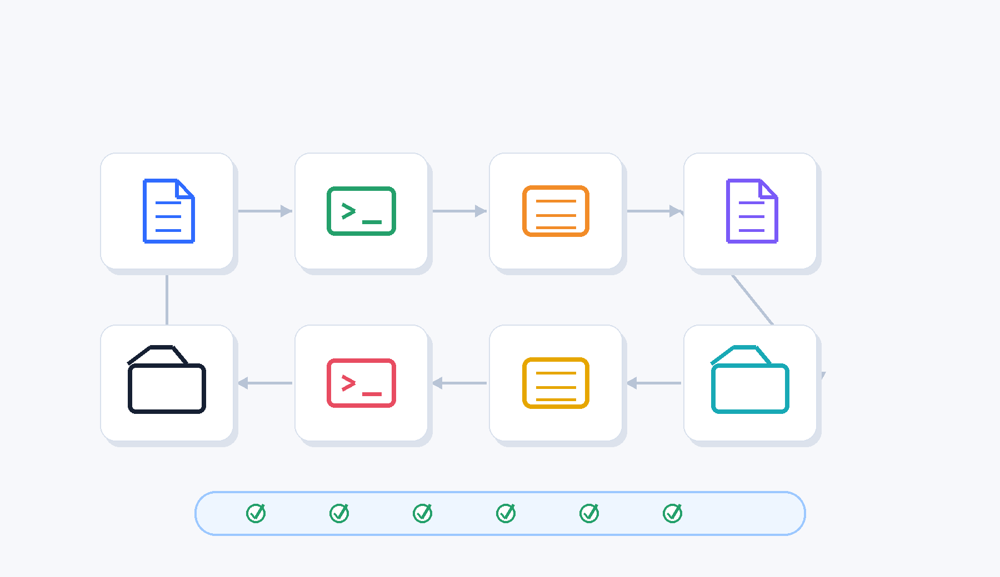
  <figcaption><strong>图1-30 第一段脚本反馈回路</strong>：一个 `.py` 文件不是孤零零地躺在文件夹里；它会被解释器运行，在终端里给出反馈，再把结果写成日志或报告。第一章真正要建立的，就是这条从脚本到证据的闭环。</figcaption>
</figure>

给脚本起清楚的名字，就是给这条闭环贴标签。以后看到 `01_hello_python.py`，你立刻知道它负责第一次输出；看到 `02_environment_check.py`，你知道它负责检查解释器、路径和当前目录。名字清楚，文件夹就不会像抽屉里塞满没拆封的数据线。

---

### 1.14 本章项目目录：只新增脚本和环境日志

第0章已经创建过 `python_card_factory/`，这里不重复讲完整目录。第1章只新增两类关键内容：

```text
python_card_factory/
├── code/
│   └── ch01/
│       ├── 01_hello_python.py
│       ├── 02_environment_check.py
│       ├── 03_import_this.py
│       └── 04_show_me_the_python.py
├── reports/
│   └── ch01_environment_log.txt
```

也就是说：`code/ch01/` 放本章脚本，`reports/` 放环境日志。其他 `input/`、`cards/`、`output/`、`assets/` 目录沿用第0章即可，不需要重新介绍一遍。

项目目录不是形式主义。它能避免你后面出现：

```text
FileNotFoundError: [Errno 2] No such file or directory
```

也就是程序说：“你让我找文件，但你没告诉我它到底在哪。”

---

### 1.15 把截图里的证据变成文本

前面 PowerShell 和 PyCharm 截图已经演示过环境检查，这里不再重新讲一遍配置过程。你只需要记住：`code/ch01/02_environment_check.py` 是本章的“体检表”，它把四个关键信息打印出来。

```python
import sys
import platform
from pathlib import Path

print("Python 版本：", sys.version)
print("Python 可执行文件：", sys.executable)
print("操作系统：", platform.platform())
print("当前工作目录：", Path.cwd())
```

读输出时重点看两行：

| 输出项 | 要确认什么 |
| --- | --- |
| `Python 可执行文件` | PowerShell 与 PyCharm 是否使用同一个解释器 |
| `当前工作目录` | 程序是不是站在本章项目目录里运行 |

这就是为什么前面反复让你看路径。路径不是枯燥细节，它像实验记录里的日期、地点和仪器编号：写清楚了，结果才可复现；写糊了，后面每一步都可能变成猜谜。

---

### 1.16 pip 安装检查：把包送到同一个地址

本章暂时不要求安装很多第三方包，但要先养成一个习惯：

```bash
python -m pip --version
python -m pip install pandas
```

比起直接写 `pip install pandas`，`python -m pip` 更像在快递单上写清楚收件人：“请把包送到当前这个 Python 解释器那里。”如果将来出现 `ModuleNotFoundError`，先别急着重装，先回到截图里的证据链：解释器是谁，pip 属于谁，脚本从哪个目录运行。

---

### 1.17 `import this`：用一行代码打开 Python 之禅

新建脚本：

```text
03_import_this.py
```

写入：

```python
import this
```

运行以后，你会看到 Python 的设计哲学。

这段输出不要求背诵，但建议你记住几条：

- Beautiful is better than ugly.
- Explicit is better than implicit.
- Simple is better than complex.
- Readability counts.
- There should be one obvious way to do it.

对初学者来说，最重要的是：

**可读性很重要。**

不要把代码写成只有你和上帝知道的样子，而且两周后上帝可能也不记得了。

<figure align="center">
  
  <figcaption><strong>图1-31 BBC Broadcasting House</strong>：Python 的名字带着一点幽默感；但真正让它适合初学者的，是清楚、可读、能快速验证想法。</figcaption>
</figure>

Python 的名字来自英国喜剧传统，这件事听起来像一个轻松的彩蛋。可它背后也有一点很适合初学者的气质：工具不必板着脸，代码也不必写得像谜语。能读懂、能运行、能解释给未来的自己听，才是第一章真正的审美。

---

### 1.18 本章小项目：科研卡片工厂通电日志

很多人第一次写代码时，会有一种奇怪的悬浮感：屏幕上确实出现了输出，可它到底有没有在电脑里留下什么东西？本章的小项目就解决这个问题：让 Python 不只“说一句话”，还要真的创建文件、写入日志，把抽象的“运行环境”变成看得见的结果。

这个项目叫：**科研卡片工厂通电日志**。

项目目标：

1. 打印欢迎信息。
2. 显示当前 Python 解释器路径。
3. 显示当前工作目录。
4. 创建一个输出文件夹。
5. 写入一份学习日志。
6. 让你看到“程序真的在替我做事”。

示例代码：

```python
from pathlib import Path
import sys
import datetime

print("=" * 50)
print("科研卡片工厂通电检查")
print("=" * 50)

print("当前 Python：", sys.executable)
print("当前目录：", Path.cwd())

report_dir = Path("reports")
report_dir.mkdir(exist_ok=True)

log_file = report_dir / "ch01_environment_log.txt"
now = datetime.datetime.now().strftime("%Y-%m-%d %H:%M:%S")

content = f"""科研卡片工厂通电日志
时间：{now}
状态：第一章环境测试成功
提醒：解释器、项目目录和输出位置要对齐，工厂才不会把材料送错仓库。
"""

log_file.write_text(content, encoding="utf-8")

print("学习日志已生成：", log_file)
print("恭喜，科研卡片工厂已经通电。")
```

运行后，项目中会出现：

```text
reports/ch01_environment_log.txt
```

这就是一个非常小的自动化任务。它没有炫酷界面，但它已经完成了“创建文件夹 + 写文件 + 输出状态”的组合动作。

你看，Python 已经开始替你干活了。

---

## 第四部分：实验预告、报错处理与平台差异

### 1.19 心理学实验流程预告：用 Python 模拟一个极简 Stroop 任务

第一章还不正式讲实验编程，但我们可以提前看一个小片段，建立动机。

```python
import time

participant_id = "S001"
stimulus_word = "RED"
ink_color = "blue"
correct_key = "j"

print("实验开始")
print("被试编号：", participant_id)

print("+")
time.sleep(0.5)

print("请判断这个词的墨水颜色，而不是词义。")
print("如果是红色按 f，如果是蓝色按 j。")
print("刺激呈现：", stimulus_word, "  墨水颜色：", ink_color)

start = time.perf_counter()
response = input("请输入你的反应（f/j）：")
reaction_time = round((time.perf_counter() - start) * 1000, 2)

print("你的反应是：", response)
print("是否正确：", response == correct_key)
print("粗略反应时：", reaction_time, "毫秒")

print("实验结束，数据将在后续章节中保存。")
```

这段程序已经包含了心理学实验程序的影子：

- 被试编号
- 注视点
- 时间控制
- 刺激呈现：词义和颜色可以冲突
- 输入反应
- 正确性判断
- 反应时记录
- 输出结果

它当然还不是正式实验。正式 Stroop 任务需要更严格的随机化、更准确的呈现控制、更可靠的计时、更完整的数据保存。但这个小片段已经足够说明：Python 不是只能算数学题，它可以控制实验流程，记录行为数据，逐步变成心理学研究里的小助手。

---

### 1.20 常见报错：别怕，它在给你线索

<figure align="center">
  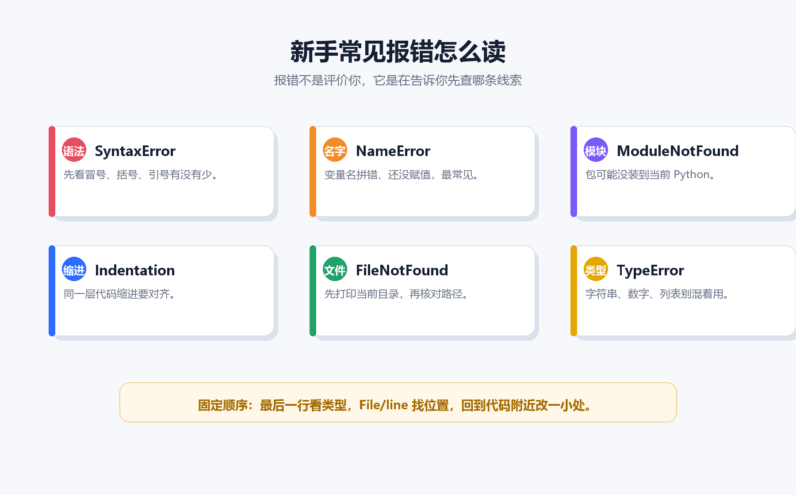
  <figcaption><strong>图1-32 报错地图</strong>：错误类型是线索，不是判决；把报错读懂，程序才会从混乱变成可修复。</figcaption>
</figure>

报错是编程学习的一部分。没有报错的学习是不完整的，就像健身从不出汗，大概率你只是在健身房自拍。

#### 1.20.1 SyntaxError：语法错误

示例：

```python
print("Hello"
```

少了右括号，可能报：

```text
SyntaxError: '(' was never closed
```

解决：检查括号、引号、冒号是否成对出现。

#### 1.20.2 NameError：名字错误

示例：

```python
print(stuent_name)
```

你本来想写 `student_name`，结果拼错了。

解决：检查变量名是否定义过，拼写是否一致。

#### 1.20.3 ModuleNotFoundError：模块找不到

示例：

```python
import pandas
```

如果没安装 pandas，就会报错。

解决：

```bash
python -m pip install pandas
```

同时检查是否用的是同一个 Python 环境。

#### 1.20.4 IndentationError：缩进错误

Python 非常在意缩进。缩进不是装饰，是语法结构。

错误示例：

```python
if True:
print("缩进错了")
```

正确写法：

```python
if True:
    print("缩进正确")
```

缩进就像队形。Python 是一个很讲队形的语言，谁乱站，它就吹哨。

#### 1.20.5 FileNotFoundError：文件找不到

示例：

```python
open("input/demo.txt", "r", encoding="utf-8")
```

如果 `input/demo.txt` 不存在，就会报错。

解决：

1. 确认文件真的存在。
2. 确认当前工作目录正确。
3. 尽量使用 `Path` 组合路径。
4. 不要只靠"我感觉它应该在那里"。


### 1.21 三步读报错法

当你看到一大段红字，不要慌。按三步来：

#### 第一步：看最后一行

报错最后一行通常告诉你错误类型和原因。例如：

```text
NameError: name 'stuent_name' is not defined
```

核心是：

```text
NameError
```

和：

```text
stuent_name is not defined
```

#### 第二步：看 File 和 line

例如：

```text
File "main.py", line 7
```

说明错误在 `main.py` 第 7 行附近。

#### 第三步：回到代码附近检查

不同错误有不同检查重点：

| 错误类型 | 优先检查 |
| --- | --- |
| SyntaxError | 括号、引号、冒号 |
| NameError | 变量名、函数名、拼写 |
| ModuleNotFoundError | 是否安装包、环境是否一致 |
| IndentationError | 空格缩进 |
| FileNotFoundError | 文件路径、当前工作目录 |

别一看到报错就复制整段去搜索。先自己读三秒。读懂报错，是程序员从新手到熟练的重要分水岭。

---

### 1.22 Windows 与 macOS 的几个差异

#### 1.22.1 路径分隔符不同

Windows 常见路径：

```text
C:\Users\Alice\Documents\project
```

macOS / Linux 常见路径：

```text
/Users/alice/Documents/project
```

Python 中推荐使用 `pathlib`：

```python
from pathlib import Path

project_dir = Path.cwd()
data_file = project_dir / "data" / "demo.txt"

print(data_file)
```

这样可以减少跨平台路径问题。

<figure align="center">
  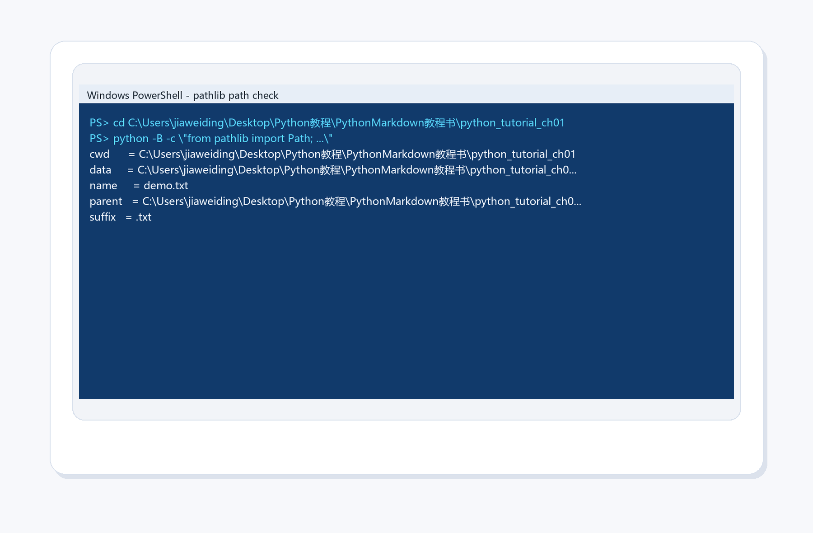
  <figcaption><strong>图1-33 pathlib 路径检查</strong>：`Path.cwd()`、`/` 拼接、`.name`、`.parent` 和 `.suffix` 能把路径拆成可检查的证据，少靠猜，多靠输出。</figcaption>
</figure>

路径问题最容易把人绕晕，因为“文件明明在那里”和“程序当前站在那里”不是一回事。把路径打印出来，就像把地图摊开：当前位置、目标文件、父文件夹、后缀名都看见了，`FileNotFoundError` 就少了一大半神秘感。

#### 1.22.2 命令可能不同

Windows 可能用：

```bash
py --version
```

macOS / Linux 可能用：

```bash
python3 --version
```

为了后续复现，建议你先确认自己电脑中哪个命令可用，然后在 README 里记录下来。

#### 1.22.3 权限问题不同

macOS / Linux 对权限更敏感；Windows 有时会遇到文件被占用。遇到权限错误时，不要马上重装 Python。先检查文件是否被其他程序打开，当前目录是否可写。

---

### 1.23 动手练习

动手试试以下操作吧：

1. 在 PowerShell 中进入 `python_tutorial_ch01`，确认 `Get-Location` 指向本章目录。
2. 运行 `python --version`、`python -m pip --version` 和 `python code\ch01\02_environment_check.py`。
3. 如果创建 `.venv`，用 `.venv\Scripts\python.exe` 或激活后的 `python` 再跑一次脚本。
4. 在 PyCharm 中打开同一个项目目录，解释器选择同一个 `python.exe`。
5. 在 Run Configuration 中核对 `Script path` 和 `Working directory`，再运行本章脚本。

第一次学习本章时，建议按这个顺序运行配套脚本：

```bash
python code/ch01/01_hello_python.py
python code/ch01/02_environment_check.py
python code/ch01/03_import_this.py
python code/ch01/04_show_me_the_python.py
python code/ch01/05_experiment_preview.py
```

如果其中一步报错，先停在那一步修复。环境学习的关键不是把所有命令都试一遍，而是能说清楚每一次运行发生了什么。

| 提交证据 | 要看到什么 |
| --- | --- |
| PowerShell 版本检查 | `python --version` 有输出 |
| pip 路径检查 | `python -m pip --version` 显示 pip 所属路径 |
| 环境检查脚本 | `sys.executable` 和 `Path.cwd()` 能看懂 |
| PyCharm Run 窗口 | 能运行 `01_hello_python.py` 或 `02_environment_check.py` |
| 通电日志 | 生成 `reports/ch01_environment_log.txt` |

### 1.23.1 初学者必须建立的七个习惯

#### 习惯1：文件名用英文、数字、下划线

推荐：

```text
hello_world.py
read_student_data.py
create_learning_base.py
```

不推荐：

```text
我的第一个程序.py
最终版！！！.py
作业 1.py
hello-world.py
```

中文文件名不是绝对不能用，但初学阶段先降低复杂度。你现在的目标不是向操作系统展示汉语之美，而是让程序少出幺蛾子。

#### 习惯2：每个项目有自己的文件夹

不要把所有代码丢在桌面。桌面是临时工作台，不是代码养老院。

#### 习惯3：先跑通，再改写

学习代码的顺序：

1. 原样复制并运行。
2. 改一个变量，看输出怎么变。
3. 改一行逻辑，看程序怎么变。
4. 故意制造一个错误，读懂报错。
5. 写下这次错误的原因。

#### 习惯4：一次只改一点点

新手最常见的灾难是：一次改 17 行，然后程序炸了。你问它为什么炸，它也问你为什么这么对它。

正确做法：每次只改一处，运行一次。像搭积木，一块一块放。

#### 习惯5：把报错复制出来，不要只发截图

当你向别人或 AI 求助时，最好提供：

```text
1. 你想做什么
2. 你运行了哪段代码
3. 完整报错文本
4. 你的文件结构
5. 你已经尝试过什么
```

"它不行"不是一个问题。这句话的信息量和"医生，我不舒服"差不多。医生还得问你哪里不舒服、多久了、吃了什么。代码问题也一样。

#### 习惯6：写 README

README 是项目说明书。哪怕只有几行，也要写。

一个最小 README 可以这样：

```markdown
# 我的 Python 项目

## 这个项目做什么

自动创建科研卡片工厂工作区。

## 如何运行

python create_learning_base.py

## 输入

无。

## 输出

python_card_factory 文件夹。
```

#### 习惯7：记录学习日志

学习日志不是心灵鸡汤。它是你的 bug 档案馆。

建议记录：

```markdown
## 2026-xx-xx

今天学了：Path.mkdir()

遇到的错误：FileNotFoundError

原因：我在错误的工作目录运行了程序。

解决：先用 Path.cwd() 查看当前位置。
```

以后你会发现，很多坑不是第一次踩最痛苦，而是第三次踩还觉得眼熟最痛苦。

---

## 第五部分：收束、检查与下一章

### 1.24 本章总结

Python 是一门适合初学者进入编程世界的语言。它免费、开源、简洁、跨平台，生态丰富，尤其适合科研、数据分析、自动化和应用开发。

本章不要求你掌握复杂语法，只要求把运行环境真正打通。第一章的胜利不是“我已经会写复杂程序”，而是“我知道怎么开始，也知道出错时先看哪里”。

| 概念 | 一句话解释 | 新手比喻 |
| --- | --- | --- |
| Python | 指挥电脑干活的语言 | 工厂语言 |
| 解释器 | 执行 Python 代码的程序 | 工厂总控员 |
| `.py` 文件 | 保存 Python 代码的脚本 | 任务说明书 |
| IDE | 写、跑、查错的开发环境 | 中央操作台 |
| 终端 | 用文字命令和系统交互 | 工厂大门口 |
| pip | 安装第三方包的工具 | 补货小车 |
| 当前工作目录 | 程序默认找文件的位置 | 当前所在房间 |
| 报错 | 程序反馈问题的位置和类型 | 报警灯 |

会读报错，才算真的开始会用 Python。以后环境出问题时，优先拿出三样证据：解释器路径、pip 路径、当前工作目录。

---

### 1.25 下一章预告：变量不是盒子，更像标签

下一章我们会进入 Python 编程基础：常量、变量、布尔值、数字、字符串、列表、字典等。

你会看到一个非常重要的观点：

> Python 里的变量不是传统意义上的盒子，更像贴在对象身上的标签。

这个观点一旦理解，后面学习列表、字典、函数参数、可变对象和不可变对象都会顺很多。

第一章到这里就完成了。现在，你的任务不是继续狂读，而是打开电脑，跑一遍代码。

**教程读懂一半，代码跑通才算另一半。**
