# 第 2 章：Python 编程基础：数据类型

[TOC]

<style>
figure {
  margin: 1.2em auto 1.8em;
  text-align: center;
}
figure img {
  max-width: 100%;
  display: block;
  margin: 0 auto;
}
figcaption {
  margin-top: 0.45em;
  color: #5f6673;
  font-size: 0.92em;
  line-height: 1.55;
}
figcaption strong {
  color: #2d3748;
}
</style>

如果说第1章是在搭工作台，那么第2章就是开始认识材料。

木匠做桌子，要知道木板、螺丝、胶水、砂纸分别适合做什么。Python 也一样：程序里流动的东西不是一团模糊的“数据”，而是有性格、有用途、有边界的数据类型。

字符串适合保存文字，列表适合保存一串有顺序的东西，字典适合保存“名字对应信息”的结构，布尔值适合做判断，数值适合计算。类型选得对，代码会像整理好的桌面；类型选错，后面每一步都像在抽屉里翻耳机线。

本章的目标不是把所有函数背下来，而是建立一种判断力：

> 看到一份数据，我应该把它放进哪种容器里？

<figure align="center">
  
  <figcaption><strong>图2-1 第2章封面</strong>：数据类型像不同容器；先判断材料是什么，再决定用 `bool`、数值、字符串、列表还是字典。</figcaption>
</figure>

---

## 2.1 本章路线

本章按“常量、变量、布尔、数值、字符串、列表、字典”这条路线展开，但不把它们当成孤立名词来背，而是放进真实任务里理解：

1. 先认识常量和关键字：哪些名字是 Python 自己保留的。
2. 再理解变量：变量不是盒子，更像标签。
3. 再学习布尔和数值：程序如何判断真假、处理数字。
4. 然后进入字符串：文字如何创建、拼接、查找、替换和切片。
5. 接着学习列表：一串有顺序的数据如何取、切、加、删。
6. 最后学习字典：如何用 key 找 value。
7. 用一个小项目把这些类型组合起来。

这章会反复强调一个动作：先观察数据，再选择结构。不要先急着写代码。

阅读时建议保持一个节奏：先看图，明白这一节要解决什么问题；再读代码；最后自己运行配套脚本。图片负责建立直觉，代码负责验证直觉。

<figure align="center">
  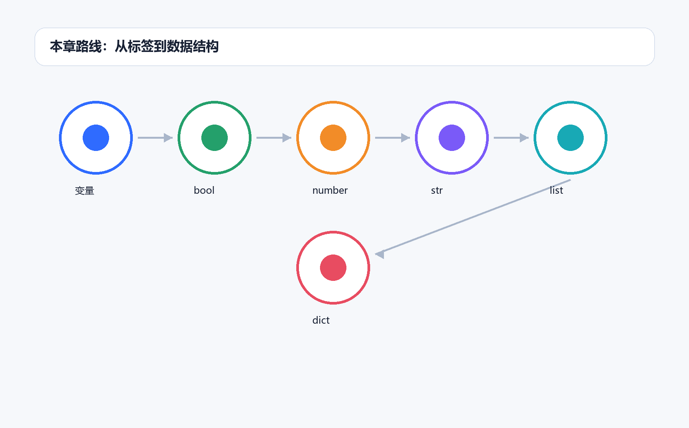
  <figcaption><strong>图2-2 第2章知识路线图</strong>：从常量和变量出发，依次进入布尔、数值、字符串、列表和字典。</figcaption>
</figure>

---

## 2.2 常量：Python 早就准备好的几个固定角色

Python 里有一些值很特殊，它们不是你随便起的名字，而是语言自带的固定角色。

初学阶段先抓住三个最常见的内置常量：

| 常量 | 含义 | 常见用途 |
| --- | --- | --- |
| `True` | 真 | 条件成立、开关打开 |
| `False` | 假 | 条件不成立、开关关闭 |
| `None` | 空值 | 目前还没有结果、暂时没有数据 |

另外还有 `Ellipsis` 和 `NotImplemented` 这类高级对象。现在只要知道它们也是 Python 自带的特殊值，不需要在本章背用法。

请注意大小写：Python 里的 `True` 和 `False` 首字母要大写。写成 `true` 或 `false`，Python 会把它当成普通变量名，然后发现你并没有定义它。

```python
passed = True
failed = False
answer = None

print(passed)
print(failed)
print(answer)
```

`None` 很有用。它像一张写着“还没有”的占位卡。

例如你正在记录学生的第一次练习成绩，但这个学生还没提交：

```python
first_score = None
```

这不是 0。0 是一个真实分数，`None` 表示“现在还没有分数”。这两者在程序里差别很大。

配套脚本：

```bash
python code/ch02/01_constants_keywords.py
```

---

## 2.3 关键字：Python 语言自己的保留词

关键字是 Python 已经拿去当语法用的词。你不能把它们当变量名。

例如：

```python
if = 10
```

这行代码会报错，因为 `if` 是条件判断语法的一部分，不是给你随便贴标签的名字。

你可以用标准库 `keyword` 打印 Python 当前版本的关键字：

```python
import keyword

print(keyword.kwlist)
print(len(keyword.kwlist))
```

可以把关键字理解成“城市里的路牌”。路牌已经承担交通规则了，你不能把自己的书包也命名为“红绿灯”。

变量名应该避开关键字，也尽量避开容易误解的内置函数名，例如 `list`、`dict`、`str`、`sum`。不是绝对不能写，但初学阶段最好不要把这些词拿来当变量名。

更好的命名方式：

```python
scores = [86, 92, 78]
student_name = "小明"
favorite_color = "green"
```

---

## 2.4 变量：不是盒子，更像标签

很多人第一次学变量，会听到一句话：

> 变量就是一个盒子，里面装着值。

这个比喻对入门有一点帮助，但也容易误导。它会让人以为：

```python
a = 2
b = a
```

就是把 `a` 盒子里的 2 复制一份，放进 `b` 盒子。

在 Python 里，更准确的说法是：

> 变量名是贴在对象上的标签。

`a = 2` 的意思是：把名字 `a` 绑定到对象 `2` 上。

`b = a` 的意思是：让 `b` 也指向 `a` 当前指向的那个对象。

你可以运行下面的脚本观察：

```bash
python code/ch02/02_variables_labels.py
```

它会打印 `id(a)` 和 `id(b)`。`id()` 可以粗略理解成对象在内存中的身份编号。

```python
a = 2
b = a

print(id(a))
print(id(b))
```

你会发现，在这个例子里，`a` 和 `b` 一开始指向同一个对象。

然后我们重新赋值：

```python
b = 3
```

这不是把原来的 2 改成 3，而是让 `b` 这个标签改贴到对象 `3` 上。`a` 仍然指向 2。

这件事在后面学习列表、字典、函数参数时非常重要。现在先记住一句话：

> 变量名不是保险箱，而是便签纸。便签纸贴在哪里，Python 就去哪里找值。

<figure align="center">
  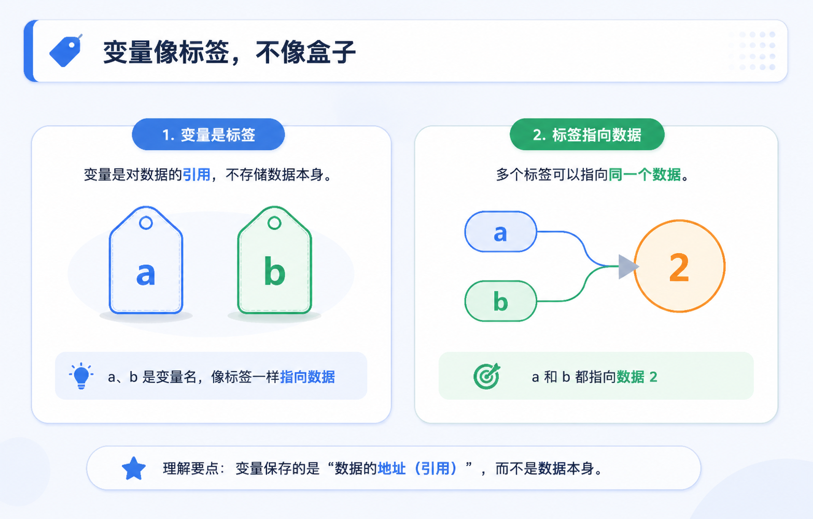
  <figcaption><strong>图2-3 变量标签模型</strong>：左边是容易误会的“盒子感”，右边是更接近 Python 的“标签感”：名字可以指向同一个对象，也可以重新贴到新对象上。</figcaption>
</figure>

---

## 2.5 变量命名：名字要像路标，不要像谜语

变量名最重要的功能不是“让电脑看懂”。电脑其实不在乎你叫它 `x` 还是 `student_score`。变量名真正服务的是人，包括未来的你。

不建议：

```python
a = 86
b = 92
c = 78
```

更建议：

```python
math_score = 86
english_score = 92
python_score = 78
```

常见命名规则：

1. 可以包含字母、数字、下划线。
2. 不能以数字开头。
3. 不能使用 Python 关键字。
4. 区分大小写，`score` 和 `Score` 是两个名字。
5. 多个单词通常用小写加下划线：`student_name`。

可以给自己一个小练习：把下面这些坏名字改成好名字。

| 不推荐 | 问题 | 更推荐 |
| --- | --- | --- |
| `a` | 太模糊 | `reaction_time` |
| `data1` | 不知道是什么数据 | `pre_test_scores` |
| `list` | 覆盖内置类型名 | `word_list` |
| `myVeryLongVariableName` | 风格不统一 | `learning_days` |

变量名像路标。路标写得清楚，程序就像城市地图；路标乱写，代码就像没有门牌号的小区。

---

## 2.6 数据类型地图：先看材料，再选容器

如果把第2章比作材料仓库，数据类型地图就是货架平面图。它不会替你搬箱子，但会告诉你：文字放哪里、数字放哪里、判断放哪里、一串记录放哪里、带标签的完整记录放哪里。

Python 里能表示的材料很多：字符串、布尔、整数、浮点数、列表、元组、字典、集合、日期等。

初学阶段不用一次吃完。先抓住最常用的几类：

| 类型 | Python 名称 | 适合保存什么 |
| --- | --- | --- |
| 布尔 | `bool` | 判断结果：真或假 |
| 整数 | `int` | 次数、人数、分数、编号 |
| 浮点数 | `float` | 小数、时间、比例、平均值 |
| 字符串 | `str` | 文字、路径、姓名、题目 |
| 列表 | `list` | 一串有顺序的数据 |
| 元组 | `tuple` | 一组不打算修改的数据 |
| 字典 | `dict` | key 对应 value 的信息表 |
| 集合 | `set` | 去重、集合运算 |

本章重点讲 `bool`、`int`、`float`、`str`、`list`、`dict`。

新手最容易混淆的是“看起来像数字”和“真的能计算的数字”。请先会用 `type()` 看证据：

```python
score_text = "86"
score_number = 86

print(type(score_text))    # <class 'str'>
print(type(score_number))  # <class 'int'>
```

`"86"` 是文字，适合展示；`86` 是整数，适合计算。先把这张地图放在脑子里：它不是知识点海报，而是后面所有例子的导航牌。

<figure align="center">
  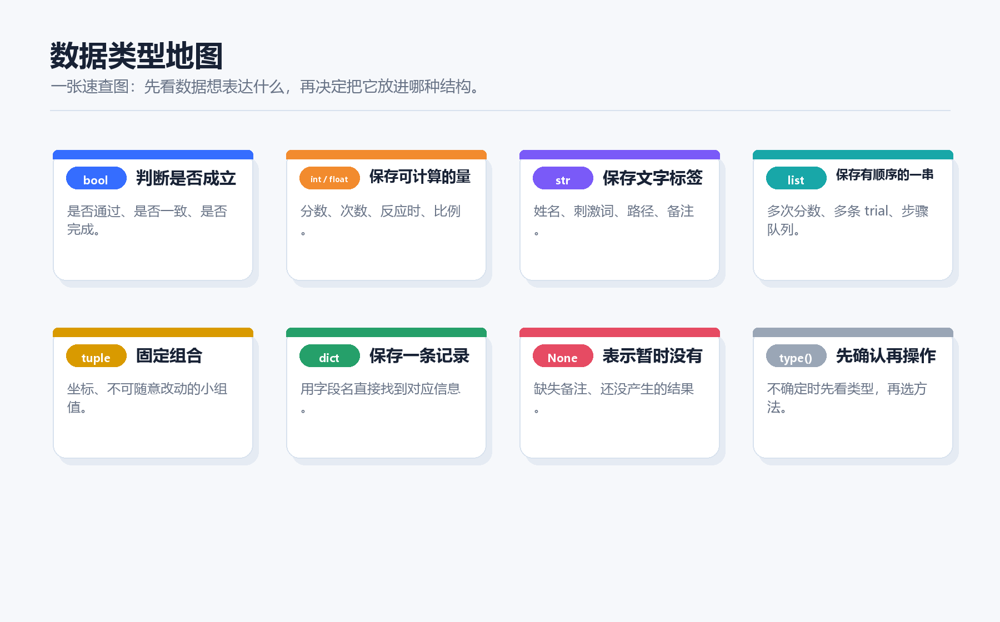
  <figcaption><strong>图2-4 数据类型地图</strong>：图里只保留类型节点；具体怎么选，交给正文里的任务和例子来判断。</figcaption>
</figure>

Claude Shannon 曾把通信问题讲得非常干脆：消息要经过编码、传输、解码，最后被接收者理解。Python 里的数据类型也有类似的味道。`"86"` 和 `86` 看起来只差一对引号，但前者是文字，后者是数字；一个适合展示，一个适合计算。类型不是装饰，而是程序理解信息的方式。

所以本章不是在背一串单词，而是在练一种判断：这份信息到底应该以什么形态进入程序？

<figure align="center">
  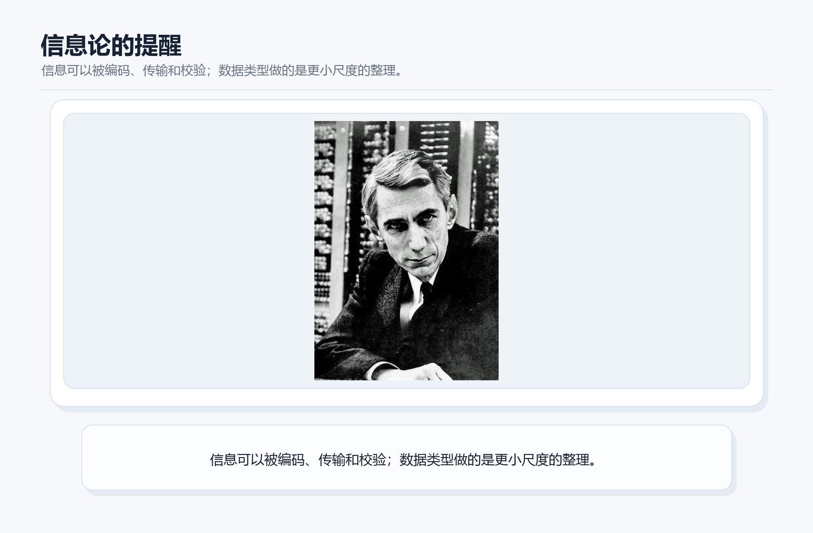
  <figcaption><strong>图2-5 Claude Shannon</strong>：信息论把“消息”变成可以度量、编码和传输的对象；学习数据类型，也是在学习如何给信息选择合适的表示方式。</figcaption>
</figure>

这时可以想象自己拿着一只“类型选择罗盘”。罗盘不会替你写代码，但它会先把方向指清楚：这份数据是要计算、要展示、要按顺序保存、要按名字查找、要判断真假，还是暂时没有值？

<figure align="center">
  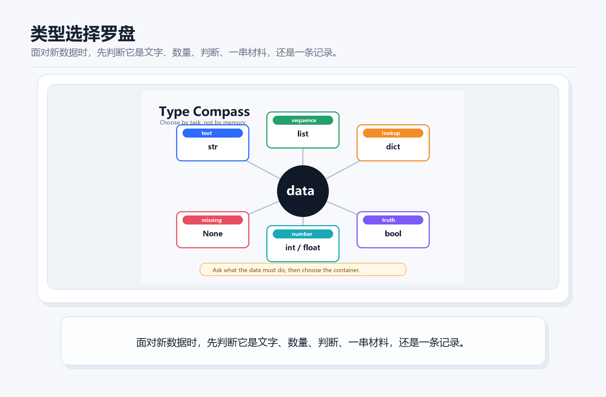
  <figcaption><strong>图2-6 类型选择罗盘</strong>：看到新数据时，先问它要完成什么任务，再选择 `str`、`list`、`dict`、`bool`、数值类型或 `None`。</figcaption>
</figure>

选择类型时，可以先问自己六个问题：

1. 这是一个判断吗？如果是，用 `bool`。
2. 这是要计算的数量吗？如果是，用 `int` 或 `float`。
3. 这是一段文字吗？如果是，用 `str`。
4. 这是一串有顺序的数据吗？如果是，用 `list`。
5. 这是“名字对应信息”的查找表吗？如果是，用 `dict`。
6. 这里是不是暂时没有值？如果是，用 `None`，不要用 `0` 或空字符串假装有结果。

数据类型像工具箱里的工具。锤子、剪刀、尺子都很有用，但拿剪刀去敲钉子，场面就会变得很有教育意义。Python 也是一样：类型选错，后面就会出现很多别扭的转换和报错；类型选对，代码会顺着数据本身的形状往前走。

---

## 2.7 布尔类型：程序里的红绿灯

布尔类型听起来像一个冷冰冰的术语，但它其实有一段很适合写进新手村的历史。

19 世纪的 George Boole 想做一件有点大胆的事：把人的逻辑推理变成可以计算的符号系统。换句话说，他想让“如果……那么……”“同时满足”“至少满足一个”这些判断，像加减乘除一样被严肃处理。很多年以后，计算机把这个思想变成了最朴素也最强大的开关：`True` 和 `False`。

<figure align="center">
  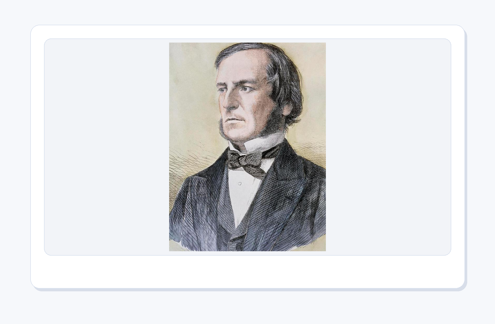
  <figcaption><strong>图2-7 George Boole肖像</strong>：布尔值的名字来自数学家 George Boole；今天的 `True` 和 `False`，背后是把复杂推理压缩成“真/假”判断的思想。</figcaption>
</figure>

所以当你写下：

```python
score = 86
passed = score >= 60
```

你不是在写一个小玩具，而是在使用一套已经流进现代计算机血液里的逻辑语言。只是 Python 把它包装得很亲切：分数够了，`passed` 就是 `True`；分数不够，`passed` 就是 `False`。这里的 `passed` 不是分数本身，而是一次判断的结果。

布尔类型只有两个值：

```python
True
False
```

它适合表达判断。

```python
score = 86
passed = score >= 60

print(passed)
```

这里 `score >= 60` 会得到一个布尔值。分数大于等于 60，结果就是 `True`；否则就是 `False`。

布尔值经常配合 `if` 使用：

```python
if passed:
    print("通过")
else:
    print("继续练习")
```

布尔值像程序里的红绿灯。灯亮，程序走这条路；灯不亮，程序换另一条路。

---

## 2.8 and、or、not：把多个条件组合起来

三个常见逻辑运算：

| 运算 | 含义 | 例子 |
| --- | --- | --- |
| `and` | 两边都为真，结果才真 | `has_id and has_ticket` |
| `or` | 至少一边为真，结果就真 | `is_admin or is_teacher` |
| `not` | 反过来 | `not is_late` |

<figure align="center">
  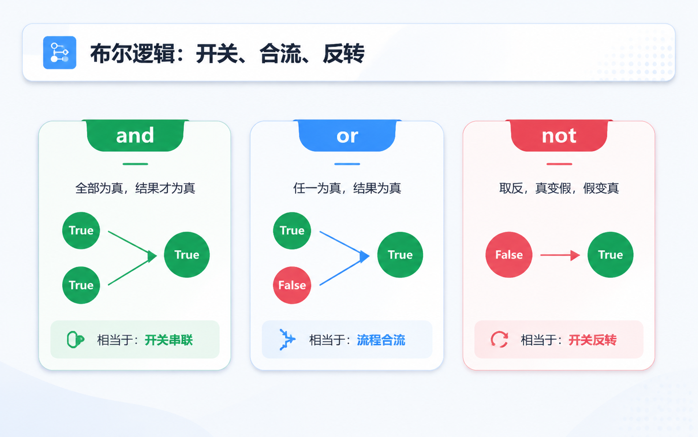
  <figcaption><strong>图2-8 布尔逻辑开关台</strong>：`and` 像两盏灯都要亮，`or` 像至少亮一盏，`not` 像把结果翻面。</figcaption>
</figure>

例子：

```python
has_homework = True
has_finished = False

print(has_homework and has_finished)
print(has_homework or has_finished)
print(not has_finished)
```

配套脚本：

```bash
python code/ch02/03_bool_numbers.py
```

优先级要记住：

```text
not > and > or
```

不过真正写代码时，不要把优先级当智力题。复杂条件里直接加括号。

```python
can_join = (age >= 18 and has_ticket) or is_staff
```

括号不是丢人，是给未来读代码的人留灯。

---

## 2.9 数值类型：整数、浮点数和复数

Python 常见数值类型包括：

| 类型 | 说明 | 例子 |
| --- | --- | --- |
| `int` | 整数 | `10`、`-3`、`0` |
| `float` | 浮点数 | `3.14`、`0.5` |
| `complex` | 复数 | `1 + 2j` |

有些旧资料会提到 `long`。在 Python 3 里，`int` 已经可以表示任意精度整数，日常学习不需要单独区分 `long`。

常见计算：

```python
fixation_duration_ms = 600
trial_count = 24
total_time_ms = fixation_duration_ms * trial_count

print(total_time_ms)
```

如果你做心理学实验，`fixation_duration_ms = 600` 可以表示注视点持续 600 毫秒。把单位写进变量名，后面就不容易把毫秒、秒和次数混在一起。

---

## 2.10 取整：round、floor、ceil 不是一回事

Python 里有三个常见取整方法：

| 方法 | 含义 |
| --- | --- |
| `round(x)` | 四舍五入，但 Python 的舍入规则要注意 |
| `math.floor(x)` | 向下取整 |
| `math.ceil(x)` | 向上取整 |

三种方法看起来都在“去掉小数”，但它们面对的是三种不同任务：显示一个近似值、保守地向下取、保证够用地向上取。先把区别看清楚，再写代码会稳很多。

<figure align="center">
  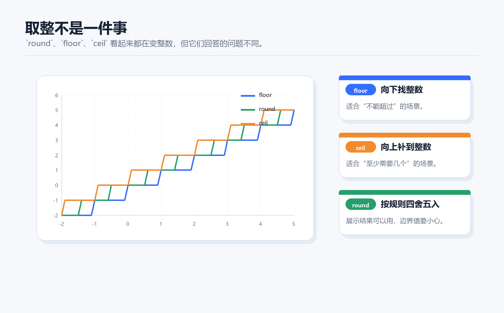
  <figcaption><strong>图2-9 数值取整图表</strong>：取整不是随便抹零，向上、向下和四舍五入各有自己的规则。</figcaption>
</figure>

例子：

```python
import math

value = 2.7

print(round(value))
print(math.floor(value))
print(math.ceil(value))
```

输出大致是：

```text
3
2
3
```

不要把它们混用。比如：

- 处理索引位置时，通常要非常小心，不能随便四舍五入。
- 处理得分显示时，可能用 `round()`。
- 处理分页数量时，经常用 `ceil()`，因为剩下一点点也要多一页。

Python 的 `round()` 还有一个细节：当正好遇到 `.5` 时，它采用“银行家舍入”的规则，不总是简单向上。你可以运行 `round(2.5)` 和 `round(3.5)` 看看：结果分别是 `2` 和 `4`。初学阶段先知道这件事；真正遇到金额、实验计时或统计精度时，再细查舍入规则。

---

## 2.11 字符串：文字也是数据

数字能回答“多少”，字符串负责回答“是谁、叫什么、写了什么、放在哪里”。做一个 Stroop 小实验时，反应时可以是 `523.4`，正确与否可以是 `True`，但刺激词、被试编号、实验条件和输出文件名都离不开字符串。

所以不要把字符串理解成“给程序加点装饰文字”。它更像实验记录本上的标签纸：没有标签，数据就只剩下一堆孤零零的数字；标签清楚，后面才能检索、统计、复盘和写报告。

<figure align="center">
  
  <figcaption><strong>图2-10 字符串材料工作台</strong>：实验说明、被试编号、刺激词、文件路径和日志备注，看起来都是“文字”，在程序里却都是需要认真保存、查找、替换和切片的数据。</figcaption>
</figure>

字符串用来保存文本。

```python
country_name = "China"
student_name = "小明"
message = "Hello, Python!"
```

单引号和双引号都可以：

```python
name1 = 'Python'
name2 = "Python"
```

如果字符串本身包含引号，可以换一种引号包起来：

```python
sentence = "I'm learning Python."
```

多行字符串可以用三个引号：

```python
intro = """第一行
第二行
第三行"""
```

字符串不是“装饰品”，它经常保存非常关键的信息：文件路径、实验说明、被试编号、题目文本、网页内容、日志信息。

---

## 2.12 字符串类型转换：str、int、float、chr、ord

常见转换：

```python
age = 18
age_text = str(age)

score_text = "95"
score = int(score_text)

reaction_time_text = "523.4"
reaction_time = float(reaction_time_text)
```

如果你把字符串和数字直接相加，Python 会困惑：

```python
age = 18
print("年龄：" + age)
```

这会报错，因为字符串不能直接和整数拼接。

你可以写：

```python
age = 18
print("年龄：" + str(age))
```

或者更推荐：

```python
age = 18
print(f"年龄：{age}")
```

`chr()` 和 `ord()` 可以在字符和编码之间转换，初学阶段了解即可：

```python
print(chr(65))
print(ord("A"))
```

输出：

```text
A
65
```

配套脚本：

```bash
python code/ch02/04_string_playground.py
```

---

## 2.13 字符串格式化：从 `%` 到 f-string

常见字符串格式化方式有三种：

```python
str_name = "Pony"
int_age = 49

text1 = "My name is %s and my age is %d!" % (str_name, int_age)
text2 = "My name is {} and my age is {}!".format(str_name, int_age)
text3 = f"My name is {str_name} and I am {int_age} years old."
```

现在更推荐 f-string，因为它最直观。

```python
name = "小明"
score = 86

report = f"{name} 的本次练习分数是 {score}。"
print(report)
```

f-string 像在句子里挖了一个小窗口，窗口里可以直接放变量。

---

## 2.14 字符串查找与替换

查找：

```python
info = "abca"

print(info.find("a"))
print(info.find("a", 1))
print(info.find("333"))
```

`find()` 找到就返回索引，找不到就返回 `-1`。

替换：

```python
message = "I like Matlab."
message = message.replace("Matlab", "Python")

print(message)
```

输出：

```text
I like Python.
```

注意：`replace()` 不会把原字符串原地改掉，而是返回一个新字符串。所以更稳妥的写法是把结果重新赋值给变量，或者赋值给一个新名字。字符串替换常用于批量更新旧术语、旧路径、旧实验说明。

---

## 2.15 字符串切片：左闭右开

字符串可以按索引取值：

```python
word = "huawei"

print(word[0])
print(word[1])
print(word[-1])
```

正向索引从 0 开始：

```text
h  u  a  w  e  i
0  1  2  3  4  5
```

反向索引从 -1 开始：

```text
h   u   a   w   e   i
-6 -5  -4  -3  -2  -1
```

切片最容易让新手迷糊的地方，是数字标的不是“格子本身”，而是字符之间的边界。先把这把尺子看懂，再写 `start:end` 会轻松很多。

<figure align="center">
  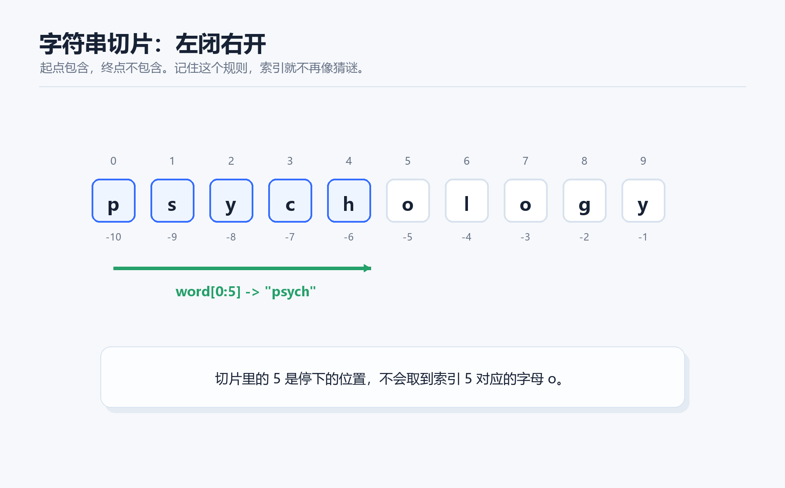
  <figcaption><strong>图2-11 字符串切片尺</strong>：数字标的是边界，不是“格子本身”；切片要学会看起点和终点。</figcaption>
</figure>

切片语法：

```python
word[start:end]
```

规则是左闭右开：包含 `start`，不包含 `end`。

```python
word = "huawei"
print(word[0:3])
```

输出：

```text
hua
```

为什么不包含右边界？一个好处是长度很好算：

```text
word[0:3] 的长度 = 3 - 0 = 3
```

这件事在列表里也一样。取单个字符时，如果索引超过范围，会出现 `IndexError`；切片超过范围通常不会报错，但结果可能比你想象的短。

---

## 2.16 字符串切割：split

如果你有一段文本：

```python
my_string = "song huan gong"
```

可以用 `split()` 切成列表：

```python
str_list = my_string.split(" ")
print(str_list)
```

输出：

```text
['song', 'huan', 'gong']
```

如果不写分隔符，`split()` 默认按空白字符切：

```python
print(my_string.split())
```

这在处理问卷数据、日志、用户输入时很常见。

---

## 2.17 列表：一排可调整的抽屉

如果要把列表讲得有一点心理学味道，可以从 Hermann Ebbinghaus 说起。

他研究记忆时，会反复记录“过了多久还能记住多少”。这类数据天然有顺序：第 1 次测试、第 2 次测试、第 3 次测试；或者 5 分钟后、1 小时后、1 天后。Python 的列表特别适合装这种数据。

<figure align="center">
  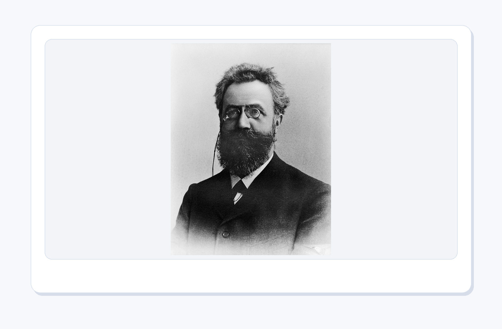
  <figcaption><strong>图2-12 Hermann Ebbinghaus肖像</strong>：记忆研究里经常会收集一串测试结果；这种“有顺序的一排数据”，正是列表最擅长处理的材料。</figcaption>
</figure>

```python
retention_rates = [1.00, 0.82, 0.65, 0.48, 0.36]
test_times = ["刚学完", "20分钟后", "1小时后", "1天后", "1周后"]
```

你不需要一开始就会画遗忘曲线。先会把这些结果整齐放进列表，再会取出、追加、计算平均值，就已经迈过了“把心理学材料变成可计算数据”的第一步。

<figure align="center">
  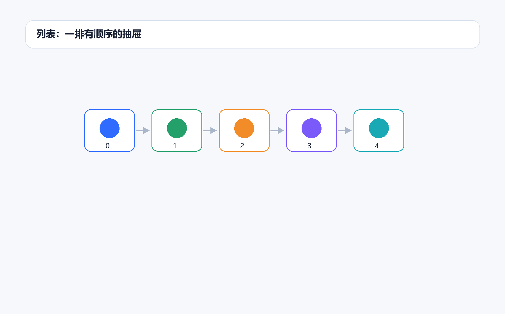
  <figcaption><strong>图2-13 列表工作台</strong>：列表像一排有顺序的抽屉，位置从 0 开始；取值、切片、追加和删除都围绕顺序展开。</figcaption>
</figure>

列表用来保存一串有顺序的数据，而且列表可以被修改。

```python
my_list = ["I", "love", "you", "my", "dear"]
```

列表也从 0 开始索引：

```python
print(my_list[1])
```

输出：

```text
love
```

列表切片：

```python
print(my_list[0:2])
```

输出：

```text
['I', 'love']
```

再次提醒：左闭右开。

配套脚本：

```bash
python code/ch02/05_list_dict_workshop.py
```

---

## 2.18 列表嵌套：列表里还能放列表

先看一个并列列表的例子：

```python
number_list = [5, 2, 1]
word_list = ["I", "love", "you"]
nested_list = [number_list, word_list]

print(nested_list)
```

输出：

```text
[[5, 2, 1], ['I', 'love', 'you']]
```

这就是嵌套列表：列表里的元素仍然可以是列表。

它像一个柜子里有两层抽屉，也像套娃一层套一层：

<figure align="center">
  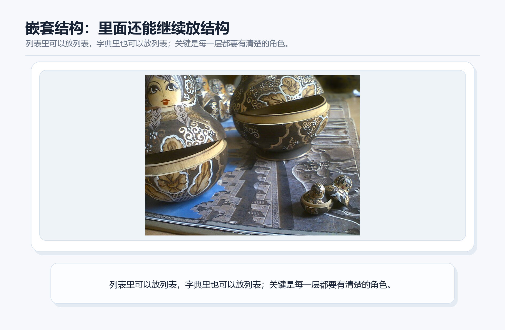
  <figcaption><strong>图2-14 套娃与嵌套结构</strong>：嵌套列表就像套娃，一层里面还有一层；它很有用，但层数太多时也会让人找不着出口。</figcaption>
</figure>

```python
print(nested_list[0])
print(nested_list[0][1])
```

`nested_list[0]` 先取出第一层里的第一个列表，`nested_list[0][1]` 再从这个子列表里取第 2 个元素。

初学阶段不要滥用嵌套。两层还好，三层以上就要考虑是否应该换成字典、表格或类。真正成熟的写法不是“能套多深”，而是“别人一眼能不能看懂你在第几层”。

---

## 2.19 列表合并、添加、删除和乘法

合并：

```python
list1 = ["5", "2", "0"]
list2 = ["I", "love", "you"]

print(list1 + list2)
```

添加：

```python
my_list = ["I", "love", "you"]
my_list.append("Python")

print(my_list)
```

`append()` 会直接修改原列表，不需要写成 `my_list = my_list.append("Python")`。

删除：

```python
del my_list[2]
print(my_list)
```

乘法：

```python
letters = ["a", "b"]
print(letters * 3)
```

输出：

```text
['a', 'b', 'a', 'b', 'a', 'b']
```

列表有加法和乘法，但没有“列表减法”。你不能写：

```python
list1 - list2
```

如果要删除某个元素，要用 `del`、`remove()` 或列表推导式等方法。

这台 IBM 080 打孔卡分拣机看起来像一排机械抽屉：卡片从入口进去，机器根据打孔位置把它们分到不同槽里。它提醒我们一件事：数据从来不是“随便堆着就行”。学生记录、实验 trial、单词卡片、文件清单，只要数量一多，就需要顺序、索引、分类和检索。

列表像一叠按顺序排好的卡片，适合“第 1 次、第 2 次、第 3 次”这种材料；字典像给每张卡片贴上清楚标签，适合“被试编号对应哪条记录”这种查找。理解了这台老机器，再看 Python 的列表和字典，就不再像抽象语法，而像给科研卡片工厂安装了两种分拣装置。

<figure align="center">
  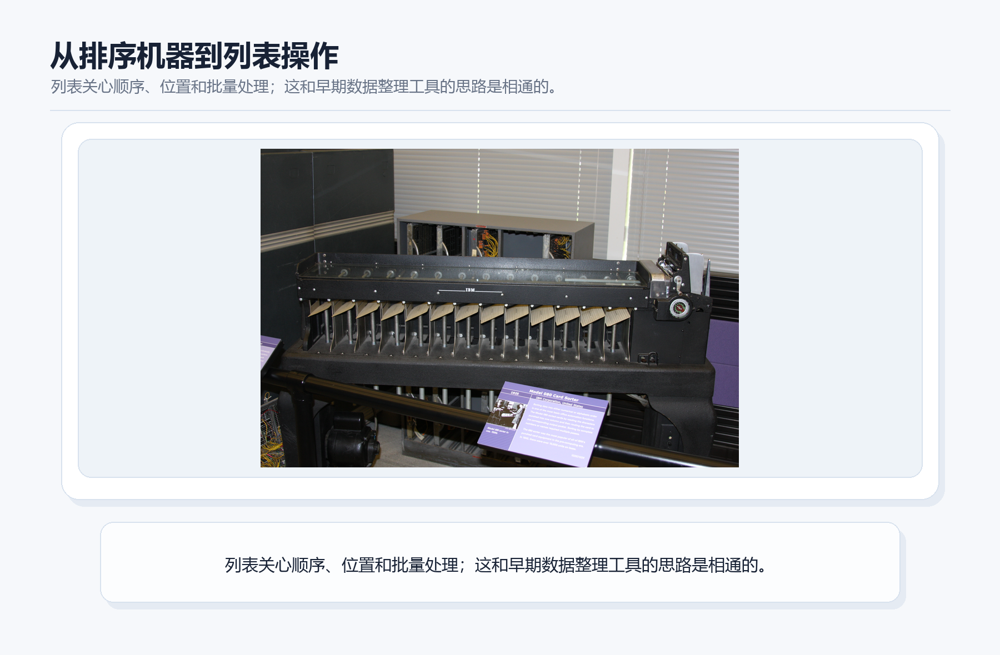
  <figcaption><strong>图2-15 IBM 080 打孔卡分拣机</strong>：在电子表格和数据库普及之前，数据也要按字段分拣、排序和归档；今天的 `list` 与 `dict`，其实是在用代码接管这套整理工作。</figcaption>
</figure>

---

## 2.20 字典：用 key 找 value

在没有搜索框的年代，图书馆靠一张张卡片组织知识。你想找一本书，不会从第一张卡片开始数到第一万张，而是按作者、题名或主题去检索。

Python 的字典也有这种气质。列表问的是：“第几个元素是什么？”字典问的是：“这个 key 对应什么 value？”

<figure align="center">
  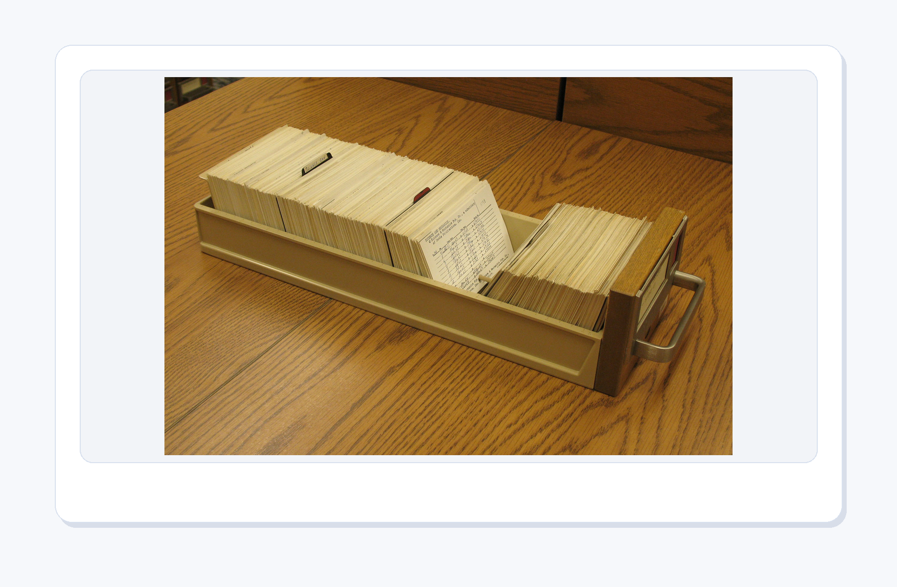
  <figcaption><strong>图2-16 图书馆卡片目录抽屉</strong>：字典像一套检索系统，不是靠“第几个”去找，而是靠清楚的 key 直接找到对应信息。</figcaption>
</figure>

如果你做心理学问卷整理，字典会非常自然：

```python
participant = {
    "id": "P001",
    "age": 19,
    "condition": "stroop_conflict",
    "mean_reaction_time": 612.5,
}
```

这份记录不需要背位置。你要年龄，就查 `"age"`；要实验条件，就查 `"condition"`。代码读起来像在翻一张资料卡。

<figure align="center">
  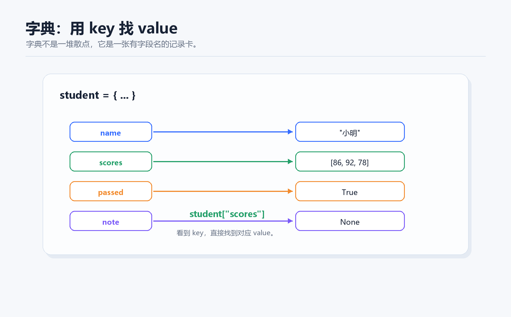
  <figcaption><strong>图2-17 字典映射卡</strong>：左边是 key，右边是 value；字典最重要的能力，就是不用数位置，直接按名字查信息。</figcaption>
</figure>

字典的英文是 dictionary，也常被理解为 map。它最重要的特点是：

> 每个元素都有一个 key 和对应的 value。

列表靠位置找东西，字典靠 key 找东西。

```python
favorite_color = {
    "小美": "粉色",
    "小明": "黄色",
    "小东": "绿色",
}
```

查询：

```python
print(favorite_color["小美"])
```

输出：

```text
粉色
```

这就像查字典：你用“词”去查“解释”。在程序里，你用 key 去查 value。初学阶段，key 先优先使用字符串或数字；不要把列表拿来当 key。

---

## 2.21 字典的增、删、改、查

新增：

```python
favorite_color["小红"] = "紫色"
```

修改：

```python
favorite_color["小明"] = "绿色"
```

删除：

```python
del favorite_color["小东"]
```

查询：

```python
color = favorite_color["小美"]
```

完整例子：

```python
favorite_color = {
    "小美": "粉色",
    "小明": "黄色",
    "小东": "绿色",
}

favorite_color["小红"] = "紫色"
favorite_color["小明"] = "绿色"
del favorite_color["小东"]

print(favorite_color)
```

字典适合表达“谁对应什么”：

| 场景 | key | value |
| --- | --- | --- |
| 学生成绩 | 姓名 | 分数 |
| 单词表 | 英文单词 | 中文解释 |
| 文件索引 | 文件名 | 文件路径 |
| 实验记录 | 被试编号 | 反应数据 |

---

## 2.22 字典常见坑：key 不存在

如果你访问一个不存在的 key：

```python
favorite_color = {"小美": "粉色"}

print(favorite_color["小明"])
```

会出现 `KeyError`。

你可以先判断：

```python
if "小明" in favorite_color:
    print(favorite_color["小明"])
else:
    print("还没有记录小明的颜色")
```

也可以使用 `get()`：

```python
color = favorite_color.get("小明", "未知")
print(color)
```

`get()` 的第二个参数是默认值。如果 key 不存在，就返回默认值。

---

## 2.23 本章小项目：学习记录整理器

现在把本章内容串起来。

我们要整理一位学生的学习记录：

- 姓名：字符串 `str`
- 分数：列表 `list`
- 是否通过：布尔 `bool`
- 平均分：浮点数 `float`
- 技能清单：列表 `list`
- 完整记录：字典 `dict`

把这些材料连起来，就得到一条很小但很真实的数据流水线：先有输入，再整理成结构，最后生成报告。

<figure align="center">
  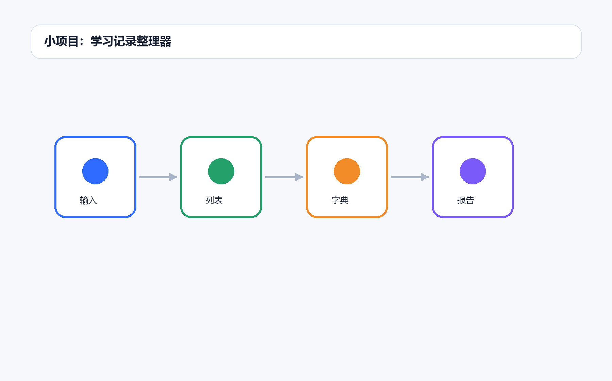
  <figcaption><strong>图2-18 本章小项目</strong>：输入、列表、字典、报告连成一条小流水线，数据类型第一次合在一起做事。</figcaption>
</figure>

配套脚本：

```bash
python code/ch02/06_learning_record_project.py
```

核心结构：

```python
student = {
    "name": "小明",
    "scores": [86, 92, 78],
    "skills": ["字符串", "列表", "字典"],
    "notes": "索引从 0 开始，切片左闭右开。",
}
```

计算平均分：

```python
scores = student["scores"]
average_score = sum(scores) / len(scores)
```

判断是否通过：

```python
passed = average_score >= 60
```

生成报告：

```python
status = "通过" if passed else "需要继续练习"
```

这个小项目的意义不是“写一个多厉害的软件”，而是让你第一次感觉到：数据类型不是孤立知识点，它们会一起工作。

现在再看终端运行图，就不会觉得它突然了。图中第一段运行的是变量标签脚本：`a` 和 `b` 先指向同一个整数对象，`b = 3` 以后，`b` 改贴到新对象上。第二段运行的是学习记录小项目：字符串保存姓名，列表保存分数，字典保存整份记录，布尔值保存是否通过。

这张图要传达的不是“终端长什么样”，而是：数据类型最终要能在真实脚本里跑起来、打印出来、保存下来。

<figure align="center">
  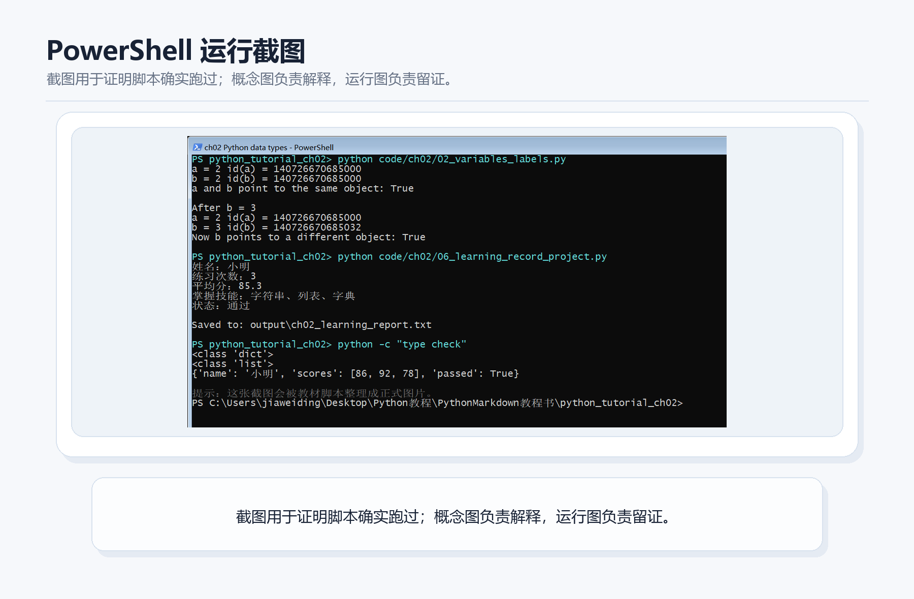
  <figcaption><strong>图2-19 PowerShell真实运行数据类型脚本</strong>：在终端里运行变量脚本和学习记录项目，能看到 `id()`、`dict`、`list` 与输出文件一起出现，数据类型不再只是纸面概念。</figcaption>
</figure>

---

## 2.24 本章常见报错地图

如果把程序想象成一张实验记录表，报错就像红笔批注。红笔不是为了嘲笑你，而是在说：“这里有个线索，请回头看一眼。”第2章的报错大多和“类型不合适”“名字没定义”“位置不存在”“key 找不到”有关。看到红字时，先不要重写整段代码，先缩小范围。

<figure align="center">
  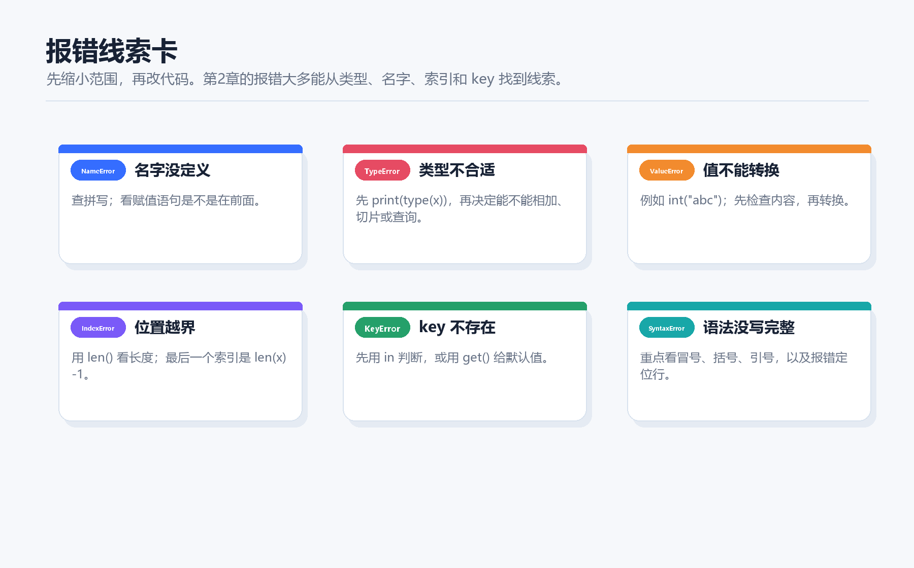
  <figcaption><strong>图2-25 数据类型报错线索卡</strong>：报错不是突然冒出来的怪事，它通常在提醒你：括号、key、索引、类型、路径或取值边界有一处没对齐。</figcaption>
</figure>

| 报错 | 常见原因 | 处理方式 |
| --- | --- | --- |
| `NameError` | 变量名没定义或拼错 | 检查变量名是否一致 |
| `TypeError` | 类型不匹配 | 用 `type()` 看数据类型 |
| `ValueError` | 值不适合转换 | 例如 `int("abc")` |
| `IndexError` | 列表或字符串索引越界 | 检查长度和索引范围 |
| `KeyError` | 字典里没有这个 key | 用 `in` 或 `get()` |
| `SyntaxError` | 引号、括号、冒号写错 | 看报错最后一行和定位行 |
| `AttributeError` | 这个类型没有你调用的方法 | 先用 `type()` 确认对象类型 |

初学者看到报错时，不要急着怀疑自己。先问三个问题：

1. 这个值是什么类型？
2. 我是不是用错了操作？
3. 我取的位置或 key 是否存在？

这三个问题能解决本章大多数错误。

---

## 2.25 本章核心概念复盘

| 概念 | 一句话解释 | 新手比喻 |
| --- | --- | --- |
| 常量 | Python 自带的固定值 | 固定角色 |
| 关键字 | Python 保留的语法词 | 路牌 |
| 变量 | 指向对象的名字 | 便签纸 |
| 布尔 | 真或假 | 红绿灯 |
| 数值 | 用于计算的数据 | 计分器 |
| 字符串 | 文本数据 | 一串字符珠子 |
| 切片 | 取出一段序列 | 切一段尺子 |
| 列表 | 有顺序的数据容器 | 一排抽屉 |
| 字典 | key 对应 value | 查表系统 |

---

## 2.26 本章练习

下面这些练习可以按顺序做，也可以当作调试清单来用。每完成一题，都尽量运行一次代码、看一次输出。数据类型的手感不是靠默念概念长出来的，而是在“改一点、跑一下、看结果”里慢慢稳定下来。

<figure align="center">
  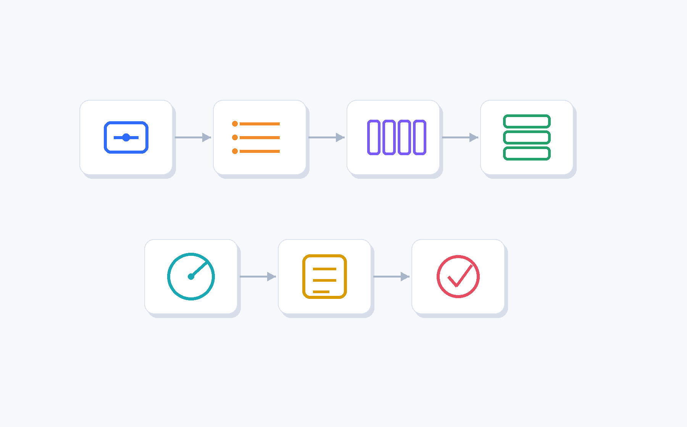
  <figcaption><strong>图2-26 数据类型练习工作台</strong>：练习不是机械刷题，而是把变量、字符串、列表、字典、类型选择和实验数据串成一组能动手检查的小任务。</figcaption>
</figure>

### 练习 1：变量命名

把下面变量名改得更清楚：

```python
a = "小明"
b = 86
c = [78, 92, 88]
```

参考答案：

```python
student_name = "小明"
current_score = 86
practice_scores = [78, 92, 88]
```

### 练习 2：字符串切片

给定：

```python
word = "psychology"
```

请写出代码：

1. 取第一个字符。
2. 取最后一个字符。
3. 取前 5 个字符。
4. 判断 `"log"` 是否出现在字符串中。

参考代码：

```python
word = "psychology"

print(word[0])
print(word[-1])
print(word[:5])
print("log" in word)
```

### 练习 3：列表操作

给定：

```python
scores = [86, 92, 78]
```

请完成：

1. 添加一个新分数 `88`。
2. 删除第 2 个分数，也就是索引为 `1` 的元素。
3. 计算平均分。
4. 打印最高分。

参考代码：

```python
scores = [86, 92, 78]
scores.append(88)
del scores[1]
average_score = sum(scores) / len(scores)

print(scores)
print(average_score)
print(max(scores))
```

### 练习 4：字典操作

给定：

```python
student = {
    "name": "小明",
    "score": 86,
}
```

请完成：

1. 新增 `"city": "Beijing"`。
2. 把 `score` 改成 `90`。
3. 用 `get()` 查询 `"age"`，如果没有就返回 `"未知"`。

参考代码：

```python
student = {
    "name": "小明",
    "score": 86,
}

student["city"] = "Beijing"
student["score"] = 90
age = student.get("age", "未知")

print(student)
print(age)
```

### 练习 5：类型选择罗盘

运行：

```bash
python code/ch02/08_make_type_compass.py
```

然后打开：

```text
reports/ch02_type_compass.md
```

请任选 6 条真实学习数据，为每条数据选择合适类型，并写出一句理由。可以参考下面这种格式：

| 数据 | 推荐类型 | 理由 |
| --- | --- | --- |
| 学生姓名 | `str` | 它是一段文字，需要展示和保存 |
| 最近 7 次练习分数 | `list` | 它是一串有顺序的数据，可以计算平均分 |
| 是否通过本章测验 | `bool` | 它只有真或假两种结果 |

---

## 2.27 给自己的提醒：不要让类型变成背诵题

第2章最容易讲成“函数清单”。比如字符串有 `find()`、`replace()`、`split()`，列表有 `append()`、`del`，字典有查询、增删改。

这些都重要，但更重要的是让自己形成一个判断：

> 我面对的数据是什么形状？

自学时可以多问这种问题：

1. 如果要保存一个学生姓名，用什么类型？
2. 如果要保存一周 7 天的练习分数，用什么类型？
3. 如果要保存“学生姓名对应分数”，用什么类型？
4. 如果要判断是否通过考试，用什么类型？

你能回答这些问题，就已经不是在死背语法，而是在开始设计程序。

<figure align="center">
  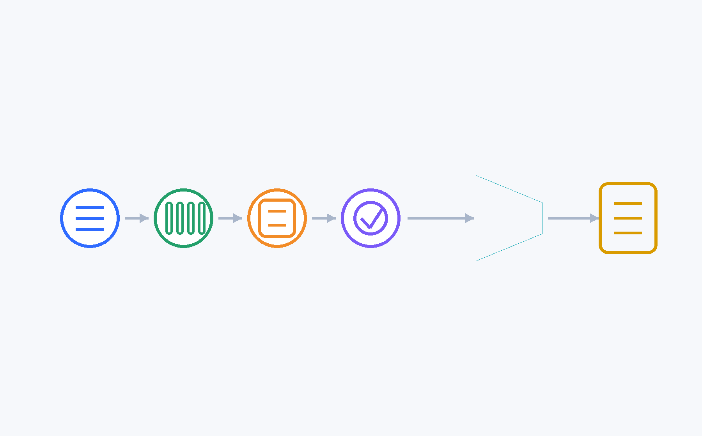
  <figcaption><strong>图2-27 数据类型到文件管理</strong>：字符串、列表、字典和布尔值先把材料整理成结构；下一章会把这些结构保存到文件和文件夹里。</figcaption>
</figure>

到这里，数据已经不再是一堆散落的词和数字。它们开始有形状：字符串像标签，列表像队列，字典像记录卡，布尔值像判断灯。下一步很自然：把这些结构放进文件，让它们离开一次运行，变成可以保存、复查和交接的材料。

---

## 2.28 下一章预告：文件不是“在电脑里”，而是在路径里

下一章会进入文件读写与文件夹管理。

这会是初学者从“会写几行代码”走向“能处理真实资料”的关键一步。因为真实世界的数据不会自己排队走进程序，它们通常躺在某个文件夹里，名字可能很长，路径可能很乱，格式可能还不太听话。

下一章我们会学习：如何创建文件、读取文件、写入文件、管理文件夹、理解当前工作目录，并让 Python 开始真正处理你电脑里的资料。
