# 第 3 章：文件读写与文件夹管理

<style>
figure {
  margin: 1.2em auto 1.8em;
  text-align: center;
}
figure img {
  max-width: 100%;
  display: block;
  margin: 0 auto;
}
figcaption {
  margin-top: 0.45em;
  color: #5f6673;
  font-size: 0.92em;
  line-height: 1.55;
}
figcaption strong {
  color: #2d3748;
}
</style>

前两章里，我们已经能让 Python 运行起来，也认识了字符串、列表、字典这些数据材料。

但真实世界的数据通常不会乖乖站在代码里。它们藏在文件夹里，可能叫 `scores.csv`，可能叫 `raw_notes.txt`，也可能叫一个你下载后再也没改过的 `新建文本文档(3).txt`。

第3章要解决的就是这件事：

> 让 Python 真的碰到电脑里的资料。

它会读文件、写文件、创建文件夹、遍历目录、复制文件、移动文件，也会在该谨慎的时候停下来确认路径。

文件操作是初学者从“写小例子”走向“处理真实资料”的关键一步。因为只要你会读写文件，Python 就不再只是屏幕上打印几行字的玩具，而开始变成整理资料、生成报告、批量归档的工具。

<figure align="center">
  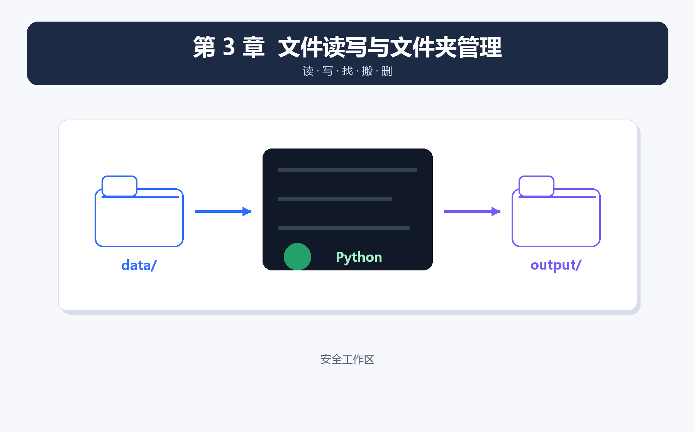
  <figcaption><strong>图3-1 第3章封面</strong>：本章让 Python 走进真实文件夹，开始处理电脑里的资料。</figcaption>
</figure>

---

## 3.1 本章路线

这一章先处理两件最真实的事：

1. 对文件进行操作：打开、读取、写入、删除、复制、移动。
2. 对文件夹进行操作：创建、遍历、删除、复制、移动。

学习路线可以按下面的顺序走：

1. 先理解路径和当前工作目录。
2. 再认识 `open()` 的模式。
3. 学会读取文件：`read()`、`readline()`、`readlines()`、逐行循环。
4. 学会写入文件：`write()`、`writelines()`。
5. 用 `with open()` 自动关闭文件。
6. 用 `pathlib`、`os`、`shutil` 管理文件和文件夹。
7. 最后做一个“资料归档器”小项目，并生成一份可复现的档案清单。

这章的核心不是背 API，而是建立一种安全意识：

> 文件操作会改变真实文件，所以每一步都要知道自己站在哪里、要操作谁、结果会写到哪里。

<figure align="center">
  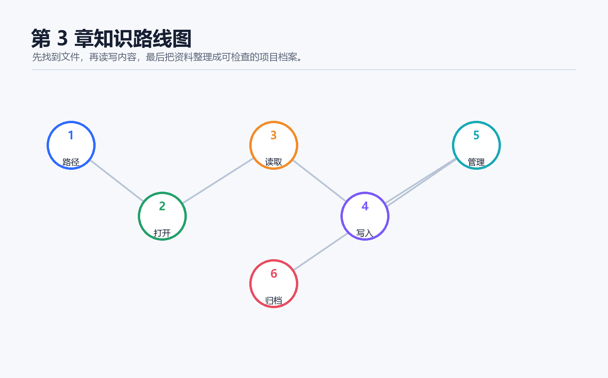
  <figcaption><strong>图3-2 第3章知识路线图</strong>：先认路径，再读写文件，最后用 pathlib、os 和 shutil 管理文件夹。</figcaption>
</figure>

可以把本章想象成一次资料归档任务。

下载目录像桌面上散开的纸：实验记录、分数表、截图、报告草稿都混在一起。Python 的工作不是替你判断哪份资料“重要”，而是按清楚的规则把它们放到合适的位置：原始数据进 `data/`，中间结果进 `output/`，最终报告进 `reports/`，需要保留的旧版本进 `archive/`。

这就像档案盒的意义：不是让盒子显得很专业，而是让未来的你不用在截止日期前一小时翻遍整个电脑。

<figure align="center">
  
  <figcaption><strong>图3-3 档案盒照片</strong>：文件夹管理的目标不是“把文件藏起来”，而是像整理档案一样，让资料能被找到、能被复现、能被交付。</figcaption>
</figure>

1945 年，工程师 Vannevar Bush 写下《As We May Think》，想象一种叫 Memex 的机器：人可以把书籍、照片、笔记和索引连接起来，像沿着一串脚印一样重新找到想法。后来超文本、信息检索和知识管理的发展，都能看到这条思想线索的影子。

这和本章的文件读写有什么关系？关系非常直接。一个杂乱文件夹里当然也有资料，但它缺少“线索”。当你用 Python 把原始数据、整理结果、报告、图片和清单放到明确位置时，你其实是在给资料修路：哪份是原始文件，哪份是处理结果，哪份可以交付，哪份只是中间产物，都变得可追踪。

<figure align="center">
  
  <figcaption><strong>图3-4 Vannevar Bush肖像</strong>：文件管理不只是“放整齐”，更重要的是让资料之间能形成线索，未来可以沿着线索找回来。</figcaption>
</figure>

---

## 3.2 文件读写流水线

文件读写可以理解成一条流水线：

```text
磁盘文件 → 打开文件 → 读入变量 → 处理内容 → 写出结果
```

下面先把这条线画出来，后面的代码就是沿着这条线一步一步走。

<figure align="center">
  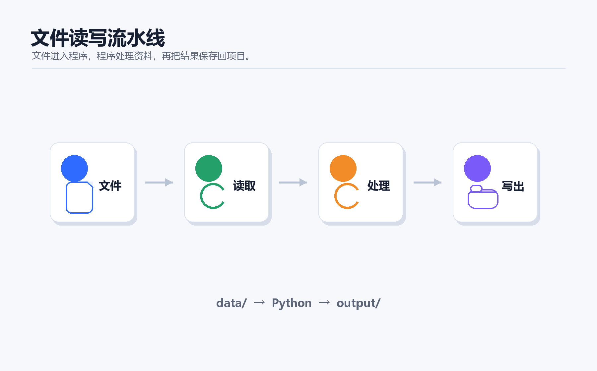
  <figcaption><strong>图3-5 文件读写流水线</strong>：文件从磁盘进入程序，处理以后再写回结果，每一步都要知道数据在哪里。</figcaption>
</figure>

比如你有一个 `data/raw_notes.txt`：

```text
Python file demo
line 1: read files safely
line 2: write results clearly
line 3: keep raw data untouched
```

程序可以把它读进变量：

```python
from pathlib import Path

path = Path("data/raw_notes.txt")
text = path.read_text(encoding="utf-8")

print(text)
```

再把处理结果写到另一个文件：

```python
output = Path("output/report.txt")
output.write_text("整理完成\n", encoding="utf-8")
```

请注意：我们通常不直接覆盖原始数据。原始数据像实验记录，最好保持不动；处理结果写进 `output/`，这样更安全，也更容易复现。

---

## 3.3 路径：文件不是“在电脑里”，而是在某个地址里

很多新手第一次遇到 `FileNotFoundError`，会以为文件丢了。

但更常见的情况是：文件没丢，你站错房间了。

Python 找文件时，会从“当前工作目录”出发。你可以这样查看：

```python
from pathlib import Path

print(Path.cwd())
```

如果当前工作目录是：

```text
my_project/
```

那么：

```python
Path("data/raw.txt")
```

表示：

```text
my_project/data/raw.txt
```

这叫相对路径。它不是从整个硬盘根目录开始，而是从当前工作目录开始。

绝对路径则从盘符或系统根目录开始，例如 Windows 上可能是：

```text
C:\Users\name\Desktop\my_project\data\raw.txt
```

建议：初学阶段不要到处写绝对路径。更好的做法是把项目目录整理好，用相对路径描述项目内部文件。

把这几件事合在一起看，路径其实就是“从当前房间出发去找文件”的地图。

<figure align="center">
  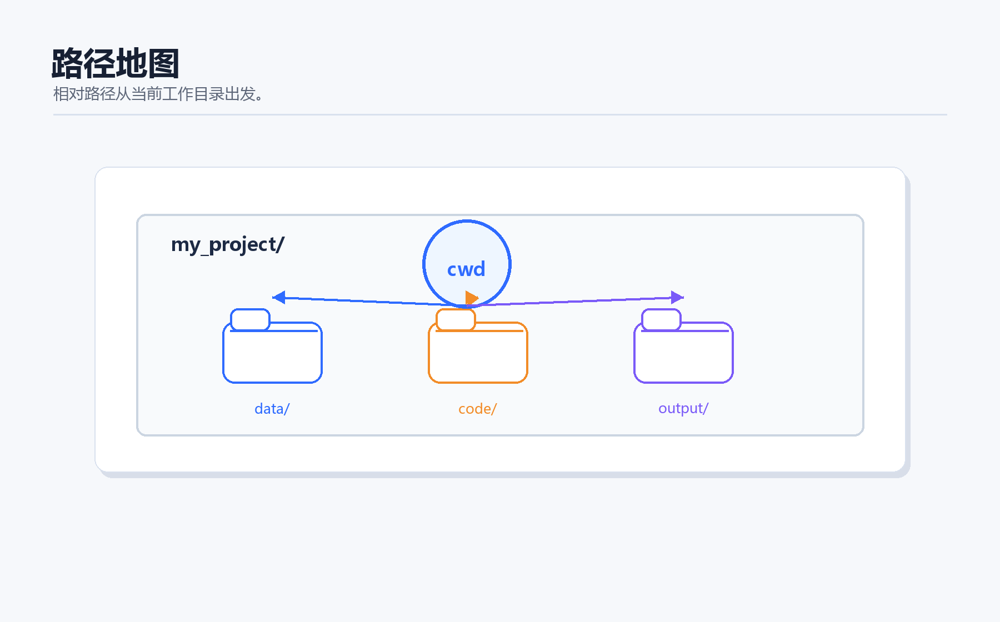
  <figcaption><strong>图3-6 路径地图</strong>：路径就是文件的地址，当前工作目录决定相对路径从哪里出发。</figcaption>
</figure>

老式文件柜最怕“凭感觉塞进去”。你今天觉得“这个文件应该在桌面”，三周后就只剩下一个模糊印象。路径也是这样：`workspace_ch03/data/raw_notes.txt` 比“我记得好像在某个文件夹里”可靠得多。

文件柜抽屉上的标签，就是路径感最好的实体比喻。

<figure align="center">
  
  <figcaption><strong>图3-7 文件柜抽屉照片</strong>：路径像抽屉标签；标签越清楚，找到资料越快，出错概率也越低。</figcaption>
</figure>

写代码时，路径越具体，程序越镇定。

---

把文件夹想象成一排档案货架会更容易理解：`data/` 是原始资料区，`output/` 是加工结果区，`organized/` 是分类归档区，`reports/` 是交付说明区。货架本身不会变聪明，聪明的是你制定了清楚的规则，并让 Python 按规则执行。

所以后面看到 `Path.mkdir()`、`os.walk()`、`shutil.copyfile()` 时，不要把它们看成零散函数。它们是档案库里的几种动作：建新格子、巡检货架、复制材料、移动材料、生成清单。

下面这张图把“文件夹层级”还原成真实档案库的样子：秩序不是靠记忆维持的，而是靠位置、编号和清单维持的。

<figure align="center">
  
  <figcaption><strong>图3-8 档案库货架照片</strong>：真实档案库依靠货架、编号和清单保持秩序；程序里的文件夹也需要同样清楚的层级。</figcaption>
</figure>

---

## 3.4 建立本章安全练习目录

本章的代码会先创建一个安全练习目录 `workspace_ch03`。后面所有复制、移动、删除都在这个目录里发生，不碰你的其他文件。

先运行：

```bash
python code/ch03/01_create_sample_files.py
```

它会创建：

```text
workspace_ch03/
├── data/
│   ├── raw_notes.txt
│   └── scores.csv
└── output/
```

这个动作很重要。学习文件操作时，最好永远先创建一个“练习沙盒”。沙盒里可以大胆试，试坏了也不心疼。

---

下面这张图展示的是本章小项目的真实运行环境。终端里先运行 `01_create_sample_files.py`，再运行 `07_project_archiver.py`，最后用 `Get-ChildItem workspace_ch03 -Recurse -File` 查看实际生成的文件。

<figure align="center">
  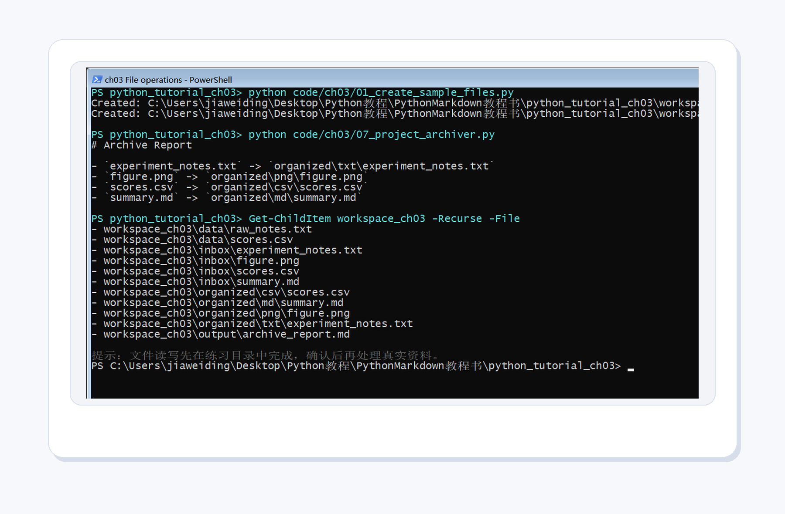
  <figcaption><strong>图3-9 PowerShell真实运行文件操作脚本</strong>：先创建安全练习目录，再运行资料归档器，最后列出真实生成的文件路径。</figcaption>
</figure>

这一步很关键：文件操作的学习不能只看代码。你要亲眼确认文件真的出现了、真的被复制了、报告真的写出来了。只有这样，`read()`、`write()`、`copyfile()` 才会从 API 名字变成可验证的动作。

---

## 3.5 open()：打开文件的钥匙

`open()` 最核心的用法可以先看成：

常用时我们通常写：

```python
file = open("data/raw_notes.txt", "r", encoding="utf-8")
```

其中：

| 参数 | 含义 |
| --- | --- |
| `name` | 文件路径 |
| `mode` | 打开模式 |
| `encoding` | 文本编码，中文环境下建议明确写 `utf-8` |

`buffering` 是缓冲设置，初学阶段很少需要手动写。

不过实际写代码时，建议优先用两种写法：

第一种是 `pathlib`：

```python
from pathlib import Path

text = Path("data/raw_notes.txt").read_text(encoding="utf-8")
```

第二种是 `with open()`：

```python
with open("data/raw_notes.txt", "r", encoding="utf-8") as file:
    text = file.read()
```

两种都可以。`pathlib` 更简洁，`with open()` 更接近底层文件读写流程。

---

## 3.6 open() 模式速查

`mode` 是打开文件时的模式。它像不同钥匙，开不同门。

| 模式 | 含义 | 风险 |
| --- | --- | --- |
| `"r"` | 只读 | 文件不存在会报错 |
| `"w"` | 写入 | 会覆盖旧内容 |
| `"a"` | 追加 | 写到文件末尾 |
| `"x"` | 新建 | 文件已存在会报错 |
| `"b"` | 二进制 | 处理图片、音频等 |
| `"+"` | 读写 | 初学阶段少用 |

最需要警惕的是 `"w"`。

```python
with open("data/raw_notes.txt", "w", encoding="utf-8") as file:
    file.write("new content")
```

这会覆盖原文件内容。你可能只是想写一个新报告，却不小心把原始数据清空了。

安全建议：

1. 读原始文件用 `"r"`。
2. 写结果时写到 `output/`。
3. 不确定时先打印路径。
4. 不要用 `"w"` 直接写原始数据文件。

<figure align="center">
  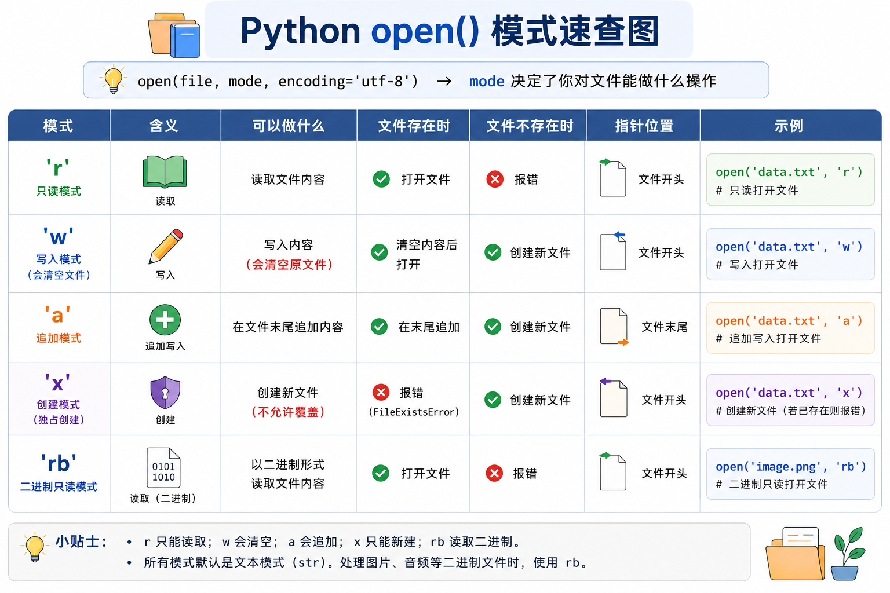
  <figcaption><strong>图3-10 open 模式速查表</strong>：读、写、追加和二进制模式各有用途，尤其要小心覆盖写入。</figcaption>
</figure>

---

文件读写里还有一个经常把新手绊倒的词：编码。

Rosetta Stone 之所以重要，是因为它让不同文字之间有了对照。计算机里的文本也需要这种“对照表”：同样一串字节，用正确编码读出来是中文、英文和标点；用错误编码读出来，就可能变成一串看不懂的乱码。

所以你读写文本时，先养成这个习惯：

```python
encoding="utf-8"
```

这不是仪式感，而是给 Python 一张清楚的翻译说明。

<figure align="center">
  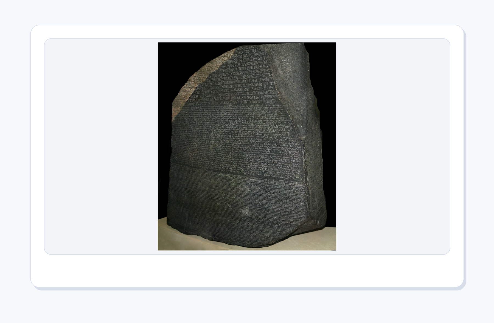
  <figcaption><strong>图3-11 Rosetta Stone照片</strong>：编码就像文字系统的翻译规则；读写文本时明确 `encoding="utf-8"`，就是告诉 Python 用哪套规则解读字符。</figcaption>
</figure>

---

## 3.7 读取文件：read、readline、readlines、逐行循环

读取文件有几种常见方法。

先把四种方法放在一张图里，再逐个跑最小代码。

<figure align="center">
  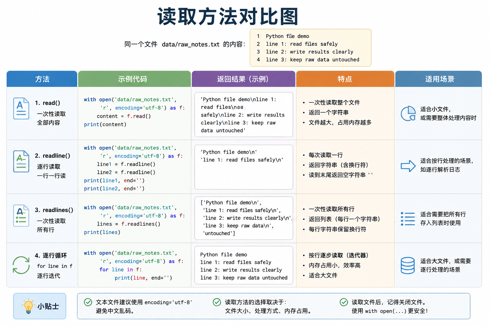
  <figcaption><strong>图3-12 读取方法对比</strong>：不同读取方法适合不同规模和不同结构的文本资料。</figcaption>
</figure>

### 3.7.1 read()

一次读取全部内容：

```python
with open("workspace_ch03/data/raw_notes.txt", "r", encoding="utf-8") as file:
    content = file.read()

print(content)
```

适合小文件。缺点是文件很大时会一次性占用较多内存。

### 3.7.2 readline()

一次读取一行：

```python
with open("workspace_ch03/data/raw_notes.txt", "r", encoding="utf-8") as file:
    first_line = file.readline()

print(first_line)
```

注意：`readline()` 只读一行。如果你要读所有行，要循环。

### 3.7.3 readlines()

读取所有行，返回列表：

```python
with open("workspace_ch03/data/raw_notes.txt", "r", encoding="utf-8") as file:
    lines = file.readlines()

print(lines)
```

列表里的每个元素是一行文本，通常包含换行符。

### 3.7.4 逐行循环

更推荐的通用写法：

```python
with open("workspace_ch03/data/raw_notes.txt", "r", encoding="utf-8") as file:
    for line in file:
        print(line.strip())
```

它适合大文件，也适合边读边处理。

配套脚本：

```bash
python code/ch03/02_read_text_file.py
```

---

## 3.8 with open()：自动关门的阅览室

这里要认真记住一件事：`open()` 之后一定要 `close()`。

传统写法：

```python
file = open("data/raw_notes.txt", "r", encoding="utf-8")
content = file.read()
file.close()
```

问题是：如果中间报错，`close()` 可能执行不到。

更稳的写法是：

```python
with open("data/raw_notes.txt", "r", encoding="utf-8") as file:
    content = file.read()
```

离开 `with` 的缩进块后，文件会自动关闭。

可以把 `with open()` 想成一间会自动关门的阅览室。你进去读资料，读完离开，门自动关上；中间就算你被椅子绊了一下，门也会被处理好。

<figure align="center">
  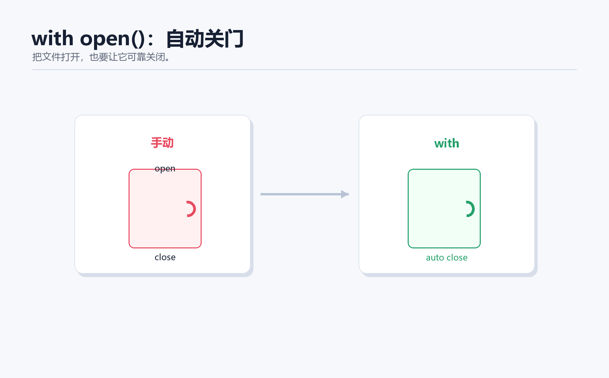
  <figcaption><strong>图3-13 with 自动关闭</strong>：`with open()` 像一扇会自动关上的门，减少忘记关闭文件的风险。</figcaption>
</figure>

后面的文件读写，优先使用 `with` 或 `pathlib` 的读写方法。

---

## 3.9 写入文件：write 和 writelines

写入一个字符串：

```python
with open("workspace_ch03/output/hello.txt", "w", encoding="utf-8") as file:
    file.write("Hello, file!\n")
```

写入多行：

```python
lines = [
    "第一行\n",
    "第二行\n",
    "第三行\n",
]

with open("workspace_ch03/output/lines.txt", "w", encoding="utf-8") as file:
    file.writelines(lines)
```

注意：`writelines()` 不会自动帮你加换行符。你要自己在每行末尾写 `\n`。

用 `pathlib` 也可以写：

```python
from pathlib import Path

Path("workspace_ch03/output/hello.txt").write_text(
    "Hello, file!\n",
    encoding="utf-8",
)
```

配套脚本：

```bash
python code/ch03/03_write_report.py
```

这个脚本会读取 `scores.csv`，计算平均分和最高分，然后写出 `workspace_ch03/output/score_report.txt`。

---

## 3.10 os、os.path 与 pathlib：三种路径工具

你会经常遇到 `os` 和 `os.path`。它们很重要，也很经典：

```python
import os

cwd = os.getcwd()
folder = os.path.join(cwd, "data")
```

现代 Python 里，也经常使用 `pathlib`：

```python
from pathlib import Path

cwd = Path.cwd()
folder = cwd / "data"
```

两种都能完成任务。这一章会更偏向 `pathlib`，因为它更像在操作“路径对象”，写起来清爽，也更适合初学阶段理解。

对比：

| 任务 | os 写法 | pathlib 写法 |
| --- | --- | --- |
| 当前目录 | `os.getcwd()` | `Path.cwd()` |
| 拼接路径 | `os.path.join(a, b)` | `Path(a) / b` |
| 判断存在 | `os.path.exists(p)` | `Path(p).exists()` |
| 创建目录 | `os.mkdir(p)` | `Path(p).mkdir()` |
| 遍历文件 | `os.walk(p)` | `Path(p).rglob("*")` |

你不需要争论谁“更高级”。重要的是能读懂两套写法，并在自己的代码里保持一致。

---

## 3.11 文件复制与移动：shutil 像搬家公司

复制和移动文件时，先认识 `shutil.copyfile()` 和 `shutil.move()`。

复制文件：

```python
import shutil

shutil.copyfile(
    "workspace_ch03/data/raw_notes.txt",
    "workspace_ch03/output/raw_notes_copy.txt",
)
```

移动文件：

```python
shutil.move(
    "workspace_ch03/output/raw_notes_copy.txt",
    "workspace_ch03/archive/raw_notes_copy_archived.txt",
)
```

`shutil` 可以理解成文件操作里的搬家公司。`os` 更像底层接口，`shutil` 更像高级工具箱，适合复制、移动、归档。

配套脚本：

```bash
python code/ch03/04_copy_move_files.py
```

这个脚本只在 `workspace_ch03` 里复制和移动文件。

---

## 3.12 文件夹管理：创建、遍历、删除、复制、移动

常见文件夹操作：

| 操作 | os / shutil | pathlib |
| --- | --- | --- |
| 创建目录 | `os.mkdir(path)` | `Path(path).mkdir()` |
| 遍历目录 | `os.walk(path)` | `Path(path).rglob("*")` |
| 删除空目录 | `os.rmdir(path)` | `Path(path).rmdir()` |
| 删除非空目录 | `shutil.rmtree(path)` | 常配合 `shutil` |
| 复制目录 | `shutil.copytree(old, new)` | 常配合 `shutil` |
| 移动目录 | `shutil.move(old, new)` | 常配合 `shutil` |

把这些动作放到一张图里看，会更像是在管理一棵目录树：先确认根在哪里，再决定创建、遍历、复制、移动还是删除。

<figure align="center">
  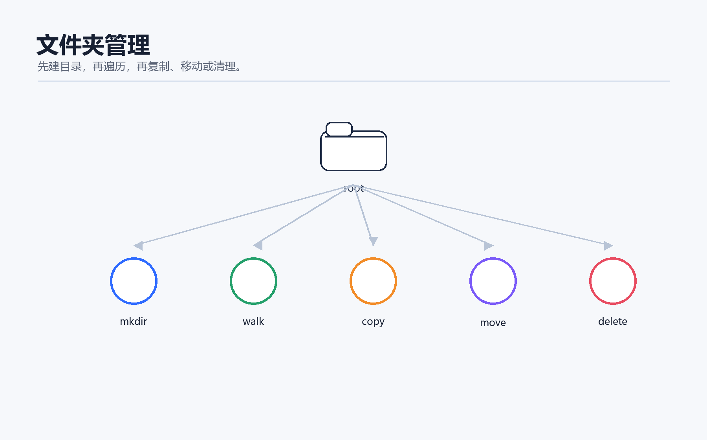
  <figcaption><strong>图3-14 文件夹管理</strong>：创建、遍历、复制、移动和删除文件夹，都要先确认目标路径。</figcaption>
</figure>

创建目录：

```python
from pathlib import Path

Path("workspace_ch03/output").mkdir(parents=True, exist_ok=True)
```

`parents=True` 表示父目录不存在也一起创建。

`exist_ok=True` 表示目录已经存在也不报错。

这两个参数非常适合项目脚本。否则你第二次运行脚本时，可能因为目录已经存在而报错。

---

## 3.13 遍历文件夹并生成清单

遍历目录，就是让 Python 走进一个文件夹，把里面的文件逐个看一遍。

用 `pathlib`：

```python
from pathlib import Path

root = Path("workspace_ch03")

for path in root.rglob("*"):
    if path.is_file():
        print(path, path.stat().st_size)
```

`path.stat().st_size` 可以得到文件大小，单位是字节。

配套脚本：

```bash
python code/ch03/05_walk_folder_report.py
```

它会生成：

```text
workspace_ch03/output/file_inventory.md
```

里面记录每个文件的相对路径和大小。

这就是“图表”和“文件管理”结合起来的入口：你先遍历文件夹，收集信息，再把信息写成报告或画成图。

下面这张图把文件大小做成了可视化结果。它不是为了炫技，而是让你一眼看出哪个文件更占空间。

<figure align="center">
  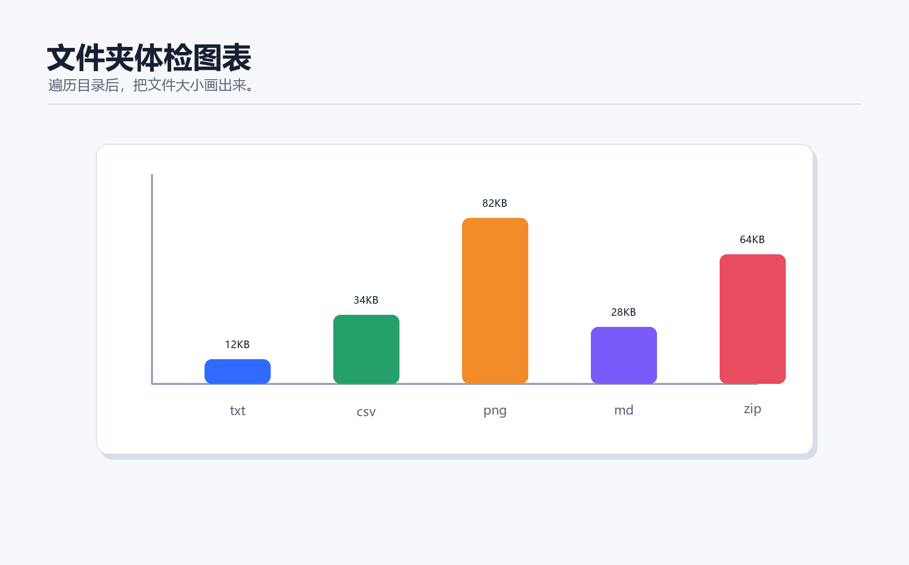
  <figcaption><strong>图3-15 文件大小统计图</strong>：统计文件大小能帮助你快速理解资料夹里哪些文件最占空间。</figcaption>
</figure>

---

## 3.14 删除文件与文件夹：最需要谨慎的操作

删除文件：

```python
from pathlib import Path

Path("workspace_ch03/output/hello.txt").unlink()
```

删除空文件夹：

```python
Path("workspace_ch03/empty_folder").rmdir()
```

删除非空文件夹：

```python
import shutil

shutil.rmtree("workspace_ch03/some_folder")
```

请对 `shutil.rmtree()` 保持尊重。它会删除整个目录树。

更安全的策略：

1. 先打印要删除的路径。
2. 确认路径在项目目录内。
3. 先移动到 `trash` 或 `backup`。
4. 最后再清理。

删除操作最好先在脑子里亮一盏红灯：这不是“撤销一下就好”的练习，而是真的会改变文件系统。

<figure align="center">
  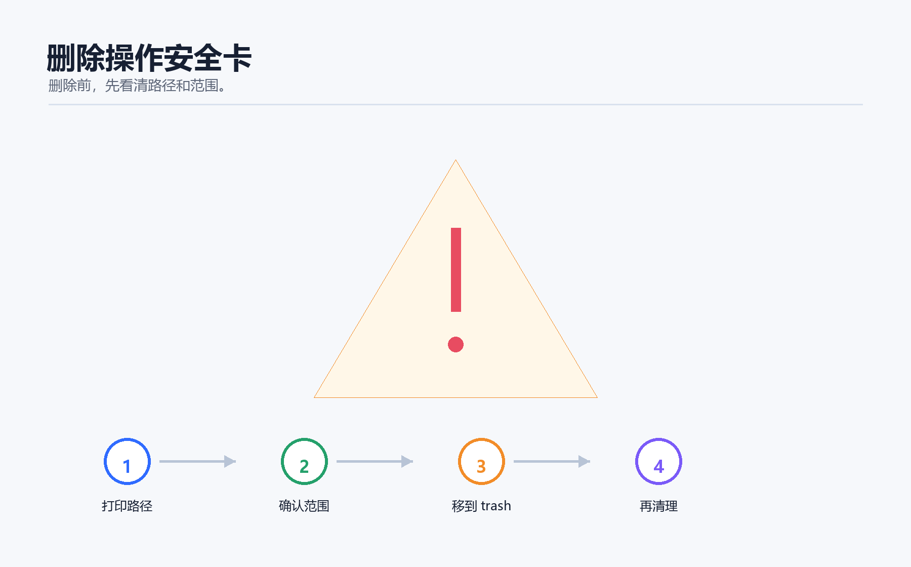
  <figcaption><strong>图3-16 删除安全卡</strong>：删除操作是真实生效的，动手前先确认路径、范围和备份。</figcaption>
</figure>

配套脚本：

```bash
python code/ch03/06_safe_delete_demo.py
```

这个脚本有一个保护函数：如果目标不在 `workspace_ch03` 里，就拒绝删除。

正式做批量复制、移动或删除之前，可以再生成一张“路径安全体检回执”。它不删除任何东西，只检查当前工作区、必要文件夹、源文件数量、整理副本、报告编码和哈希抽查是否正常。

<figure align="center">
  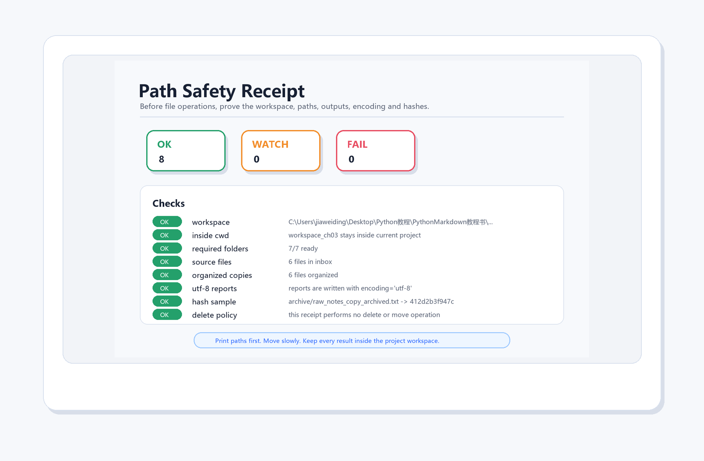
  <figcaption><strong>图3-17 路径安全体检回执</strong>：文件操作前先确认工作区边界、必要文件夹、源文件、整理副本、编码和哈希抽查；路径先打印清楚，手就不容易抖错地方。</figcaption>
</figure>

配套脚本：

```bash
python code/ch03/10_make_path_safety_receipt.py
```

运行后会生成：

```text
workspace_ch03/output/ch03_path_safety_receipt.md
workspace_ch03/output/ch03_path_safety_receipt.png
```

有了安全边界以后，就可以接住上一章留下的真实数据了。ch2 已经把 Stroop trial 保存成 JSON 和 CSV；ch3 的任务不是重新发明数据，而是把它读进来、复制进安全工作区、按类型归档，并生成一份能复查的交接回执。

<figure align="center">
  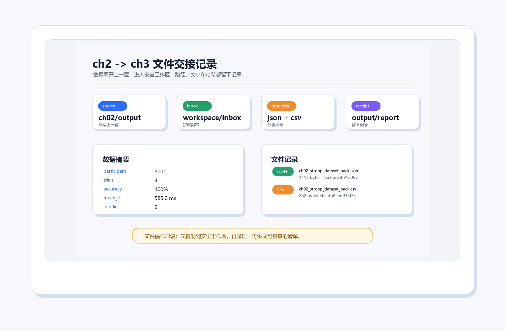
  <figcaption><strong>图3-18 ch2 到 ch3 文件交接回执</strong>：第2章的数据包进入第3章安全工作区，JSON 和 CSV 被复制、分类、记录大小与哈希，文件读写从“会打开文件”升级为“会交接资料”。</figcaption>
</figure>

配套脚本：

```bash
python code/ch03/11_make_ch02_stroop_file_handoff.py
```

运行后会生成：

```text
workspace_ch03/organized/json/ch02_stroop_dataset_pack.json
workspace_ch03/organized/csv/ch02_stroop_dataset_pack.csv
workspace_ch03/output/ch03_ch02_stroop_file_handoff.md
workspace_ch03/output/ch03_ch02_stroop_file_handoff.png
```

这一步是全书主线的一次小接力：ch2 负责把实验 trial 组织成数据结构，ch3 负责把数据结构落到文件系统里。以后做数据分析、图像处理、办公自动化时，很多任务都会从这里开始：先确认文件在哪里，再确认文件有没有被正确交接。

---

## 3.15 常见报错地图

| 报错 | 常见原因 | 处理方式 |
| --- | --- | --- |
| `FileNotFoundError` | 路径写错、当前工作目录不对 | 打印 `Path.cwd()`，检查相对路径 |
| `PermissionError` | 文件被占用或没有权限 | 关闭占用文件的软件，换输出目录 |
| `UnicodeDecodeError` | 编码不匹配 | 明确 `encoding="utf-8"` 或确认文件编码 |
| `FileExistsError` | 创建已存在目录或文件 | 使用 `exist_ok=True` 或换新名字 |
| `IsADirectoryError` | 把文件夹当文件读 | 检查 `path.is_file()` |
| `NotADirectoryError` | 把文件当文件夹遍历 | 检查 `path.is_dir()` |

遇到文件报错，不要先改一堆代码。先问：

1. 我现在站在哪个目录？
2. 我要操作的是文件还是文件夹？
3. 这个路径真的存在吗？
4. 我是在读、写、复制、移动还是删除？

这四个问题能解决大多数文件操作错误。

---

## 3.16 本章小项目：资料归档器

本章的小项目是：把一堆杂乱文件按后缀整理到不同文件夹，并生成一份归档报告。

运行：

```bash
python code/ch03/07_project_archiver.py
```

它会在 `workspace_ch03` 中创建示例文件：

```text
inbox/
├── experiment_notes.txt
├── scores.csv
├── summary.md
└── figure.png
```

然后按后缀复制到：

```text
organized/
├── csv/
├── md/
├── png/
└── txt/
```

并生成：

```text
output/archive_report.md
```

这个小项目有三个实际价值：

1. 它保留原始文件，不直接移动或删除。
2. 它把路径、遍历、复制、写报告串起来。
3. 它可以重复运行，适合后续扩展成真实资料整理工具。

把这条任务线画出来，就是一个小型资料归档器：输入是杂乱文件，输出是分类目录和归档报告。

<figure align="center">
  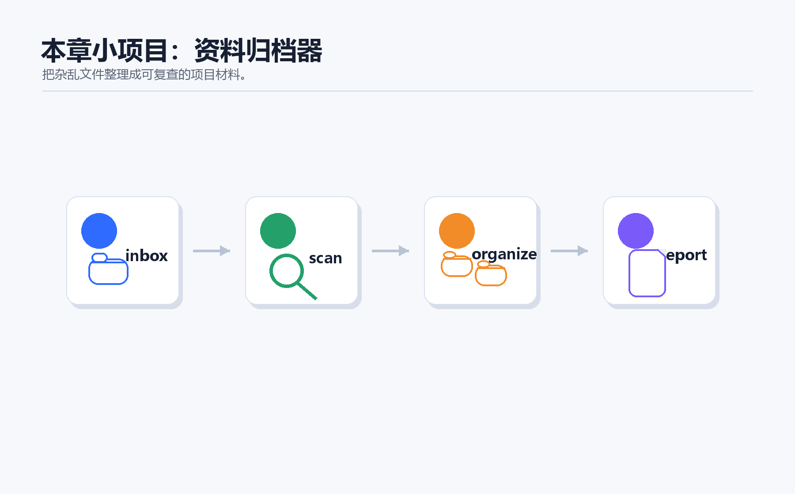
  <figcaption><strong>图3-19 本章小项目</strong>：资料归档器把文件读取、分类、复制和报告生成串成一条完整任务线。</figcaption>
</figure>

如果你希望它更像一个“科研资料归档器”，还可以继续运行：

```bash
python code/ch03/08_make_archive_manifest.py
```

它会生成一份更正式的清单：

```text
workspace_ch03/output/ch03_archive_manifest.md
```

清单里会记录每个文件的相对路径、角色、后缀、大小和哈希摘要。这里的哈希摘要可以先理解成文件的“指纹”：只要文件内容改变，指纹就会变。科研和工程项目里，这种清单很有用，因为它能回答一个朴素但重要的问题：我现在看到的这批文件，到底是哪一批？

<figure align="center">
  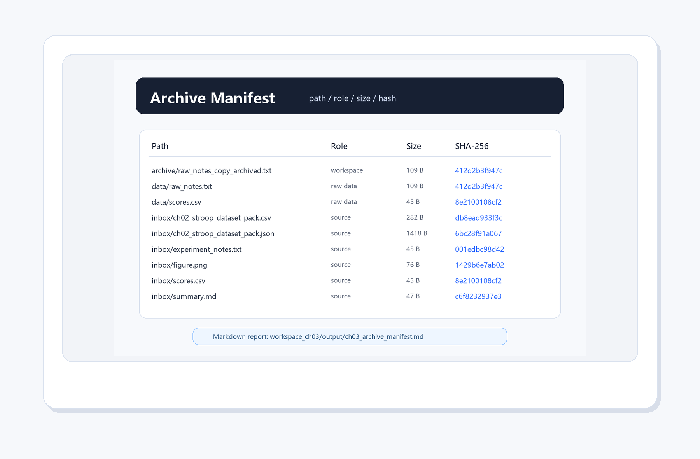
  <figcaption><strong>图3-20 档案清单预览</strong>：最后一步不是“文件看起来放好了”，而是生成一份可检查、可复现的文件清单。</figcaption>
</figure>

当文件数量很少时，手工检查还可以忍一忍；当文件变成几十个、几百个时，清单就是你的第二双眼睛。它不替你思考，但它会诚实记录：有什么文件、放在哪里、大小是多少、有没有发生变化。

如果说档案清单回答的是“有哪些文件”，归档回执回答的就是“这批资料能不能交付给别人检查”。继续运行：

```bash
python code/ch03/09_make_archive_receipt.py
```

它会生成：

```text
workspace_ch03/output/ch03_archive_receipt.md
workspace_ch03/output/ch03_archive_receipt_preview.png
```

运行结果可以用下面这张回执预览来核对。

<figure align="center">
  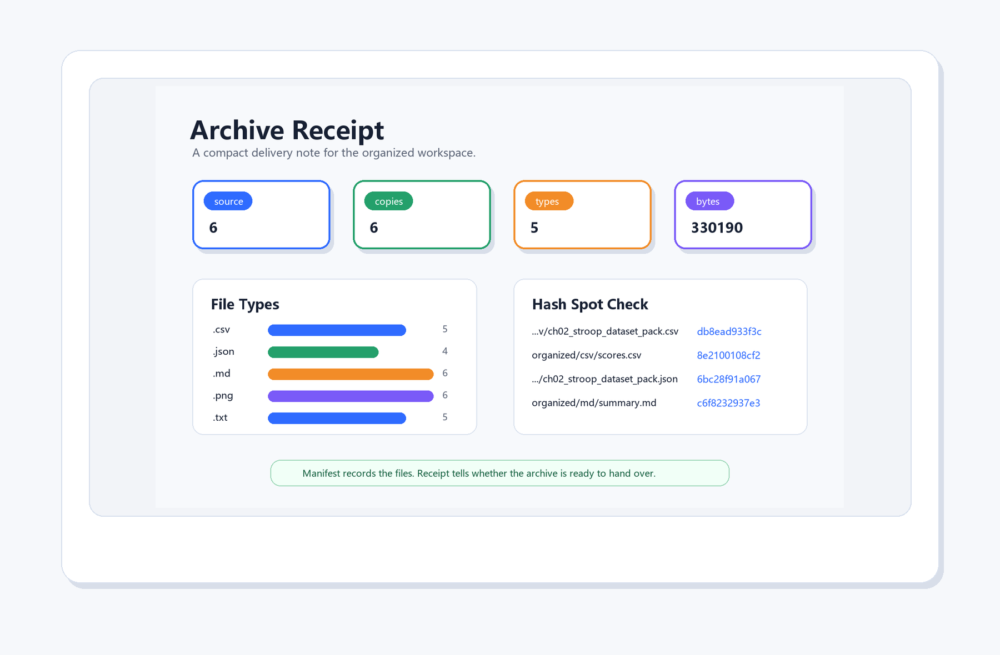
  <figcaption><strong>图3-21 归档回执预览</strong>：回执把源文件数量、整理副本、文件类型、总大小和哈希抽查放在一起，适合用作项目交付前的最后检查。</figcaption>
</figure>

这一步很像快递员递给你的签收单：箱子里有什么，数量对不对，有没有基本检查记录。文件管理学到这里，已经不只是“会读写文件”，而是开始接近真实工作里的资料交付流程。

最后，把本章已经生成的几份证据集中到一张板上。文件读写学习最怕停留在“我好像跑过了”，因为真正做项目时，别人不会检查你的记忆，只会检查文件。

<figure align="center">
  
  <figcaption><strong>图3-22 归档证据板</strong>：`12_make_archive_evidence_board.py` 汇总输入区、整理区、输出区、归档清单、交付回执、路径安全和 ch2 数据交接状态，给本章项目一个可检查的收尾。</figcaption>
</figure>

配套脚本：

```bash
python code/ch03/12_make_archive_evidence_board.py
```

运行后会生成：

```text
workspace_ch03/output/ch03_archive_evidence_board.json
workspace_ch03/output/ch03_archive_evidence_board.png
reports/ch03_archive_evidence_board.md
```

这张图的任务很朴素：把“文件在哪里、整理好了没有、关键回执是否存在”摆到一页上。到了这里，文件管理就不再是零散命令，而是一条清楚的资料交付链。

如果再往真实科研项目靠近一步，还可以给这批资料做一份“入库登记册”。证据板更像验收清单，入库登记册更像档案馆门口的登记台：哪些资料从 `inbox/` 进来，哪些已经进入 `organized/`，哪些报告留在 `output/` 和 `reports/`，关键登记文件是否都 ready。

```bash
python code/ch03/13_make_material_intake_register.py
```

运行后会生成：

```text
workspace_ch03/output/ch03_material_intake_register.json
workspace_ch03/output/ch03_material_intake_register.png
reports/ch03_material_intake_register.md
```

生成后，可以用下面这张登记册图检查“资料入口、整理结果、输出报告”是否全部对上。

<figure align="center">
  
  <figcaption><strong>图3-23 资料入库登记册</strong>：`13_make_material_intake_register.py` 扫描 `inbox/`、`organized/`、`output/` 和 `reports/`，把资料入口、整理结果、输出报告和关键证据文件放在同一张图里，让“我整理过文件”升级为“我能说明资料从哪里来、现在在哪里、凭什么可信”。</figcaption>
</figure>

这张图里没有长篇解释，因为真正的解释应该留在 Markdown 里：文件管理最有价值的地方，不是让文件夹看起来很干净，而是让未来的你、项目伙伴、甚至一个完全没参与项目的人，都能沿着登记册找到材料、报告和证据。资料一旦能被别人复查，就从“个人电脑里的东西”变成了“可以交付的项目材料”。

---

## 3.17 本章核心概念复盘

| 概念 | 一句话解释 | 新手比喻 |
| --- | --- | --- |
| 文件路径 | 文件所在的位置 | 地址 |
| 当前工作目录 | 相对路径的出发点 | 你站着的房间 |
| `open()` | 打开文件 | 拿钥匙开门 |
| `read()` | 读取全部内容 | 一口气读完整本 |
| `readline()` | 读取一行 | 每次读一行 |
| `write()` | 写入字符串 | 往纸上写字 |
| `with open()` | 自动关闭文件 | 自动关门的阅览室 |
| `os` | 操作系统接口 | 基础工具箱 |
| `pathlib` | 路径对象工具 | 路径地图 |
| `shutil` | 高级文件操作 | 搬家公司 |
| 哈希摘要 | 文件内容的简短指纹 | 档案编号 |

下面这张图把本章最关键的检查点收在一起，适合学完以后对照自测。

<figure align="center">
  
  <figcaption><strong>图3-24 文件读写复盘检查点</strong>：学完这一章，脑子里最好留下的不是一串 API 名字，而是一条能复现的路线：从文件夹出发，找到资料，读入程序，生成输出，再用清单和回执把结果检查一遍。</figcaption>
</figure>

如果把这一章想成一次档案馆夜间巡检，表格里的概念就是手电筒、钥匙、登记册和搬运车。每个工具单独看都不复杂，真正重要的是顺序：先确认位置，再读写文件，再整理输出，最后留下证据。这个顺序一旦稳定，后面做 GUI、爬虫、数据分析时，程序就不会把材料丢在路上。

---

## 3.18 本章练习

### 练习 1：确认当前工作目录

写一个脚本，打印：

1. 当前工作目录。
2. `workspace_ch03/data/raw_notes.txt` 是否存在。
3. `workspace_ch03/output` 是否存在。

### 练习 2：读取并统计行数

读取 `raw_notes.txt`，输出：

1. 总行数。
2. 包含 `file` 的行。
3. 每一行去掉换行符后的内容。

### 练习 3：写入学习日志

创建 `workspace_ch03/output/learning_log.txt`，写入：

1. 今天学习了什么。
2. 遇到的一个文件路径问题。
3. 你是如何定位它的。

### 练习 4：文件夹体检

遍历 `workspace_ch03`，输出所有文件的：

1. 相对路径。
2. 文件大小。
3. 文件后缀。

把结果写入 Markdown 文件。

### 练习 5：给文件生成指纹

读取 `workspace_ch03/output/ch03_archive_manifest.md`，观察每个文件的 SHA-256 前缀。然后修改一个示例文件，重新运行 `08_make_archive_manifest.py`，看看对应指纹是否发生变化。

### 练习 6：生成归档回执

运行：

```bash
python code/ch03/09_make_archive_receipt.py
```

然后打开：

```text
workspace_ch03/output/ch03_archive_receipt.md
```

回答三个问题：

1. 这次归档有多少个源文件？
2. 哪种后缀的文件最多？
3. 为什么“清单”和“回执”都需要保留？

### 练习 7：接收上一章的数据包

先确认 ch2 已经生成 Stroop 数据包：

```bash
python ../python_tutorial_ch02/code/ch02/10_make_stroop_dataset_pack.py
```

再运行 ch3 的文件交接脚本：

```bash
python code/ch03/11_make_ch02_stroop_file_handoff.py
```

检查 4 个结果：

1. `workspace_ch03/organized/json/ch02_stroop_dataset_pack.json`
2. `workspace_ch03/organized/csv/ch02_stroop_dataset_pack.csv`
3. `workspace_ch03/output/ch03_ch02_stroop_file_handoff.md`
4. `workspace_ch03/output/ch03_ch02_stroop_file_handoff.png`

然后打开 Markdown 回执，回答：为什么文件交接时要记录大小和哈希？如果只说“我复制过了”，证据够不够？

### 练习 8：生成资料入库登记册

运行：

```bash
python code/ch03/13_make_material_intake_register.py
```

然后打开：

```text
reports/ch03_material_intake_register.md
```

回答三个问题：

1. `inbox/`、`organized/`、`output/`、`reports/` 各有多少个文件？
2. 哪个区域最像“原料入口”，哪个区域最像“交付出口”？
3. 如果别人只拿到这份登记册，能不能判断本章项目是否值得信任？还缺什么证据？

<figure align="center">
  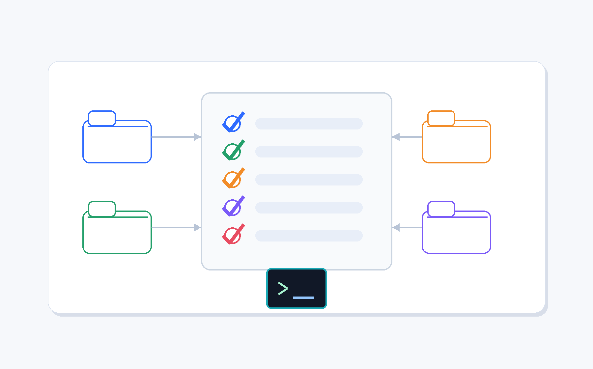
  <figcaption><strong>图3-25 文件管理练习证据工作台</strong>：练习不是把命令敲完就结束，而是把输入文件、整理目录、输出报告和终端运行结果都摆上桌面，检查它们是否彼此对得上。</figcaption>
</figure>

做这些练习时，可以把自己当成项目资料管理员：不是“我跑过代码”，而是“我能证明这批资料从哪里来、被放到哪里、生成了什么结果”。这种证据意识会在后面的科研自动化任务里反复出现，尤其是处理问卷、实验记录、图片素材和报告附件时。

---

## 3.19 给自己的提醒：文件操作要慢一点

文件操作看起来只是 API，但它牵涉三个初学者很容易混淆的概念：

1. 文件路径。
2. 当前工作目录。
3. 文件和文件夹的区别。

自学时不要一开始就连续硬背 `open()`、`read()`、`write()`、`os.walk()`、`shutil.copytree()`。

更好的顺序是：

1. 先创建一个明确的项目目录。
2. 亲眼看到 `data/` 和 `output/`。
3. 打印 `Path.cwd()`。
4. 读一个很小的文本文件。
5. 写一个很小的输出文件。
6. 最后再处理复制、移动和删除。

这一章要建立一种习惯：

> 原始资料不要乱动，输出结果单独保存，删除操作先确认路径。

---

## 3.20 本章配套文件

到这里，文件已经不只是硬盘上的零散对象，而是后续界面、分析和自动化报告的材料入口。下一章写 GUI 时，按钮背后要读取什么、保存到哪里、出错时怎么提示，都离不开这一章建立的路径和文件习惯。

这也是第3章和第4章之间的交接：先把资料放稳，再把操作做成界面。

<figure align="center">
  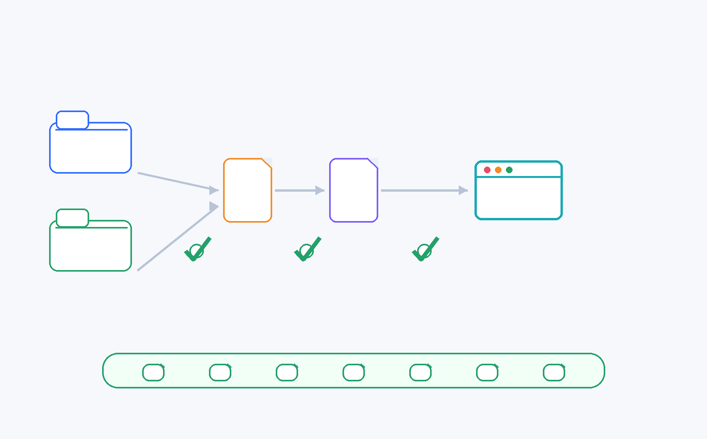
  <figcaption><strong>图3-26 文件资料到 GUI 的交接桥</strong>：第3章把资料整理成稳定的文件和报告；第4章会把这些材料接到窗口、按钮和输入框上，让程序从“能在终端运行”变成“能被人点击使用”。</figcaption>
</figure>

```text
python_tutorial_ch03/
├── README.md
├── chapters/
│   └── ch03_file_io_folder_management.md
├── assets/
│   └── ch03/
│       ├── ch03_cover.png
│       ├── ch03_roadmap.png
│       ├── ch03_archive_box_project_story.png
│       ├── ch03_information_trail_vannevar_bush.png
│       ├── ch03_file_io_pipeline.png
│       ├── ch03_card_filing_cabinet_path_index.png
│       ├── ch03_archive_storage_shelves.png
│       ├── ch03_powershell_file_operations_run.png
│       ├── ch03_open_mode_matrix.png
│       ├── ch03_rosetta_encoding_story.png
│       ├── ch03_with_context_door.png
│       ├── ch03_read_methods_comparison.png
│       ├── ch03_path_map.png
│       ├── ch03_folder_tree_operations.png
│       ├── ch03_file_size_chart.png
│       ├── ch03_safe_delete_warning.png
│       ├── ch03_path_safety_receipt.png
│       ├── ch03_ch02_stroop_file_handoff.png
│       ├── ch03_mini_project_archiver.png
│       ├── ch03_archive_manifest_preview.png
│       ├── ch03_archive_receipt_preview.png
│       ├── ch03_archive_evidence_board.png
│       ├── ch03_material_intake_register.png
│       ├── ch03_review_checkpoint.png
│       ├── ch03_practice_evidence_workbench.png
│       ├── ch03_gui_handoff_bridge.png
│       └── web/
│           ├── archival_carton_01.jpg
│           ├── archive_storage_unsplash.jpg
│           ├── card_filing_cabinet.jpg
│           ├── rosetta_stone.jpg
│           ├── powershell_ch03_file_operations_run.png
│           ├── vannevar_bush_portrait.jpg
│           ├── ch03_archive_manifest_preview.png
│           ├── ch03_archive_receipt_preview.png
│           ├── ch03_archive_evidence_board.png
│           ├── ch03_material_intake_register.png
│           └── ch03_path_safety_receipt.png
├── code/
│   └── ch03/
│       ├── 01_create_sample_files.py
│       ├── 02_read_text_file.py
│       ├── 03_write_report.py
│       ├── 04_copy_move_files.py
│       ├── 05_walk_folder_report.py
│       ├── 06_safe_delete_demo.py
│       ├── 07_project_archiver.py
│       ├── 08_make_archive_manifest.py
│       ├── 09_make_archive_receipt.py
│       ├── 10_make_path_safety_receipt.py
│       ├── 11_make_ch02_stroop_file_handoff.py
│       ├── 12_make_archive_evidence_board.py
│       ├── 13_make_material_intake_register.py
│       └── requirements.txt
├── workspace_ch03/
│   └── output/
│       ├── ch03_archive_manifest.md
│       ├── ch03_archive_manifest_preview.png
│       ├── ch03_archive_receipt.md
│       ├── ch03_archive_receipt_preview.png
│       ├── ch03_path_safety_receipt.md
│       ├── ch03_path_safety_receipt.png
│       ├── ch03_ch02_stroop_file_handoff.md
│       ├── ch03_ch02_stroop_file_handoff.png
│       ├── ch03_archive_evidence_board.json
│       ├── ch03_archive_evidence_board.png
│       ├── ch03_material_intake_register.json
│       └── ch03_material_intake_register.png
├── reports/
│   ├── ch03_archive_evidence_board.md
│   └── ch03_material_intake_register.md
├── source_notes/
│   ├── source_manifest_ch03.md
│   └── quality_audit_ch03.md
├── scripts/
│   ├── check_links.py
│   └── generate_ch03_visuals.py
└── manifest.json
```

---

## 3.21 下一章预告：给程序装一张脸

下一章会进入 Tkinter 图形界面编程。

到目前为止，我们主要在终端里和 Python 交流。下一章开始，程序会有窗口、按钮、输入框和事件响应。你会第一次看到：同样是 Python 代码，它不仅能处理数据，也能做一个别人可以点击使用的小工具。
