# 第 4 章：Tkinter 图形界面编程

[TOC]

<figure align="center">
  
  <figcaption><strong>图4-1 第4章封面</strong>：这一章把函数放到窗口里，让用户通过输入框、按钮和反馈完成一个真实任务。</figcaption>
</figure>

> 本章一句话：  
> **GUI 不是给程序贴一层漂亮皮肤，而是把输入、动作、反馈和文件结果摆到用户面前。窗口能弹出来只是开始，能让用户少猜、少错、能拿到结果，才算真正有用。**

第4章继续推进“科研卡片工厂”。前面几章已经打通了环境、数据类型和文件管理；现在我们要给这些能力做一个前台入口。用户不需要记住 `Path.write_text()`，也不需要知道脚本内部函数名，只要在窗口里填内容、点按钮、看到反馈，最后能在 `cards/` 或 `reports/` 里找到结果。

本章的读法和第1章保持一致：**先跑真实脚本，再看截图记录，最后把概念拆成能复查的动作**。不要一上来背 Tkinter API。先让一个窗口真的停在屏幕上，再逐步问：窗口是谁创建的，控件从哪里来，按钮点下去之后到底调用了哪个函数，保存结果在哪里。

---

## 本章导读：先让窗口亮起来，再证明它真的能做事

### 4.0 本章学习目标

学完本章，你应该能够做到：

1. 用自己的话解释 GUI、Tkinter、窗口、控件、布局、事件和回调函数的关系。
2. 运行 `01_hello_window.py`，看到最小 Tkinter 窗口，并能指出代码和界面元素的对应关系。
3. 运行 `02_card_form.py`，理解 `Entry`、`Text`、`Button` 和 `messagebox` 如何组成一个学习卡片表单。
4. 解释 `command=save_card` 与 `command=save_card()` 的区别，避免回调函数提前执行。
5. 运行 `03_stroop_gui_preview.py`，理解 GUI 如何承接心理学实验里的刺激、按键、正确性和反应时。
6. 使用可用性检查清单判断一个小窗口是否让用户少猜、少错、少迷路。
7. 完成本章小项目：**科研卡片工厂控制面板**，并留下卡片、报告、输出图和运行记录。

### 本章分区导航

| 分区 | 对应小节 | 你要抓住的主线 | 产出记录 |
| --- | --- | --- | --- |
| 第一部分：窗口通电与心智模型 | 4.1-4.3 | GUI 是把函数包装成用户能操作的动作 | 最小窗口截图、代码与界面对照图 |
| 第二部分：控件、布局与表单 | 4.4-4.6 | 控件负责收集输入，布局负责让它们有秩序 | 学习卡片表单窗口、保存函数 |
| 第三部分：事件、回调与反馈 | 4.7-4.10 | 点击、按键和消息框形成交互闭环 | Stroop GUI、可用性检查、反馈检查卡 |
| 第四部分：学习成果与跨章连接 | 4.11-4.14 | GUI 项目最后要留下文件、报告和用户旅程记录 | 交互记录、卡片成果、ch3 数据面板 |
| 第五部分：排错、练习与自查 | 4.15-4.20 | 用固定路线排查 GUI 常见问题 | 常见坑地图、运行记录清单、复盘报告 |

<figure align="center">
  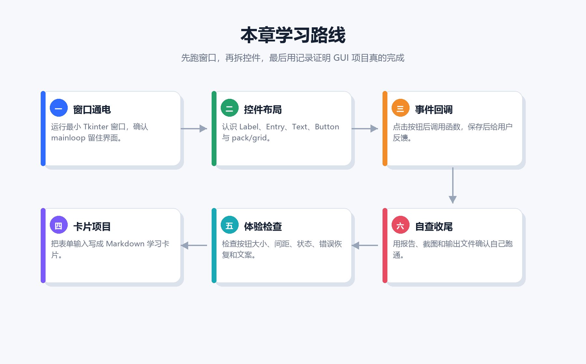
  <figcaption><strong>图4-2 本章学习路线</strong>：先跑窗口，再拆控件，最后用截图、报告和输出文件证明 GUI 项目真的完成。</figcaption>
</figure>

---

## 第一部分：窗口通电与 Tkinter 心智模型

### 4.1 GUI 是把函数放到前台

命令行像后厨，GUI 像前台。后厨里有函数、路径、参数和文件写入；前台上有标签、输入框、按钮和状态提示。两边做的是同一件事，只是入口不同。

<figure align="center">
  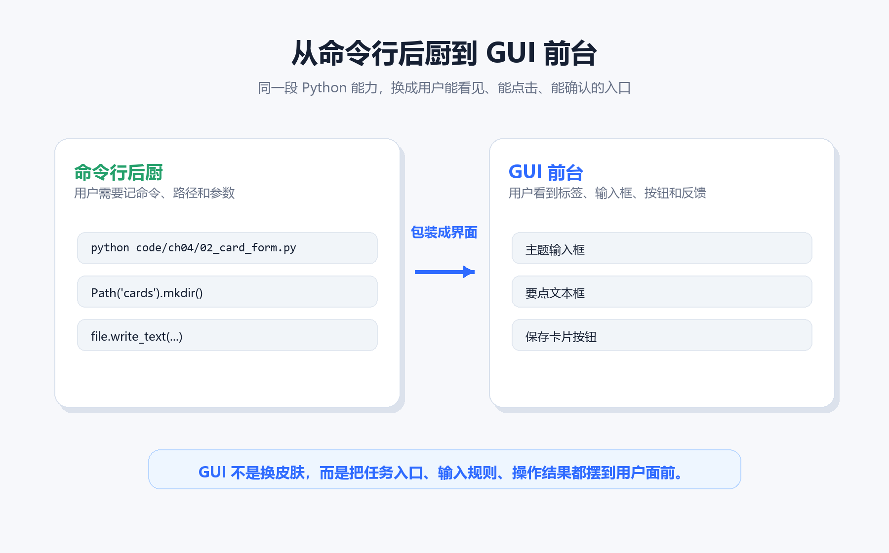
  <figcaption><strong>图4-3 从命令行后厨到 GUI 前台</strong>：GUI 不只是“好看一点”，而是把命令、函数和文件操作改造成用户能看见、能点击、能确认的任务入口。</figcaption>
</figure>

在命令行里，用户要知道脚本路径：

```bash
python code/ch04/02_card_form.py
```

还要理解输出会写到哪里：

```python
Path("cards").mkdir(exist_ok=True)
file.write_text(...)
```

而在 GUI 里，用户看到的是“主题”“要点”“保存卡片”。这些文字不是装饰，而是在帮用户理解任务。一个好窗口会替用户回答三件事：

1. 我现在要输入什么？
2. 我按这个按钮会发生什么？
3. 刚才那一下到底成功了吗？

这件事不是 Tkinter 才有的新问题。1960 年代，Douglas Engelbart 做鼠标、超文本和协作系统演示时，想解决的也不是“让屏幕更花”，而是让人可以直接操作屏幕上的对象，把想法、文本和命令组织成更顺手的工作方式。后来图形界面一路发展到 Alto、Macintosh 和 HyperCard，核心都没有离开这条线：**把计算机内部的动作，翻译成人能看懂、敢点击、能纠错的界面。**

<figure align="center">
  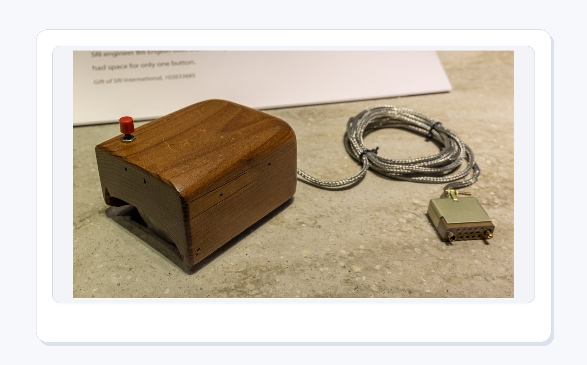
  <figcaption><strong>图4-S1 Engelbart 鼠标原型</strong>：鼠标的意义不只是多了一个外设，而是让人可以把手上的动作映射到屏幕对象上。</figcaption>
</figure>

<figure align="center">
  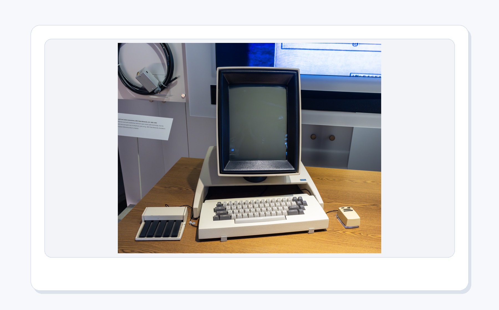
  <figcaption><strong>图4-S2 Xerox Alto</strong>：窗口、图标、鼠标和桌面隐喻把计算机从命令文本带向可直接操作的工作空间。</figcaption>
</figure>

<figure align="center">
  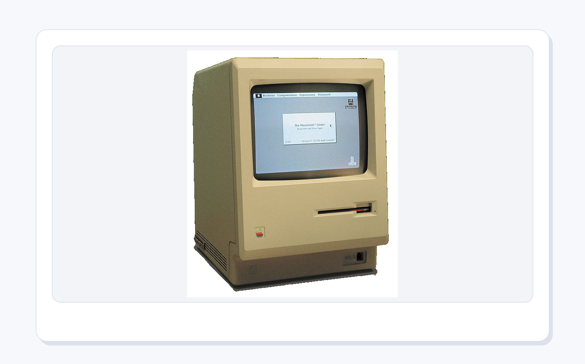
  <figcaption><strong>图4-S3 Macintosh 128K</strong>：GUI 真正改变学习门槛的地方，是让更多普通用户不用先背命令，也能开始完成任务。</figcaption>
</figure>

这一章的重点就是把这三件事做清楚。我们先从最小窗口开始，不做大而全的软件。

### 4.2 最小窗口：先跑通 `01_hello_window.py`

进入第4章目录后，先运行最小窗口脚本：

```bash
python code/ch04/01_hello_window.py
```

你应该看到一个小窗口，里面有一句提示和一个“收到”按钮。这个脚本的意义不是炫技，而是证明本机的 Tkinter 可以创建窗口、显示控件、响应按钮。

<figure align="center">
  
  <figcaption><strong>图4-4 最小窗口代码与界面对照</strong>：`root.title()` 控制标题栏，`Label` 显示文字，`Button` 接收点击，`mainloop()` 让窗口持续响应。</figcaption>
</figure>

对应代码如下：

```python
import tkinter as tk

root = tk.Tk()
root.title("科研卡片工厂控制台")
root.geometry("360x180")

label = tk.Label(root, text="第一块 GUI 面板已经亮灯")
label.pack(pady=30)

button = tk.Button(root, text="收到", command=root.destroy)
button.pack()

root.mainloop()
```

这段代码只需要抓住四个点：

| 代码 | 人话解释 | 如果漏掉会怎样 |
| --- | --- | --- |
| `root = tk.Tk()` | 创建窗口 | 没有舞台，控件没地方放 |
| `tk.Label(...)` | 放一行说明文字 | 用户不知道窗口想说什么 |
| `tk.Button(..., command=...)` | 放一个可点击动作 | 用户无法触发函数 |
| `root.mainloop()` | 让窗口持续响应 | 窗口可能一闪而过 |

<figure align="center">
  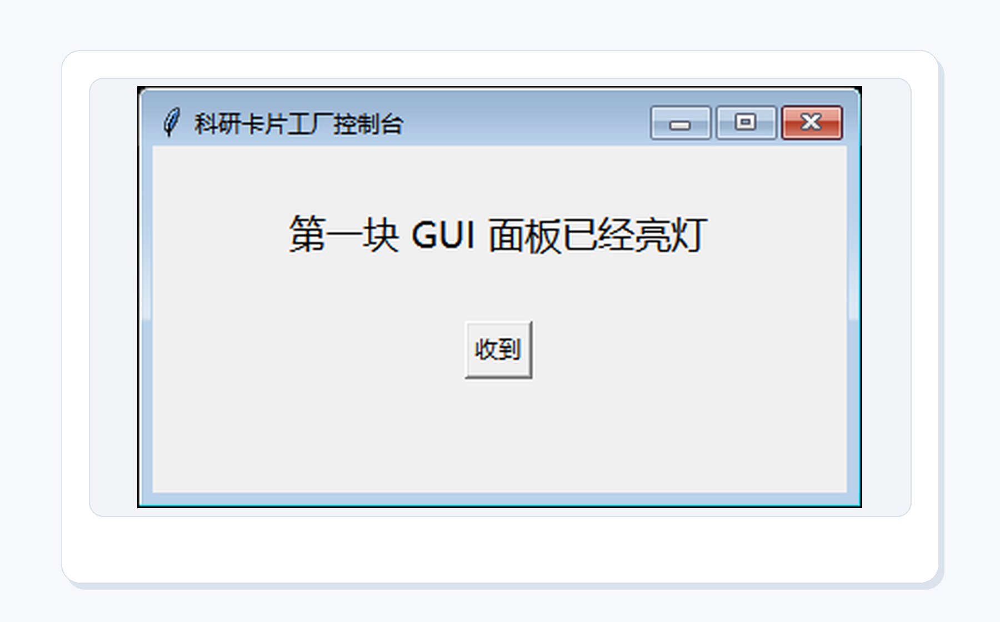
  <figcaption><strong>图4-5 Tkinter 最小窗口真实截图</strong>：这是本章第一个脚本弹出的真实窗口。先让它跑起来，后面再谈表单、事件和文件保存。</figcaption>
</figure>

如果窗口没有出现，先不要改代码。按这个顺序查：

1. 你是不是在 `python_tutorial_ch04` 目录里运行？
2. 脚本路径是不是 `code/ch04/01_hello_window.py`？
3. 终端有没有报错？
4. 有没有远程环境或无图形界面环境导致窗口无法显示？

这和第1章查环境是同一套思路：先看记录，再改问题。

### 4.3 Tkinter 的五个角色

Tkinter 的概念很多，但初学阶段先压成五个角色：

<figure align="center">
  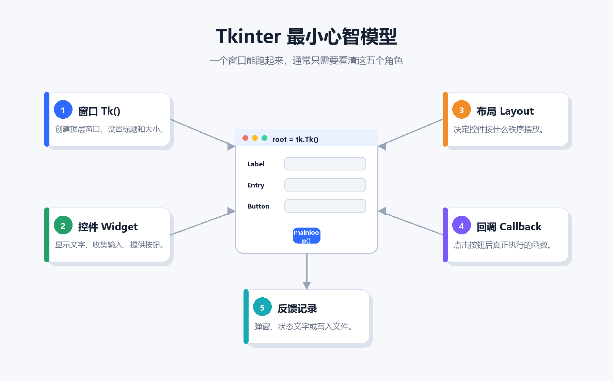
  <figcaption><strong>图4-6 Tkinter 最小心智模型</strong>：窗口、控件、布局、回调和反馈组成一个小型 GUI 程序的基本骨架。</figcaption>
</figure>

| 角色 | 代码里常见写法 | 负责什么 |
| --- | --- | --- |
| 窗口 | `tk.Tk()` | 创建顶层窗口，像一张工作台 |
| 控件 | `Label`、`Entry`、`Text`、`Button` | 显示文字、收集输入、触发动作 |
| 布局 | `.pack()`、`.grid()`、`.place()` | 决定控件摆在哪里 |
| 回调 | `command=save_card` | 用户点击后调用哪个函数 |
| 反馈 | `messagebox.showinfo(...)` | 告诉用户操作结果 |

这五个角色不是背诵表，而是读代码时的检查顺序。以后看到一个 GUI 程序，你可以先问：

1. 窗口在哪里创建？
2. 控件有哪些？
3. 它们怎么摆放？
4. 用户动作绑定到哪个函数？
5. 函数执行后有没有反馈或文件结果？

---

## 第二部分：控件、布局与表单

### 4.4 控件不是零件堆

Tkinter 控件看起来像零件表，但它们要服务同一个任务。第4章不要求你把所有控件背下来，先掌握最常用的四个：

| 控件 | 适合放什么 | 本章用法 |
| --- | --- | --- |
| `Label` | 固定说明文字 | 告诉用户这里要填“主题”还是“要点” |
| `Entry` | 单行短输入 | 输入卡片主题、被试编号、文件名 |
| `Text` | 多行长输入 | 输入笔记、实验说明、学习要点 |
| `Button` | 用户主动触发的动作 | 保存卡片、开始试次、导出报告 |

控件本身不等于界面好用。`Entry` 如果旁边没有标签，用户不知道该填什么；`Button` 如果只写“确定”，用户不知道确定什么。GUI 设计的第一步不是追求华丽，而是把任务说清楚。

早期图形界面之所以能降低陌生感，很大一部分靠“可识别的符号”。Susan Kare 为 Macintosh 设计的图标之所以经典，不只是像素画漂亮，而是把“保存、文件夹、警告、垃圾桶”这些抽象动作变成用户一眼能猜到的形状。你写 Tkinter 时没有必要做整套图标，但要学会同一种态度：控件文字、按钮位置和反馈文案都要帮用户少猜。

<figure align="center">
  
  <figcaption><strong>图4-S4 Susan Kare 与图标设计</strong>：好图标和好按钮文案一样，都是在替用户把“这是什么、能做什么”说清楚。</figcaption>
</figure>

### 4.5 学习卡片表单：`02_card_form.py`

现在运行本章第二个脚本：

```bash
python code/ch04/02_card_form.py
```

这个窗口比最小例子多了两类输入：一个单行主题输入框，一个多行要点输入区。点击“保存卡片”以后，程序会把内容写入 `cards/` 目录。

<figure align="center">
  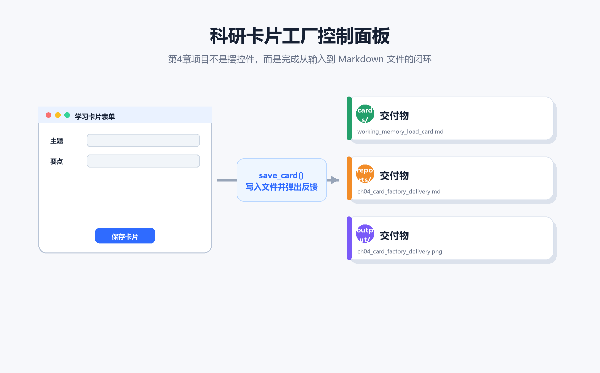
  <figcaption><strong>图4-7 科研卡片工厂控制面板</strong>：表单负责收集输入，`save_card()` 负责把输入变成 Markdown 文件和可复查报告。</figcaption>
</figure>

<figure align="center">
  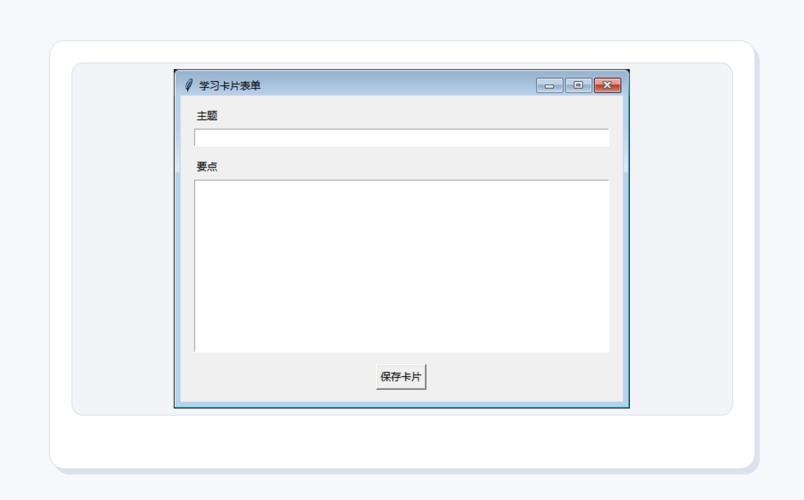
  <figcaption><strong>图4-8 Tkinter 学习卡片表单真实截图</strong>：`Entry` 收集主题，`Text` 收集要点，按钮把内容写入本地 Markdown 卡片。</figcaption>
</figure>

关键函数是 `save_card()`：

```python
def save_card():
    topic = topic_entry.get().strip() or "未命名主题"
    idea = idea_text.get("1.0", "end").strip()
    out = Path("cards")
    out.mkdir(exist_ok=True)
    file = out / f"{topic.replace(' ', '_')}_card.md"
    file.write_text(f"# {topic}\n\n{idea}\n", encoding="utf-8")
    messagebox.showinfo("已保存", f"卡片已写入：{file}")
```

这段函数把前面章节的知识连起来了：

| 来自哪一章 | 在这里怎么用 |
| --- | --- |
| 第2章字符串 | `strip()` 清理输入，f-string 组合文本 |
| 第3章文件管理 | `Path("cards")` 创建目录并写入文件 |
| 第4章 GUI | `Entry.get()` 和 `Text.get()` 收集用户输入 |
| 第4章反馈 | `messagebox.showinfo()` 告诉用户保存成功 |

这里有一个很重要的学习点：窗口里看起来是“点按钮”，代码里其实是“调用函数”。GUI 把函数包装成了用户可操作的动作。

### 4.6 布局：先用 `pack()`，再认识 `grid()`

本章脚本主要使用 `pack()`，因为它简单、适合纵向表单：

```python
tk.Label(root, text="主题").pack(anchor="w", padx=16, pady=(12, 4))
topic_entry.pack(fill="x", padx=16)
idea_text.pack(fill="both", expand=True, padx=16)
tk.Button(root, text="保存卡片", command=save_card).pack(pady=14)
```

先把 `pack()` 理解成“按顺序把控件放进窗口”。几个常用参数很有用：

| 参数 | 人话解释 | 常见用途 |
| --- | --- | --- |
| `padx` | 左右留白 | 输入框不要贴着窗口边缘 |
| `pady` | 上下留白 | 标签和输入框之间有呼吸 |
| `fill="x"` | 横向撑满 | 让 `Entry` 更好输入 |
| `fill="both"` | 横向纵向都撑开 | 让 `Text` 有足够空间 |
| `expand=True` | 窗口变大时一起扩展 | 多行输入区更自然 |

`grid()` 更像表格，适合复杂表单。你可以先不急着用它。第4章的目标是理解 GUI 的基本闭环，不是在布局语法里迷路。

---

## 第三部分：事件、回调与反馈

### 4.7 回调函数：按钮不是现在执行，而是等用户点击

Tkinter 里最容易犯的错误之一是：

```python
tk.Button(root, text="保存卡片", command=save_card())
```

这行看着很像正确写法，但它会在创建按钮时立刻执行 `save_card()`。按钮还没被用户点，函数已经跑完了。正确写法是：

```python
tk.Button(root, text="保存卡片", command=save_card)
```

少了括号，意思变了：不是现在调用函数，而是把函数交给按钮，等用户点击时再调用。

可以这样记：

| 写法 | 什么时候执行 |
| --- | --- |
| `command=save_card` | 用户点击按钮时执行 |
| `command=save_card()` | 创建按钮时立刻执行 |

这不是语法小细节，而是 GUI 程序的核心。命令行脚本通常从上到下一次执行；GUI 程序则经常在等待用户动作。用户点按钮、按键、关闭窗口，程序才响应。

### 4.8 Stroop GUI 预告：事件也可以来自键盘

运行第三个脚本：

```bash
python code/ch04/03_stroop_gui_preview.py
```

这个例子把心理学实验任务放进一个小窗口里：点击开始后出现刺激，用户按 `f` 或 `j` 反应，程序计算正确性和反应时。

<figure align="center">
  
  <figcaption><strong>图4-9 GUI 接入心理学实验流程</strong>：Stroop 小窗口把刺激呈现、按键反应、反应时计算和结果保存放进同一条交互链。</figcaption>
</figure>

<figure align="center">
  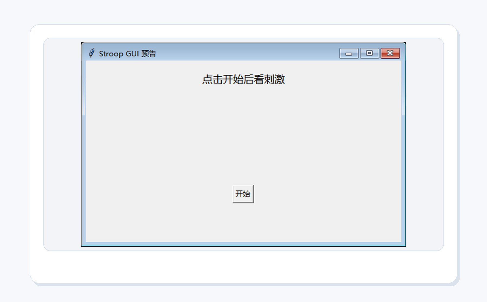
  <figcaption><strong>图4-10 Tkinter Stroop GUI 真实截图</strong>：GUI 不只适合表单，也适合把实验任务里的刺激、按键和反馈组织起来。</figcaption>
</figure>

代码里的两行绑定很关键：

```python
root.bind("f", lambda event: respond("f"))
root.bind("j", lambda event: respond("j"))
```

这说明 GUI 的事件不只有按钮点击。键盘、鼠标、窗口关闭、输入变化，都可以成为事件。事件发生后，程序调用对应函数，这就是“事件驱动”的基本味道。

不过也要清醒：这个脚本只是预告，不是正式实验程序。正式心理学实验需要更严格的随机化、计时、屏幕控制和数据保存。第4章先让你看到 GUI 与实验任务的连接方式。

### 4.9 反馈：用户需要知道刚才发生了什么

很多新手窗口能运行，但用户点完按钮以后什么都不知道。文件到底保存了吗？保存到哪里了？标题为空会怎样？失败了能不能重新输入？

本章提供了一个可用性检查脚本：

```bash
python code/ch04/04_gui_usability_check.py
```

运行后会生成：

```text
reports/ch04_gui_usability_check.md
output/ch04_gui_usability_check.png
```

<figure align="center">
  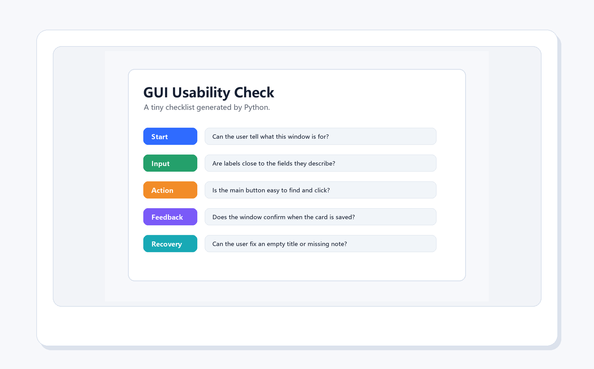
  <figcaption><strong>图4-11 GUI 可用性检查清单</strong>：一个小窗口交给别人之前，至少要检查用途、标签、主按钮、保存反馈和错误恢复。</figcaption>
</figure>

这份清单并不是让 GUI 设计变复杂，而是把“友好一点”拆成能检查的问题：

1. 用户一眼能看出窗口是做什么的吗？
2. 标签离对应输入框够近吗？
3. 主按钮是否清楚、容易点？
4. 保存以后有没有确认反馈？
5. 用户填错或漏填时能不能恢复？

### 4.10 按钮大小、间距、状态和文案

运行反馈实验脚本：

```bash
python code/ch04/05_make_gui_feedback_lab.py
```

它会生成两张图：

```text
output/ch04_target_feedback_lab.png
output/ch04_gui_feedback_scorecard.png
reports/ch04_gui_feedback_scorecard.md
```

<figure align="center">
  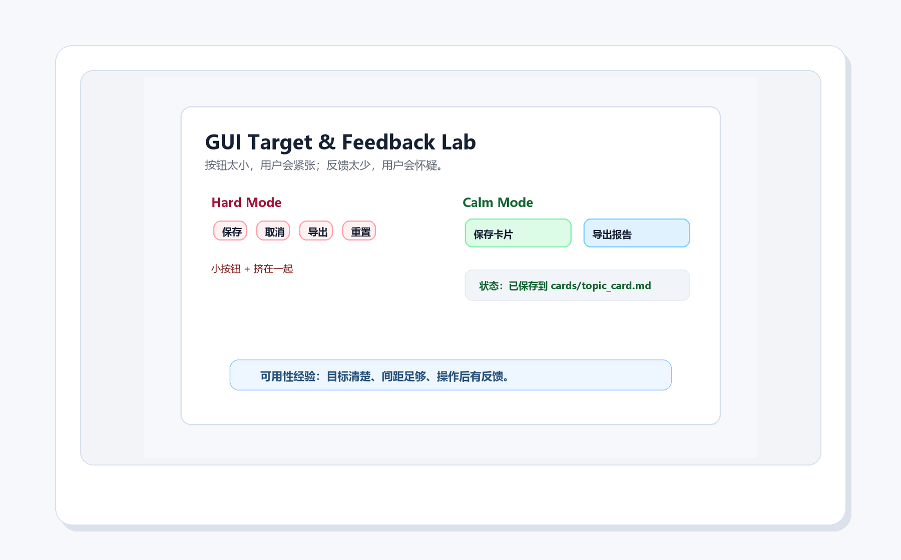
  <figcaption><strong>图4-12 GUI 目标大小与反馈实验</strong>：按钮太小、太挤、没有状态提示，用户就会紧张；按钮清楚、间距足够、保存后有反馈，用户才敢继续操作。</figcaption>
</figure>

<figure align="center">
  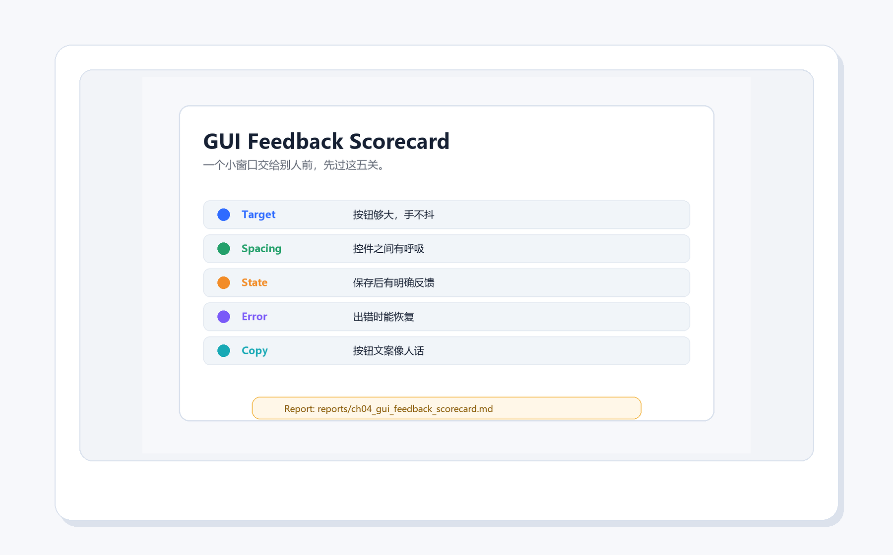
  <figcaption><strong>图4-13 GUI 反馈检查卡</strong>：用 Target、Spacing、State、Error、Copy 五个检查点，判断窗口是否真的适合交给别人使用。</figcaption>
</figure>

界面设计里有一个朴素原则：用户迟疑的地方，就是界面应该多给线索的地方。

<figure align="center">
  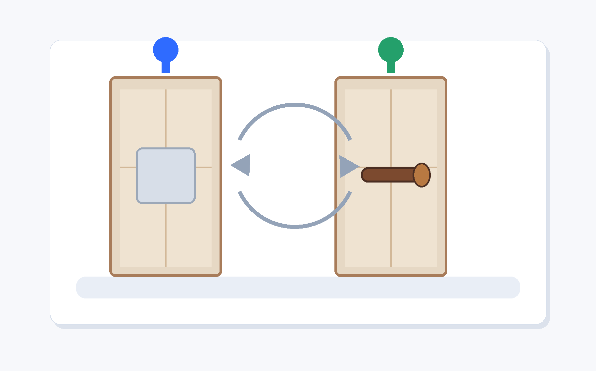
  <figcaption><strong>图4-14 界面线索</strong>：推板、拉手和按钮文案都在回答同一个问题：用户看一眼能不能知道下一步怎么做。</figcaption>
</figure>

Don Norman 写“诺曼门”的故事时，批评的不是某一扇门，而是设计把责任推给了用户：明明门没有给出清楚线索，却让用户以为是自己笨。GUI 也一样。一个学生填错路径、点错按钮、保存后找不到文件，未必是他不认真，也可能是界面没有给出足够清楚的提示。

<figure align="center">
  
  <figcaption><strong>图4-S5 Don Norman 与可用性</strong>：可用性不是锦上添花，而是在替用户减少猜测、减少自责、减少犯错成本。</figcaption>
</figure>

换到 Tkinter 里，线索可以很具体：

| 模糊写法 | 更清楚的写法 |
| --- | --- |
| 按钮写“确定” | 按钮写“保存卡片” |
| 标签写“内容” | 标签写“学习要点” |
| 保存后无提示 | 弹出“已保存到 cards/xxx.md” |
| 空标题悄悄替换 | 提示“标题为空，已使用未命名主题” |

---

## 第四部分：学习成果与跨章连接

### 4.11 交互记录：证明窗口不是只会弹出来

运行交互记录脚本：

```bash
python code/ch04/06_make_interaction_receipt.py
```

它会生成：

```text
output/ch04_interaction_receipt.png
reports/ch04_interaction_receipt.md
```

<figure align="center">
  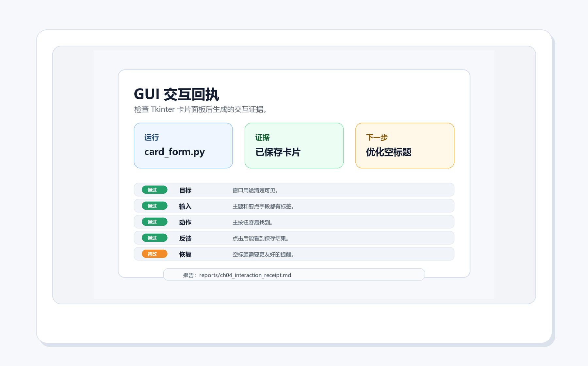
  <figcaption><strong>图4-15 GUI 交互记录</strong>：交互记录把窗口用途、输入字段、主按钮、反馈和待改进项集中到一张可复查记录里。</figcaption>
</figure>

这张记录保留一个 `FIX` 项：空标题还需要更友好的提醒。真实项目不必假装每一步都满分。能发现问题、记录问题、继续改进，本身就是工程能力。

### 4.12 卡片工厂学习成果：最后要有文件留下来

运行卡片成果脚本：

```bash
python code/ch04/07_make_card_factory_delivery.py
```

它会生成：

```text
cards/working_memory_load_card.md
reports/ch04_card_factory_delivery.md
output/ch04_card_factory_delivery.png
```

<figure align="center">
  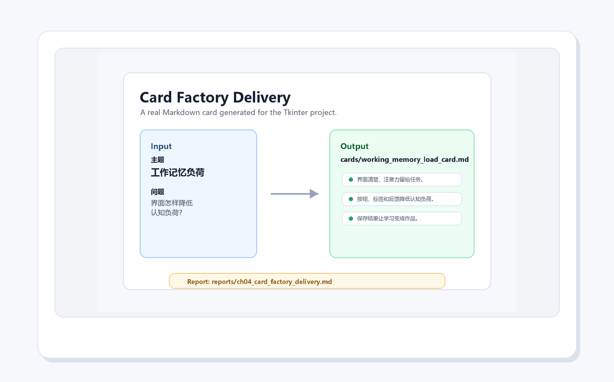
  <figcaption><strong>图4-16 卡片工厂学习成果</strong>：GUI 项目的终点不是“窗口看起来不错”，而是输入被保存成可以继续编辑的 Markdown 学习卡片。</figcaption>
</figure>

这一步非常重要。很多 GUI 入门练习只停在窗口截图，但真实工具要留下结果。对“科研卡片工厂”来说，结果就是卡片、报告、输出图和后续可以接着处理的数据。

这条线索也能接到 HyperCard。HyperCard 让很多非专业程序员第一次感到“我可以把卡片、按钮、文本和脚本连起来，做一个自己的小工具”。它和本课程的科研卡片工厂很接近：界面不是为了炫耀，而是为了让一个人把知识、材料和动作组织成可点击、可继续扩展的系统。

<figure align="center">
  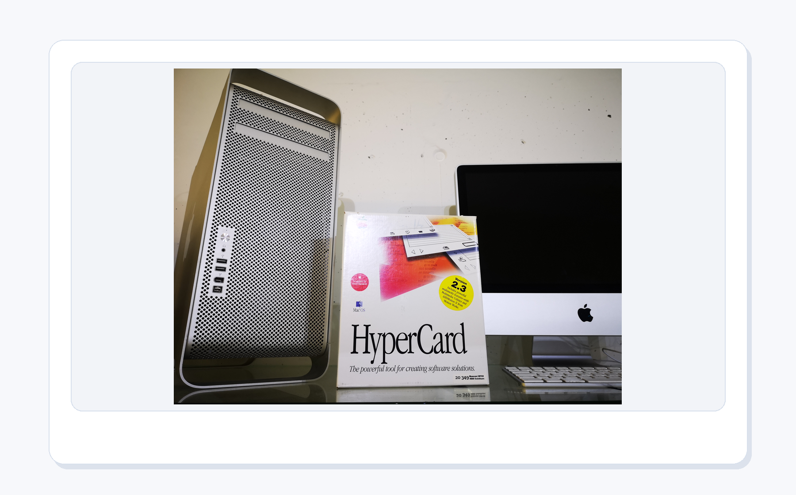
  <figcaption><strong>图4-S6 HyperCard</strong>：卡片式界面提醒我们，小工具也可以有清楚入口、可点击动作和可继续扩展的知识结构。</figcaption>
</figure>

### 4.13 用户旅程：打开窗口到拿到文件

运行交互旅程图脚本：

```bash
python code/ch04/09_make_gui_journey_storyboard.py
```

<figure align="center">
  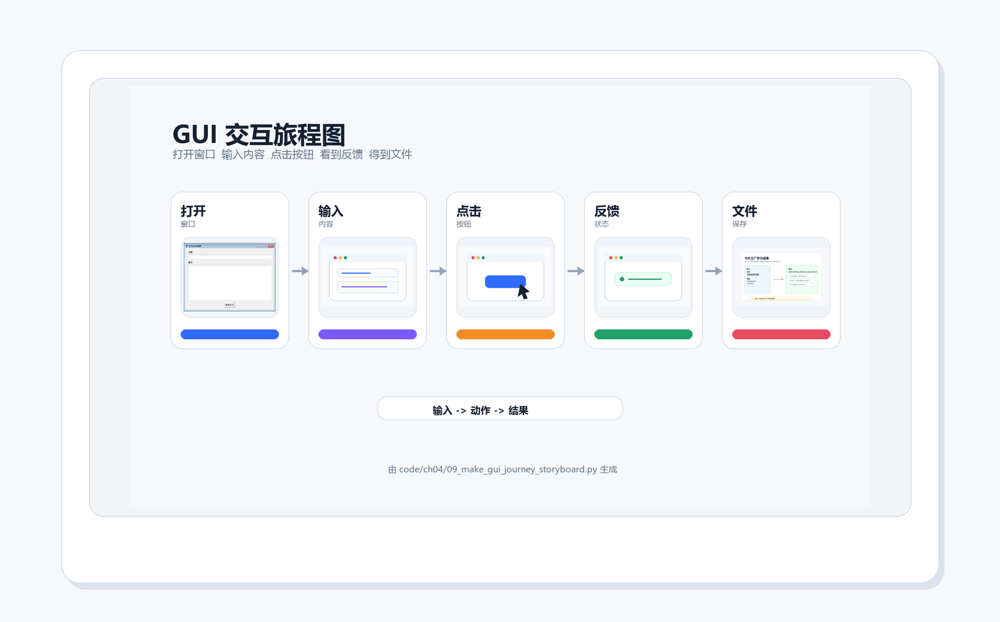
  <figcaption><strong>图4-17 GUI 交互旅程图</strong>：一个可用的小窗口应该照顾完整旅程：打开、输入、点击、看到反馈、得到文件。</figcaption>
</figure>

把 GUI 当成一段旅程，就不容易只盯着控件。用户不是为了看按钮而打开窗口，用户是为了完成任务。一个按钮有没有价值，要看它是否帮用户走到结果。

### 4.14 接住 ch02 和 ch03 的数据

第4章不是孤岛。第2章做过 Stroop 数据结构，第3章整理过文件和 JSON；第4章可以把这些材料变成一个 GUI 面板的雏形。

运行：

```bash
python code/ch04/08_make_ch03_data_gui_panel.py
```

它会生成：

```text
output/ch04_ch03_data_gui_panel.json
reports/ch04_ch03_data_gui_panel.md
output/ch04_ch03_data_gui_panel.png
```

<figure align="center">
  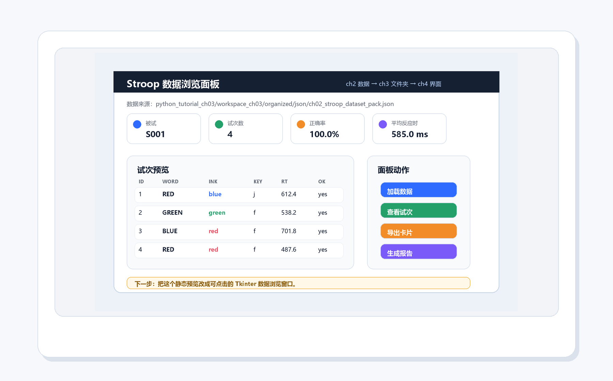
  <figcaption><strong>图4-18 ch3 数据 GUI 面板预览</strong>：ch2 的 Stroop 数据经过 ch3 文件整理后，在 ch4 被改造成一个可浏览、可导出、可继续扩展的 GUI 面板设计。</figcaption>
</figure>

这张图不是完整软件，而是下一步界面规格。先把界面想清楚，再真正写 Tkinter 代码，学习会稳很多。

---

## 第五部分：排错、练习与自查

### 4.15 常见坑：先按线索排查

<figure align="center">
  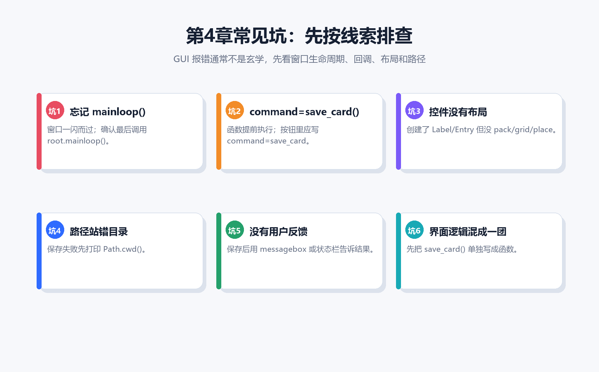
  <figcaption><strong>图4-19 第4章常见坑排查</strong>：GUI 报错通常可以从窗口生命周期、回调函数、布局、路径和反馈五个方向排查。</figcaption>
</figure>

| 问题 | 典型现象 | 优先检查 |
| --- | --- | --- |
| 忘记 `mainloop()` | 窗口一闪而过或根本看不到 | 最后一行有没有 `root.mainloop()` |
| `command=func()` | 还没点按钮，函数已经执行 | `command` 后面是否写了括号 |
| 控件没有布局 | 创建了控件但窗口里没有显示 | 有没有调用 `.pack()`、`.grid()` 或 `.place()` |
| 工作目录不对 | 保存文件找不到或写到奇怪位置 | 打印 `Path.cwd()` |
| 没有反馈 | 用户不知道保存是否成功 | 用 `messagebox` 或状态栏提示 |
| 逻辑混在一起 | 代码越来越难读 | 把保存、检查、绘图拆成函数 |

遇到 GUI 问题时，先不要大改。先把问题缩到最小脚本里：一个窗口、一个标签、一个按钮、一个回调。最小版本能跑，再把功能加回来。

### 4.16 运行记录：GUI 也要能复查

运行记录脚本：

```bash
python code/ch04/10_make_gui_runtime_evidence.py
```

<figure align="center">
  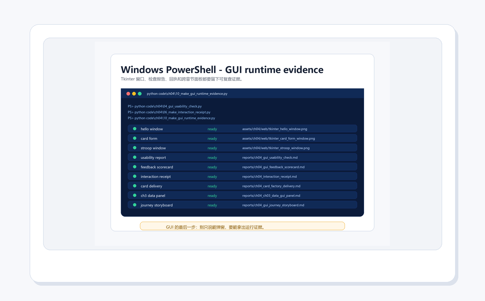
  <figcaption><strong>图4-20 GUI 运行记录</strong>：窗口截图、可用性报告、交互记录、卡片成果、ch3 数据面板和用户旅程图都存在，才说明本章 GUI 项目有完整学习记录。</figcaption>
</figure>

第1章强调环境要能复查，第4章也一样。GUI 项目不能只说“我看见窗口了”，还要能说清楚：

1. 真实窗口截图在哪里？
2. 用户输入如何变成文件？
3. 保存后有什么反馈？
4. 检查报告在哪里？
5. 跨章节数据如何接入下一步？

### 4.17 上机路线与学习成果记录

第一次学习本章时，建议按这个顺序运行：

```bash
python code/ch04/01_hello_window.py
python code/ch04/02_card_form.py
python code/ch04/03_stroop_gui_preview.py
python code/ch04/04_gui_usability_check.py
python code/ch04/05_make_gui_feedback_lab.py
python code/ch04/06_make_interaction_receipt.py
python code/ch04/07_make_card_factory_delivery.py
python code/ch04/08_make_ch03_data_gui_panel.py
python code/ch04/09_make_gui_journey_storyboard.py
python code/ch04/10_make_gui_runtime_evidence.py
```

其中前三个脚本会打开窗口，后面的脚本主要生成报告和图片。学习成果记录可以按下面这张表整理：

| 学习成果记录 | 要看到什么 |
| --- | --- |
| 最小窗口 | `01_hello_window.py` 能弹出窗口 |
| 卡片表单 | `02_card_form.py` 能保存一张 Markdown 卡片 |
| Stroop 预告 | `03_stroop_gui_preview.py` 能显示刺激并响应按键 |
| 可用性检查 | `reports/ch04_gui_usability_check.md` 存在 |
| 反馈检查卡 | `reports/ch04_gui_feedback_scorecard.md` 存在 |
| 交互记录 | `reports/ch04_interaction_receipt.md` 存在 |
| 卡片成果 | `cards/working_memory_load_card.md` 存在 |
| 运行记录 | `reports/ch04_gui_runtime_evidence.md` 存在 |

### 4.18 练习任务

1. 把 `01_hello_window.py` 的窗口标题改成你的项目名，运行并截图。
2. 在 `02_card_form.py` 中增加一个“标签”输入框，例如“实验记录”“课程笔记”“论文摘录”。
3. 修改 `save_card()`，让保存文件名包含日期。
4. 故意把 `command=save_card` 写成 `command=save_card()`，观察发生了什么，再改回来。
5. 在 `03_stroop_gui_preview.py` 中增加一个新的试次，例如词义为 `BLUE`、颜色为 `red`。
6. 运行 `04_gui_usability_check.py`，用清单逐条检查你的卡片表单。
7. 运行 `05_make_gui_feedback_lab.py`，挑一个按钮，从 Target、Spacing、State、Error、Copy 中选一个方向改进。
8. 运行 `06_make_interaction_receipt.py`，把 `FIX` 项改写成你的下一步计划。
9. 运行 `08_make_ch03_data_gui_panel.py`，把按钮文案改得更像真实科研工具，例如“导出被试报告”。
10. 临时移走一个输出文件，再运行 `10_make_gui_runtime_evidence.py`，观察记录清单如何提示缺失；检查后把文件恢复。

### 4.19 自测问题

1. `tk.Tk()`、控件、布局、回调和 `mainloop()` 分别负责什么？
2. 为什么 `command=save_card` 和 `command=save_card()` 结果不同？
3. `Entry.get()` 和 `Text.get("1.0", "end")` 分别适合拿什么输入？
4. 保存卡片以后，为什么要给用户反馈？
5. 一个 GUI 小项目的学习成果记录应该包含哪些文件？
6. 如果窗口没有出现，你会按什么顺序排查？

判断自己是否真的学会，可以看你能不能把 `02_card_form.py` 讲给同学听：窗口里有什么，用户怎么操作，点击后哪个函数执行，最后文件保存到哪里。

### 4.20 学习复盘模板

可以在 `reports/ch04_review.md` 中写下：

```markdown
# 第4章复盘

## 我新增的能力
- 

## 我跑通的窗口
- 

## 我生成的文件记录
- 

## 我遇到的 GUI 问题
- 报错或现象：
- 原因：
- 修复方式：

## 我准备继续改进
- 输入提示：
- 按钮文案：
- 保存反馈：
- 错误恢复：
```

复盘不是写作文，而是给下一次调试留路标。你现在把窗口、函数、路径和输出写清楚，后面做综合项目时就不用重新猜。

### 4.21 本章总结

Tkinter 入门的关键不是把所有参数背下来，而是理解 GUI 程序的基本闭环：

1. `Tk()` 创建窗口。
2. 控件收集输入或显示信息。
3. 布局让控件有秩序。
4. 事件触发回调函数。
5. 回调函数处理数据、写入文件或更新界面。
6. 用户得到反馈，并能找到结果。

这一章让“科研卡片工厂”多了一块前台面板。前几章的能力还在后厨：字符串、列表、路径、文件写入；第4章把它们搬到窗口里，让用户通过输入和按钮完成任务。

下一章会进入面向对象。到那时你会发现，GUI 程序很适合用类来组织：窗口是对象，按钮是对象，卡片表单也可以成为一个对象。第4章先把“能点击、能保存、能反馈”的闭环跑通，第5章再学习怎样把这些部件组织得更稳。
