# 第 5 章：面向对象程序设计

[TOC]

<figure align="center">
  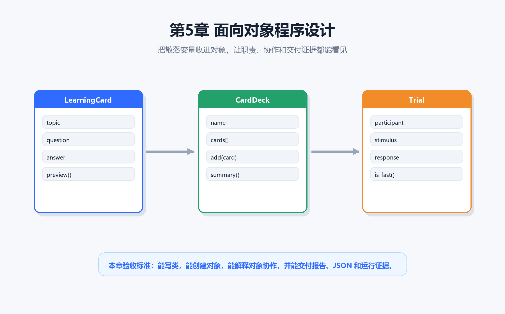
  <figcaption><strong>图5-1 第5章封面</strong>：本章把散落变量收进对象，让职责、协作和交付证据都能看见。</figcaption>
</figure>

> 本章一句话：  
> **面向对象不是把代码写得更“高级”，而是给数据和动作划清边界。一个好对象知道自己保存什么、能做什么、不该管什么，也知道需要把请求交给哪个对象。**

第4章我们用 Tkinter 做了一个能点击、能反馈、能生成文件的 GUI 小项目。窗口代码一旦继续变长，就会出现一个新问题：输入框、按钮、保存函数、报告生成、实验试次、文件路径全挤在一起，修改一个功能很容易碰坏另一个功能。

第5章要解决的正是这个问题。我们不急着学一堆术语，也不把“类”“继承”“多态”当作背诵任务。先从一个很小的 `LearningCard` 开始：一张学习卡片应该保存主题、问题、答案和标签，也应该能生成自己的预览。这个边界跑通以后，再引入 `CardDeck`、`Trial` 和 `ReportBuilder`，把对象之间的协作画出来、生成报告、导出 JSON，最后留下运行证据。

这一章的读法和 ch01/ch04 保持一致：**先跑脚本，再看证据图，最后把概念拆成能复查的动作**。你不需要一开始就把 OOP 学成“设计模式大全”。先让小对象真的工作起来，再逐步把职责边界收紧。

---

## 本章导读：先分职责，再写 `class`

### 5.0 本章学习目标

学完本章，你应该能够做到：

1. 用自己的话解释类、对象、属性、方法、`self`、封装、组合和对象协作。
2. 运行 `01_learning_card_class.py`，创建一个 `LearningCard` 对象，并说明它的属性和方法分别负责什么。
3. 运行 `02_card_deck.py`，理解 `CardDeck` 为什么应该“拥有多张卡片”，而不是继承一张卡片。
4. 运行 `03_trial_object.py`，把心理学实验中的一次试次建模成对象。
5. 使用类职责卡片判断一个类该管什么、不该管什么。
6. 读懂对象协作消息图，说明 `LearningCard`、`CardDeck`、`Trial` 和 `ReportBuilder` 如何互相请求。
7. 生成对象模型报告、设计卡片、质量回执、交付包和运行证据。
8. 把 ch04 的 GUI 面板规格拆成 ch05 的对象模型，为后续数据分析章节做准备。

### 本章分区导航

| 分区 | 对应小节 | 你要抓住的主线 | 产出证据 |
| --- | --- | --- | --- |
| 第一部分：从变量到对象 | 5.1-5.3 | 代码变长后，职责边界比语法更重要 | 最小类、真实运行截图 |
| 第二部分：类、属性、方法与组合 | 5.4-5.7 | 对象保存状态，方法处理自己的状态，组合表达拥有关系 | 心智模型、Trial 对象、对象小剧场 |
| 第三部分：对象协作与职责检查 | 5.8-5.12 | 类不是孤岛，要通过清楚消息合作 | 对象模型报告、职责卡片、协作图、质量回执 |
| 第四部分：项目交付与跨章连接 | 5.13-5.15 | OOP 项目要交付文件、JSON 和下一章能接住的数据 | 交付包、GUI 面板对象模型 |
| 第五部分：排错、练习与验收 | 5.16-5.21 | 用固定路线排查 OOP 常见问题并留下证据 | 常见坑地图、运行证据、复盘模板 |

<figure align="center">
  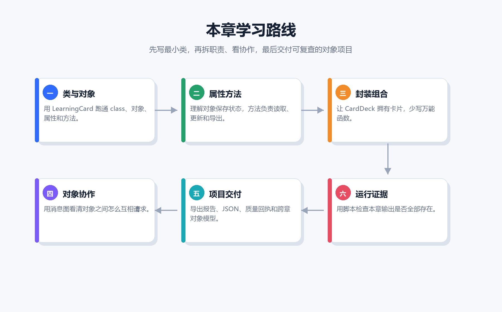
  <figcaption><strong>图5-2 本章学习路线</strong>：先写最小类，再拆职责、看协作，最后交付可复查的对象项目。</figcaption>
</figure>

---

## 第一部分：从散装变量到对象模型

### 5.1 代码变长后，真正难的是职责边界

刚开始写 Python 时，把数据放在几个变量里很自然：

```python
topic = "OOP"
question = "类是什么？"
answer = "类像图纸，描述对象应该有什么。"
tags = ["类", "对象"]
```

如果只有一张卡片，这样写没问题。问题出现在需求变多以后：你想给卡片生成预览、保存 Markdown、按标签筛选、放进卡片盒、导出报告。函数越写越多，参数越传越长，最后你很难判断“主题、问题、答案、标签”到底属于谁。

<figure align="center">
  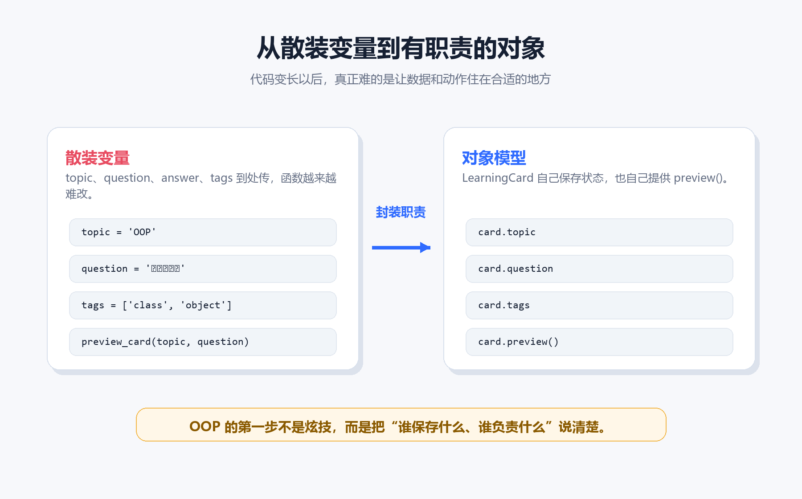
  <figcaption><strong>图5-3 从散装变量到有职责的对象</strong>：OOP 的第一步不是换一种写法，而是把数据和动作放回合适的边界里。</figcaption>
</figure>

面向对象的价值在这里开始出现：如果一张卡片本来就拥有主题、问题、答案和标签，那它也可以拥有 `preview()` 这样的方法。对象把“状态”和“动作”放在一起，读代码的人更容易看懂任务边界。

这一章我们会反复问三个问题：

1. 这个类保存什么数据？
2. 这个类提供什么动作？
3. 这个类不应该管什么？

能回答这三个问题，比一开始背“封装、继承、多态”更重要。

### 5.2 最小类：先跑通 `01_learning_card_class.py`

进入第5章目录后，先运行第一个脚本：

```bash
python code/ch05/01_learning_card_class.py
```

脚本核心代码如下：

```python
from dataclasses import dataclass


@dataclass
class LearningCard:
    topic: str
    question: str
    answer: str
    tags: list[str]

    def preview(self) -> str:
        return f"[{self.topic}] {self.question} -> {self.answer[:20]}..."


card = LearningCard("Python", "变量是什么？", "变量像贴在数据上的标签。", ["基础", "比喻"])
print(card.preview())
```

<figure align="center">
  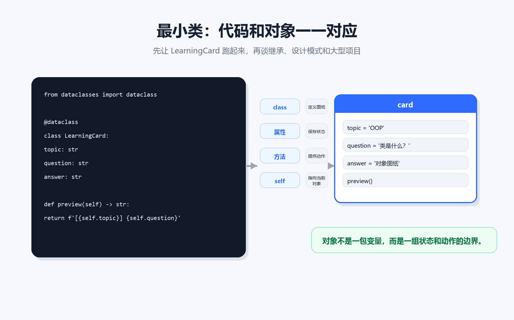
  <figcaption><strong>图5-4 最小类代码与对象对照</strong>：`class` 定义图纸，属性保存状态，方法提供动作，`self` 指向当前这个对象。</figcaption>
</figure>

这里先抓住四个点：

| 代码 | 人话解释 | 如果漏掉会怎样 |
| --- | --- | --- |
| `class LearningCard:` | 定义一种对象的图纸 | 代码里没有“卡片”这个概念 |
| `topic: str` 等字段 | 规定对象保存哪些状态 | 数据仍然散落在外部变量里 |
| `def preview(self)` | 给对象一个动作 | 预览逻辑只能写在外部函数里 |
| `self.topic` | 访问当前对象自己的主题 | 方法不知道该拿哪张卡片的数据 |

<figure align="center">
  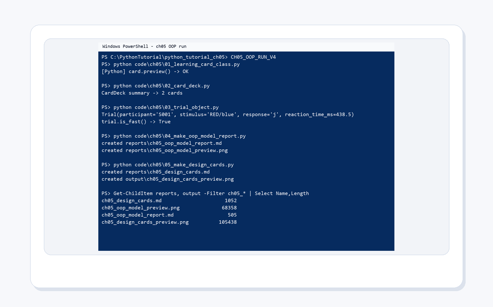
  <figcaption><strong>图5-5 第5章真实运行截图</strong>：先让最小对象脚本跑起来，再逐步增加卡片盒、试次对象和交付证据。</figcaption>
</figure>

第一次运行时，不要急着修改。先确认终端输出里能看到卡片预览。这个输出说明三件事：类定义成功，对象创建成功，方法调用成功。

### 5.3 `dataclass` 不是魔法，只是在少写样板代码

本章大量使用 `@dataclass`。它不是 OOP 的必需品，而是 Python 提供的省事写法。没有 `dataclass` 时，你通常要手写：

```python
class LearningCard:
    def __init__(self, topic, question, answer, tags):
        self.topic = topic
        self.question = question
        self.answer = answer
        self.tags = tags
```

有了 `@dataclass`，你可以把精力放在“对象应该保存什么”上：

```python
@dataclass
class LearningCard:
    topic: str
    question: str
    answer: str
    tags: list[str]
```

它会自动帮你生成初始化方法，也会让打印对象时更清楚。初学阶段可以把 `dataclass` 理解成：**适合用来定义主要保存数据、再带一点方法的小对象**。

---

## 第二部分：类、属性、方法与组合

### 5.4 类、对象、属性、方法、`self`

很多 OOP 术语听起来抽象，其实都可以落回一个小例子：

<figure align="center">
  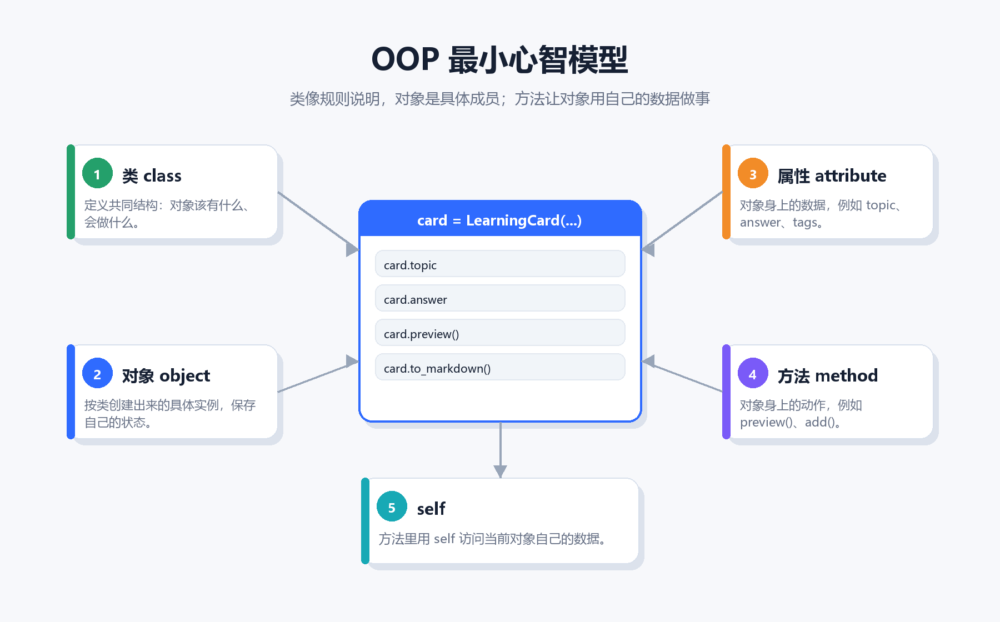
  <figcaption><strong>图5-6 OOP 最小心智模型</strong>：类定义共同结构，对象保存具体状态，属性是对象的数据，方法是对象的动作，`self` 指向当前对象。</figcaption>
</figure>

| 术语 | 在本章中的例子 | 你可以这样理解 |
| --- | --- | --- |
| 类 | `LearningCard` | 一种对象的规则说明 |
| 对象 | `card = LearningCard(...)` | 按规则创建出来的具体成员 |
| 属性 | `card.topic` | 对象身上的数据 |
| 方法 | `card.preview()` | 对象能执行的动作 |
| `self` | `self.topic` | 方法里指向“当前这个对象” |

关键是不要把类和对象混在一起。`LearningCard` 是图纸，`card` 才是一张具体卡片。图纸不会有某个具体主题；对象才会有 `"Python"`、`"变量是什么？"` 这些具体值。

### 5.5 方法应该靠近它使用的数据

如果一个函数总是需要同一组参数，它很可能适合变成对象的方法。比如下面这个外部函数：

```python
def preview_card(topic: str, question: str, answer: str) -> str:
    return f"[{topic}] {question} -> {answer[:20]}..."
```

它每次都要拿 `topic`、`question`、`answer`。如果这些数据本来就属于一张卡片，就可以写成：

```python
def preview(self) -> str:
    return f"[{self.topic}] {self.question} -> {self.answer[:20]}..."
```

区别不是少写了几个参数，而是职责变清楚了：预览一张卡片，是卡片自己的能力。

判断一个函数是否应该变成方法，可以问：

| 问题 | 如果答案是“是” |
| --- | --- |
| 这个函数总是处理某个对象的数据吗？ | 可以考虑放进这个类 |
| 这个函数会改变某个对象的状态吗？ | 通常应该由这个对象的方法完成 |
| 这个函数需要访问很多无关对象吗？ | 可能说明边界还没拆清楚 |

### 5.6 `CardDeck`：组合比继承更自然

运行第二个脚本：

```bash
python code/ch05/02_card_deck.py
```

脚本里定义了一个卡片盒：

```python
@dataclass
class CardDeck:
    name: str
    cards: list[str] = field(default_factory=list)

    def add(self, card: str) -> None:
        self.cards.append(card)

    def summary(self) -> str:
        return f"{self.name}: {len(self.cards)} 张卡片"
```

`CardDeck` 和 `LearningCard` 的关系不是“卡片盒也是一张卡片”，而是“卡片盒拥有多张卡片”。这叫组合。组合通常比继承更符合初学阶段的直觉。

| 关系 | 人话判断 | 本章例子 |
| --- | --- | --- |
| 组合 has-a | A 拥有 B | `CardDeck` 拥有多张 `LearningCard` |
| 继承 is-a | A 是一种 B | “错题卡”也许是一种 `LearningCard` |

如果你说不清 `A is a B`，先别写继承。很多初学者一上来就想设计复杂继承树，结果类之间关系越写越乱。本章优先使用组合：对象之间互相拥有、互相请求，边界更容易看清。

### 5.7 `Trial`：心理学试次为什么适合对象

运行第三个脚本：

```bash
python code/ch05/03_trial_object.py
```

心理学实验里，一次试次通常包含被试、刺激、反应和反应时：

```python
@dataclass
class Trial:
    participant: str
    stimulus: str
    response: str
    reaction_time_ms: float

    def is_fast(self) -> bool:
        return self.reaction_time_ms < 500
```

<figure align="center">
  
  <figcaption><strong>图5-7 心理学试次对象</strong>：`Trial` 把一次刺激、一次反应和一次反应时收在同一个对象边界里。</figcaption>
</figure>

这样写的好处很直接：以后你要判断快速反应、导出 CSV、计算正确性，都可以围绕 `Trial` 这个对象展开，而不是让一堆列表互相对齐。

| 散装写法 | 对象写法 |
| --- | --- |
| `participants[i]`、`stimuli[i]`、`responses[i]` | `trial.participant`、`trial.stimulus`、`trial.response` |
| 需要小心多个列表长度一致 | 一次试次的数据天然在一起 |
| 判断快慢要传入 `reaction_time_ms` | `trial.is_fast()` 自己判断 |

这不是说所有实验数据都要立刻改成对象。正式统计分析时，表格和 DataFrame 很重要。第5章的重点是：当你在写实验流程、界面逻辑或交付对象时，用对象保存“同一件事”的状态，会让代码更稳。

---

## 第三部分：对象协作与职责检查

### 5.8 对象不是孤岛：先看小剧场

对象如果只保存自己的数据，还不够。项目里通常有多个对象协作：卡片进入卡片盒，卡片盒抽出练习材料，试次记录反应，报告整理员汇总结果。

<figure align="center">
  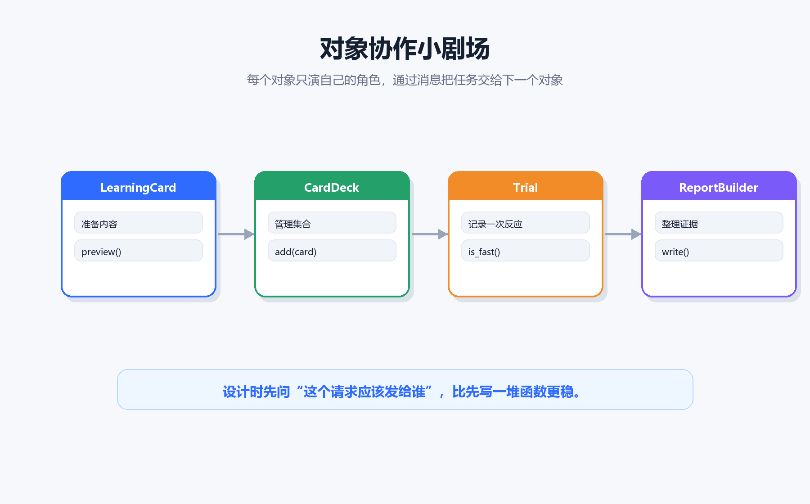
  <figcaption><strong>图5-8 对象协作小剧场</strong>：每个对象只演自己的角色，通过消息把任务交给下一个对象。</figcaption>
</figure>

设计对象时，可以先不写代码，只写一句话：

```text
LearningCard 准备内容，CardDeck 管理集合，Trial 记录一次反应，ReportBuilder 整理证据。
```

如果这句话说不清，代码通常也会混乱。类名不是越多越好，边界清楚才有价值。

### 5.9 对象模型报告：`04_make_oop_model_report.py`

运行：

```bash
python code/ch05/04_make_oop_model_report.py
```

它会生成：

```text
reports/ch05_oop_model_report.md
reports/ch05_oop_model_preview.png
assets/ch05/web/ch05_oop_model_preview.png
```

<figure align="center">
  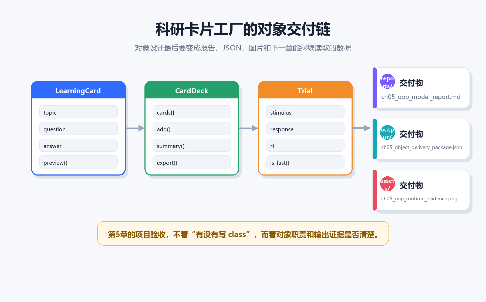
  <figcaption><strong>图5-9 科研卡片工厂对象交付链</strong>：对象设计最后要变成报告、JSON、图片和下一章能继续读取的数据。</figcaption>
</figure>

<figure align="center">
  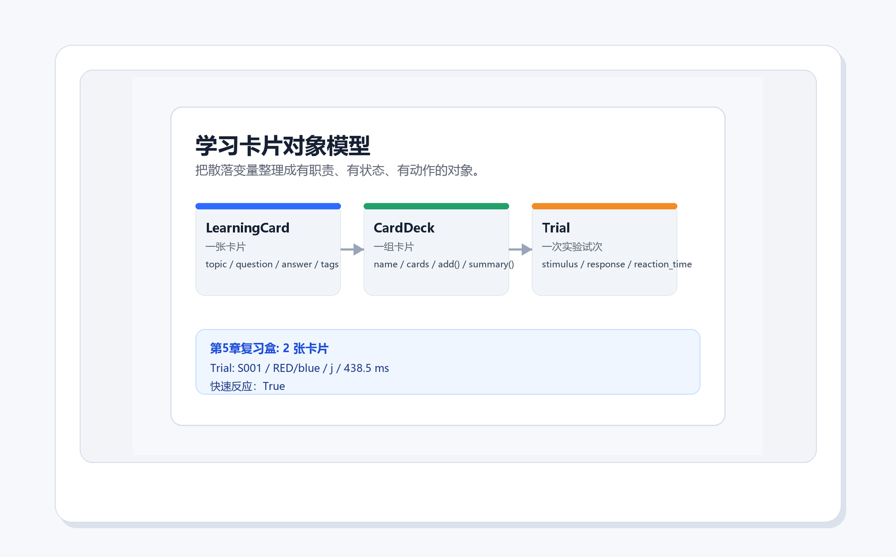
  <figcaption><strong>图5-10 对象模型报告预览</strong>：`LearningCard`、`CardDeck` 和 `Trial` 的职责被整理成一张可提交的对象模型图。</figcaption>
</figure>

这一步的意义是把“我大概懂 OOP”变成可复查文件。报告里会列出类、职责、典型属性和典型方法。以后你改项目时，可以先看这张模型图，再决定该把新功能放到哪个类里。

### 5.10 类职责卡片：`05_make_design_cards.py`

运行：

```bash
python code/ch05/05_make_design_cards.py
```

它会生成：

```text
reports/ch05_design_cards.md
output/ch05_design_cards_preview.png
assets/ch05/web/ch05_design_cards_preview.png
```

<figure align="center">
  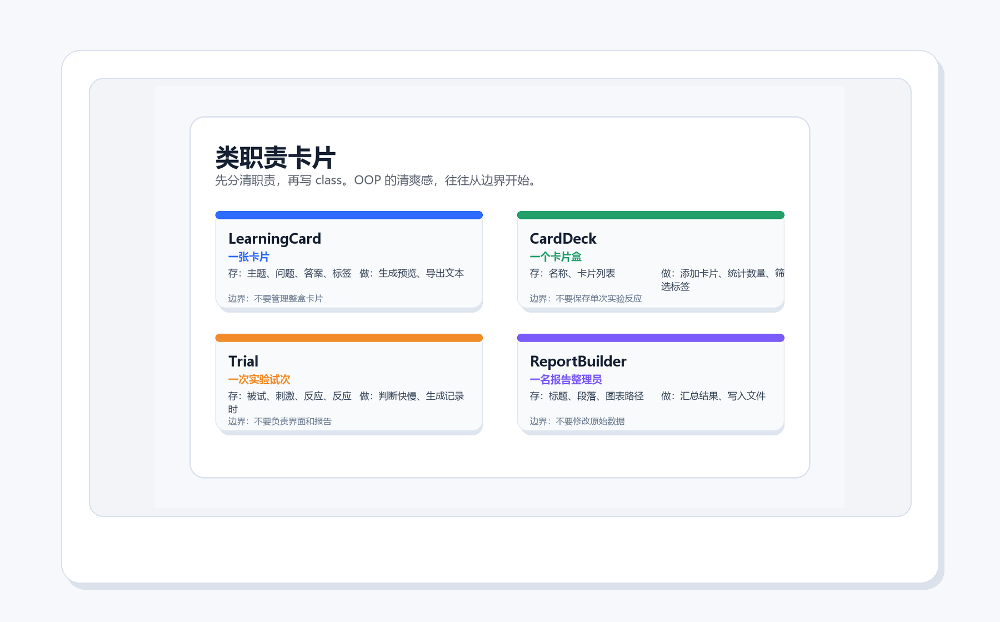
  <figcaption><strong>图5-11 类职责卡片</strong>：写类之前，先写清楚它保存什么、会做什么、不该管什么。</figcaption>
</figure>

职责卡片最重要的一栏是“不该管什么”。如果一个类的不该管范围写不出来，它很容易变成万能类。比如：

| 类 | 应该管 | 不该管 |
| --- | --- | --- |
| `LearningCard` | 一张卡片的主题、问题、答案、预览 | 管理整盒卡片 |
| `CardDeck` | 卡片集合、添加、统计、筛选 | 保存单次实验反应 |
| `Trial` | 一次试次的刺激、反应、反应时 | 负责 GUI 和报告排版 |
| `ReportBuilder` | 汇总段落、写入报告 | 修改原始实验数据 |

这张表能帮你在写代码前先降噪。类不是越“能干”越好，而是越清楚越好。

### 5.11 对象协作消息图：`06_make_object_collaboration_map.py`

运行：

```bash
python code/ch05/06_make_object_collaboration_map.py
```

它会生成：

```text
reports/ch05_object_collaboration_map.md
output/ch05_object_collaboration_map.png
assets/ch05/web/ch05_object_collaboration_map.png
```

<figure align="center">
  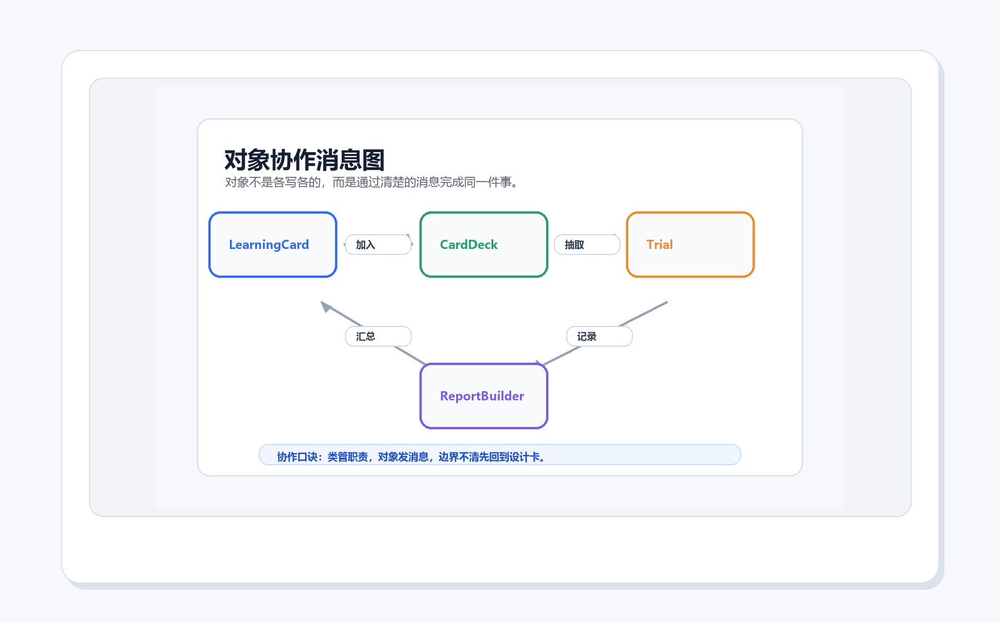
  <figcaption><strong>图5-12 对象协作消息图</strong>：对象不是各写各的，而是通过“加入、抽取、记录、汇总”这样的消息完成同一件事。</figcaption>
</figure>

读这张图时，不要只看箭头。要问箭头背后的请求是否清楚：

| 消息 | 方向 | 含义 |
| --- | --- | --- |
| 加入 `add()` | `LearningCard -> CardDeck` | 一张卡片进入卡片盒 |
| 抽取 `draw()` | `CardDeck -> Trial` | 卡片盒给一次练习提供材料 |
| 记录 `record()` | `Trial -> ReportBuilder` | 试次把反应结果交给报告整理员 |
| 汇总 `summarize()` | `ReportBuilder -> LearningCard` | 报告反过来帮助卡片复习与改进 |

如果一条消息说不清，通常说明职责边界还没想清楚。先改设计，再急着写代码。

### 5.12 对象质量回执：`07_make_object_quality_receipt.py`

运行：

```bash
python code/ch05/07_make_object_quality_receipt.py
```

它会生成：

```text
reports/ch05_object_quality_receipt.md
output/ch05_object_quality_receipt.png
assets/ch05/web/ch05_object_quality_receipt.png
```

<figure align="center">
  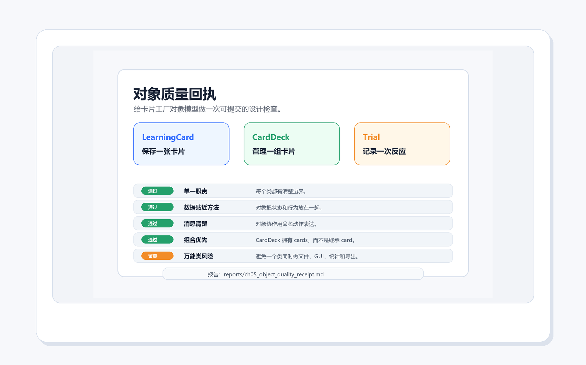
  <figcaption><strong>图5-13 对象质量回执</strong>：用单一职责、数据贴近方法、消息清楚、组合优先和万能类风险检查对象设计。</figcaption>
</figure>

这份回执不是为了给代码打分，而是为了提醒你：OOP 失败时，问题经常不是语法，而是边界。一个项目里如果出现 `ProjectManager`、`Helper`、`Everything` 这种类名，要格外小心。它们可能正在吞掉太多职责。

---

## 第四部分：项目交付与跨章连接

### 5.13 对象交付包：`08_make_object_delivery_package.py`

运行：

```bash
python code/ch05/08_make_object_delivery_package.py
```

它会生成：

```text
output/ch05_object_delivery_package.json
reports/ch05_object_delivery_package.md
output/ch05_object_delivery_package.png
assets/ch05/web/ch05_object_delivery_package.png
```

<figure align="center">
  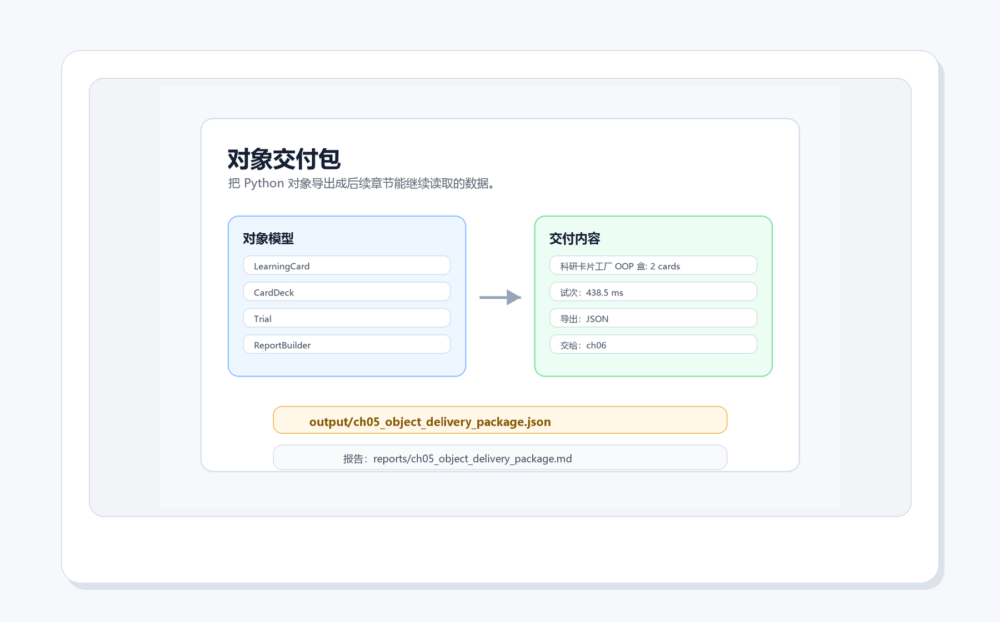
  <figcaption><strong>图5-14 对象交付包</strong>：对象模型不只停在代码里，也可以导出成 JSON，交给后续章节继续读取和分析。</figcaption>
</figure>

为什么要导出 JSON？因为一个小项目完成后，下一步通常不是“看起来写完了”，而是要把结果交给别的流程。第6章如果要做数据分析，就可以读取这个 JSON，把卡片和试次对象整理成表格。

OOP 的交付物至少应该回答：

1. 对象模型是什么？
2. 现在有哪些具体对象？
3. 输出文件在哪里？
4. 后续章节或后续工具如何继续读取？

### 5.14 接住 ch04 的 GUI 面板：`09_make_gui_panel_object_model.py`

第4章生成过一个 GUI 面板规格。第5章可以把它拆成对象模型：

```bash
python code/ch05/09_make_gui_panel_object_model.py
```

它会生成：

```text
output/ch05_gui_panel_object_model.json
reports/ch05_gui_panel_object_model.md
output/ch05_gui_panel_object_model.png
assets/ch05/web/ch05_gui_panel_object_model.png
```

<figure align="center">
  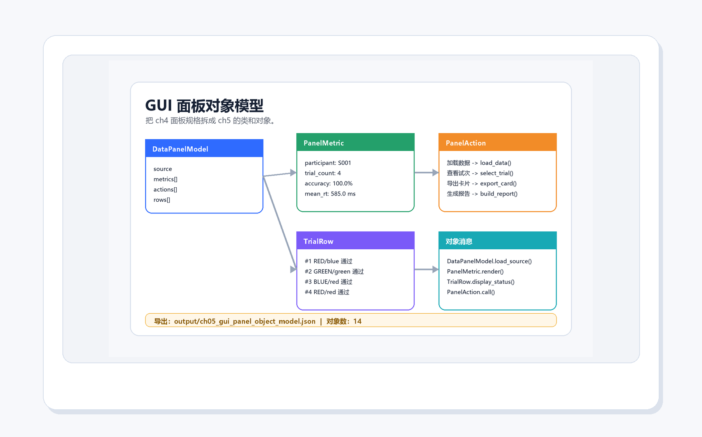
  <figcaption><strong>图5-15 GUI 面板对象模型</strong>：ch04 的面板规格被拆成 `DataPanelModel`、`PanelMetric`、`PanelAction` 和 `TrialRow` 等对象。</figcaption>
</figure>

这一步很重要，因为它说明面向对象不是单独一章的知识点，而是可以接住前面的 GUI、文件和数据任务：

| ch04 的东西 | ch05 的对象 |
| --- | --- |
| 面板标题、数据来源 | `DataPanelModel` |
| 准确率、平均反应时等指标 | `PanelMetric` |
| 加载数据、查看试次、导出卡片等按钮 | `PanelAction` |
| Stroop 试次预览行 | `TrialRow` |

当项目继续变大时，这种拆法会比“所有按钮逻辑都写在一个函数里”更容易维护。

### 5.15 本章脚本总览

第一次学习本章时，建议按这个顺序运行：

```bash
python code/ch05/01_learning_card_class.py
python code/ch05/02_card_deck.py
python code/ch05/03_trial_object.py
python code/ch05/04_make_oop_model_report.py
python code/ch05/05_make_design_cards.py
python code/ch05/06_make_object_collaboration_map.py
python code/ch05/07_make_object_quality_receipt.py
python code/ch05/08_make_object_delivery_package.py
python code/ch05/09_make_gui_panel_object_model.py
python code/ch05/10_make_oop_runtime_evidence.py
```

对应证据如下：

| 脚本 | 主要产物 | 你要确认什么 |
| --- | --- | --- |
| `01_learning_card_class.py` | 终端输出 | `LearningCard` 能创建并调用 `preview()` |
| `02_card_deck.py` | 终端输出 | `CardDeck` 能添加卡片并统计数量 |
| `03_trial_object.py` | 终端输出 | `Trial` 能保存一次试次并判断快慢 |
| `04_make_oop_model_report.py` | `reports/ch05_oop_model_report.md` | 类、职责、属性和方法清楚 |
| `05_make_design_cards.py` | `reports/ch05_design_cards.md` | 每个类都有“不该管什么” |
| `06_make_object_collaboration_map.py` | `reports/ch05_object_collaboration_map.md` | 对象消息方向清楚 |
| `07_make_object_quality_receipt.py` | `reports/ch05_object_quality_receipt.md` | 能发现万能类风险 |
| `08_make_object_delivery_package.py` | `output/ch05_object_delivery_package.json` | 对象模型能交给下一章 |
| `09_make_gui_panel_object_model.py` | `output/ch05_gui_panel_object_model.json` | ch04 面板能拆成对象 |
| `10_make_oop_runtime_evidence.py` | `reports/ch05_oop_runtime_evidence.md` | 后半段交付物都存在 |

---

## 第五部分：排错、练习与验收

### 5.16 常见坑：先按职责边界排查

<figure align="center">
  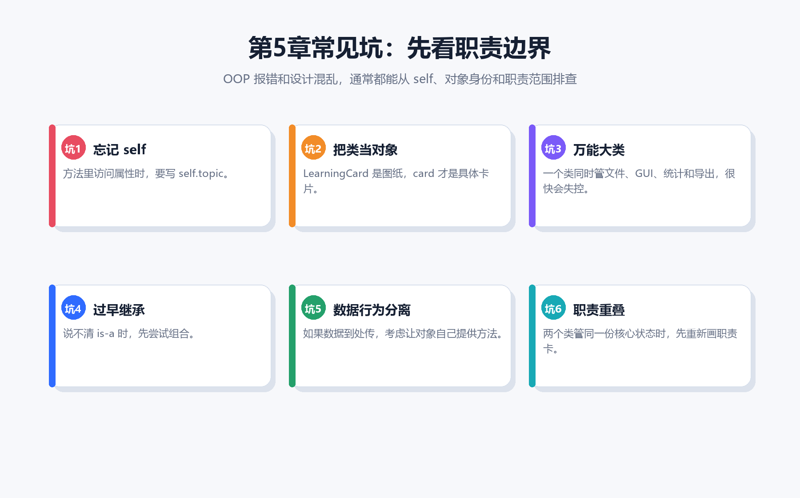
  <figcaption><strong>图5-16 第5章常见坑排查</strong>：OOP 报错和设计混乱，通常可以从 `self`、对象身份、万能类、继承、数据行为分离和职责重叠排查。</figcaption>
</figure>

| 问题 | 典型现象 | 优先检查 |
| --- | --- | --- |
| 忘记 `self` | 方法里找不到属性，或变量名未定义 | 方法参数有没有 `self`，属性访问是否写成 `self.xxx` |
| 把类当对象 | 直接拿 `LearningCard.topic` 当具体主题 | 你是否创建了 `card = LearningCard(...)` |
| 万能大类 | 一个类越来越长，什么都管 | 能不能拆成卡片、卡片盒、试次、报告 |
| 过早继承 | 继承关系说不出“是一种” | 先改成组合 |
| 数据行为分离 | 函数之间传一大串参数 | 是否应该让对象自己保存状态并提供方法 |
| 职责重叠 | 两个类都在改同一份核心数据 | 回到职责卡片，重新划边界 |

遇到 OOP 问题时，先不要马上重写所有类。建议按这个顺序缩小范围：

1. 先用一个对象跑通最小例子。
2. 打印对象，确认属性值是否正确。
3. 单独调用一个方法，确认返回结果。
4. 再让两个对象协作。
5. 最后才加文件、GUI、报告和导出。

### 5.17 运行证据：OOP 也要能交付

运行：

```bash
python code/ch05/10_make_oop_runtime_evidence.py
```

<figure align="center">
  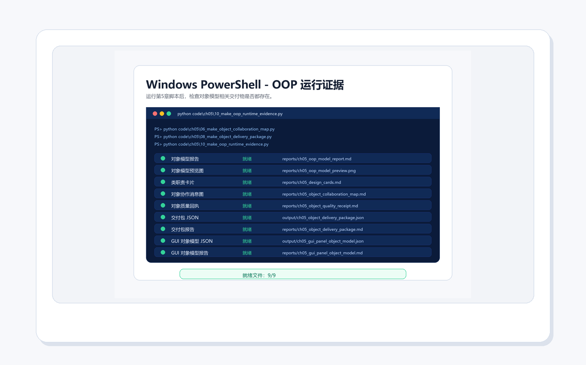
  <figcaption><strong>图5-17 OOP 运行证据</strong>：对象模型报告、职责卡片、协作图、质量回执、交付包和 GUI 面板对象模型都存在，才说明本章项目有完整证据链。</figcaption>
</figure>

第1章强调环境要有证据，第4章强调 GUI 要有证据，第5章也一样。不要只说“我写了类”。你应该能指出：

1. 对象模型报告在哪里？
2. 类职责卡片在哪里？
3. 对象协作图在哪里？
4. 质量回执检查了什么？
5. 交付包 JSON 能交给谁？
6. 运行证据是否显示所有文件就绪？

### 5.18 上机路线与提交证据

提交本章作业时，可以按下面的清单整理：

| 提交证据 | 要看到什么 |
| --- | --- |
| 最小类 | `01_learning_card_class.py` 能输出卡片预览 |
| 卡片盒 | `02_card_deck.py` 能显示卡片数量 |
| 试次对象 | `03_trial_object.py` 能打印 `Trial` 并判断快慢 |
| 对象模型报告 | `reports/ch05_oop_model_report.md` 存在 |
| 职责卡片 | `reports/ch05_design_cards.md` 存在 |
| 协作消息图 | `reports/ch05_object_collaboration_map.md` 存在 |
| 质量回执 | `reports/ch05_object_quality_receipt.md` 存在 |
| 对象交付包 | `output/ch05_object_delivery_package.json` 存在 |
| GUI 面板对象模型 | `output/ch05_gui_panel_object_model.json` 存在 |
| 运行证据 | `reports/ch05_oop_runtime_evidence.md` 存在 |

### 5.19 练习任务

1. 给 `LearningCard` 增加一个 `difficulty: int` 属性，表示卡片难度。
2. 修改 `preview()`，让它同时显示主题和难度。
3. 把 `CardDeck.cards` 从 `list[str]` 改成 `list[LearningCard]`，再运行测试。
4. 给 `CardDeck` 增加一个 `filter_by_tag(tag: str)` 方法。
5. 给 `Trial` 增加 `correct: bool` 属性，并写一个 `status()` 方法。
6. 在 `05_make_design_cards.py` 里新增一个类职责卡片，例如 `StudySession`。
7. 修改 `06_make_object_collaboration_map.py`，加入 `StudySession -> CardDeck` 的消息。
8. 在质量回执里新增一个检查项：“测试是否容易写”。
9. 修改对象交付包 JSON，让它包含你新增的 `difficulty`。
10. 临时删除一个报告文件，再运行 `10_make_oop_runtime_evidence.py`，观察它如何提示缺失；检查后把文件恢复。

### 5.20 自测问题

1. 类和对象有什么区别？请用 `LearningCard` 举例。
2. 属性和方法分别负责什么？
3. 为什么方法里要写 `self.topic`，而不是直接写 `topic`？
4. `CardDeck` 和 `LearningCard` 为什么更适合组合，而不是继承？
5. `Trial` 对象适合保存哪些心理学实验信息？
6. 什么是万能类？它为什么危险？
7. 对象协作消息图里，“消息”代表什么？
8. 为什么 OOP 项目也需要运行证据，而不是只提交 `.py` 文件？

如果你能把 `LearningCard`、`CardDeck`、`Trial` 和 `ReportBuilder` 的职责讲清楚，再指出它们的协作方向，就说明本章主线已经抓住了。

### 5.21 学习复盘模板

可以在 `reports/ch05_review.md` 中写下：

```markdown
# 第5章复盘

## 我新增的能力
- 

## 我跑通的对象
- LearningCard：
- CardDeck：
- Trial：

## 我生成的证据文件
- 

## 我遇到的 OOP 问题
- 报错或现象：
- 原因：
- 修复方式：

## 我重新划清的职责
- 这个类应该管：
- 这个类不该管：

## 我准备迁移到后续章节
- GUI：
- 文件：
- 数据分析：
```

复盘不是写作文，而是把下一次调试的路标留下来。你现在把对象、职责、消息和输出文件写清楚，后面做综合项目时就不会重新猜。

### 5.22 本章总结

第5章的重点不是“终于开始写高级代码”，而是学会用对象管理复杂度：

1. 类定义一种对象的共同结构。
2. 对象是按类创建出来的具体实例。
3. 属性保存对象状态。
4. 方法让对象使用自己的状态完成动作。
5. `self` 指向当前这个对象。
6. 组合表达“拥有”，通常比过早继承更稳。
7. 对象之间通过清楚消息协作。
8. 类职责卡片和质量回执能帮助你提前发现边界混乱。
9. OOP 项目最终也要留下报告、图片、JSON 和运行证据。

下一章会继续接住这些产物。你会把对象交付包里的卡片和试次整理成更适合分析的数据结构。也就是说，第5章不是孤立地学 `class`，而是在给后续的数据分析、GUI 扩展和综合项目打地基。
