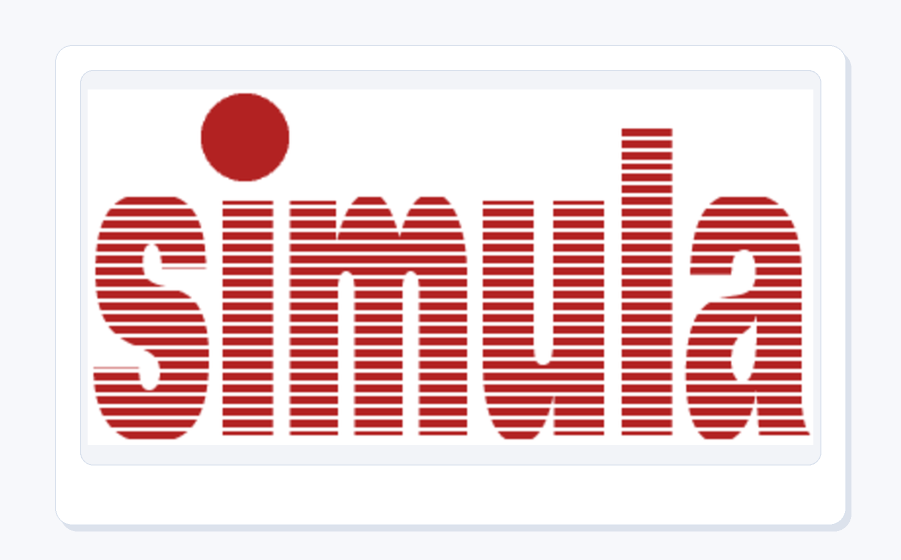
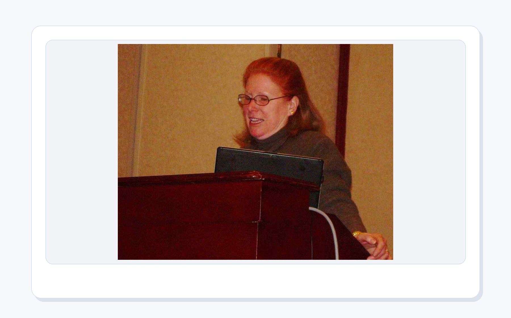
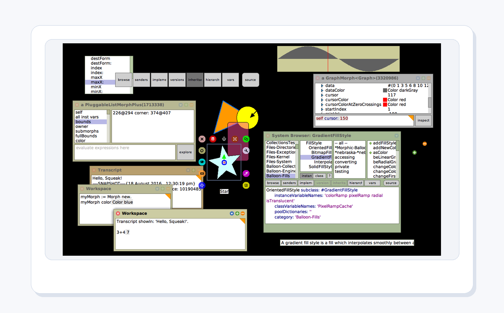
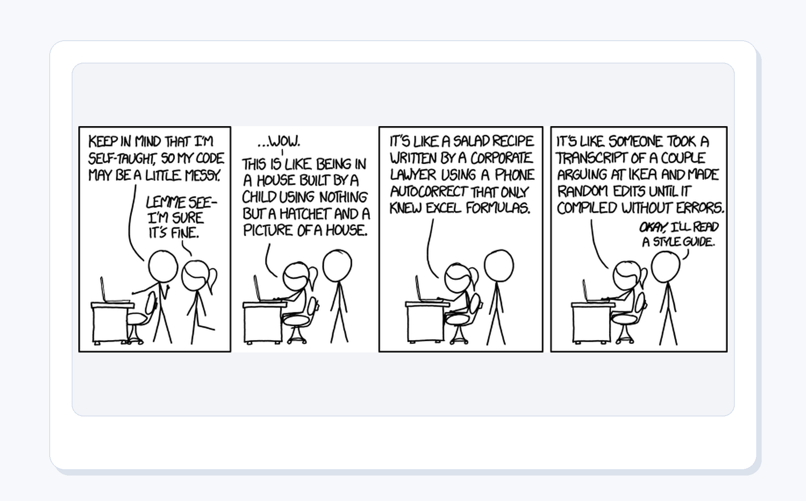
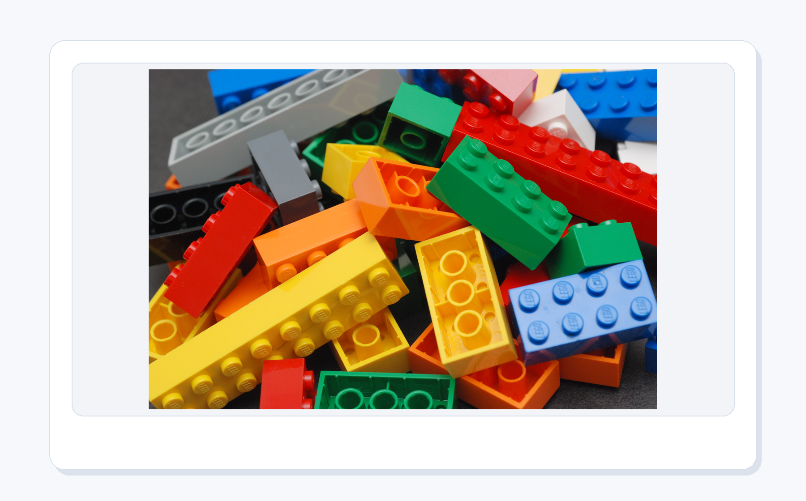
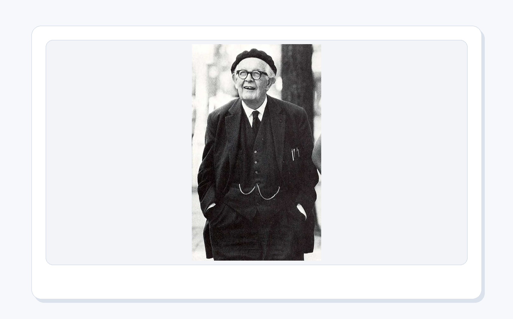

# 第 5 章：面向对象程序设计

<style>
figure {
  margin: 1.2em auto 1.8em;
  text-align: center;
}
figure img {
  max-width: 100%;
  display: block;
  margin: 0 auto;
}
figcaption {
  margin-top: 0.45em;
  color: #5f6673;
  font-size: 0.92em;
  line-height: 1.55;
}
figcaption strong {
  color: #2d3748;
}
</style>


<figure align="center">
  
  <figcaption><strong>图5-1 本章封面</strong>：当代码从三十行长到三百行，问题不再是会不会写语句，而是如何不把自己写进迷宫。</figcaption>
</figure>

> 本章一句话：当代码从三十行长到三百行，问题不再是会不会写语句，而是如何不把自己写进迷宫。

第5章继续推进“科研卡片工厂”的结构能力。前面几章已经能写变量、装数据、读文件；这一章要解决的问题更像“工厂内部管理”：东西越来越多以后，谁负责保存卡片？谁负责管理卡片盒？谁负责记录一次实验试次？如果所有数据都散在地上，程序很快就会变成杂物间。

面向对象不是为了让代码显得高级，而是为了把复杂任务拆成有职责的小角色。每个对象像一个有岗位的人：知道自己保存什么，知道自己能做什么，也知道哪些事不该乱管。

---

## 5.0 本章学习目标

学完本章，你应该能够：

1. 用自己的话解释本章核心概念。
2. 运行本章配套脚本，看到明确输出。
3. 把概念和“科研卡片工厂”的连续项目联系起来。
4. 识别本章最常见的新手错误。
5. 完成本章小项目：**学习卡片对象模型**。

---

## 5.1 开场故事：先有画面，再有术语

当代码从三十行长到三百行，问题不再是会不会写语句，而是如何不把自己写进迷宫。 这句话不是为了热闹，而是为了把本章的知识放进真实使用场景。初学者最怕一上来就被术语包围，像走进一个所有门牌都用缩写写成的楼层。我们先从画面进入，再慢慢把画面翻译成代码。

<figure align="center">
  
  <figcaption><strong>图5-2 Simula 与对象思想源头</strong>：面向对象最早和“模拟真实系统”关系很深：船、队列、顾客、机器，都可以成为程序里的对象。</figcaption>
</figure>

面向对象的历史里，Simula 是一个绕不开的名字。它最初服务于模拟任务：现实世界里有很多“东西”会带着自己的状态行动，比如顾客在排队、机器在工作、实验被试在反应。把这些东西写成对象，比把所有变量摊在一张大桌子上更自然。

学习这一章时，可以把对象想成“带着资料夹的小角色”。`LearningCard` 带着问题和答案，`CardDeck` 带着一组卡片，`Trial` 带着一次实验试次的数据。它们不是语法玩具，而是整理世界的一种办法。

<figure align="center">
  
  <figcaption><strong>图5-3 Kristen Nygaard照片</strong>：Simula 的故事不是从“语法更酷”开始的，而是从真实系统模拟开始的。对象最早就带着一种朴素目标：让程序更像现实世界里的角色。</figcaption>
</figure>

Kristen Nygaard 和 Ole-Johan Dahl 设计 Simula 时，关心的不是让初学者多背几个单词，而是如何把复杂系统写得更像现实：船舶、港口、队列、机器、顾客，每个角色都有自己的状态和行为。

这对初学者很重要。`class` 不是一顶学术帽子，而是一种“给角色分工”的方法。你写 `LearningCard`，不是为了显得专业，而是告诉程序：这张卡片自己保存问题、答案和标签；至于整盒卡片怎么统计，那是 `CardDeck` 的工作。

<figure align="center">
  
  <figcaption><strong>图5-4 故事场景</strong>：类像图纸，对象像按图纸造出来的设备；属性是设备状态，方法是设备按钮。</figcaption>
</figure>

这个画面对应本章的核心比喻：类像图纸，对象像按图纸造出来的设备；属性是设备状态，方法是设备按钮。 如果你能先记住这个比喻，后面的概念就不再是干巴巴的定义。

<figure align="center">
  
  <figcaption><strong>图5-5 工程蓝图照片</strong>：类就像图纸，描述“应该有哪些部件、状态和动作”；对象则是按这张图纸造出来的一件具体作品。</figcaption>
</figure>

蓝图本身不是桥，但没有蓝图，桥很难稳定地被建造、检查和维护。

类也是这样。`LearningCard` 这个类本身不是某一张卡片，它只是说明：一张学习卡片应该有主题、问题、答案和标签，还应该能生成预览。真正的卡片，是按这个类创建出来的对象。

```python
card = LearningCard(
    topic="Python",
    question="变量是什么？",
    answer="变量像贴在数据上的标签。",
    tags=["基础", "比喻"],
)
```

这段代码不是在“背面向对象”，而是在给科研卡片工厂建立可重复生产的模具。

<figure align="center">
  
  <figcaption><strong>图5-6 Alan Kay照片</strong>：面向对象思想强调对象之间的协作；把程序拆成有状态、有行为的小对象，是为了让复杂系统更容易理解。</figcaption>
</figure>

Alan Kay 谈面向对象时，很重视“对象之间发送消息”的想法。你可以暂时不追历史细节，但要记住这个方向：程序不是一堆散落的变量和函数，而是一组彼此协作的对象。

在本章项目里，`LearningCard` 负责一张卡片，`CardDeck` 负责一组卡片，`Trial` 负责一次心理学实验试次。每个对象只管自己的那一小块，整套系统才不会越写越乱。

<figure align="center">
  
  <figcaption><strong>图5-7 Adele Goldberg 照片</strong>：Smalltalk 的教育传统很重视“让人能探索系统”；学习 OOP 也应该从看见对象如何协作开始，而不是直接背一串语法词。</figcaption>
</figure>

Adele Goldberg 参与了 Smalltalk 语言和教育环境的发展。这个故事对初学者特别友好：OOP 不是为了把代码变得神秘，而是为了让复杂系统变得可以探索。你点一个对象，看它知道什么、能做什么、会给谁发消息，程序就不再像一锅搅不开的粥，而像一张可以顺着线索走下去的地图。

<figure align="center">
  
  <figcaption><strong>图5-8 Smalltalk/Squeak 环境</strong>：Smalltalk 的世界里几乎一切都是对象；这能帮助你理解“对象之间协作”不是一句口号。</figcaption>
</figure>

Smalltalk 把面向对象推进成了一整套世界观：界面、窗口、文本、按钮，都可以被看作对象。你不必现在学 Smalltalk，但它给 Python 初学者一个非常好的提醒：程序不是一条从上到下的长独白，也可以是一群对象互相配合完成任务。

<figure align="center">
  
  <figcaption><strong>图5-9 xkcd Code Quality漫画</strong>：当代码越写越像一团毛线，面向对象不是魔法扫帚，但它至少会逼你问一句：这件事到底该由谁负责？</figcaption>
</figure>

这张梗图适合贴在本章心里。坏消息是：`class` 不能自动让代码变优雅。好消息是：如果你认真给每个类划边界，代码会少很多“我也不知道这段变量从哪来的”时刻。

<figure align="center">
  
  <figcaption><strong>图5-10 对象剧场</strong>：对象像舞台上的角色，每个角色有自己的道具、台词和出场时机；真正重要的不是角色多，而是它们能不能用清楚的消息把戏演完。</figcaption>
</figure>

可以把一个 OOP 程序想成一出小戏。`LearningCard` 不是万能主角，它只负责一张卡片；`CardDeck` 负责管理一盒卡片；`Trial` 负责记录一次实验试次；`ReportBuilder` 负责把结果整理成报告。每个对象都拿着自己的小剧本，谁该上场，谁该递消息，谁该退到旁边，都要清楚。

新手写类时最容易犯的错，是让某个对象突然变成“全能主持人”：它既读文件，又画界面，又算统计，还负责导出报告。短期看起来省事，长期就像所有演员都挤到舞台中央抢话筒。OOP 的美感不在于把代码塞进 `class`，而在于让每个对象有边界、有动作、有合作方式。

---

## 5.2 知识路线

<figure align="center">
  
  <figcaption><strong>图5-11 知识路线</strong>：先建立直觉，再运行代码，最后完成一个可展示的小项目。</figcaption>
</figure>

本章路线如下：

| 顺序 | 主题 | 你要完成的动作 |
| --- | --- | --- |
| 1 | 类和对象 | 先画出“卡片模具”，再创建一张具体卡片 |
| 2 | 属性和方法 | 给对象装上数据和能执行的动作 |
| 3 | `__init__()` | 让对象出生时就带好必要资料 |
| 4 | 封装 | 把同一件事的数据和操作收进一个角色 |
| 5 | 继承 | 认识“扩展已有类”的用法，但不过早滥用 |
| 6 | 组合 | 用“对象里装对象”的方式搭出卡片盒 |
| 7 | 数据模型 | 把学习卡片、实验试次和报告结构说清楚 |
| 8 | 对象协作 | 让对象通过清楚消息一起完成任务 |

---

## 5.3 核心概念：从人话到术语

<figure align="center">
  
  <figcaption><strong>图5-12 核心比喻</strong>：用一个稳定画面记住本章最重要的概念关系。</figcaption>
</figure>

先用人话说：类像图纸，对象像按图纸造出来的设备；属性是设备状态，方法是设备按钮。

再用术语说，本章要掌握这些内容：

- **类和对象**：类像模具，对象是按模具生产出来的具体卡片、卡片盒或实验试次。
- **属性和方法**：属性保存状态，方法执行动作；卡片既知道自己的主题，也能生成预览。
- **`__init__()`**：对象创建时的入厂登记，把必要资料一次性放好。
- **封装**：不要让相关数据四处散落；一次 `Trial` 就应该带着刺激、反应和反应时。
- **继承**：适合表达“它是一种……”的关系，初学阶段先认识，少炫技。
- **组合**：适合表达“它拥有……”的关系，`CardDeck` 拥有一组 `LearningCard`。
- **数据模型**：把项目里的角色、字段和动作整理成可复查的结构。
- **对象协作**：对象之间通过清楚消息配合，程序就不会变成一个人独自扛全场。

术语不是用来吓人的，它只是为了让大家交流时不用每次都讲一长串故事。你先用故事建立直觉，再用术语压缩表达，这样学得稳。

本章先用 `dataclass` 让类的写法更清爽：

```python
from dataclasses import dataclass

@dataclass
class LearningCard:
    topic: str
    question: str
    answer: str
    tags: list[str]

    def preview(self) -> str:
        return f"[{self.topic}] {self.question}"
```

`topic`、`question`、`answer`、`tags` 是属性，表示对象携带的数据。`preview()` 是方法，表示对象会做的动作。`self` 指向“当前这张卡片自己”，所以 `self.topic` 就是当前卡片的主题。

<figure align="center">
  
  <figcaption><strong>图5-13 彩色积木照片</strong>：组合就像把不同积木拼在一起。`CardDeck` 不必继承 `LearningCard`，它只需要拥有一组 `LearningCard`。</figcaption>
</figure>

很多新手第一次学 OOP，会特别迷恋继承，仿佛所有关系都要写成“爸爸类”和“孩子类”。真实项目里更常见的是组合：一个对象里面放着另一些对象。

`CardDeck` 和 `LearningCard` 就是这样。卡片盒不是一种“更大的卡片”，它是一个容器，里面装着很多卡片。这个区别听起来小，写项目时却能救命：继承问“它是不是一种……”，组合问“它有没有……”。问对问题，类就不容易长歪。

---

## 5.4 最小可运行示例

<figure align="center">
  
  <figcaption><strong>图5-14 最小示例</strong>：先跑通最小代码，再逐步增加功能，学习会稳很多。</figcaption>
</figure>

本章第一件事不是背参数，而是运行一个最小例子。打开终端，进入本章目录后运行：

```bash
python code/ch05/01_learning_card_class.py
```

如果你能看到输出，说明这一章的入口已经打通。后面所有复杂功能，都是在这个入口上慢慢加能力。

<figure align="center">
  
  <figcaption><strong>图5-15 PowerShell真实运行OOP脚本</strong>：五个脚本分别创建学习卡片、卡片盒、心理学试次对象，并生成对象模型报告与类职责卡片。</figcaption>
</figure>

上图是真实终端运行结果。注意最后一段：

```text
Trial(participant='S001', stimulus='RED/blue', response='j', reaction_time_ms=438.5)
快速反应： True
```

这就是对象的好处：一次实验试次不再是四个散落变量，而是一份完整记录。你看到 `trial`，就知道它带着被试编号、刺激、反应和反应时。

如果上一张图像第一次点火，下面这张图就是本章后半段的验收单。它检查的不是“有没有写出 `class`”，而是对象模型报告、职责卡片、协作图、质量回执、交付包和 GUI 面板对象模型这些真实文件是否已经生成。编程学习最怕停在“我看懂了”，而终端证据会温柔但坚定地提醒你：看懂很好，跑出来更香。

<figure align="center">
  
  <figcaption><strong>图5-16 PowerShell 风格的 OOP 运行证据</strong>：`10_make_oop_runtime_evidence.py` 检查对象模型报告、职责卡片、协作图、质量回执、交付包和 GUI 面板对象模型是否都已经生成。</figcaption>
</figure>


这张图的用法很简单：绿色 `ready` 越多，说明本章成果越能被复查。以后你做自己的科研卡片工厂，也可以仿照这个思路：每做完一个功能，就让程序留下报告、图片、JSON 或日志。项目不是靠记忆维护的，而是靠证据维护的。

---

## 5.5 与心理学/科研教学的连接

<figure align="center">
  
  <figcaption><strong>图5-17 心理学连接</strong>：把本章能力放进实验、记录、分析和学习分享的真实任务里。</figcaption>
</figure>

这一章会把例子贴近心理学、科研记录和学习分享。因为这些任务天然需要清晰流程：刺激是什么，反应是什么，数据存到哪里，结果如何展示，别人能不能复现。

在本章里，你可以这样理解项目价值：

- 它不是孤立练习，而是科研卡片工厂的一台新设备。
- 它处理的材料可以是课程笔记、实验记录、问卷结果、图片、网页资料或报告模板。
- 它最终要留下可检查的结果，而不是只在屏幕上闪一下。

<figure align="center">
  
  <figcaption><strong>图5-18 Jean Piaget照片</strong>：学习 OOP 时，大脑也在建“图式”：类、对象、属性、方法不再是散点，而会组织成一张可调用的理解地图。</figcaption>
</figure>

心理学里常说“图式”：人不是把信息一粒一粒塞进脑子，而是会把信息组织成结构。OOP 对初学者有一个隐藏好处：它逼你把知识也组织成结构。

比如 `Trial` 这个类，会把被试、刺激、反应、反应时绑在同一个意义单元里。你以后看到一条实验记录，不再需要在四个变量之间来回找关系；它们已经被放进同一个对象。这就是认知负担下降的时刻：不是记得更多，而是组织得更好。

---

## 5.6 关键概念拆解表

| 概念 | 人话理解 | 本章落点 |
| --- | --- | --- |
| 类和对象 | 类是图纸，对象是按图纸创建出来的具体实例 | `LearningCard(...)` 创建一张具体卡片 |
| 属性 | 对象随身携带的数据 | `card.topic`、`trial.reaction_time_ms` |
| 方法 | 对象能执行的动作 | `card.preview()`、`trial.is_fast()` |
| `self` | 当前对象自己 | `self.topic` 读取当前卡片的主题 |
| `__init__()` | 对象出生时的初始化流程 | `dataclass` 自动生成初始化方法 |
| 封装 | 把数据和操作放在同一个对象里 | 一次 `Trial` 同时保存刺激、反应和反应时 |
| 组合 | 一个对象包含多个对象或多份数据 | `CardDeck` 管理一组卡片 |
| 继承 | 从已有类扩展新类 | 初学阶段先了解，不急着到处使用 |

这张表的作用，是把“我好像懂了”变成“我知道它在哪用”。学习编程时，最危险的状态不是完全不会，而是听解释时点头，自己动手时发呆。每学一个概念，都要强迫自己问一句：它在本章项目里负责哪一段工作？

---

## 5.7 配套代码逐个导览

### 脚本 1：`01_learning_card_class.py`

运行方式：

```bash
python code/ch05/01_learning_card_class.py
```

阅读时重点看三件事：`LearningCard` 保存了哪些属性，`preview()` 做了什么，创建对象以后输出了什么。

这段代码的重点是：类定义了一张卡片应该有什么，对象承载了一张具体卡片的数据。`preview()` 方法把卡片内容压缩成一句预览，像卡片盒外面的标签。

### 脚本 2：`02_card_deck.py`

运行方式：

```bash
python code/ch05/02_card_deck.py
```

阅读时重点看三件事：`CardDeck` 怎样保存多张卡片，怎样新增卡片，怎样统计整盒卡片。

`CardDeck` 展示的是组合思想：卡片盒不是继承卡片，而是“拥有”一组卡片。很多初学者一学继承就想把所有关系写成父子关系，其实真实项目里，组合往往更自然。

### 脚本 3：`03_trial_object.py`

运行方式：

```bash
python code/ch05/03_trial_object.py
```

阅读时重点看三件事：一次 `Trial` 保存了哪些实验信息，`is_fast()` 如何判断反应速度，对象如何让一条试次记录更完整。

`Trial` 适合心理学实验数据：被试、刺激、反应、反应时天然属于同一次试次。把它们封装成对象，后续做统计、筛选、导出时会更稳。

### 脚本 4：`04_make_oop_model_report.py`

运行方式：

```bash
python code/ch05/04_make_oop_model_report.py
```

这个脚本会生成：

```text
reports/ch05_oop_model_report.md
reports/ch05_oop_model_preview.png
```

它把 `LearningCard`、`CardDeck` 和 `Trial` 三个类整理成一份对象模型报告。报告的价值不在于“多生成一个文件”，而在于训练你说清楚：每个类负责什么、保存什么、能做什么。面向对象最怕写成“万物归一个大类”，这份报告会迫使你把职责边界讲明白。

建议第一次运行时不要急着改代码。先原样运行，确认能看到输出；第二次再改一个最小参数；第三次再尝试把输出写入 `output/` 或 `reports/`。这种节奏比“一上来就大改”更稳。

### 脚本 5：`05_make_design_cards.py`

运行方式：

```bash
python code/ch05/05_make_design_cards.py
```

这个脚本会生成：

```text
reports/ch05_design_cards.md
output/ch05_design_cards_preview.png
```

它把类设计变成“职责卡片”：这个类是谁、像什么、保存什么、会做什么、不该管什么。写类之前先写职责卡片，能有效防止一种常见事故：一开始只是想写一个小类，写着写着它变成了会读文件、管界面、做统计、导出报告的万能角色。万能类听起来厉害，维护起来很像把整间宿舍塞进一个抽屉。

### 脚本 6：`06_make_object_collaboration_map.py`

运行方式：

```bash
python code/ch05/06_make_object_collaboration_map.py
```

这个脚本会生成：

```text
reports/ch05_object_collaboration_map.md
output/ch05_object_collaboration_map.png
```

它把 `LearningCard`、`CardDeck`、`Trial` 和 `ReportBuilder` 放在同一张协作图里。请重点看箭头上的消息：`add`、`draw`、`record`、`summarize`。这些消息能帮你判断一件事该由谁负责。如果一条消息说不清楚，通常不是你语法没背熟，而是对象边界还没想清楚。

### 脚本 7：`07_make_object_quality_receipt.py`

运行方式：

```bash
python code/ch05/07_make_object_quality_receipt.py
```

这个脚本会生成：

```text
reports/ch05_object_quality_receipt.md
output/ch05_object_quality_receipt.png
```

它不再问“你写了几个 class”，而是问更实际的问题：每个类是不是只有清楚职责？数据和行为是不是放在一起？对象之间是不是通过清楚消息协作？有没有一个类开始变成什么都管的万能类？

OOP 最容易出现的幻觉是：只要代码里出现 `class`，程序就自动变高级了。现实更诚实一点：如果一个类既读文件、又管界面、又做统计、又导出报告，它只是披着类外套的杂物间。对象质量回执就是用来及时按住这个苗头的。

---

## 5.8 常见坑

<figure align="center">
  
  <figcaption><strong>图5-19 常见坑地图</strong>：错误不是判决，而是提醒你该检查 `self`、实例化、职责边界或继承关系。</figcaption>
</figure>

本章常见坑：

- 忘记 self
- 把类当对象用
- 所有东西都塞进一个大类
- 为了炫技过早继承

遇到问题时，先看报错信息，再看文件路径，最后看输入数据。不要一报错就重装环境。重装是最后手段，不是第一反应。

---

## 5.9 本章小项目：学习卡片对象模型

<figure align="center">
  
  <figcaption><strong>图5-20 本章项目</strong>：完成“学习卡片对象模型”，给科研卡片工厂增加一项新能力。</figcaption>
</figure>

项目目标：用类封装学习卡片、卡片盒和实验试次，让代码从散装零件变成可维护模型，并生成对象模型报告。

<figure align="center">
  
  <figcaption><strong>图5-21 Python 生成的对象模型报告预览</strong>：对象模型只有能被解释、能被检查、能被复用，才真正帮程序走出迷宫。</figcaption>
</figure>

<figure align="center">
  
  <figcaption><strong>图5-22 Python 生成的类职责卡片预览</strong>：先把职责边界写成卡片，再动手写类，能让项目从一开始就少走弯路。</figcaption>
</figure>

<figure align="center">
  
  <figcaption><strong>图5-23 Python 生成的对象协作消息图</strong>：对象不是孤岛；卡片、卡片盒、实验试次和报告整理员通过清楚的消息一起完成任务。</figcaption>
</figure>

这张图来自 `06_make_object_collaboration_map.py`。它提醒你，OOP 的重点不是“我写了几个 class”，而是“每个对象知道自己的职责，并且能用清楚的消息和别的对象配合”。如果一个对象什么都管，程序会变成万能胶；如果对象之间没有消息，程序会变成一堆漂亮但互不说话的零件。

<figure align="center">
  
  <figcaption><strong>图5-24 Python 生成的对象质量回执</strong>：`07_make_object_quality_receipt.py` 把职责单一、数据行为贴近、消息清晰、避免万能类这些原则变成可检查证据。</figcaption>
</figure>

这张回执来自 `07_make_object_quality_receipt.py`。它故意保留一个 `WATCH` 项：警惕万能类。真实项目里的 OOP 不是一次写完就完美，而是不断检查边界，把“这个类是不是管太多了”这种直觉变成可以讨论、可以修改的证据。

质量回执解决的是“对象模型是不是靠谱”。但科研卡片工厂还需要另一个问题：这个模型能不能交给后面的章节继续使用？因此本章再补一个对象交付包，把 `LearningCard`、`CardDeck`、`Trial` 和 `ReportBuilder` 组织成可导出的 JSON。这样到了 ch6，数据分析脚本就可以读取它，而不是重新猜本章写过什么。

运行方式：

```bash
python code/ch05/08_make_object_delivery_package.py
```

运行后会生成：

```text
output/ch05_object_delivery_package.json
reports/ch05_object_delivery_package.md
output/ch05_object_delivery_package.png
```

<figure align="center">
  
  <figcaption><strong>图5-25 Python 生成的对象交付包</strong>：`08_make_object_delivery_package.py` 把对象模型导出成 JSON，让本章成果可以继续交给后续数据分析、GUI 或办公自动化脚本使用。</figcaption>
</figure>

这一步很像把设计好的零件装进标准箱：对象负责保存状态和行为，JSON 负责把当前状态交给外部世界。到这里，OOP 就不只是“代码写得漂亮一点”，而是让卡片工厂的模型变得可交付、可复用、可继续加工。

上一章 ch4 已经做出了一个 Stroop 数据浏览面板的规格文件。那张面板上有指标卡、按钮、试次行和导出动作。现在换一个 OOP 视角看它：这些东西并不是散落在界面上的“控件”，而是一组可以分工的对象。

这就像一个小型研究前台：`DataPanelModel` 负责统筹，`PanelMetric` 负责展示关键数字，`PanelAction` 负责把用户点击变成方法调用，`TrialRow` 负责保存一行实验记录。对象之间各管一段，程序就不容易长成一个什么都管的庞然大物。

运行方式：

```bash
python code/ch05/09_make_gui_panel_object_model.py
```

运行后会生成：

```text
output/ch05_gui_panel_object_model.json
reports/ch05_gui_panel_object_model.md
output/ch05_gui_panel_object_model.png
```

<figure align="center">
  
  <figcaption><strong>图5-26 GUI 面板对象模型</strong>：`09_make_gui_panel_object_model.py` 把 ch4 的 GUI 面板规格拆成对象职责；OOP 的重点不是多写几个 class，而是让每个对象知道自己该负责什么。</figcaption>
</figure>

这张图把“类与对象”从抽象语法拉回真实项目：同一个面板，如果所有功能都塞进一个函数，后面会越来越难改；如果拆成对象，后续 ch6 分析数据、ch10 导出报告时，就能沿用这些清晰边界。

最后再运行一次证据脚本，把本章后半段的生成结果集中检查一遍：

```bash
python code/ch05/10_make_oop_runtime_evidence.py
```

运行后会生成：

```text
reports/ch05_oop_runtime_evidence.md
output/ch05_oop_runtime_evidence.png
assets/ch05/web/ch05_oop_runtime_evidence.png
```

这一步很像实验记录里的“检查表”：它不会替你理解面向对象，但会帮你确认本章产物没有只停留在脑海里。学习编程时，能把结果留在硬盘上，本身就是一种小小的可靠感。

建议项目结构：

```text
python_card_factory/
├── code/
│   └── ch05/
├── input/
├── output/
├── reports/
└── assets/
```

本章配套脚本：

- `code/ch05/01_learning_card_class.py`
- `code/ch05/02_card_deck.py`
- `code/ch05/03_trial_object.py`
- `code/ch05/04_make_oop_model_report.py`
- `code/ch05/05_make_design_cards.py`
- `code/ch05/06_make_object_collaboration_map.py`
- `code/ch05/07_make_object_quality_receipt.py`
- `code/ch05/08_make_object_delivery_package.py`
- `code/ch05/09_make_gui_panel_object_model.py`
- `code/ch05/10_make_oop_runtime_evidence.py`

完成标准：

1. 至少运行一个脚本。
2. 能解释脚本输入、处理、输出分别是什么。
3. 把生成结果保存到 `output/` 或 `reports/`。
4. 在 README 或学习记录中写下运行命令。
5. 能生成 `reports/ch05_oop_model_report.md` 和 `reports/ch05_oop_model_preview.png`。
6. 能生成 `reports/ch05_design_cards.md` 和 `output/ch05_design_cards_preview.png`。
7. 能生成 `reports/ch05_object_collaboration_map.md` 和 `output/ch05_object_collaboration_map.png`，并说明至少两条对象消息的方向。
8. 能生成 `reports/ch05_object_quality_receipt.md` 和 `output/ch05_object_quality_receipt.png`，并说明为什么要警惕万能类。
9. 能生成 `output/ch05_object_delivery_package.json` 和 `reports/ch05_object_delivery_package.md`，并说明这个 JSON 可以怎样交给后续章节继续使用。
10. 能生成 `output/ch05_gui_panel_object_model.json` 和 `reports/ch05_gui_panel_object_model.md`，并说明 ch4 GUI 面板里的哪个部分最适合变成对象。
11. 能生成 `reports/ch05_oop_runtime_evidence.md` 和 `output/ch05_oop_runtime_evidence.png`，并用它检查本章后半段产物是否齐全。

动手步骤：

1. **准备目录**：确认 `python_card_factory/` 下有 `code/`、`input/`、`output/`、`reports/`。
2. **运行最小脚本**：先运行本章第一个脚本，得到一个确定反馈。
3. **记录环境**：把 Python 版本、运行命令和输出截图或输出文本写进 `reports/`。
4. **连接真实材料**：把课程笔记、实验记录、图片、网页或 CSV 放进 `input/`。
5. **生成作品**：让脚本在 `reports/` 中留下对象模型报告和预览图。
6. **设计职责卡片**：运行 `05_make_design_cards.py`，检查每个类的边界是否说得清楚。
7. **检查对象协作**：运行 `06_make_object_collaboration_map.py`，看每条消息是否有明确发送者和接收者。
8. **生成质量回执**：运行 `07_make_object_quality_receipt.py`，确认对象模型没有开始长成万能类。
9. **生成对象交付包**：运行 `08_make_object_delivery_package.py`，把对象模型导出成 JSON。
10. **封装 GUI 面板**：运行 `09_make_gui_panel_object_model.py`，把 ch4 面板规格拆成对象模型。
11. **生成运行证据**：运行 `10_make_oop_runtime_evidence.py`，检查报告、图片和 JSON 是否都已经留下。
12. **写复盘**：说明这章让卡片工厂多了什么能力，哪些地方还容易出错。

---

## 5.10 练习任务

1. 修改一个输入参数，观察输出变化。
2. 把脚本生成的结果保存成文件。
3. 故意制造一个小错误，记录报错信息和修复方式。
4. 把本章项目和前面章节连接起来，例如读取 ch03 整理出的文件，或使用 ch02 的数据结构保存结果。
5. 给你自己的项目新增一个类职责卡片，先写“它不该管什么”，再写代码。
6. 运行 `06_make_object_collaboration_map.py`，把其中一条消息改成自己的项目场景，例如 `filter`、`export` 或 `review`。
7. 运行 `07_make_object_quality_receipt.py`，把 `God Object` 的 `WATCH` 项改写成你自己的项目风险。
8. 打开 `output/ch05_object_delivery_package.json`，尝试新增一张自己的学习卡片，再解释它应该由哪个类生成。
9. 运行 `09_make_gui_panel_object_model.py`，把 `PanelAction` 里的一个按钮改成你自己的科研工具动作，例如 `export_participant_report()`。
10. 运行 `10_make_oop_runtime_evidence.py`，如果某一项变成 `missing`，追踪它对应的是哪一个脚本或文件路径。

---

## 5.11 自测问题

1. 本章最重要的三个概念是什么？请用人话解释，不要只背术语。
2. 本章第一个脚本的输入、处理、输出分别是什么？
3. 如果脚本运行失败，你第一步会检查路径、环境、依赖还是语法？为什么？
4. 本章项目和“科研卡片工厂”有什么关系？
5. 你能不能把本章项目改成一个心理学或教学场景的小任务？

参考回答不唯一。判断自己是否真的理解，可以看你能不能把答案讲给一个完全没学过本章的人听。

---

## 5.12 学习复盘模板

可以在 `reports/ch05_review.md` 中写下：

```markdown
# 第5章复盘

## 我新增的能力
- 

## 我跑通的脚本
- 

## 我遇到的报错
- 报错信息：
- 原因：
- 修复方式：

## 我能迁移到哪里
- 心理学实验：
- 教学分享：
- 科研资料整理：
```

复盘不是写作文，而是给未来的自己留路标。你现在记录清楚，后面做综合项目时就不用重新从记忆里翻箱倒柜。

---

## 5.13 与后续章节的连接

本章不是孤岛。它和整套教程的关系可以这样理解：

- 前面章节提供基础：环境、数据结构、文件管理。
- 本章提供一项新能力：学习卡片对象模型。
- 后面章节会把这项能力继续接到数据分析、图像处理、爬虫或办公自动化里。

所以不要只问“这一章考试考什么”。更好的问题是：它能帮我少做哪一类重复劳动？它能让我的学习材料、实验记录或报告更稳定吗？

---

## 5.14 本章总结

面向对象程序设计的关键不是“记住所有 API”，而是理解它解决的问题。你已经从概念、图像、代码和小项目四个角度接触了本章内容。下一次复习时，不要只问“我会不会背”，而要问：

- 我能不能讲出这个概念的比喻？
- 我能不能运行一个最小脚本？
- 我能不能把结果放进项目目录？
- 我能不能说清楚它在科研卡片工厂里增加了什么能力？

如果答案是肯定的，这一章就不是看过了，而是真的进入你的工具箱了。
