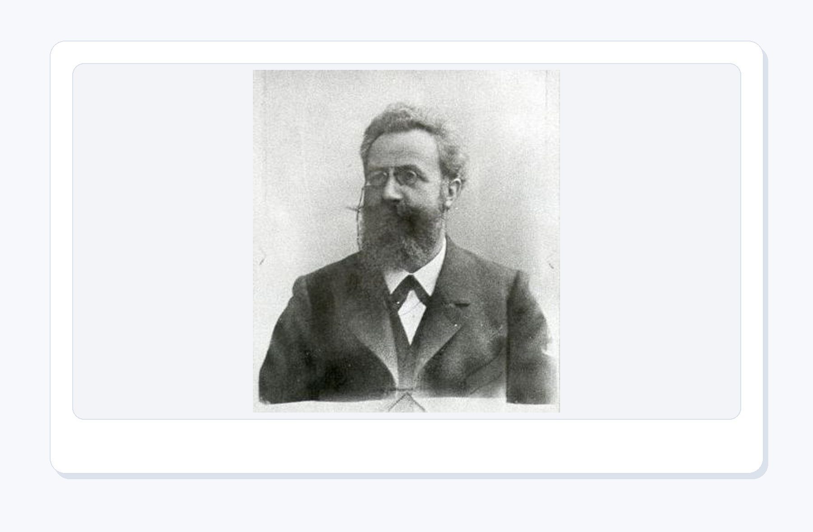

# 第 6 章：数据分析与可视化

<style>
figure {
  margin: 1.2em auto 1.8em;
  text-align: center;
}
figure img {
  max-width: 100%;
  display: block;
  margin: 0 auto;
}
figcaption {
  margin-top: 0.45em;
  color: #5f6673;
  font-size: 0.92em;
  line-height: 1.55;
}
figcaption strong {
  color: #2d3748;
}
</style>


<figure align="center">
  
  <figcaption><strong>图6-1 本章封面</strong>：数据表像实验记录本：一行一个观察，一列一个变量。看懂它，图表才不是装饰。</figcaption>
</figure>

> 本章一句话：数据表像实验记录本：一行一个观察，一列一个变量。看懂它，图表才不是装饰。

第6章继续推进“科研卡片工厂”的能力建设。前面几章让 Python 能运行、能管理数据、能处理文件；这一章开始把能力放进更具体的应用场景里。学习时不要把知识点当成散装零件，而要始终问：它能帮我的卡片工厂多做哪一件真实的事？

---

## 6.0 本章学习目标

学完本章，你应该能够：

1. 用自己的话解释本章核心概念。
2. 运行本章配套脚本，看到明确输出。
3. 把概念和“科研卡片工厂”的连续项目联系起来。
4. 识别本章最常见的新手错误。
5. 完成本章小项目：**学习卡片统计仪表盘**与**记忆复习计划**。

---

## 6.1 开场故事：先有画面，再有术语

数据表像实验记录本：一行一个观察，一列一个变量。看懂它，图表才不是装饰。 这句话不是为了热闹，而是为了把本章的知识放进真实使用场景。初学者最怕一上来就被术语包围，像走进一个所有门牌都用缩写写成的楼层。我们先从画面进入，再慢慢把画面翻译成代码。

<figure align="center">
  
  <figcaption><strong>图6-2 Nightingale 的死亡原因图</strong>：这张历史图表提醒我们，可视化不是把数据画漂亮，而是把问题画到别人无法忽视。</figcaption>
</figure>

Florence Nightingale 常被记住为护士，但她也是数据可视化史上非常重要的人。她把克里米亚战争中的死亡原因画成图，让“卫生条件造成大量死亡”不再只是一串数字，而变成能推动决策的证据。这个故事很适合放在数据分析第一节：图表不是 PPT 的彩带，图表是让事实站出来说话。

<figure align="center">
  
  <figcaption><strong>图6-3 William Playfair 的时间序列图</strong>：把价格、工资和时间画在一起，变化不再躲在表格格子里。</figcaption>
</figure>

William Playfair 是统计图史上绕不开的人物。他把时间、价格、工资这类原本只能在表格中一格一格读的信息画成曲线。曲线的力量在于，它让趋势变成一眼能看见的动作：上涨、下跌、波动、转折。你第一次学折线图时，可能会以为它只是“把点连起来”，但 Playfair 的故事提醒我们：折线图真正表达的是“变化”。

这对学习记录也很重要。如果你只看一张表，可能只看到“今天学了 25 分钟”；如果你把连续十天画出来，才会发现自己哪天断档、哪天状态最好、哪段内容明显拖慢了节奏。图表不是把数字涂漂亮，而是让时间里的变化露出线索。

<figure align="center">
  
  <figcaption><strong>图6-4 Minard 的拿破仑远征俄国图</strong>：一张好图能同时讲清路线、人数、温度和灾难的推进。</figcaption>
</figure>

Minard 的拿破仑远征俄国图常被称为经典信息图。它厉害的地方不是颜色很多，而是把多个变量组织到同一个故事里：军队往哪里走、人数如何减少、气温如何下降、撤退如何发生。观看者不需要先背一堆统计术语，也能感到那条线越来越细时发生了什么。

这给本章一个非常实用的审美标准：**图表越复杂，越要帮观看者减少混乱，而不是炫耀复杂。** 如果一张图让人看完只想问“所以呢”，它就还没完成任务。

<figure align="center">
  
  <figcaption><strong>图6-5 W.E.B. Du Bois 数据肖像</strong>：数据图表也可以有审美和立场，颜色、构图和标题一起服务于清楚表达。</figcaption>
</figure>

1900 年巴黎世博会上，W.E.B. Du Bois 和团队展出了一组关于非裔美国人生活、教育、收入和社会处境的数据图表。它们不像今天很多默认模板图那样冷冰冰，而是用强烈的颜色、几何构图和清楚标题，把统计资料变成能被观看、被讨论、被记住的视觉作品。

这对本章很重要：图表审美不是给数据化妆，而是让观看者更快看见结构。标题要说人话，颜色要有意义，空白要敢留，图例不要像迷宫。Python 画图时，如果只是把数据扔进默认样式，当然也能生成图片；但如果想把图放进报告、学习分享或科研卡片，就要开始有设计意识。

<figure align="center">
  
  <figcaption><strong>图6-6 故事场景</strong>：Pandas 像超级 Excel，Matplotlib 像画图笔，NumPy 像高速计算积木。</figcaption>
</figure>

这个画面对应本章的核心比喻：Pandas 像超级 Excel，Matplotlib 像画图笔，NumPy 像高速计算积木。 如果你能先记住这个比喻，后面的概念就不再是干巴巴的定义。

---

## 6.2 知识路线

<figure align="center">
  
  <figcaption><strong>图6-7 知识路线</strong>：先建立直觉，再运行代码，最后完成一个可展示的小项目。</figcaption>
</figure>

本章路线如下：

| 顺序 | 主题 | 你要完成的动作 |
| --- | --- | --- |
| 1 | CSV 数据 | 先把学习记录写成一张可复查的表 |
| 2 | Series/DataFrame | 再把表格读成 Python 可以筛选和统计的数据结构 |
| 3 | 筛选与分组 | 找出不同主题、不同状态下的数据差异 |
| 4 | 描述统计 | 先算平均值、完成率和反应时，建立第一眼判断 |
| 5 | Matplotlib 图表 | 把关键比较画成能放进报告的图 |
| 6 | 结果解释 | 用图表回答“下一步应该做什么” |

---

## 6.3 核心概念：从人话到术语

<figure align="center">
  
  <figcaption><strong>图6-8 核心比喻</strong>：用一个稳定画面记住本章最重要的概念关系。</figcaption>
</figure>

先用人话说：Pandas 像超级 Excel，Matplotlib 像画图笔，NumPy 像高速计算积木。

<figure align="center">
  
  <figcaption><strong>图6-9 John Snow 的霍乱地图</strong>：把死亡地点放到地图上，问题的中心开始显形；这就是“数据位置”和“图表解释”的力量。</figcaption>
</figure>

1854 年伦敦霍乱暴发时，John Snow 把病例位置标在地图上，发现它们集中在 Broad Street 水泵附近。这个故事可以帮我们理解：数据分析不是先有炫技，而是先有问题。你要问“这些记录在哪里聚集？哪个类别异常？哪个变量最值得比较？”图表只是工具，真正重要的是问题意识。

再用术语说，本章要掌握这些内容：

- **CSV 数据**：像一张朴素的实验记录表，负责保存原始学习记录。
- **Series/DataFrame**：把表格变成可以筛选、分组、统计的对象，像给 Excel 装上自动分析手臂。
- **筛选与分组**：把“所有记录”拆成更有意义的小组，例如按主题、完成状态或日期比较。
- **描述统计**：先问平均值、完成率、反应时这些基础问题，再决定要不要继续深入。
- **Matplotlib 图表**：把重点比较画出来，让趋势、差异和异常点不再躲在表格里。
- **结果解释**：图表不是终点，真正的目标是说明下一步行动。

术语不是用来吓人的，它只是为了让大家交流时不用每次都讲一长串故事。你先用故事建立直觉，再用术语压缩表达，这样学得稳。

<figure align="center">
  
  <figcaption><strong>图6-10 Anscombe 四重奏</strong>：统计摘要可能很像，但图形结构完全不同；这就是为什么数据分析不能只看平均数。</figcaption>
</figure>

Anscombe 四重奏是数据分析课上非常经典的“反直觉小剧场”：四组数据的均值、方差、相关系数和回归线都很接近，但画出来以后形状完全不同。有的像一条线，有的是曲线，有的被离群点牵着走，还有一组几乎所有 x 都一样。

这个故事可以帮你建立一个重要习惯：**先算摘要，再看图形，最后解释语境。** 只算平均数，就像只听一个人的自我介绍；画出分布和关系，才像真正见到这个人的行为模式。数据也会“装乖”，图表能帮你拆穿它。

John Tukey 推动的探索性数据分析也在讲同一件事：不要一上来就急着宣布结论，先像侦探一样观察数据。箱线图就是这种思想的好工具：中位数告诉你中心，四分位数告诉你拥挤程度，异常值像角落里突然亮起的小灯。它不一定代表错误，也可能是最值得追问的故事入口。

---

## 6.4 最小可运行示例

<figure align="center">
  
  <figcaption><strong>图6-11 最小示例</strong>：先跑通最小代码，再逐步增加功能，学习会稳很多。</figcaption>
</figure>

本章第一件事不是背参数，而是运行一个最小例子。打开终端，进入本章目录后运行：

```bash
python code/ch06/01_make_sample_csv.py
```

如果你能看到输出，说明这一章的入口已经打通。后面所有复杂功能，都是在这个入口上慢慢加能力。

<figure align="center">
  
  <figcaption><strong>图6-12 PowerShell 真实运行结果</strong>：本章脚本会生成 CSV、统计输出、仪表盘、Anscombe 四重奏、图表改造图和审美检查单。</figcaption>
</figure>

请注意这张截图里的顺序：先生成 `learning_records.csv`，再计算记录数、平均学习时长、平均反应时和完成率，最后生成 `ch06_learning_dashboard.png`。数据分析不是“点一下神奇按钮”，而是输入、处理、输出一环扣一环。

---

## 6.5 与心理学/科研教学的连接

<figure align="center">
  
  <figcaption><strong>图6-13 心理学连接</strong>：把本章能力放进实验、记录、分析和学习分享的真实任务里。</figcaption>
</figure>

这一章会把例子贴近心理学、科研记录和学习分享。因为这些任务天然需要清晰流程：刺激是什么，反应是什么，数据存到哪里，结果如何展示，别人能不能复现。

在本章里，你可以这样理解项目价值：

- 它不是孤立练习，而是科研卡片工厂的一台新设备。
- 它处理的材料可以是课程笔记、实验记录、问卷结果、图片、网页资料或报告模板。
- 它最终要留下可检查的结果，而不是只在屏幕上闪一下。

<figure align="center">
  
  <figcaption><strong>图6-14 Hermann Ebbinghaus 与记忆曲线</strong>：记忆不是硬盘保存按钮，刚学会的东西如果不回看，很快就会开始褪色。</figcaption>
</figure>

Hermann Ebbinghaus 用自己做记忆实验，研究人会怎样遗忘无意义音节。这个故事放在 Python 数据分析里并不突兀，因为学习记录本身就是一种很好的数据：今天学了什么、花了多久、有没有完成、反应时高不高。它们不是为了“打卡好看”，而是为了让复习安排更像一个有证据的计划。

把它放回科研卡片工厂的主线里：ch0 启动工厂，ch2 存卡片，ch3 整理文件，ch5 把卡片封装成对象，到了 ch6，工厂终于能根据学习数据判断“哪张卡片该早点回来”。这比单纯喊“要复习”有用得多，因为 Python 会把提醒写进文件，也会把趋势画成图。

运行方式：

```bash
python code/ch06/09_make_memory_review_curve.py
```

运行后会生成：

```text
output/ch06_memory_review_plan.json
reports/ch06_memory_review_plan.md
output/ch06_memory_review_plan.png
```

<figure align="center">
  
  <figcaption><strong>图6-15 Python 生成的记忆复习曲线</strong>：红线提醒你“不复习会掉得很快”，蓝线提醒你“间隔复习是在给记忆续航”。</figcaption>
</figure>

这张图不是要把艾宾浩斯曲线当成万能公式，而是训练一种数据习惯：把模糊的学习感受变成可以讨论的记录。比如“字典总是记不牢”这句话太模糊；如果文件里写着“字典未完成，反应时 610 ms，明天复习”，下一步行动就清楚了。数据分析最可爱的地方正在这里：它不替你学习，但它会让你少靠玄学安排复习。

<figure align="center">
  
  <figcaption><strong>图6-16 Hans Rosling 的数据叙事</strong>：数据讲得好，不是把数字念完，而是让听众看见趋势、差异和人的处境。</figcaption>
</figure>

Hans Rosling 的演讲让很多人第一次感到：数据可视化可以像讲故事一样有节奏。气泡移动、国家变化、趋势展开，抽象指标突然有了时间感和场景感。这里的启发不是“每张图都要做动画”，而是：数据分析最终要面向人。图表如果不能帮助人理解问题，就算代码再复杂，也只是漂亮的噪音。

所以本章做学习卡片统计仪表盘时，也要问同样的问题：观看者能不能一眼看出完成率？能不能看出哪个主题花时最多？能不能知道这张图下一步要支持什么行动？图表不是结尾，它应该把人带到下一步判断。

<figure align="center">
  
  <figcaption><strong>图6-17 数据侦探桌</strong>：数据分析像把证据铺在桌上：记录纸告诉你来源，图表显示模式，放大镜盯住异常点，最后才轮到结论上场。</figcaption>
</figure>

把自己想成一名数据侦探，会比把自己想成“画图机器”更接近本章精神。侦探不会一进门就宣布凶手是谁，他会先看证据：数据从哪里来？有没有缺失？有没有离群点？图表有没有把重点讲清楚？如果证据桌乱成一团，结论再响亮也只是拍桌子。

所以本章的图表练习不是为了炫技，而是训练三件事：先检查数据，再选择图形，最后用审美把重点变清楚。审美不是给图表化妆，而是帮观看者少走弯路。一个好的统计仪表盘，应该像整齐的证据桌：每一张图都有位置，每一个颜色都有理由，每一个异常点都值得回头确认。

---

## 6.6 关键概念拆解表

| 概念 | 人话理解 | 本章落点 |
| --- | --- | --- |
| CSV 数据 | 像一张朴素表格，用逗号分隔字段，适合保存实验记录和学习记录 | `01_make_sample_csv.py` 生成 `input/learning_records.csv` |
| 行与列 | 一行是一条观察，一列是一个变量，不要把它们在脑子里搅成一锅 | 每一行对应一个学习主题，每一列记录时长、完成状态、反应时 |
| 描述统计 | 先问“平均多少、完成多少、差异在哪里”，不要直接冲向复杂模型 | `02_basic_statistics.py` 计算平均时长、平均反应时和完成率 |
| pandas | 像超级 Excel，可以更方便地筛选、分组和汇总表格 | `03_optional_pandas_summary.py` 展示可选 pandas 版本 |
| 图表 | 图表不是装饰，它负责让一个比较变得清楚 | `04_make_dashboard_chart.py` 生成学习统计仪表盘 |
| 结果解释 | 数字跑出来以后，要能说出它意味着什么 | 把输出写进复盘或报告，而不是只看一眼就关掉 |
| 异常值诊断 | 异常值不是敌人，它可能是错误，也可能是故事入口 | `07_make_outlier_diagnosis.py` 生成箱线图诊断卡 |
| 间隔复习 | 记忆不是一次保存成功，而是需要定期回看的系统 | `09_make_memory_review_curve.py` 生成复习计划和记忆曲线 |
| 图表审美诊所 | 把同一份数据拆成几张清楚小图，让趋势、差异、完成度和反应时各说各的话 | `10_make_chart_style_clinic.py` 生成四宫格展示图和诊断单 |

这张表的作用，是把“我好像懂了”变成“我知道它在哪用”。学习编程时，最危险的状态不是完全不会，而是听解释时点头，自己动手时发呆。每学一个概念，都要强迫自己问一句：它在本章项目里负责哪一段工作？

---

## 6.7 配套代码逐个导览

### 脚本 1：`01_make_sample_csv.py`

运行方式：

```bash
python code/ch06/01_make_sample_csv.py
```

阅读时重点看三件事：每一列记录什么，CSV 写到哪里，后面的统计脚本会怎样读取它。

### 脚本 2：`02_basic_statistics.py`

运行方式：

```bash
python code/ch06/02_basic_statistics.py
```

阅读时重点看三件事：脚本读入了几条记录，平均学习时长怎么算，完成率怎样从原始记录里得出。

### 脚本 3：`03_optional_pandas_summary.py`

运行方式：

```bash
python code/ch06/03_optional_pandas_summary.py
```

阅读时重点看三件事：DataFrame 怎样筛选列、怎样分组汇总，pandas 版本和纯标准库版本各自清爽在哪里。

建议第一次运行时不要急着改代码。先原样运行，确认能看到输出；第二次再改一个最小参数；第三次再尝试把输出写入 `output/` 或 `reports/`。这种节奏比“一上来就大改”更稳。

### 脚本 4：`04_make_dashboard_chart.py`

运行方式：

```bash
python code/ch06/04_make_dashboard_chart.py
```

这个脚本会读取 `input/learning_records.csv`，把统计摘要和学习时长画成一张 PNG 图表，保存到：

```text
output/ch06_learning_dashboard.png
```

它的重点不是“Pillow 有多厉害”，而是让你看到数据分析的闭环：CSV 输入、统计计算、图表输出、文件保存。图表生成以后，请打开看一眼：文字有没有挤在一起，颜色是否能区分类别，别人能不能一秒看懂主要比较。审美不是额外加分项，它会影响结果能不能被别人读懂。

### 脚本 5：`05_anscombe_quartet.py`

运行方式：

```bash
python code/ch06/05_anscombe_quartet.py
```

这个脚本会把 Anscombe 四重奏画成一张图，保存到：

```text
output/ch06_anscombe_quartet.png
```

运行它时，请特别观察四个面板：均值看起来很像，但形状完全不同。这个脚本想训练的不是画点图本身，而是一个数据分析习惯：摘要统计负责快速概括，图表负责检查结构，解释负责回到真实问题。三者缺一块，都容易误判。

### 脚本 6：`06_make_chart_makeover.py`

运行方式：

```bash
python code/ch06/06_make_chart_makeover.py
```

这个脚本会把同一份学习数据画成“Before / After”两种效果，并生成一份图表审美检查单：

```text
output/ch06_chart_makeover.png
output/ch06_visual_check.md
output/ch06_visual_check_preview.png
```

这不是单纯追求漂亮，而是训练一种图表判断力：颜色有没有意义，标题有没有结论，标签是不是别人一眼能看懂，输出文件能不能复现。

### 脚本 7：`07_make_outlier_diagnosis.py`

运行方式：

```bash
python code/ch06/07_make_outlier_diagnosis.py
```

这个脚本会生成：

```text
reports/ch06_outlier_diagnosis.md
output/ch06_outlier_diagnosis.png
```

它会读取学习时长数据，用箱线图做一次异常值诊断。如果原始 CSV 记录太少，脚本会临时加入几条“复盘日”演示值，只用于说明诊断方法，不会改写原始 CSV。请注意红色点：它不是“坏数据”的同义词，而是提醒你回到语境里问一句：这天为什么学了这么久？

### 脚本 8：`08_make_ch05_handoff_analysis.py`

运行方式：

```bash
python code/ch06/08_make_ch05_handoff_analysis.py
```

这个脚本负责把 ch5 的对象交付包接进 ch6。它会读取上一章的对象模型输出，把卡片数量、标签计数和试次反应时整理成摘要。它像一个交接单：前一章把材料打包，后一章开始统计和解释。

### 脚本 9：`09_make_memory_review_curve.py`

运行方式：

```bash
python code/ch06/09_make_memory_review_curve.py
```

这个脚本把学习记录变成复习计划。它不会神秘地“预测大脑”，只是根据完成状态、反应时和学习时长，给每张卡片安排一个下一次回看的时间，并生成记忆曲线图。它训练的是一种很实用的思维：让数据提醒行动，而不是让行动全靠心情。

### 脚本 10：`10_make_chart_style_clinic.py`

运行方式：

```bash
python code/ch06/10_make_chart_style_clinic.py
```

这个脚本继续读取同一份 `learning_records.csv`，但它不再只问“能不能画出来”，而是追问“能不能让别人舒服地读出来”。它会生成：

```text
output/ch06_chart_style_clinic.png
reports/ch06_chart_style_clinic.md
```

四宫格里分别展示趋势、主题投入、完成率和反应时。你可以把它当成一张小型学习分享页：每个面板只负责一个问题，不把所有信息挤进一张图里开大会。数据可视化最怕“什么都想说”，结果别人什么都没听清。

---

## 6.8 常见坑

<figure align="center">
  
  <figcaption><strong>图6-18 常见坑地图</strong>：错误不是判决，而是提醒你该检查路径、输入、状态或依赖。</figcaption>
</figure>

本章常见坑：

- 只画图不解释
- 列名混乱
- 把缺失值当 0
- 坐标轴没有单位

遇到问题时，先看报错信息，再看文件路径，最后看输入数据。不要一报错就重装环境。重装是最后手段，不是第一反应。

---

## 6.9 本章小项目：学习卡片统计仪表盘

<figure align="center">
  
  <figcaption><strong>图6-19 本章项目</strong>：完成“学习卡片统计仪表盘”，给科研卡片工厂增加一项新能力。</figcaption>
</figure>

项目目标：读取学习记录 CSV，统计主题数量、完成率和反应时，生成图表；再把学习记录转成记忆复习计划，让科研卡片工厂不只会“生产卡片”，也会提醒“什么时候回来复习”。

<figure align="center">
  
  <figcaption><strong>图6-20 Python 生成的仪表盘</strong>：这张图由 `04_make_dashboard_chart.py` 读取 CSV 后生成，审美要在线，结果也要能复现。</figcaption>
</figure>

<figure align="center">
  
  <figcaption><strong>图6-21 Python 生成的 Anscombe 四重奏</strong>：同样的摘要统计，画出来可能是四个世界；这张图由 `05_anscombe_quartet.py` 生成。</figcaption>
</figure>

<figure align="center">
  
  <figcaption><strong>图6-22 Python 生成的图表改造对比</strong>：同一份数据，左边是新手常见的嘈杂图，右边是更适合报告和教学分享的干净图。</figcaption>
</figure>

<figure align="center">
  
  <figcaption><strong>图6-23 Python 生成的图表审美检查单</strong>：图表交出去前，先检查标题、颜色、标签、网格和输出文件。</figcaption>
</figure>

<figure align="center">
  
  <figcaption><strong>图6-24 Python 生成的图表审美诊所</strong>：`10_make_chart_style_clinic.py` 把同一份学习记录拆成趋势、投入、完成率和反应时四个面板，让每张小图只回答一个问题。</figcaption>
</figure>

这张图像一张“图表体检报告”。如果把所有信息挤进一张大图，观看者就像被塞进信息地铁早高峰：每个变量都很努力，但谁也不让路。四宫格的好处是，每个问题有自己的位置：趋势负责讲变化，柱形负责讲投入，圆环负责讲完成度，反应时负责提示认知负荷。漂亮不是目的，清楚才是目的；审美只是清楚表达的外衣，衣服合身，行动才利落。

<figure align="center">
  
  <figcaption><strong>图6-25 Python 生成的异常值诊断卡</strong>：箱线图把中位数、四分位数和异常值放到同一张图里，提醒你先看分布，再讲故事。</figcaption>
</figure>

这张图来自 `07_make_outlier_diagnosis.py`。它给学习卡片统计仪表盘补上一种很实用的能力：发现“不太一样”的记录。心理学实验里，异常反应时可能是按错键，也可能是刺激太难；学习记录里，超长学习时长可能是拖延，也可能是一次真正的突破。Python 负责把红点标出来，解释要回到人和任务。

如果你已经运行过 ch5 的 `08_make_object_delivery_package.py`，本章还可以直接读取上一章导出的对象模型。这样，`LearningCard`、`CardDeck` 和 `Trial` 不再只停留在 OOP 章节，而是变成可以分析的真实数据。

运行方式：

```bash
python code/ch06/08_make_ch05_handoff_analysis.py
```

运行后会生成：

```text
output/ch06_ch05_handoff_summary.json
reports/ch06_ch05_handoff_analysis.md
output/ch06_ch05_handoff_analysis.png
```

<figure align="center">
  
  <figcaption><strong>图6-26 第5章到第6章跨章节数据分析回执</strong>：`08_make_ch05_handoff_analysis.py` 读取 ch5 的对象交付包，把卡片数量、标签计数和试次反应时整理成 ch6 可以继续分析的数据摘要。</figcaption>
</figure>

这一步让“连续项目”真正接上了：ch5 负责把世界整理成对象，ch6 负责把对象留下的数据变成统计摘要和图表。对象像一盒整理好的实验材料，数据分析像把它们铺到桌面上，看趋势、看差异、看异常。

最后，给这条数据分析流水线做一次验收。漂亮图表很容易让人兴奋，但科研和教学更看重“能不能复盘”：原始 CSV 在不在？图表是不是脚本生成的？报告有没有落盘？JSON 摘要能不能再次读取？`11_make_analysis_runtime_evidence.py` 会把这些问题集中检查一遍。

运行方式：

```bash
python code/ch06/11_make_analysis_runtime_evidence.py
```

<figure align="center">
  
  <figcaption><strong>图6-27 数据分析运行证据总览</strong>：`11_make_analysis_runtime_evidence.py` 检查 CSV、仪表盘、Anscombe 四重奏、图表改造、异常值诊断、记忆复习计划、跨章节交接和图表审美诊所是否已经生成，把“图表好看”落到可复盘的文件证据上。</figcaption>
</figure>

建议项目结构：

```text
python_card_factory/
├── code/
│   └── ch06/
├── input/
├── output/
├── reports/
└── assets/
```

本章配套脚本：

- `code/ch06/01_make_sample_csv.py`
- `code/ch06/02_basic_statistics.py`
- `code/ch06/03_optional_pandas_summary.py`
- `code/ch06/04_make_dashboard_chart.py`
- `code/ch06/05_anscombe_quartet.py`
- `code/ch06/06_make_chart_makeover.py`
- `code/ch06/07_make_outlier_diagnosis.py`
- `code/ch06/08_make_ch05_handoff_analysis.py`
- `code/ch06/09_make_memory_review_curve.py`
- `code/ch06/10_make_chart_style_clinic.py`
- `code/ch06/11_make_analysis_runtime_evidence.py`

完成标准：

1. 能按顺序运行 `01_make_sample_csv.py` 到 `11_make_analysis_runtime_evidence.py`。
2. 能解释脚本输入、处理、输出分别是什么。
3. 把生成结果保存到 `output/` 或 `reports/`。
4. 在 README 或学习记录中写下运行命令。
5. 能解释为什么 Anscombe 四重奏说明“只看平均数不够”。
6. 能指出一张图至少 3 个可改进的设计点。
7. 能生成 `reports/ch06_outlier_diagnosis.md` 和 `output/ch06_outlier_diagnosis.png`，并说明一个异常值可能有哪些解释。
8. 能生成 `reports/ch06_ch05_handoff_analysis.md` 和 `output/ch06_ch05_handoff_summary.json`，并说明 ch5 的对象模型怎样变成 ch6 的分析数据。
9. 能生成 `reports/ch06_memory_review_plan.md` 和 `output/ch06_memory_review_plan.png`，并说明间隔复习为什么比临时抱佛脚可靠。
10. 能生成 `reports/ch06_chart_style_clinic.md` 和 `output/ch06_chart_style_clinic.png`，并说明为什么“四张小图”有时比“一张大杂烩图”更适合学习分享。
11. 能生成 `reports/ch06_analysis_runtime_evidence.md` 和 `output/ch06_analysis_runtime_evidence.png`，并确认运行证据为 `16/16 ready`。

动手步骤：

1. **准备目录**：确认 `python_card_factory/` 下有 `code/`、`input/`、`output/`、`reports/`。
2. **运行最小脚本**：先运行本章第一个脚本，得到一个确定反馈。
3. **记录环境**：把 Python 版本、运行命令和输出截图或输出文本写进 `reports/`。
4. **连接真实材料**：把课程笔记、实验记录、图片、网页或 CSV 放进 `input/`。
5. **生成作品**：让脚本在 `output/` 或 `reports/` 中留下文件。
6. **审美检查**：用 `ch06_visual_check.md` 检查标题、颜色、标签、网格和输出文件。
7. **制作审美诊所**：运行 `10_make_chart_style_clinic.py`，把趋势、投入、完成率和反应时拆成四个清楚面板。
8. **诊断异常值**：运行 `07_make_outlier_diagnosis.py`，把异常值解释写进复盘。
9. **接入上一章对象包**：运行 `08_make_ch05_handoff_analysis.py`，把 ch5 的对象交付包转换成数据分析摘要。
10. **生成复习计划**：运行 `09_make_memory_review_curve.py`，把学习记录转换成下一轮卡片复习安排。
11. **生成运行证据**：运行 `11_make_analysis_runtime_evidence.py`，检查本章关键产物是否齐全。
12. **写复盘**：说明这章让卡片工厂多了什么能力，哪些地方还容易出错。

---

## 6.10 练习任务

1. 修改一个输入参数，观察输出变化。
2. 把脚本生成的结果保存成文件。
3. 故意制造一个小错误，记录报错信息和修复方式。
4. 把本章项目和前面章节连接起来，例如读取 ch03 整理出的文件，或使用 ch02 的数据结构保存结果。
5. 运行 `05_anscombe_quartet.py`，用自己的话解释四组数据为什么不能只看均值。
6. 修改 `06_make_chart_makeover.py`，把右侧好图改成横向条形图，观察文字是否更容易阅读。
7. 给 `ch06_visual_check.md` 增加一条自己的检查标准。
8. 运行 `10_make_chart_style_clinic.py`，任选其中一个面板，说明它回答了哪个问题，为什么不应该和其他信息挤在同一个坐标轴里。
9. 运行 `07_make_outlier_diagnosis.py`，任选一个异常值写出两种解释：一种是假设它是记录错误，另一种是假设它是真实故事。
10. 打开 `output/ch06_ch05_handoff_summary.json`，尝试统计 `tag_counts` 中哪个标签出现最多，并解释这个结果对复习有什么提示。
11. 打开 `reports/ch06_memory_review_plan.md`，选择一张需要明天复习的卡片，写下你认为它应该提前复习的原因。
12. 运行 `11_make_analysis_runtime_evidence.py`，如果不是 `16/16 ready`，根据缺失文件反推应该补跑哪一个脚本。

---

## 6.11 自测问题

1. 本章最重要的三个概念是什么？请用人话解释，不要只背术语。
2. 本章第一个脚本的输入、处理、输出分别是什么？
3. 如果脚本运行失败，你第一步会检查路径、环境、依赖还是语法？为什么？
4. 本章项目和“科研卡片工厂”有什么关系？
5. 你能不能把本章项目改成一个心理学或教学场景的小任务？

参考回答不唯一。判断自己是否真的理解，可以看你能不能把答案讲给一个完全没学过本章的人听。

---

## 6.12 学习复盘模板

可以在 `reports/ch06_review.md` 中写下：

```markdown
# 第6章复盘

## 我新增的能力
- 

## 我跑通的脚本
- 

## 我遇到的报错
- 报错信息：
- 原因：
- 修复方式：

## 我能迁移到哪里
- 心理学实验：
- 教学分享：
- 科研资料整理：
```

复盘不是写作文，而是给未来的自己留路标。你现在记录清楚，后面做综合项目时就不用重新从记忆里翻箱倒柜。

---

## 6.13 与后续章节的连接

本章不是孤岛。它和整套教程的关系可以这样理解：

- 前面章节提供基础：环境、数据结构、文件管理。
- 本章提供一项新能力：学习卡片统计仪表盘，并把图表审美诊所加入教学分享链路。
- 后面章节会把这项能力继续接到数据分析、图像处理、爬虫或办公自动化里。

所以不要只问“这一章考试考什么”。更好的问题是：它能帮我少做哪一类重复劳动？它能让我的学习材料、实验记录或报告更稳定吗？

---

## 6.14 本章总结

数据分析与可视化的关键不是“记住所有 API”，而是理解它解决的问题。你已经从概念、图像、代码和小项目四个角度接触了本章内容。下一次复习时，不要只问“我会不会背”，而要问：

- 我能不能讲出这个概念的比喻？
- 我能不能运行一个最小脚本？
- 我能不能把结果放进项目目录？
- 我能不能说清楚它在科研卡片工厂里增加了什么能力？

如果答案是肯定的，这一章就不是看过了，而是真的进入你的工具箱了。
