# 第 6 章：数据分析与可视化

[TOC]

<figure align="center">
  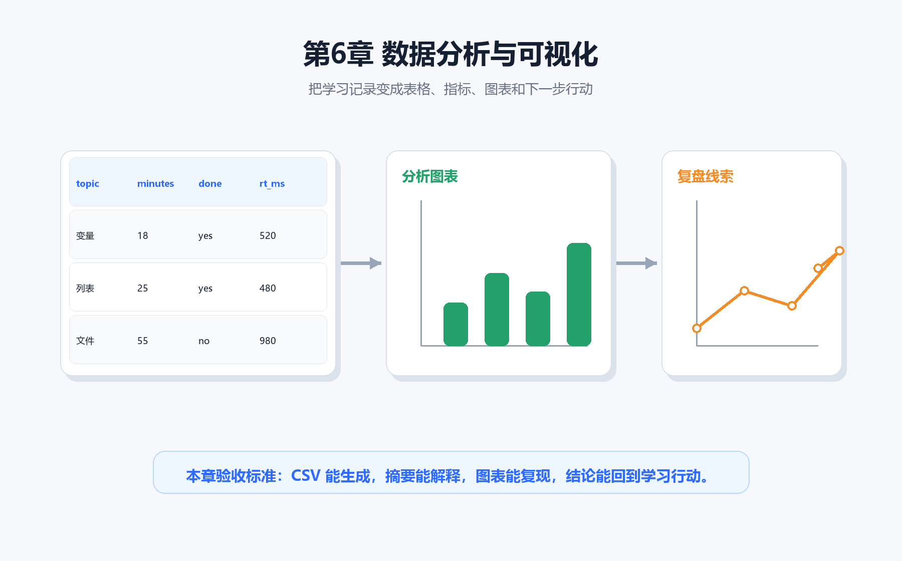
  <figcaption><strong>图6-1 第6章封面</strong>：本章把学习记录变成表格、摘要、图表和下一步行动。图表不是装饰，它要能回答问题。</figcaption>
</figure>

> 本章一句话：
> **数据分析不是把数字画漂亮，而是用一条可复查的链路回答问题：数据从哪里来，算出了什么，图表说明什么，下一步该做什么。**

前面几章里，我们已经能写函数、处理文件、构建 GUI，并在第5章把学习卡片、试次记录和交付包整理成对象。第6章开始，项目进入“看证据”的阶段：同样是一组学习记录，放在 CSV 里只是原材料；经过统计、可视化和复盘，它才会变成能指导下一次学习的判断。

这一章不会把数据分析讲成一堆遥远术语。我们只抓住一条主线：**先提出一个足够具体的问题，再用 Python 留下可复查的输出。** 你会生成 `learning_records.csv`，计算平均时长和完成率，画出学习仪表盘，比较 Anscombe 四重奏，诊断异常值，把第5章的对象交付包读进来，最后生成一份运行证据总览。

---

## 本章导读：先问问题，再画图

### 6.0 本章学习目标

学完本章，你应该能够做到：

1. 说清楚数据分析的最小链路：数据、摘要、图表、解释、行动。
2. 运行 `01_make_sample_csv.py`，生成一份可复查的学习记录 CSV。
3. 运行 `02_basic_statistics.py` 和 `03_optional_pandas_summary.py`，理解平均值、分组统计和完成率各回答什么问题。
4. 运行 `04_make_dashboard_chart.py`，把学习记录画成一张清楚的统计仪表盘。
5. 用 Anscombe 四重奏解释“统计摘要相似，不代表数据形状相同”。
6. 用图表改造检查单判断一张图是否标题清楚、颜色克制、标注有效。
7. 用异常值诊断图判断哪些记录需要回看，而不是草率删除。
8. 把第5章导出的对象交付包变成第6章的分析输入，并生成最终运行证据。

### 本章分区导航

| 分区 | 对应小节 | 你要抓住的主线 | 产出证据 |
| --- | --- | --- | --- |
| 第一部分：从 CSV 到第一张图 | 6.1-6.5 | 先把数据来源和最小分析链跑通 | CSV、统计输出、最小链路图 |
| 第二部分：摘要、分布与图表判断 | 6.6-6.9 | 平均数只能回答一部分问题，图形结构要单独检查 | 仪表盘、Anscombe、图表改造 |
| 第三部分：异常值、跨章数据与复习计划 | 6.10-6.12 | 数据里的“奇怪点”要回到学习语境解释 | 异常值诊断、ch05 交接、复习曲线 |
| 第四部分：图表风格与项目交付 | 6.13-6.14 | 好图只回答一个清楚问题，项目要留下可复查文件 | 审美诊所、项目交付链 |
| 第五部分：排错、练习与验收 | 6.15-6.21 | 用固定清单排查图表和脚本，最后整理证据 | 常见坑地图、运行证据、复盘模板 |

<figure align="center">
  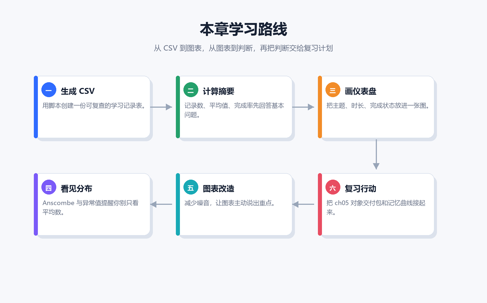
  <figcaption><strong>图6-2 本章学习路线</strong>：从生成 CSV 到画仪表盘，再到异常值、复习计划和运行证据，本章每一步都能落到文件。</figcaption>
</figure>

---

## 第一部分：从 CSV 到第一张图

### 6.1 数据分析先从问题开始

如果你一打开数据就急着画图，最容易得到一张“看起来很忙、实际上没回答问题”的图。第6章的第一条规则很朴素：**先问问题，再决定统计什么、画什么。**

对学习卡片项目来说，问题可以很具体：

1. 最近学习了哪些主题？
2. 每个主题花了多长时间？
3. 哪些主题已经完成，哪些还需要补？
4. 反应时偏高的主题，是不是值得提前复习？

这些问题不需要宏大的数据集。三行学习记录就足够练习完整流程，因为重点不是数据量，而是让“输入、处理、输出、解释”形成闭环。

<figure align="center">
  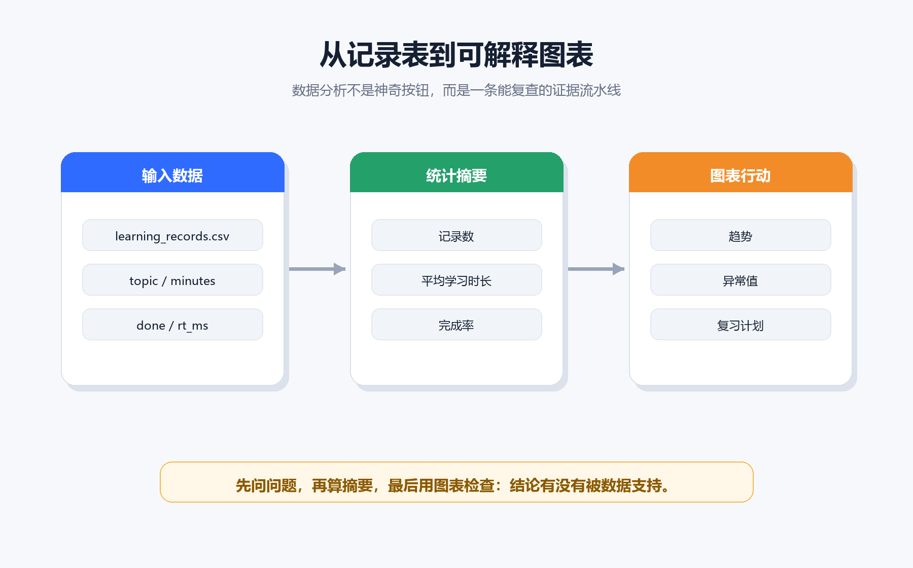
  <figcaption><strong>图6-3 从记录表到可解释图表</strong>：输入数据、统计摘要和图表行动要连成一条证据链。缺少任意一环，结论都会变轻。</figcaption>
</figure>

### 6.2 本章数据源：`learning_records.csv`

先进入第6章目录，运行第一个脚本：

```bash
python code/ch06/01_make_sample_csv.py
```

它会生成 `input/learning_records.csv`。这份 CSV 很小，但字段设计已经足够表达一个学习记录：

| 字段 | 含义 | 本章会怎么用 |
| --- | --- | --- |
| `topic` | 学习主题 | 作为图表的标签和分组依据 |
| `minutes` | 学习时长 | 计算平均值、画柱状图、发现异常 |
| `done` | 是否完成 | 计算完成率，区分已完成和待补主题 |
| `rt_ms` | 反应时 | 粗略提示理解负担，辅助安排复习 |

注意这里的 `rt_ms` 不是心理学实验中的严格测量，它只是本章项目里的学习反馈线索。初学阶段先把语义说清楚，比急着套复杂模型重要。

### 6.3 最小分析链：CSV → 摘要 → 图表

本章最小代码链路只有三步：

1. 用 `csv.DictReader` 读取每一行记录。
2. 把 `minutes`、`done`、`rt_ms` 转成可以统计的值。
3. 生成摘要或图表文件，让结果可以重新打开。

<figure align="center">
  
  <figcaption><strong>图6-4 最小分析链</strong>：先读 CSV，再算摘要，最后画图。链路越短，越容易发现路径、字段名和类型转换的问题。</figcaption>
</figure>

最小链路里有一个容易被忽略的习惯：**每一步都要能单独检查。** 如果 CSV 没生成，后面的统计和图表都不可靠；如果摘要解释不清，图表再漂亮也只是装饰；如果图表没有保存成文件，就没法复盘和提交。

### 6.4 先跑脚本，拿到第一批证据

生成 CSV 之后，继续运行前三个分析脚本：

```bash
python code/ch06/02_basic_statistics.py
python code/ch06/03_optional_pandas_summary.py
python code/ch06/04_make_dashboard_chart.py
```

你应该看到记录数、平均学习时长、平均反应时和完成率。`03_optional_pandas_summary.py` 会尝试使用 pandas；如果你的环境里没有 pandas，也不用慌，本章核心链路依然可以用标准库和 Pillow 跑通。

<figure align="center">
  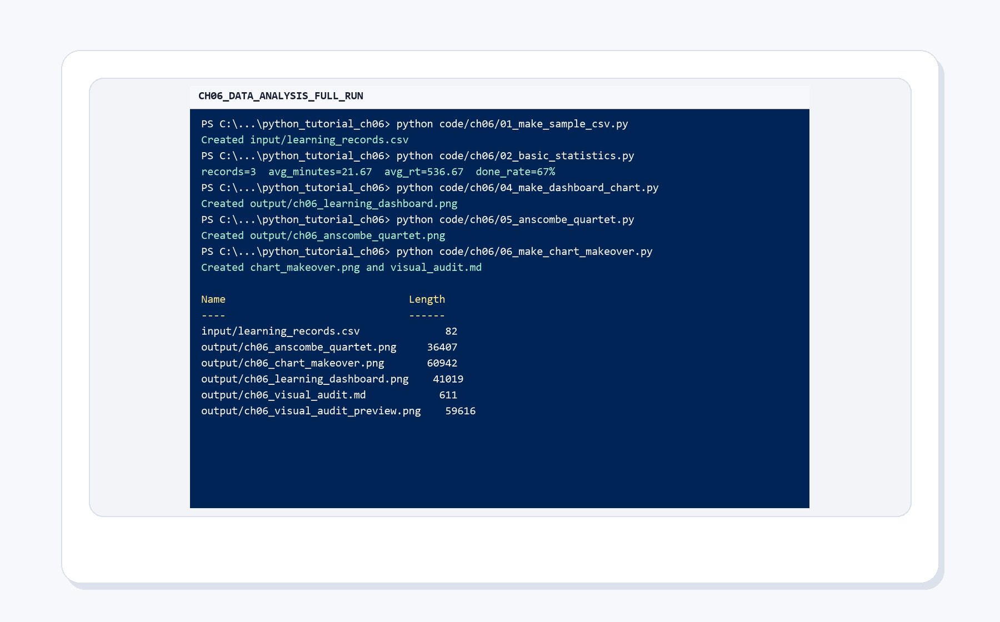
  <figcaption><strong>图6-5 第6章脚本运行证据</strong>：脚本不是只在正文里展示概念，而是真的生成 CSV、统计输出、图表、报告和运行证据。</figcaption>
</figure>

这张运行图的价值不在于“终端很酷”，而在于它证明项目不是静态截图。你可以改 CSV，重新运行脚本，再比较输出是否改变。这就是数据分析项目的基本可信度。

### 6.5 最小心智模型：不要让图表越过解释

数据分析很容易被讲成工具清单：pandas、NumPy、Matplotlib、Seaborn、Excel、Jupyter。工具当然重要，但初学阶段更该先记住下面这条链：

<figure align="center">
  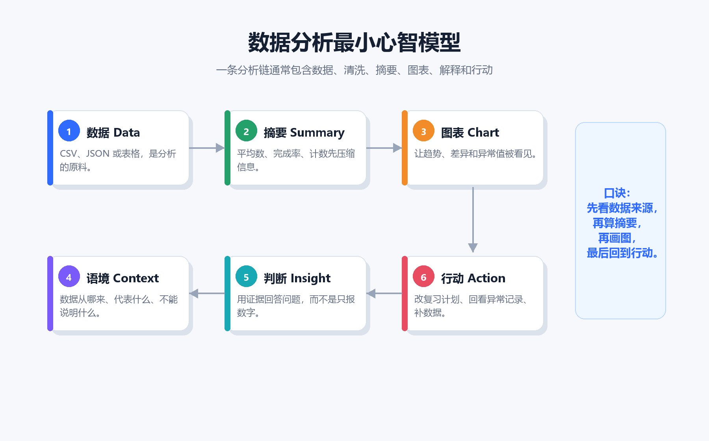
  <figcaption><strong>图6-6 数据分析最小心智模型</strong>：数据、摘要、图表、语境、判断和行动要按顺序互相支撑。图表不能替你自动下结论。</figcaption>
</figure>

这条链能帮你判断自己有没有跳步：

| 环节 | 你要问的问题 | 常见跳步 |
| --- | --- | --- |
| 数据 | 它从哪里来，字段是什么意思？ | 直接拿不明来源的数据作结论 |
| 摘要 | 它压缩了哪些信息，又丢掉了哪些信息？ | 只看平均数 |
| 图表 | 它让哪个比较更容易看见？ | 一张图塞太多问题 |
| 语境 | 这个数在项目里意味着什么？ | 离开学习记录讲统计术语 |
| 判断 | 证据支持什么，不支持什么？ | 把猜测写成结论 |
| 行动 | 下一次学习要怎么改？ | 图画完就结束 |

---

## 第二部分：摘要、分布与图表判断

### 6.6 统计摘要回答“有多少”和“平均多少”

`02_basic_statistics.py` 的输出很短，通常像这样：

```text
记录数： 3
平均学习时长： 21.67
平均反应时： 536.67
完成率： 67%
```

这几个数适合回答“总体情况如何”。但是它们不能告诉你每个主题的形状，也不能告诉你是否有异常记录。统计摘要像把一页笔记压缩成几行目录，目录有用，但目录不是全文。

学习数据里最常见的三个摘要是：

| 摘要 | 能回答 | 不能回答 |
| --- | --- | --- |
| 记录数 | 一共有多少条观察 | 每条观察是否可靠 |
| 平均学习时长 | 大致投入水平 | 是否有某一天特别高或特别低 |
| 完成率 | 进度是否接近预期 | 未完成的主题为什么卡住 |

### 6.7 仪表盘：让一个比较变清楚

运行：

```bash
python code/ch06/04_make_dashboard_chart.py
```

脚本会读取 CSV，生成 `output/ch06_learning_dashboard.png`，并同步一份网页用图到 `assets/ch06/web/ch06_learning_dashboard_output.png`。正式教材图会把这张输出图放进统一版式里。

<figure align="center">
  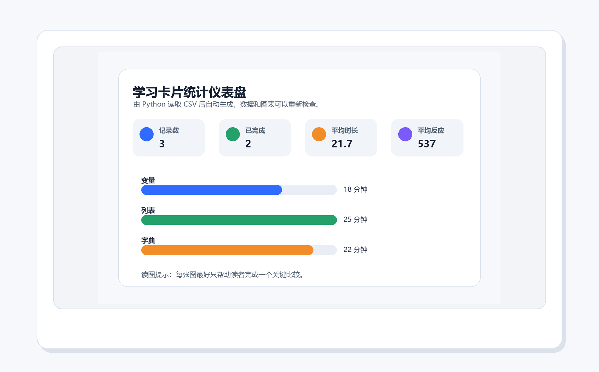
  <figcaption><strong>图6-7 Python 生成的学习仪表盘</strong>：记录数、完成数、平均时长和平均反应时放在顶部，下面只比较各主题学习时长。</figcaption>
</figure>

这张图故意很克制：没有复杂背景，没有太多颜色，也没有把所有指标塞进同一个坐标系。它只想回答一个问题：**哪几个主题占用了更多学习时间？**

### 6.8 只看平均数会被骗：Anscombe 四重奏

Anscombe 四重奏是数据分析入门里很值得保留的经典例子。四组数据的均值、方差和相关关系很接近，但画出来的形状完全不同。

运行：

```bash
python code/ch06/05_anscombe_quartet.py
```

<figure align="center">
  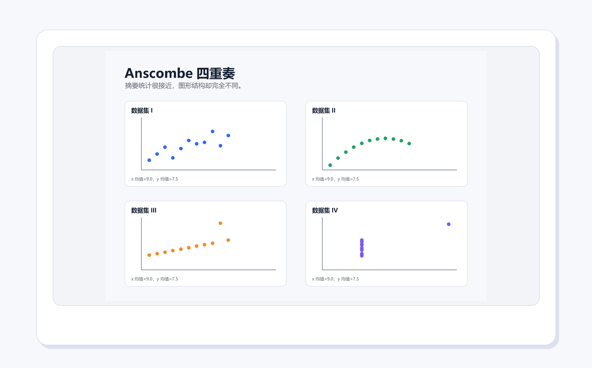
  <figcaption><strong>图6-8 Python 生成的 Anscombe 四重奏</strong>：摘要统计相似，不代表数据形状相同。先看摘要，再看图形，结论才不容易漂。</figcaption>
</figure>

把这个例子放回学习记录里，你会得到一个很实用的提醒：两个人平均每天都学 30 分钟，不代表他们学习节奏一样。一个人可能每天稳定 30 分钟，另一个人可能前六天几乎没学，最后一天补了 180 分钟。平均数相同，学习策略完全不同。

### 6.9 图表改造：从能画到能读

能画出图，只是第一步。真正能用的图至少要做到三件事：

1. 标题告诉读者要看什么，而不是只写变量名。
2. 颜色有含义，不能只是为了热闹。
3. 标注和网格服务于比较，不能抢走注意力。

运行：

```bash
python code/ch06/06_make_chart_makeover.py
```

<figure align="center">
  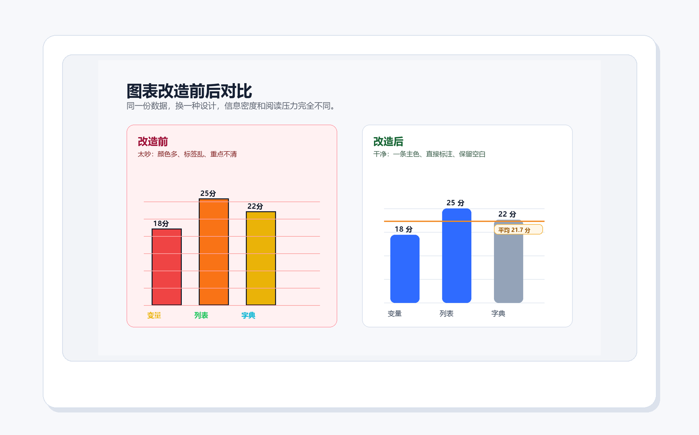
  <figcaption><strong>图6-9 图表改造前后对比</strong>：左图展示新手常见的颜色和标签噪音，右图保留主色、直接标注和平均线，阅读压力更低。</figcaption>
</figure>

<figure align="center">
  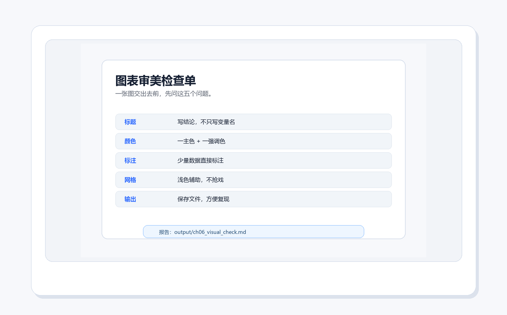
  <figcaption><strong>图6-10 图表审美检查单</strong>：每张图交出去前，至少检查标题、颜色、标注、网格和输出文件这五件事。</figcaption>
</figure>

图表审美不是“好不好看”这么简单。对学习项目来说，审美的底层目标是减少误读：让读者更快看见你想比较的东西，也更容易追问数据从哪里来。

---

## 第三部分：异常值、跨章数据与复习计划

### 6.10 异常值不是错误，也不是结论

异常值很容易引起两种误判：一种是立刻删掉，另一种是立刻写成故事。更稳的做法是先标出来，再回到原始记录确认。

运行：

```bash
python code/ch06/07_make_outlier_diagnosis.py
```

<figure align="center">
  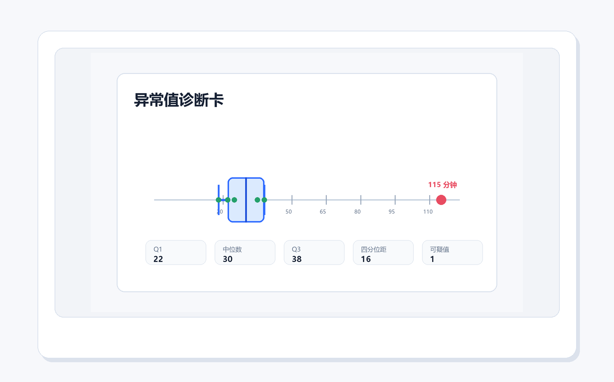
  <figcaption><strong>图6-11 异常值诊断卡</strong>：箱线图把中位数、四分位距和可疑值放在同一条轴上，提醒你先检查记录，再解释原因。</figcaption>
</figure>

对学习记录来说，异常值可能有三种含义：

| 情况 | 例子 | 下一步 |
| --- | --- | --- |
| 记录错误 | 把 25 分钟误写成 250 分钟 | 修正 CSV，并说明修正原因 |
| 真实困难 | 文件读写那天学了 95 分钟 | 回看当天任务，拆小复习计划 |
| 特殊安排 | 周末集中补课 | 不一定删除，但要在解释里说明 |

异常值的处理要留痕。你可以在 `reports/ch06_outlier_diagnosis.md` 里写下判断：它是错误、困难，还是特殊安排。

### 6.11 把第5章对象交给第6章分析

第5章最后会导出 `ch05_object_delivery_package.json`。它不是上一章的尾巴，而是第6章的数据输入。运行：

```bash
python code/ch06/08_make_ch05_handoff_analysis.py
```

<figure align="center">
  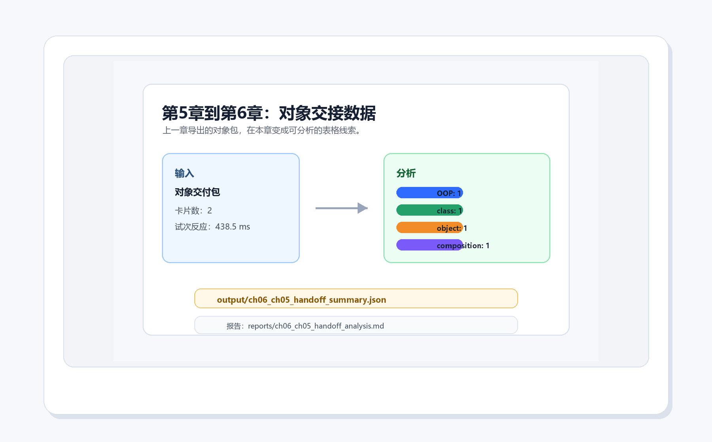
  <figcaption><strong>图6-12 第5章到第6章的对象交接</strong>：对象包里的卡片数量、标签计数和试次反应时，会被整理成第6章可以继续分析的数据摘要。</figcaption>
</figure>

这一步的意义很重要：教程不是每章重新开始，而是逐章累积项目。第5章负责把对象边界收清楚，第6章负责把对象交付的数据读出来、看结构、做判断。

### 6.12 从学习记录到复习安排

数据分析最终要回到行动。本章的行动不是“再画一张图”，而是安排下一轮复习。

<figure align="center">
  
  <figcaption><strong>图6-13 学习记录如何进入数据分析</strong>：学习时长、完成状态和反应时可以变成复习计划的证据，而不是只停留在记录表里。</figcaption>
</figure>

运行：

```bash
python code/ch06/09_make_memory_review_curve.py
```

<figure align="center">
  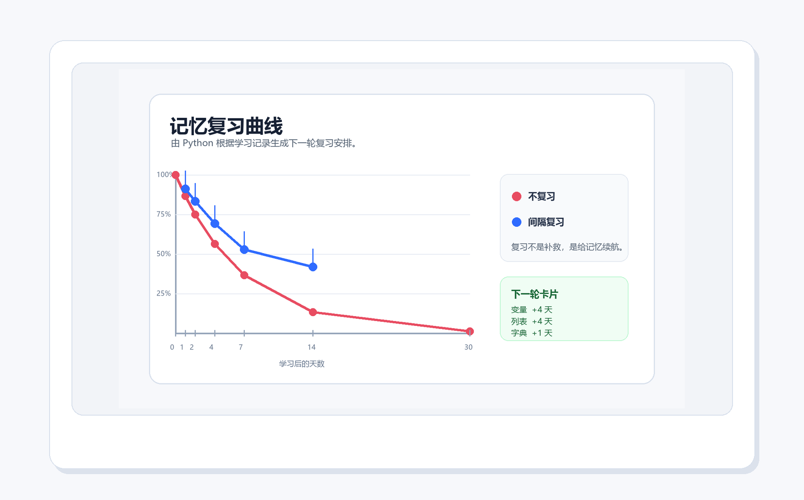
  <figcaption><strong>图6-14 记忆复习曲线</strong>：红线提醒“不复习会快速下降”，蓝线提醒“间隔复习能延缓遗忘”。图表最后要落到下一轮卡片安排。</figcaption>
</figure>

这里不需要把记忆曲线当作精确模型。它在本章里的作用是提醒你：学习记录不是为了自我打分，而是为了决定下一次该复习什么、什么时候复习、为什么复习。

---

## 第四部分：图表风格与项目交付

### 6.13 图表审美诊所：一张小图只回答一个问题

运行：

```bash
python code/ch06/10_make_chart_style_clinic.py
```

脚本会把同一份学习记录拆成四个面板：趋势、重点、完成率和反应时。拆开的好处是，读者不用在一张图里同时寻找四种答案。

<figure align="center">
  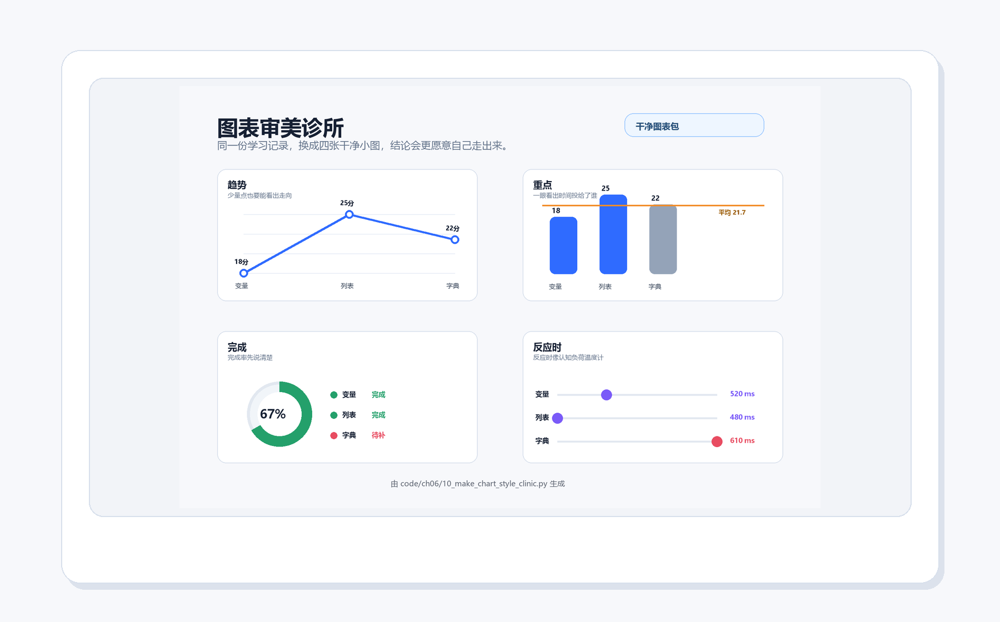
  <figcaption><strong>图6-15 图表审美诊所</strong>：趋势看走向，柱状图看投入，圆环看完成率，点线看反应时；每个面板只承担一个判断任务。</figcaption>
</figure>

当你自己改图时，可以用这四条规则：

1. 如果标题不能说出结论，就先别急着调颜色。
2. 如果颜色没有含义，就减少颜色数量。
3. 如果标签很少，直接标在数据旁边，比让读者查图例更轻松。
4. 如果图表需要解释三分钟才看懂，说明它可能承担了太多任务。

### 6.14 本章项目：学习卡片统计仪表盘

本章项目不是单张图片，而是一组可以复查的交付物：

| 类型 | 路径 | 用途 |
| --- | --- | --- |
| 输入数据 | `input/learning_records.csv` | 保存学习主题、时长、完成状态和反应时 |
| 图表输出 | `output/ch06_learning_dashboard.png` | 展示主题学习时长和摘要指标 |
| 分布检查 | `output/ch06_anscombe_quartet.png` | 提醒不能只看摘要统计 |
| 图表改造 | `output/ch06_chart_makeover.png` | 练习从嘈杂图改成可读图 |
| 异常值报告 | `reports/ch06_outlier_diagnosis.md` | 记录异常值解释 |
| 复习计划 | `output/ch06_memory_review_plan.json` | 把分析结果落到下一轮行动 |
| 运行证据 | `reports/ch06_analysis_runtime_evidence.md` | 汇总本章产物是否就绪 |

<figure align="center">
  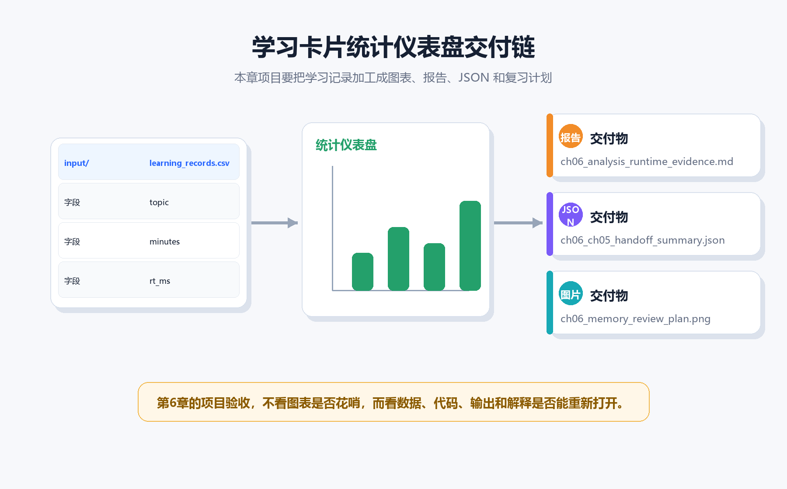
  <figcaption><strong>图6-16 项目交付链</strong>：本章验收不只看图表是否漂亮，还要看输入数据、代码、输出文件和解释能不能重新打开。</figcaption>
</figure>

---

## 第五部分：排错、练习与验收

### 6.15 常见坑：让图表和结论回到证据

<figure align="center">
  
  <figcaption><strong>图6-17 第6章常见坑地图</strong>：只看平均数、缺少来源、颜色太多、忽略异常值、图表不保存、结论离开语境，都会削弱分析可信度。</figcaption>
</figure>

遇到问题时，按这个顺序排查：

1. **路径**：你是否在第6章目录运行脚本？输入文件是否在 `input/`？
2. **字段名**：CSV 表头是否仍然是 `topic,minutes,done,rt_ms`？
3. **类型**：`minutes` 和 `rt_ms` 是否能转成整数？
4. **输出**：`output/` 和 `reports/` 是否生成了新文件？
5. **解释**：图表标题和图注是否说清楚它回答的问题？

不要一出错就重写整章代码。数据分析项目最怕“盲修”。先定位是哪一环断了，再修那一环。

### 6.16 运行证据与验收

最后运行：

```bash
python code/ch06/11_make_analysis_runtime_evidence.py
```

它会检查本章关键产物是否都已生成，并输出总览图。

<figure align="center">
  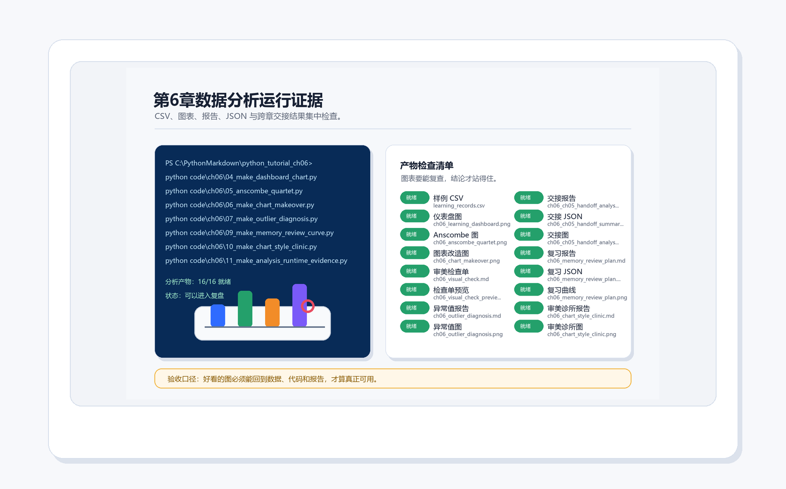
  <figcaption><strong>图6-18 第6章运行证据总览</strong>：CSV、仪表盘、Anscombe、图表改造、异常值诊断、复习计划、交接分析和审美诊所都要能重新生成。</figcaption>
</figure>

如果运行证据不是全部就绪，先不要急着提交。缺哪个文件，就回到对应脚本重新运行。验收不是形式，它是在帮你确认“正文里说的东西，代码真的做到了”。

### 6.17 上机路线

建议按下面顺序运行全章脚本：

```bash
python code/ch06/01_make_sample_csv.py
python code/ch06/02_basic_statistics.py
python code/ch06/03_optional_pandas_summary.py
python code/ch06/04_make_dashboard_chart.py
python code/ch06/05_anscombe_quartet.py
python code/ch06/06_make_chart_makeover.py
python code/ch06/07_make_outlier_diagnosis.py
python code/ch06/08_make_ch05_handoff_analysis.py
python code/ch06/09_make_memory_review_curve.py
python code/ch06/10_make_chart_style_clinic.py
python code/ch06/11_make_analysis_runtime_evidence.py
```

然后运行图片整理和链接检查：

```bash
python scripts/generate_ch06_visuals.py
python scripts/check_links.py
```

如果你改了 CSV，建议至少重跑 `04`、`07`、`09`、`10`、`11`，因为它们直接依赖学习记录。

### 6.18 练习任务

基础练习：

1. 在 `learning_records.csv` 里新增一行主题，例如 `文件,55,no,980`，重新运行 `04_make_dashboard_chart.py`。
2. 把某一行 `done` 从 `no` 改成 `yes`，观察仪表盘顶部“已完成”是否变化。
3. 修改 `minutes`，让某个主题明显偏高，再运行 `07_make_outlier_diagnosis.py`。

进阶练习：

1. 给 CSV 增加一列 `difficulty`，记录 `easy`、`medium` 或 `hard`，然后写一个新脚本统计不同难度的平均学习时长。
2. 在图表改造脚本里换一种主色，但保持颜色数量克制。
3. 把复习计划里的间隔规则改成你自己的策略，并在报告中说明理由。

项目练习：

把第5章生成的对象交付包和第6章学习记录放在一起，写一段短报告回答：哪些卡片主题最常出现，哪些主题需要更早复习，下一章的项目应该优先改哪一部分。

### 6.19 自测问题

1. 为什么不能只看平均学习时长就判断学习状态？
2. `topic`、`minutes`、`done`、`rt_ms` 分别适合回答什么问题？
3. Anscombe 四重奏想提醒你哪一个数据分析习惯？
4. 异常值出现时，为什么不能立刻删除？
5. 一张好图为什么通常只回答一个主要问题？
6. 第5章对象交付包为什么能成为第6章的数据来源？
7. 运行证据总览在项目验收中有什么作用？

### 6.20 复盘模板

完成本章后，用下面模板写一次复盘：

```markdown
## 第6章复盘

- 我生成的输入数据是：
- 我最先检查的摘要指标是：
- 我画出的第一张图说明：
- 我发现的异常值或可疑记录是：
- 我如何解释这个可疑记录：
- 我给下一轮学习安排的动作是：
- 我最容易踩的图表坑是：
- 我已经生成并检查的运行证据是：
```

复盘不需要长，但要具体。只写“我学会了数据分析”太空；写“我发现文件读写这行耗时偏高，所以安排明天先复习路径和编码”才是能改变下一次学习的分析。

### 6.21 本章总结

第6章把“会写代码”推进到“能用代码看证据”。你已经完成了从 CSV 到统计摘要、从摘要到图表、从图表到异常值诊断、从学习记录到复习计划的完整闭环。

请记住本章最重要的判断标准：

1. 数据要能追到来源。
2. 摘要要说明自己压缩了什么。
3. 图表要回答一个清楚问题。
4. 异常值要先检查，再解释。
5. 结论要落到下一步行动。
6. 代码、输出和报告都要能重新打开。

下一章继续扩展项目时，不要把本章当作“画图章节”。它真正训练的是一种工作习惯：让每个判断都有证据，让每个证据都能复查，让每次复查都能推动下一步行动。
