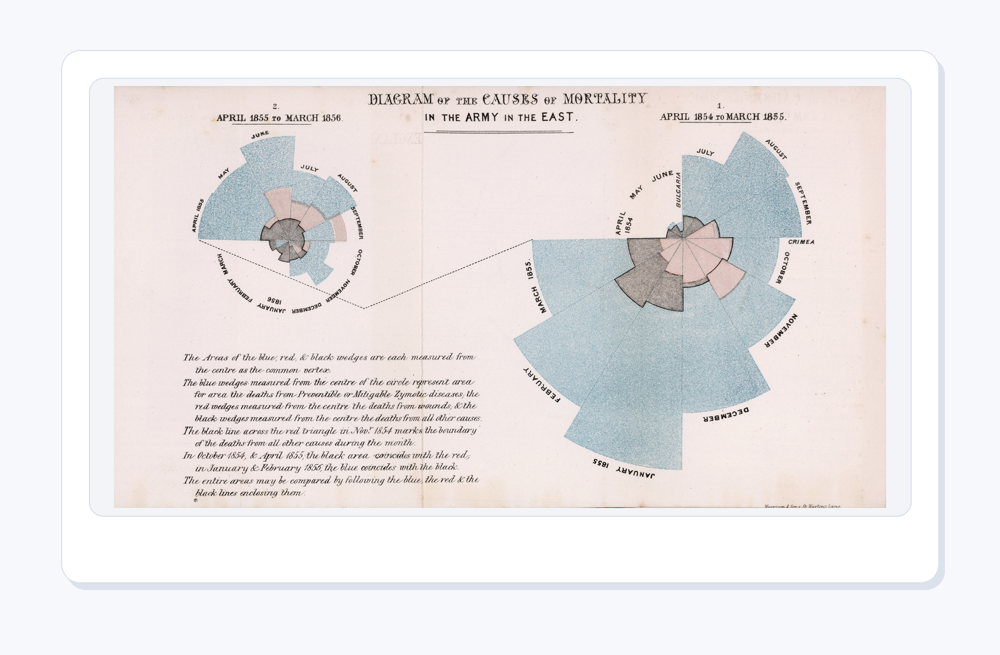
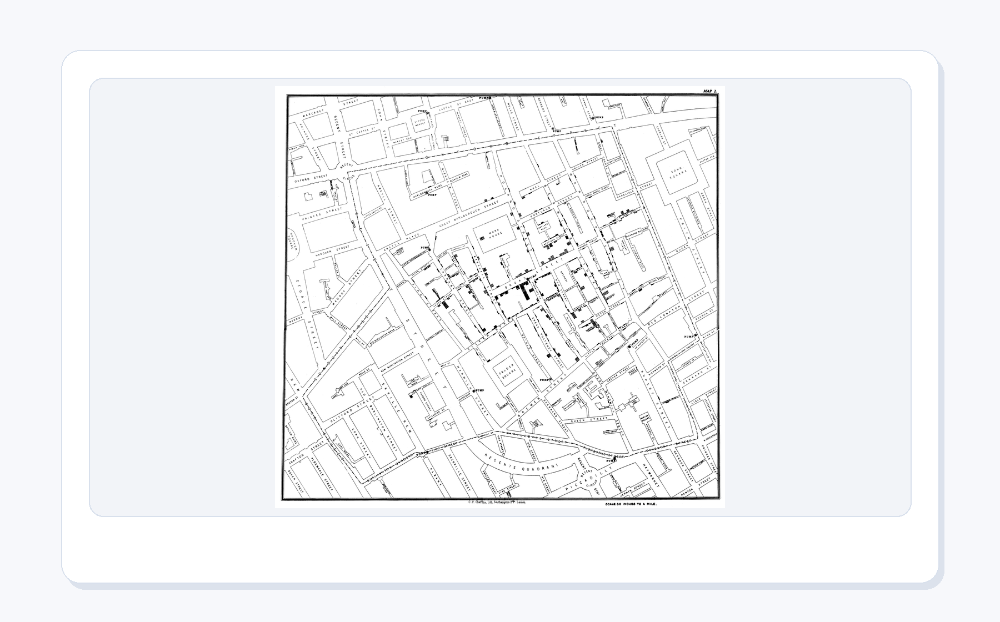
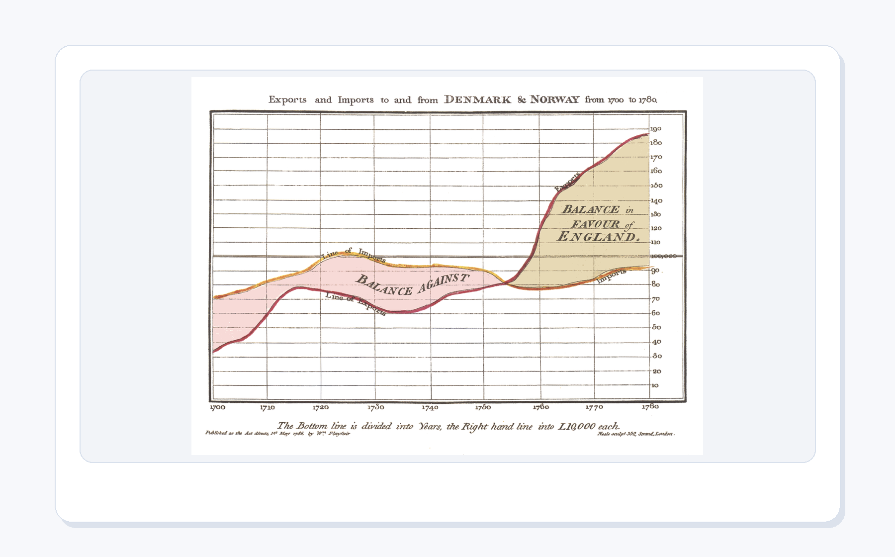
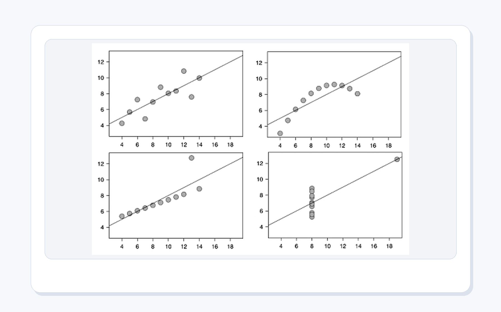
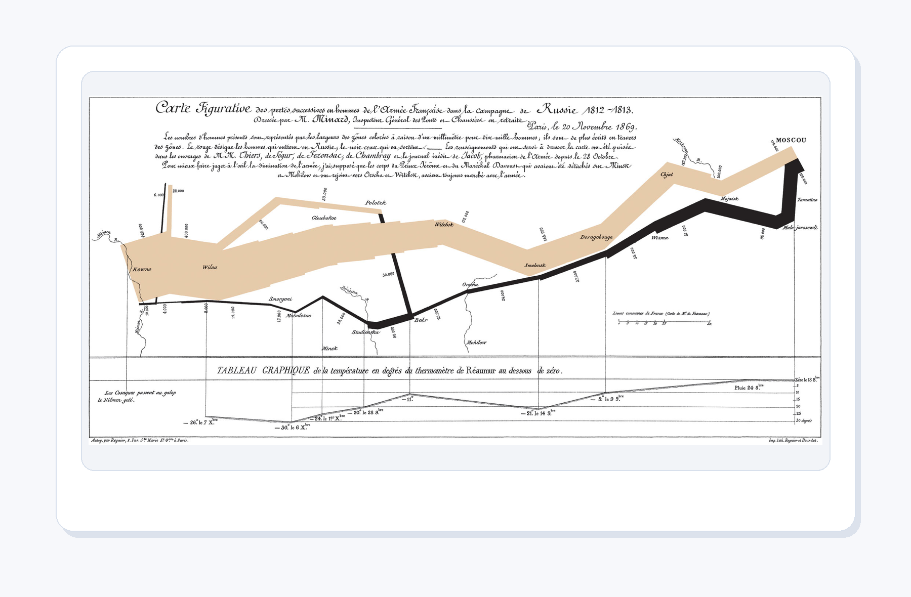
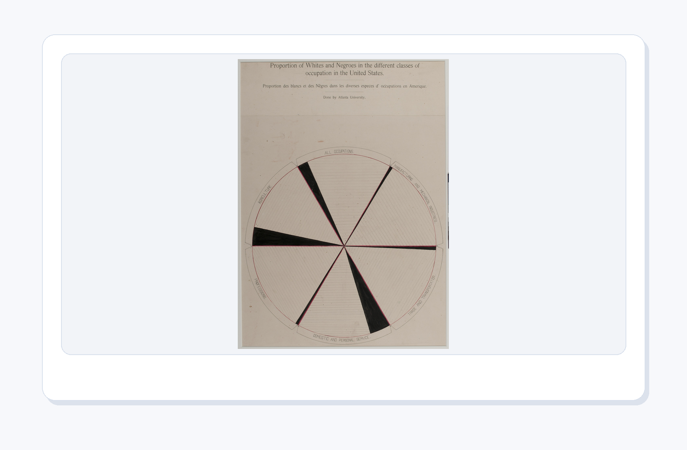

# 第 6 章：数据分析与可视化

[TOC]

<figure align="center">
  
  <figcaption><strong>图6-1 第6章封面</strong>：本章把学习记录变成表格、摘要、图表和下一步行动。图表不是装饰，它要能回答问题。</figcaption>
</figure>

> 本章一句话：
> **数据分析不是把数字画漂亮，而是用一条可复查的链路回答问题：数据从哪里来，算出了什么，图表说明什么，下一步该做什么。**

前面几章里，我们已经能写函数、处理文件、构建 GUI，并在第5章把学习卡片、试次记录和交付包整理成对象。第6章开始，项目进入“看证据”的阶段：同样是一组学习记录，放在 CSV 里只是原材料；经过统计、可视化和复盘，它才会变成能指导下一次学习的判断。

这一章不会把数据分析讲成一堆遥远术语。我们只抓住一条主线：**先提出一个足够具体的问题，再用 Python 留下可复查的输出。** 你会生成 `learning_records.csv`，计算平均时长和完成率，画出学习仪表盘，比较 Anscombe 四重奏，诊断异常值，把第5章的对象交付包读进来，最后生成一份运行证据总览。

---

## 本章导读：先问问题，再画图

### 6.0 本章学习目标

学完本章，你应该能够做到：

1. 说清楚数据分析的最小链路：数据、摘要、图表、解释、行动。
2. 运行 `01_make_sample_csv.py`，生成一份可复查的学习记录 CSV。
3. 运行 `02_basic_statistics.py` 和 `03_optional_pandas_summary.py`，理解平均值、分组统计和完成率各回答什么问题。
4. 运行 `04_make_dashboard_chart.py`，把学习记录画成一张清楚的统计仪表盘。
5. 用 Anscombe 四重奏解释“统计摘要相似，不代表数据形状相同”。
6. 用图表改造检查单判断一张图是否标题清楚、颜色克制、标注有效。
7. 用异常值诊断图判断哪些记录需要回看，而不是草率删除。
8. 把第5章导出的对象交付包变成第6章的分析输入，并生成最终运行证据。

### 本章分区导航

| 分区 | 对应小节 | 你要抓住的主线 | 产出证据 |
| --- | --- | --- | --- |
| 第一部分：从 CSV 到第一张图 | 6.1-6.5 | 先把数据来源和最小分析链跑通 | CSV、统计输出、最小链路图 |
| 第二部分：摘要、分布与图表判断 | 6.6-6.9 | 平均数只能回答一部分问题，图形结构要单独检查 | 仪表盘、Anscombe、图表改造 |
| 第三部分：异常值、跨章数据与复习计划 | 6.10 | 数据里的“奇怪点”要回到学习语境解释 | 异常值诊断、ch05 交接、复习曲线 |
| 第四部分：图表风格与项目交付 | 6.11 | 好图只回答一个清楚问题，项目要留下可复查文件 | 审美诊所、项目交付链 |
| 第五部分：排错、练习与验收 | 6.12-6.16 | 用固定清单排查图表和脚本，最后整理证据 | 常见坑地图、运行证据、复盘模板 |

<figure align="center">
  
  <figcaption><strong>图6-2 本章学习路线</strong>：从生成 CSV 到画仪表盘，再到异常值、复习计划和运行证据，本章每一步都能落到文件。</figcaption>
</figure>

---

## 第一部分：从 CSV 到第一张图

### 6.1 数据分析先从问题开始

如果你一打开数据就急着画图，最容易得到一张“看起来很忙、实际上没回答问题”的图。第6章的第一条规则很朴素：**先问问题，再决定统计什么、画什么。**

对学习卡片项目来说，问题可以很具体：

1. 最近学习了哪些主题？
2. 每个主题花了多长时间？
3. 哪些主题已经完成，哪些还需要补？
4. 反应时偏高的主题，是不是值得提前复习？

这些问题不需要宏大的数据集。三行学习记录就足够练习完整流程，因为重点不是数据量，而是让“输入、处理、输出、解释”形成闭环。

<figure align="center">
  
  <figcaption><strong>图6-3 从记录表到可解释图表</strong>：输入数据、统计摘要和图表行动要连成一条证据链。缺少任意一环，结论都会变轻。</figcaption>
</figure>

数据可视化最动人的地方，是它经常把“看不见的问题”变成公共讨论里的证据。Florence Nightingale 把克里米亚战争中的死亡原因画出来，不是为了漂亮，而是为了让卫生条件造成的死亡无法继续躲在表格里。John Snow 把霍乱死亡地点放到地图上，也是在用空间位置逼近问题中心。第6章虽然只处理学习记录，但背后的精神一样：图表要让证据站出来。

<figure align="center">
  
  <figcaption><strong>图6-S1 Nightingale 的死亡原因图</strong>：可视化可以推动公共卫生决策，因为它把“数字很多”改成了“问题清楚”。</figcaption>
</figure>

<figure align="center">
  
  <figcaption><strong>图6-S2 John Snow 的霍乱地图</strong>：当数据有地点、时间和语境时，图表能帮助我们发现表格里不容易看见的模式。</figcaption>
</figure>

### 6.2 本章数据源：`learning_records.csv`

先进入第6章目录，运行第一个脚本：

```bash
python code/ch06/01_make_sample_csv.py
```

它会生成 `input/learning_records.csv`。这份 CSV 很小，但字段设计已经足够表达一个学习记录：

| 字段 | 含义 | 本章会怎么用 |
| --- | --- | --- |
| `topic` | 学习主题 | 作为图表的标签和分组依据 |
| `minutes` | 学习时长 | 计算平均值、画柱状图、发现异常 |
| `done` | 是否完成 | 计算完成率，区分已完成和待补主题 |
| `rt_ms` | 反应时 | 粗略提示理解负担，辅助安排复习 |

注意这里的 `rt_ms` 不是心理学实验中的严格测量，它只是本章项目里的学习反馈线索。初学阶段先把语义说清楚，比急着套复杂模型重要。

### 6.3 最小分析链：CSV → 摘要 → 图表

本章最小代码链路只有三步：

1. 用 `csv.DictReader` 读取每一行记录。
2. 把 `minutes`、`done`、`rt_ms` 转成可以统计的值。
3. 生成摘要或图表文件，让结果可以重新打开。

<figure align="center">
  
  <figcaption><strong>图6-4 最小分析链</strong>：先读 CSV，再算摘要，最后画图。链路越短，越容易发现路径、字段名和类型转换的问题。</figcaption>
</figure>

最小链路里有一个容易被忽略的习惯：**每一步都要能单独检查。** 如果 CSV 没生成，后面的统计和图表都不可靠；如果摘要解释不清，图表再漂亮也只是装饰；如果图表没有保存成文件，就没法复盘和提交。

### 6.4 先跑脚本，拿到第一批证据

生成 CSV 之后，继续运行前三个分析脚本：

```bash
python code/ch06/02_basic_statistics.py
python code/ch06/03_optional_pandas_summary.py
python code/ch06/04_make_dashboard_chart.py
```

你应该看到记录数、平均学习时长、平均反应时和完成率。`03_optional_pandas_summary.py` 会尝试使用 pandas；如果你的环境里没有 pandas，请你运用所学安装这个库。

<figure align="center">
  
  <figcaption><strong>图6-5 第6章脚本运行证据</strong>：脚本不是只在正文里展示概念，而是真的生成 CSV、统计输出、图表、报告和运行证据。</figcaption>
</figure>

这张运行图的价值不在于“终端很酷”，而在于它证明项目不是静态截图。你可以改 CSV，重新运行脚本，再比较输出是否改变。这就是数据分析项目的基本可信度。

### 6.5 最小心智模型：不要让图表越过解释

数据分析很容易被讲成工具清单：pandas、NumPy、Matplotlib、Seaborn、Excel、Jupyter。工具当然重要，但初学阶段更该先记住下面这条链：

<figure align="center">
  
  <figcaption><strong>图6-6 数据分析最小心智模型</strong>：数据、摘要、图表、语境、判断和行动要按顺序互相支撑。图表不能替你自动下结论。</figcaption>
</figure>

这条链能帮你判断自己有没有跳步：

| 环节 | 你要问的问题 | 常见跳步 |
| --- | --- | --- |
| 数据 | 它从哪里来，字段是什么意思？ | 直接拿不明来源的数据作结论 |
| 摘要 | 它压缩了哪些信息，又丢掉了哪些信息？ | 只看平均数 |
| 图表 | 它让哪个比较更容易看见？ | 一张图塞太多问题 |
| 语境 | 这个数在项目里意味着什么？ | 离开学习记录讲统计术语 |
| 判断 | 证据支持什么，不支持什么？ | 把猜测写成结论 |
| 行动 | 下一次学习要怎么改？ | 图画完就结束 |

---

## 第二部分：摘要、分布与图表判断

### 6.6 统计摘要回答“有多少”和“平均多少”

`02_basic_statistics.py` 的输出很短，通常像这样：

```text
记录数： 3
平均学习时长： 21.67
平均反应时： 536.67
完成率： 67%
```

这几个数适合回答“总体情况如何”。但是它们不能告诉你每个主题的形状，也不能告诉你是否有异常记录。统计摘要像把一页笔记压缩成几行目录，目录有用，但目录不是全文。

学习数据里最常见的三个摘要是：

| 摘要 | 能回答 | 不能回答 |
| --- | --- | --- |
| 记录数 | 一共有多少条观察 | 每条观察是否可靠 |
| 平均学习时长 | 大致投入水平 | 是否有某一天特别高或特别低 |
| 完成率 | 进度是否接近预期 | 未完成的主题为什么卡住 |

William Playfair 早期把价格、工资和时间画成曲线时，做的也是类似转换：把一格一格读的表格，变成能一眼看出变化的轨迹。你在学习仪表盘里画柱状图、折线图时，也是在做这个动作：让时间、差异和转折露出来。

<figure align="center">
  
  <figcaption><strong>图6-S3 Playfair 的时间序列图</strong>：折线图真正表达的不是“把点连起来”，而是让变化从表格里走出来。</figcaption>
</figure>

### 6.7 仪表盘：让一个比较变清楚

运行：

```bash
python code/ch06/04_make_dashboard_chart.py
```

脚本会读取 CSV，生成 `output/ch06_learning_dashboard.png`，并同步一份网页用图到 `assets/ch06/web/ch06_learning_dashboard_output.png`。正式教材图会把这张输出图放进统一版式里。

<figure align="center">
  
  <figcaption><strong>图6-7 Python 生成的学习仪表盘</strong>：记录数、完成数、平均时长和平均反应时放在顶部，下面只比较各主题学习时长。</figcaption>
</figure>

这张图故意很克制：没有复杂背景，没有太多颜色，也没有把所有指标塞进同一个坐标系。它只想回答一个问题：**哪几个主题占用了更多学习时间？**

下面我们逐段拆解生成这张图的代码，看看每部分做了什么。

---

#### 6.7.1 导入模块与路径设置

```python
import csv
import shutil
from pathlib import Path
from statistics import mean

from PIL import Image, ImageDraw, ImageFont
```

- `csv`：Python 内置的 CSV 读写模块。这里用 `csv.DictReader` 把 CSV 的每一行读成一个字典，字段名就是 CSV 第一行的列名。
- `shutil`：用于复制文件。脚本生成图片后，会复制一份到 `assets/ch06/web/` 目录下供网页使用。
- `Path` 和 `statistics.mean`：前者提供跨平台的路径操作，后者计算平均值。
- `PIL (Pillow)`：Python 最常用的图像处理库。`Image` 负责创建和保存图片，`ImageDraw` 在图片上绘制形状和文字，`ImageFont` 加载字体文件。

接下来是项目根目录的自动定位：

```python
def project_root() -> Path:
    cwd = Path.cwd()
    if (cwd / "assets" / "ch06").exists():
        return cwd
    return Path(__file__).resolve().parents[2]

ROOT = project_root()
INPUT = ROOT / "input" / "learning_records.csv"
OUTPUT = ROOT / "output" / "ch06_learning_dashboard.png"
WEB_COPY = ROOT / "assets" / "ch06" / "web" / "ch06_learning_dashboard_output.png"
```

`project_root()` 先用当前工作目录检查是否包含 `assets/ch06` 子目录——如果用户直接在项目根目录运行脚本，就返回当前目录；否则从脚本文件所在位置向上找两级。这种写法让脚本既可以从项目根目录运行，也可以从 `code/ch06/` 子目录运行，不需要用户手动配置路径。

`INPUT`、`OUTPUT`、`WEB_COPY` 分别指向 CSV 数据文件、最终输出图片和网页同步副本。用 `Path` 拼接路径可以避免手写字符串拼接时的斜杠问题。

---

#### 6.7.2 读取 CSV 数据

```python
def load_rows(path: Path):
    with path.open(encoding="utf-8") as f:
        return list(csv.DictReader(f))
```

这是读取 CSV 最简洁的写法之一。`csv.DictReader(f)` 把文件的每一行解析为一个字典，字典的键是 CSV 第一行的列名（`topic`、`minutes`、`done`、`rt_ms`）。外面套一层 `list()` 把迭代器转为列表，便于后续多次遍历。`encoding="utf-8"` 确保中文列名和内容不会出现乱码。

---

#### 6.7.3 字体加载

```python
def font(size: int, bold: bool = False):
    candidates = [
        "C:/Windows/Fonts/msyhbd.ttc" if bold else "C:/Windows/Fonts/msyh.ttc",
        "C:/Windows/Fonts/simhei.ttf",
        "C:/Windows/Fonts/segoeuib.ttf" if bold else "C:/Windows/Fonts/segoeui.ttf",
        "C:/Windows/Fonts/arialbd.ttf" if bold else "C:/Windows/Fonts/arial.ttf",
    ]
    for candidate in candidates:
        if Path(candidate).exists():
            return ImageFont.truetype(candidate, size)
    return ImageFont.load_default()
```

`font()` 函数接收字号和是否加粗两个参数，按优先级依次检查系统中是否存在这些字体文件。优先使用微软雅黑（`msyh.ttc` / `msyhbd.ttc`），因为它对中文支持好；如果系统是 Linux 或 macOS，则依次尝试黑体、Segoe UI 和 Arial。如果所有字体都不存在，就回退到 Pillow 的默认字体。这种"逐个尝试、失败回退"的模式在跨平台脚本中很常见——你不需要在所有机器上安装同一款字体，脚本也能正常工作。

**在实际项目中，如果你需要中文显示，请安装中文字体（如微软雅黑或思源黑体），否则 Pillow 默认字体无法渲染中文。**

---

#### 6.7.4 绘制条形图的辅助函数

```python
def draw_bar(draw: ImageDraw.ImageDraw, x: int, y: int,
             width: int, label: str, value: int, color: str):
    draw.text((x, y - 34), label, fill="#243047", font=font(24, bold=True))
    draw.rounded_rectangle((x, y, x + 680, y + 34), radius=17, fill="#E9EEF6")
    draw.rounded_rectangle((x, y, x + width, y + 34), radius=17, fill=color)
    draw.text((x + 704, y - 2), f"{value} 分钟", fill="#243047", font=font(24))
```

这个函数只做一件事：在指定位置画一条水平条形图。我们来逐行拆解：

- **第1行**：在条形上方画主题名称（`label`）。`(x, y - 34)` 把文字放在条形正上方，`fill="#243047"` 是深灰色的文字颜色。
- **第2行**：画一个浅灰色（`#E9EEF6`）的圆角矩形作为"背景条"——长度固定为 680 像素，表示最大值范围。
- **第3行**：在背景条之上再画一个彩色圆角矩形，宽度 `width` 与学习时长成正比。`radius=17` 让矩形的四个角变圆，避免尖角带来的生硬感。
- **第4行**：在条形右侧标注具体数值，格式为 `"XX 分钟"`，让读者不需要回头估算坐标轴。

`rounded_rectangle` 是 Pillow 提供的一个很方便的方法：前两个坐标是左上角，后两个坐标是右下角。所有坐标都是像素值，因此写代码时需要手动算好每个元素的位置。

---

#### 6.7.5 主流程：数据准备

```python
def main():
    rows = load_rows(INPUT)
    minutes = [int(row["minutes"]) for row in rows]
    reaction = [int(row["rt_ms"]) for row in rows]
    done_count = sum(row["done"] == "yes" for row in rows)
```

`main()` 是脚本的入口。第一步从 CSV 加载所有记录；然后使用**列表推导式**提取出 `minutes` 和 `rt_ms` 两列，用 `int()` 把字符串转为整数（CSV 读取后所有值都是字符串）；最后用 `sum()` 配合条件表达式统计 `done == "yes"` 的记录数——这是 Python 中统计满足条件的元素个数的常用技巧。

---

#### 6.7.6 主流程：创建画布与标题

```python
    OUTPUT.parent.mkdir(exist_ok=True)
    im = Image.new("RGB", (1400, 880), "#F7F8FB")
    draw = ImageDraw.Draw(im)
```

`Image.new("RGB", (1400, 880), "#F7F8FB")` 创建一张 1400×880 像素的浅灰色画布。第一个参数 `"RGB"` 表示颜色模式，第二个是画布尺寸（宽×高），第三个是背景色。`ImageDraw.Draw(im)` 把画布"包装"成可绘制对象，后续所有 `draw.text()`、`draw.rounded_rectangle()` 等操作都在这个对象上进行。

```python
    draw.rounded_rectangle((70, 60, 1330, 820), radius=34,
                           fill="#FFFFFF", outline="#D8E0EC", width=2)
    draw.text((120, 110), "学习卡片统计仪表盘",
              fill="#162033", font=font(44, bold=True))
    draw.text((122, 166),
              "由 Python 读取 CSV 后自动生成，数据和图表可以重新检查。",
              fill="#526071", font=font(24))
```

先画一个白色的圆角矩形作为"卡片"背景，四周留出 70 像素的边距。然后在卡片内写入标题和副标题。注意坐标的层次关系：标题（y=110）在卡片（y=60）内部，副标题（y=166）在标题下方约 56 像素处。所有坐标都是写代码时手动计算好的。

---

#### 6.7.7 主流程：顶部摘要卡片

```python
    cards = [
        ("记录数", len(rows), "#2F6BFF"),
        ("已完成", done_count, "#24A06B"),
        ("平均时长", round(mean(minutes), 1), "#F28C28"),
        ("平均反应", round(mean(reaction)), "#7A5AF8"),
    ]
    for i, (label, value, color) in enumerate(cards):
        x = 120 + i * 300
        draw.rounded_rectangle((x, 235, x + 250, 365), radius=24,
                               fill="#F1F5F9")
        draw.ellipse((x + 24, 264, x + 72, 312), fill=color)
        draw.text((x + 92, 258), label, fill="#526071", font=font(23, bold=True))
        draw.text((x + 92, 298), str(value), fill="#162033", font=font(34, bold=True))
```

这段代码在仪表盘顶部绘制四个统计卡片，每个卡片包含一个彩色圆形图标、一个标签和一个数值。

- `cards` 列表定义了四个统计项，每个元组包含（标签、数值、颜色）。
- `enumerate(cards)` 同时拿到索引 `i` 和卡片内容。`x = 120 + i * 300` 让四个卡片水平均匀排列（每个间距 300 像素）。
- `draw.rounded_rectangle` 绘制卡片的浅灰色背景框。
- `draw.ellipse` 绘制圆形图标——`(x+24, y+24, x+72, y+72)` 定义了一个 48×48 像素的圆形，填充色与统计项主题色一致。
- 两个 `draw.text` 分别写入标签（小字）和数值（大字）。

**为什么用 `ellipse` 画圆形？** Pillow 没有专门的 `circle()` 方法，画圆的通用做法是把椭圆的外接矩形设为正方形。`(x+24, 264, x+72, 312)` 的宽高都是 48 像素，因此绘制出来就是一个正圆。

---

#### 6.7.8 主流程：主题时长条形图

```python
    max_minutes = max(minutes)
    colors = ["#2F6BFF", "#24A06B", "#F28C28"]
    for i, row in enumerate(rows):
        value = int(row["minutes"])
        width = int(680 * value / max_minutes)
        draw_bar(draw, 150, 465 + i * 105,
                 width, row["topic"], value, colors[i % len(colors)])
```

这部分是仪表盘的核心——用条形图比较各主题的学习时长。

- `max_minutes` 找出最长学习时长，用于计算条形宽度的比例。
- `colors` 定义了三种颜色循环使用。`colors[i % len(colors)]` 通过取模运算让颜色循环——第1条蓝、第2条绿、第3条橙、第4条又回到蓝。
- 每一条的 `width = int(680 * value / max_minutes)` 把学习时长映射到 0~680 像素的范围。`680` 对应背景条的总宽度，因此最长的那一条刚好填满背景条。
- `draw_bar` 调用前面定义的辅助函数，在 y=465 开始的垂直位置上每隔 105 像素画一条。105 像素的间距包含了条形本身的高度（34 像素）和上下留白，确保文字和条形不会重叠。

---

#### 6.7.9 主流程：底部提示与保存

```python
    draw.text((150, 760), "读图提示：每张图最好只帮助读者完成一个关键比较。",
              fill="#526071", font=font(24))
    im.save(OUTPUT, optimize=True)
    WEB_COPY.parent.mkdir(parents=True, exist_ok=True)
    shutil.copyfile(OUTPUT, WEB_COPY)
    print("已生成", OUTPUT.relative_to(ROOT))
    print("已同步", WEB_COPY.relative_to(ROOT))
```

- 在底部写入一句读图提示，继续强调"一张图只回答一个问题"的设计理念。
- `im.save(OUTPUT, optimize=True)` 保存图片到 `output/` 目录，`optimize=True` 让 Pillow 自动压缩文件大小。
- `shutil.copyfile` 把生成好的图片复制到 `assets/ch06/web/`，供网页版使用。`mkdir(parents=True, exist_ok=True)` 确保目标目录存在，否则先创建它。
- 最后在终端打印两条确认消息，用 `relative_to(ROOT)` 显示相对于项目根目录的路径，让输出更易读。

```python
if __name__ == "__main__":
    main()
```

这是 Python 脚本的**入口惯用写法**。`__name__` 在直接运行脚本时为 `"__main__"`，在被其他模块导入时则为模块名。这行代码确保 `main()` 只在直接运行时执行，不会在导入时意外触发。

---

#### 6.7.10 学习要点

回顾整个脚本，有四个值得记住的编程思路：

1. **用 Pillow 绘制图表是"像素级"操作**：每个文字、每个矩形、每个圆的位置都需要手动计算坐标。这和 Excel 或 Matplotlib 的"声明式"画图完全不同——Pillow 给你最大的自由度，也要求你最多的手算。
2. **主色不超过三种**：蓝（`#2F6BFF`）、绿（`#24A06B`）、橙（`#F28C28`）分别用于不同主题，不会出现五颜六色的视觉噪音。
3. **数值直接写在图形上**：条形右侧直接标注"XX 分钟"，读者不用回头找坐标轴。这是让图表"好读"的小技巧。
4. **输出可复查**：图片保存到 `output/`，同时在终端打印确认信息。数据分析的输出如果只停留在屏幕上，就失去了"可复查"的价值。

这张图只想回答一个问题：**哪几个主题占用了更多学习时间？** 回答这个问题不需要散点图、堆叠图或复杂的坐标系——几条彩色条形就够了。学习画图的第一课不是"画得更复杂"，而是"忍住不画多余的东西"。

### 6.8 只看平均数会被骗：Anscombe 四重奏

1973 年，英国统计学家 Francis Anscombe 在《美国统计学家》上发表了一篇只有四张散点图和一张表格的短论文。这篇论文的主题很简单：**统计摘要相同，不等于数据相同。** 他构造了四组人工数据，每组包含 11 个 (x, y) 坐标点，这就是后来被称为 **Anscombe 四重奏** 的经典案例。

这四组数据的统计特性惊人地一致：

| 统计量 | 各组数值 |
| --- | --- |
| x 的平均值 | 9.0 |
| y 的平均值 | 7.5 |
| x 的方差 | 11.0 |
| y 的方差 | 4.12 |
| x 与 y 的相关系数 | 0.816 |
| 线性回归方程 | y = 3.0 + 0.5x |

只看这些数字，你会以为四组数据几乎一模一样。但如果你把四组数据分别画成散点图，就会看到四种完全不同的形状：

- **第一组**：标准的线性关系，点大致分布在回归直线两侧。
- **第二组**：呈明显的曲线（二次）关系，用直线拟合完全不合适。
- **第三组**：大部分点分布在一条直线上，但有一个偏离很远的异常点把回归线拉偏了。
- **第四组**：除一个点外，所有点的 x 值都相同（x = 8），全靠一个极端点撑起看似合理的回归结果。

Anscombe 构造这个例子的用意很明确：**先算再画是不够的，必须画了才算。** 统计数字会压缩信息，而图形能展现被压缩掉的细节。从此，"先画图"成了数据分析入门的第一课。

运行：

```bash
python code/ch06/05_anscombe_quartet.py
```

<figure align="center">
  
  <figcaption><strong>图6-8 Python 生成的 Anscombe 四重奏</strong>：摘要统计相似，不代表数据形状相同。先看摘要，再看图形，结论才不容易漂。</figcaption>
</figure>

Anscombe 四重奏像一个很温柔但很锋利的提醒：统计摘要会压缩信息，压缩就会丢东西。它不是反对统计，而是在提醒我们给统计配上图形检查。只看平均数，就像只看一本书的目录；目录有用，但不能替你读完整故事。

<figure align="center">
  
  <figcaption><strong>图6-S4 Anscombe 四重奏</strong>：相似的均值和相关关系，可能藏着完全不同的数据形状；这就是“先算再看”的理由。</figcaption>
</figure>

把这个例子放回学习记录里，你会得到一个很实用的提醒：两个人平均每天都学 30 分钟，不代表他们学习节奏一样。一个人可能每天稳定 30 分钟，另一个人可能前六天几乎没学，最后一天补了 180 分钟。平均数相同，学习策略完全不同。

### 6.9 图表改造：从能画到能读

能画出图，只是第一步。真正能用的图至少要做到三件事：

1. 标题告诉读者要看什么，而不是只写变量名。
2. 颜色有含义，不能只是为了热闹。
3. 标注和网格服务于比较，不能抢走注意力。

<figure align="center">
  
  <figcaption><strong>图6-9 图表改造前后对比</strong>：左图展示新手常见的颜色和标签噪音，右图保留主色、直接标注和平均线，阅读压力更低。</figcaption>
</figure>

<figure align="center">
  
  <figcaption><strong>图6-10 图表审美检查单</strong>：每张图交出去前，至少检查标题、颜色、标注、网格和输出文件这五件事。</figcaption>
</figure>

Minard 的拿破仑远征俄国图和 W.E.B. Du Bois 的数据肖像，适合放在这里提醒我们：图表审美不是装饰，它和表达立场、降低混乱、组织变量有关。一张好图可能同时有路线、人数、温度、时间，也可能用大胆构图展示社会处境；关键不是复杂，而是让读者知道该沿着哪条线索读。

<figure align="center">
  
  <figcaption><strong>图6-S5 Minard 的远征图</strong>：复杂变量可以共处一张图，但前提是结构清楚，读者能沿着故事线走。</figcaption>
</figure>

<figure align="center">
  
  <figcaption><strong>图6-S6 Du Bois 的数据肖像</strong>：数据图表也有人文立场；颜色、构图和标题都在服务“把什么问题说清楚”。</figcaption>
</figure>

图表审美不是“好不好看”这么简单。对学习项目来说，审美的底层目标是减少误读：让读者更快看见你想比较的东西，也更容易追问数据从哪里来。

---

## 第三部分：异常值

### 6.10 异常值不是错误，也不是结论

异常值很容易引起两种误判：一种是立刻删掉，另一种是立刻写成故事。更稳的做法是先标出来，再回到原始记录确认。

下面是一个异常值的例子：

<figure align="center">
  
  <figcaption><strong>图6-11 异常值诊断卡</strong>：箱线图把中位数、四分位距和可疑值放在同一条轴上，提醒你先检查记录，再解释原因。</figcaption>
</figure>

对学习记录来说，异常值可能有三种含义：

| 情况 | 例子 | 下一步 |
| --- | --- | --- |
| 记录错误 | 把 25 分钟误写成 250 分钟 | 修正 CSV，并说明修正原因 |
| 真实困难 | 文件读写那天学了 95 分钟 | 回看当天任务，拆小复习计划 |
| 特殊安排 | 周末集中补课 | 不一定删除，但要在解释里说明 |

异常值的处理要留痕。你可以在你的文档里写下判断：它是错误、困难，还是特殊安排。

---

## 第四部分：图表风格

### 6.11 图表审美诊所：一张小图只回答一个问题

这张图片把同一份学习记录拆成四个面板：趋势、重点、完成率和反应时。拆开的好处是，读者不用在一张图里同时寻找四种答案。

<figure align="center">
  
  <figcaption><strong>图6-12 图表审美诊所</strong>：趋势看走向，柱状图看投入，圆环看完成率，点线看反应时；每个面板只承担一个判断任务。</figcaption>
</figure>

当你自己改图时，可以用这四条规则：

1. 如果标题不能说出结论，就先别急着调颜色。
2. 如果颜色没有含义，就减少颜色数量。
3. 如果标签很少，直接标在数据旁边，比让读者查图例更轻松。
4. 如果图表需要解释三分钟才看懂，说明它可能承担了太多任务。

## 第五部分：排错、练习与验收

### 6.12 常见坑：让图表和结论回到证据

<figure align="center">
  
  <figcaption><strong>图6-13 第6章常见坑地图</strong>：只看平均数、缺少来源、颜色太多、忽略异常值、图表不保存、结论离开语境，都会削弱分析可信度。</figcaption>
</figure>

遇到问题时，按这个顺序排查：

1. **路径**：你是否在第6章目录运行脚本？输入文件是否在 `input/`？
2. **字段名**：CSV 表头是否仍然是 `topic,minutes,done,rt_ms`？
3. **类型**：`minutes` 和 `rt_ms` 是否能转成整数？
4. **输出**：`output/` 和 `reports/` 是否生成了新文件？
5. **解释**：图表标题和图注是否说清楚它回答的问题？

不要一出错就重写整章代码。数据分析项目最怕“盲修”。先定位是哪一环断了，再修那一环。

### 6.13 练习任务

基础练习：

1. 在 `learning_records.csv` 里新增一行主题，例如 `文件,55,no,980`，重新运行 `04_make_dashboard_chart.py`。
2. 把某一行 `done` 从 `no` 改成 `yes`，观察仪表盘顶部“已完成”是否变化。
3. 修改 `minutes`，让某个主题明显偏高，再运行 `07_make_outlier_diagnosis.py`。

进阶练习：

1. 给 CSV 增加一列 `difficulty`，记录 `easy`、`medium` 或 `hard`，然后写一个新脚本统计不同难度的平均学习时长。
2. 修改 `04_make_dashboard_chart.py`，根据 `difficulty` 划分不同面板。
3. 根据所学优化 `04_make_dashboard_chart.py`，使图表更加美观和实用。

### 6.14 自测问题

1. 为什么不能只看平均学习时长就判断学习状态？
2. `topic`、`minutes`、`done`、`rt_ms` 分别适合回答什么问题？
3. Anscombe 四重奏想提醒你哪一个数据分析习惯？
4. 异常值出现时，为什么不能立刻删除？
5. 一张好图为什么通常只回答一个主要问题？

### 6.15 复盘模板

完成本章后，用下面模板写一次复盘：

```markdown
## 第6章复盘

- 我生成的输入数据是：
- 我最先检查的摘要指标是：
- 我画出的第一张图说明：
- 我发现的异常值或可疑记录是：
- 我如何解释这个可疑记录：
- 我给下一轮学习安排的动作是：
- 我最容易踩的图表坑是：
```

复盘不需要长，但要具体。只写“我学会了数据分析”太空；写“我发现文件读写这行耗时偏高，所以安排明天先复习路径和编码”才是能改变下一次学习的分析。

### 6.16 本章总结

第6章把“会写代码”推进到“能用代码看证据”。通过学习本章，你已经完成了从 CSV 到统计摘要、从摘要到图表的闭环。
