# 第 7 章：PyGame 游戏开发

<style>
figure {
  margin: 1.2em auto 1.8em;
  text-align: center;
}
figure img {
  max-width: 100%;
  display: block;
  margin: 0 auto;
}
figcaption {
  margin-top: 0.45em;
  color: #5f6673;
  font-size: 0.92em;
  line-height: 1.55;
}
figcaption strong {
  color: #2d3748;
}
</style>


<figure align="center">
  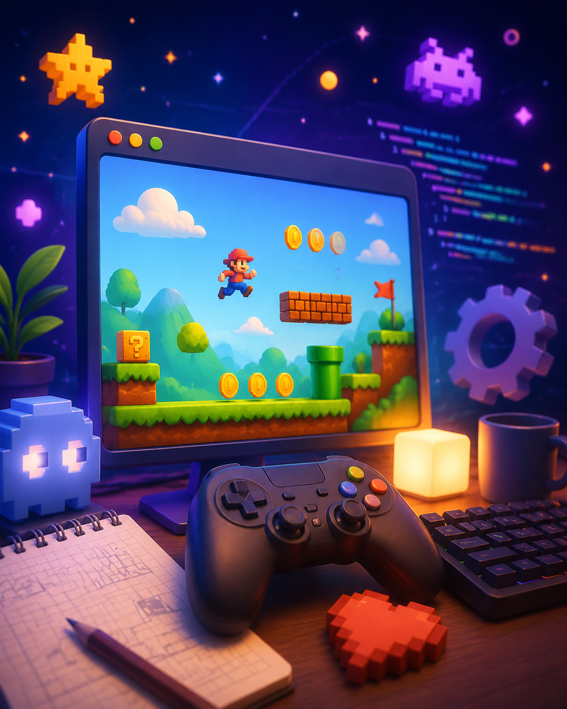
  <figcaption><strong>图7-1 本章封面</strong>：游戏不是玩物丧志的同义词。对心理学和教学来说，游戏可以是实验任务、反馈系统和练习场。</figcaption>
</figure>

> 本章一句话：游戏不是玩物丧志的同义词。对心理学和教学来说，游戏可以是实验任务、反馈系统和练习场。

第7章继续推进“科研卡片工厂”的交互能力。前面几章大多在处理文件、表格和报告；这一章让程序第一次变得像一个会回应你的“小舞台”：你按下键，它立刻改变画面和分数。对心理学和教学来说，这很重要，因为很多任务本来就是刺激、反应、反馈和记录。

本章的目标不是做一个商业游戏，而是做一个能讲清楚原理的小作品：关键词反应小游戏。它既能当复习工具，也能当反应时任务的雏形。

---

## 7.0 本章学习目标

学完本章，你应该能够：

1. 用自己的话解释本章核心概念。
2. 运行本章配套脚本，看到明确输出。
3. 把概念和“科研卡片工厂”的连续项目联系起来。
4. 识别本章最常见的新手错误。
5. 完成本章小项目：**关键词反应小游戏**。

---

## 7.1 开场故事：先有画面，再有术语

游戏不是玩物丧志的同义词。对心理学和教学来说，游戏可以是实验任务、反馈系统和练习场。 这句话不是为了热闹，而是为了把本章的知识放进真实使用场景。初学者最怕一上来就被术语包围，像走进一个所有门牌都用缩写写成的楼层。我们先从画面进入，再慢慢把画面翻译成代码。

<figure align="center">
  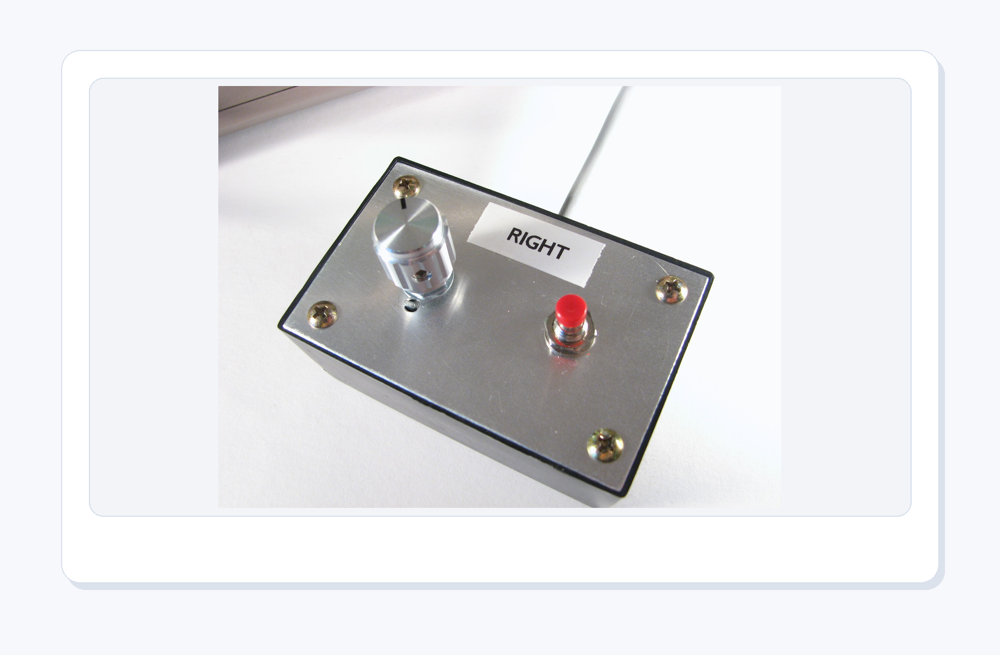
  <figcaption><strong>图7-2 Tennis for Two 复原装置</strong>：早期电子游戏的核心已经出现：屏幕呈现状态，玩家输入动作，系统立刻反馈。</figcaption>
</figure>

1958 年的 Tennis for Two 常被拿来讲早期电子游戏史。它的画面远没有今天华丽，但“交互”的灵魂已经在了：玩家不是旁观者，而是系统的一部分。PyGame 也从这里开始理解最合适：先让窗口活起来，再让按键改变状态，最后让结果被记录。

<figure align="center">
  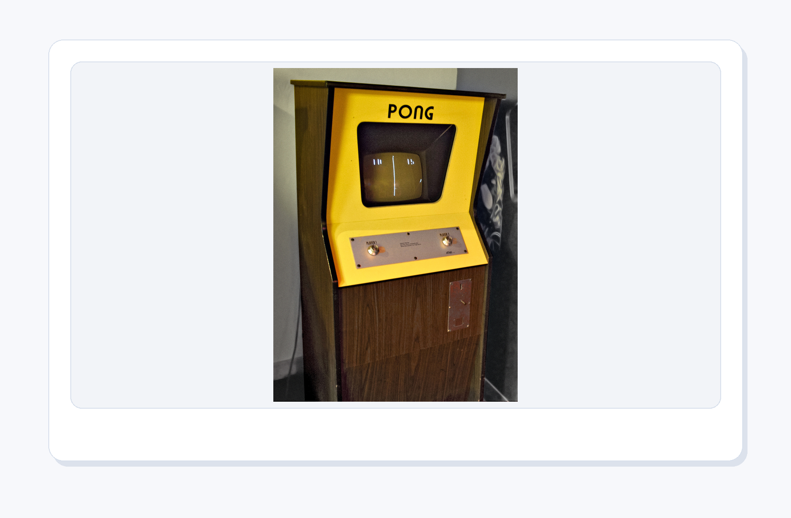
  <figcaption><strong>图7-3 Atari Pong 街机柜</strong>：早期电子游戏的魅力很朴素：一个窗口、两个控制、一个会反弹的球，反馈足够快，玩家就会进入状态。</figcaption>
</figure>

Pong 的规则简单到几乎不用解释：挡住球，别让它漏过去。但它非常适合讲 PyGame，因为一个小游戏最重要的骨架全在里面：窗口不断刷新，角色位置不断变化，用户输入改变状态，分数给出反馈。心理学里讲注意、反应时、即时反馈时，也常常要处理类似结构。

<figure align="center">
  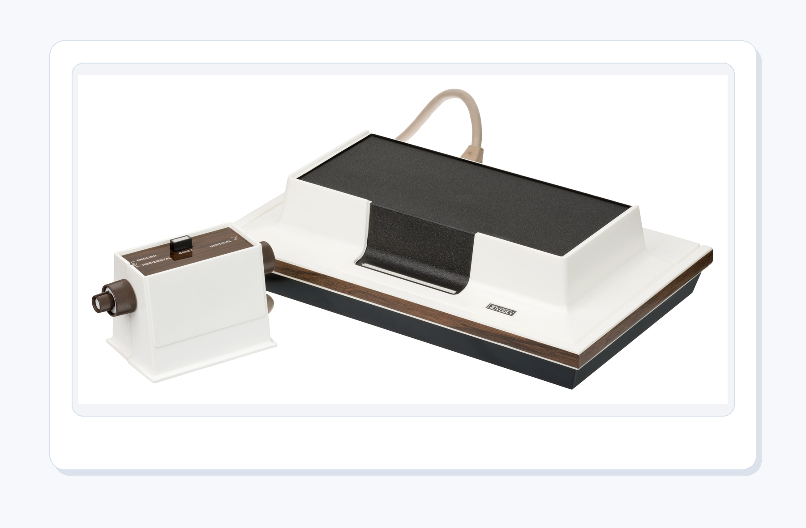
  <figcaption><strong>图7-4 Magnavox Odyssey 主机套装</strong>：当游戏进入客厅，交互设计就变成了普通人也能理解的规则：屏幕提示、手柄输入、立刻反馈。</figcaption>
</figure>

Magnavox Odyssey 让“电子游戏”不只停在实验室或机房，而是走进家庭客厅。这个转折对本章有个很朴素的提醒：小游戏不一定要复杂，关键是让玩家一眼知道目标、按键和结果。一个教学游戏如果需要先读三页说明书才能开始，你的注意力已经先掉了一半。

<figure align="center">
  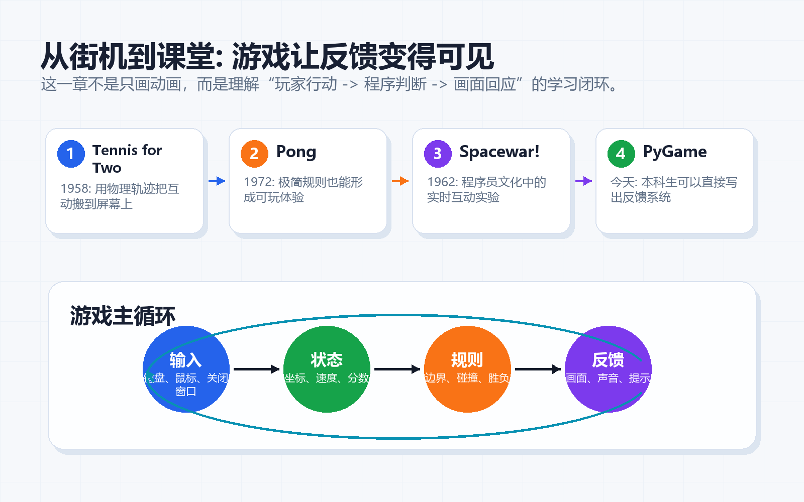
  <figcaption><strong>图7-5 故事场景</strong>：游戏像小剧场：窗口是舞台，角色是演员，事件是观众动作，游戏循环是灯光一直转动。</figcaption>
</figure>

这个画面对应本章的核心比喻：游戏像小剧场：窗口是舞台，角色是演员，事件是观众动作，游戏循环是灯光一直转动。 如果你能先记住这个比喻，后面的概念就不再是干巴巴的定义。

---

## 7.2 知识路线

<figure align="center">
  
  <figcaption><strong>图7-6 知识路线</strong>：先建立直觉，再运行代码，最后完成一个可展示的小项目。</figcaption>
</figure>

本章路线如下：

| 顺序 | 主题 | 你要完成的动作 |
| --- | --- | --- |
| 1 | pygame 初始化 | 先确认本机能打开游戏窗口 |
| 2 | 窗口和绘制 | 把目标词、提示和分数画到屏幕上 |
| 3 | 事件循环 | 让程序持续读取按键和关闭窗口动作 |
| 4 | 键盘响应 | 按下空格或数字键后，立刻改变状态 |
| 5 | 碰撞与得分 | 用分数、正误和上一按键记录游戏过程 |
| 6 | 反应时游戏 | 把刺激、反应、反馈和报告串成一轮任务 |
| 7 | 难度与反馈调参 | 用反应时和正确率判断游戏是不是刚刚好 |

---

## 7.3 核心概念：从人话到术语

<figure align="center">
  
  <figcaption><strong>图7-7 核心比喻</strong>：用一个稳定画面记住本章最重要的概念关系。</figcaption>
</figure>

先用人话说：游戏像小剧场：窗口是舞台，角色是演员，事件是观众动作，游戏循环是灯光一直转动。

<figure align="center">
  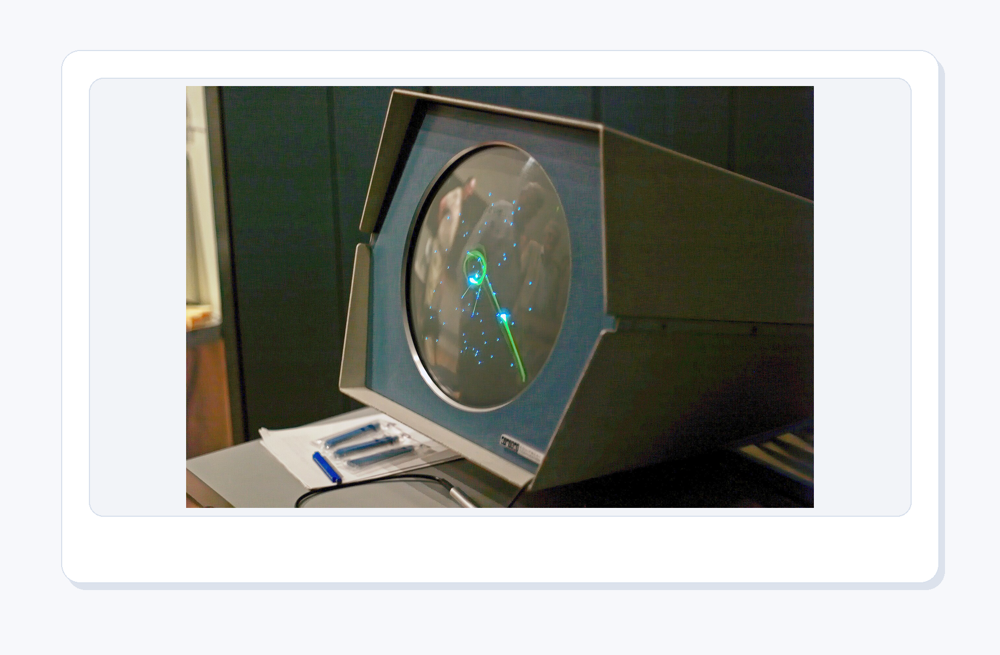
  <figcaption><strong>图7-8 Spacewar! 与 PDP-1</strong>：早期游戏不是只有娱乐，它也是人机交互的实验场；屏幕、输入、状态更新从一开始就绑在一起。</figcaption>
</figure>

Spacewar! 常被视为电子游戏史上的经典作品之一。它提醒我们：游戏开发并不是“画点漂亮东西”这么简单，而是在写一个持续运转的交互系统。每一帧都要问：有没有输入？状态怎么变？画面怎么刷新？这三问，就是 PyGame 的核心。

心理学里有一个很适合解释游戏体验的概念：心流。一个任务如果反馈及时、目标清楚、难度略高于当前能力，人就更容易进入专注状态。把这个想法放到 PyGame 里，就是：目标词要清楚，按键反馈要快，分数变化要立刻出现，难度可以一点点增加。太简单会无聊，太难会焦虑；刚刚好，你才愿意再试一次。

<figure align="center">
  
  <figcaption><strong>图7-9 Mihaly Csikszentmihalyi照片</strong>：心流不是“玩得停不下来”的玄学，而是目标、反馈、难度和能力之间达成了微妙平衡。</figcaption>
</figure>

这张图可以帮你把游戏设计和心理学连起来。教学小游戏最怕两件事：一种是太像考试，让人只想逃；另一种是太像烟花，看完热闹什么也没留下。心流给我们的提示是：让任务明确、反馈及时、难度可调，游戏才可能变成学习的练习场。

再用术语说，本章要掌握这些内容：

- **pygame 初始化**：像开场前打开剧场电源，窗口、字体和事件系统都要先准备好。
- **窗口和绘制**：窗口是舞台，目标词、按钮提示、分数和反馈都要画在这里。
- **事件循环**：游戏一直问“刚才发生了什么”，按键、退出和状态变化都从这里进入。
- **键盘响应**：玩家看到刺激后按键，程序立刻判断、更新分数、刷新提示。
- **碰撞与得分**：不只是碰到才得分，更重要的是记录“发生了什么、结果如何”。
- **反应时游戏**：把刺激呈现、按键反应、正误判断和反应时记录连成一轮任务。
- **难度与反馈调参**：用正确率和反应时判断挑战是否合适，而不是一味加速。

术语不是用来吓人的，它只是为了让大家交流时不用每次都讲一长串故事。你先用故事建立直觉，再用术语压缩表达，这样学得稳。

---

## 7.4 最小可运行示例

<figure align="center">
  
  <figcaption><strong>图7-10 最小示例</strong>：先跑通最小代码，再逐步增加功能，学习会稳很多。</figcaption>
</figure>

本章第一件事不是背参数，而是运行一个最小例子。打开终端，进入本章目录后运行：

```bash
python code/ch07/01_pygame_check.py
```

如果你能看到输出，说明这一章的入口已经打通。后面所有复杂功能，都是在这个入口上慢慢加能力。

<figure align="center">
  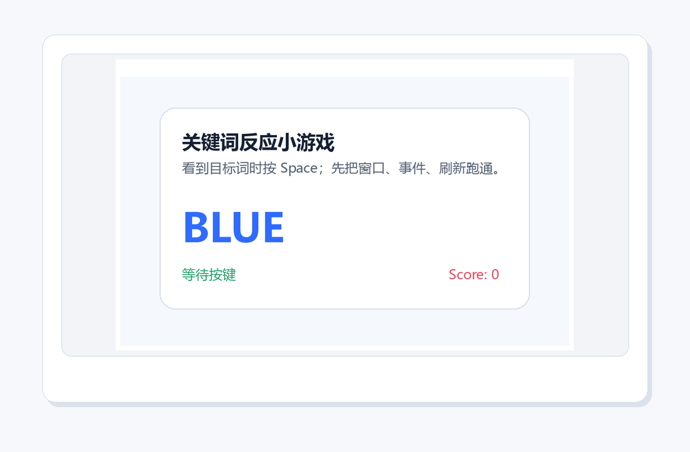
  <figcaption><strong>图7-11 PyGame 真实窗口</strong>：`02_reaction_game_skeleton.py` 会打开一个可交互窗口，先把窗口、事件和刷新跑通。</figcaption>
</figure>

你现在看到的不是概念图，而是本机运行出来的 PyGame 窗口。它只有一个目标词、一个按键规则和一个分数，但这已经足够说明游戏程序的骨架：窗口负责展示，事件负责接收输入，状态负责记住当前分数，循环负责不断刷新。

<figure align="center">
  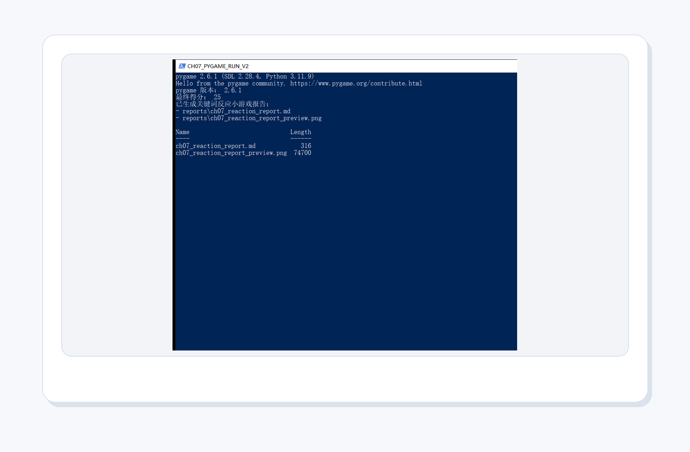
  <figcaption><strong>图7-12 PowerShell 真实运行结果</strong>：先确认 pygame 可用，再把计分逻辑和反应报告生成拆开检查。</figcaption>
</figure>

---

## 7.5 与心理学/科研教学的连接

<figure align="center">
  
  <figcaption><strong>图7-13 心理学连接</strong>：把本章能力放进实验、记录、分析和学习分享的真实任务里。</figcaption>
</figure>

这一章会把例子贴近心理学、科研记录和学习分享。因为这些任务天然需要清晰流程：刺激是什么，反应是什么，数据存到哪里，结果如何展示，别人能不能复现。

在本章里，你可以这样理解项目价值：

- 它不是孤立练习，而是科研卡片工厂的一台新设备。
- 它处理的材料可以是课程笔记、实验记录、问卷结果、图片、网页资料或报告模板。
- 它最终要留下可检查的结果，而不是只在屏幕上闪一下。

<figure align="center">
  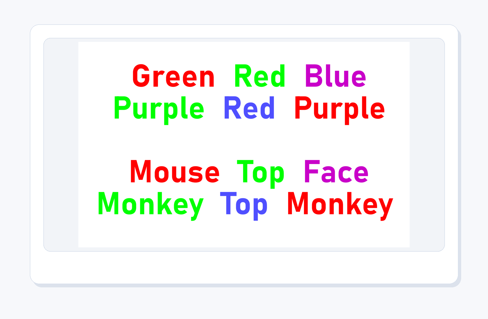
  <figcaption><strong>图7-14 Stroop 效应示例</strong>：很多心理学任务都像小游戏：呈现刺激、等待反应、记录正误和反应时。</figcaption>
</figure>

Stroop 任务的有趣之处在于：你明明知道该看颜色，大脑却忍不住读字。把它放进 PyGame 章节，是为了提醒你：游戏窗口不仅能做娱乐，也能做实验任务原型。只要把刺激、按键、正误和反应时记录下来，小游戏就开始靠近心理学实验工具。

<figure align="center">
  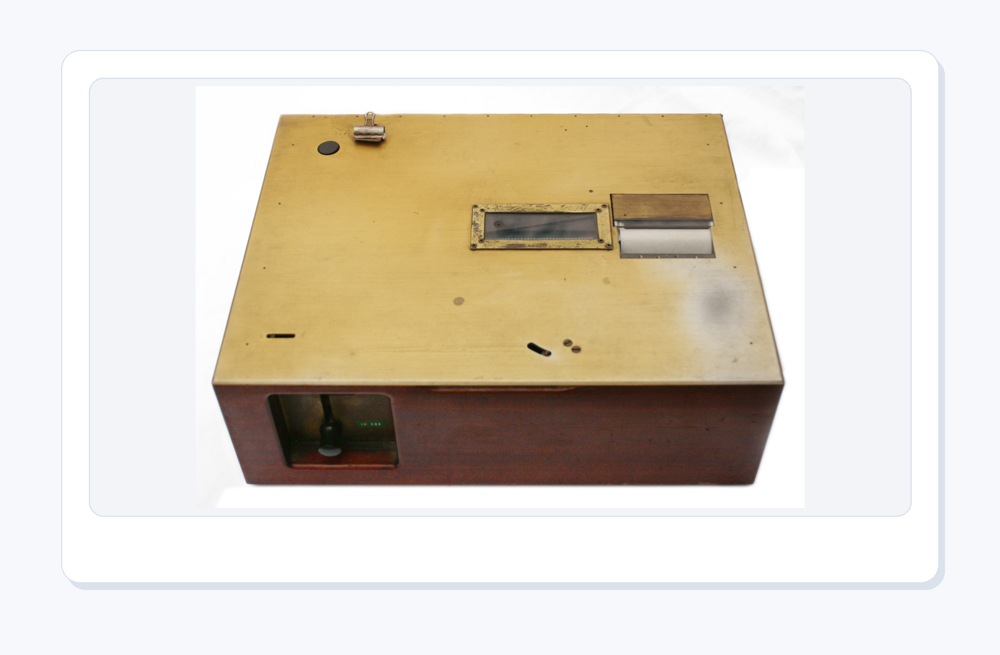
  <figcaption><strong>图7-15 Skinner 的教学机器</strong>：学习者做出反应之后，系统立刻给出反馈；这正是教学小游戏最值得继承的机制。</figcaption>
</figure>

B. F. Skinner 的 teaching machine 看起来像一台古早设备，但它抓住了一个今天仍然重要的原则：**反馈要及时**。答完题以后，不应该等到很久以后才知道自己哪里对、哪里错；反馈拖得太久，学习就像把球扔进黑洞，听不到回声。

PyGame 可以把这个原则做得很具体。屏幕上出现一张卡片，你按下数字键，程序立刻显示“答对”“再试一次”或“先看提示”，同时把反应时写进文件。这个过程一点也不神秘：事件循环负责读按键，状态变量负责记当前卡片，绘图函数负责反馈，文件负责留下证据。所谓教学小游戏，不是给语法穿上花衣服，而是让学习者和程序之间真的有来有回。

<figure align="center">
  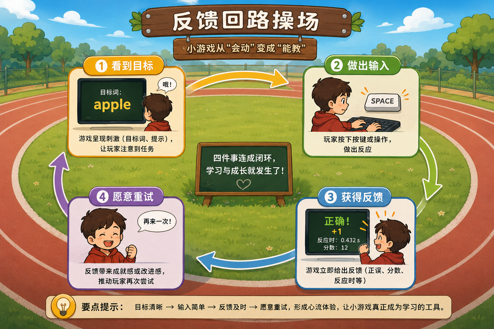
  <figcaption><strong>图7-16 反馈回路操场</strong>：玩家看到目标、做出输入、获得反馈、愿意重试，四件事连成闭环，小游戏才会从“会动”变成“能教”。</figcaption>
</figure>

可以把教学小游戏想成一个小操场。屏幕给出目标，键盘收下动作，程序立刻把结果还给玩家，玩家再决定要不要试下一轮。如果这四步断了一步，体验就会漏气：目标不清，玩家会迷路；输入不灵，玩家会烦躁；反馈太慢，玩家会失去节奏；重试没有理由，练习就停在第一轮。

所以本章的重点不只是“让窗口动起来”。真正有教学价值的 PyGame 程序，要把循环设计成学习循环：每一次按键都留下数据，每一次反馈都帮助修正，每一次重试都比上一轮更清楚一点。这样，游戏就不只是好玩，而是在帮科研卡片工厂安排下一次练习。

---

## 7.6 关键概念拆解表

| 概念 | 人话理解 | 本章落点 |
| --- | --- | --- |
| pygame 初始化 | 开场前先把剧场灯光打开 | `pygame.init()` 准备窗口、字体和事件系统 |
| 窗口和绘制 | 窗口是舞台，所有刺激和反馈都画在这里 | `pygame.display.set_mode()` 创建 800x480 窗口 |
| 事件循环 | 观众按键、关闭窗口，都从事件队列里读 | `for event in pygame.event.get()` 处理退出和按键 |
| 键盘响应 | 反应时任务的核心就是“看到刺激后按键” | 按下 `Space` 后更新分数 |
| 碰撞与得分 | 分数、当前提示、上一按键都要被程序记住 | `score` 和 `last_key` 在循环中不断更新 |
| 反应时游戏 | 每一帧都检查输入、更新状态、重画画面 | `clock.tick(60)` 控制刷新节奏 |
| 难度与反馈调参 | 好游戏不是一味变难，而是让挑战和能力接近 | 用报告观察正确率、反应时和难度变化 |
| 反馈循环 | 玩家输入后要立刻看到变化，才会愿意继续 | `06_make_game_feedback_loop.py` 生成反馈循环卡 |
| 教学反馈小游戏 | 复习卡片出现以后，玩家按键，程序马上反馈并保存记录 | `09_make_teaching_feedback_game.py` 读取 ch6 复习计划生成小游戏队列 |

这张表的作用，是把“我好像懂了”变成“我知道它在哪用”。学习编程时，最危险的状态不是完全不会，而是听解释时点头，自己动手时发呆。每学一个概念，都要强迫自己问一句：它在本章项目里负责哪一段工作？

---

## 7.7 配套代码逐个导览

### 脚本 1：`01_pygame_check.py`

运行方式：

```bash
python code/ch07/01_pygame_check.py
```

阅读时重点看三件事：`pygame` 是否能成功导入，版本信息是否能打印出来，错误提示是否足够清楚。它像开机自检，先确认电源、屏幕和按钮都在线，再放心进入真正的游戏窗口。

### 脚本 2：`02_reaction_game_skeleton.py`

运行方式：

```bash
python code/ch07/02_reaction_game_skeleton.py
```

阅读时重点看四件事：窗口在哪里创建，事件在哪里读取，目标词和分数在哪里更新，画面在哪里重画。不要只盯着语法，要把它当成一台每秒刷新很多次的小剧场。

### 脚本 3：`03_score_model.py`

运行方式：

```bash
python code/ch07/03_score_model.py
```

`03_score_model.py` 故意不打开 PyGame 窗口，因为它负责演示一个重要习惯：能和界面拆开的逻辑，尽量先拆出来测试。窗口出问题时，你至少知道计分规则本身是对的；计分出问题时，也不用盯着一堆绘图代码发呆。

### 脚本 4：`04_make_reaction_report.py`

运行方式：

```bash
python code/ch07/04_make_reaction_report.py
```

这个脚本会生成：

```text
reports/ch07_reaction_report.md
reports/ch07_reaction_report_preview.png
```

它把几条模拟试次整理成报告：目标词是什么，是否正确，反应时是多少。真实项目里，这些数据可以来自 PyGame 窗口中的按键记录。你现在先用固定数据跑通报告流程，后面再把窗口交互和数据保存接起来。

建议第一次运行时不要急着改代码。先原样运行，确认能看到输出；第二次再改一个最小参数；第三次再尝试给小游戏增加新的目标词或按键规则。游戏开发最怕“憋一个巨大版本再运行”，那样出错时像在一团线里找针。

### 脚本 5：`05_make_game_balance_report.py`

运行方式：

```bash
python code/ch07/05_make_game_balance_report.py
```

这个脚本会生成：

```text
reports/ch07_game_balance_report.md
output/ch07_game_balance_preview.png
```

它关注的不是“游戏有没有炫酷”，而是“难度是不是刚好”。脚本用模拟数据展示四轮小游戏的目标反应时、平均反应时、正确率和状态判断。教学游戏真正有用的地方，往往不在音效和动画，而在这些朴素问题：玩家是不是知道要做什么？反馈是不是来得够快？难度是不是让人愿意再试一次？

### 脚本 6：`06_make_game_feedback_loop.py`

运行方式：

```bash
python code/ch07/06_make_game_feedback_loop.py
```

这个脚本会生成：

```text
reports/ch07_game_feedback_loop.md
output/ch07_game_feedback_loop.png
```

它把小游戏拆成一个反馈循环：目标清楚、按键明确、状态更新、反馈及时、失败后还愿意再试。对 PyGame 来说，这五件事比“画面炫不炫”更基础。一个教学小游戏如果没有反馈，玩家会觉得自己在对着墙按键；如果反馈太慢，玩家会怀疑程序卡了；如果失败后没有下一步提示，学习就停在挫败感里。

### 脚本 7：`07_make_flow_tuning_curve.py`

运行方式：

```bash
python code/ch07/07_make_flow_tuning_curve.py
```

这个脚本会生成：

```text
reports/ch07_flow_tuning_curve.md
output/ch07_flow_tuning_curve.png
```

它把“心流”变成一张可检查的调参曲线：挑战太低，玩家容易走神；挑战太高，玩家容易乱按或放弃；中间那段“够得着但要认真”的区域，才是教学小游戏最值得追求的位置。游戏开发不是把难度拧到最大，而是让玩家每一次失败后还愿意再试一次。

### 脚本 8：`08_make_data_driven_tuning.py`

运行方式：

```bash
python code/ch07/08_make_data_driven_tuning.py
```

这个脚本读取 ch6 的数据分析摘要，把卡片数量、标签数量和反应时转换成 PyGame 参数建议。它的意义是让游戏难度不再靠拍脑袋，而是从真实学习记录里长出来。

### 脚本 9：`09_make_teaching_feedback_game.py`

运行方式：

```bash
python code/ch07/09_make_teaching_feedback_game.py
```

这个脚本读取 ch6 的记忆复习计划，把“哪些卡片该复习”转换成一轮教学反馈小游戏：显示卡片、按数字键、即时反馈、写入结果。它不是完整 PyGame 主循环，而是一个可交给主循环使用的设计包。先把规则和数据整理清楚，后面真正写窗口时就不会一边画画面一边想规则。

---

## 7.8 常见坑

<figure align="center">
  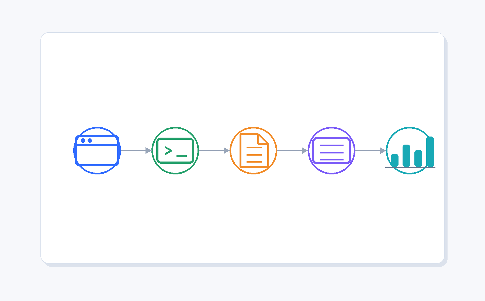
  <figcaption><strong>图7-17 常见坑地图</strong>：错误不是判决，而是提醒你该检查路径、输入、状态或依赖。</figcaption>
</figure>

本章常见坑：

- 忘记处理退出事件
- 循环里不刷新画面
- 帧率失控
- 资源路径写死

遇到问题时，先看报错信息，再看文件路径，最后看输入数据。不要一报错就重装环境。重装是最后手段，不是第一反应。

---

## 7.9 本章小项目：关键词反应小游戏

<figure align="center">
  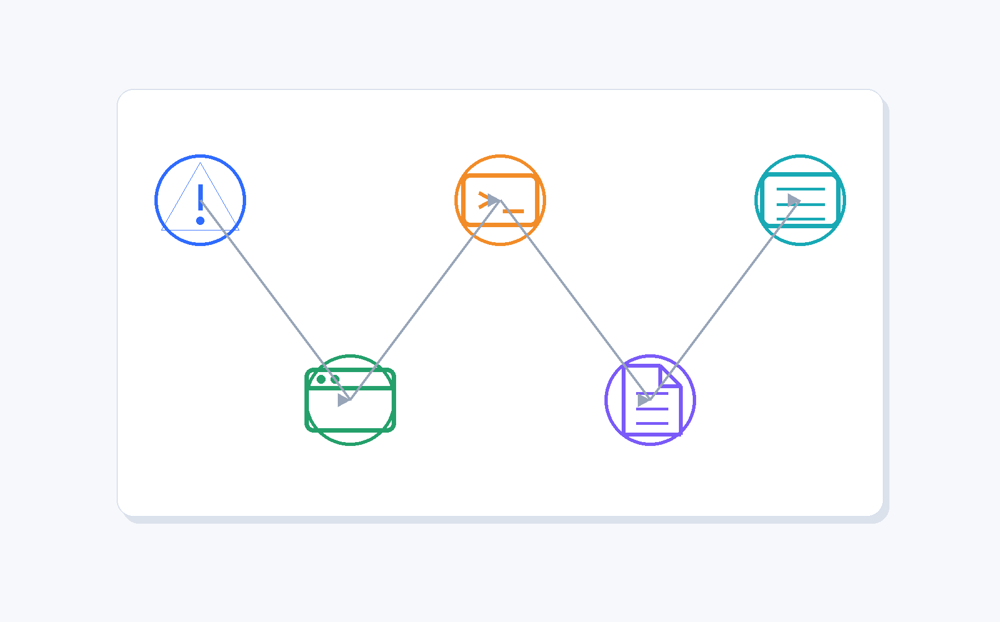
  <figcaption><strong>图7-18 本章项目</strong>：完成“关键词反应小游戏”，给科研卡片工厂增加一项新能力。</figcaption>
</figure>

项目目标：做一个能呈现刺激、接收按键、记录得分的复习小游戏，并生成一份反应报告。

<figure align="center">
  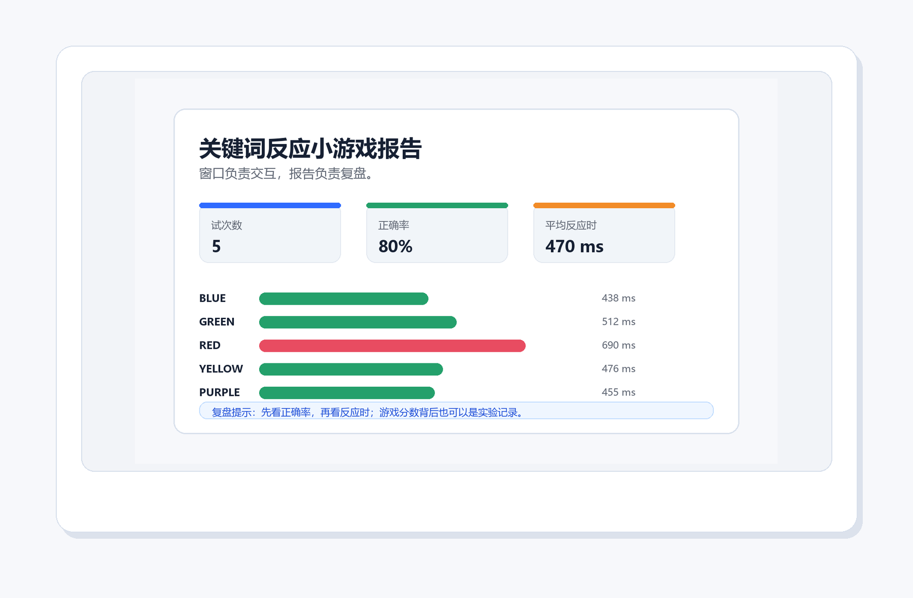
  <figcaption><strong>图7-19 Python 生成的反应报告预览</strong>：窗口负责交互，报告负责复盘；游戏数据只有落到文件里，才真正进入科研卡片工厂。</figcaption>
</figure>

<figure align="center">
  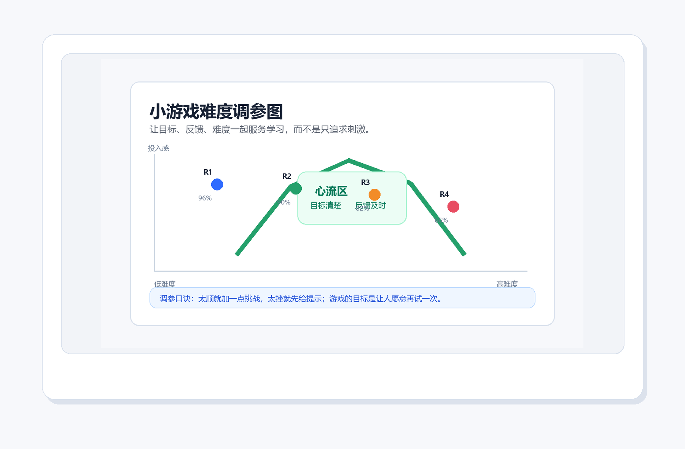
  <figcaption><strong>图7-20 Python 生成的小游戏难度调参图</strong>：一个教学小游戏要追求的不是“虐人”，而是让目标、反馈、难度和能力保持恰到好处的张力。</figcaption>
</figure>

<figure align="center">
  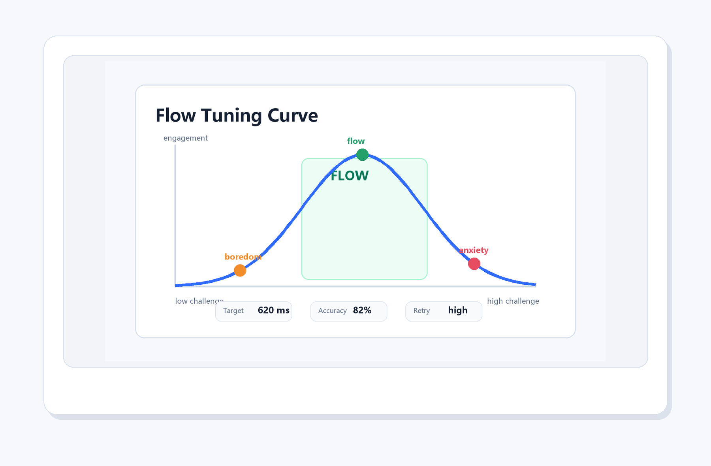
  <figcaption><strong>图7-21 Python 生成的心流难度调参曲线</strong>：太简单会无聊，太难会焦虑；小游戏真正有教学价值的地方，是把挑战调到“够得着但需要专注”。</figcaption>
</figure>

这张图来自 `07_make_flow_tuning_curve.py`。它把心流从一个好听的心理学词汇，变成可以写进项目复盘的判断工具。以后调小游戏难度时，不要只问“是不是更快、更难、更刺激”，还要问：玩家是否知道目标？失败后是否知道下一步？再来一次的意愿有没有被保留下来？

如果你已经运行过 ch6 的 `08_make_ch05_handoff_analysis.py`，本章还可以直接读取上一章生成的学习数据摘要，把卡片数量、标签数量和反应时转换成小游戏参数。这样，难度不再靠拍脑袋，而是从真实学习记录里长出来。

运行方式：

```bash
python code/ch07/08_make_data_driven_tuning.py
```

运行后会生成：

```text
output/ch07_data_driven_tuning.json
reports/ch07_data_driven_tuning.md
output/ch07_data_driven_tuning.png
```

<figure align="center">
  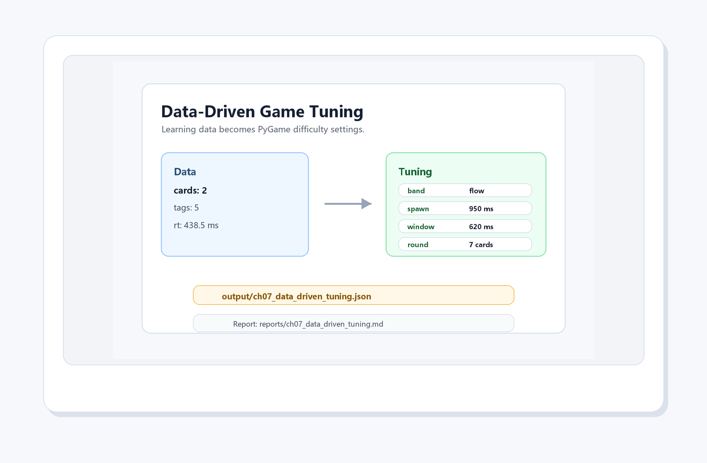
  <figcaption><strong>图7-22 Python 生成的数据驱动游戏调参回执</strong>：`08_make_data_driven_tuning.py` 读取 ch6 的分析摘要，把卡片数量、标签数量和反应时转换成出题间隔、目标反应窗口和一轮卡片数。</figcaption>
</figure>

这一步把 ch6 和 ch7 接起来：数据分析负责看清学习者当前状态，PyGame 负责把这个状态变成“刚刚好”的挑战。如果反应很快，可以稍微加速；如果反应慢，就先降低压力、增加提示。真正好的学习小游戏，不是永远更难，而是让人愿意继续练。

<figure align="center">
  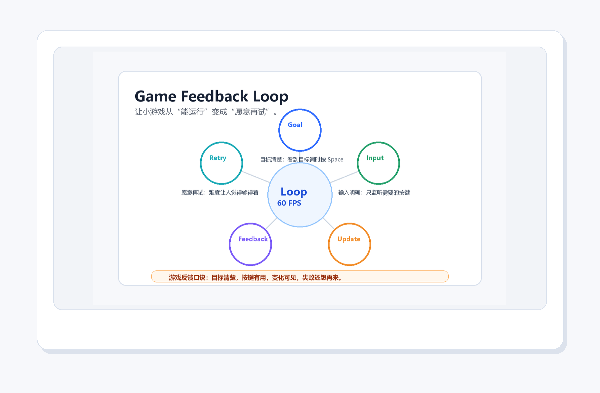
  <figcaption><strong>图7-23 Python 生成的游戏反馈循环卡</strong>：游戏循环不是抽象术语，而是目标、输入、状态更新、反馈和重试意愿不断接力。</figcaption>
</figure>

这张图来自 `06_make_game_feedback_loop.py`。它提醒你：游戏最小可用版本不一定要有复杂素材，但一定要有反馈。玩家按了键，画面要变；答对了，分数要变；答错了，也要知道下一步该怎么做。反馈越清楚，玩家越愿意把注意力放在任务上，而不是怀疑自己是不是按错了、程序是不是坏了。

运行第 9 个脚本以后，本章还会生成一份“教学反馈小游戏计划”。它把 ch6 的记忆复习计划接进 ch7：哪张卡片先出现、按哪个键、答完给什么反馈，都被写进 JSON 和报告里。

```bash
python code/ch07/09_make_teaching_feedback_game.py
```

运行后会生成：

```text
output/ch07_teaching_feedback_game.json
reports/ch07_teaching_feedback_game.md
output/ch07_teaching_feedback_game.png
```

<figure align="center">
  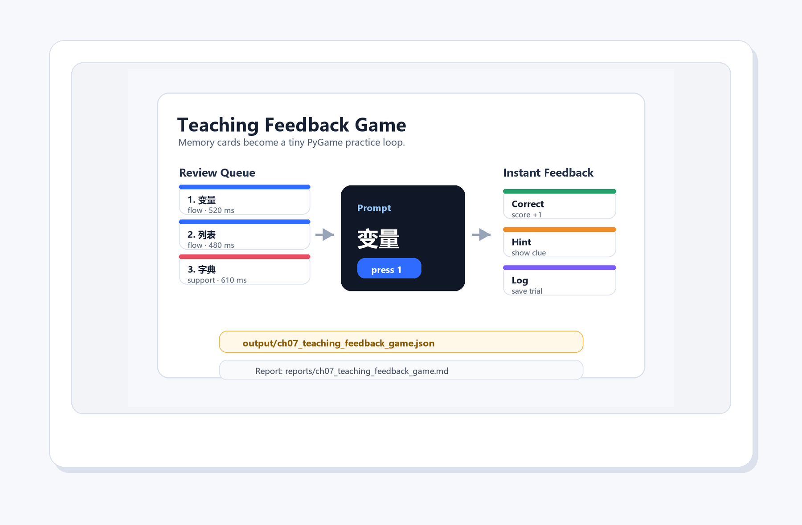
  <figcaption><strong>图7-24 Python 生成的教学反馈小游戏计划</strong>：`09_make_teaching_feedback_game.py` 把 ch6 的复习卡片转换成 PyGame 可以继续使用的提示、按键和即时反馈规则。</figcaption>
</figure>

这一步让“学习卡片工厂”更像一个能运行的学习系统：ch6 说“这些卡片该回来复习了”，ch7 接着说“那就把它们变成一轮可交互练习”。程序不再只是把结果画出来，而是开始把下一次学习行动安排好。

最后，再给本章做一次“游戏证据验收”。小游戏最容易让人误以为“窗口能打开就完事”，但真正可复盘的学习工具，还应该留下报告、调参数据和反馈计划。下面这张图把本章的 14 个关键产物放在同一块证据板上：反应报告、难度平衡、反馈循环、心流曲线、数据驱动调参和教学反馈小游戏都要 ready。

```bash
python code/ch07/10_make_game_runtime_evidence.py
```

<figure align="center">
  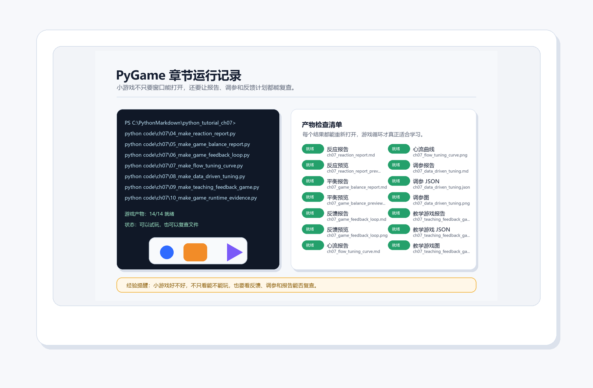
  <figcaption><strong>图7-25 PyGame游戏运行证据总览</strong>：`10_make_game_runtime_evidence.py` 检查本章 14 个关键产物，把“小游戏能运行”升级成“窗口、报告、调参和反馈计划都能被复盘”。</figcaption>
</figure>

建议项目结构：

```text
python_card_factory/
├── code/
│   └── ch07/
├── input/
├── output/
├── reports/
└── assets/
```

本章配套脚本：

- `code/ch07/01_pygame_check.py`
- `code/ch07/02_reaction_game_skeleton.py`
- `code/ch07/03_score_model.py`
- `code/ch07/04_make_reaction_report.py`
- `code/ch07/05_make_game_balance_report.py`
- `code/ch07/06_make_game_feedback_loop.py`
- `code/ch07/07_make_flow_tuning_curve.py`
- `code/ch07/08_make_data_driven_tuning.py`
- `code/ch07/09_make_teaching_feedback_game.py`
- `code/ch07/10_make_game_runtime_evidence.py`

完成标准：

1. 能按顺序运行 `01_pygame_check.py` 到 `09_make_teaching_feedback_game.py` 中不需要交互窗口停留的脚本。
2. 能解释脚本输入、处理、输出分别是什么。
3. 把生成结果保存到 `output/` 或 `reports/`。
4. 在 README 或学习记录中写下运行命令。
5. 能生成 `reports/ch07_reaction_report.md` 和 `reports/ch07_reaction_report_preview.png`。
6. 能生成 `reports/ch07_game_balance_report.md` 和 `output/ch07_game_balance_preview.png`。
7. 能生成 `reports/ch07_game_feedback_loop.md` 和 `output/ch07_game_feedback_loop.png`，并说明小游戏的反馈循环。
8. 能生成 `reports/ch07_flow_tuning_curve.md` 和 `output/ch07_flow_tuning_curve.png`，并说明当前小游戏更接近低挑战、心流区还是高挑战。
9. 能生成 `reports/ch07_data_driven_tuning.md` 和 `output/ch07_data_driven_tuning.json`，并说明 ch6 的数据如何影响 PyGame 难度。
10. 能生成 `reports/ch07_teaching_feedback_game.md` 和 `output/ch07_teaching_feedback_game.json`，并说明即时反馈为什么能帮助学习卡片复习。
11. 能生成 `reports/ch07_game_runtime_evidence.md` 和 `output/ch07_game_runtime_evidence.png`，并检查是否显示 `14/14 ready`。

动手步骤：

1. **准备目录**：确认 `python_card_factory/` 下有 `code/`、`input/`、`output/`、`reports/`。
2. **运行最小脚本**：先运行本章第一个脚本，得到一个确定反馈。
3. **记录环境**：把 Python 版本、运行命令和输出截图或输出文本写进 `reports/`。
4. **连接真实材料**：把课程笔记、实验记录、图片、网页或 CSV 放进 `input/`。
5. **生成作品**：让脚本在 `reports/` 中留下反应报告和预览图。
6. **调整难度**：运行 `05_make_game_balance_report.py`，观察正确率、反应时和难度的关系。
7. **检查反馈循环**：运行 `06_make_game_feedback_loop.py`，说明玩家输入后画面、分数和提示如何变化。
8. **画出心流区**：运行 `07_make_flow_tuning_curve.py`，用曲线判断难度是否合适。
9. **读取数据调参**：运行 `08_make_data_driven_tuning.py`，把 ch6 的数据摘要变成 PyGame 参数建议。
10. **生成反馈复习计划**：运行 `09_make_teaching_feedback_game.py`，把 ch6 的复习卡片转换成一轮小游戏提示。
11. **生成运行证据**：运行 `10_make_game_runtime_evidence.py`，确认本章关键游戏产物全部 ready。
12. **写复盘**：说明这章让卡片工厂多了什么能力，哪些地方还容易出错。

---

## 7.10 练习任务

1. 修改一个输入参数，观察输出变化。
2. 把脚本生成的结果保存成文件。
3. 故意制造一个小错误，记录报错信息和修复方式。
4. 把本章项目和前面章节连接起来，例如读取 ch03 整理出的文件，或使用 ch02 的数据结构保存结果。
5. 把目标反应时改得更严格，观察 `ch07_game_balance_report.md` 里的状态判断会不会变化。
6. 运行 `06_make_game_feedback_loop.py`，把其中一个环节改成自己的小游戏设计，例如“错题提示”或“连击奖励”。
7. 运行 `07_make_flow_tuning_curve.py`，把图中的 `Target` 或 `Accuracy` 改成你自己的小游戏数据，再写一句调参建议。
8. 打开 `output/ch07_data_driven_tuning.json`，把 `spawn_interval_ms` 改快或改慢，写下你预测玩家体验会怎样变化。
9. 打开 `output/ch07_teaching_feedback_game.json`，把某张卡片的 `feedback` 改成更像教学提示的一句话。
10. 运行 `10_make_game_runtime_evidence.py`，如果报告里出现 `MISSING`，根据缺失路径回头补跑对应脚本。

---

## 7.11 自测问题

1. 本章最重要的三个概念是什么？请用人话解释，不要只背术语。
2. 本章第一个脚本的输入、处理、输出分别是什么？
3. 如果脚本运行失败，你第一步会检查路径、环境、依赖还是语法？为什么？
4. 本章项目和“科研卡片工厂”有什么关系？
5. 你能不能把本章项目改成一个心理学或教学场景的小任务？

参考回答不唯一。判断自己是否真的理解，可以看你能不能把答案讲给一个完全没学过本章的人听。

---

## 7.12 学习复盘模板

可以在 `reports/ch07_review.md` 中写下：

```markdown
# 第7章复盘

## 我新增的能力
- 

## 我跑通的脚本
- 

## 我遇到的报错
- 报错信息：
- 原因：
- 修复方式：

## 我能迁移到哪里
- 心理学实验：
- 教学分享：
- 科研资料整理：
```

复盘不是写作文，而是给未来的自己留路标。你现在记录清楚，后面做综合项目时就不用重新从记忆里翻箱倒柜。

---

## 7.13 与后续章节的连接

本章不是孤岛。它和整套教程的关系可以这样理解：

- 前面章节提供基础：环境、数据结构、文件管理。
- 本章提供一项新能力：关键词反应小游戏。
- 后面章节会把这项能力继续接到数据分析、图像处理、爬虫或办公自动化里。

所以不要只问“这一章考试考什么”。更好的问题是：它能帮我少做哪一类重复劳动？它能让我的学习材料、实验记录或报告更稳定吗？

---

## 7.14 本章总结

PyGame 游戏开发的关键不是“记住所有 API”，而是理解它解决的问题。你已经从概念、图像、代码和小项目四个角度接触了本章内容。下一次复习时，不要只问“我会不会背”，而要问：

- 我能不能讲出这个概念的比喻？
- 我能不能运行一个最小脚本？
- 我能不能把结果放进项目目录？
- 我能不能说清楚它在科研卡片工厂里增加了什么能力？

如果答案是肯定的，这一章就不是看过了，而是真的进入你的工具箱了。

真正好玩的学习小游戏，往往不是因为它很复杂，而是因为它让人知道自己在做什么、按键有没有用、结果有没有变化、失败后还想再来一次。PyGame 这章的价值也在这里：它把抽象的循环、事件、状态和反馈，变成一个能看见、能按键、能记录的小系统。
