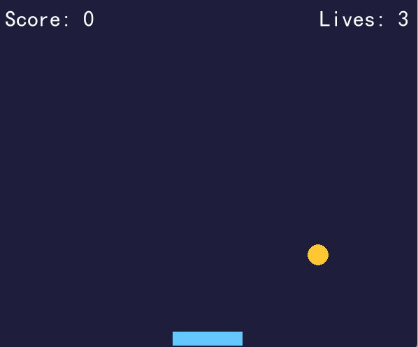

# 第 7 章：PyGame 游戏开发

[TOC]

<style>
figure {
  margin: 1.2em auto 1.8em;
  text-align: center;
}
figure img {
  max-width: 100%;
  display: block;
  margin: 0 auto;
}
figcaption {
  margin-top: 0.45em;
  color: #5f6673;
  font-size: 0.92em;
  line-height: 1.55;
}
figcaption strong {
  color: #2d3748;
}
</style>


<figure align="center">
  
  <figcaption><strong>图7-1 本章封面</strong>：在心理学和教学领域，游戏可以成为实验任务、反馈系统和练习场。</figcaption>
</figure>

> 本章一句话：
> **在心理学和教学领域，游戏可以成为实验任务、反馈系统和练习场。**

第7章继续推进“科研卡片工厂”的交互能力。前面几章大多在处理文件、表格和报告；这一章让程序第一次变得像一个会回应你的“小舞台”：你按下键，它立刻改变画面和分数。对心理学和教学来说，这很重要，因为很多任务本来就是刺激、反应、反馈和记录的循环。

本章的目标很明确：做一个能讲清楚原理的小作品。

---

## 本章导读：先把游戏看成反馈系统

### 7.0 本章学习目标

学完本章，你应该能够：

1. 用“窗口、事件、状态、反馈、记录”解释 PyGame 程序的最小循环。
2. 运行 `01_pygame_check.py` 和 `02_reaction_game_skeleton.py`，确认本机能打开游戏窗口并处理按键。
3. 说清楚 Tennis for Two、Pong、Spacewar! 为什么适合用来理解交互系统，而不只是游戏史趣闻。
4. 把 Stroop 任务、Skinner 教学机器和心流理论连接到“即时反馈”和“难度调参”。
5. 运行本章非交互脚本，生成反应报告、难度平衡图、反馈循环卡、心流曲线、数据驱动调参和运行证据。
6. 完成本章小项目：**关键词反应小游戏**，并能解释它如何接住 ch6 的复习计划。

### 本章分区导航

| 分区 | 对应小节 | 你要抓住的主线 | 产出证据 |
| --- | --- | --- | --- |
| 第一部分：交互游戏从哪里来 | 7.1-7.3 | 游戏史不是装饰，它能帮你理解窗口、输入、状态更新和反馈 | 游戏史图、核心比喻、心流故事 |
| 第二部分：把 PyGame 跑起来 | 7.4-7.5 | 先打开窗口，再把心理学任务拆成刺激、反应、反馈和记录 | PyGame 窗口、PowerShell 运行图、Stroop/教学机器故事 |
| 第三部分：写一个真正的 Pygame 小游戏 | 7.6-7.7 | 写一个最简单的接球小游戏，拆解 Pygame 的核心机制 | `catch_the_ball.py` 游戏、四步循环拆解 |
| 第四部分：排错、项目与反馈证据 | 7.8 | 小游戏不只是窗口能动就结束，还要能调参、复盘和交付 | 坑地图、项目面板、调参图、运行证据 |
| 第五部分：练习、复盘与后续连接 | 7.9-7.12 | 把小游戏能力迁移到学习卡片、实验任务和后续章节 | 练习记录、自测答案、复盘模板 |

---

## 第一部分：交互游戏从哪里来

### 7.1 开场故事：先有画面，再有术语

人们对游戏的印象常停留在"玩物丧志"这四个字上，但在心理学和教学领域，它也可以是实验任务、反馈系统和练习场。这么说只是想从一开始就把本章的知识放到真实使用场景中。初学者最怕一上来就被术语包围，像走进一个所有门牌都用缩写写成的楼层。我们先从画面进入，再慢慢把画面翻译成代码。

<figure align="center">
  
  <figcaption><strong>图7-2 Tennis for Two 复原装置</strong>：早期电子游戏的核心已经出现：屏幕呈现状态，玩家输入动作，系统立刻反馈。</figcaption>
</figure>

1958 年的 Tennis for Two 常被拿来讲早期电子游戏史。它的画面远没有今天华丽，但"交互"的灵魂已经在了：玩家不再只是旁观者，而是融入了系统的一部分。PyGame 的理解也可以从这里开始：先让窗口活起来，再让按键改变状态，最后让结果被记录。

<figure align="center">
  
  <figcaption><strong>图7-3 Atari Pong 街机柜</strong>：早期电子游戏的魅力很朴素：一个窗口、两个控制、一个会反弹的球，反馈足够快，玩家就会进入状态。</figcaption>
</figure>

Pong 的规则简单到几乎不用解释：挡住球，别让它漏过去。但它非常适合讲 PyGame，因为一个小游戏最重要的骨架全在里面：窗口不断刷新，角色位置不断变化，用户输入改变状态，分数给出反馈。心理学里讲注意、反应时、即时反馈时，也常常要处理类似结构。

<figure align="center">
  
  <figcaption><strong>图7-4 Magnavox Odyssey 主机套装</strong>：当游戏进入客厅，交互设计就变成了普通人也能理解的规则：屏幕提示、手柄输入、立刻反馈。</figcaption>
</figure>

Magnavox Odyssey 让“电子游戏”不只停在实验室或机房，而是走进家庭客厅。这个转折对本章有个很朴素的提醒：小游戏不一定要复杂，关键是让玩家一眼知道目标、按键和结果。一个教学游戏如果需要先读三页说明书才能开始，你的注意力已经先掉了一半。

<figure align="center">
  
  <figcaption><strong>图7-5 故事场景</strong>：游戏像小剧场：窗口是舞台，角色是演员，事件是观众动作，游戏循环是灯光一直转动。</figcaption>
</figure>

这个画面对应本章的核心比喻：游戏像小剧场：窗口是舞台，角色是演员，事件是观众动作，游戏循环是灯光一直转动。 如果你能先记住这个比喻，后面的概念就不再是干巴巴的定义。

---

### 7.2 知识路线

本章路线如下：

| 顺序 | 主题 | 你要完成的动作 |
| --- | --- | --- |
| 1 | pygame 初始化 | 先确认本机能打开游戏窗口 |
| 2 | 窗口和绘制 | 把目标词、提示和分数画到屏幕上 |
| 3 | 事件循环 | 让程序持续读取按键和关闭窗口动作 |
| 4 | 键盘响应 | 按下空格或数字键后，立刻改变状态 |
| 5 | 碰撞与得分 | 用分数、正误和上一按键记录游戏过程 |
| 6 | 反应时游戏 | 把刺激、反应、反馈和报告串成一轮任务 |
| 7 | 难度与反馈调参 | 用反应时和正确率判断游戏是不是刚刚好 |

---

### 7.3 核心概念：从白话到术语

先用白话说：游戏像小剧场：窗口是舞台，角色是演员，事件是观众动作，游戏循环是灯光一直转动。

<figure align="center">
  
  <figcaption><strong>图7-8 Spacewar! 与 PDP-1</strong>：早期游戏不只有娱乐价值，更是人机交互的实验场；屏幕、输入、状态更新从一开始就绑在一起。</figcaption>
</figure>

Spacewar! 常被视为电子游戏史上的经典作品之一。它提醒我们：游戏开发远不止"画点漂亮东西"，而是在写一个持续运转的交互系统。每一帧都要问：有没有输入？状态怎么变？画面怎么刷新？这三问，就是 PyGame 的核心。

心理学里有一个很适合解释游戏体验的概念：心流。一个任务如果反馈及时、目标清楚、难度略高于当前能力，人就更容易进入专注状态。把这个想法放到 PyGame 里，就是：目标词要清楚，按键反馈要快，分数变化要立刻出现，难度可以一点点增加。太简单会无聊，太难会焦虑；刚刚好，你才愿意再试一次。

<figure align="center">
  
  <figcaption><strong>图7-9 Mihaly Csikszentmihalyi照片</strong>：心流不是什么“玩得停不下来”的玄学，它是目标、反馈、难度和能力之间达成了微妙平衡。</figcaption>
</figure>

这张图可以帮你把游戏设计和心理学连起来。教学小游戏最怕两件事：一种是太像考试，让人只想逃；另一种是太像烟花，看完热闹什么也没留下。心流给我们的提示是：让任务明确、反馈及时、难度可调，游戏才可能变成学习的练习场。

再用术语说，本章要掌握这些内容：

- **pygame 初始化**：像开场前打开剧场电源，窗口、字体和事件系统都要先准备好。
- **窗口和绘制**：窗口是舞台，目标词、按钮提示、分数和反馈都要画在这里。
- **事件循环**：游戏一直问“刚才发生了什么”，按键、退出和状态变化都从这里进入。
- **键盘响应**：玩家看到刺激后按键，程序立刻判断、更新分数、刷新提示。
- **碰撞与得分**：除了判断碰到没碰到，更关键的是记录“发生了什么、结果如何”。
- **反应时游戏**：把刺激呈现、按键反应、正误判断和反应时记录连成一轮任务。
- **难度与反馈调参**：用正确率和反应时判断挑战是否合适，而不是一味加速。

---

## 第二部分：把 PyGame 跑起来

### 7.4 最小可运行示例

本章第一件事是直接运行一个最小例子——打开终端，进入本章目录后运行：

```bash
python code/ch07/01_pygame_check.py
```

如果你能看到输出，说明这一章的入口已经打通。后面所有复杂功能，都是在这个入口上慢慢加能力。

<figure align="center">
  
  <figcaption><strong>图7-11 PyGame 真实窗口</strong>：`02_reaction_game_skeleton.py` 会打开一个可交互窗口，先把窗口、事件和刷新跑通。</figcaption>
</figure>

你现在看到的可不是概念图——这是本机运行出来的真实 PyGame 窗口。它只有一个目标词、一个按键规则和一个分数，但这已经足够说明游戏程序的骨架：窗口负责展示，事件负责接收输入，状态负责记住当前分数，循环负责不断刷新。

<figure align="center">
  
  <figcaption><strong>图7-12 PowerShell 真实运行结果</strong>：先确认 pygame 可用，再把计分逻辑和反应报告生成拆开检查。</figcaption>
</figure>

---

### 7.5 与心理学/科研教学的连接

这一章会把例子贴近心理学、科研记录和学习分享。因为这些任务天然需要清晰流程：刺激是什么，反应是什么，数据存到哪里，结果如何展示，别人能不能复现。

在本章里，你可以这样理解项目价值：

- 它是科研卡片工厂的一台新设备，不是孤立的练习。
- 它处理的材料可以是课程笔记、实验记录、问卷结果、图片、网页资料或报告模板。
- 它最终要留下可检查的结果，不会只在屏幕上闪一下。

<figure align="center">
  
  <figcaption><strong>图7-14 Stroop 效应示例</strong>：很多心理学任务都像小游戏：呈现刺激、等待反应、记录正误和反应时。</figcaption>
</figure>

Stroop 任务的有趣之处在于：你明明知道该看颜色，大脑却忍不住读字。把它放进 PyGame 章节，是为了提醒你：游戏窗口不仅能做娱乐，也能做实验任务原型。只要把刺激、按键、正误和反应时记录下来，小游戏就开始靠近心理学实验工具。

<figure align="center">
  
  <figcaption><strong>图7-15 Skinner 的教学机器</strong>：学习者做出反应之后，系统立刻给出反馈；这正是教学小游戏最值得继承的机制。</figcaption>
</figure>

B. F. Skinner 的 teaching machine 看起来像一台古早设备，但它抓住了一个今天仍然重要的原则：**反馈要及时**。答完题以后，不应该等到很久以后才知道自己哪里对、哪里错；反馈拖得太久，学习就像把球扔进黑洞，听不到回声。

PyGame 可以把这个原则做得很具体。屏幕上出现一张卡片，你按下数字键，程序立刻显示“答对”“再试一次”或“先看提示”，同时把反应时写进文件。这个过程一点也不神秘：事件循环负责读按键，状态变量负责记当前卡片，绘图函数负责反馈，文件负责留下证据。所谓教学小游戏，并不是给语法穿上花衣服那么简单——它的真正价值在于让学习者和程序之间有来有回。

<figure align="center">
  
  <figcaption><strong>图7-16 反馈回路操场</strong>：玩家看到目标、做出输入、获得反馈、愿意重试，四件事连成闭环，小游戏才会从“会动”变成“能教”。</figcaption>
</figure>

可以把教学小游戏想成一个小操场。屏幕给出目标，键盘收下动作，程序立刻把结果还给玩家，玩家再决定要不要试下一轮。如果这四步断了一步，体验就会漏气：目标不清，玩家会迷路；输入不灵，玩家会烦躁；反馈太慢，玩家会失去节奏；重试没有理由，练习就停在第一轮。

所以本章的重点不光是“让窗口动起来”。真正有教学价值的 PyGame 程序，要把循环设计成学习循环：每一次按键都留下数据，每一次反馈都帮助修正，每一次重试都比上一轮更清楚一点。这样，游戏就不只是好玩，而是在帮科研卡片工厂安排下一次练习。

---

## 第三部分：写一个真正的 Pygame 小游戏

### 7.6 新游戏：接球小游戏

纸上谈兵够了，现在来写一个真正的 Pygame 游戏。我们从最简单的交互开始：**接住下落的小球**。

游戏规则非常直观：

- 屏幕顶部会不断落下金色小球。
- 你通过键盘的 **←** 和 **→** 方向键控制底部的蓝色挡板左右移动。
- 接住小球得 1 分；没接住就扣 1 条命。
- 每得 5 分，小球下落速度会加快一点。
- 生命归零时游戏结束，按 **R** 键重新开始。

这个游戏虽然简单，但它包含了所有 Pygame 的核心概念：**窗口创建、事件循环、键盘输入、碰撞检测、状态更新、即时反馈和帧率控制**。对心理学学生来说，这其实就是一个**手眼协调反应时任务**——你看到球的位置（刺激），移动挡板（反应），系统立刻告诉你结果（反馈）。

完整代码位于 `code/ch07/catch_the_ball.py`，总共约 90 行。运行方式：

```bash
python code/ch07/catch_the_ball.py
```

<figure align="center">
  
  <figcaption><strong>图7-17 接球游戏示意图</strong>：一个简单的Pygame小游戏。</figcaption>
</figure>

关闭窗口即可退出游戏。如果遇到 `ImportError`，先运行 `01_pygame_check.py` 确认 Pygame 是否已安装。

---

### 7.7 拆解游戏：从零学会 Pygame

现在把 `catch_the_ball.py` 一段一段拆开讲解。每一段对应 Pygame 的一个核心概念。

---

#### 7.7.1 导入与初始化

```python
import pygame
import random

pygame.init()
WIDTH, HEIGHT = 600, 500
screen = pygame.display.set_mode((WIDTH, HEIGHT))
pygame.display.set_caption("接球小游戏 — Pygame 入门")
clock = pygame.time.Clock()
font = pygame.font.SysFont("simhei", 32)
```

**`pygame.init()`**——PyGame 的"总开关"。它一次性初始化所有 Pygame 子模块（显示、字体、事件、声音等）。写任何 Pygame 程序，这都必须是第一行代码。

**`pygame.display.set_mode((WIDTH, HEIGHT))`**——创建游戏窗口。参数是一个 `(宽, 高)` 元组，单位是像素。它返回一个 `Surface` 对象（叫 `screen`），所有绘制内容都画在这个"画布"上。`600x500` 是一个不大不小、适合初学者的尺寸。

**`pygame.display.set_caption(...)`**——设置窗口标题栏显示的文字。

**`pygame.time.Clock()`**——创建时钟对象。它配合后面的 `clock.tick(60)` 一起工作，作用是**控制游戏刷新速度**。后面会详细解释。

**`pygame.font.SysFont("simhei", 32)`**——创建字体对象。第一个参数是字体名称（这里用"simhei"黑体显示中文），第二个参数是字号。后续用这个 `font` 对象在屏幕上绘制文字。

> **提示**：`pygame.init()` 就像实验开始前打开所有设备电源——显示器、反应盒、录音设备同时通电。如果漏了这一步，后面的设备一个都动不了。

---

#### 7.7.2 游戏状态变量

```python
player_x = 250
ball_x = random.randint(50, 550)
ball_y = 50
score = 0
lives = 3
speed = 5
running = True
game_over = False
```

游戏程序的核心思想是：**每时每刻都要记住当前"世界"是什么状态**。这些变量就是游戏世界的"记忆"：

| 变量 | 含义 | 为什么需要 |
| --- | --- | --- |
| `player_x` | 挡板的水平位置 | 每次刷新都要在 `player_x` 位置画挡板 |
| `ball_x`, `ball_y` | 小球的坐标 | 每次刷新都要在这个位置画小球 |
| `score` | 当前得分 | 显示在屏幕上，影响玩家动机 |
| `lives` | 剩余生命 | 生命归零时游戏结束 |
| `speed` | 小球下落速度 | 控制游戏难度 |
| `running` | 主循环开关 | 控制程序何时退出 |
| `game_over` | 是否结束 | 切换到结束画面 |

`ball_x` 用了 `random.randint(50, 550)`——这保证小球每次出现在窗口范围内的随机水平位置，让游戏每次开局都不一样。

> **提示**：实验程序里的"状态变量"概念和游戏完全一样——当前试次号、当前刺激类型、已记录的反应次数，都像这里的 `score` 和 `lives` 一样，需要在循环中不断更新和检查。

---

#### 7.7.3 游戏主循环与事件处理

```python
while running:
    for event in pygame.event.get():
        if event.type == pygame.QUIT:
            running = False
```

这就是 Pygame 里最重要、也最容易被初学者误解的结构——**游戏主循环**。

**`while running:`**——这可不是只执行一次的普通循环，它是**每秒重复约 60 次的"心脏泵"**。每一轮循环做三件事：读输入 → 更新状态 → 重绘画面。只要 `running` 为 `True`，这个循环就不会停。

**`pygame.event.get()`**——从事件队列里取出所有待处理的事件。什么是事件？**玩家点×关窗口、按键盘、点鼠标**——所有这些操作都会被 Pygame 记录成事件放进队列。`event.get()` 一次性取出全部事件，清空队列。

**为什么每一帧都必须调用 `event.get()`？** 因为操作系统认为窗口不响应事件就等于"卡死"。如果你不取走事件，窗口会显示"无响应"——这是初学者最容易遇到的坑。

**`pygame.QUIT`**——这是玩家点击窗口 × 按钮时触发的唯一事件。你必须在代码里处理它才能正常关闭窗口：

```python
if event.type == pygame.QUIT:
    running = False
```

设置 `running = False` 后，`while running:` 循环结束，程序进入退出清理阶段。

除了退出事件，Pygame 还会生成其他事件（键盘按下 `KEYDOWN`、鼠标移动 `MOUSEMOTION` 等），你可以根据需要选择性处理。

> **提示**：事件循环就像实验中的"等待响应"阶段——程序不断检查参与者有没有按键或点击。区别在于：实验程序通常只等一次响应就进入下一阶段，而游戏循环是无条件地每秒检查 60 次，不管有没有输入都照样刷新画面。

---

#### 7.7.4 键盘控制：响应玩家的操作

```python
keys = pygame.key.get_pressed()
if keys[pygame.K_LEFT] and player_x > 0:
    player_x -= 7
if keys[pygame.K_RIGHT] and player_x < WIDTH - 100:
    player_x += 7
```

`pygame.key.get_pressed()` 返回一个**包含所有按键状态的元组**。元组中的每个位置对应一个按键，按下为 `True`，松开为 `False`。这种方式适合**持续按键**的场景（如按住方向键持续移动）。

**`pygame.K_LEFT`** 和 **`pygame.K_RIGHT`** 是 Pygame 为方向键定义的常量。Pygame 为每个键盘按键定义了类似的常量：`K_SPACE`（空格）、`K_RETURN`（回车）、`K_a` 到 `K_z`（字母键）、`K_0` 到 `K_9`（数字键）等。

**边界检查**也很重要：

- `player_x > 0`：挡板不能移出左边界
- `player_x < WIDTH - 100`：挡板宽度是 100，所以右边界是 `WIDTH - 100`

如果不加边界检查，挡板会移出窗口消失不见。

> **两种处理键盘输入的方式**：
> 1. `pygame.key.get_pressed()` — 适合持续按住（如移动角色）
> 2. `event.type == pygame.KEYDOWN` — 适合单次按键（如按 R 重启）

在 `catch_the_ball.py` 中，游戏结束后的重启用了第二种方式：

```python
if event.type == pygame.KEYDOWN and game_over:
    if event.key == pygame.K_r:
        # 重置所有游戏状态
```

这两种方式的区别在于：`get_pressed()` 每一帧都能读到当前所有键的状态；而 `KEYDOWN` 事件只在按键**刚被按下那一刻**触发一次。

---

#### 7.7.5 更新游戏逻辑：球往下掉

```python
ball_y += speed

if ball_y > HEIGHT:
    lives -= 1
    ball_x = random.randint(50, 550)
    ball_y = 50
    if lives <= 0:
        game_over = True
```

**`ball_y += speed`**——每帧将小球的 y 坐标增加 `speed`（初始为 5）。因为屏幕的 y 轴**向下为正**，所以增大 y 坐标 = 球往下落。这就是"动画"的本质：**每帧移动一点点，60 帧/秒下看起来就是平滑运动**。

**球落地的判断**：`ball_y > HEIGHT` 检查球是否掉出了屏幕底部（`HEIGHT = 500`）。

**扣命和重置**：每次落地扣 1 条命，然后把球重新放到顶部随机位置。

**游戏结束**：当 `lives <= 0` 时，设置 `game_over = True`，主循环会跳过游戏逻辑更新，直接显示结束画面。

---

#### 7.7.6 碰撞检测：有没有接住？

```python
if (ball_y > HEIGHT - 35 and
    player_x < ball_x < player_x + 100):
    score += 1
    ball_x = random.randint(50, 550)
    ball_y = 50
    if score % 5 == 0:
        speed += 1
```

碰撞检测是游戏中最核心的逻辑之一。这里的检测条件有两部分：

1. **垂直方向**：`ball_y > HEIGHT - 35`——球到达挡板所在的 y 区域
2. **水平方向**：`player_x < ball_x < player_x + 100`——球的 x 坐标在挡板的左右边界之间

只有两个条件同时满足，才算"接住了"。

接住后：

- `score += 1`：加 1 分
- 重置球的位置
- **每得 5 分加速**：`if score % 5 == 0: speed += 1`——这是难度渐变的设计。`%` 是取模运算符，`score % 5 == 0` 意味着分值是 5 的倍数。

> **提示**：这里的"接住→加分→加速"机制，本质上就是**操作性条件反射**——行为（接球）得到正向强化（加分），同时难度逐渐增加（速度变快），类似于心理学实验中逐步提高辨别难度来保持挑战水平。

---

#### 7.7.7 绘制画面：让一切可见

```python
screen.fill((30, 30, 60))

pygame.draw.circle(screen, (255, 200, 50), (ball_x, int(ball_y)), 15)
pygame.draw.rect(screen, (100, 200, 255), (player_x, HEIGHT - 25, 100, 20))

score_text = font.render(f"Score: {score}", True, (255, 255, 255))
lives_text = font.render(f"Lives: {lives}", True, (255, 255, 255))
screen.blit(score_text, (10, 10))
screen.blit(lives_text, (WIDTH - 140, 10))

pygame.display.flip()
```

绘制是游戏循环的第三大步，有几个关键函数需要理解：

**`screen.fill((R, G, B))`**——用颜色清空画面。颜色用 RGB 三原色表示，每个值范围 0-255。`(30, 30, 60)` 是一种深蓝色。**不在每帧开头清空的话，上一帧的内容会残留在画面上**，就像在旧涂鸦上继续画新涂鸦。

**`pygame.draw.circle(screen, color, center, radius)`**——画圆形。参数依次是：画布、颜色、圆心坐标、半径。这里画了一个金色小球：`(255, 200, 50)` 是金黄色，圆心在 `(ball_x, int(ball_y))`（`int()` 确保坐标是整数），半径 15 像素。

**`pygame.draw.rect(screen, color, rect)`**——画矩形。`(player_x, HEIGHT - 25, 100, 20)` 表示（左上角 x，左上角 y，宽度，高度）。`HEIGHT - 25` 让挡板出现在窗口底部略靠上的位置。

**`font.render(text, antialias, color)`**——把文字"渲染"成一张图片（Surface）。第二个参数 `True` 开启抗锯齿，让文字边缘平滑。如果不理解抗锯齿，只要记住**永远写成 `True`** 就好。

**`screen.blit(source, position)`**——把文字图片"贴"到窗口的指定位置。`blit` 是 Pygame 中最常用的操作之一，它的意思是"把一块内容复制到画布上"。

**`pygame.display.flip()`**——**双缓冲交换**。Pygame 在绘图时其实有两层"画布"：一个在后台（你正在画的那个），一个在前台（屏幕上显示的那个）。`flip()` 把后台和前台瞬间交换，让刚才所有绘制内容一次性呈现。这样做的好处是**画面不会撕裂**——你不会看到一半画好了、一半还是旧的中间状态。

> **提示**：`fill → draw → blit → flip` 的顺序不能乱。就像做实验时不能先记录数据再呈现刺激——每一步都有它该在的位置。`fill` 清空实验屏幕，`draw/blit` 呈现刺激，`flip` 让刺激真正可见。

---

#### 7.7.8 游戏结束与重新开始

```python
if game_over:
    over_text = big_font.render("Game Over!", True, (255, 80, 80))
    tip_text = font.render("Press R to Restart", True, (200, 200, 200))
    screen.blit(over_text, (WIDTH // 2 - 120, HEIGHT // 2 - 40))
    screen.blit(tip_text, (WIDTH // 2 - 130, HEIGHT // 2 + 20))
```

当 `game_over = True` 时，游戏逻辑更新部分被跳过，但**绘制部分仍然执行**。只是画的东西不同了——不再是游戏画面，而是"游戏结束"提示。

`WIDTH // 2` 和 `HEIGHT // 2` 是窗口的中心坐标。用 `//`（整数除法）是为了得到整数结果。`WIDTH // 2 - 120` 向左偏移让文字大致居中。

重新开始的逻辑在事件处理中：

```python
if event.type == pygame.KEYDOWN and game_over:
    if event.key == pygame.K_r:
        player_x = 250
        ball_x = random.randint(50, 550)
        ball_y = 50
        score = 0
        lives = 3
        speed = 5
        game_over = False
```

按 R 键把所有游戏状态变量重置为初始值。**重置状态 = 重新开始游戏**——游戏开发中"重开"的本质，就是把变量恢复到初始值，而不必重新运行整个程序。

---

#### 7.7.9 帧率控制

```python
clock.tick(60)
```

这行代码放在游戏循环的末尾，作用是**让循环每秒最多执行 60 次**。`clock.tick(60)` 会计算上一帧到这一帧经过了多少时间，然后等待剩下的时间，使每秒正好约 60 帧。

为什么需要帧率控制？

- **没有帧率限制**：游戏会以电脑能跑的最快速度运行，可能在老旧电脑上卡顿，在新电脑上快得无法操作。
- **不同电脑表现不同**：在一个人的电脑上球飞得正常，另一个人电脑上球快如闪电。
- **`tick(60)` 让所有电脑上体验一致**：每秒都刷新 60 次，游戏速度与硬件性能解耦。

帧率（FPS，Frames Per Second）是游戏开发中最基础的概念之一。60 FPS 意味着每一帧的处理时间约为 `1000 ms / 60 ≈ 16.7 ms`。你的游戏逻辑和绘制代码如果能在 16.7 毫秒内完成，游戏就能流畅运行。

---

#### 7.7.10 退出清理

```python
pygame.quit()
```

游戏循环结束（`while running:` 退出）后，调用 `pygame.quit()` 释放 Pygame 占用的所有资源（窗口、字体、声音等）。这是良好的编程习惯——就像实验结束后关闭设备电源、保存数据。

---

### 7.7.11 游戏全貌：四步循环

把以上所有内容组合起来，一个 Pygame 游戏程序的结构可以总结为**四步循环**：

```text
初始化（init）→ 创建窗口（set_mode）
         ↓
    ┌─ 主循环 ─────────────────┐
    │  1. 事件处理（读取输入）    │
    │  2. 更新逻辑（移动、碰撞）  │
    │  3. 绘制画面（fill/draw/blit） │
    │  4. clock.tick(60) 控制节奏 │
    └──────────────────────────┘
         ↓
退出清理（pygame.quit()）
```

这个四步循环结构不仅适用于"接球小游戏"，也适用于任何 Pygame 程序——不管它多复杂，骨架都是这样。当你将来想写更复杂的游戏时，只需要在这个循环里添加更多的事件处理、更复杂的逻辑和更丰富的绘制内容。

---

### 7.7.12 从游戏到心理学实验

"接球小游戏"其实就是一个典型的**反应时任务**的变体：

| 游戏元素 | 心理学实验对应 |
| --- | --- |
| 金色小球出现 | 刺激呈现 |
| 玩家移动挡板接球 | 反应执行 |
| 接住/没接住 | 正确/错误试次 |
| 分数变化 | 即时反馈 |
| 每 5 分加速 | 难度操纵 |
| 游戏结束 | 实验终止 |

理解了这个小游戏，你就理解了 Pygame 的全部核心机制。你可以在此基础上做各种改造：

- **改成 Stroop 任务**：显示颜色词，玩家按颜色对应的键
- **改成记忆测试**：显示卡片→翻面→玩家选择
- **改成视觉搜索任务**：在多个图形中找到目标
- **记录反应时**：在球出现时记录时间戳，接住时计算反应时

这正是本章后续脚本和报告系统的用处——它们会帮你把游戏过程中产生的数据记录下来，生成可以复盘和分析的报告。

---

## 第四部分：排错、项目与反馈证据

### 7.8 常见坑

本章常见坑：

- 忘记处理退出事件
- 循环里不刷新画面
- 帧率失控
- 资源路径写死

遇到问题时，先看报错信息，再看文件路径，最后看输入数据。不要一报错就重装环境。重装是最后手段，不是第一反应。

---


## 第五部分：练习、复盘与后续连接

### 7.9 练习任务

1. **运行游戏**：打开终端，运行 `python code/ch07/catch_the_ball.py`，玩一轮游戏直到 Game Over。观察游戏过程中分数、生命值和球速的变化。

2. **修改球速**：把 `speed = 5` 改成 `speed = 8`，运行游戏感受区别。再把 `speed = 2` 试一次。写下你觉得哪个速度玩起来最舒服。

3. **改变游戏颜色**：找到代码中的 `screen.fill((30, 30, 60))`，把颜色改成 `(60, 30, 60)`（深紫色）或 `(20, 80, 40)`（深绿色），运行看看效果。

4. **修改初始生命值**：把 `lives = 3` 改成 `lives = 1`，运行游戏看看游戏难度变化有多大。再改成 `lives = 10` 试试。

5. **看图说话**：打开 `ch07_pygame_game.md` 的 7.7 节，对照 `catch_the_ball.py` 的代码，找出"事件处理""逻辑更新""绘制画面"分别在代码的哪几行。

6. **想一想**：如果想把接球小游戏改成"按空格键答题"的记忆测试，你觉得需要修改代码中的哪些部分？写一两句话描述你的想法。

### 7.10 自测问题

1. 本章最重要的三个概念是什么？请用人话解释，不要只背术语。
2. 本章第一个脚本的输入、处理、输出分别是什么？
3. 如果脚本运行失败，你第一步会检查路径、环境、依赖还是语法？为什么？
4. 你能不能把本章项目改成一个心理学或教学场景的小任务？

参考回答不唯一。判断自己是否真的理解，可以看你能不能把答案讲给一个完全没学过本章的人听。

---

### 7.11 学习复盘模板

可以在 `reports/ch07_review.md` 中写下：

```markdown
# 第7章复盘

## 我新增的能力
- 

## 我跑通的脚本
- 

## 我遇到的报错
- 报错信息：
- 原因：
- 修复方式：

## 我能迁移到哪里
- 心理学实验：
- 教学分享：
- 科研资料整理：
```

复盘是给未来的自己留路标。你现在记录清楚，后面做综合项目时就不用重新从记忆里翻箱倒柜。

---

### 7.12 本章总结

PyGame 游戏开发的关键不在于“记住所有 API”，而在于理解它解决的问题。你已经从概念、图像、代码和小项目四个角度接触了本章内容。下一次复习时，不要只问“我会不会背”，而要问：

- 我能不能讲出这个概念的比喻？
- 我能不能运行一个最小脚本？
- 我能不能把结果放进项目目录？
- 我能不能说清楚它在科研卡片工厂里增加了什么能力？

如果答案是肯定的，这一章就不只是看过了，而是真的进入了你的工具箱。

真正好玩的学习小游戏，不在于它有多复杂，而在于它让人知道自己在做什么、按键有没有用、结果有没有变化、失败后还想再来一次。PyGame 这章的价值也在这里：它把抽象的循环、事件、状态和反馈，变成一个能看见、能按键、能记录的小系统。
