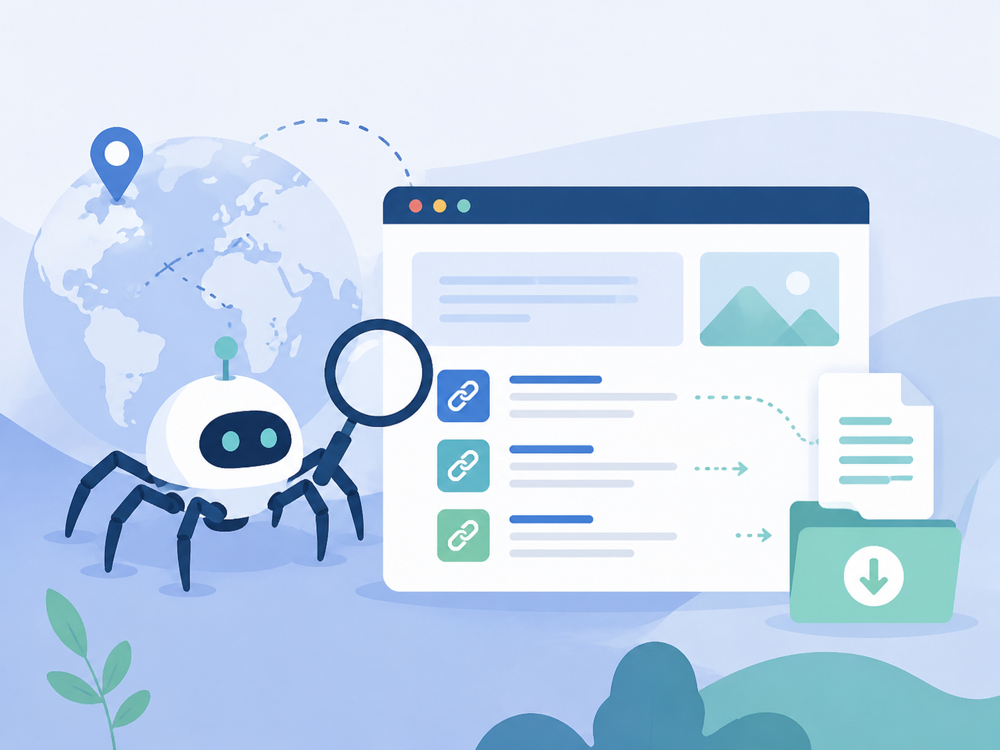
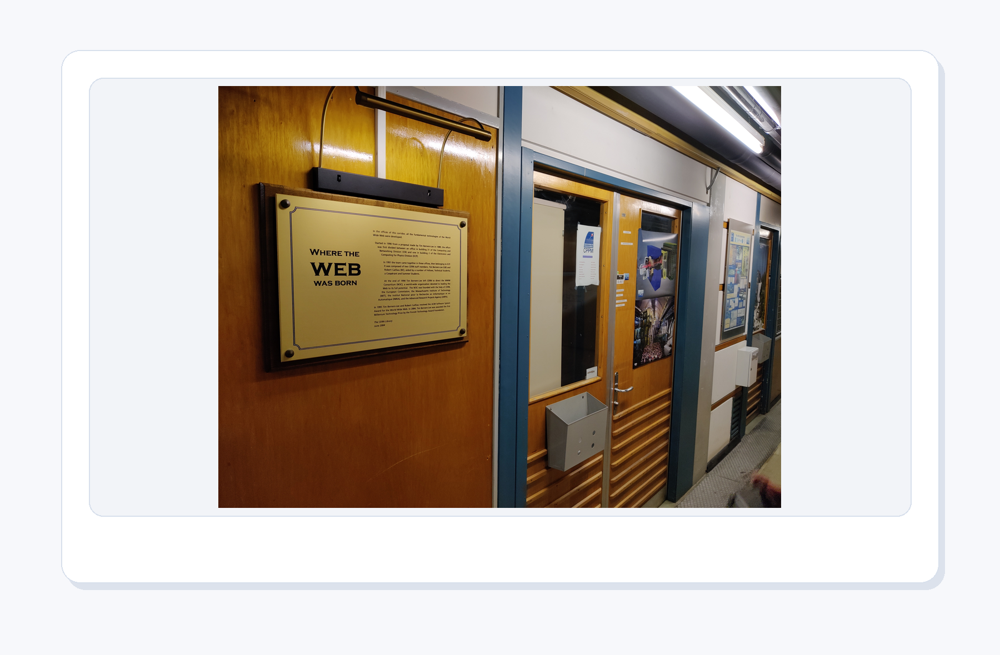
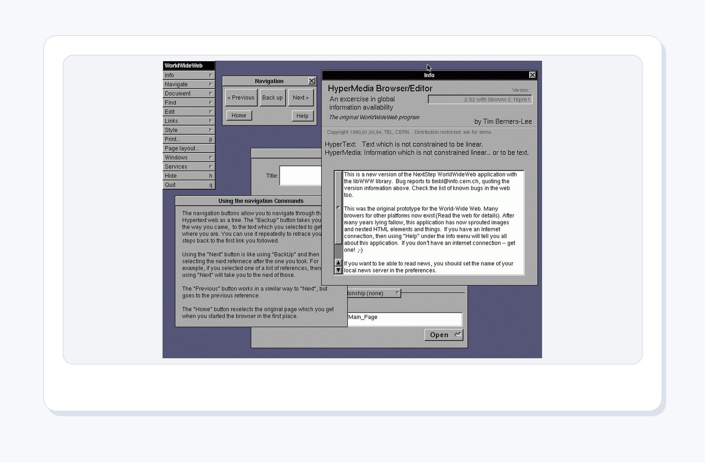
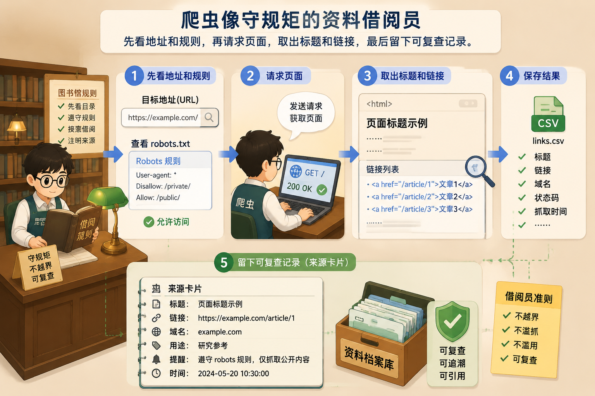
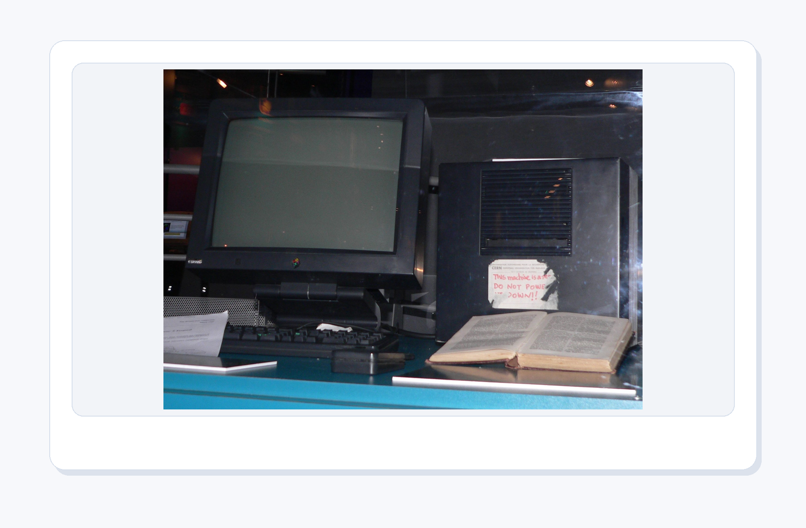
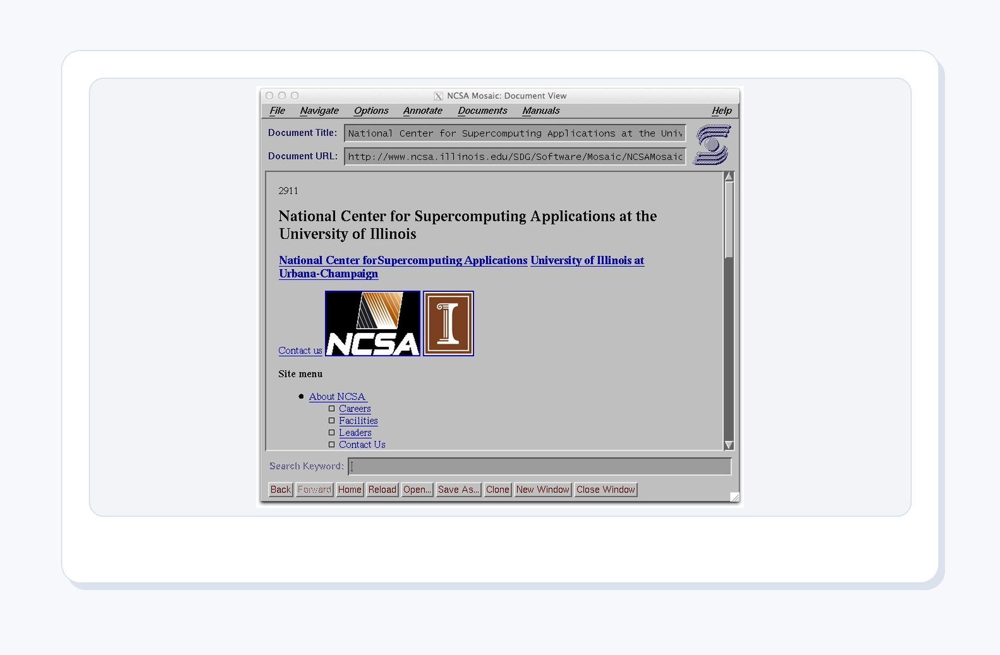
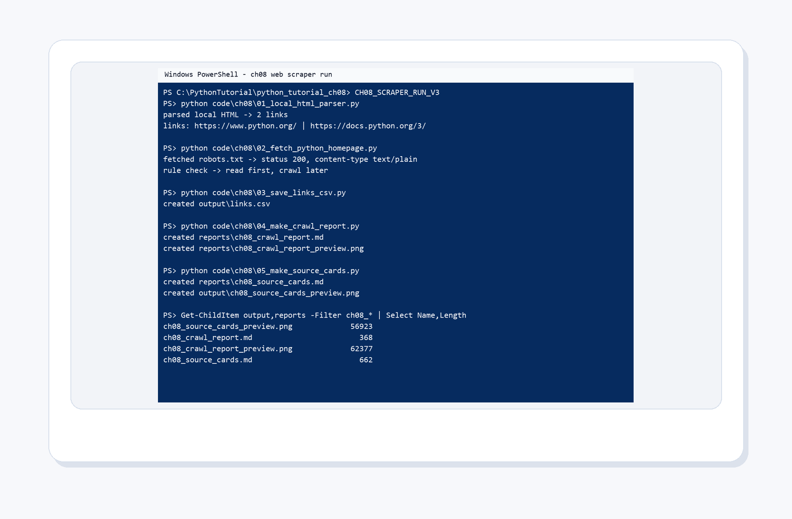
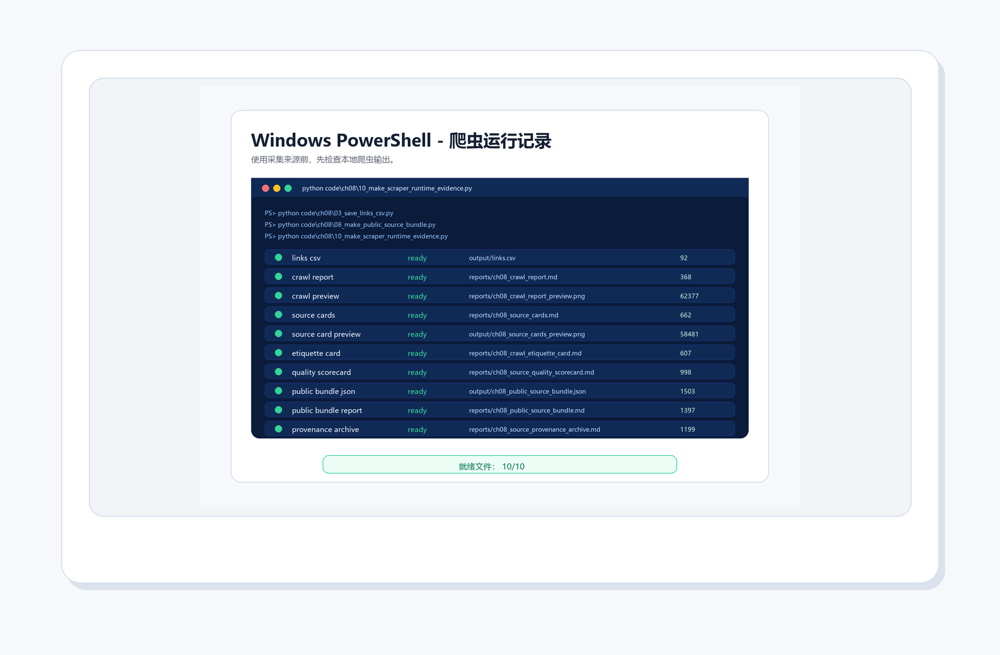
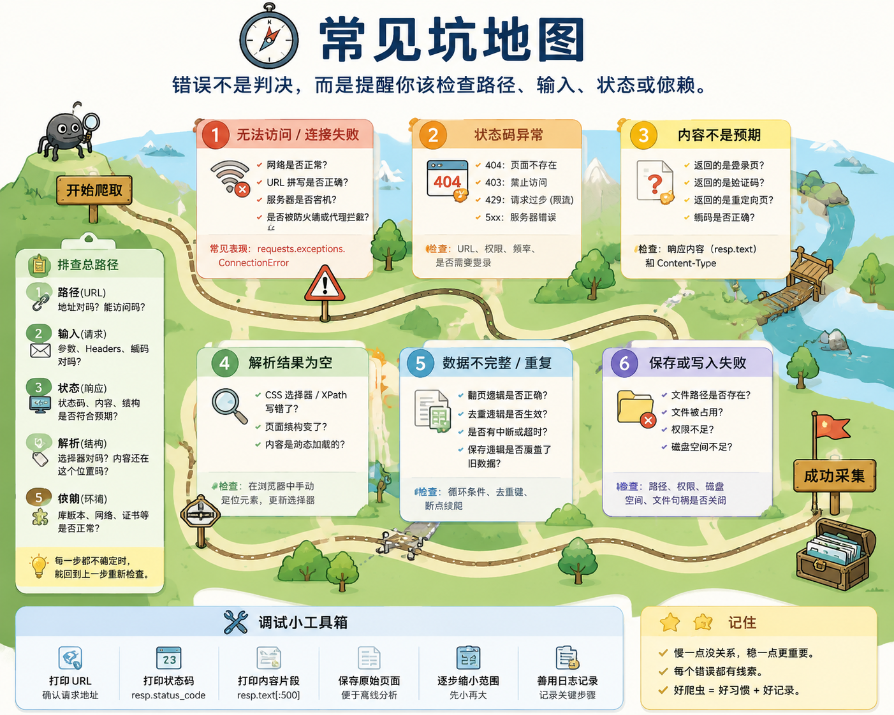

# 第 8 章：网络爬虫开发实战

[TOC]

<style>
figure {
  margin: 1.2em auto 1.8em;
  text-align: center;
}
figure img {
  max-width: 100%;
  display: block;
  margin: 0 auto;
}
figcaption {
  margin-top: 0.45em;
  color: #5f6673;
  font-size: 0.92em;
  line-height: 1.55;
}
figcaption strong {
  color: #2d3748;
}
</style>


<figure align="center">
  
  <figcaption><strong>图8-1 本章封面</strong>：浏览器是人类上网，爬虫是程序替你上网。但程序上网也要守规矩。</figcaption>
</figure>

> 本章一句话：
> **浏览器是人类上网，爬虫是程序替你上网。但程序上网也要守规矩。**

第8章继续推进“科研卡片工厂”的资料采集能力。前面几章已经能整理文件、生成图表、处理图片；这一章要做的事更像给工厂装上一扇“公开资料窗口”：从网页中识别标题、链接和规则，把能复查的材料保存下来。

这一章不追求“抓得多”，而追求“抓得对”。初学爬虫最容易兴奋过头，像第一次进大型图书馆就想把整排书架搬回家。真正成熟的做法是：先看目录和借阅规则，再拿走自己有权使用、确实需要的那几本。

---

## 本章导读：先看边界，再谈采集

### 8.0 本章学习目标

学完本章，你应该能够：

1. 用“地址、请求、结构、边界、来源记录”解释爬虫的最小工作链路。
2. 运行 `01_local_html_parser.py`，先从本地 HTML 中提取链接，避免一开始就对真实网站乱试。
3. 说清楚 Tim Berners-Lee、Vannevar Bush、WorldWideWeb、Mosaic 和 Internet Archive 为什么适合放在爬虫章。
4. 运行 `02_fetch_python_homepage.py`，理解为什么采集前要先看 `robots.txt` 和请求边界。
5. 运行本章脚本，生成链接 CSV、采集报告和来源卡片。
6. 编写并运行自己的爬虫脚本 `06_my_scraper.py`，理解从请求网页到保存结果的全链路。
7. 能结合常见坑排查爬虫错误，解释你的脚本避开了哪些坑。

### 本章分区导航

| 分区 | 对应小节 | 你要抓住的主线 | 产出证据 |
| --- | --- | --- | --- |
| 第一部分：Web 的公共空间和采集边界 | 8.1-8.3 | 爬虫不是乱抓网页，而是在地址、文档、链接和规则之间工作 | Web 历史图、核心比喻、边界故事 |
| 第二部分：把爬虫跑起来 | 8.4-8.5 | 先解析本地 HTML，再把规则、来源和证据接进科研资料整理 | PowerShell 运行图、最小示例 |
| 第三部分：概念表与脚本导览 | 8.6-8.7 | 每个爬虫概念都要对应到可运行脚本和可复查文件 | 概念表、脚本清单、报告输出 |
| 第四部分：项目与排错 | 8.8-8.9 | 自己动手写一个完整的爬虫，并学会排查常见错误 | 完整爬虫脚本、坑地图 |
| 第五部分：练习、复盘与后续连接 | 8.10-8.14 | 把采集能力迁移到学习卡片、心理学资料和报告生成 | 练习记录、自测答案、复盘模板 |

---

## 第一部分：Web 的公共空间和采集边界

### 8.1 开场故事：先有画面，再有术语

浏览器是人类上网，爬虫是程序替你上网。但程序上网也要守规矩。这句话不是为了热闹，而是为了把本章的知识放进真实使用场景。初学者最怕一上来就被术语包围，像走进一个所有门牌都用缩写写成的楼层。我们先从画面进入，再慢慢把画面翻译成代码。

<figure align="center">
  
  <figcaption><strong>图8-2 Tim Berners-Lee 的 CERN 办公室</strong>：Web 的早期故事不是“到处乱抓”，而是让文档可以被地址访问、被链接连接、被人类和程序共同读取。</figcaption>
</figure>

网页最迷人的地方，是它既给人读，也能给程序读。浏览器把 HTML 渲染成漂亮页面；爬虫则更像戴着放大镜读原始结构：哪里是标题，哪里是链接，哪里是正文。真正合格的爬虫不是“手快”，而是知道边界、知道频率、知道哪些页面不该碰。

<figure align="center">
  
  <figcaption><strong>图8-3 Tim Berners-Lee照片</strong>：Web 的伟大之处不只是“能访问”，更是让文档、地址和链接形成了可共享、可引用、可复查的知识网络。</figcaption>
</figure>

Tim Berners-Lee 的故事适合放在爬虫章开头，因为它能把初学爬虫时那种“什么都想抓回来”的兴奋感拉回正轨：Web 不是一座无人看管的仓库，而是一套用地址和链接组织知识的公共空间。爬虫要做的，不是把公共空间搬空，而是把公开、允许、必要的材料整理成可复查记录。

<figure align="center">
  
  <figcaption><strong>图8-4 Vannevar Bush 肖像</strong>：在 Web 出现之前，Bush 就想象过一种能沿着“关联路径”查资料的机器；今天的链接、收藏、引用和来源卡片，都有这条思想线的影子。</figcaption>
</figure>

1945 年，Vannevar Bush 写下《As We May Think》，想象一种叫 Memex 的知识机器：人不是按一本本书线性翻，而是沿着关联线索跳转、记录、再返回。爬虫课把这个故事接过来，并不是为了考历史，而是提醒你：链接不是“随手点的蓝色文字”，它是知识之间的道路。程序沿着道路采集资料时，也要留下路标，否则下一次回头就会迷路。

<figure align="center">
  
  <figcaption><strong>图8-5 WorldWideWeb 早期浏览器</strong>：早期浏览器把“地址、文档、链接”放在同一个画面里；爬虫正是沿着这些结构读取公开资料。</figcaption>
</figure>

如果把网页想象成城市，URL 就是门牌号，HTML 是房屋结构，链接是街道。人类用浏览器逛街，Python 用代码按门牌访问。区别在于：程序不会自动懂礼貌，所以礼貌要写进流程里。

<figure align="center">
  
  <figcaption><strong>图8-6 故事场景</strong>：爬虫像守规矩的资料借阅员：先看地址和规则，再请求页面，取出标题和链接，最后留下可复查记录。</figcaption>
</figure>

这个画面对应本章的核心比喻：爬虫像守规矩的资料借阅员：先看地址和规则，再请求页面，取出标题和链接，最后留下可复查记录。 如果你能先记住这个比喻，后面的概念就不再是干巴巴的定义。

---

### 8.2 知识路线

本章路线如下：

| 顺序 | 主题 | 你要完成的动作 |
| --- | --- | --- |
| 1 | HTTP 请求 | 用 Python 拿着 URL 去敲门，先确认服务器愿意回应 |
| 2 | HTML 结构 | 把网页从“漂亮页面”看成一棵标签树 |
| 3 | robots 和边界 | 采集前先读规则，知道哪些地方该停下 |
| 4 | 解析标题与链接 | 从 `<a>` 标签里拆出标题、地址和可复查线索 |
| 5 | 保存 CSV | 把链接清单落到文件里，避免资料只停在屏幕上 |
| 6 | 异常处理 | 给网络失败、页面变化和空结果预留退路 |
| 7 | 整合项目 | 用 `06_my_scraper.py` 把解析、请求、保存和异常处理整合成一个完整脚本 |

---

### 8.3 核心概念：从人话到术语

先用人话说：爬虫像守规矩的资料借阅员：先看地址和规则，再请求页面，取出标题和链接，最后留下可复查记录。

<figure align="center">
  
  <figcaption><strong>图8-7 CERN 第一台 Web 服务器</strong>：网页请求的背后，是客户端向服务器索取资源；爬虫只是把这件事写成程序。</figcaption>
</figure>

看到服务器照片时，可以把一次请求想象成一次非常正式的借阅：你拿着 URL 去找服务器，服务器根据规则把资源交给你。你不应该把图书馆书架整排抱走，也不应该无视门口写着“此处请勿进入”的提示。爬虫的技术能力和伦理边界必须一起学。

<figure align="center">
  
  <figcaption><strong>图8-8 NCSA Mosaic 浏览器</strong>：浏览器负责把结构渲染成人类友好的页面；爬虫则读取结构本身，适合提取标题、链接和表格。</figcaption>
</figure>

Mosaic 让早期 Web 更容易被普通人使用。对 Python 来说，页面的漂亮外观不是重点，重点是背后的标签结构。你看到网页上的蓝色链接，程序看到的是 `<a href="...">`；你看到标题很大，程序看到的是 `<h1>`、`<h2>`。这一层“从画面回到结构”的转换，就是爬虫学习的关键。

再用术语说，本章要掌握这些内容：

- **HTTP 请求**：程序拿着 URL 去服务器取资源，先看回应是否正常，再决定下一步。
- **HTML 结构**：网页不是一张整图，而是一棵标签树；标题、链接和表格都藏在结构里。
- **robots 和边界**：采集前先看门口规则，能访问不代表应该批量抓取。
- **解析标题与链接**：从页面结构里取出真正需要的资料，像从文献里摘出题名和出处。
- **保存 CSV**：把采集结果写成文件，后面才能复查、清洗、分析和引用。
- **异常处理**：网络会断、网页会改、编码会怪，程序要给失败留一条可读的说明。
- **来源卡片**：给每条链接贴上标题、域名、用途和提醒，让资料不再是一串孤零零的网址。
- **来源可信度**：先问“来自哪里、有没有边界、能否交叉验证”，再决定能不能入库。

术语不是用来吓人的，它只是为了让大家交流时不用每次都讲一长串故事。你先用故事建立直觉，再用术语压缩表达，这样学得稳。

---

## 第二部分：把爬虫跑起来

### 8.4 最小可运行示例

本章第一件事不是背参数，而是运行一个最小例子。打开终端，进入本章目录后运行：

```bash
python code/ch08/01_local_html_parser.py
```

如果你能看到输出，说明这一章的入口已经打通。后面所有复杂功能，都是在这个入口上慢慢加能力。

<figure align="center">
  
  <figcaption><strong>图8-9 PowerShell 真实运行结果</strong>：先解析本地 HTML，再读取 `robots.txt`，保存 CSV，并生成公开资料采集报告与来源卡片。</figcaption>
</figure>

这张截图故意把 `robots.txt` 放进最小示例里。因为爬虫第一课不应该是“怎么快”，而应该是“先看规则”。只有当你知道网页结构、请求边界和保存结果，后面的自动化采集才不会变成莽撞点击器。

跑完脚本以后，还需要确认这些结果真的留下来了。下面这张图就是一张采集任务的出库清单：链接 CSV、采集报告和来源卡片都要能被找到。爬虫学习最怕“屏幕上滚过去一堆字，然后什么证据都没留下”，所以本章把证据也做成一张可检查的清单图片。

<figure align="center">
  
  <figcaption><strong>图8-10 PowerShell 风格的爬虫运行证据</strong>：展示爬虫脚本产出的关键文件——链接 CSV、采集报告和来源卡片都已经生成并保存在对应目录中。</figcaption>
</figure>

这张图的价值不在“好看”，而在“可查”。以后你采集心理学资料、课程网页或科研公告时，也可以让程序最后输出一张这样的证据清单：我采了什么，保存在哪里，来源是否记录，能不能复查。

---

### 8.5 与心理学和科研资料的连接

这一章把例子贴近心理学、科研记录和学习分享，因为这些任务天然需要清晰流程：材料来自哪里，采集边界是什么，数据存到哪里，结果如何展示，别人能不能复查。

在本章里，你可以这样理解项目价值：

- 它不是孤立练习，而是科研卡片工厂的一台新设备。
- 它处理的材料可以是课程笔记、实验记录、问卷结果、图片、网页资料或报告模板。
- 它最终要留下可检查的结果，而不是只在屏幕上闪一下。

<figure align="center">
  
  <figcaption><strong>图8-11 Internet Archive 总部</strong>：公开资料采集不只是“拿到链接”，更重要的是保留来源、时间和可复查线索。</figcaption>
</figure>

科研资料最怕“我好像在哪里见过”。链接、标题、访问时间、来源说明，都是未来复查的路标。整理心理学或课程素材时，爬虫脚本不应该只把内容吸走，还要把来源写清楚。否则今天看起来很聪明，明天写报告时就会变成考古现场。

<figure align="center">
  
  <figcaption><strong>图8-12 xkcd Wisdom of the Ancients漫画</strong>：互联网上最痛的瞬间之一，是终于找到答案，却发现页面、图片或上下文已经消失了。</figcaption>
</figure>

这张梗图适合提醒本章最重要的习惯：抓取结果必须带着来源一起保存。只保存“答案”很危险，因为答案离开上下文之后，很快会变成一句来路不明的传言。保存标题、URL、访问时间、采集边界和使用提醒，才像科研材料。


把爬虫想成一次进图书馆查资料，会更容易理解边界：进门先看公告，走路轻一点，只拿任务需要的资料，摘录时写清来源，遇到“禁止进入”的牌子就停下。网络采集也是一样。`robots.txt`、请求频率、采集范围、来源记录和停止条件，不是给初学者增加难度，而是让你的程序从第一天开始就有分寸。

---

## 第三部分：概念表与脚本导览

### 8.6 关键概念拆解表

| 概念 | 人话理解 | 本章落点 |
| --- | --- | --- |
| HTTP 请求 | 程序拿着 URL 去服务器取资源——就像你给图书馆打电话说"请把这本书递给我"，对方收到请求后把内容传回来 | `02_fetch_python_homepage.py` 使用 `urllib.request` 发起请求 |
| HTML 结构 | 网页不是一张图，而是一棵可以用标签拆开的树——`<a>` 表示链接，`<h1>` 表示标题，`<p>` 表示段落。爬虫做的事就是在这棵树里找到你需要的那根树枝 | `01_local_html_parser.py` 从 `<a>` 标签里取出链接 |
| robots 和边界 | 先看门口规则，再决定能不能进入——每个网站根目录下通常有一个 `robots.txt` 文件，相当于贴在门口的告示："哪些区域欢迎爬虫，哪些区域禁止进入" | 示例读取 `https://www.python.org/robots.txt` |
| 解析标题与链接 | 从网页包裹里拆出真正需要的信息 | 本章先解析链接，后续可以扩展到标题、摘要、图片地址 |
| 保存 CSV | 采集结果要落到文件里，才能复查和分享 | `03_save_links_csv.py` 保存 `output/links.csv` |
| 异常处理 | 网络会失败，网页会变化，程序要留退路 | 后续可加入超时、状态码、重试和日志 |
| 来源卡片 | 链接要变成可判断、可引用、可复查的材料 | `05_make_source_cards.py` 生成来源卡片 |


这张表的作用，是把“我好像懂了”变成“我知道它在哪用”。学习编程时，最危险的状态不是完全不会，而是听解释时点头，自己动手时发呆。每学一个概念，都要强迫自己问一句：它在本章项目里负责哪一段工作？

上表中"HTTP 请求""HTML 结构""robots 和边界"这三个概念涉及网络协议和网页技术，可能听起来有些陌生。简单来说——**HTTP 请求**就是你的程序向远程电脑发出"请把网页内容传给我"的信号，就像你在浏览器地址栏按回车键时，浏览器替你做的第一件事；**HTML**是一套标记语言，用成对出现的标签（如 `<a>...</a>`）把网页内容组织成树状结构，爬虫程序就是沿着这棵树的树枝找到链接和文字；**`robots.txt`** 是网站管理者放在根目录下的一份简短文本文件，相当于贴在门口的告示，告诉访问者哪些区域允许访问、哪些区域禁止访问。这三个概念不理解也没关系，跟着 8.7 节的脚本动手跑一遍，看到输出结果后再回头读这个表，你会觉得它们突然变亲切了。

---

### 8.7 配套代码逐个导览

#### 脚本 1：`01_local_html_parser.py`

运行方式：

```bash
python code/ch08/01_local_html_parser.py
```

**代码做了什么**

这个脚本是本章的"零号动作"——**先不联网，只解析本地 HTML**。它内部直接定义了一段 HTML 字符串（包含一个标题和两个链接），然后用 Python 内置的 `HTMLParser` 类来解析这段字符串。

**代码结构逐段看**

1. **HTML 数据**（第 5-10 行）：脚本开头直接写了一段简短的 HTML，包含一个 `<h1>` 标题和两个 `<a>` 链接。之所以写死在代码里而不是从网络获取，是为了让初学者先排除"网络不通"这个变量，只聚焦于解析本身。
2. **自定义解析器**（第 12-17 行）：定义了一个 `LinkParser` 类，它继承自 `HTMLParser`。这个类只重写了一个方法 `handle_starttag(self, tag, attrs)`——每当解析器遇到一个 HTML 开始标签（比如 `<a>`），就会自动调用这个方法。方法内部判断：如果标签是 `a`，就把 `href` 属性值（即链接地址）添加到 `self.links` 列表中。
3. **执行解析**（第 19-20 行）：创建 `LinkParser` 实例，调用 `parser.feed(HTML)` 就像把 HTML 文本"喂"给解析器，解析器会自动遍历所有标签，遇到 `<a>` 就把链接地址收进列表。

**预期输出**

```
['https://www.python.org/', 'https://docs.python.org/3/']
```

程序会打印出从 HTML 中提取到的两个链接地址。输出虽然简单，但验证了一个核心能力：程序可以从结构化的文本中准确提取指定信息。这个能力是所有爬虫工作的起点。

**为什么放在第一个**

初学者对"爬虫"的第一反应往往是要连接真实网站。但这个脚本故意不联网，只在本地操作。它像先在纸质样张上练习摘录，确认动作稳定后再去真实网页。如果这个脚本能跑通，说明你的 Python 环境是完整的，可以继续往下走。

#### 脚本 2：`02_fetch_python_homepage.py`

运行方式：

```bash
python code/ch08/02_fetch_python_homepage.py
```

**代码做了什么**

这个脚本第一次让 Python **真正联网**——向 Python 官方网站的 `robots.txt` 地址发送请求，并把服务器返回的内容打印出来。

**代码结构逐段看**

1. **导入模块**（第 3 行）：`from urllib.request import Request, urlopen`——这是 Python 标准库中用于发送网络请求的模块，不需要额外安装。
2. **构造请求**（第 5-9 行）：创建一个 `Request` 对象，传入目标 URL `https://www.python.org/robots.txt`，并通过 `headers` 参数设置 `User-Agent`（告诉服务器"我是一个学习爬虫的 Python 脚本"）和 `Accept-Encoding`（告诉服务器"请用原始格式传输，不要压缩"）。设置请求头是一个好习惯，相当于主动打招呼，而不是偷偷摸摸地访问。
3. **发送请求并读取响应**（第 11-15 行）：`urlopen(request, timeout=10)` 向服务器发送请求并等待响应，`timeout=10` 表示最多等 10 秒，超时就报错。成功后，`response` 对象包含三个重要信息：
   - `response.status`：HTTP 状态码，200 表示成功，403 或 404 表示被拒绝或不存在。
   - `response.headers.get("Content-Type")`：返回的内容类型，`text/plain` 表示纯文本，`text/html` 表示网页。
   - `response.read(800).decode("utf-8", errors="replace")`：读取最多 800 字节的响应体，用 UTF-8 解码成可读文字。

**预期输出**

```
状态码： 200
内容类型： text/plain
User-agent: *
Disallow: /  
Allow: /
...
```

状态码是 200，表示请求成功；内容类型是 `text/plain`，说明返回的是纯文本；后面的内容就是 `robots.txt` 的具体规则，它告诉爬虫哪些路径允许访问、哪些不允许。

**为什么要请求 `robots.txt`**

这个脚本故意请求的是 `robots.txt` 而不是首页。`robots.txt` 是网站管理者放在网站根目录下的一个文本文件，相当于贴在门口的告示："哪些区域欢迎爬虫，哪些区域禁止进入"。爬虫开发的第一原则不是"能不能抓"，而是"让不让抓"——`robots.txt` 就是回答这个问题的第一步。

#### 脚本 3：`03_save_links_csv.py`

运行方式：

```bash
python code/ch08/03_save_links_csv.py
```

**代码做了什么**

前两个脚本分别完成了"解析 HTML"和"请求网页"的练习。但这个脚本回答了一个更实际的问题：**采集到的链接怎么保存**？它的做法是把链接写入 CSV 文件——一种可以用 Excel、WPS 或记事本打开的表格格式。

**代码结构逐段看**

1. **准备数据**（第 4-7 行）：在代码中定义了一个包含两个字典的列表，每个字典有 `title`（链接标题）和 `url`（链接地址）两个字段。在实际项目中，这些数据应该来自解析结果，这里先用固定数据演示保存流程。
2. **创建目录**（第 8 行）：`Path("output").mkdir(exist_ok=True)` 确保 `output/` 目录存在。如果目录已存在，`exist_ok=True` 不会报错。
3. **写入 CSV**（第 9-12 行）：用 `csv.DictWriter` 写入 CSV 文件：
   - `fieldnames=["title", "url"]` 定义了两列的表头。
   - `writer.writeheader()` 把表头写入第一行。
   - `writer.writerows(links)` 把列表中的每条数据依次写入后续行。
   - `newline=""` 和 `encoding="utf-8"` 是为了避免中文乱码和多余空行。

**预期输出**

控制台打印 `已保存 output/links.csv`，同时 `output/` 目录下会生成一个 `links.csv` 文件，内容大致如下：

```csv
title,url
Python 官网,https://www.python.org/
Python 文档,https://docs.python.org/3/
```

**为什么 CSV 比直接打印更有用**

直接 `print(links)` 也能看到结果，但关闭终端后就消失了。写入 CSV 文件意味着：数据可以被后续脚本读取、可以被其他工具打开、可以被存档复查。爬虫不是看到链接就结束，只有把结果落到文件里，资料才真正进入卡片工厂。

**建议节奏**

第一次运行时不要急着改代码。先原样运行，确认能看到输出；第二次再改一个最小参数，比如增加一条链接；第三次再尝试把输出写入 `output/` 或 `reports/`。这种节奏比"一上来就大改"更稳。

#### 脚本 4：`04_make_crawl_report.py`

运行方式：

```bash
python code/ch08/04_make_crawl_report.py
```

**代码做了什么**

前一个脚本（`03_save_links_csv.py`）已经能把链接保存为 CSV。但这个脚本走得更远一步：**读取 CSV 文件，生成一份格式化的采集报告**（Markdown 文档 + 预览图片）。

**代码结构逐段看**

1. **读取 CSV**（`load_links` 函数，第 15-18 行）：用 `csv.DictReader` 读取 `output/links.csv` 文件，返回一个字典列表。注意这里先检查文件是否存在——如果不存在，会提示你先运行前一个脚本。这是工程中很重要的"前置依赖检查"。
2. **生成 Markdown 报告**（`make_markdown_report` 函数，第 32-51 行）：在报告中写入采集边界说明（先解析本地 HTML、先看 robots.txt 等），然后以表格形式列出所有链接的标题和 URL。Markdown 文件保存在 `reports/ch08_crawl_report.md`，可以用任何文本编辑器或网页浏览器查看。
3. **生成预览图片**（`make_preview` 函数，第 53-83 行）：用 `PIL`（Pillow 库）创建一个 1500×900 像素的图片。代码中逐行绘制背景、标题、副标题、链接卡片（每个链接带序号、标题和 URL），最后加上检查点提示。这张图片可以让报告"一眼看到全貌"，适合放在学习笔记或项目文档中。

**预期输出**

- `reports/ch08_crawl_report.md`：一个 Markdown 文件，包含采集边界说明和链接表格。
- `reports/ch08_crawl_report_preview.png`：一张预览图片，用卡片样式展示每个链接。

**为什么报告比 CSV 更重要**

CSV 适合给程序读取，但 Markdown 报告和预览图片更适合给**人**阅读。它的意义是把"我抓到了几个链接"升级为"我留下了一份可复查的采集报告"。报告里会写清采集边界、链接清单和检查点，这比单独一个 CSV 更像真正的科研资料整理流程。

#### 脚本 5：`05_make_source_cards.py`

运行方式：

```bash
python code/ch08/05_make_source_cards.py
```

**代码做了什么**

这个脚本在"采集报告"的基础上再往前走一步：**给每条链接打上可信度标签**。它读取 `output/links.csv`，根据链接的域名自动分类——是官方文档、教育机构、开放百科，还是普通网页——然后生成来源卡片式的报告和预览图片。

**代码结构逐段看**

1. **读取链接**（`load_links` 函数，第 45-57 行）：从 `output/links.csv` 读取数据，兼容 `text` 或 `title`、`url` 或 `href` 等不同的列名。如果 CSV 文件不存在，会自动创建一个示例 CSV（`ensure_sample_csv` 函数），方便首次运行时也能看到效果。
2. **自动分类**（`classify` 函数，第 59-65 行）：用 `urlparse` 提取链接的域名，然后按规则判断：
   - `python.org` 或 `.edu` 结尾 → "高可信"（官方/教育来源）
   - `wikipedia.org` 或 `wikimedia.org` → "需交叉验证"（开放百科来源）
   - 其他 → "待检查"（普通网页来源）
   
   这个分类逻辑虽然简单，但它演示了一个关键思维：**不是所有链接的可信度都一样**。在心理学等学科的资料采集中，区分来源类型是第一步。
3. **生成 Markdown 卡片**（`make_markdown` 函数，第 67-87 行）：以表格形式列出每条链接的标题、域名、可信度、使用提醒和 URL，并在末尾附上"采集前自检"的三个问题。
4. **生成预览图片**（`make_preview` 函数，第 89-120 行）：用不同颜色区分可信度（绿色=高可信、橙色=需交叉验证、紫色=待检查），让分类结果一目了然。

**预期输出**

- `reports/ch08_source_cards.md`：来源卡片报告，每行一条链接带可信度标签。
- `output/ch08_source_cards_preview.png`：卡片样式的预览图，颜色区分可信度。

**为什么需要来源卡片**

它把"链接列表"升级成"来源卡片"：标题是什么、域名是什么、可信度如何、引用前要注意什么。对学习者来说，这一步很像给资料贴标签；对科研写作来说，这一步是在给未来的引用和复查铺路。

---

## 第四部分：项目与排错

### 8.8 常见坑

<figure align="center">
  
  <figcaption><strong>图8-13 常见坑地图</strong>：错误不是判决，而是提醒你该检查路径、输入、状态或依赖。</figcaption>
</figure>

初学者写爬虫时最容易踩的坑，往往不是语法不会，而是忽略了爬虫工作的真实环境：网络会断、网页会改、编码会乱、规则会变。下面列出本章最常见的六个坑，每个都附带原因分析、典型表现和解决方案。

---

#### 坑 1：不读 `robots.txt`，上来就抓

**原因**：初学爬虫时，很容易把注意力放在"怎么把网页内容取回来"的技术问题上，忽略了网站是否允许采集。就像第一次进图书馆，不抬头看公告牌，直接冲到书架前开始搬书。

**典型表现**：写了一个循环请求脚本，对着同一个网站连续发送几十次请求，结果 IP 被临时封禁，或者收到 403 Forbidden 响应。

**解决方案**：
- 在采集任何网站之前，先访问该网站的 `https://example.com/robots.txt`，查看哪些路径允许访问、哪些禁止访问。
- 如果 `robots.txt` 中明确写了 `Disallow: /`，表示整个网站都不欢迎爬虫，请尊重这个规则，寻找其他替代来源。
- 养成习惯：把你的爬虫脚本的 User-Agent 设置成有意义的标识，而不是默认的 Python-urllib，这样网站管理者在日志中能识别到你。示例：`Request(url, headers={"User-Agent": "LearningScraper/1.0 (educational project)"})`。

---

#### 坑 2：请求频率太高，被服务器拒绝

**原因**：脚本中用了循环或递归，连续向同一台服务器发送请求，中间没有等待间隔。服务器会认为这是攻击行为或异常流量，从而拒绝后续请求。

**典型表现**：前几次请求返回 200，后面突然全部返回 429 Too Many Requests 或 503 Service Unavailable。更严重的情况下，IP 可能被加入黑名单，短时间内无法访问该网站。

**解决方案**：
- 在请求之间加入 `time.sleep()` 停顿。即使是 1-2 秒的间隔，也能显著降低服务器压力。
- 如果采集任务需要大量请求，把请求分散到不同时段，避免集中在几分钟内完成。
- 学习使用指数退避（exponential backoff）策略：第一次失败后等 1 秒重试，第二次等 2 秒，第三次等 4 秒，以此类推。
- 一个简单的节奏控制示例：

```python
import time
import random

urls = ["https://example.com/page1", "https://example.com/page2", ...]
for url in urls:
    response = urlopen(url, timeout=10)
    # 处理响应...
    time.sleep(random.uniform(1, 3))  # 每次请求后随机等待 1-3 秒
```

这个示例用 `random.uniform(1, 3)` 制造 1 到 3 秒的随机等待，比固定等待更接近人类浏览行为，能降低被识别为爬虫的概率。

---

#### 坑 3：把浏览器渲染后的页面和 HTML 源码混为一谈

**原因**：现代网页往往大量使用 JavaScript 动态生成内容。你在浏览器中看到的页面，是 HTML 加载后经过 JavaScript 执行、DOM 操作、API 异步请求之后才渲染完成的。而 Python 的 `urllib` 只获取原始的 HTML 源码，不会执行任何 JavaScript。如果你把浏览器看到的"完整页面"当作爬虫能直接获取的内容，就一定会遇到"明明浏览器上有，但爬虫就是取不到"的困惑。

**典型表现**：用 `urlopen` 获取页面后，发现返回的 HTML 中没有你在浏览器中看到的那些内容——列表是空的、表格不见了、关键数据字段没有出现。查看源码后发现只有 `<div id="app"></div>` 这样的空壳标签。

**解决方案**：
- 在写爬虫之前，先用浏览器的"查看网页源代码"功能确认你需要的文字或链接是否直接在 HTML 源码中存在。如果存在，用 Python 解析即可；如果不存在（而是通过 JavaScript 动态加载的），则说明这个页面不适合用基本的请求工具采集。
- 对于动态加载的页面，有两个出路：一是检查页面是否有提供 JSON 数据接口（很多网站有隐藏的 API），二是使用 Selenium 或 Playwright 这类能运行 JavaScript 的浏览器自动化工具。但后者超出了本章范围。
- 一个判断技巧：在浏览器中右键查看"网页源代码"（不是检查元素），用 Ctrl+F 搜索你需要的文字。如果在源码中找不到，就说明内容是 JS 动态生成的。

---

#### 坑 4：编码处理不当，中文变成乱码

**原因**：网页的编码方式不统一。有些网站用 UTF-8，有些用 GBK，有些用 Latin-1。如果用错误的编码去解码网页内容，就会看到一堆乱码，比如 `测试` 或 `涓枃` 这样的文字。

**典型表现**：打印出来的网页内容中，中文字符全部变成不可读的符号。或者写入 CSV 文件后，用 Excel 打开时中文显示为乱码。

**解决方案**：
- 在解析响应内容之前，先检查服务器返回的 `Content-Type` 头中的 `charset` 字段，它指明了网页的编码方式。例如 `Content-Type: text/html; charset=utf-8`。
- Python 的 `urlopen` 返回的响应对象可以这样获取编码信息：

```python
response = urlopen(request, timeout=10)
content_type = response.headers.get("Content-Type")
print(content_type)  # 可能输出: text/html; charset=utf-8
```

- 如果 `Content-Type` 中没有指明编码，可以尝试从 HTML 的 `<meta>` 标签中查找，比如 `<meta charset="utf-8">` 或 `<meta http-equiv="Content-Type" content="text/html; charset=gbk">`。
- 写入 CSV 时务必指定 `encoding="utf-8-sig"`，这个编码会在文件开头写入 BOM 标记，确保 Excel 能正确识别 UTF-8 中文：

```python
with open("output/links.csv", "w", newline="", encoding="utf-8-sig") as f:
    writer = csv.DictWriter(f, fieldnames=["title", "url"])
    writer.writeheader()
    writer.writerows(links)
```

`utf-8-sig` 和 `utf-8` 的区别在于前者添加了 BOM 头（字节顺序标记），Excel 依赖这个标记来识别 UTF-8 编码文件；如果没有 BOM，Excel 会按系统默认编码打开，中文很可能是乱码。

---

#### 坑 5：网络超时和连接中断没有处理

**原因**：网络请求是不可靠的。服务器可能过载、你的网络可能波动、路由器可能丢包。如果脚本不做超时和异常处理，一旦网络出现问题，整个程序就会崩溃退出。

**典型表现**：脚本运行到一半突然报错 `TimeoutError: timed out` 或 `URLError: <urlopen error [Errno 110] Connection timed out>`，程序停止，已经采集到的数据也可能丢失。

**解决方案**：
- 在 `urlopen()` 中始终设置 `timeout` 参数，比如 `timeout=10` 表示最多等待 10 秒。
- 用 `try-except` 包裹网络请求代码，捕获 `urllib.error.URLError` 和 `socket.timeout` 异常。
- 在异常处理中记录失败信息，而不是直接 `pass` 忽略。示例：

```python
import socket
import urllib.error
from urllib.request import urlopen, Request

url = "https://example.com/somepage"
try:
    response = urlopen(Request(url), timeout=10)
    html = response.read().decode("utf-8", errors="replace")
except urllib.error.HTTPError as e:
    print(f"HTTP 错误：{e.code} - {e.reason}")
except urllib.error.URLError as e:
    print(f"URL 错误：{e.reason}")
except socket.timeout:
    print(f"请求超时：{url}")
```

这个异常处理金字塔从最具体的 `HTTPError` 到最通用的 `socket.timeout`，确保每种错误都有对应的处理路径。

---

#### 坑 6：文件路径写死，换目录就找不到文件

**原因**：脚本中使用了相对路径或硬编码路径，比如 `open("links.csv")` 或 `open("output/links.csv")`。当你在另一个目录下运行脚本时，Python 的当前工作目录变了，这些相对路径就会失效。

**典型表现**：在本章目录下运行脚本一切正常，但如果在项目根目录或其他位置运行，报错 `FileNotFoundError: [Errno 2] No such file or directory`。

**解决方案**：
- 使用 `pathlib.Path` 来处理路径，不要用字符串拼接。
- 在脚本开头用 `__file__` 获取脚本自身所在的目录，然后基于它构建路径：

```python
from pathlib import Path

# 获取当前脚本所在的目录
SCRIPT_DIR = Path(__file__).resolve().parent
# 基于脚本目录构建输出路径
OUTPUT_DIR = SCRIPT_DIR / "output"
REPORTS_DIR = SCRIPT_DIR / "reports"
```

`Path(__file__).resolve()` 会将相对路径解析为绝对路径，确保无论在哪个目录运行脚本，路径都能正确指向脚本所在的位置。这样做以后，你的脚本在任意工作目录下都能正确找到输入文件和输出目录。

---

**通用排错流程**：

遇到错误时，按以下顺序排查，能解决 90% 的问题：

1. **看报错信息**：Python 的报错信息已经告诉了你问题在哪里——`FileNotFoundError` 是路径问题，`SyntaxError` 是语法问题，`ModuleNotFoundError` 是模块缺失。不要跳过错误信息直接猜测。
2. **看文件路径**：确认你要读取的文件确实存在于指定的路径下。在终端里用 `ls`（Linux/macOS）或 `dir`（Windows）查看目录内容。
3. **看输入数据**：如果脚本能运行但输出不对，检查输入数据是否符合预期。例如 CSV 文件是否为空、列名是否匹配、数据是否包含无效字符。
4. **搜解决方案**：把完整的报错信息复制到搜索引擎中搜索，大概率已经有人遇到过同样的错误。
5. **问 AI 工具**：把报错信息和相关代码片段发给 AI 助手，说明你的预期是什么、实际得到了什么，通常几分钟就能定位问题。

不要一报错就重装 Python 或删除 `venv` 重新创建环境。绝大多数初学者遇到的错误和环境无关，重装环境只会浪费时间，不会解决根本问题。

---

### 8.9 本章小项目：编写你自己的爬虫脚本

前面的 8.7 节已经逐个讲解并运行了五个配套脚本。现在是时候把这些概念整合起来——**自己动手写一个完整的爬虫脚本**。

这个项目与前面脚本的区别在于：你不再只是"运行别人写好的代码"，而是从一个空白文件开始，跟着下面的指引，亲手写出一个能联网、能解析、能保存的完整爬虫。

---

#### 项目目标

写一个名为 `06_my_scraper.py` 的 Python 脚本，让它完成以下工作：

1. 向一个 URL 发送 HTTP 请求，获取网页内容
2. 解析 HTML，提取页面中所有链接的标题和 URL
3. 把结果保存到 CSV 文件
4. 处理可能出现的错误（网络超时、请求失败、编码问题）
5. 在终端打印执行摘要

---

#### 完整代码

完整的脚本已经放在 `code/ch08/06_my_scraper.py`，可以直接运行。建议你打开该文件阅读代码，它分成四个清晰的部分：

- **第一部分（HTML 解析器）**：`LinkParser` 类继承自 `HTMLParser`，每当遇到 `<a>` 标签时提取 `href` 属性值。
- **第二部分（请求网页）**：`fetch_page` 函数设置自定义 User-Agent，用 `try-except` 捕获 HTTP 错误、URL 错误和超时异常。
- **第三部分（保存到 CSV）**：`save_to_csv` 函数用 `pathlib.Path` 处理路径，用 `utf-8-sig` 编码确保 Excel 能正常打开中文。
- **第四部分（主程序）**：`main` 函数串联前三部分，并用列表推导式 `[link for link in all_links if link.startswith("http")]` 过滤掉内部跳转链接。

---

#### 如何运行

创建一个新文件 `code/ch08/06_my_scraper.py`，把上述代码敲进去，或者在终端中直接运行已提供的脚本：

```bash
python code/ch08/06_my_scraper.py
```

预期输出类似：

```
开始采集：https://docs.python.org/3/
────────────────────────────────────────
请求成功：200 https://docs.python.org/3/
共找到 186 条链接
其中有效链接 42 条，已过滤内部跳转
已保存 42 条链接到 output/06_my_scraper_links.csv
────────────────────────────────────────
采集摘要
  目标网址：https://docs.python.org/3/
  找到链接：186 条
  有效链接：42 条
  保存位置：output/06_my_scraper_links.csv
采集完成！
```

数字会因网页变化而不同，但如果能看到类似的输出结构，说明你的第一个完整爬虫已经跑通了。

---

#### 动手改造

脚本跑通之后，试着修改以下几个地方，观察输出变化：

1. **换一个目标网址**：把 `target_url` 改成 `https://www.wikipedia.org/` 或 `https://news.ycombinator.com/`，观察链接数量和类型的变化。不同的网站，HTML 结构差异很大，你的爬虫能适应吗？

2. **增加标题提取**：`LinkParser` 目前只提取 `href` 属性。能不能在 `handle_starttag` 中再增加一个变量 `self.titles`，用来存储链接的显示文本？提示：链接的显示文本在 `<a>显示文本</a>` 中，这可以通过重写 `handle_data` 方法来实现。

3. **增加请求间隔**：如果你要采集多个页面，在 `fetch_page` 函数返回之前加入 `time.sleep(1)`，让每次请求之间间隔 1 秒。测试一下，看看加入停顿后运行节奏的变化。

4. **故意制造错误**：把 `target_url` 改成 `https://example.com/nonexistent-page`，观察程序如何处理 404 错误。再把 `timeout` 改成 `0.001` 秒，观察超时处理是否生效。

---

#### 项目结构

把你自己写的脚本放进来后，项目结构如下：

```text
python_card_factory/
├── code/
│   └── ch08/
│       ├── 01_local_html_parser.py
│       ├── 02_fetch_python_homepage.py
│       ├── 03_save_links_csv.py
│       ├── 04_make_crawl_report.py
│       ├── 05_make_source_cards.py
│       └── 06_my_scraper.py          ← 你自己的爬虫
├── output/
│   └── 06_my_scraper_links.csv      ← 你的爬虫输出的结果
├── reports/
└── assets/
```

---

#### 完成标准

1. 能编写并运行 `06_my_scraper.py`，看到完整的采集输出。
2. 能说出脚本四个部分各自负责什么功能。
3. 能把目标 URL 换成其他网站，并成功采集链接。
4. 能在报错时根据错误信息判断是网络问题、路径问题还是代码逻辑问题。
5. 能结合 8.8 节的常见坑，说出你的脚本避开了哪些坑。

---

## 第五部分：练习、复盘与后续连接

### 8.10 练习任务

1. 修改 `06_my_scraper.py` 中的 `target_url` 为其他网站，观察输出变化。
2. 修改 `06_my_scraper.py`，让它在保存 CSV 之前先按字母顺序排序链接。
3. 故意把 `target_url` 改成无效地址（如 `https://不存在.com`），记录报错信息并说明是哪个异常捕获了它。
4. 在 `06_my_scraper.py` 的 `main()` 函数中加入 `try-except`，捕获 `KeyboardInterrupt`（用户按 Ctrl+C 时触发），让程序优雅退出。
5. 把 `06_my_scraper.py` 的输出文件路径改为 `reports/` 目录，并重新运行。
6. 结合 8.8 节常见坑，检查 `06_my_scraper.py` 是否已经避开了坑 1（robots.txt）、坑 2（请求频率）、坑 5（超时处理）和坑 6（路径写死）。如果还没避开，请修改代码。

---

### 8.11 自测问题

1. 本章最重要的三个概念是什么？请用人话解释，不要只背术语。
2. `06_my_scraper.py` 中用了哪几种异常处理？它们分别对应什么场景？
3. 如果脚本运行失败，你第一步会检查路径、环境、依赖还是语法？为什么？
4. `06_my_scraper.py` 中过滤链接时为什么要用 `startswith("http")`？如果不加这个过滤会怎样？
5. 你能不能把 `06_my_scraper.py` 改成一个采集心理学公开资料链接的小工具？需要修改哪些部分？

参考回答不唯一。判断自己是否真的理解，可以看你能不能把答案讲给一个完全没学过本章的人听。

---

### 8.12 学习复盘模板

可以自己总结，也可以从这几个角度写：

- 你写的 `06_my_scraper.py` 能做什么、不能做什么？
- 你在 8.8 节的六个坑中亲身遇到了几个？是怎么解决的？
- 修改 `target_url` 后，你观察到哪些意外情况（链接变多/变少、编码报错、结构变化）？

在 `reports/ch08_review.md` 中写下：

```markdown
# 第8章复盘

## 我新增的能力
- 

## 我跑通的脚本
- 

## 我遇到的报错
- 报错信息：
- 原因：
- 修复方式：

## 我能迁移到哪里
- 心理学实验：
- 学习分享：
- 科研资料整理：
```

复盘不是写作文，而是给未来的自己留路标。你现在记录清楚，后面做综合项目时就不用重新从记忆里翻箱倒柜。

---

### 8.13 与后续章节的连接

本章不是孤岛。它和整套教程的关系可以这样理解：

- 前面章节提供基础：环境、数据结构、文件管理。
- 本章提供一项新能力：编写自己的爬虫脚本，能从网页中提取链接并保存为结构化数据。
- 后面章节会把这项能力继续接到数据分析、图像处理、报告生成和办公自动化里。

所以不要只问“这一章考试考什么”。更好的问题是：它能帮我少做哪一类重复劳动？它能让我的学习材料、实验记录或报告更稳定吗？

---

### 8.14 本章总结

网络爬虫开发实战的关键不是“记住所有 API”，而是理解它解决的问题。你已经从概念、图像、代码和小项目四个角度接触了本章内容。下一次复习时，不要只问“我会不会背”，而要问：

- 我能不能自己写出一个能联网、能解析、能保存的爬虫脚本？
- 我能不能说出 `06_my_scraper.py` 四个部分的职责和它们之间的数据流动？
- 我能不能根据报错信息判断是网络问题还是代码问题？
- 我能不能把这个爬虫改造成采集心理学、课程笔记或科研资料的实用工具？

如果答案是肯定的，这一章就不是看过了，而是真的进入你的工具箱了。

真正会写爬虫的人，不只是会把网页内容拿下来，还知道什么时候慢一点、少一点、停一下。能抓到链接是技术，能保留来源是习惯，能尊重边界是专业。如果你用本章的知识写了一个属于自己的爬虫脚本，哪怕只有几十行，你都已经走上了“写得清楚、写得有据、写得让未来的自己能复查”的路。