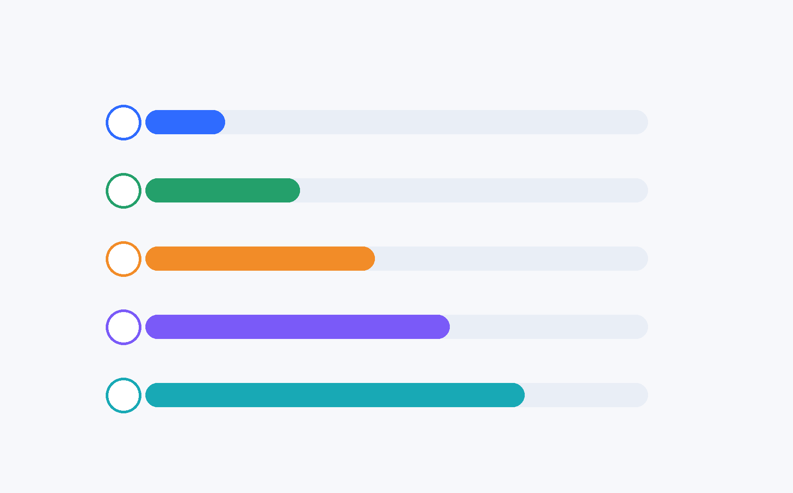
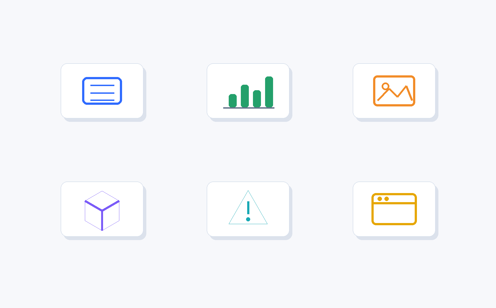
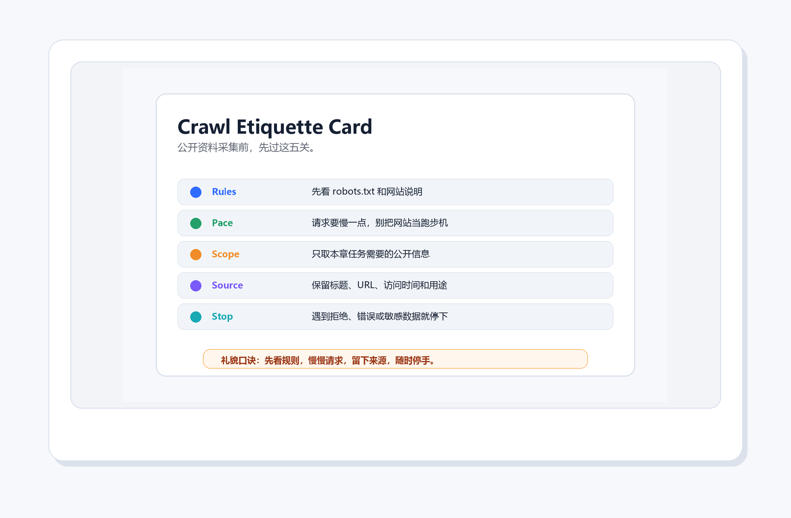
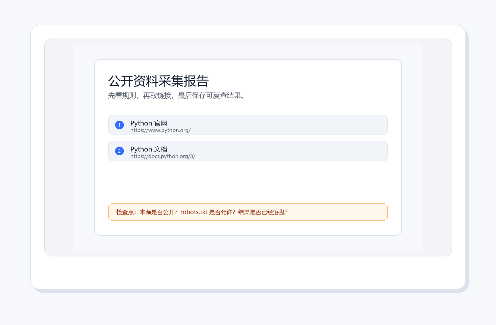
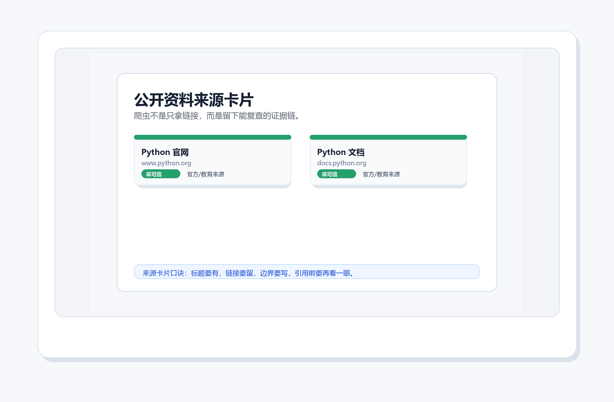
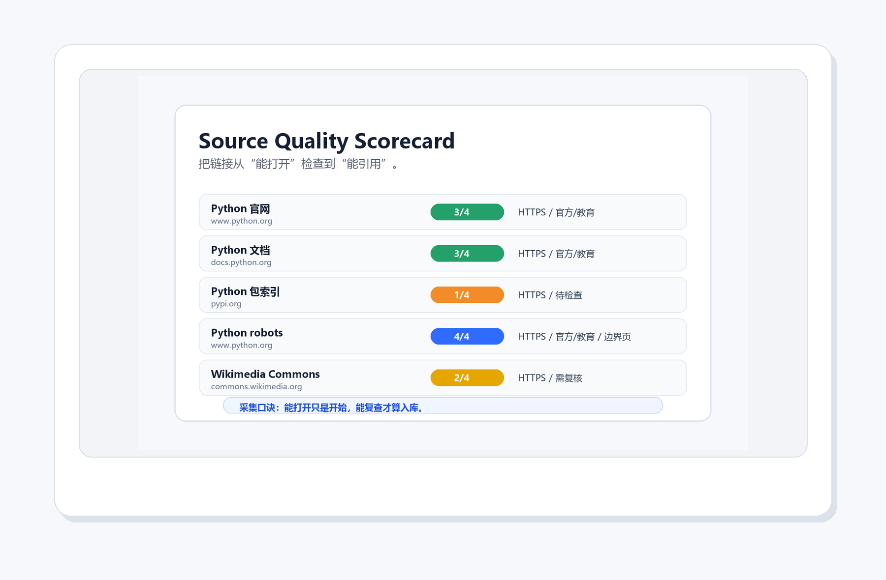
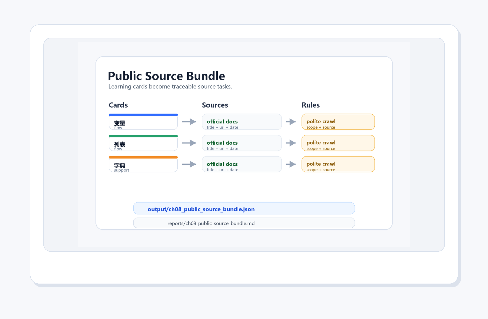
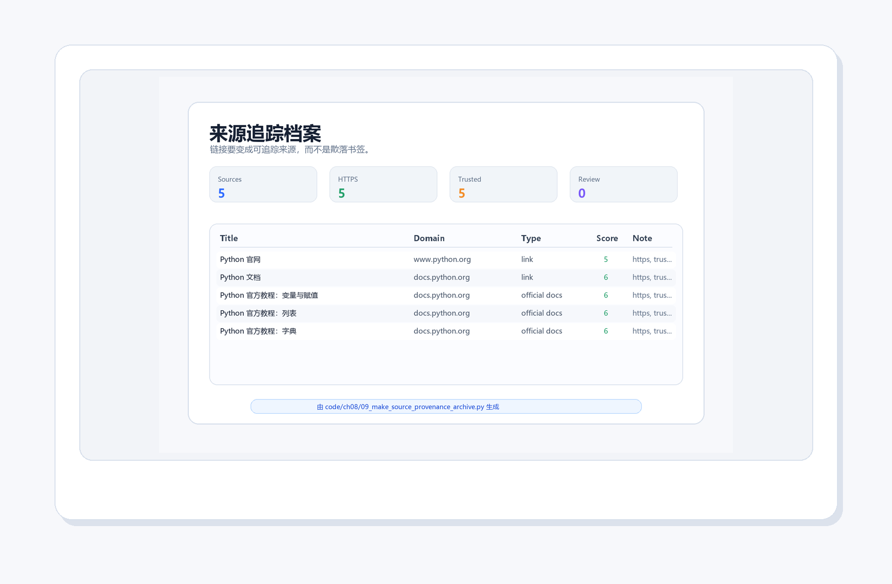

# 第 8 章：网络爬虫开发实战

[TOC]

<style>
figure {
  margin: 1.2em auto 1.8em;
  text-align: center;
}
figure img {
  max-width: 100%;
  display: block;
  margin: 0 auto;
}
figcaption {
  margin-top: 0.45em;
  color: #5f6673;
  font-size: 0.92em;
  line-height: 1.55;
}
figcaption strong {
  color: #2d3748;
}
</style>


<figure align="center">
  
  <figcaption><strong>图8-1 本章封面</strong>：浏览器是人类上网，爬虫是程序替你上网。但程序上网也要守规矩。</figcaption>
</figure>

> 本章一句话：
> **浏览器是人类上网，爬虫是程序替你上网。但程序上网也要守规矩。**

第8章继续推进“科研卡片工厂”的资料采集能力。前面几章已经能整理文件、生成图表、处理图片；这一章要做的事更像给工厂装上一扇“公开资料窗口”：从网页中识别标题、链接和规则，把能复查的材料保存下来。

这一章不追求“抓得多”，而追求“抓得对”。初学爬虫最容易兴奋过头，像第一次进大型图书馆就想把整排书架搬回家。真正成熟的做法是：先看目录和借阅规则，再拿走自己有权使用、确实需要的那几本。

---

## 本章导读：先看边界，再谈采集

### 8.0 本章学习目标

学完本章，你应该能够：

1. 用“地址、请求、结构、边界、来源记录”解释爬虫的最小工作链路。
2. 运行 `01_local_html_parser.py`，先从本地 HTML 中提取链接，避免一开始就对真实网站乱试。
3. 说清楚 Tim Berners-Lee、Vannevar Bush、WorldWideWeb、Mosaic 和 Internet Archive 为什么适合放在爬虫章。
4. 运行 `02_fetch_python_homepage.py`，理解为什么采集前要先看 `robots.txt` 和请求边界。
5. 运行本章脚本，生成链接 CSV、采集报告、来源卡片、礼仪检查卡、来源质量评分、公开资料包、来源追踪档案和运行记录。
6. 完成本章小项目：**公开资料采集器**，并能解释它如何接住 ch7 的复习卡片。

### 本章分区导航

| 分区 | 对应小节 | 你要抓住的主线 | 产出记录 |
| --- | --- | --- | --- |
| 第一部分：Web 的公共空间和采集边界 | 8.1-8.3 | 爬虫不是乱抓网页，而是在地址、文档、链接和规则之间工作 | Web 历史图、核心比喻、边界故事 |
| 第二部分：把爬虫跑起来 | 8.4-8.5 | 先解析本地 HTML，再把规则、来源和记录接进科研资料整理 | PowerShell 运行图、运行记录、礼仪检查卡 |
| 第三部分：概念表与脚本导览 | 8.6-8.7 | 每个爬虫概念都要对应到可运行脚本和可复查文件 | 概念表、脚本清单、报告输出 |
| 第四部分：排错、项目与来源记录 | 8.8-8.9 | 公开资料采集器要能保存来源、评估可信度、形成追踪档案 | 坑地图、项目面板、来源卡片、追踪档案 |
| 第五部分：练习、复盘与后续连接 | 8.10-8.14 | 把采集能力迁移到学习卡片、心理学资料和报告生成 | 练习记录、自测答案、复盘模板 |

---

## 第一部分：Web 的公共空间和采集边界

### 8.1 开场故事：先有画面，再有术语

浏览器是人类上网，爬虫是程序替你上网。但程序上网也要守规矩。这句话不是为了热闹，而是为了把本章的知识放进真实使用场景。初学者最怕一上来就被术语包围，像走进一个所有门牌都用缩写写成的楼层。我们先从画面进入，再慢慢把画面翻译成代码。

<figure align="center">
  
  <figcaption><strong>图8-2 Tim Berners-Lee 的 CERN 办公室</strong>：Web 的早期故事不是“到处乱抓”，而是让文档可以被地址访问、被链接连接、被人类和程序共同读取。</figcaption>
</figure>

网页最迷人的地方，是它既给人读，也能给程序读。浏览器把 HTML 渲染成漂亮页面；爬虫则更像戴着放大镜读原始结构：哪里是标题，哪里是链接，哪里是正文。真正合格的爬虫不是“手快”，而是知道边界、知道频率、知道哪些页面不该碰。

<figure align="center">
  
  <figcaption><strong>图8-3 Tim Berners-Lee照片</strong>：Web 的伟大之处不只是“能访问”，更是让文档、地址和链接形成了可共享、可引用、可复查的知识网络。</figcaption>
</figure>

Tim Berners-Lee 的故事适合放在爬虫章开头，因为它能把初学爬虫时那种“什么都想抓回来”的兴奋感拉回正轨：Web 不是一座无人看管的仓库，而是一套用地址和链接组织知识的公共空间。爬虫要做的，不是把公共空间搬空，而是把公开、允许、必要的材料整理成可复查记录。

<figure align="center">
  
  <figcaption><strong>图8-4 Vannevar Bush 肖像</strong>：在 Web 出现之前，Bush 就想象过一种能沿着“关联路径”查资料的机器；今天的链接、收藏、引用和来源卡片，都有这条思想线的影子。</figcaption>
</figure>

1945 年，Vannevar Bush 写下《As We May Think》，想象一种叫 Memex 的知识机器：人不是按一本本书线性翻，而是沿着关联线索跳转、记录、再返回。爬虫课把这个故事接过来，并不是为了考历史，而是提醒你：链接不是“随手点的蓝色文字”，它是知识之间的道路。程序沿着道路采集资料时，也要留下路标，否则下一次回头就会迷路。

<figure align="center">
  
  <figcaption><strong>图8-5 WorldWideWeb 早期浏览器</strong>：早期浏览器把“地址、文档、链接”放在同一个画面里；爬虫正是沿着这些结构读取公开资料。</figcaption>
</figure>

如果把网页想象成城市，URL 就是门牌号，HTML 是房屋结构，链接是街道。人类用浏览器逛街，Python 用代码按门牌访问。区别在于：程序不会自动懂礼貌，所以礼貌要写进流程里。

<figure align="center">
  
  <figcaption><strong>图8-6 故事场景</strong>：爬虫像守规矩的资料借阅员：先看地址和规则，再请求页面，取出标题和链接，最后留下可复查记录。</figcaption>
</figure>

这个画面对应本章的核心比喻：爬虫像守规矩的资料借阅员：先看地址和规则，再请求页面，取出标题和链接，最后留下可复查记录。 如果你能先记住这个比喻，后面的概念就不再是干巴巴的定义。

---

### 8.2 知识路线

<figure align="center">
  
  <figcaption><strong>图8-7 知识路线</strong>：先建立直觉，再运行代码，最后完成一个可展示的小项目。</figcaption>
</figure>

本章路线如下：

| 顺序 | 主题 | 你要完成的动作 |
| --- | --- | --- |
| 1 | HTTP 请求 | 用 Python 拿着 URL 去敲门，先确认服务器愿意回应 |
| 2 | HTML 结构 | 把网页从“漂亮页面”看成一棵标签树 |
| 3 | robots 和边界 | 采集前先读规则，知道哪些地方该停下 |
| 4 | 解析标题与链接 | 从 `<a>` 标签里拆出标题、地址和可复查线索 |
| 5 | 保存 CSV | 把链接清单落到文件里，避免资料只停在屏幕上 |
| 6 | 异常处理 | 给网络失败、页面变化和空结果预留退路 |
| 7 | 来源卡片 | 把链接变成有标题、域名、用途和提醒的资料卡 |
| 8 | 来源可信度 | 判断“能打开”之外，还能不能引用和复查 |

---

### 8.3 核心概念：从人话到术语

<figure align="center">
  
  <figcaption><strong>图8-8 核心比喻</strong>：用一个稳定画面记住本章最重要的概念关系。</figcaption>
</figure>

先用人话说：爬虫像守规矩的资料借阅员：先看地址和规则，再请求页面，取出标题和链接，最后留下可复查记录。

<figure align="center">
  
  <figcaption><strong>图8-9 CERN 第一台 Web 服务器</strong>：网页请求的背后，是客户端向服务器索取资源；爬虫只是把这件事写成程序。</figcaption>
</figure>

看到服务器照片时，可以把一次请求想象成一次非常正式的借阅：你拿着 URL 去找服务器，服务器根据规则把资源交给你。你不应该把图书馆书架整排抱走，也不应该无视门口写着“此处请勿进入”的提示。爬虫的技术能力和伦理边界必须一起学。

<figure align="center">
  
  <figcaption><strong>图8-10 NCSA Mosaic 浏览器</strong>：浏览器负责把结构渲染成人类友好的页面；爬虫则读取结构本身，适合提取标题、链接和表格。</figcaption>
</figure>

Mosaic 让早期 Web 更容易被普通人使用。对 Python 来说，页面的漂亮外观不是重点，重点是背后的标签结构。你看到网页上的蓝色链接，程序看到的是 `<a href="...">`；你看到标题很大，程序看到的是 `<h1>`、`<h2>`。这一层“从画面回到结构”的转换，就是爬虫学习的关键。

再用术语说，本章要掌握这些内容：

- **HTTP 请求**：程序拿着 URL 去服务器取资源，先看回应是否正常，再决定下一步。
- **HTML 结构**：网页不是一张整图，而是一棵标签树；标题、链接和表格都藏在结构里。
- **robots 和边界**：采集前先看门口规则，能访问不代表应该批量抓取。
- **解析标题与链接**：从页面结构里取出真正需要的资料，像从文献里摘出题名和出处。
- **保存 CSV**：把采集结果写成文件，后面才能复查、清洗、分析和引用。
- **异常处理**：网络会断、网页会改、编码会怪，程序要给失败留一条可读的说明。
- **来源卡片**：给每条链接贴上标题、域名、用途和提醒，让资料不再是一串孤零零的网址。
- **来源可信度**：先问“来自哪里、有没有边界、能否交叉验证”，再决定能不能入库。

术语不是用来吓人的，它只是为了让大家交流时不用每次都讲一长串故事。你先用故事建立直觉，再用术语压缩表达，这样学得稳。

---

## 第二部分：把爬虫跑起来

### 8.4 最小可运行示例

<figure align="center">
  
  <figcaption><strong>图8-11 最小示例</strong>：先跑通最小代码，再逐步增加功能，学习会稳很多。</figcaption>
</figure>

本章第一件事不是背参数，而是运行一个最小例子。打开终端，进入本章目录后运行：

```bash
python code/ch08/01_local_html_parser.py
```

如果你能看到输出，说明这一章的入口已经打通。后面所有复杂功能，都是在这个入口上慢慢加能力。

<figure align="center">
  
  <figcaption><strong>图8-12 PowerShell 真实运行结果</strong>：先解析本地 HTML，再读取 `robots.txt`，保存 CSV，并生成公开资料采集报告与来源卡片。</figcaption>
</figure>

这张截图故意把 `robots.txt` 放进最小示例里。因为爬虫第一课不应该是“怎么快”，而应该是“先看规则”。只有当你知道网页结构、请求边界和保存结果，后面的自动化采集才不会变成莽撞点击器。

跑完脚本以后，还需要确认这些结果真的留下来了。下面这张图像一张采集任务的出库清单：链接 CSV、采集报告、来源卡片、礼仪检查卡、来源质量评分、公开资料包和来源追踪档案都要能被找到。爬虫学习最怕“屏幕上滚过去一堆字，然后什么记录都没留下”，所以本章把记录也做成一个可运行脚本。

<figure align="center">
  
  <figcaption><strong>图8-13 PowerShell 风格的爬虫运行记录</strong>：`10_make_scraper_runtime_evidence.py` 检查链接 CSV、采集报告、来源卡片、礼仪检查卡、来源质量评分、公开资料包和来源追踪档案是否都已经生成。</figcaption>
</figure>

这张图的价值不在“好看”，而在“可查”。以后你采集心理学资料、课程网页或科研公告时，也可以让程序最后输出一张这样的记录清单：我采了什么，保存在哪里，来源是否记录，能不能复查。

---

### 8.5 与心理学和科研资料的连接

<figure align="center">
  
  <figcaption><strong>图8-14 心理学连接</strong>：把本章能力放进实验、记录、分析和学习分享的真实任务里。</figcaption>
</figure>

这一章把例子贴近心理学、科研记录和学习分享，因为这些任务天然需要清晰流程：材料来自哪里，采集边界是什么，数据存到哪里，结果如何展示，别人能不能复查。

在本章里，你可以这样理解项目价值：

- 它不是孤立练习，而是科研卡片工厂的一台新设备。
- 它处理的材料可以是课程笔记、实验记录、问卷结果、图片、网页资料或报告模板。
- 它最终要留下可检查的结果，而不是只在屏幕上闪一下。

<figure align="center">
  
  <figcaption><strong>图8-15 Internet Archive 总部</strong>：公开资料采集不只是“拿到链接”，更重要的是保留来源、时间和可复查线索。</figcaption>
</figure>

科研资料最怕“我好像在哪里见过”。链接、标题、访问时间、来源说明，都是未来复查的路标。整理心理学或课程素材时，爬虫脚本不应该只把内容吸走，还要把来源写清楚。否则今天看起来很聪明，明天写报告时就会变成考古现场。

<figure align="center">
  
  <figcaption><strong>图8-16 xkcd Wisdom of the Ancients漫画</strong>：互联网上最痛的瞬间之一，是终于找到答案，却发现页面、图片或上下文已经消失了。</figcaption>
</figure>

这张梗图适合提醒本章最重要的习惯：抓取结果必须带着来源一起保存。只保存“答案”很危险，因为答案离开上下文之后，很快会变成一句来路不明的传言。保存标题、URL、访问时间、采集边界和使用提醒，才像科研材料。

<figure align="center">
  
  <figcaption><strong>图8-17 Python 生成的爬虫礼仪检查卡</strong>：公开资料采集前先过 Rules、Pace、Scope、Source、Stop 五关，程序才像研究助手，而不是乱闯资料室的脚本。</figcaption>
</figure>

把爬虫想成一次进图书馆查资料，会更容易理解边界：进门先看公告，走路轻一点，只拿任务需要的资料，摘录时写清来源，遇到“禁止进入”的牌子就停下。网络采集也是一样。`robots.txt`、请求频率、采集范围、来源记录和停止条件，不是给初学者增加难度，而是让你的程序从第一天开始就有分寸。

---

## 第三部分：概念表与脚本导览

### 8.6 关键概念拆解表

| 概念 | 人话理解 | 本章落点 |
| --- | --- | --- |
| HTTP 请求 | 程序拿着 URL 去服务器取资源 | `02_fetch_python_homepage.py` 使用 `urllib.request` 发起请求 |
| HTML 结构 | 网页不是一张图，而是一棵标签树 | `01_local_html_parser.py` 从 `<a>` 标签里取出链接 |
| robots 和边界 | 先看门口规则，再决定能不能进入 | 示例读取 `https://www.python.org/robots.txt` |
| 解析标题与链接 | 从网页包裹里拆出真正需要的信息 | 本章先解析链接，后续可以扩展到标题、摘要、图片地址 |
| 保存 CSV | 采集结果要落到文件里，才能复查和分享 | `03_save_links_csv.py` 保存 `output/links.csv` |
| 异常处理 | 网络会失败，网页会变化，程序要留退路 | 后续可加入超时、状态码、重试和日志 |
| 来源卡片 | 链接要变成可判断、可引用、可复查的材料 | `05_make_source_cards.py` 生成来源卡片 |
| 爬虫礼仪 | 能抓不等于该抓，采集前要过边界检查 | `06_make_crawl_etiquette_card.py` 生成礼仪检查卡 |
| 来源可信度 | 能打开只是开始，能复查才算入库 | `07_make_source_quality_scorecard.py` 生成评分卡 |
| 公开资料采集包 | 复习卡片需要可信资料，不能只靠搜索框临时乱找 | `08_make_public_source_bundle.py` 把 ch7 复习卡片转换成可复查的采集任务 |

这张表的作用，是把“我好像懂了”变成“我知道它在哪用”。学习编程时，最危险的状态不是完全不会，而是听解释时点头，自己动手时发呆。每学一个概念，都要强迫自己问一句：它在本章项目里负责哪一段工作？

---

### 8.7 配套代码逐个导览

#### 脚本 1：`01_local_html_parser.py`

运行方式：

```bash
python code/ch08/01_local_html_parser.py
```

阅读时重点看三件事：本地 HTML 字符串在哪里，`HTMLParser` 如何识别 `<a>` 标签，链接文本和地址怎样被收进列表。它像先在纸质样张上练习摘录，确认动作稳定后再去真实网页。

#### 脚本 2：`02_fetch_python_homepage.py`

运行方式：

```bash
python code/ch08/02_fetch_python_homepage.py
```

阅读时重点看三件事：URL 从哪里来，请求头如何声明自己，服务器返回的状态码和内容类型是什么。这个脚本读取的是 `robots.txt`，因为它最适合提醒我们：爬虫开发要先看边界，再谈采集。

#### 脚本 3：`03_save_links_csv.py`

运行方式：

```bash
python code/ch08/03_save_links_csv.py
```

阅读时重点看三件事：链接数据从哪里来，CSV 表头怎样写入，文件最后保存到哪个路径。爬虫不是看到链接就结束，只有把结果落到文件里，资料才真正进入卡片工厂。

建议第一次运行时不要急着改代码。先原样运行，确认能看到输出；第二次再改一个最小参数；第三次再尝试把输出写入 `output/` 或 `reports/`。这种节奏比“一上来就大改”更稳。

#### 脚本 4：`04_make_crawl_report.py`

运行方式：

```bash
python code/ch08/04_make_crawl_report.py
```

这个脚本读取 `output/links.csv`，生成两个成果：

```text
reports/ch08_crawl_report.md
reports/ch08_crawl_report_preview.png
```

它的意义是把“我抓到了几个链接”升级为“我留下了一份可复查的采集报告”。报告里会写清采集边界、链接清单和检查点，这比单独一个 CSV 更像真正的科研资料整理流程。

#### 脚本 5：`05_make_source_cards.py`

运行方式：

```bash
python code/ch08/05_make_source_cards.py
```

这个脚本读取 `output/links.csv`，生成两个成果：

```text
reports/ch08_source_cards.md
output/ch08_source_cards_preview.png
```

它把“链接列表”升级成“来源卡片”：标题是什么、域名是什么、可信度如何、引用前要注意什么。对学习者来说，这一步很像给资料贴标签；对科研写作来说，这一步是在给未来的引用和复查铺路。

#### 脚本 6：`06_make_crawl_etiquette_card.py`

运行方式：

```bash
python code/ch08/06_make_crawl_etiquette_card.py
```

这个脚本生成两个成果：

```text
reports/ch08_crawl_etiquette_card.md
output/ch08_crawl_etiquette_card.png
```

它把“爬虫要守规矩”拆成五个可检查动作：先看规则、控制节奏、限定范围、保留来源、随时停手。以后你写任何采集脚本，都可以先把这五项贴在旁边。它们不是漂亮口号，而是防止脚本失控、材料失真、报告失源的安全带。

#### 脚本 7：`07_make_source_quality_scorecard.py`

运行方式：

```bash
python code/ch08/07_make_source_quality_scorecard.py
```

这个脚本生成两个成果：

```text
reports/ch08_source_quality_scorecard.md
output/ch08_source_quality_scorecard.png
```

它把“能打开的链接”再往前推进一步：能不能引用？需不需要交叉验证？有没有保存来源和访问时间？爬虫真正进入科研卡片工厂时，链接不能只是蓝色下划线，它要变成能被未来的自己查回去的记录。

#### 脚本 8：`08_make_public_source_bundle.py`

运行方式：

```bash
python code/ch08/08_make_public_source_bundle.py
```

这个脚本读取 ch7 的反馈小游戏复习计划，把需要复习的卡片转换成公开资料采集包。比如 ch7 说“变量、列表、字典该复习”，ch8 就负责给它们安排官方文档、采集边界和入库提醒。它像一个很冷静的资料管理员：先写清楚要找什么，再决定去哪里找，最后把来源、用途和规则一并保存。

它会把 `links.csv` 里的链接做一次小体检：是不是 HTTPS，是不是官方或教育来源，是否需要交叉验证，是否包含边界页。分数不是判决书，而是一张复查提醒卡。真正的科研资料整理，不是把链接越攒越多，而是让每一条链接都有出处、有用途、有再次检查的理由。

#### 脚本 9：`09_make_source_provenance_archive.py`

运行方式：

```bash
python code/ch08/09_make_source_provenance_archive.py
```

这个脚本会把 `links.csv`、来源卡片、评分卡和公开资料采集包整理成一份来源追踪档案：

```text
reports/ch08_source_provenance_archive.md
output/ch08_source_provenance_archive.png
```

它的作用是给链接补上“身份证”：标题、URL、域名、来源类型、可信度线索和复查提醒。网络资料最容易出现一种幻觉：只要链接能打开，好像就已经可靠。真正进入学习卡片和科研报告前，还要问清楚它来自哪里、为什么可信、下次能不能查回去。

#### 脚本 10：`10_make_scraper_runtime_evidence.py`

运行方式：

```bash
python code/ch08/10_make_scraper_runtime_evidence.py
```

这个脚本会把本章后半段的产物集中检查一遍：

```text
reports/ch08_scraper_runtime_evidence.md
output/ch08_scraper_runtime_evidence.png
assets/ch08/web/ch08_scraper_runtime_evidence.png
```

它不负责“多抓一点网页”，而是负责确认已经抓到、整理好、能复查的东西有没有保存下来。对爬虫来说，这一步很关键：没有运行记录，采集结果很容易从“资料”退化成“我印象里好像跑过”。

---

## 第四部分：排错、项目与来源记录

### 8.8 常见坑

<figure align="center">
  
  <figcaption><strong>图8-18 常见坑地图</strong>：错误不是判决，而是提醒你该检查路径、输入、状态或依赖。</figcaption>
</figure>

本章常见坑：

- 无视网站规则
- 请求太频繁
- 把页面显示和 HTML 源码混为一谈
- 编码处理不当

遇到问题时，先看报错信息，再看文件路径，最后看输入数据。不要一报错就重装环境。重装是最后手段，不是第一反应。

---

### 8.9 本章小项目：公开资料采集器

<figure align="center">
  
  <figcaption><strong>图8-19 本章项目</strong>：完成“公开资料采集器”，给科研卡片工厂增加一项新能力。</figcaption>
</figure>

项目目标：用本地 HTML 练习解析，理解如何请求网页、保存标题和链接，并生成一份可复查的采集报告。

<figure align="center">
  
  <figcaption><strong>图8-20 Python 生成的采集报告预览</strong>：这张图由 `04_make_crawl_report.py` 生成，展示链接清单和采集边界检查点。</figcaption>
</figure>

<figure align="center">
  
  <figcaption><strong>图8-21 Python 生成的来源卡片预览</strong>：来源卡片让链接从“能点开”变成“能判断、能引用、能复查”。</figcaption>
</figure>

<figure align="center">
  
  <figcaption><strong>图8-22 Python 生成的来源可信度评分卡</strong>：链接不是越多越好，真正能入库的资料要经得起来源、边界和复查理由的检查。</figcaption>
</figure>

这张图来自 `07_make_source_quality_scorecard.py`。它把“资料判断”做成一个可执行动作：先看域名，再看协议，再看来源类型，最后写下为什么需要复查。对心理学和课程材料来说，这一步很重要：一个看起来很顺眼的网页，如果没有来源、时间和边界说明，就像没有标签的实验样本，暂时能用，长期会乱。

如果你已经运行过 ch7 的 `09_make_teaching_feedback_game.py`，本章还可以直接读取上一章的复习卡片，把它们转换成一份公开资料采集包。这样，小游戏里需要复习的概念不会停在屏幕上，而是继续进入“找资料、留来源、做卡片”的工作流。

运行方式：

```bash
python code/ch08/08_make_public_source_bundle.py
```

运行后会生成：

```text
output/ch08_public_source_bundle.json
reports/ch08_public_source_bundle.md
output/ch08_public_source_bundle.png
```

<figure align="center">
  
  <figcaption><strong>图8-23 Python 生成的公开资料采集包</strong>：`08_make_public_source_bundle.py` 读取 ch7 的复习卡片，把每张卡片连接到来源、采集边界和入库提醒。</figcaption>
</figure>

这一步把 ch7 和 ch8 接得更紧：前一章让你和卡片互动，这一章负责给卡片补充可靠来源。一个概念如果答错了，下一步不是随便搜一篇文章，而是优先回到可复查的公开资料。学习卡片工厂因此多了一项很重要的能力：不是只会“收集”，而是会“有记录地收集”。

运行 `09_make_source_provenance_archive.py` 后，本章会再生成一份来源追踪档案：

```text
reports/ch08_source_provenance_archive.md
output/ch08_source_provenance_archive.png
```

<figure align="center">
  
  <figcaption><strong>图8-24 Python 生成的来源追踪档案</strong>：`09_make_source_provenance_archive.py` 把链接、域名、来源类型、可信度线索和复查提醒集中到一张可检查总览里。</figcaption>
</figure>

这张图是本章的“资料出入库记录”。如果把网页链接当成图书馆里的书，来源追踪档案就像借书卡：书名、位置、编号、是否可靠、以后怎么找回来，都要写清楚。没有这一步，爬虫很容易变成“今天抓到一堆，明天忘了哪堆能用”。

心理学学习里尤其容易遇到“看起来很像知识”的材料：一张漂亮的信息图、一段流畅的解释、一个转发很多的结论。它们可能有用，也可能只是包装得很顺眼。来源追踪档案提醒你先慢下来：先看出处，再看依据，再决定是否进入卡片工厂。

项目结构可以这样安排：

```text
python_card_factory/
├── code/
│   └── ch08/
├── input/
├── output/
├── reports/
└── assets/
```

本章配套脚本：

- `code/ch08/01_local_html_parser.py`
- `code/ch08/02_fetch_python_homepage.py`
- `code/ch08/03_save_links_csv.py`
- `code/ch08/04_make_crawl_report.py`
- `code/ch08/05_make_source_cards.py`
- `code/ch08/06_make_crawl_etiquette_card.py`
- `code/ch08/07_make_source_quality_scorecard.py`
- `code/ch08/08_make_public_source_bundle.py`
- `code/ch08/09_make_source_provenance_archive.py`
- `code/ch08/10_make_scraper_runtime_evidence.py`

完成标准：

1. 能按顺序运行 `01_local_html_parser.py` 到 `10_make_scraper_runtime_evidence.py`。
2. 能解释脚本输入、处理、输出分别是什么。
3. 把生成结果保存到 `output/` 或 `reports/`。
4. 在 README 或学习记录中写下运行命令。
5. 能说明为什么 `robots.txt`、来源记录和采集报告都很重要。
6. 能生成 `reports/ch08_source_cards.md` 和 `output/ch08_source_cards_preview.png`。
7. 能生成 `reports/ch08_crawl_etiquette_card.md`，并说明 Rules、Pace、Scope、Source、Stop 分别检查什么。
8. 能生成 `reports/ch08_source_quality_scorecard.md` 和 `output/ch08_source_quality_scorecard.png`，并解释至少一条链接为什么需要复查。
9. 能生成 `reports/ch08_public_source_bundle.md` 和 `output/ch08_public_source_bundle.json`，并说明 ch7 的复习卡片怎样变成 ch8 的采集任务。
10. 能生成 `reports/ch08_source_provenance_archive.md` 和 `output/ch08_source_provenance_archive.png`，并说明为什么“能打开”不等于“能引用”。
11. 能生成 `reports/ch08_scraper_runtime_evidence.md` 和 `output/ch08_scraper_runtime_evidence.png`，并用它检查本章采集结果是否齐全。

动手步骤：

1. **准备目录**：确认 `python_card_factory/` 下有 `code/`、`input/`、`output/`、`reports/`。
2. **运行最小脚本**：先运行本章第一个脚本，得到一个确定反馈。
3. **记录环境**：把 Python 版本、运行命令和输出截图或输出文本写进 `reports/`。
4. **连接真实材料**：把课程笔记、实验记录、图片、网页或 CSV 放进 `input/`。
5. **生成作品**：让脚本在 `output/` 或 `reports/` 中留下文件。
6. **制作来源卡片**：运行 `05_make_source_cards.py`，检查每条链接是否有标题、域名和使用提醒。
7. **检查采集边界**：运行 `06_make_crawl_etiquette_card.py`，把礼仪检查卡写进本章复盘。
8. **评估来源质量**：运行 `07_make_source_quality_scorecard.py`，说明哪些链接可以直接引用，哪些需要交叉验证。
9. **生成采集包**：运行 `08_make_public_source_bundle.py`，把 ch7 的复习卡片转换成公开资料采集计划。
10. **生成来源追踪档案**：运行 `09_make_source_provenance_archive.py`，把链接变成可复查记录。
11. **生成运行记录**：运行 `10_make_scraper_runtime_evidence.py`，检查 CSV、报告、来源卡片、评分卡、采集包和追踪档案是否齐全。
12. **写复盘**：说明这章让卡片工厂多了什么能力，哪些地方还容易出错。

---

## 第五部分：练习、复盘与后续连接

### 8.10 练习任务

1. 修改一个输入参数，观察输出变化。
2. 把脚本生成的结果保存成文件。
3. 故意制造一个小错误，记录报错信息和修复方式。
4. 把本章项目和前面章节连接起来，例如读取 ch03 整理出的文件，或使用 ch02 的数据结构保存结果。
5. 把 `links.csv` 换成 3 个心理学公开资料链接，再重新生成采集报告。
6. 给每条链接加一句“为什么值得采集”，再重新生成来源卡片。
7. 运行 `06_make_crawl_etiquette_card.py`，给自己的采集任务写一句停止条件：遇到什么情况必须停下？
8. 运行 `07_make_source_quality_scorecard.py`，挑一条低分链接，写出你会怎样交叉验证它。
9. 打开 `output/ch08_public_source_bundle.json`，给其中一张卡片补充一个更适合学习分享的公开资料链接。
10. 运行 `09_make_source_provenance_archive.py`，挑一条低分来源，写出它缺少哪类记录。
11. 运行 `10_make_scraper_runtime_evidence.py`，如果某一项变成 `missing`，追踪它对应的是哪一个脚本或文件路径。

---

### 8.11 自测问题

1. 本章最重要的三个概念是什么？请用人话解释，不要只背术语。
2. 本章第一个脚本的输入、处理、输出分别是什么？
3. 如果脚本运行失败，你第一步会检查路径、环境、依赖还是语法？为什么？
4. 本章项目和“科研卡片工厂”有什么关系？
5. 你能不能把本章项目改成一个心理学或学习分享场景的小任务？

参考回答不唯一。判断自己是否真的理解，可以看你能不能把答案讲给一个完全没学过本章的人听。

---

### 8.12 学习复盘模板

可以在 `reports/ch08_review.md` 中写下：

```markdown
# 第8章复盘

## 我新增的能力
- 

## 我跑通的脚本
- 

## 我遇到的报错
- 报错信息：
- 原因：
- 修复方式：

## 我能迁移到哪里
- 心理学实验：
- 学习分享：
- 科研资料整理：
```

复盘不是写作文，而是给未来的自己留路标。你现在记录清楚，后面做综合项目时就不用重新从记忆里翻箱倒柜。

---

### 8.13 与后续章节的连接

本章不是孤岛。它和整套教程的关系可以这样理解：

- 前面章节提供基础：环境、数据结构、文件管理。
- 本章提供一项新能力：公开资料采集器。
- 后面章节会把这项能力继续接到数据分析、图像处理、报告生成和办公自动化里。

所以不要只问“这一章考试考什么”。更好的问题是：它能帮我少做哪一类重复劳动？它能让我的学习材料、实验记录或报告更稳定吗？

---

### 8.14 本章总结

网络爬虫开发实战的关键不是“记住所有 API”，而是理解它解决的问题。你已经从概念、图像、代码和小项目四个角度接触了本章内容。下一次复习时，不要只问“我会不会背”，而要问：

- 我能不能讲出这个概念的比喻？
- 我能不能运行一个最小脚本？
- 我能不能把结果放进项目目录？
- 我能不能说清楚它在科研卡片工厂里增加了什么能力？

如果答案是肯定的，这一章就不是看过了，而是真的进入你的工具箱了。

真正会写爬虫的人，不只是会把网页内容拿下来，还知道什么时候慢一点、少一点、停一下。能抓到链接是技术，能保留来源是习惯，能尊重边界是专业。公开资料采集器最好的状态，不是“抓得多”，而是“抓得清楚、抓得有据、抓得让未来的自己能复查”。
