# 第 9 章：Python 图像处理

[TOC]

<style>
figure {
  margin: 1.2em auto 1.8em;
  text-align: center;
}
figure img {
  max-width: 100%;
  display: block;
  margin: 0 auto;
}
figcaption {
  margin-top: 0.45em;
  color: #5f6673;
  font-size: 0.92em;
  line-height: 1.55;
}
figcaption strong {
  color: #2d3748;
}
</style>


<figure align="center">
  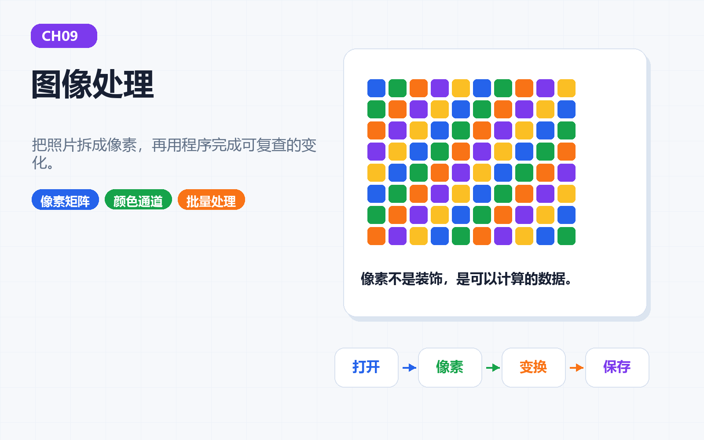
  <figcaption><strong>图9-1 本章封面</strong>：图片不是一整块魔法布，它是像素组成的矩阵。理解像素，图像处理就从玄学变成手工活。</figcaption>
</figure>

> 本章一句话：图片不是一整块魔法布，它是像素组成的矩阵。理解像素，图像处理就从玄学变成手工活。

第9章继续推进“科研卡片工厂”的视觉能力。前面几章让 Python 能整理文字、表格和报告；这一章开始处理图片。对教程、心理学实验和科研展示来说，图片不是装饰边角料，而是信息本身：刺激材料要统一尺寸，报告配图要清楚，结果图要能复查。

这一章的目标也很朴素：让你知道一张图片在程序眼里是什么，怎么安全地改它，怎么把处理结果留下来。

---

## 本章导读：先看人怎样理解图，再看程序怎样处理图

### 9.0 本章学习目标

学完本章，你应该能够：

1. 用“像素、坐标、颜色通道、处理动作、证据链”解释图像处理的最小工作链路。
2. 运行本章配套脚本，生成真实照片处理结果、视觉感知实验、图像质量总览和处理故事板。
3. 说清楚 Niépce、Russell Kirsch、Edwin Land、Helmholtz、Adelson 和 NASA 科学图像为什么适合放在图像处理章。
4. 识别覆盖原图、比例失真、过度增强、丢失上下文这几类新手错误。
5. 能运行本章配套脚本，让图像处理路径成为一条可复查的工序。

### 本章分区导航

| 分区 | 对应小节 | 你要抓住的主线 | 产出证据 |
| --- | --- | --- | --- |
| 第一部分：图像的记录、数字化和视觉判断 | 9.1-9.2 | 图像处理不是凭空出现，它接着摄影、扫描、颜色研究和科学图像表达往前走 | 摄影史图、数字扫描图、颜色故事、人文脉络图、路线表 |
| 第二部分：像素、素材和最小示例 | 9.3-9.4 | 把图片看成坐标和颜色通道，再用最小脚本跑通处理动作 | 核心比喻、真实照片素材、处理前后图、运行证据 |
| 第三部分：感知、科研图片和概念表 | 9.5-9.6 | 程序改的是像素，人理解的是场景；处理要服务于理解和证据 | 心理学连接、Helmholtz、棋盘阴影错觉、概念表 |
| 第四部分：脚本、排错和项目交付 | 9.7-9.8 | 每个脚本都要留下输入、处理、输出和可复盘结果 | 脚本清单、坑地图、故事板、视觉证据档案 |
| 第五部分：练习、复盘与后续连接 | 9.10-9.14 | 把图像处理迁移到学习卡片、实验材料、科研报告和后续自动化 | 练习记录、自测答案、复盘模板 |

---

## 第一部分：图像的记录、数字化和视觉判断

### 9.1 开场故事：先有画面，再有术语

图片不是一整块魔法布，它是像素组成的矩阵。理解像素，图像处理就从玄学变成手工活。我们先从画面进入，再慢慢把画面翻译成代码。

<figure align="center">
  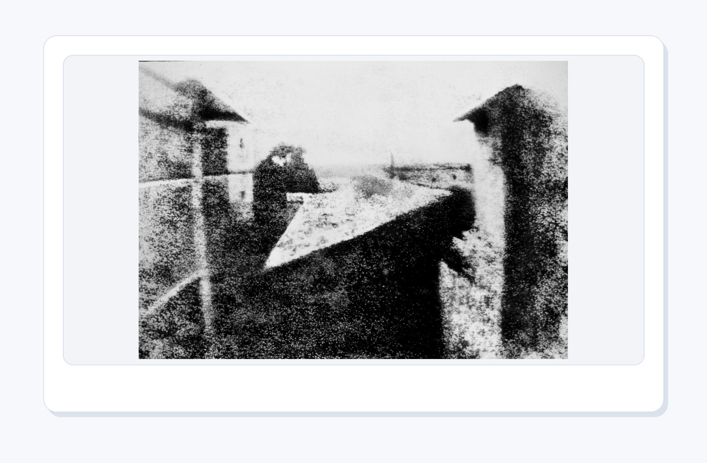
  <figcaption><strong>图9-2 Niépce 的早期摄影作品</strong>：图像处理的前提是“图像能被记录”；今天我们用 Python 处理像素，其实是在接续摄影史里的记录与再加工。</figcaption>
</figure>

早期摄影让光影第一次稳定地留在介质上。到了数字图像时代，照片不再只是纸面或底片，而是一张可以被程序读取、缩放、裁剪、转灰度、统计颜色的像素表。你可以把一张图片想成一座由很多小格子搭成的城市：每个格子有位置，也有颜色。

<figure align="center">
  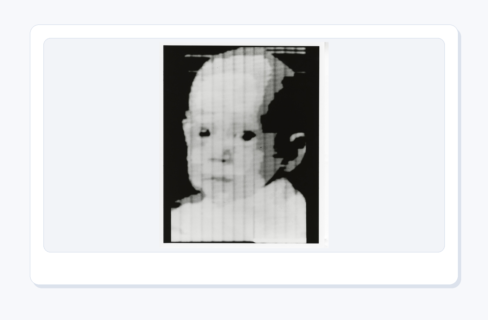
  <figcaption><strong>图9-3 早期数字扫描图像</strong>：数字图像的关键一步，是把连续画面拆成一个个可以存储、计算和修改的像素。</figcaption>
</figure>

1957 年，Russell Kirsch 团队扫描出一张婴儿照片，它常被用来讲早期数字图像史。照片本身不大，但意义很大：一旦图像被拆成像素，程序就能对它做计算。灰度、裁剪、锐化、压缩、识别，全都从“图像可以被数字表示”开始。

<figure align="center">
  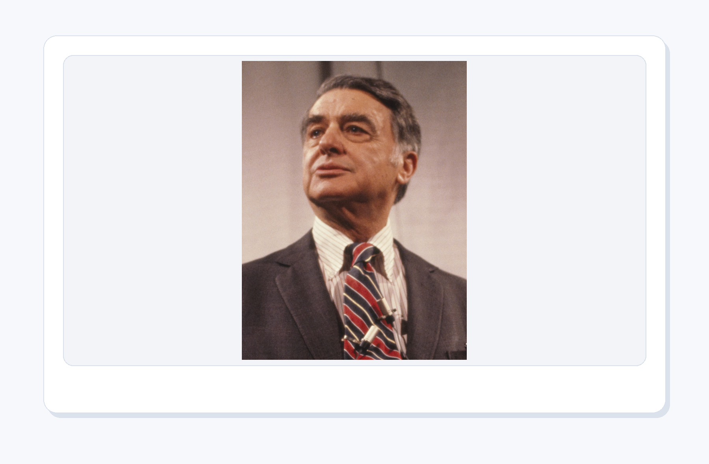
  <figcaption><strong>图9-4 Edwin Land照片</strong>：颜色不是简单地“存在于图片里”，它还和光照、背景、人眼判断有关。理解这一点，才能更谨慎地处理 RGB、灰度和增强。</figcaption>
</figure>

Edwin Land 的故事适合放在图像处理章里。他不仅和即时成像有关，也研究过人如何在复杂光照下判断颜色。对 Python 初学者来说，这能带来一个重要提醒：图像处理不是把滑块拉到“好看”为止，而是要知道颜色、亮度和对比度会怎样影响理解。

<figure align="center">
  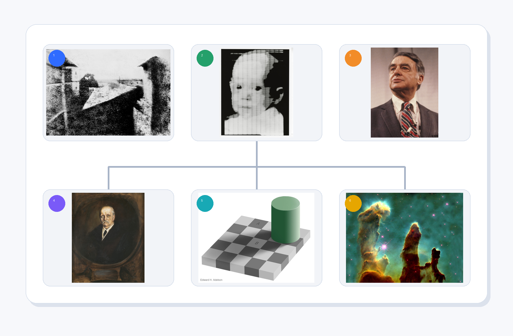
  <figcaption><strong>图9-4A 图像处理的人文脉络</strong>：从早期摄影、数字扫描、颜色判断，到视觉心理学、错觉研究和科学图像表达，图像处理一直夹在“机器怎样存图”和“人怎样看图”之间。</figcaption>
</figure>

把这些画面放在一起，你会发现本章并不是“学一个图片库”这么窄。Niépce 的照片提醒我们：先要有可记录的图像；早期数字扫描告诉我们：图像可以拆成像素；Land 的颜色研究让我们知道：颜色判断和光照、背景有关；Helmholtz 和 Adelson 的故事提醒我们：人眼会主动解释画面；NASA 科学图像则把问题推到最后一步：处理后的图像怎样帮助别人理解，而不是误导别人。

所以本章所有技术动作都要带着这条背景线来看：缩放不是随手改尺寸，裁剪不是随手截一块，增强不是把颜色拉满。每一次处理都在改变观看者能看到什么、先注意什么、相信什么。

<figure align="center">
  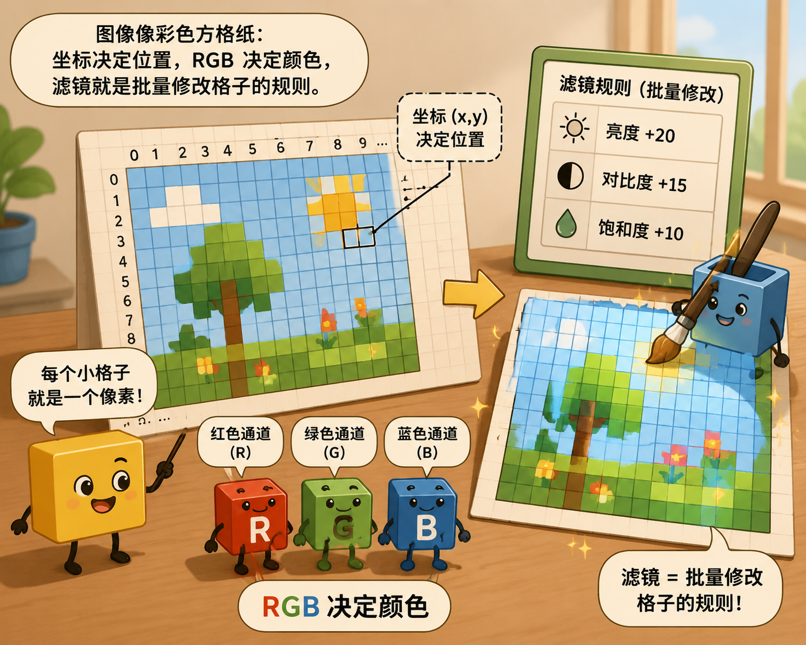
  <figcaption><strong>图9-5 故事场景</strong>：图像像彩色方格纸：坐标决定位置，RGB 决定颜色，滤镜就是批量修改格子的规则。</figcaption>
</figure>

这个画面对应本章的核心比喻：图像像彩色方格纸：坐标决定位置，RGB 决定颜色，滤镜就是批量修改格子的规则。

---

### 9.2 知识路线

<figure align="center">
  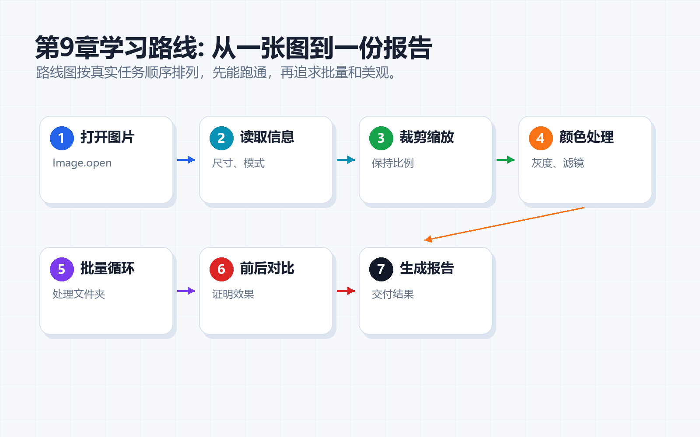
  <figcaption><strong>图9-6 知识路线</strong>：先建立直觉，再运行代码，最后完成可展示的配套脚本。</figcaption>
</figure>

本章路线如下：

| 顺序 | 主题 | 你要完成的动作 |
| --- | --- | --- |
| 1 | 像素和坐标 | 把一张图看成有行列位置的小格子 |
| 2 | RGB/RGBA | 读懂颜色通道，知道透明度从哪里来 |
| 3 | Pillow 打开保存 | 用 Python 打开图片、查看属性、保存副本 |
| 4 | 缩放裁剪 | 改变尺寸和视野，观察信息有没有丢失 |
| 5 | 滤镜和灰度 | 生成灰度、锐化和增强结果，比较视觉差异 |
| 6 | 批量处理 | 让一组图片按同一规则进入卡片工厂 |
| 7 | 处理故事板 | 把原图、灰度、裁剪、增强和卡片成品串成一条可复盘路径 |

---

## 第二部分：像素、素材和最小示例

### 9.3 核心概念：从白话到术语

先用白话说：图像像彩色方格纸：坐标决定位置，RGB 决定颜色，滤镜就是批量修改格子的规则。

<figure align="center">
  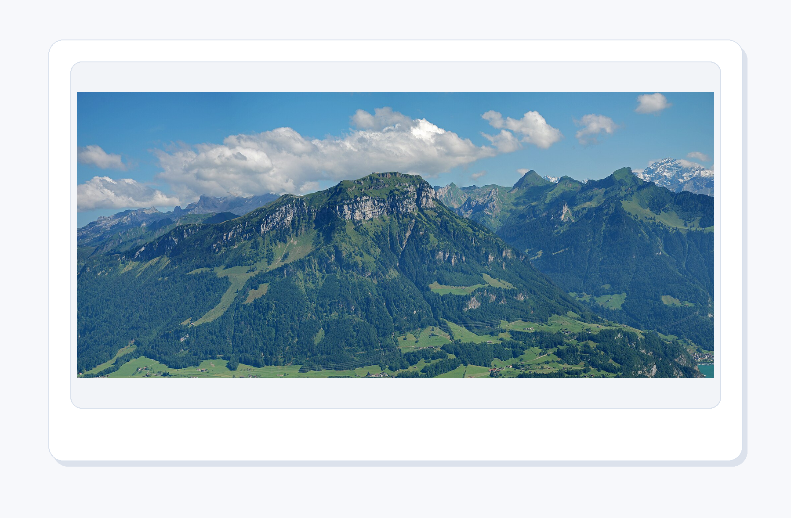
  <figcaption><strong>图9-7 本章真实处理素材</strong>：用真实风景照片做输入，比只看抽象示意图更容易理解缩放、灰度和裁剪的效果。</figcaption>
</figure>

<figure align="center">
  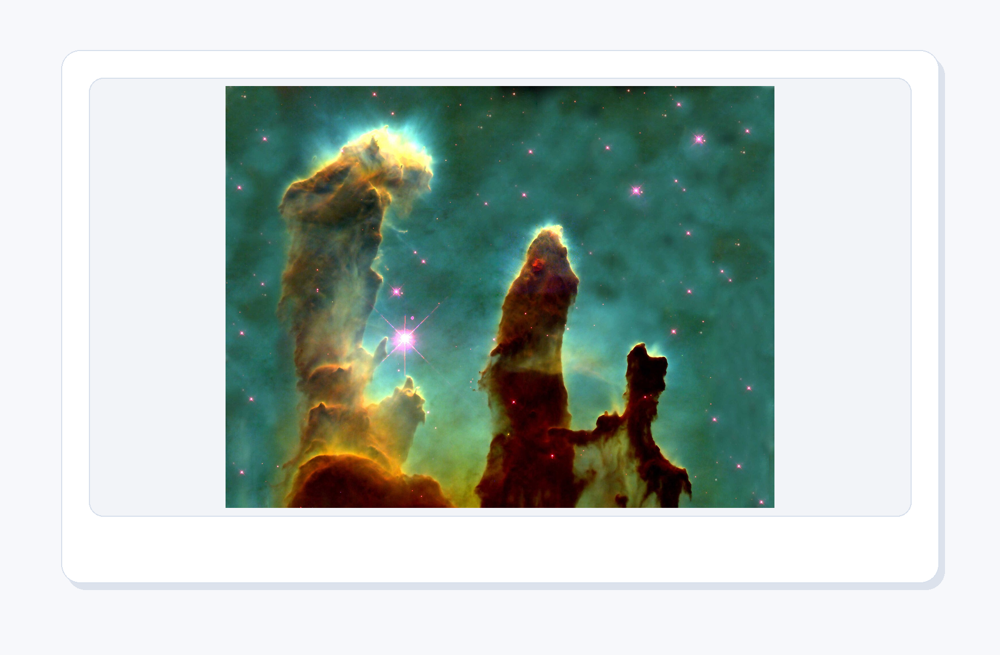
  <figcaption><strong>图9-8 科学图像与视觉表达</strong>：科学图像常常需要增强、裁剪和配色；处理得好，是让信息更清楚，不是让事实变花哨。</figcaption>
</figure>

NASA 的“创生之柱”常被用来说明科学图像的表达力量。很多科学图片并不是相机随手一拍就完事，而是要经过校正、合成、增强和说明。这里有一个重要边界：图像处理可以帮你看清结构，但不能为了好看而误导事实。学习卡片和报告配图也是一样：清楚第一，漂亮第二；漂亮必须服务于理解。

再用术语说，本章要掌握这些内容：

- **像素和坐标**：每个像素都有位置，裁剪、绘制和取色都从坐标开始。
- **RGB/RGBA**：颜色由通道组成，透明度决定图片能不能自然叠到其他背景上。
- **Pillow 打开保存**：先保留原图，再生成副本；不要让一次实验覆盖证据。
- **缩放裁剪**：缩放改变尺寸，裁剪改变视野；二者都会影响别人看到什么。
- **滤镜和灰度**：滤镜不是越重越好，灰度能帮你检查明暗结构和信息层次。
- **批量处理**：同一批素材要用一致规则处理，卡片和报告才不会忽大忽小。
- **视觉感知与图像解释**：程序改的是像素，人理解的是场景；处理前后都要问“会不会误导判断”。

---

### 9.4 最小可运行示例

本章第一件事不是背参数，而是运行一个最小例子。打开终端，进入本章目录后运行：

```bash
python code/ch09/01_create_demo_image.py
```

如果你能看到输出，说明这一章已经跑通了。后面所有复杂功能，都是在这个基础上慢慢加能力。

<figure align="center">
  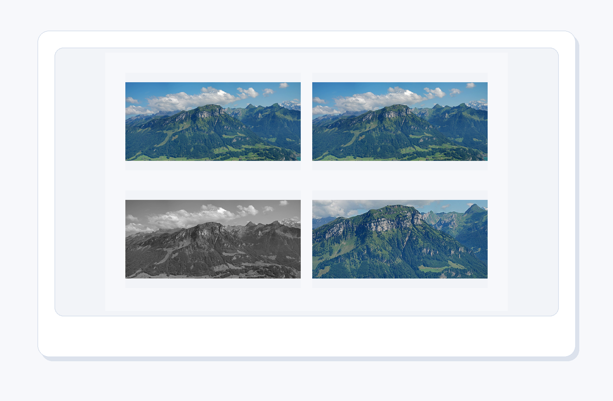
  <figcaption><strong>图9-9 真实照片处理结果</strong>：`04_real_photo_before_after.py` 会生成无文字四宫格，对比原图、缩放、灰度和裁剪效果。</figcaption>
</figure>

这张图的重点不是“滤镜好看”，而是让处理动作可检查：缩放改变尺寸，灰度改变颜色通道，裁剪改变视野，锐化会让局部边缘更清楚。图像处理的学习一定要看结果，否则代码只是空转。

<figure align="center">
  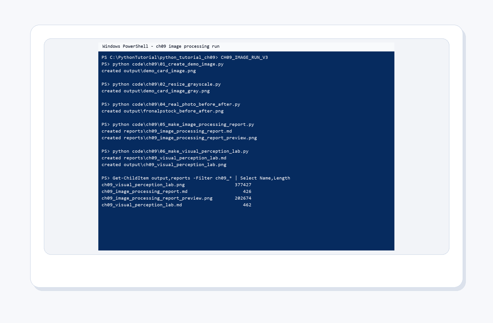
  <figcaption><strong>图9-10 PowerShell 真实运行结果</strong>：本章脚本会在 `output/` 和 `reports/` 里留下 demo 图、灰度图、真实照片对比图和图像处理报告。</figcaption>
</figure>

---

## 第三部分：感知、科研图片和概念表

### 9.5 与心理学和科研图片的连接

这一章把例子贴近心理学、科研记录和学习分享，因为这些任务天然需要清晰流程：图片来自哪里，处理做了什么，结果存到哪里，别人能不能复现。

在本章里，你可以这样理解项目价值：

- 它不是孤立练习，而是科研卡片工厂的一台新设备。
- 它处理的材料可以是课程笔记、实验记录、问卷结果、图片、网页资料或报告模板。
- 它最终要留下可检查的结果，而不是只在屏幕上闪一下。

<figure align="center">
  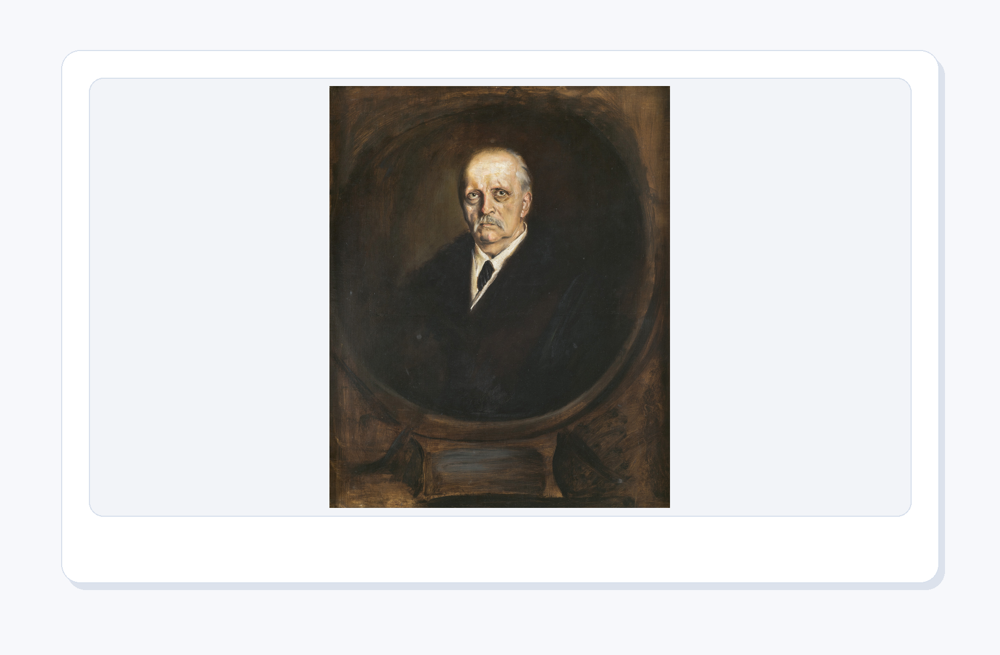
  <figcaption><strong>图9-11 Hermann von Helmholtz照片</strong>：视觉不是摄像头式复制，人眼会根据经验、背景和对比做判断；图像处理要尊重这种感知特点。</figcaption>
</figure>

Helmholtz 的视觉研究可以帮你理解一件事：图片处理不仅发生在电脑里，也发生在观看者的脑子里。两块同样的灰色，放在不同背景上可能看起来完全不同；一张图片被裁掉边缘后，观看者的注意力也会被重新引导。做科研配图时，这不是小事。

<figure align="center">
  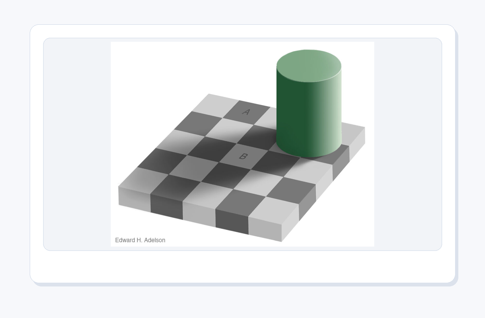
  <figcaption><strong>图9-12 Adelson 棋盘阴影错觉</strong>：图片里的 A 和 B 看起来一深一浅，但经典错觉的妙处就在于：眼睛会把阴影、背景和经验一起算进去。</figcaption>
</figure>

这张图像是在给图像处理“泼一杯清醒水”。Python 看到的是像素值，人看到的是场景。你把亮度调高一点，程序觉得只是数值变化；观看者可能会觉得“证据更强了”。你裁掉一个边角，程序觉得只是坐标变了；别人可能会失去判断上下文。图像处理越强大，越要诚实。

---

### 9.6 关键概念拆解表

| 概念 | 人话理解 | 本章落点 |
| --- | --- | --- |
| 像素和坐标 | 图片是很多小格子，每个格子都有位置 | 裁剪时用 `(left, top, right, bottom)` 指定区域 |
| RGB/RGBA | RGB 是颜色，A 是透明度 | 生成卡片图时要知道图片模式是 `RGB` 还是 `L` |
| Pillow 打开保存 | Pillow 像图像处理工作台，负责读图和写图 | `Image.open()`、`im.save()` 是本章最小闭环 |
| 缩放裁剪 | 缩放改变尺寸，裁剪改变视野 | `02_resize_grayscale.py` 和 `04_real_photo_before_after.py` 都会用到 |
| 滤镜和灰度 | 灰度是去掉颜色信息，滤镜是批量改像素 | `convert("L")` 生成灰度图，`ImageFilter.SHARPEN` 强化局部边缘 |
| 批量处理 | 一张张手改会累，程序适合批量处理 | `03_batch_image_report.py` 读取文件夹中的多张 PNG |
| 处理故事板 | 把原图、灰度、裁剪、增强和卡片成品连成一条可复盘路径 | `06_make_processing_storyboard.py` 生成图像处理流水线故事板 |

这张表的作用，是把“我好像懂了”变成“我知道它在哪用”。学习编程时，最危险的状态不是完全不会，而是听解释时点头，自己动手时发呆。每学一个概念，都要强迫自己问一句：它在配套脚本里负责哪一段工作？

---

## 第四部分：脚本、排错和项目交付

### 9.7 配套代码逐个导览

#### 脚本 1：`01_create_demo_image.py`

这个脚本只有 9 行，但它完成了图像处理的第一步：**用代码生成一张图片**，而不是从文件读取。

**完整代码**：

```python
"""Create a demo image with Pillow."""
from pathlib import Path
from PIL import Image, ImageDraw

Path("output").mkdir(exist_ok=True)
im = Image.new("RGB", (480, 300), "#f8fafc")
d = ImageDraw.Draw(im)
for i, color in enumerate(["#2F6BFF", "#24A06B", "#F28C28", "#7A5AF8"]):
    d.rounded_rectangle((40 + i * 100, 80, 110 + i * 100, 220), radius=18, fill=color)
im.save("output/demo_card_image.png")
print("已生成 output/demo_card_image.png")
```

**逐段讲解**：

| 行 | 作用 |
| --- | --- |
| `from pathlib import Path` | Python 标准库的路径工具，比 `os.path` 更简洁。本章所有脚本都用它管理文件路径。 |
| `from PIL import Image, ImageDraw` | 从 Pillow 导入核心类：`Image` 负责打开/创建/保存/转换图像，`ImageDraw` 负责在图像上绘制形状和文字。 |
| `Path("output").mkdir(exist_ok=True)` | 确保 `output/` 目录存在。`exist_ok=True` 表示如果目录已存在也不报错——这是脚本稳健性的好习惯。 |
| `Image.new("RGB", (480, 300), "#f8fafc")` | 创建一个宽 480 像素、高 300 像素的新图像，模式为 `RGB`（红绿蓝三通道），背景色为浅灰 `#f8fafc`。 |
| `ImageDraw.Draw(im)` | 在图像 `im` 上创建一个"画板"对象，后续的绘制操作都针对这个画板。 |
| `for i, color in enumerate(...)` | 循环 4 次，依次取出颜色列表中的蓝色、绿色、橙色和紫色。 |
| `d.rounded_rectangle(...)` | 绘制一个圆角矩形。参数 `(left, top, right, bottom)` 定义了矩形边界，`radius=18` 控制圆角弧度，`fill=color` 设置填充色。4 个矩形通过 `i * 100` 在水平方向上依次排列。 |
| `im.save(...)` | 将内存中的图像写入磁盘文件。格式由文件后缀 `.png` 自动确定。 |

**关键概念**：脚本 1 演示了 Pillow 的两大基本功——创建空白画布和在画布上绘制几何图形。所有图像处理的起点都是"有一张图"，这张图既可以来自文件，也可以像这里一样由代码生成。学会 `Image.new` 和 `ImageDraw`，你就能在需要时用代码制作简单的学习卡片底图。

运行方式：

```bash
python code/ch09/01_create_demo_image.py
```

---

#### 脚本 2：`02_resize_grayscale.py`

**完整代码**：

```python
"""Resize and grayscale an image."""
from pathlib import Path
from PIL import Image

src = Path("output/demo_card_image.png")
im = Image.open(src)
small = im.resize((240, 150))
gray = small.convert("L")
gray.save("output/demo_card_image_gray.png")
print("已生成 output/demo_card_image_gray.png")
```

**逐段讲解**：

这个脚本把脚本 1 生成的彩色卡片变成一张**小尺寸灰度图**，是图像处理中最常见的两个操作——缩放和色彩转换——的最小闭环。

| 行 | 作用 |
| --- | --- |
| `Image.open(src)` | 从文件读取图像，返回一个 `Image` 对象。此时图像数据加载到内存中，但还未做任何处理。 |
| `im.resize((240, 150))` | 将原图从 `(480, 300)` 缩小到 `(240, 150)`。注意：`resize` 不会保持原图宽高比，如果传入的宽高比例与原图不一致，图片会被拉伸。保持比例要用 `ImageOps.contain()`（见脚本 4）。 |
| `small.convert("L")` | 将 RGB 彩色图像转为灰度图。`"L"` 代表 Luminance（亮度），每个像素值在 0（黑）到 255（白）之间。转换公式是 `0.299R + 0.587G + 0.114B`，模拟人眼对不同颜色的敏感度。 |
| `gray.save(...)` | 保存结果。文件后缀 `.png` 决定了输出格式。 |

**关键概念**：
- **`resize()`** 改变图像尺寸，但会忽略原始宽高比。当你需要精确尺寸（如学习卡片固定框）时有用，但如果要保持比例，请用 `ImageOps.contain()` 或 `ImageOps.fit()`。
- **`convert("L")`** 是 Pillow 中最常用的色彩模式转换方法。`RGB` → `"L"` 去掉颜色保留明暗，`"L"` → `"RGB"` 则是把单通道复制成三通道（因为某些操作要求输入必须是 RGB）。
- 脚本 2 的输入来自脚本 1 的输出，这体现了**脚本之间的串联关系**：前一个脚本的产物是后一个脚本的原料。

运行方式：

```bash
python code/ch09/02_resize_grayscale.py
```

---

#### 脚本 3：`03_batch_image_report.py`

**完整代码**：

```python
"""List image sizes in a folder."""
from pathlib import Path
from PIL import Image

for path in Path("output").glob("*.png"):
    with Image.open(path) as im:
        print(path.name, im.size, im.mode)
```

**逐段讲解**：

这个脚本虽然只有 6 行，但它演示了图像处理项目中一个极其重要的能力：**批量读取和元数据提取**。

| 行 | 作用 |
| --- | --- |
| `Path("output").glob("*.png")` | 使用 glob 模式匹配 `output/` 目录下所有 `.png` 文件，返回一个可迭代的 `Path` 对象列表。这是 Python 中遍历文件夹最常见的方式。 |
| `with Image.open(path) as im:` | 使用上下文管理器（`with` 语句）打开图像。好处是：即使读取过程中发生异常，文件句柄也会被安全关闭。这是 Pillow 官方推荐的打开方式。 |
| `im.size` | 返回一个 `(width, height)` 元组，例如 `(480, 300)`。 |
| `im.mode` | 返回图像的颜色模式字符串，常见的有 `"RGB"`（彩色）、`"L"`（灰度）、`"RGBA"`（彩色+透明通道）。 |

**关键概念**：
- **批量处理思维**：不要只对一张图执行操作，而是让程序自动扫描目录中的所有图片。这在处理几十上百张素材时能节省大量时间。
- **`im.size` 和 `im.mode` 是图像的两项基本元数据**。任何时候拿到一张图，第一件事就是检查它的尺寸是否够用、模式是否正确。
- **`with` 语句的作用**：`Image.open()` 打开文件后需要关闭，`with` 自动帮你完成这一步。忘记关闭文件在高并发或大批量处理时可能导致资源耗尽。

运行方式：

```bash
python code/ch09/03_batch_image_report.py
```

#### 脚本 4：`04_real_photo_before_after.py`

**完整代码**：

```python
"""Create a before/after image-processing sheet from a real photo."""

from pathlib import Path

from PIL import Image, ImageFilter, ImageOps


SOURCE = Path("assets/ch09/web/fronalpstock_sample.jpg")
OUTPUT = Path("output/fronalpstock_before_after.png")


def fit(im: Image.Image, size: tuple[int, int]) -> Image.Image:
    fitted = ImageOps.contain(im, size)
    canvas = Image.new("RGB", size, "#F2F4F8")
    x = (size[0] - fitted.width) // 2
    y = (size[1] - fitted.height) // 2
    canvas.paste(fitted, (x, y))
    return canvas


def main():
    OUTPUT.parent.mkdir(exist_ok=True)
    raw = Image.open(SOURCE).convert("RGB")
    small = raw.resize((raw.width // 2, raw.height // 2))
    gray = ImageOps.grayscale(raw).convert("RGB")
    w, h = raw.size
    crop = raw.crop((w // 4, h // 4, w * 3 // 4, h * 3 // 4)).filter(ImageFilter.SHARPEN)

    panels = [raw, small, gray, crop]
    sheet = Image.new("RGB", (1400, 900), "#F7F8FB")
    positions = [(70, 70), (720, 70), (70, 480), (720, 480)]
    for panel, pos in zip(panels, positions):
        framed = fit(panel, (610, 340))
        sheet.paste(framed, pos)

    sheet.save(OUTPUT, optimize=True)
    print("已生成", OUTPUT)


if __name__ == "__main__":
    main()
```

**逐段讲解**：

这个脚本从一个真实风景照片出发，生成一张"四宫格"对比图：原图 → 缩小 → 灰度 → 裁剪+锐化。它也是本章第一个使用了**自定义辅助函数**和**图像合成**的脚本。

**`fit()` 辅助函数**：

```python
def fit(im: Image.Image, size: tuple[int, int]) -> Image.Image:
    fitted = ImageOps.contain(im, size)   # 保持比例缩放，填满目标区域
    canvas = Image.new("RGB", size, "#F2F4F8")   # 创建目标大小的画布（浅灰背景）
    x = (size[0] - fitted.width) // 2      # 水平居中
    y = (size[1] - fitted.height) // 2     # 垂直居中
    canvas.paste(fitted, (x, y))           # 把缩放后的图贴到画布中央
    return canvas
```

这个函数的职责是：把任意尺寸的图像放进一个固定尺寸的"相框"里，保持比例、居中摆放、多余空间用浅灰填充。这样做的好处是，即使原始图片比例不同，最终输出的四张子图在拼贴时尺寸一致，版面整齐。

**`main()` 函数中的四种处理**：

| 处理 | 代码 | 说明 |
| --- | --- | --- |
| 原图 | `Image.open(SOURCE).convert("RGB")` | 读取原始照片，确保转为 RGB（避免 JPEG 的 `CMYK` 或含透明通道的意外情况）。 |
| 缩小 | `raw.resize((raw.width // 2, raw.height // 2))` | 宽高各缩小一半。这里保留了原始宽高比，因为宽和高的缩放倍数相同（都是 `// 2`）。 |
| 灰度 | `ImageOps.grayscale(raw).convert("RGB")` | `ImageOps.grayscale()` 等同于 `convert("L")`，但返回的是单通道图；`.convert("RGB")` 又把它转回三通道，这样后续合成时不会因通道数不匹配而报错。 |
| 裁剪+锐化 | `raw.crop((w//4, h//4, w*3//4, h*3//4)).filter(ImageFilter.SHARPEN)` | `crop()` 从原图中心取 1/4 区域（左、上、右、下边界分别取 `w/4, h/4, 3w/4, 3h/4`）；`filter(ImageFilter.SHARPEN)` 对裁剪结果应用锐化滤镜，增强边缘对比度。 |

**图像合成**：

```python
sheet = Image.new("RGB", (1400, 900), "#F7F8FB")     # 创建大画布
positions = [(70, 70), (720, 70), (70, 480), (720, 480)]  # 四个子图的位置
for panel, pos in zip(panels, positions):
    framed = fit(panel, (610, 340))   # 将每张子图统一为 610x340 居中版式
    sheet.paste(framed, pos)          # 粘贴到大画布上
```

这是一个典型的**图像拼贴**模式：创建一个宽 1400、高 900 的新画布，将四个处理结果按 2×2 网格排列。`sheet.save(OUTPUT, optimize=True)` 中的 `optimize=True` 让 Pillow 尝试压缩 PNG 文件体积。

**关键概念**：
- **`ImageOps.contain()` 和 `ImageOps.fit()` 的区别**：`contain` 保持比例缩放，使图像完全适应目标区域（可能留有空白）；`fit` 则裁剪边缘以填满目标区域。前者用于展示完整内容，后者用于生成统一尺寸的缩略图。
- **`crop()` 的坐标系统**：Pillow 中 `crop((left, top, right, bottom))` 的坐标原点在**左上角**，x 轴向右为正，y 轴向下为正。这是初学者最容易搞混的地方。
- **复合操作的顺序**：先裁剪后锐化，而不是相反。如果先锐化再裁剪，锐化计算量会更大（处理整图而非局部），且裁剪后可能丢掉锐化过的边缘。

运行方式：

```bash
python code/ch09/04_real_photo_before_after.py
```

它会读取 `assets/ch09/web/fronalpstock_sample.jpg`，生成：

```text
output/fronalpstock_before_after.png
```

请重点观察输出图片中：尺寸、颜色和视野发生了什么变化。图像处理不要只看"代码成功运行"，要打开输出文件，确认结果真的符合目的。

---

#### 脚本 5：`05_make_image_processing_report.py`

**代码结构概览**：

这个脚本的代码较长（约 80 行），但逻辑分三步走：**收集 → 写报告 → 生成预览图**。下面拆解核心函数。

**第一步：收集图片信息（`image_info()` 函数）**

```python
def image_info(path: Path):
    with Image.open(path) as im:
        return im.size, im.mode
```

对每张图片，读取它的 `(width, height)` 和颜色模式。这两个指标是判断图片是否适合学习卡片的门槛：尺寸太小放大后模糊，模式是 `RGBA` 的话可能需要先合入背景。

**第二步：生成 Markdown 报告（`make_markdown()` 函数）**

```python
lines = [
    "# 第9章图像处理报告",
    "",
    "| 文件 | 尺寸 | 模式 | 用途 |",
    "| --- | --- | --- | --- |",
]
uses = {
    "demo_card_image.png": "程序生成的学习卡片配图",
    "demo_card_image_gray.png": "灰度转换结果",
    "fronalpstock_before_after.png": "真实照片处理前后对比",
    "pillars_of_creation.jpg": "科学图像素材，用于理解图像增强和表达",
}
for path in paths:
    size, mode = image_info(path)
    lines.append(f"| {path.name} | {size[0]}x{size[1]} | {mode} | {uses[path.name]} |")
report.write_text("\n".join(lines), encoding="utf-8")
```

它用 Python 的字符串拼接直接写出了一个 Markdown 表格。每张图占一行，列出文件名、尺寸、模式和用途。这是将脚本运行结果**归档为可阅读文档**的标准做法。

**第三步：生成预览图（`make_preview()` 函数）**

```python
boxes = [
    (150, 300, 520, 535),
    (560, 300, 930, 535),
    (970, 300, 1390, 535),
    (150, 610, 520, 835),
]
labels = ["生成卡片", "灰度转换", "真实照片对比", "科学图像素材"]
for box, path, label in zip(boxes, paths, labels):
    d.rounded_rectangle(box, radius=20, fill="#F1F5F9", outline="#E2E8F0", width=2)
    paste_contained(im, path, (box[0] + 18, box[1] + 18, box[2] - 18, box[3] - 58))
    d.text((box[0] + 22, box[3] - 42), label, fill="#162033", font=font(23, True))
```

预览图把四张关键输出排列在一张大图上，让读者不用逐个打开文件就能一次性对比。`paste_contained()` 函数确保子图保持比例放入预留区域。

**关键概念**：
- **报告先行**：图像处理不是"改完图就完事了"。脚本 5 教会你：每做完一批处理，立刻生成一份报告，记录文件名、尺寸、模式和用途。三周后你回到项目，打开报告就能知道当时做了什么。
- **Markdown 是从代码生成文档最简单的方式**：不需要额外库，字符串拼接即可，和 Git、GitHub 无缝配合。
- **`paste_contained()` 的设计模式**：注意它把"保持比例粘贴"封装成一个可复用的函数，后续脚本 6 沿用了类似的思路。

第一次运行时不要急着改代码。先原样运行，确认能看到输出；第二次再改一个最小参数；第三次再尝试把输出写入 `output/` 或 `reports/`。

运行方式：

```bash
python code/ch09/05_make_image_processing_report.py
```

#### 脚本 6：`06_make_processing_storyboard.py`

**代码结构概览**：

这个脚本是整章中最具"作品感"的一个——它把一张真实照片经过 **5 个阶段** 的处理，生成一张从"原材料"到"卡片成品"的故事板。

**五个处理阶段（`make_steps()` 函数）**：

```python
def make_steps(source: Image.Image) -> list[tuple[str, Image.Image, str]]:
    small = contain_image(source, (360, 220))                                                      # Original
    gray = ImageOps.grayscale(source).convert("RGB")                                                # Gray
    square = fit_image(source, (420, 420))                                                          # Crop
    enhanced = ImageEnhance.Contrast(source).enhance(1.28)
    enhanced = ImageEnhance.Color(enhanced).enhance(1.12).filter(ImageFilter.UnsharpMask(radius=1.4, percent=120))  # Enhance
    card = Image.new("RGB", (420, 420), "#F8FAFC")
    card_draw = ImageDraw.Draw(card)
    thumb = fit_image(enhanced, (360, 250))
    card.paste(thumb, (30, 35))
    card_draw.rounded_rectangle((30, 315, 390, 382), radius=18, fill="#FFFFFF", outline="#CBD5E1", width=2)
    card_draw.text((55, 332), "image card", fill=INK, font=font(26, True))
    card_draw.text((55, 362), "ready", fill=GREEN, font=font(18, True))                              # Card
    return [
        ("Original", small, "Keep evidence."),
        ("Gray", contain_image(gray, (360, 220)), "Check value."),
        ("Crop", square, "Choose focus."),
        ("Enhance", contain_image(enhanced, (360, 220)), "Clarify detail."),
        ("Card", card, "Deliver."),
    ]
```

| 阶段 | 核心操作 | 设计意图 |
| --- | --- | --- |
| **Original** | `ImageOps.contain()` 生成缩略图 | "保留证据"——原图是后续所有操作的基准，永远不要覆盖它 |
| **Gray** | `ImageOps.grayscale()` → `convert("RGB")` | "检查明暗"——去掉颜色后，图像的亮部、暗部、中间调是否层次分明 |
| **Crop** | `ImageOps.fit((420, 420))` | "选择焦点"——正方形裁剪迫使你思考：观看者应该先看哪里 |
| **Enhance** | `Contrast(1.28)` + `Color(1.12)` + `UnsharpMask(1.4, 120%)` | "优化细节"——适度增强对比度和清晰度，而不是一次性拉满 |
| **Card** | 增强图 + 圆角标签 + "image card / ready" 文字 | "最终交付"——把处理结果以学习卡片的形式呈现 |

注意增强阶段的参数组合：对比度 1.28、色彩 1.12、USM 锐化半径 1.4 像素 + 强度 120%。这些数值是经验值，不是硬性标准——你可以在自己的项目中测试并调整。

**故事板绘制（`draw_step()` 函数）**：

```python
def draw_step(draw, canvas, x, y, title, image, note, color):
    draw.rounded_rectangle((x, y, x + 270, y + 360), radius=26, fill="#FFFFFF", outline=LINE, width=2)
    draw.text((x + 24, y + 22), title, fill=INK, font=font(28, True))
    draw.text((x + 24, y + 58), note, fill=MUTED, font=font(17))
    frame = (x + 24, y + 98, x + 246, y + 306)   # 图片预览区域
    ...
    draw.rounded_rectangle((x + 24, y + 322, x + 246, y + 342), radius=10, fill=color)  # 底部彩色条
```

每个处理阶段被绘制成一个圆角卡片，宽 270、高 360，包含标题、一句话说明、图片预览和底部彩色标识条。5 个卡片从左到右排列，就像电影的故事板一样。

**关键概念**：
- **处理流水线可视化**：故事板不是"最终效果图"，而是**处理过程的视觉说明书**。每当你做一个新的图像处理项目，都应该生成这样一张故事板——它能帮你和同事快速对齐"我们到底做了什么"。
- **`ImageFilter.UnsharpMask`**：比单纯的 `SHARPEN` 滤镜更可控。`radius` 控制锐化影响的边缘宽度（小半径 = 精细边缘），`percent` 控制强度。USM 是专业图像处理软件中标准锐化工具。
- **为什么是 5 个阶段而不是 3 个或 7 个**：因为每个阶段对应一个明确的问题——原图（证据）、灰度（结构）、裁剪（构图）、增强（细节）、卡片（交付）。多一个冗余，少一个不完整。

运行方式：

```bash
python code/ch09/06_make_processing_storyboard.py
```

### 9.8 常见坑

<figure align="center">
  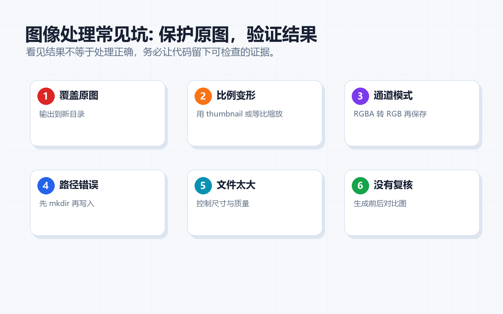
  <figcaption><strong>图9-13 常见坑地图</strong>：错误不是判决，而是提醒你该检查路径、输入、状态或依赖。</figcaption>
</figure>

本章常见坑及应对方式：

**1. 覆盖原图 — 保存时用不同的文件名**

`im.save("input/photo.jpg")` 会直接覆盖原始文件。一旦覆盖，原图就丢了，你没法回头对比处理前后的差异，也无法重新用不同的参数再试一次。**习惯做法**：永远把处理结果保存到 `output/` 目录，文件名加上处理标记，例如 `photo_gray.jpg`、`photo_resized.jpg`。原文件留在原地，只读不写。

**2. 比例失真 — 用 `ImageOps.contain()` 代替直接 `resize()`**

`im.resize((400, 400))` 不会保持宽高比——一张 800×600 的图会被挤成 400×400，看起来又扁又丑。**安全做法**：需要保持比例的缩放用 `ImageOps.contain(im, (400, 400))`，它会按比例缩放到刚好放进 400×400 的框里；需要裁剪填满固定尺寸用 `ImageOps.fit(im, (400, 400))`。只有当你明确知道原图比例和目标比例一致时，才用 `resize()`。

**3. 路径写错 — 先用 `Path.exists()` 确认文件在不在**

`Image.open("data/photo.jpg")` 报 `FileNotFoundError`，最常见的原因是工作目录和你想的不一样。**排查步骤**：先打印 `Path("data/photo.jpg").exists()` 看返回 `True` 还是 `False`；如果返回 `False`，检查当前工作目录 (`import os; print(os.getcwd())`) 或改用绝对路径。在脚本开头用 `Path(__file__).parent` 获取脚本所在目录，再拼出相对路径，这样不管从哪运行都不怕。

**4. 忽略透明通道 — RGBA 模式的图转 RGB 前要先处理**

用 Pillow 打开 PNG 图标或贴纸时，图片模式可能是 `RGBA`（红绿蓝 + 透明度通道）。直接对它做 `convert("L")` 灰度转换或某些滤镜操作时，透明背景会变成黑色块。**处理方式**：先在 RGBA 图上用 `Image.alpha_composite()` 合成到白色背景上，或者统一用 `convert("RGBA").convert("RGB")` 去掉透明度通道再处理。如果不确定图片模式，先用 `print(im.mode)` 看一眼。

**5. 忘记 `exist_ok=True` — 目录创建失败导致保存报错**

`Path("output").mkdir()` 在目录已存在时会抛出 `FileExistsError`。初学者经常第一次运行成功，第二次运行就报错。**习惯写法**：统一用 `Path("output").mkdir(exist_ok=True)`，不管目录是否存在都不会报错。

遇到问题时，先看报错信息，再看文件路径，最后看输入数据。不要一报错就重装环境。重装是最后手段，不是第一反应。

---


## 第五部分：练习、复盘与后续连接

### 9.10 练习任务

1. 修改一个输入参数，观察输出变化。
2. 把脚本生成的结果保存成文件。
3. 故意制造一个小错误，记录报错信息和修复方式。
4. 把本章配套脚本和前面章节连接起来，例如读取 ch03 整理出的文件，或使用 ch02 的数据结构保存结果。
5. 找一张自己的学习卡片配图，生成灰度版和裁剪版，并说明哪一种更适合报告。
6. 运行 `06_make_processing_storyboard.py`，把其中一个阶段替换成你自己的处理方式，并说明它是为了学习卡片、实验还是报告服务。

---

### 9.11 自测问题

1. 本章最重要的三个概念是什么？请用人话解释，不要只背术语。
2. 本章第一个脚本的输入、处理、输出分别是什么？
3. 如果脚本运行失败，你第一步会检查路径、环境、依赖还是语法？为什么？
4. 本章配套脚本和"科研卡片工厂"有什么关系？
5. 你能不能把本章配套脚本改成一个心理学或学习分享场景的小任务？

参考回答不唯一。判断自己是否真的理解，可以看你能不能把答案讲给一个完全没学过本章的人听。

---

### 9.12 学习复盘模板

可以在 `reports/ch09_review.md` 中写下：

```markdown
# 第9章复盘

## 我新增的能力
- 

## 我跑通的脚本
- 

## 我遇到的报错
- 报错信息：
- 原因：
- 修复方式：

## 我能迁移到哪里
- 心理学实验：
- 学习分享：
- 科研资料整理：
```

复盘不是写作文，而是给未来的自己留路标。你现在记录清楚，后面做综合项目时就不用重新从记忆里翻箱倒柜。

---

### 9.13 与后续章节的连接

本章不是孤岛。它和整套教程的关系可以这样理解：

- 前面章节提供基础：环境、数据结构、文件管理。
- 本章提供一项新能力：学习卡片配图处理器，并能把处理路径整理成可复盘故事板。
- 后面章节会把这项能力继续接到数据分析、资料采集、报告生成和办公自动化里。

---

### 9.14 本章总结

Python 图像处理的关键不是“记住所有 API”，而是理解它解决的问题。你已经从概念、图像、代码和配套脚本四个角度接触了本章内容。下一次复习时，不要只问“我会不会背”，而要问：

- 我能不能讲出这个概念的比喻？
- 我能不能运行一个最小脚本？
- 我能不能把结果放进项目目录？
- 我能不能说清楚它在科研卡片工厂里增加了什么能力？

如果答案是肯定的，这一章就不是看过了，而是真的进入你的工具箱了。
