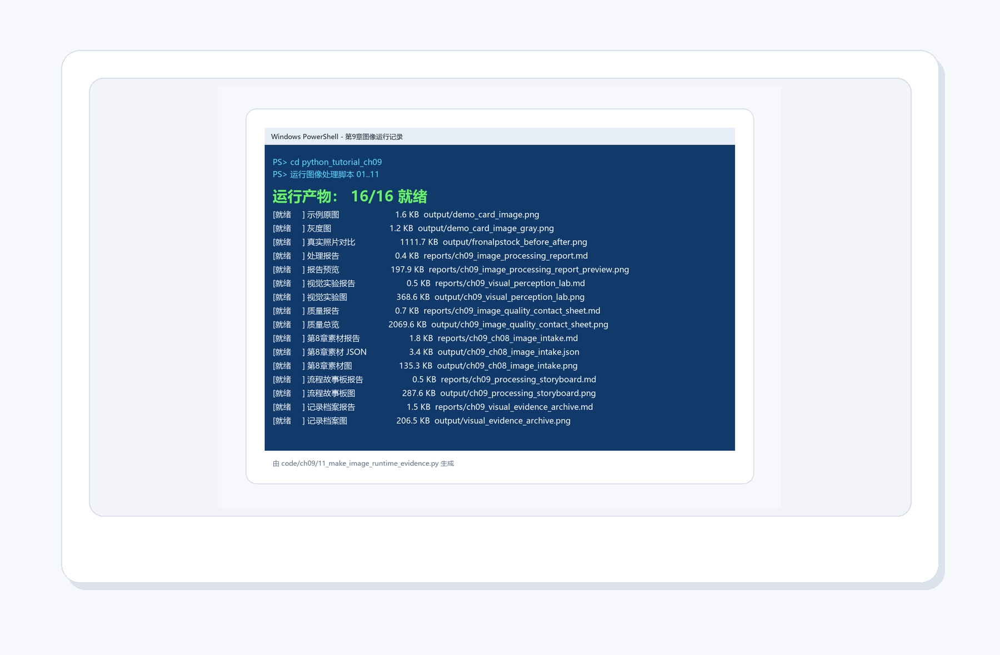
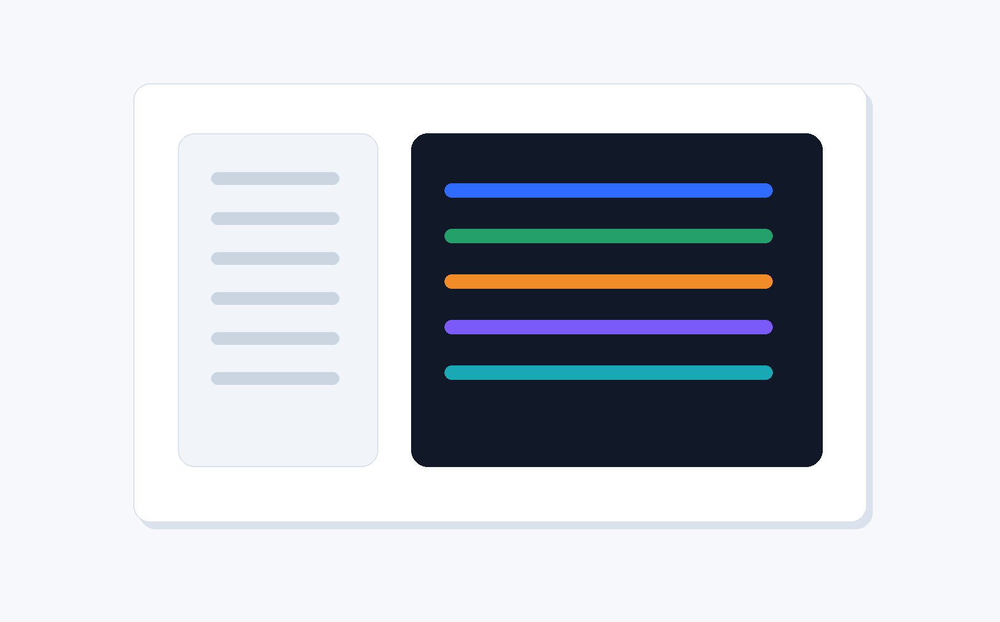
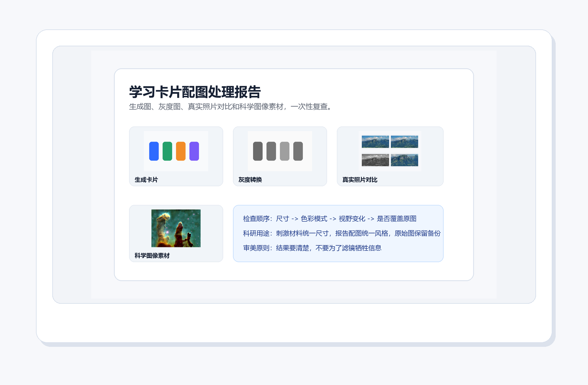
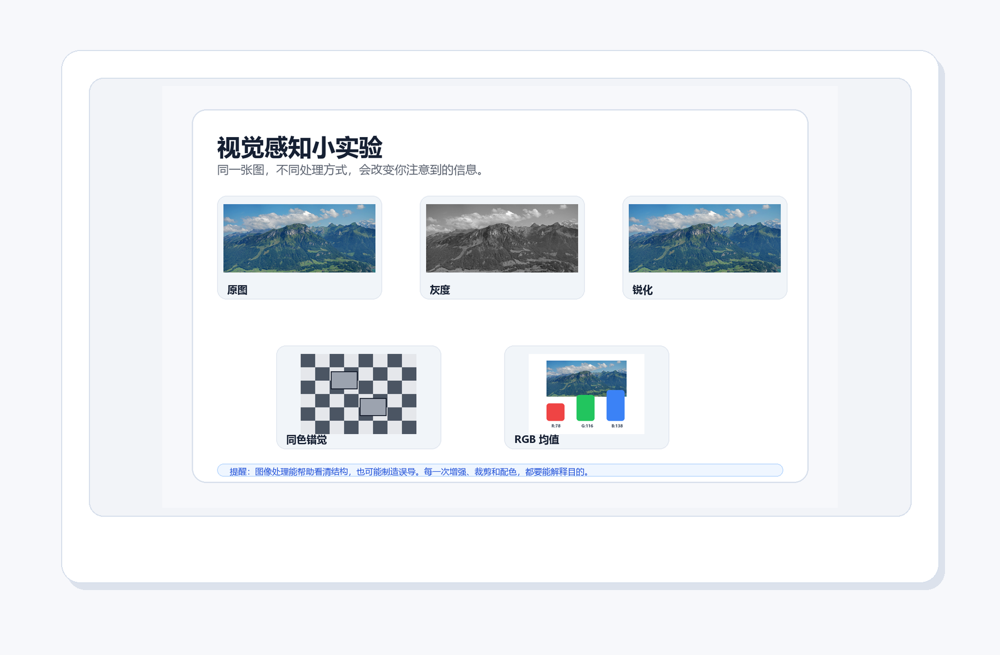
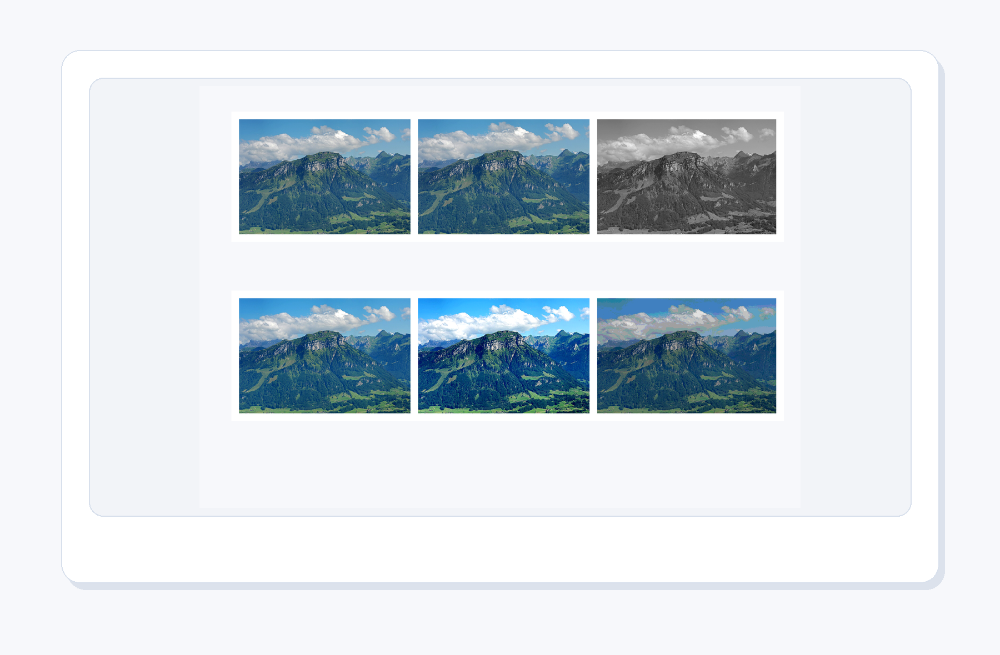
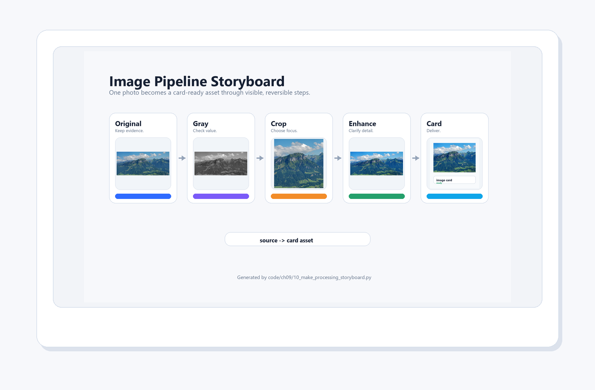
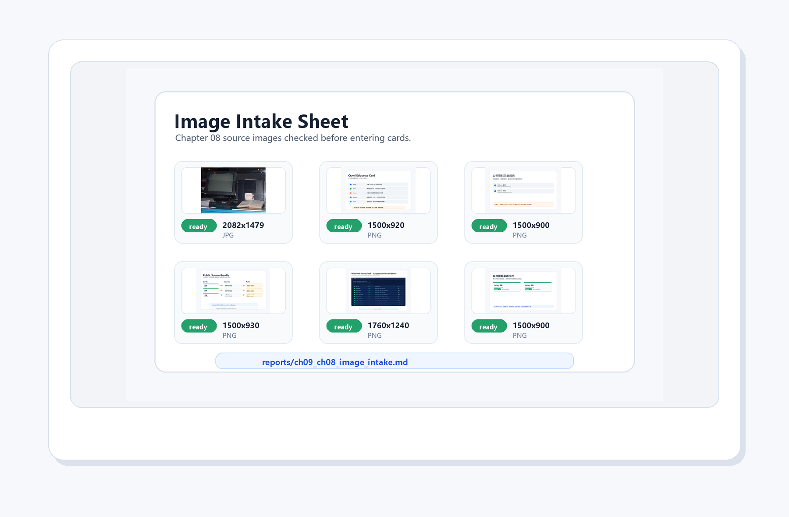
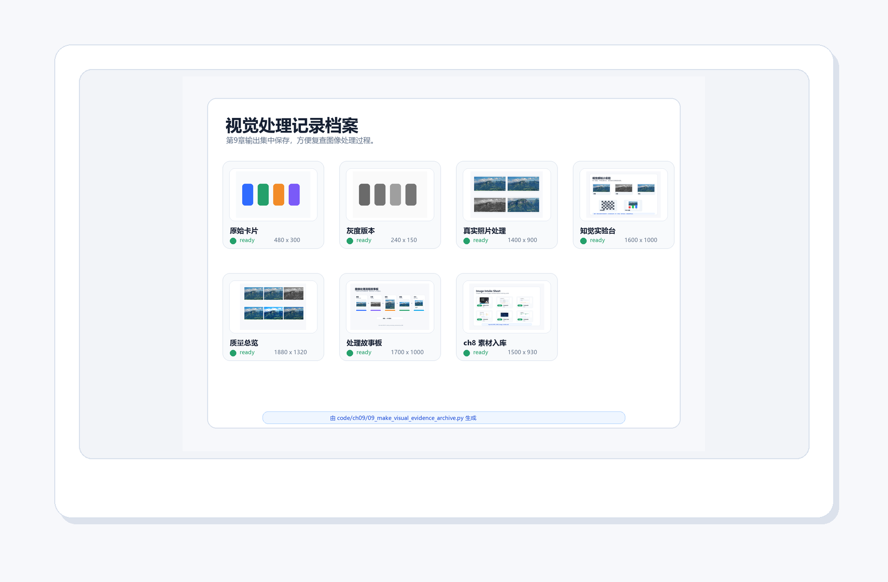

# 第 9 章：Python 图像处理

[TOC]

<style>
figure {
  margin: 1.2em auto 1.8em;
  text-align: center;
}
figure img {
  max-width: 100%;
  display: block;
  margin: 0 auto;
}
figcaption {
  margin-top: 0.45em;
  color: #5f6673;
  font-size: 0.92em;
  line-height: 1.55;
}
figcaption strong {
  color: #2d3748;
}
</style>


<figure align="center">
  
  <figcaption><strong>图9-1 本章封面</strong>：图片不是一整块魔法布，它是像素组成的矩阵。理解像素，图像处理就从玄学变成手工活。</figcaption>
</figure>

> 本章一句话：图片不是一整块魔法布，它是像素组成的矩阵。理解像素，图像处理就从玄学变成手工活。

第9章继续推进“科研卡片工厂”的视觉能力。前面几章让 Python 能整理文字、表格和报告；这一章开始处理图片。对教程、心理学实验和科研展示来说，图片不是装饰边角料，而是信息本身：刺激材料要统一尺寸，报告配图要清楚，结果图要能复查。

这一章的目标也很朴素：让你知道一张图片在程序眼里是什么，怎么安全地改它，怎么把处理结果留下来。

---

## 本章导读：先看人怎样理解图，再看程序怎样处理图

### 9.0 本章学习目标

学完本章，你应该能够：

1. 用“像素、坐标、颜色通道、处理动作、证据链”解释图像处理的最小工作链路。
2. 运行本章配套脚本，生成真实照片处理结果、视觉感知实验、图像质量总览和处理故事板。
3. 说清楚 Niépce、Russell Kirsch、Edwin Land、Helmholtz、Adelson 和 NASA 科学图像为什么适合放在图像处理章。
4. 识别覆盖原图、比例失真、过度增强、丢失上下文这几类新手错误。
5. 完成本章小项目：**学习卡片配图处理器**，并能把处理路径讲成一条可复查的故事。

### 本章分区导航

| 分区 | 对应小节 | 你要抓住的主线 | 产出证据 |
| --- | --- | --- | --- |
| 第一部分：图像的记录、数字化和视觉判断 | 9.1-9.2 | 图像处理不是凭空出现，它接着摄影、扫描、颜色研究和科学图像表达往前走 | 摄影史图、数字扫描图、颜色故事、人文脉络图、路线表 |
| 第二部分：像素、素材和最小示例 | 9.3-9.4 | 把图片看成坐标和颜色通道，再用最小脚本跑通处理动作 | 核心比喻、真实照片素材、处理前后图、运行证据 |
| 第三部分：感知、科研图片和概念表 | 9.5-9.6 | 程序改的是像素，人理解的是场景；处理要服务于理解和证据 | 心理学连接、Helmholtz、棋盘阴影错觉、概念表 |
| 第四部分：脚本、排错和项目交付 | 9.7-9.9 | 每个脚本都要留下输入、处理、输出和可复盘结果 | 脚本清单、坑地图、项目面板、故事板、视觉证据档案 |
| 第五部分：练习、复盘与后续连接 | 9.10-9.14 | 把图像处理迁移到学习卡片、实验材料、科研报告和后续自动化 | 练习记录、自测答案、复盘模板 |

---

## 第一部分：图像的记录、数字化和视觉判断

### 9.1 开场故事：先有画面，再有术语

图片不是一整块魔法布，它是像素组成的矩阵。理解像素，图像处理就从玄学变成手工活。 这句话不是为了热闹，而是为了把本章的知识放进真实使用场景。初学者最怕一上来就被术语包围，像走进一个所有门牌都用缩写写成的楼层。我们先从画面进入，再慢慢把画面翻译成代码。

<figure align="center">
  
  <figcaption><strong>图9-2 Niépce 的早期摄影作品</strong>：图像处理的前提是“图像能被记录”；今天我们用 Python 处理像素，其实是在接续摄影史里的记录与再加工。</figcaption>
</figure>

早期摄影让光影第一次稳定地留在介质上。到了数字图像时代，照片不再只是纸面或底片，而是一张可以被程序读取、缩放、裁剪、转灰度、统计颜色的像素表。你可以把一张图片想成一座由很多小格子搭成的城市：每个格子有位置，也有颜色。

<figure align="center">
  
  <figcaption><strong>图9-3 早期数字扫描图像</strong>：数字图像的关键一步，是把连续画面拆成一个个可以存储、计算和修改的像素。</figcaption>
</figure>

1957 年，Russell Kirsch 团队扫描出一张婴儿照片，它常被用来讲早期数字图像史。照片本身不大，但意义很大：一旦图像被拆成像素，程序就能对它做计算。灰度、裁剪、锐化、压缩、识别，全都从“图像可以被数字表示”开始。

<figure align="center">
  
  <figcaption><strong>图9-4 Edwin Land照片</strong>：颜色不是简单地“存在于图片里”，它还和光照、背景、人眼判断有关。理解这一点，才能更谨慎地处理 RGB、灰度和增强。</figcaption>
</figure>

Edwin Land 的故事适合放在图像处理章里。他不仅和即时成像有关，也研究过人如何在复杂光照下判断颜色。对 Python 初学者来说，这能带来一个重要提醒：图像处理不是把滑块拉到“好看”为止，而是要知道颜色、亮度和对比度会怎样影响理解。

<figure align="center">
  
  <figcaption><strong>图9-4A 图像处理的人文脉络</strong>：从早期摄影、数字扫描、颜色判断，到视觉心理学、错觉研究和科学图像表达，图像处理一直夹在“机器怎样存图”和“人怎样看图”之间。</figcaption>
</figure>

把这些画面放在一起，你会发现本章并不是“学一个图片库”这么窄。Niépce 的照片提醒我们：先要有可记录的图像；早期数字扫描告诉我们：图像可以拆成像素；Land 的颜色研究让我们知道：颜色判断和光照、背景有关；Helmholtz 和 Adelson 的故事提醒我们：人眼会主动解释画面；NASA 科学图像则把问题推到最后一步：处理后的图像怎样帮助别人理解，而不是误导别人。

所以本章所有技术动作都要带着这条背景线来看：缩放不是随手改尺寸，裁剪不是随手截一块，增强不是把颜色拉满。每一次处理都在改变观看者能看到什么、先注意什么、相信什么。

<figure align="center">
  
  <figcaption><strong>图9-5 故事场景</strong>：图像像彩色方格纸：坐标决定位置，RGB 决定颜色，滤镜就是批量修改格子的规则。</figcaption>
</figure>

这个画面对应本章的核心比喻：图像像彩色方格纸：坐标决定位置，RGB 决定颜色，滤镜就是批量修改格子的规则。 如果你能先记住这个比喻，后面的概念就不再是干巴巴的定义。

---

### 9.2 知识路线

<figure align="center">
  
  <figcaption><strong>图9-6 知识路线</strong>：先建立直觉，再运行代码，最后完成一个可展示的小项目。</figcaption>
</figure>

本章路线如下：

| 顺序 | 主题 | 你要完成的动作 |
| --- | --- | --- |
| 1 | 像素和坐标 | 把一张图看成有行列位置的小格子 |
| 2 | RGB/RGBA | 读懂颜色通道，知道透明度从哪里来 |
| 3 | Pillow 打开保存 | 用 Python 打开图片、查看属性、保存副本 |
| 4 | 缩放裁剪 | 改变尺寸和视野，观察信息有没有丢失 |
| 5 | 滤镜和灰度 | 生成灰度、锐化和增强结果，比较视觉差异 |
| 6 | 批量处理 | 让一组图片按同一规则进入卡片工厂 |
| 7 | 视觉感知与图像解释 | 判断处理是否帮助理解，还是改变了判断 |

---

## 第二部分：像素、素材和最小示例

### 9.3 核心概念：从人话到术语

<figure align="center">
  
  <figcaption><strong>图9-7 核心比喻</strong>：用一个稳定画面记住本章最重要的概念关系。</figcaption>
</figure>

先用人话说：图像像彩色方格纸：坐标决定位置，RGB 决定颜色，滤镜就是批量修改格子的规则。

<figure align="center">
  
  <figcaption><strong>图9-8 本章真实处理素材</strong>：用真实风景照片做输入，比只看抽象示意图更容易理解缩放、灰度和裁剪的效果。</figcaption>
</figure>

<figure align="center">
  
  <figcaption><strong>图9-9 科学图像与视觉表达</strong>：科学图像常常需要增强、裁剪和配色；处理得好，是让信息更清楚，不是让事实变花哨。</figcaption>
</figure>

NASA 的“创生之柱”常被用来说明科学图像的表达力量。很多科学图片并不是相机随手一拍就完事，而是要经过校正、合成、增强和说明。这里有一个重要边界：图像处理可以帮你看清结构，但不能为了好看而误导事实。学习卡片和报告配图也是一样：清楚第一，漂亮第二；漂亮必须服务于理解。

再用术语说，本章要掌握这些内容：

- **像素和坐标**：每个像素都有位置，裁剪、绘制和取色都从坐标开始。
- **RGB/RGBA**：颜色由通道组成，透明度决定图片能不能自然叠到其他背景上。
- **Pillow 打开保存**：先保留原图，再生成副本；不要让一次实验覆盖证据。
- **缩放裁剪**：缩放改变尺寸，裁剪改变视野；二者都会影响别人看到什么。
- **滤镜和灰度**：滤镜不是越重越好，灰度能帮你检查明暗结构和信息层次。
- **批量处理**：同一批素材要用一致规则处理，卡片和报告才不会忽大忽小。
- **视觉感知与图像解释**：程序改的是像素，人理解的是场景；处理前后都要问“会不会误导判断”。

术语不是用来吓人的，它只是为了让大家交流时不用每次都讲一长串故事。你先用故事建立直觉，再用术语压缩表达，这样学得稳。

---

### 9.4 最小可运行示例

<figure align="center">
  
  <figcaption><strong>图9-10 最小示例</strong>：先跑通最小代码，再逐步增加功能，学习会稳很多。</figcaption>
</figure>

本章第一件事不是背参数，而是运行一个最小例子。打开终端，进入本章目录后运行：

```bash
python code/ch09/01_create_demo_image.py
```

如果你能看到输出，说明这一章的入口已经打通。后面所有复杂功能，都是在这个入口上慢慢加能力。

<figure align="center">
  
  <figcaption><strong>图9-11 真实照片处理结果</strong>：`04_real_photo_before_after.py` 会生成无文字四宫格，对比原图、缩放、灰度和裁剪效果。</figcaption>
</figure>

这张图的重点不是“滤镜好看”，而是让处理动作可检查：缩放改变尺寸，灰度改变颜色通道，裁剪改变视野，锐化会让局部边缘更清楚。图像处理的学习一定要看结果，否则代码只是空转。

<figure align="center">
  
  <figcaption><strong>图9-12 PowerShell 真实运行结果</strong>：本章脚本会在 `output/` 和 `reports/` 里留下 demo 图、灰度图、真实照片对比图和图像处理报告。</figcaption>
</figure>

图像处理不怕步骤多，怕的是只留下一个“最终版”，却说不清它从哪里来。下面这张运行证据图把本章关键产物排成清单：原始卡片、灰度图、真实照片处理、视觉实验、质量总览、ch8 素材入库、处理故事板和视觉证据档案都要能被检查到。

<figure align="center">
  
  <figcaption><strong>图9-13 PowerShell 风格的图像处理运行证据</strong>：`11_make_image_runtime_evidence.py` 检查本章关键图片和报告是否全部生成，让“我跑过了”变成可复盘、可交付的证据。</figcaption>
</figure>

---

## 第三部分：感知、科研图片和概念表

### 9.5 与心理学和科研图片的连接

<figure align="center">
  
  <figcaption><strong>图9-14 心理学连接</strong>：把本章能力放进实验、记录、分析和学习分享的真实任务里。</figcaption>
</figure>

这一章把例子贴近心理学、科研记录和学习分享，因为这些任务天然需要清晰流程：图片来自哪里，处理做了什么，结果存到哪里，别人能不能复现。

在本章里，你可以这样理解项目价值：

- 它不是孤立练习，而是科研卡片工厂的一台新设备。
- 它处理的材料可以是课程笔记、实验记录、问卷结果、图片、网页资料或报告模板。
- 它最终要留下可检查的结果，而不是只在屏幕上闪一下。

<figure align="center">
  
  <figcaption><strong>图9-15 Hermann von Helmholtz照片</strong>：视觉不是摄像头式复制，人眼会根据经验、背景和对比做判断；图像处理要尊重这种感知特点。</figcaption>
</figure>

Helmholtz 的视觉研究可以帮你理解一件事：图片处理不仅发生在电脑里，也发生在观看者的脑子里。两块同样的灰色，放在不同背景上可能看起来完全不同；一张图片被裁掉边缘后，观看者的注意力也会被重新引导。做科研配图时，这不是小事。

<figure align="center">
  
  <figcaption><strong>图9-16 Adelson 棋盘阴影错觉</strong>：图片里的 A 和 B 看起来一深一浅，但经典错觉的妙处就在于：眼睛会把阴影、背景和经验一起算进去。</figcaption>
</figure>

这张图像是在给图像处理“泼一杯清醒水”。Python 看到的是像素值，人看到的是场景。你把亮度调高一点，程序觉得只是数值变化；观看者可能会觉得“证据更强了”。你裁掉一个边角，程序觉得只是坐标变了；别人可能会失去判断上下文。图像处理越强大，越要诚实。

---

### 9.6 关键概念拆解表

| 概念 | 人话理解 | 本章落点 |
| --- | --- | --- |
| 像素和坐标 | 图片是很多小格子，每个格子都有位置 | 裁剪时用 `(left, top, right, bottom)` 指定区域 |
| RGB/RGBA | RGB 是颜色，A 是透明度 | 生成卡片图时要知道图片模式是 `RGB` 还是 `L` |
| Pillow 打开保存 | Pillow 像图像处理工作台，负责读图和写图 | `Image.open()`、`im.save()` 是本章最小闭环 |
| 缩放裁剪 | 缩放改变尺寸，裁剪改变视野 | `02_resize_grayscale.py` 和 `04_real_photo_before_after.py` 都会用到 |
| 滤镜和灰度 | 灰度是去掉颜色信息，滤镜是批量改像素 | `convert("L")` 生成灰度图，`ImageFilter.SHARPEN` 强化局部边缘 |
| 批量处理 | 一张张手改会累，程序适合批量处理 | `03_batch_image_report.py` 读取文件夹中的多张 PNG |
| 视觉感知与图像解释 | 人眼会受背景、对比和经验影响 | `06_make_visual_perception_lab.py` 生成小实验 |
| 图像质量检查 | 好图不是越亮越锐，而是适合任务 | `07_make_image_quality_contact_sheet.py` 生成无文字处理效果总览 |
| 素材入库体检 | 从网页采集来的图，要先看尺寸、格式和比例，再决定能不能进卡片 | `08_make_ch08_image_intake.py` 扫描 ch8 图片素材并生成体检单 |
| 处理故事板 | 把原图、灰度、裁剪、增强和卡片成品连成一条可复盘路径 | `10_make_processing_storyboard.py` 生成图像处理流水线故事板 |

这张表的作用，是把“我好像懂了”变成“我知道它在哪用”。学习编程时，最危险的状态不是完全不会，而是听解释时点头，自己动手时发呆。每学一个概念，都要强迫自己问一句：它在本章项目里负责哪一段工作？

---

## 第四部分：脚本、排错和项目交付

### 9.7 配套代码逐个导览

#### 脚本 1：`01_create_demo_image.py`

这个脚本只有 9 行，但它完成了图像处理的第一步：**用代码生成一张图片**，而不是从文件读取。

**完整代码**：

```python
"""Create a demo image with Pillow."""
from pathlib import Path
from PIL import Image, ImageDraw

Path("output").mkdir(exist_ok=True)
im = Image.new("RGB", (480, 300), "#f8fafc")
d = ImageDraw.Draw(im)
for i, color in enumerate(["#2F6BFF", "#24A06B", "#F28C28", "#7A5AF8"]):
    d.rounded_rectangle((40 + i * 100, 80, 110 + i * 100, 220), radius=18, fill=color)
im.save("output/demo_card_image.png")
print("已生成 output/demo_card_image.png")
```

**逐段讲解**：

| 行 | 作用 |
| --- | --- |
| `from pathlib import Path` | Python 标准库的路径工具，比 `os.path` 更简洁。本章所有脚本都用它管理文件路径。 |
| `from PIL import Image, ImageDraw` | 从 Pillow 导入核心类：`Image` 负责打开/创建/保存/转换图像，`ImageDraw` 负责在图像上绘制形状和文字。 |
| `Path("output").mkdir(exist_ok=True)` | 确保 `output/` 目录存在。`exist_ok=True` 表示如果目录已存在也不报错——这是脚本稳健性的好习惯。 |
| `Image.new("RGB", (480, 300), "#f8fafc")` | 创建一个宽 480 像素、高 300 像素的新图像，模式为 `RGB`（红绿蓝三通道），背景色为浅灰 `#f8fafc`。 |
| `ImageDraw.Draw(im)` | 在图像 `im` 上创建一个"画板"对象，后续的绘制操作都针对这个画板。 |
| `for i, color in enumerate(...)` | 循环 4 次，依次取出颜色列表中的蓝色、绿色、橙色和紫色。 |
| `d.rounded_rectangle(...)` | 绘制一个圆角矩形。参数 `(left, top, right, bottom)` 定义了矩形边界，`radius=18` 控制圆角弧度，`fill=color` 设置填充色。4 个矩形通过 `i * 100` 在水平方向上依次排列。 |
| `im.save(...)` | 将内存中的图像写入磁盘文件。格式由文件后缀 `.png` 自动确定。 |

**关键概念**：脚本 1 演示了 Pillow 的两大基本功——创建空白画布和在画布上绘制几何图形。所有图像处理的起点都是"有一张图"，这张图既可以来自文件，也可以像这里一样由代码生成。学会 `Image.new` 和 `ImageDraw`，你就能在需要时用代码制作简单的学习卡片底图。

运行方式：

```bash
python code/ch09/01_create_demo_image.py
```

---

#### 脚本 2：`02_resize_grayscale.py`

**完整代码**：

```python
"""Resize and grayscale an image."""
from pathlib import Path
from PIL import Image

src = Path("output/demo_card_image.png")
im = Image.open(src)
small = im.resize((240, 150))
gray = small.convert("L")
gray.save("output/demo_card_image_gray.png")
print("已生成 output/demo_card_image_gray.png")
```

**逐段讲解**：

这个脚本把脚本 1 生成的彩色卡片变成一张**小尺寸灰度图**，是图像处理中最常见的两个操作——缩放和色彩转换——的最小闭环。

| 行 | 作用 |
| --- | --- |
| `Image.open(src)` | 从文件读取图像，返回一个 `Image` 对象。此时图像数据加载到内存中，但还未做任何处理。 |
| `im.resize((240, 150))` | 将原图从 `(480, 300)` 缩小到 `(240, 150)`。注意：`resize` 不会保持原图宽高比，如果传入的宽高比例与原图不一致，图片会被拉伸。保持比例要用 `ImageOps.contain()`（见脚本 4）。 |
| `small.convert("L")` | 将 RGB 彩色图像转为灰度图。`"L"` 代表 Luminance（亮度），每个像素值在 0（黑）到 255（白）之间。转换公式是 `0.299R + 0.587G + 0.114B`，模拟人眼对不同颜色的敏感度。 |
| `gray.save(...)` | 保存结果。文件后缀 `.png` 决定了输出格式。 |

**关键概念**：
- **`resize()`** 改变图像尺寸，但会忽略原始宽高比。当你需要精确尺寸（如学习卡片固定框）时有用，但如果要保持比例，请用 `ImageOps.contain()` 或 `ImageOps.fit()`。
- **`convert("L")`** 是 Pillow 中最常用的色彩模式转换方法。`RGB` → `"L"` 去掉颜色保留明暗，`"L"` → `"RGB"` 则是把单通道复制成三通道（因为某些操作要求输入必须是 RGB）。
- 脚本 2 的输入来自脚本 1 的输出，这体现了**脚本之间的串联关系**：前一个脚本的产物是后一个脚本的原料。

运行方式：

```bash
python code/ch09/02_resize_grayscale.py
```

---

#### 脚本 3：`03_batch_image_report.py`

**完整代码**：

```python
"""List image sizes in a folder."""
from pathlib import Path
from PIL import Image

for path in Path("output").glob("*.png"):
    with Image.open(path) as im:
        print(path.name, im.size, im.mode)
```

**逐段讲解**：

这个脚本虽然只有 6 行，但它演示了图像处理项目中一个极其重要的能力：**批量读取和元数据提取**。

| 行 | 作用 |
| --- | --- |
| `Path("output").glob("*.png")` | 使用 glob 模式匹配 `output/` 目录下所有 `.png` 文件，返回一个可迭代的 `Path` 对象列表。这是 Python 中遍历文件夹最常见的方式。 |
| `with Image.open(path) as im:` | 使用上下文管理器（`with` 语句）打开图像。好处是：即使读取过程中发生异常，文件句柄也会被安全关闭。这是 Pillow 官方推荐的打开方式。 |
| `im.size` | 返回一个 `(width, height)` 元组，例如 `(480, 300)`。 |
| `im.mode` | 返回图像的颜色模式字符串，常见的有 `"RGB"`（彩色）、`"L"`（灰度）、`"RGBA"`（彩色+透明通道）。 |

**关键概念**：
- **批量处理思维**：不要只对一张图执行操作，而是让程序自动扫描目录中的所有图片。这在处理几十上百张素材时能节省大量时间。
- **`im.size` 和 `im.mode` 是图像的两项基本元数据**。任何时候拿到一张图，第一件事就是检查它的尺寸是否够用、模式是否正确。本章后面的入库体检（脚本 8）正是基于这个思路做了更完整的检查。
- **`with` 语句的作用**：`Image.open()` 打开文件后需要关闭，`with` 自动帮你完成这一步。忘记关闭文件在高并发或大批量处理时可能导致资源耗尽。

运行方式：

```bash
python code/ch09/03_batch_image_report.py
```

#### 脚本 4：`04_real_photo_before_after.py`

**完整代码**：

```python
"""Create a before/after image-processing sheet from a real photo."""

from pathlib import Path

from PIL import Image, ImageFilter, ImageOps


SOURCE = Path("assets/ch09/web/fronalpstock_sample.jpg")
OUTPUT = Path("output/fronalpstock_before_after.png")


def fit(im: Image.Image, size: tuple[int, int]) -> Image.Image:
    fitted = ImageOps.contain(im, size)
    canvas = Image.new("RGB", size, "#F2F4F8")
    x = (size[0] - fitted.width) // 2
    y = (size[1] - fitted.height) // 2
    canvas.paste(fitted, (x, y))
    return canvas


def main():
    OUTPUT.parent.mkdir(exist_ok=True)
    raw = Image.open(SOURCE).convert("RGB")
    small = raw.resize((raw.width // 2, raw.height // 2))
    gray = ImageOps.grayscale(raw).convert("RGB")
    w, h = raw.size
    crop = raw.crop((w // 4, h // 4, w * 3 // 4, h * 3 // 4)).filter(ImageFilter.SHARPEN)

    panels = [raw, small, gray, crop]
    sheet = Image.new("RGB", (1400, 900), "#F7F8FB")
    positions = [(70, 70), (720, 70), (70, 480), (720, 480)]
    for panel, pos in zip(panels, positions):
        framed = fit(panel, (610, 340))
        sheet.paste(framed, pos)

    sheet.save(OUTPUT, optimize=True)
    print("已生成", OUTPUT)


if __name__ == "__main__":
    main()
```

**逐段讲解**：

这个脚本从一个真实风景照片出发，生成一张"四宫格"对比图：原图 → 缩小 → 灰度 → 裁剪+锐化。它也是本章第一个使用了**自定义辅助函数**和**图像合成**的脚本。

**`fit()` 辅助函数**：

```python
def fit(im: Image.Image, size: tuple[int, int]) -> Image.Image:
    fitted = ImageOps.contain(im, size)   # 保持比例缩放，填满目标区域
    canvas = Image.new("RGB", size, "#F2F4F8")   # 创建目标大小的画布（浅灰背景）
    x = (size[0] - fitted.width) // 2      # 水平居中
    y = (size[1] - fitted.height) // 2     # 垂直居中
    canvas.paste(fitted, (x, y))           # 把缩放后的图贴到画布中央
    return canvas
```

这个函数的职责是：把任意尺寸的图像放进一个固定尺寸的"相框"里，保持比例、居中摆放、多余空间用浅灰填充。这样做的好处是，即使原始图片比例不同，最终输出的四张子图在拼贴时尺寸一致，版面整齐。

**`main()` 函数中的四种处理**：

| 处理 | 代码 | 说明 |
| --- | --- | --- |
| 原图 | `Image.open(SOURCE).convert("RGB")` | 读取原始照片，确保转为 RGB（避免 JPEG 的 `CMYK` 或含透明通道的意外情况）。 |
| 缩小 | `raw.resize((raw.width // 2, raw.height // 2))` | 宽高各缩小一半。这里保留了原始宽高比，因为宽和高的缩放倍数相同（都是 `// 2`）。 |
| 灰度 | `ImageOps.grayscale(raw).convert("RGB")` | `ImageOps.grayscale()` 等同于 `convert("L")`，但返回的是单通道图；`.convert("RGB")` 又把它转回三通道，这样后续合成时不会因通道数不匹配而报错。 |
| 裁剪+锐化 | `raw.crop((w//4, h//4, w*3//4, h*3//4)).filter(ImageFilter.SHARPEN)` | `crop()` 从原图中心取 1/4 区域（左、上、右、下边界分别取 `w/4, h/4, 3w/4, 3h/4`）；`filter(ImageFilter.SHARPEN)` 对裁剪结果应用锐化滤镜，增强边缘对比度。 |

**图像合成**：

```python
sheet = Image.new("RGB", (1400, 900), "#F7F8FB")     # 创建大画布
positions = [(70, 70), (720, 70), (70, 480), (720, 480)]  # 四个子图的位置
for panel, pos in zip(panels, positions):
    framed = fit(panel, (610, 340))   # 将每张子图统一为 610x340 居中版式
    sheet.paste(framed, pos)          # 粘贴到大画布上
```

这是一个典型的**图像拼贴**模式：创建一个宽 1400、高 900 的新画布，将四个处理结果按 2×2 网格排列。`sheet.save(OUTPUT, optimize=True)` 中的 `optimize=True` 让 Pillow 尝试压缩 PNG 文件体积。

**关键概念**：
- **`ImageOps.contain()` 和 `ImageOps.fit()` 的区别**：`contain` 保持比例缩放，使图像完全适应目标区域（可能留有空白）；`fit` 则裁剪边缘以填满目标区域。前者用于展示完整内容，后者用于生成统一尺寸的缩略图。
- **`crop()` 的坐标系统**：Pillow 中 `crop((left, top, right, bottom))` 的坐标原点在**左上角**，x 轴向右为正，y 轴向下为正。这是初学者最容易搞混的地方。
- **复合操作的顺序**：先裁剪后锐化，而不是相反。如果先锐化再裁剪，锐化计算量会更大（处理整图而非局部），且裁剪后可能丢掉锐化过的边缘。

运行方式：

```bash
python code/ch09/04_real_photo_before_after.py
```

它会读取 `assets/ch09/web/fronalpstock_sample.jpg`，生成：

```text
output/fronalpstock_before_after.png
```

请重点观察输出图片中：尺寸、颜色和视野发生了什么变化。图像处理不要只看"代码成功运行"，要打开输出文件，确认结果真的符合目的。

---

#### 脚本 5：`05_make_image_processing_report.py`

**代码结构概览**：

这个脚本的代码较长（约 80 行），但逻辑分三步走：**收集 → 写报告 → 生成预览图**。下面拆解核心函数。

**第一步：收集图片信息（`image_info()` 函数）**

```python
def image_info(path: Path):
    with Image.open(path) as im:
        return im.size, im.mode
```

对每张图片，读取它的 `(width, height)` 和颜色模式。这两个指标是判断图片是否适合学习卡片的门槛：尺寸太小放大后模糊，模式是 `RGBA` 的话可能需要先合入背景。

**第二步：生成 Markdown 报告（`make_markdown()` 函数）**

```python
lines = [
    "# 第9章图像处理报告",
    "",
    "| 文件 | 尺寸 | 模式 | 用途 |",
    "| --- | --- | --- | --- |",
]
uses = {
    "demo_card_image.png": "程序生成的学习卡片配图",
    "demo_card_image_gray.png": "灰度转换结果",
    "fronalpstock_before_after.png": "真实照片处理前后对比",
    "pillars_of_creation.jpg": "科学图像素材，用于理解图像增强和表达",
}
for path in paths:
    size, mode = image_info(path)
    lines.append(f"| {path.name} | {size[0]}x{size[1]} | {mode} | {uses[path.name]} |")
report.write_text("\n".join(lines), encoding="utf-8")
```

它用 Python 的字符串拼接直接写出了一个 Markdown 表格。每张图占一行，列出文件名、尺寸、模式和用途。这是将脚本运行结果**归档为可阅读文档**的标准做法。

**第三步：生成预览图（`make_preview()` 函数）**

```python
boxes = [
    (150, 300, 520, 535),
    (560, 300, 930, 535),
    (970, 300, 1390, 535),
    (150, 610, 520, 835),
]
labels = ["生成卡片", "灰度转换", "真实照片对比", "科学图像素材"]
for box, path, label in zip(boxes, paths, labels):
    d.rounded_rectangle(box, radius=20, fill="#F1F5F9", outline="#E2E8F0", width=2)
    paste_contained(im, path, (box[0] + 18, box[1] + 18, box[2] - 18, box[3] - 58))
    d.text((box[0] + 22, box[3] - 42), label, fill="#162033", font=font(23, True))
```

预览图把四张关键输出排列在一张大图上，让读者不用逐个打开文件就能一次性对比。`paste_contained()` 函数确保子图保持比例放入预留区域。

**关键概念**：
- **报告先行**：图像处理不是"改完图就完事了"。脚本 5 教会你：每做完一批处理，立刻生成一份报告，记录文件名、尺寸、模式和用途。三周后你回到项目，打开报告就能知道当时做了什么。
- **Markdown 是从代码生成文档最简单的方式**：不需要额外库，字符串拼接即可，和 Git、GitHub 无缝配合。
- **`paste_contained()` 的设计模式**：注意它把"保持比例粘贴"封装成一个可复用的函数，后续脚本 7、9、10 都沿用了类似的思路。

第一次运行时不要急着改代码。先原样运行，确认能看到输出；第二次再改一个最小参数；第三次再尝试把输出写入 `output/` 或 `reports/`。

运行方式：

```bash
python code/ch09/05_make_image_processing_report.py
```

---

#### 脚本 6：`06_make_visual_perception_lab.py`

**代码结构概览**：

这个脚本的代码约 100 行，核心是**视觉感知实验**——展示同一张图片在不同处理条件下给人带来的感受差异。它包含一个备用图和四个处理面板。

**备用图机制（`sample_image()` 函数）**：

```python
def sample_image() -> Image.Image:
    if SOURCE_IMAGE.exists():
        raw = Image.open(SOURCE_IMAGE)
        return ImageOps.exif_transpose(raw).convert("RGB")
    im = Image.new("RGB", (960, 620), "#DDEBFF")
    d = ImageDraw.Draw(im)
    d.rectangle((0, 380, 960, 620), fill="#5A8F55")
    d.polygon([(0, 420), (260, 170), (520, 420)], fill="#F8FAFC")
    ...
    return im
```

如果源照片不存在，脚本不会直接崩溃，而是用 `ImageDraw` 绘制一个三角形+矩形的抽象风景作为替代。这是脚本设计中的**稳健性考虑**——运行环境不同，素材路径未必一致，加一个 fallback 让初学者在任何环境下都能跑通。

**模拟同色错觉（`make_illusion()` 函数）**：

```python
dark = "#4B5563"
light = "#E5E7EB"
same = "#9CA3AF"
for row in range(6):
    for col in range(8):
        fill = dark if (row + col) % 2 == 0 else light
        d.rectangle((col * 65, row * 60, col * 65 + 65, row * 60 + 60), fill=fill)
d.rectangle((135, 78, 255, 158), fill=same)   # 棋盘上的 A 方块
d.rectangle((265, 198, 385, 278), fill=same)   # 棋盘上的 B 方块
```

这是一个经典的**棋盘阴影错觉**：两个颜色完全相同的方块，因为周围的棋盘格子深浅不同，看起来一个亮一个暗。它用两层嵌套循环画了 6×8 的国际象棋棋盘，然后在两个格子位置覆盖了相同颜色（`#9CA3AF`）的方块。学习图像处理时理解这一点很重要——**像素的数值诚实，但人眼的感知会说谎**。

**RGB 均值展示（`make_channel_panel()` 函数）**：

```python
pixels = im.resize((1, 1)).getpixel((0, 0))
labels = [("R", pixels[0], "#EF4444"), ("G", pixels[1], "#22C55E"), ("B", pixels[2], "#3B82F6")]
```

将原图缩放到 1×1 像素，然后读取这一个像素的 RGB 值——实际上就是整张图的**平均颜色**。然后用三个彩色条形图直观展示 R、G、B 通道的强度。这是一个巧妙的小技巧：用 `resize((1, 1))` 代替复杂计算来获得图像主色调。

**布局与生成**：

```python
panels = [
    ("原图", ImageOps.contain(im, (520, 320))),
    ("灰度", ImageOps.contain(gray.convert("RGB"), (520, 320))),
    ("锐化", ImageOps.contain(sharpen, (520, 320))),
    ("同色错觉", illusion),
    ("RGB 均值", channel_panel),
]
positions = [(130, 260), (610, 260), (1090, 260), (270, 615), (810, 615)]
```

5 个面板按 3+2 布局排列：上面一行放原图、灰度、锐化，下面一行放错觉图和 RGB 均值。每个面板都带有浅灰圆角边框和标签文字。

**关键概念**：
- **图像处理不是"越处理越真实"**：灰度会丢失色彩信息，锐化可能引入伪影，错觉图展示的是人眼与机器的差异。学会区分"像素变了"和"感受变了"，是图像处理走向专业的第一步。
- **`sample_image()` 的 fallback 设计**：专业脚本不会因为缺少某张图片就崩溃退出，而是提供一个合理的替代。这是工程思维和脚本思维的重要区别。
- **`resize((1, 1))` 的妙用**：用一个极小尺寸的缩放来实现"像素平均"，比手动计算均值更简洁高效。

运行方式：

```bash
python code/ch09/06_make_visual_perception_lab.py
```

---

#### 脚本 7：`07_make_image_quality_contact_sheet.py`

**代码结构概览**：

这个脚本的关键设计原则是：**图片只负责展示，文字解释放在报告中**。它生成 6 张处理效果图在 3×2 网格中排列，不带任何标签文字。

**六种处理变体**：

```python
im = load_source()                                                          # 原图
crop = ImageOps.fit(im, (900, 620))                                          # 居中裁剪
gray = ImageOps.grayscale(im).convert("RGB")                                 # 灰度
balanced = ImageEnhance.Color(im).enhance(1.15)                              # 色彩增强 1.15 倍
balanced = ImageEnhance.Contrast(balanced).enhance(1.12)                     # 对比度增强 1.12 倍
overdone = ImageEnhance.Contrast(im).enhance(1.75).filter(ImageFilter.SHARPEN)  # 过度处理
ImageOps.posterize(im, 3)                                                   # 色调分离（posterize），保留 3 位有效位
```

| 处理 | 目的 |
| --- | --- |
| 原图 | 基准线，没有处理就是最好的对照 |
| 居中裁剪 `ImageOps.fit()` | 模拟卡片封面需要统一尺寸的场景，观察边缘是否丢失关键信息 |
| 灰度 `grayscale` | 去掉颜色后，图片的明暗结构是否仍然清晰可辨 |
| 平衡增强 `Enhance.Color` + `Enhance.Contrast` | 适度的颜色和对比度优化，让学习卡片更清楚 |
| 过度处理 | 对比度拉到 1.75 倍再加锐化——模拟"看起来很猛"的陷阱 |
| 色调分离 `posterize` | 减少颜色位数到 3，模拟极端压缩后的效果，观察信息损失 |

**`frame()` 辅助函数**：

```python
def frame(im: Image.Image, size: tuple[int, int]) -> Image.Image:
    shown = ImageOps.fit(im, size, method=getattr(Image, "Resampling", Image).LANCZOS)
    panel = Image.new("RGB", (size[0] + 48, size[1] + 48), "#FFFFFF")
    panel.paste(shown, (24, 24))
    return panel
```

用 `ImageOps.fit()` 统一所有子图为 560×360（裁剪填满），在外围加 24 像素白色边框。边框让拼贴后的每张子图有"留白呼吸感"，方便视觉比较。

**报告（`make_report()`）**：

报告不是表格，而是一组**引导观察的问题**：

```text
| 观察点 | 复盘问题 |
| --- | --- |
| 尺寸 | 图片是否适合放进学习卡片，边缘有没有被裁掉关键信息？ |
| 明暗 | 画面是否足够清楚，暗部和亮部有没有丢失层次？ |
| 颜色 | 颜色增强是否服务信息表达，而不是单纯追求刺激？ |
| 锐化 | 边缘是否更清楚，还是出现了不自然的噪点？ |
| 复现 | 处理步骤是否能用代码重新生成，而不是靠手动试出来？ |
```

这种"只问不答"的设计，是为了让学习者**自己得出判断**，而不是被动接受结论。

**关键概念**：
- **总览图不加文字**：文字会引导观看者的注意力。无文字总览图迫使你用自己的眼睛比较差异，而不是先看标签再找差异。
- **`ImageEnhance` 模块**：Pillow 提供了 `Color`、`Contrast`、`Brightness`、`Sharpness` 四个增强器，每个都有 `enhance(factor)` 方法——`1.0` 是原样，大于 1 增强，小于 1 减弱。
- **`posterize()` 的用途**：虽然平时很少用，但它能帮你快速理解"颜色深度"的概念——位数越少，色彩过渡越生硬。

运行方式：

```bash
python code/ch09/07_make_image_quality_contact_sheet.py
```

---

#### 脚本 8：`08_make_ch08_image_intake.py`

**代码结构概览**：

这个脚本把第 8 章（网络爬虫）采集的图片素材放进第 9 章的**入库体检**流程。它是跨章节协作的典型例子。

**素材来源定位**：

```python
BOOK_ROOT = ROOT.parent
CH08_WEB = BOOK_ROOT / "python_tutorial_ch08" / "assets" / "ch08" / "web"
```

通过相对路径找到上一章的素材目录。如果该目录不存在（比如用户还没学习 ch8），`image_files()` 返回空列表，不会报错。

**入库审核标准（`status_for()` 函数）**：

```python
def status_for(width: int, height: int) -> tuple[str, str]:
    long_side = max(width, height)
    short_side = min(width, height)
    ratio = width / height if height else 1
    if long_side < 700:           # 长边太小，放大后模糊
        return "review", "resolution"
    if short_side < 360:          # 短边太窄，不适合卡片排版
        return "review", "thin crop"
    if ratio > 2.4 or ratio < 0.42:  # 比例太极端
        return "review", "extreme ratio"
    return "ready", "card source"
```

这是整套脚本中第一个明确的**质量阈值**逻辑。它用三个规则判断图片是否适合进入学习卡片生产线：
- 长边 < 700 像素 → 分辨率不够
- 短边 < 360 像素 → 裁剪后可用区域太小
- 宽高比 > 2.4 或 < 0.42 → 太宽或太窄，放不进标准卡片版式

不符合条件的标记为 `"review"` 并附上原因，让用户决定是否需要人工复查。

**元数据采集（`collect_metadata()` 函数）**：

```python
for path in image_files():
    with Image.open(path) as im:
        im = ImageOps.exif_transpose(im)          # 校正手机/相机拍摄的旋转方向
        width, height = im.size
        status, note = status_for(width, height)
        items.append({
            "file": path.name,
            "format": im.format or path.suffix.upper().lstrip("."),
            "mode": im.mode,
            "width": width, "height": height,
            "status": status, "note": note,
        })
```

`ImageOps.exif_transpose()` 是一个常被忽略但极其重要的函数——手机或相机拍摄的 JPEG 图片会包含 EXIF 旋转信息，如果不校正，读取到的 `width` 和 `height` 可能是反的。

**输出三种格式**：

| 输出 | 格式 | 用途 |
| --- | --- | --- |
| `ch09_ch08_image_intake.json` | JSON | 给其他程序读取，方便后续自动化处理 |
| `ch09_ch08_image_intake.md` | Markdown | 给人阅读，在 GitHub 或报告里直接查看 |
| `ch09_ch08_image_intake.png` | PNG | 可视化的总览图，标注每张图的状态标签 |

一个信息同时输出三种格式，覆盖了"程序调用、文档归档、视觉速览"三种使用场景。

**关键概念**：
- **跨章节协作**：ch8 负责"采集"，ch9 负责"质检"。学会让不同章节的脚本互相调用，比各自独立工作更有价值。
- **质量阈值的设定**：`700px`、`360px`、`2.4` 这些数字不是拍脑袋出来的，而是根据学习卡片的标准尺寸（约 400×300）倒推得出的安全边界。在实际项目中，这类阈值需要反复调整。
- **`ImageOps.exif_transpose()`**：处理真实照片（非程序生成图）时的必修课。不调用这个函数，横拍和竖拍的照片尺寸信息会混乱。

运行方式：

```bash
python code/ch09/08_make_ch08_image_intake.py
```

---

#### 脚本 9：`09_make_visual_evidence_archive.py`

**代码结构概览**：

这个脚本把本章前 8 个脚本的关键输出收集到一张总览图上——它不是生产新内容，而是**做一次"视觉盘点"**。

**待归档素材清单**：

```python
SOURCES = [
    ("原始卡片", OUTPUT / "demo_card_image.png"),              # 脚本 1
    ("灰度版本", OUTPUT / "demo_card_image_gray.png"),           # 脚本 2
    ("真实照片处理", OUTPUT / "fronalpstock_before_after.png"),    # 脚本 4
    ("知觉实验台", OUTPUT / "ch09_visual_perception_lab.png"),    # 脚本 6
    ("质量总览", OUTPUT / "ch09_image_quality_contact_sheet.png"),# 脚本 7
    ("处理故事板", OUTPUT / "ch09_processing_storyboard.png"),    # 脚本 10
    ("ch8 素材入库", OUTPUT / "ch09_ch08_image_intake.png"),       # 脚本 8
]
```

7 个关键输出，每个都有一个中文标签和对应的文件路径。

**缺失处理（`fit_thumb()` 函数）**：

```python
def fit_thumb(path: Path, size: tuple[int, int]) -> Image.Image:
    if not path.exists():
        thumb = Image.new("RGB", size, "#FEE2E2")     # 浅红色背景
        d = ImageDraw.Draw(thumb)
        d.line((70, 55, size[0] - 70, size[1] - 55), fill="#E84C61", width=8)  # 打叉
        d.line((size[0] - 70, 55, 70, size[1] - 55), fill="#E84C61", width=8)
        return thumb
    ...
```

如果某个输出文件不存在（比如用户还没运行对应的脚本），不会崩溃，而是在对应位置生成一个**浅红底 + 红色叉号**的占位图。这样总览图始终能生成，同时缺失项一目了然。

**状态标记**：

```python
status = str(info["status"])
status_color = "#24A06B" if status == "ready" else "#E84C61"
draw.ellipse((x + 24, y + 250, x + 44, y + 270), fill=status_color)  # 绿色或红色圆点
draw.text((x + 56, y + 244), status, fill=status_color, font=small_font)
size_text = f"{info['width']} x {info['height']}"
draw.text((x + 168, y + 244), size_text, fill="#64748B", font=small_font)
```

每张子图下方显示状态（绿色 ready / 红色 missing）和实际尺寸。这个设计很像一个**仪表盘**——你不需要打开七个文件夹，只看一张图就知道哪些脚本跑过了、哪些还没跑。

**关键概念**：
- **证据链思维**：图像处理的最终产物不只是一张"成品图"，而是从原始素材到中间结果再到最终交付的完整链路。证据档案就是把这个链路可视化。
- **优雅降级（graceful degradation）**：当依赖的数据不完整时，不应崩溃，而应生成一个有明确标记的占位结果。这比报错退出对初学者友好得多。
- **`image_info()` 的信息收集**：和脚本 5 的 `image_info()` 功能相似，但这里把信息用图文并茂的方式展示，而不只是写在 Markdown 表格里。

运行方式：

```bash
python code/ch09/09_make_visual_evidence_archive.py
```

如果你运行了下面的 `10_make_processing_storyboard.py`，可以再回头运行一次这个脚本，让档案刷新到最新状态。

---

#### 脚本 10：`10_make_processing_storyboard.py`

**代码结构概览**：

这个脚本是整章中最具"作品感"的一个——它把一张真实照片经过 **5 个阶段** 的处理，生成一张从"原材料"到"卡片成品"的故事板。

**五个处理阶段（`make_steps()` 函数）**：

```python
def make_steps(source: Image.Image) -> list[tuple[str, Image.Image, str]]:
    small = contain_image(source, (360, 220))                                                      # Original
    gray = ImageOps.grayscale(source).convert("RGB")                                                # Gray
    square = fit_image(source, (420, 420))                                                          # Crop
    enhanced = ImageEnhance.Contrast(source).enhance(1.28)
    enhanced = ImageEnhance.Color(enhanced).enhance(1.12).filter(ImageFilter.UnsharpMask(radius=1.4, percent=120))  # Enhance
    card = Image.new("RGB", (420, 420), "#F8FAFC")
    card_draw = ImageDraw.Draw(card)
    thumb = fit_image(enhanced, (360, 250))
    card.paste(thumb, (30, 35))
    card_draw.rounded_rectangle((30, 315, 390, 382), radius=18, fill="#FFFFFF", outline="#CBD5E1", width=2)
    card_draw.text((55, 332), "image card", fill=INK, font=font(26, True))
    card_draw.text((55, 362), "ready", fill=GREEN, font=font(18, True))                              # Card
    return [
        ("Original", small, "Keep evidence."),
        ("Gray", contain_image(gray, (360, 220)), "Check value."),
        ("Crop", square, "Choose focus."),
        ("Enhance", contain_image(enhanced, (360, 220)), "Clarify detail."),
        ("Card", card, "Deliver."),
    ]
```

| 阶段 | 核心操作 | 设计意图 |
| --- | --- | --- |
| **Original** | `ImageOps.contain()` 生成缩略图 | "保留证据"——原图是后续所有操作的基准，永远不要覆盖它 |
| **Gray** | `ImageOps.grayscale()` → `convert("RGB")` | "检查明暗"——去掉颜色后，图像的亮部、暗部、中间调是否层次分明 |
| **Crop** | `ImageOps.fit((420, 420))` | "选择焦点"——正方形裁剪迫使你思考：观看者应该先看哪里 |
| **Enhance** | `Contrast(1.28)` + `Color(1.12)` + `UnsharpMask(1.4, 120%)` | "优化细节"——适度增强对比度和清晰度，而不是一次性拉满 |
| **Card** | 增强图 + 圆角标签 + "image card / ready" 文字 | "最终交付"——把处理结果以学习卡片的形式呈现 |

注意增强阶段的参数组合：对比度 1.28、色彩 1.12、USM 锐化半径 1.4 像素 + 强度 120%。这些数值是经验值，不是硬性标准——你可以在自己的项目中测试并调整。

**故事板绘制（`draw_step()` 函数）**：

```python
def draw_step(draw, canvas, x, y, title, image, note, color):
    draw.rounded_rectangle((x, y, x + 270, y + 360), radius=26, fill="#FFFFFF", outline=LINE, width=2)
    draw.text((x + 24, y + 22), title, fill=INK, font=font(28, True))
    draw.text((x + 24, y + 58), note, fill=MUTED, font=font(17))
    frame = (x + 24, y + 98, x + 246, y + 306)   # 图片预览区域
    ...
    draw.rounded_rectangle((x + 24, y + 322, x + 246, y + 342), radius=10, fill=color)  # 底部彩色条
```

每个处理阶段被绘制成一个圆角卡片，宽 270、高 360，包含标题、一句话说明、图片预览和底部彩色标识条。5 个卡片从左到右排列，就像电影的故事板一样。

**关键概念**：
- **处理流水线可视化**：故事板不是"最终效果图"，而是**处理过程的视觉说明书**。每当你做一个新的图像处理项目，都应该生成这样一张故事板——它能帮你和同事快速对齐"我们到底做了什么"。
- **`ImageFilter.UnsharpMask`**：比单纯的 `SHARPEN` 滤镜更可控。`radius` 控制锐化影响的边缘宽度（小半径 = 精细边缘），`percent` 控制强度。USM 是专业图像处理软件中标准锐化工具。
- **为什么是 5 个阶段而不是 3 个或 7 个**：因为每个阶段对应一个明确的问题——原图（证据）、灰度（结构）、裁剪（构图）、增强（细节）、卡片（交付）。多一个冗余，少一个不完整。

运行方式：

```bash
python code/ch09/10_make_processing_storyboard.py
```

---

#### 脚本 11：`11_make_image_runtime_evidence.py`

**代码结构概览**：

这个脚本是本章的**验收工具**。它不加工图片，而是检查前面 10 个脚本的所有关键输出是否存在、大小是否正常，然后生成一份 PowerShell 终端风格的运行证据图。

**检查清单（`CHECKS` 常量）**：

```python
CHECKS = [
    ("01 demo image", OUTPUT / "demo_card_image.png"),
    ("02 grayscale", OUTPUT / "demo_card_image_gray.png"),
    ("04 real photo sheet", OUTPUT / "fronalpstock_before_after.png"),
    ("05 report md", REPORTS / "ch09_image_processing_report.md"),
    ("05 report preview", REPORTS / "ch09_image_processing_report_preview.png"),
    ("06 perception report", REPORTS / "ch09_visual_perception_lab.md"),
    ("06 perception image", OUTPUT / "ch09_visual_perception_lab.png"),
    ("07 quality report", REPORTS / "ch09_image_quality_contact_sheet.md"),
    ("07 quality sheet", OUTPUT / "ch09_image_quality_contact_sheet.png"),
    ("08 ch08 intake report", REPORTS / "ch09_ch08_image_intake.md"),
    ("08 ch08 intake json", OUTPUT / "ch09_ch08_image_intake.json"),
    ("08 ch08 intake image", OUTPUT / "ch09_ch08_image_intake.png"),
    ("10 storyboard report", REPORTS / "ch09_processing_storyboard.md"),
    ("10 storyboard image", OUTPUT / "ch09_processing_storyboard.png"),
    ("09 archive report", REPORTS / "ch09_visual_evidence_archive.md"),
    ("09 archive image", OUTPUT / "visual_evidence_archive.png"),
]
```

16 个检查项覆盖了脚本 1-10 的所有产物。注意：脚本 3 只是打印信息不生成文件，所以不在清单中。

**状态检测（`status_rows()` 函数）**：

```python
def status_rows() -> list[dict[str, str | int]]:
    rows = []
    for label, path in CHECKS:
        exists = path.exists()
        size = path.stat().st_size if exists else 0
        rows.append({
            "label": label,
            "path": path.relative_to(ROOT).as_posix(),
            "status": "OK" if exists else "MISSING",
            "bytes": size,
        })
    return rows
```

对每个检查项，判断文件是否存在、获取文件大小。`MISSING` 表示对应的脚本还没有运行过。注意这里 `path.relative_to(ROOT)` 把绝对路径转为相对路径，方便在报告中阅读。

**PowerShell 风格绘图（`draw_preview()` 函数）**：

```python
draw.rectangle((145, 184, 1615, 1140), fill="#113A6B")  # 深蓝色终端背景
...
draw.text((170, y), "PS> cd python_tutorial_ch09", fill="#59D9FF", font=mono_font)  # 青色提示符
draw.text((170, y), f"Runtime artifacts: {ok_count}/{len(rows)} ready", fill="#68F06A", font=title_font)  # 绿色统计
```

用深蓝背景 + 青色文字模拟 Windows PowerShell 终端界面，上半部分显示命令提示符，下半部分逐行列出每个产物的检查结果（绿色 OK / 红色 MISSING + 文件大小）。

**Markdown 报告**：

除了 PNG 预览图，还生成一份 `reports/ch09_image_runtime_evidence.md`，以表格形式列出所有产物的状态。这份报告可以直接放进 GitHub 或课程作业中作为完成证明。

**关键概念**：
- **验收思维**：一个完整的图像处理项目，除了处理脚本，还应该有一个验收脚本。它回答一个简单但关键的问题："所有该生成的东西都生成好了吗？"
- **文件大小的隐含意义**：如果一个文件存在但大小为 0 字节，很可能上次运行出错了。脚本通过 `path.stat().st_size` 获取文件大小，虽未过滤 0 字节情况，但你看到结果时可以留意。
- **模拟终端的设计**：这个脚本把"检查结果"用 PowerShell 伪终端的形式呈现，既直观又有趣味性。在课程分享或科研报告中，这样的视觉效果比枯燥的文本框更吸引人。

运行方式：

```bash
python code/ch09/11_make_image_runtime_evidence.py
```

---

### 9.8 常见坑

<figure align="center">
  
  <figcaption><strong>图9-17 常见坑地图</strong>：错误不是判决，而是提醒你该检查路径、输入、状态或依赖。</figcaption>
</figure>

本章常见坑：

- 覆盖原图
- 比例失真
- 路径写错
- 忽略透明通道

遇到问题时，先看报错信息，再看文件路径，最后看输入数据。不要一报错就重装环境。重装是最后手段，不是第一反应。

---

### 9.9 本章小项目：学习卡片配图处理器

<figure align="center">
  
  <figcaption><strong>图9-18 本章项目</strong>：完成“学习卡片配图处理器”，给科研卡片工厂增加一项新能力。</figcaption>
</figure>

项目目标：打开图片、缩放、裁剪、转灰度、加边框，并批量导出卡片配图，最后生成一份图像处理报告。

<figure align="center">
  
  <figcaption><strong>图9-19 Python 生成的图像处理报告预览</strong>：生成图、灰度图、真实照片对比和科学图像素材放在一起，方便检查尺寸、模式和用途。</figcaption>
</figure>

<figure align="center">
  
  <figcaption><strong>图9-20 Python 生成的视觉感知小实验</strong>：同一张图经过灰度、锐化、RGB 摘要和错觉对比后，能提醒你：像素变化和人眼感受不是一回事。</figcaption>
</figure>

<figure align="center">
  
  <figcaption><strong>图9-21 Python 生成的图像质量检查总览</strong>：同一张风景图被裁剪、灰度化、增强和风格化后，差异直接摆在眼前；解释文字放在报告和正文中。</figcaption>
</figure>

这张图来自 `07_make_image_quality_contact_sheet.py`。它提醒你：图像处理的审美不是“滤镜越重越高级”，而是看任务。学习卡片需要清楚、稳定、少干扰；实验刺激需要尺寸统一、可复现；报告配图需要别人一眼看出重点。图片可以漂亮，但不能漂亮到把事实带偏。

<figure align="center">
  
  <figcaption><strong>图9-22 Python 生成的图像处理故事板</strong>：`10_make_processing_storyboard.py` 把原图、灰度、裁剪、增强和卡片成品排成一条可复盘流水线，帮助你说清每一步为什么存在。</figcaption>
</figure>

这张故事板把图像处理从“我调了几个参数”变成“我完成了一条交付路径”。原图不要删，因为它是证据；灰度不是退回黑白电视，而是帮你检查明暗结构；裁剪不是随手切一刀，而是决定观看者先看哪里；增强不是越猛越好，而是让关键信息更清楚；卡片成品才是最后要进入科研卡片工厂的材料。

如果你已经完成 ch8 的公开资料采集，本章还可以直接扫描 ch8 下载和生成的图片素材。这样，图片不是散落在文件夹里的“看着还行”，而是先过一遍入库体检：格式是什么，尺寸够不够，比例是否适合卡片，是否需要复查。

运行方式：

```bash
python code/ch09/08_make_ch08_image_intake.py
```

运行后会生成：

```text
output/ch09_ch08_image_intake.json
reports/ch09_ch08_image_intake.md
output/ch09_ch08_image_intake.png
```

<figure align="center">
  
  <figcaption><strong>图9-23 Python 生成的 ch8 图像素材入库体检单</strong>：`08_make_ch08_image_intake.py` 扫描 ch8 的公开资料图片素材，检查格式、尺寸、比例和入库建议。</figcaption>
</figure>

这一步把 ch8 和 ch9 接起来：ch8 负责把公开资料带回来，ch9 负责判断图片能不能稳定进入卡片、报告和学习展示。很多图片不是“坏”，只是用途不对。小图别硬放大，长图别硬塞方框，处理过的图别覆盖原图。图像处理真正专业的地方，不是把图变得更花，而是让每张图有合适的位置。

<figure align="center">
  
  <figcaption><strong>图9-24 Python 生成的视觉证据档案</strong>：`09_make_visual_evidence_archive.py` 把本章关键输出集中成一张可复盘总览，方便检查原图、处理图、处理故事板、质量总览和跨章节素材入库结果。</figcaption>
</figure>

这张图是本章的“证据桌面”。想象你正在给一组科研图片做整理：如果只留下最终版，过几天你很可能会忘记它是怎么裁的、为什么变灰、有没有过度锐化、原图是否还在。视觉证据档案把这些产物摆在一起，让你能顺着路径追回去。

这也是图像处理最容易被忽视的审美：不是每张图都要更亮、更锐、更有冲击力，而是每个处理动作都要能回答“我为什么这样改”。心理学实验里，一个不小心的裁剪可能改变被试看见的线索；学习卡片里，一个过度滤镜可能让人盯着效果忘了概念；科研报告里，一个没有记录来源的图，很难让别人复现你的材料。

项目结构可以这样安排：

```text
python_card_factory/
├── code/
│   └── ch09/
├── input/
├── output/
├── reports/
└── assets/
```

本章配套脚本：

- `code/ch09/01_create_demo_image.py`
- `code/ch09/02_resize_grayscale.py`
- `code/ch09/03_batch_image_report.py`
- `code/ch09/04_real_photo_before_after.py`
- `code/ch09/05_make_image_processing_report.py`
- `code/ch09/06_make_visual_perception_lab.py`
- `code/ch09/07_make_image_quality_contact_sheet.py`
- `code/ch09/08_make_ch08_image_intake.py`
- `code/ch09/09_make_visual_evidence_archive.py`
- `code/ch09/10_make_processing_storyboard.py`
- `code/ch09/11_make_image_runtime_evidence.py`

完成标准：

1. 能按顺序运行 `01_create_demo_image.py` 到 `10_make_processing_storyboard.py`，重新运行 `09_make_visual_evidence_archive.py` 刷新证据档案，再运行 `11_make_image_runtime_evidence.py` 生成运行证据。
2. 能解释脚本输入、处理、输出分别是什么。
3. 把生成结果保存到 `output/` 或 `reports/`。
4. 在 README 或学习记录中写下运行命令。
5. 能生成 `reports/ch09_image_processing_report.md` 和 `reports/ch09_image_processing_report_preview.png`。
6. 能生成 `reports/ch09_visual_perception_lab.md` 和 `output/ch09_visual_perception_lab.png`。
7. 能生成 `reports/ch09_image_quality_contact_sheet.md` 和 `output/ch09_image_quality_contact_sheet.png`，并解释哪一种处理更适合学习卡片。
8. 能生成 `reports/ch09_ch08_image_intake.md` 和 `output/ch09_ch08_image_intake.json`，并说明 ch8 的图片素材怎样进入 ch9 的质量检查流程。
9. 能生成 `reports/ch09_visual_evidence_archive.md` 和 `output/visual_evidence_archive.png`，并解释为什么图像处理要保留证据链。
10. 能生成 `reports/ch09_processing_storyboard.md` 和 `output/ch09_processing_storyboard.png`，并说明原图、灰度、裁剪、增强和卡片成品各自解决什么问题。
11. 能生成 `reports/ch09_image_runtime_evidence.md` 和 `output/ch09_image_runtime_evidence.png`，并说明哪些产物已经 ready、哪些还需要补跑。

动手步骤：

1. **准备目录**：确认 `python_card_factory/` 下有 `code/`、`input/`、`output/`、`reports/`。
2. **运行最小脚本**：先运行本章第一个脚本，得到一个确定反馈。
3. **记录环境**：把 Python 版本、运行命令和输出截图或输出文本写进 `reports/`。
4. **连接真实材料**：把课程笔记、实验记录、图片、网页或 CSV 放进 `input/`。
5. **生成作品**：让脚本在 `output/` 中留下处理结果，在 `reports/` 中留下图像处理报告。
6. **观察感知差异**：运行 `06_make_visual_perception_lab.py`，记录灰度、锐化和错觉图分别改变了什么。
7. **检查图像质量**：运行 `07_make_image_quality_contact_sheet.py`，比较不同处理结果，选出最适合学习卡片的一版。
8. **制作处理故事板**：运行 `10_make_processing_storyboard.py`，把原图到卡片成品的路径摆出来。
9. **体检采集素材**：运行 `08_make_ch08_image_intake.py`，检查 ch8 图片素材是否适合进入学习卡片。
10. **刷新证据档案**：运行 `09_make_visual_evidence_archive.py`，把关键输出集中成可复盘总览。
11. **生成运行证据**：运行 `11_make_image_runtime_evidence.py`，检查本章关键产物是否全部落盘。
12. **写复盘**：说明这章让卡片工厂多了什么能力，哪些地方还容易出错。

---

## 第五部分：练习、复盘与后续连接

### 9.10 练习任务

1. 修改一个输入参数，观察输出变化。
2. 把脚本生成的结果保存成文件。
3. 故意制造一个小错误，记录报错信息和修复方式。
4. 把本章项目和前面章节连接起来，例如读取 ch03 整理出的文件，或使用 ch02 的数据结构保存结果。
5. 找一张自己的学习卡片配图，生成灰度版和裁剪版，并说明哪一种更适合报告。
6. 运行 `07_make_image_quality_contact_sheet.py`，把其中一种处理替换成你自己的版本，例如降低饱和度、加边框或生成缩略图。
7. 运行 `10_make_processing_storyboard.py`，把其中一个阶段替换成你自己的处理方式，并说明它是为了学习卡片、实验还是报告服务。
8. 打开 `reports/ch09_ch08_image_intake.md`，挑一张标记为 `review` 的图片，写出它需要复查或重新处理的原因。
9. 运行 `09_make_visual_evidence_archive.py`，把自己新增的处理结果也放进视觉证据档案，并说明它解决了什么问题。
10. 运行 `11_make_image_runtime_evidence.py`，检查是否还有 missing 项；如果有，写下应该补跑哪一个脚本。

---

### 9.11 自测问题

1. 本章最重要的三个概念是什么？请用人话解释，不要只背术语。
2. 本章第一个脚本的输入、处理、输出分别是什么？
3. 如果脚本运行失败，你第一步会检查路径、环境、依赖还是语法？为什么？
4. 本章项目和“科研卡片工厂”有什么关系？
5. 你能不能把本章项目改成一个心理学或学习分享场景的小任务？

参考回答不唯一。判断自己是否真的理解，可以看你能不能把答案讲给一个完全没学过本章的人听。

---

### 9.12 学习复盘模板

可以在 `reports/ch09_review.md` 中写下：

```markdown
# 第9章复盘

## 我新增的能力
- 

## 我跑通的脚本
- 

## 我遇到的报错
- 报错信息：
- 原因：
- 修复方式：

## 我能迁移到哪里
- 心理学实验：
- 学习分享：
- 科研资料整理：
```

复盘不是写作文，而是给未来的自己留路标。你现在记录清楚，后面做综合项目时就不用重新从记忆里翻箱倒柜。

---

### 9.13 与后续章节的连接

本章不是孤岛。它和整套教程的关系可以这样理解：

- 前面章节提供基础：环境、数据结构、文件管理。
- 本章提供一项新能力：学习卡片配图处理器，并能把处理路径整理成可复盘故事板。
- 后面章节会把这项能力继续接到数据分析、资料采集、报告生成和办公自动化里。

所以不要只问“这一章考试考什么”。更好的问题是：它能帮我少做哪一类重复劳动？它能让我的学习材料、实验记录或报告更稳定吗？

---

### 9.14 本章总结

Python 图像处理的关键不是“记住所有 API”，而是理解它解决的问题。你已经从概念、图像、代码和小项目四个角度接触了本章内容。下一次复习时，不要只问“我会不会背”，而要问：

- 我能不能讲出这个概念的比喻？
- 我能不能运行一个最小脚本？
- 我能不能把结果放进项目目录？
- 我能不能说清楚它在科研卡片工厂里增加了什么能力？

如果答案是肯定的，这一章就不是看过了，而是真的进入你的工具箱了。
