# 第 10 章：Python 办公自动化

[TOC]

<figure align="center">
  
  <figcaption><strong>图10-1 本章封面</strong>：办公自动化不是让电脑替你思考，而是把重复、容易出错、需要固定格式交付的工作交给程序。</figcaption>
</figure>

> 本章一句话：CSV 是原料，Python 是流水线，Word/Excel/PPT/Markdown 是成品出口。

前面章节已经让“科研卡片工厂”能跑代码、管文件、做图表、处理图片。第 10 章不再重复 ch0 的启动包，而是进入一个更具体的交付场景：把一批学习记录自动汇总成报告。最后你会得到一组真正的文件：`final_report.md`、`final_report.docx`、`final_report.xlsx`、`final_slides.pptx` 和一张报告预览图。

这就是办公自动化最迷人的地方：它不炫技，但很省命。少复制一次表格，少手动改一次标题，少在凌晨两点对着 Word 目录发呆，都是人类文明的小胜利。

---

## 本章导读：把重复办公变成可检查的交付流程

### 10.0 本章学习目标

通过本章学习，你将能够：

1. **理解办公自动化的核心逻辑**：掌握“数据（CSV）→ 处理（Python）→ 输出（Word/Excel/PPT/Markdown）”的自动化流水线思维。
2. **生成与读取 CSV 数据**：学会用 `csv` 模块创建和读取结构化数据文件。
3. **自动生成 Markdown 报告**：将 CSV 数据转化为格式规范的 Markdown 文档。
4. **自动生成 Word 文档**：使用 `python-docx` 库创建带标题、段落和表格的正式报告。
5. **自动生成 Excel 工作簿**：使用 `openpyxl` 库创建可继续统计和筛选的表格文件。
6. **自动生成 PPT 演示文稿**：使用 `python-pptx` 库创建展示幻灯片。
7. **生成报告预览图**：用 Pillow 将表格数据绘制成图片，方便快速检查与分享。
8. **培养可复用的自动化意识**：学会把固定格式、固定来源、固定输出的工作变成稳定、可复现的流程。

学习重点不在于记住每个库的 API，而在于理解“数据与模板分离、一次编写反复运行”的自动化思想。

### 本章分区导航

| 分区 | 对应小节 | 你要抓住的主线 |
| --- | --- | --- |
| 第一部分：办公自动化为什么出现 | 10.1-10.7 | 从制表机、打字机、软件工程、协作现场、图形界面、电子表格和记忆限制理解自动化的真实动机 |
| 第二部分：真实环境和核心概念 | 10.8-10.9 | 先确认解释器和运行链路，再把 CSV、模板、出口、检查连成闭环 |
| 第三部分：成品预览与脚本导览 | 10.10-10.11 | 办公自动化必须让结果看得见、查得到、能复跑 |
| 第四部分：排错 | 10.12 | 识别并解决办公自动化中的常见错误 |
| 第五部分：练习、复盘与总结 | 10.13-10.15 | 把报告自动化迁移到自己的学习、科研和协作材料 |

---

## 第一部分：办公自动化为什么出现

### 10.1 历史故事：表格自动化的老祖宗

<figure align="center">
  
  <figcaption><strong>图10-2 Hollerith 制表机</strong>：早期办公自动化从“少算错、快汇总”开始，和今天用 Python 处理表格的动机并不遥远。</figcaption>
</figure>

19 世纪末，美国人口普查的数据量越来越大，人工统计慢到让人怀疑人生。Herman Hollerith 用打孔卡和制表机加速统计工作，后来这条技术线也和 IBM 的历史联系在一起。

把这个故事放在开头再合适不过：自动化从来不是为了显得神秘，而是为了解决一个朴素问题——数据太多、格式太固定、人工太容易错。今天我们用 Python 读 CSV、写 Excel、生成报告，本质上仍在做同一件事，只不过打孔卡换成了文件，制表机换成了脚本。

---

### 10.2 另一个画面：打字员与模板

<figure align="center">
  
  <figcaption><strong>图10-3 打字机时代的办公室</strong>：模板的价值很早就存在，固定格式越多，自动化越值得上场。</figcaption>
</figure>

想象一间旧办公室：报告标题、日期、姓名、表格、结论，每天都要重复敲。真正折磨人的不是“打字”本身，而是差一点点就错的固定格式：今天漏了日期，明天把姓名贴错，后天表格复制少一行。

Python 的模板思维也是从这里来的：把变化的内容放进数据表，不变的结构放进模板，让程序把两者合成文档。心理学实验报告、学习反馈、科研资料汇总、课程结课材料，都适合这种思路。

---

### 10.3 可靠交付：一摞代码也是一摞文档

<figure align="center">
  
  <figcaption><strong>图10-4 Margaret Hamilton 与阿波罗代码清单</strong>：真正重要的自动化不只会“生成”，还要能追踪、检查和复现。</figcaption>
</figure>

Margaret Hamilton 站在阿波罗导航软件代码清单旁边的照片，很适合放在办公自动化这一章。因为它提醒我们：文档不是"写完代码以后顺手补一下"的装饰品，而是可靠系统的一部分。任务越重要，越不能只靠"我记得我做过"。

第10章虽然没有把火箭送上月球，但原则相通：脚本生成了 Word、Excel、PPT 后，还得知道输入是什么、输出在哪里、哪个文件是最终版、能不能换一批数据再跑一次。办公自动化的成熟度，不在于一口气生成多少文件，而在于这些文件是否可检查、可复现、可交付。

---

### 10.4 协作现场：Bletchley Park 的启发

<figure align="center">
  
  <figcaption><strong>图10-5 Bletchley Park</strong>：复杂工作很少靠一个人硬扛，可靠流程、记录和协作界面会把集体智慧组织起来。</figcaption>
</figure>

Bletchley Park 是二战时期英国密码破译工作的著名地点。把这张照片放在这里，不是要把办公自动化讲成谍战片，而是强调一个朴素事实：当信息量变大，靠人脑临时记、手工抄、口头传，很快会变得脆弱。复杂协作需要流程，需要记录，需要把任务分成可检查的环节。

这和本章的报告工厂很像。CSV 是统一输入，脚本是可重复流程，`reports/` 是交付出口，交付索引是检查清单。一个人学习时这样做，能减少混乱；一个小组协作时这样做，能让别人也接得上手。

---

### 10.5 现代办公界面：从 Alto 到今天的文档工作台

<figure align="center">
  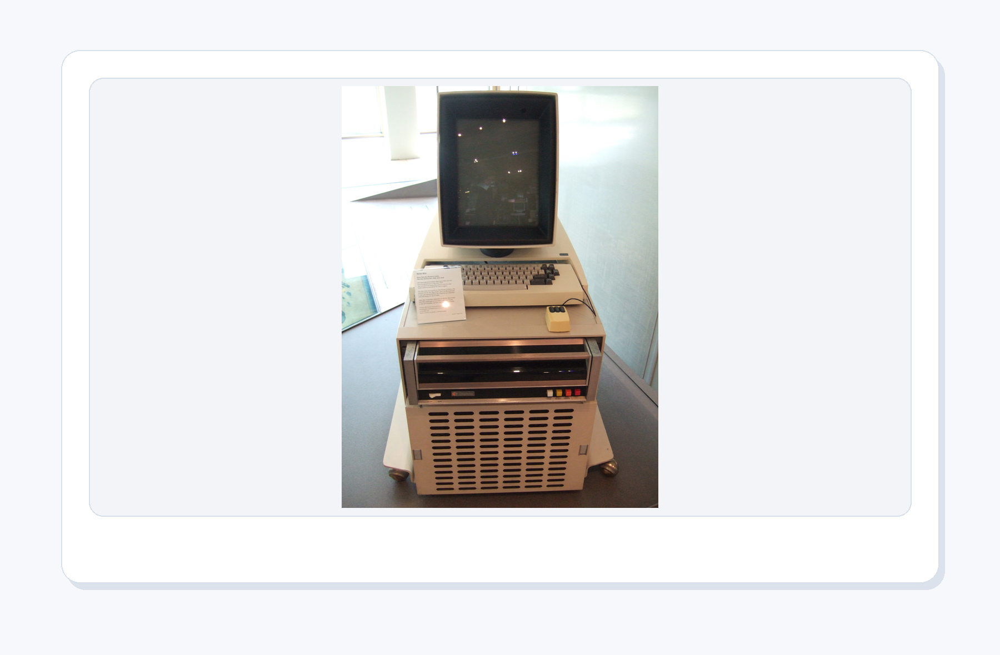
  <figcaption><strong>图10-6 Xerox Alto</strong>：图形界面、鼠标和文档工作台的想象，改变了人们处理文字、表格和演示材料的方式。</figcaption>
</figure>

Xerox Alto 经常被放进个人计算机和图形界面历史里讨论。它让我们看到，办公自动化不只是“命令行批处理”，也包括更友好的交互界面：窗口、鼠标、文档、排版、预览。今天我们用 Word、Excel、PPT 处理材料，其实站在很长的办公计算历史上。

Python 在这里扮演的角色不是替代所有办公软件，而是把它们串起来。你仍然可以用 Word 做最后润色，用 Excel 检查表格，用 PPT 做展示；Python 负责把重复的初稿、表格和结构先搭好。这样人负责判断和表达，程序负责搬运和排版，分工就舒服多了。

---

#### 一个小插曲：电子表格为什么厉害

<figure align="center">
  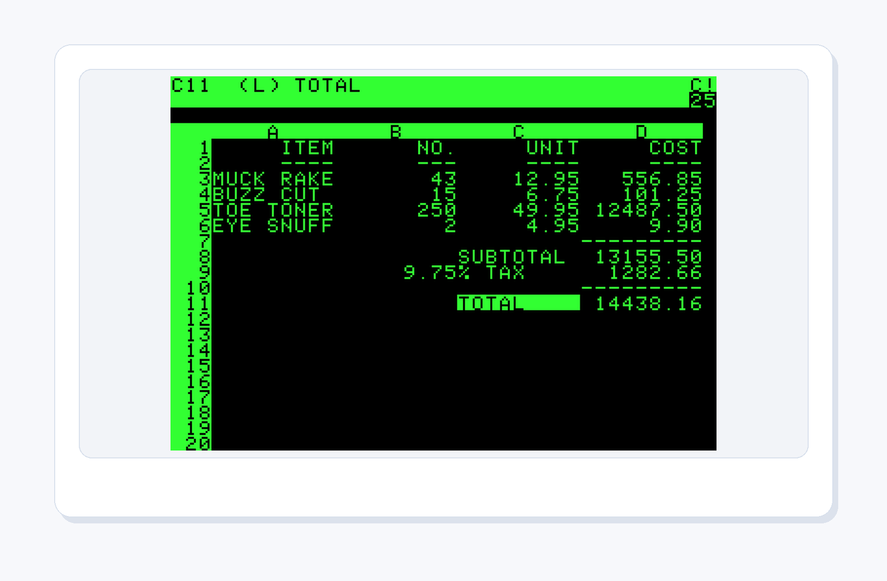
  <figcaption><strong>图10-7 VisiCalc 电子表格截图</strong>：电子表格把纸面表格变成了“可重算的模型”，这也是今天 Python 自动生成 Excel 的历史背景。</figcaption>
</figure>

VisiCalc 常被称作个人计算机早期的“杀手级应用”。它厉害的地方不只是把格子搬到屏幕上，而是让格子之间有了关系：改一个数字，相关结果可以重新计算。纸面表格像照片，电子表格像活的仪表盘。

本章用 Python 生成 Excel，延续的就是这个思路：不要只把数据“摆好看”，还要让数据能被筛选、排序、继续统计。Excel 文件不是终点，而是把结果交给下一个分析动作的桥。

---

### 10.6 心理学提醒：记忆会掉线，记录要上线

<figure align="center">
  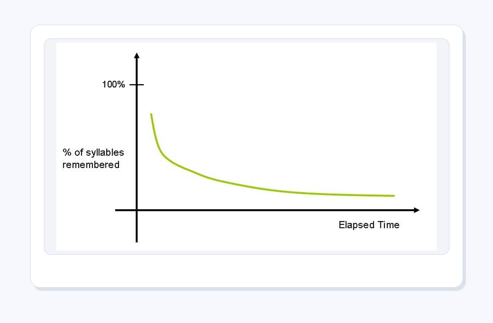
  <figcaption><strong>图10-8 Ebbinghaus 遗忘曲线</strong>：人脑不是可靠硬盘，越是重复交付的任务，越应该交给清单、日志和自动化脚本。</figcaption>
</figure>

Ebbinghaus 的遗忘曲线告诉我们一个略扎心的事实：人的记忆会快速衰减。今天你很确定“我刚才已经生成了最终版”，明天你可能就开始怀疑：到底是 `final_report.docx`，还是 `final_report_新版_真的最终.docx`？

办公自动化的心理学价值就在这里：它把一部分工作记忆负担外包给文件结构、命名规则、日志和交付索引。你不用把所有细节塞在脑子里，只要让脚本每次按同样规则执行，再让索引告诉你“成品齐不齐”。这不是偷懒，这是尊重人脑的带宽。

<figure align="center">
  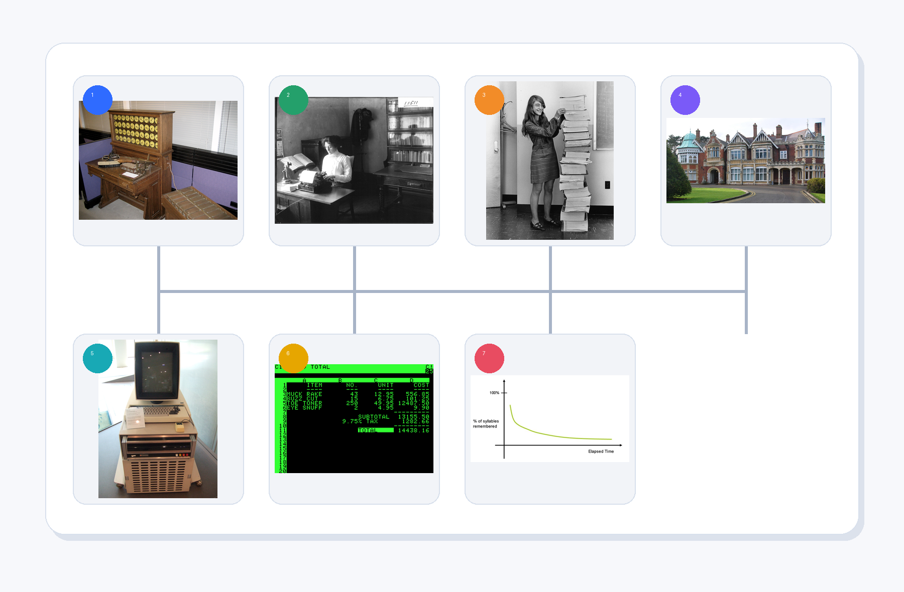
  <figcaption><strong>图10-9 办公自动化的人文脉络</strong>：从制表机、打字机、软件工程、协作现场、图形界面、电子表格到记忆曲线，办公自动化一直在解决“人会累、会忘、会抄错，流程需要可复查”的问题。</figcaption>
</figure>

把这些画面连起来看，办公自动化就不再只是“写几个脚本生成文件”。Hollerith 的制表机面对的是海量统计，打字机办公室面对的是重复格式，Hamilton 的代码清单面对的是可靠性，Bletchley Park 面对的是多人协作，Xerox Alto 和 VisiCalc 面对的是更自然的文档与表格界面，Ebbinghaus 则从心理学角度提醒我们：人的记忆不适合长期承担大量细节。

所以本章要训练的不是“让电脑替我随便点几下”，而是把一件重复任务拆成稳定流程：输入要清楚，模板要固定，输出要分场景，检查要能复跑，交付要能追踪。这个背景线越清楚，后面的 Word、Excel、PPT 自动生成就越不像炫技，越像一个真正可靠的工作系统。

---

### 10.7 知识路线

<figure align="center">
  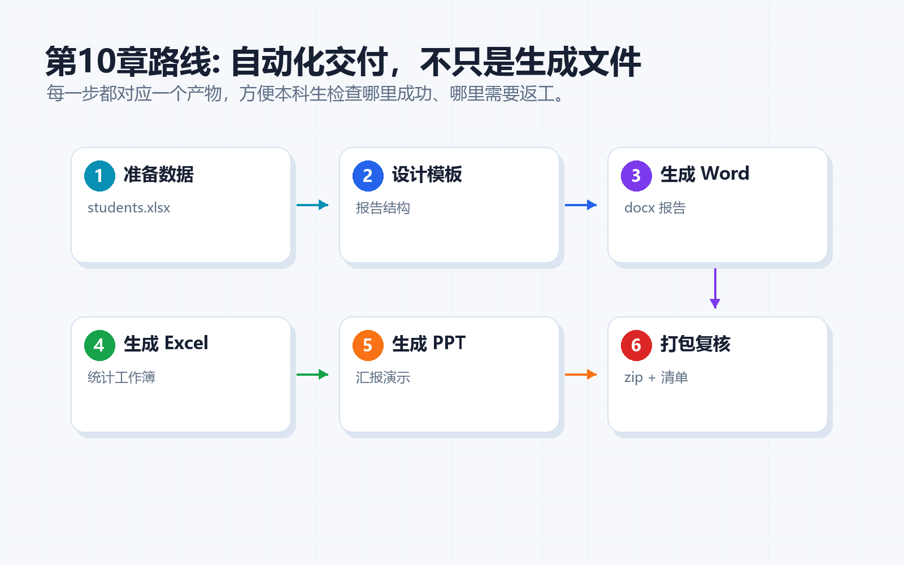
  <figcaption><strong>图10-10 知识路线</strong>：本章只保留一张路线图，帮助你把“数据、模板、成品、检查”连成闭环。</figcaption>
</figure>

本章路线很短，但每一步都要落地：

| 顺序 | 主题 | 本章落点 |
| --- | --- | --- |
| 1 | CSV 数据 | `input/report_data.csv` 保存章节、作品和完成分 |
| 2 | Markdown 报告 | `reports/final_report.md` 作为轻量可读报告 |
| 3 | Word 文档 | `reports/final_report.docx` 作为正式文字报告 |
| 4 | Excel 表格 | `reports/final_report.xlsx` 作为可继续统计的表格 |
| 5 | PPT 文件 | `reports/final_slides.pptx` 作为展示材料 |

不要把这些输出看成“文件名清单”。它们对应不同使用场景：自己快速复盘看 Markdown，正式提交看 Word，继续处理看 Excel，展示分享看 PPT。

---

## 第二部分：真实环境和核心概念

### 10.8 真实运行环境：PyCharm 先认准解释器

<figure align="center">
  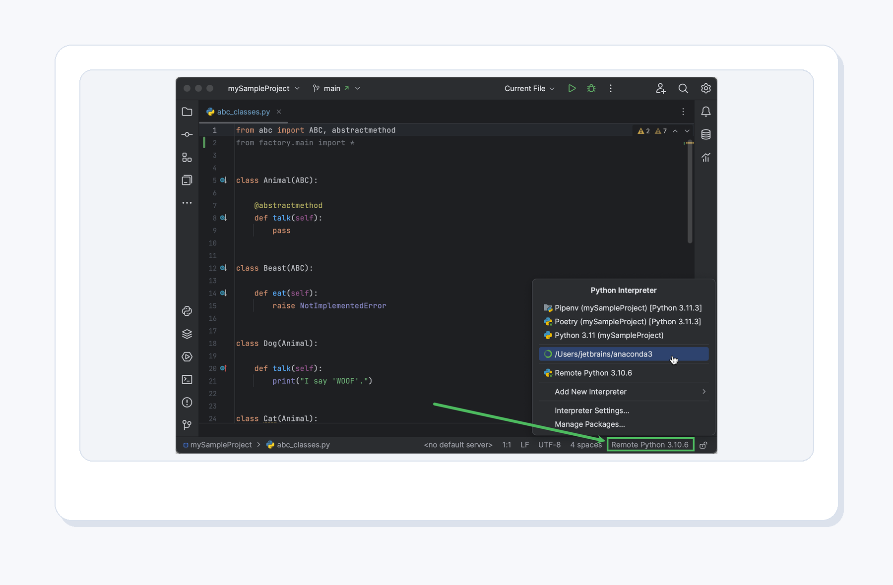
  <figcaption><strong>图10-11 PyCharm 解释器配置</strong>：运行办公自动化脚本前，先确认项目使用的是正确 Python 解释器，依赖库也安装在同一个环境里。</figcaption>
</figure>

在 PyCharm 里跑本章代码前，先别急着点运行。第一步是确认解释器——很多"明明安装了库却提示找不到"的问题，都来自解释器没选对。

可以按这个顺序检查：

1. 打开项目目录 `python_tutorial_ch10`。
2. 进入解释器设置，选择你正在使用的 Python，例如 Python 3.11。
3. 在同一个解释器环境里安装依赖：

```bash
python -m pip install -r code/ch10/requirements.txt
```

4. 先运行 `01_make_report_data.py`，确认 `input/report_data.csv` 出现。
5. 再运行后面的报告生成脚本。

PyCharm 的好处是适合读代码、改代码、调试代码；PowerShell 的好处是适合连续执行命令和检查文件。新手不必在两者之间选边站，它们就像厨房里的案板和灶台，各有用处。

---

### 10.9 核心概念：数据、模板、出口

<figure align="center">
  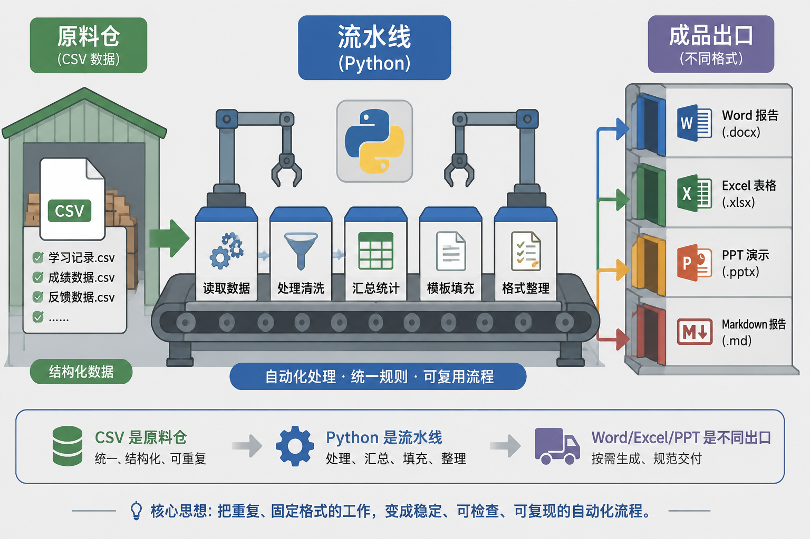
  <figcaption><strong>图10-12 核心比喻</strong>：CSV 是原料仓，Python 是流水线，Word/Excel/PPT 是不同出口。</figcaption>
</figure>

本章可以用一句人话理解：把“会变的内容”放进数据，把“不怎么变的结构”放进程序或模板，然后让 Python 批量生成成品。

几个关键概念：

| 概念 | 人话理解 | 本章脚本 |
| --- | --- | --- |
| CSV | 最朴素的表格原料，适合让程序稳定读取 | `01_make_report_data.py` |
| Markdown | 轻量报告，适合快速检查内容和结构 | `02_generate_markdown_report.py` |
| Word | 正式文档，适合提交、归档和分享 | `03_optional_docx_hint.py`、`04_generate_office_pack.py` |
| Excel | 表格成品，适合继续排序、筛选和统计 | `04_generate_office_pack.py` |
| PPT | 展示出口，适合把结果讲给别人听 | `04_generate_office_pack.py` |
| 预览图 | 让报告结果能直接放进教程或复盘 | `04_generate_office_pack.py` |

办公自动化的心理学价值也很实际：它降低了工作记忆负担。你不再把“第几行要复制到哪里、标题有没有改、表格有没有漏”全塞进脑子，而是让程序按固定顺序执行。脑子空出来，才能更认真地看内容本身。

---

## 第三部分：成品预览与脚本导览

### 10.10 看得见的成品

`04_generate_office_pack.py` 会读取 `input/report_data.csv`，一次生成四类成品：

```text
reports/
├── final_report.docx
├── final_report.md
├── final_report.xlsx
├── final_report_preview.png
└── final_slides.pptx
```

请注意 `final_report_preview.png`：它不是为了替代 Word 或 Excel，而是为了让你一眼确认报告长什么样。很多自动化脚本最怕“默默生成了一个错误文件”，所以预览图能提供很直接的反馈。

---

<figure align="center">
  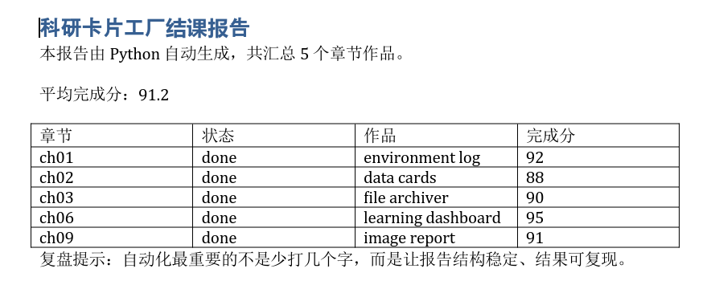
  <figcaption><strong>图10-13 Word 图</strong>：真实生成的 `final_report.docx`。</figcaption>
</figure>

<figure align="center">
  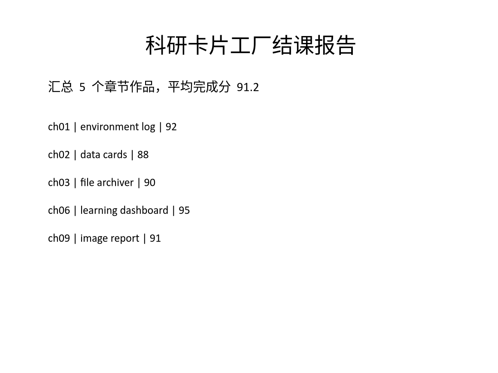
  <figcaption><strong>图10-14 PPT 图截图</strong>：真实生成的 `final_slides.pptx`。</figcaption>
</figure>

<figure align="center">
  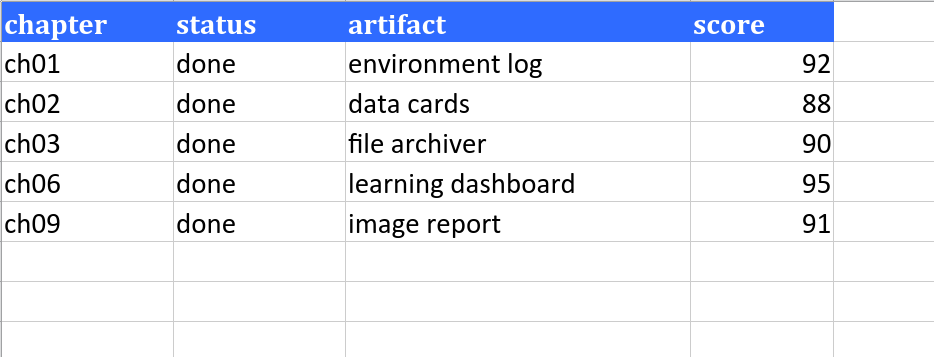
  <figcaption><strong>图10-15 Excel 工作簿截图</strong>：真实生成的 `final_report.xlsx`。</figcaption>
</figure>

Excel 文件很适合继续处理，但它也有一个小问题：如果只看文件名，你不知道里面是不是写对了。`05_make_excel_preview.py` 做的事情很简单：打开刚生成的工作簿，读取前几行，再画成一张预览图。

<figure align="center">
  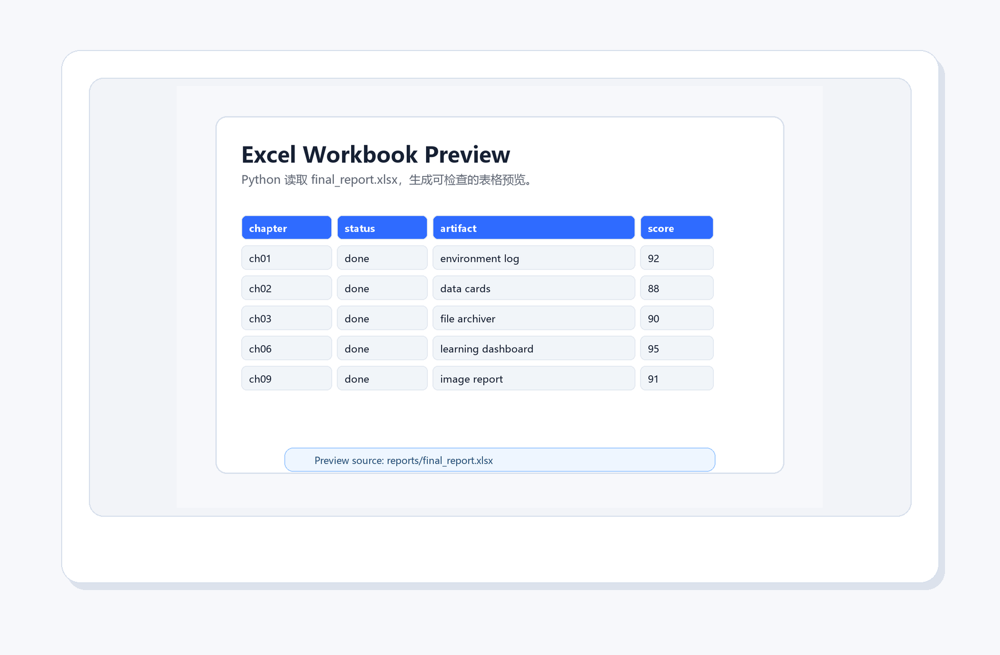
  <figcaption><strong>图10-16 Excel 工作簿预览</strong>：脚本读取真实生成的 `final_report.xlsx`，再把前几行画成预览图，方便快速检查表头和数据。</figcaption>
</figure>

这一步像给报告拍一张“开箱照”。文件仍然是 Excel，但你可以在 Markdown 教程、项目复盘或交付说明里直接看到它的样子。自动化最怕黑盒，预览图就是把盒子打开一点点。

---

### 10.11 配套代码逐个导览

#### 脚本 1：`01_make_report_data.py`

它负责生成原料表：

```bash
python code/ch10/01_make_report_data.py
```

运行后会得到：

```text
input/report_data.csv
```

**代码讲解**：

```python
"""Create small report data for the office automation chapter."""
import csv
from pathlib import Path

Path("input").mkdir(exist_ok=True)
rows = [
    {"chapter": "ch01", "status": "done", "artifact": "environment log", "score": "92"},
    {"chapter": "ch02", "status": "done", "artifact": "data cards", "score": "88"},
    {"chapter": "ch03", "status": "done", "artifact": "file archiver", "score": "90"},
    {"chapter": "ch06", "status": "done", "artifact": "learning dashboard", "score": "95"},
    {"chapter": "ch09", "status": "done", "artifact": "image report", "score": "91"},
]
with open("input/report_data.csv", "w", newline="", encoding="utf-8") as f:
    writer = csv.DictWriter(f, fieldnames=rows[0].keys())
    writer.writeheader()
    writer.writerows(rows)
print("已生成 input/report_data.csv")
```

逐段说明：

- `Path("input").mkdir(exist_ok=True)` — 使用 `pathlib.Path` 创建 `input/` 目录。`exist_ok=True` 表示目录已存在时不会报错，这是一种安全的目录创建写法。
- `rows = [...]` — 定义一组字典（dict），每个字典对应一条数据记录，包含四个字段：`chapter`（章节）、`status`（状态）、`artifact`（作品）、`score`（完成分）。数据采用硬编码方式，因为它的定位是示例原料表。
- `csv.DictWriter(f, fieldnames=rows[0].keys())` — 创建 DictWriter 写入器，字段名取自第一条记录的键。`newline=""` 是 Python 官方推荐的 CSV 写入写法，可避免空行问题。
- `writer.writeheader()` — 写入 CSV 表头行（chapter, status, artifact, score）。
- `writer.writerows(rows)` — 一次性写入所有数据行。

这份 CSV 记录章节、状态、作品和完成分。接下来你可以把它改成实验编号、被试人数、反应时均值、材料文件名，办公自动化就自然转成科研报告自动化。

#### 脚本 2：`02_generate_markdown_report.py`

它负责把 CSV 变成 Markdown：

```bash
python code/ch10/02_generate_markdown_report.py
```

**代码讲解**：

```python
"""Generate a Markdown report from CSV."""
import csv
from pathlib import Path

Path("reports").mkdir(exist_ok=True)
with open("input/report_data.csv", encoding="utf-8") as f:
    rows = list(csv.DictReader(f))

average_score = sum(int(row["score"]) for row in rows) / len(rows)

lines = [
    "# 科研卡片工厂结课报告",
    "",
    f"- 章节数量：{len(rows)}",
    f"- 平均完成分：{average_score:.1f}",
    "",
    "| 章节 | 状态 | 作品 | 完成分 |",
    "| --- | --- | --- | --- |",
]
for row in rows:
    lines.append(f"| {row['chapter']} | {row['status']} | {row['artifact']} | {row['score']} |")
Path("reports/final_report.md").write_text("\n".join(lines), encoding="utf-8")
print("已生成 reports/final_report.md")
```

逐段说明：

- `Path("reports").mkdir(exist_ok=True)` — 确保 `reports/` 输出目录存在。与脚本1一样采用安全创建方式。
- `csv.DictReader(f)` — 以字典模式读取 CSV，每行数据自动以字段名作为键。用 `list()` 一次性把 reader 对象转为列表，方便后续多次使用。
- `average_score = sum(int(row["score"]) ... )` — 用生成器表达式提取所有 score 字段，转整数后求和，再除以行数计算平均分。`:.1f` 保留一位小数。
- `lines = [...]` — 用列表逐行构建 Markdown 内容。前 6 行是标题、空行、统计信息和表头，接着是分隔行。Markdown 表格的 `---` 是必需的分隔符。
- `for row in rows: lines.append(...)` — 遍历每行数据，用 f-string 组装成 Markdown 表格行。
- `Path("reports/final_report.md").write_text(...)` — 将 lines 列表用换行符连接后写入文件。`write_text` 是 pathlib 提供的便捷方法，免去了手动 `open()`/`close()`。

Markdown 的好处是轻、快、可读。很多自动化项目都可以先从 Markdown 开始，因为它最容易检查，也最不容易被复杂格式拖住。

#### 脚本 3：`03_optional_docx_hint.py`

它演示 Word 文档生成：

```bash
python code/ch10/03_optional_docx_hint.py
```

**代码讲解**：

```python
"""Optional direction for Word automation."""
from pathlib import Path

Path("reports").mkdir(exist_ok=True)

try:
    import docx  # type: ignore
except ImportError:
    print("如需生成 Word，可安装：python -m pip install python-docx")
else:
    doc = docx.Document()
    doc.add_heading("科研卡片工厂结课报告", level=1)
    doc.add_paragraph("这是由 Python 自动生成的 Word 文档。")
    doc.save("reports/final_report.docx")
    print("已生成 reports/final_report.docx")
```

逐段说明：

- `try: import docx` — 尝试导入 python-docx 库。如果未安装，`ImportError` 会被捕获，打印提示信息引导用户安装。这是处理可选依赖的经典模式。
- `except ImportError:` — 依赖缺失时的降级处理：只给提示不崩溃。优点是新手看到提示后知道该做什么，不会误以为程序坏了。
- `else:` — try 块成功执行后才进入 else 分支。注意这里不是 `finally`，区别在于 else 只在无异常时运行。
- `docx.Document()` — 创建一个空白 Word 文档对象。
- `doc.add_heading(..., level=1)` — 添加一级标题。python-docx 自动处理 Word 样式，不需要手动设置字体大小。
- `doc.add_paragraph(...)` — 添加正文段落。
- `doc.save(...)` — 保存为 `.docx` 文件。python-docx 内部处理了 XML 打包工作。

这一点很适合新手练习“依赖缺失时先读提示，不要立刻重装整个 Python”。

#### 脚本 4：`04_generate_office_pack.py`

它是本章的成品脚本：

```bash
python code/ch10/04_generate_office_pack.py
```

**代码讲解**（关键函数逐一说明）：

```python
def read_rows():
    with INPUT.open(encoding="utf-8") as f:
        return list(csv.DictReader(f))
```

`read_rows()` — 打开 `input/report_data.csv`，使用 `csv.DictReader` 读取为字典列表。`INPUT.open()` 是 `Path` 对象提供的便捷文件打开方法，等价于 `open(INPUT, ...)`。

```python
def make_excel(rows):
    wb = Workbook()
    ws = wb.active
    ws.title = "card_factory"
    headers = ["chapter", "status", "artifact", "score"]
    ws.append(headers)
    for row in rows:
        ws.append([row["chapter"], row["status"], row["artifact"], int(row["score"])])

    for cell in ws[1]:
        cell.font = Font(bold=True, color="FFFFFF")
        cell.fill = PatternFill("solid", fgColor="2F6BFF")
    ws.column_dimensions["A"].width = 12
    ...
    wb.save("reports/final_report.xlsx")
```

`make_excel(rows)` 的要点：
  - `Workbook()` 创建一个新工作簿，`ws.active` 获取默认工作表，重命名为 `card_factory`。
  - `ws.append(headers)` 写入表头行。openpyxl 的 append 方法会自动定位到下一空行。
  - 遍历数据行，将 score 转为 int 后依次追加到工作表。
  - `ws[1]` 获取第一行（表头）所有单元格，分别设置加粗字体、白色字色和蓝色背景填充。
  - `column_dimensions["A"].width` 设置列宽，让表格不至于挤在一起。

```python
def make_word(rows):
    scores = [int(row["score"]) for row in rows]
    doc = Document()
    doc.add_heading("科研卡片工厂结课报告", level=1)
    doc.add_paragraph(f"共汇总 {len(rows)} 个章节作品。")
    doc.add_paragraph(f"平均完成分：{sum(scores) / len(scores):.1f}")

    table = doc.add_table(rows=1, cols=4)
    table.style = "Table Grid"
    for i, header in enumerate(["章节", "状态", "作品", "完成分"]):
        table.rows[0].cells[i].text = header
    for row in rows:
        cells = table.add_row().cells
        cells[0].text = row["chapter"]
        ...
    doc.save("reports/final_report.docx")
```

`make_word(rows)` 的要点：
  - `Document()` 创建新文档。先添加标题和统计段落。
  - `doc.add_table(rows=1, cols=4)` 创建表格，初始为 1 行（表头）。`table.style = "Table Grid"` 应用带边框的表格样式。
  - `table.rows[0].cells[i].text = header` 逐列设置表头文字。
  - 遍历数据行，`table.add_row()` 追加新行，通过 `cells` 索引依次填入各字段。

```python
def make_ppt(rows):
    prs = Presentation()
    slide = prs.slides.add_slide(prs.slide_layouts[5])
    title = slide.shapes.title
    title.text = "科研卡片工厂结课报告"
    title.text_frame.paragraphs[0].font.size = Pt(30)
    ...
    for i, row in enumerate(rows[:5]):
        item = slide.shapes.add_textbox(left, Inches(2.35 + i * 0.55), width, height)
        item.text = f"{row['chapter']} | {row['artifact']} | {row['score']}"
    prs.save("reports/final_slides.pptx")
```

`make_ppt(rows)` 的要点：
  - `Presentation()` 创建空演示文稿。`slide_layouts[5]` 选择空白版式（编号 5 通常是空白布局）。
  - `slide.shapes.title` 获取幻灯片标题框，设置标题文字和字号。
  - `slide.shapes.add_textbox(left, top, width, height)` 在指定位置添加文本框。位置参数使用 `Inches()` 单位转换。
  - 遍历前 5 条数据，每一条生成一行文本，模拟 PPT 内容页。

```python
def make_preview(rows):
    im = Image.new("RGB", (1500, 950), "#F7F8FB")
    d = ImageDraw.Draw(im)
    d.rounded_rectangle((90, 70, 1410, 880), radius=26, ...)
    d.text((150, 125), "科研卡片工厂结课报告", ...)
    ...
    for r, row in enumerate(rows):
        d.rounded_rectangle((x, y, x + width, y + 54), ...)
        d.text((x + 20, y + 12), str(value), ...)
    im.save("reports/final_report_preview.png")
```

`make_preview(rows)` 的要点：
  - `Image.new("RGB", (1500, 950), "#F7F8FB")` 创建一张浅灰背景的图片。
  - `ImageDraw.Draw(im)` 获取绘图上下文，支持画矩形、椭圆、文字等操作。
  - 先画一个圆角白底卡片 `rounded_rectangle`，然后写标题和副标题文字。
  - 遍历数据，为每行数据绘制一个圆角单元格，填入章节、状态、作品和完成分。这种“把表格画成图片”的思路在自动化报告中非常实用——图片可以嵌入网页、PPT 或邮件，不需要收件人安装 Excel。

```python
def main():
    REPORTS.mkdir(exist_ok=True)
    rows = read_rows()
    generated = [
        make_excel(rows),
        make_word(rows),
        make_ppt(rows),
        make_preview(rows),
    ]
    print("已生成办公自动化成果包：")
    for path in generated:
        print(f"- {path}")
```

`main()` 是脚本入口：
  - 确保输出目录存在。
  - 调用 `read_rows()` 读取 CSV 数据。
  - 依次调用四个生成函数，分别产出 `.xlsx`、`.docx`、`.pptx` 和 `.png`。
  - 每个函数返回文件路径，最后统一打印。

阅读这个脚本时，抓住三条主线：`read_rows()` 读取数据，`make_excel()`、`make_word()`、`make_ppt()` 负责不同出口，`make_preview()` 把结果画成可检查图片。

#### 脚本 5：`05_make_excel_preview.py`

它负责把真实 Excel 工作簿变成可快速查看的图片：

```bash
python code/ch10/05_make_excel_preview.py
```

运行后会得到：

```text
reports/excel_workbook_preview.png
```

**代码讲解**：

```python
def read_cells():
    if not WORKBOOK.exists():
        raise FileNotFoundError("Run 04_generate_office_pack.py first.")
    wb = load_workbook(WORKBOOK, data_only=True)
    ws = wb.active
    rows = []
    for row in ws.iter_rows(min_row=1, max_row=6, max_col=4, values_only=True):
        rows.append(["" if value is None else str(value) for value in row])
    return rows
```

`read_cells()` 的要点：
  - 先检查 `final_report.xlsx` 是否存在，若不存在则抛出 `FileNotFoundError`，提示用户先运行脚本 4。这是一种前置条件检查。
  - `load_workbook(WORKBOOK, data_only=True)` 以只读数据模式加载现有工作簿。`data_only=True` 表示读取公式的计算结果而非公式本身。
  - `ws.iter_rows(min_row=1, max_row=6, max_col=4, values_only=True)` 迭代第 1~6 行、第 1~4 列的单元格，`values_only=True` 直接获取单元格的值而非 Cell 对象。
  - 将每个值转为字符串（None 转空字符串），方便后续绘图。

```python
def write_preview(rows):
    image = Image.new("RGB", (1500, 980), "#F7F8FB")
    draw = ImageDraw.Draw(image)
    draw.rounded_rectangle((90, 70, 1410, 900), radius=26, fill="#FFFFFF", ...)
    draw.text((150, 125), "Excel Workbook Preview", ...)
    ...
    for r, row in enumerate(rows):
        x = x0
        for c, value in enumerate(row):
            fill = "#2F6BFF" if r == 0 else "#F1F5F9"
            text_fill = "#FFFFFF" if r == 0 else "#162033"
            draw.rounded_rectangle((x, y0 + r * row_h, x + widths[c], y0 + r * row_h + 56), ...)
            draw.text((x + 18, y0 + r * row_h + 14), value, ...)
            x += widths[c] + 12
    image.save(PREVIEW, ...)
```

`write_preview()` 的要点：
  - 创建一个浅灰背景的画布，画一个白色圆角卡片作为画板。
  - 遍历 `read_cells()` 返回的二维列表，第一行（表头）用蓝底白字渲染，数据行用浅灰底深色字渲染。
  - 每列的宽度由 `widths` 列表控制，列之间留 12 像素间距。
  - 最后在底部画一个提示框，标注预览图的来源文件路径。

这是一种检查手段。你不必打开 Excel，就能先确认表头、章节、作品和完成分有没有明显错位。

---

## 第四部分：排错

### 10.12 常见坑

<figure align="center">
  
  <figcaption><strong>图10-17 常见坑地图</strong>：办公自动化的错误通常不是玄学，优先检查路径、依赖、文件占用和输入数据。</figcaption>
</figure>

本章常见坑：

- **当前目录错了**：在别的目录运行脚本，程序找不到 `input/` 或 `reports/`。
- **依赖装错环境**：PowerShell 里装了库，PyCharm 却用了另一个解释器。
- **文件被占用**：Word 或 Excel 正打开着目标文件，脚本保存失败。
- **先后顺序错了**：没有先生成 CSV，就直接生成报告。
- **只生成不检查**：文件有了，但内容是否正确完全没看。

遇到错误时，先读报错的第一行和最后一行。很多时候 Python 已经把问题说出来了，只是它的表达方式比较直接，不会先安抚你。

---

## 第五部分：练习、复盘与总结

### 10.13 练习任务

1. 把 `report_data.csv` 中的章节换成自己的学习记录，再重新生成整套报告文件。
2. 给 CSV 增加一列 `note`，记录每章最难的地方，并把它写进 Markdown 报告和 Word 文档。
3. 修改 `04_generate_office_pack.py`，让 Word 报告多一段"下一步计划"的总结段落。
4. 故意打开 `reports/final_report.xlsx` 不关闭，再运行脚本 4，观察文件占用错误并尝试解决。
5. 修改 `05_make_excel_preview.py`，给低于 90 分的行添加浅红色背景，让低分项更醒目。
6. 把报告主题换成心理学实验材料整理：章节列改成实验条件，完成分改成平均反应时。
7. 给 `04_generate_office_pack.py` 增加一个 `make_csv_summary` 函数，生成一份只含高分（>=90）章节的摘要 CSV。
8. 修改 `02_generate_markdown_report.py`，在报告末尾添加一段"最高分章节"和"最低分章节"的总结。
9. 在 `01_make_report_data.py` 中增加更多数据行（如 ch04、ch05、ch07、ch08），测试脚本是否能正确处理更多数据。
10. 修改 `04_generate_office_pack.py` 中的 `make_preview` 函数，把图片背景色改成深色模式，体验不同视觉风格。
---

### 10.14 学习复盘模板

可以在 `reports/ch10_review.md` 中写下：

```markdown
# 第10章复盘

## 我新增的能力
- 我可以从 CSV 自动生成报告文件。

## 我跑通的脚本
- 

## 我完成的交付包
- 

## 我生成的文件
- 

## 我遇到的报错
- 报错信息：
- 原因：
- 修复方式：

## 我能迁移到哪里
- 心理学实验报告：
- 学习材料汇总：
- 科研资料整理：
```

---

### 10.15 本章总结

办公自动化的关键不是背 API，而是识别哪些任务值得自动化：重复、固定、容易错、需要交付文件。第 10 章已经把"科研卡片工厂"推进到一个很实用的位置：从 CSV 原料到 Markdown、Word、Excel、PPT 四种出口，加上预览图辅助检查，形成了一条完整的自动化流水线。

下一次复习时，不妨只问四个问题：

- 我的输入数据在哪里？
- 我的脚本做了哪些处理？
- 我的输出文件在哪里？
- 这个流程能不能换一批数据再跑一次？

如果答案都清楚，这一章就不是看过了，而是真的变成了你的办公生产线。
