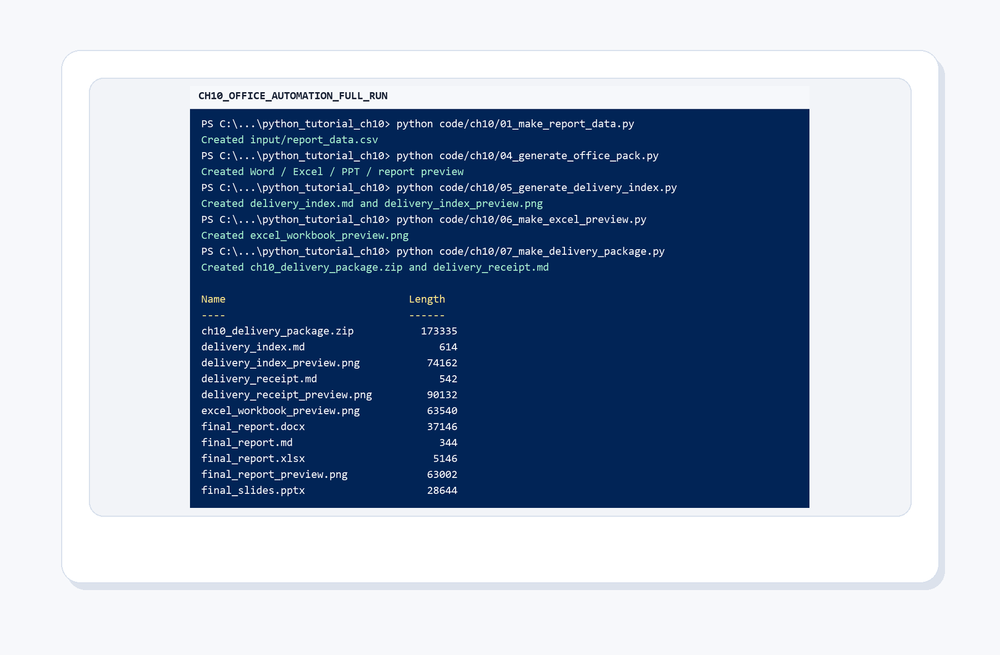
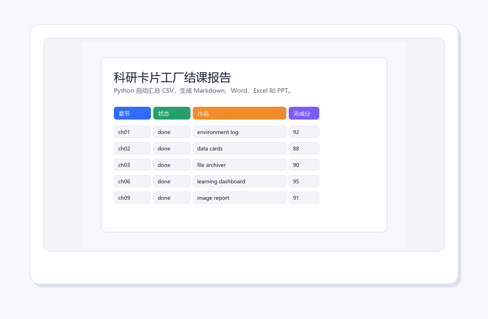
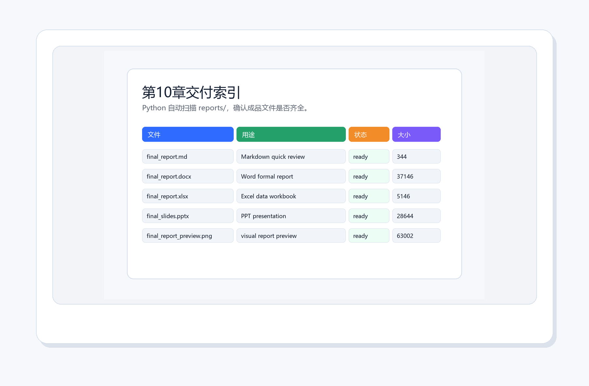
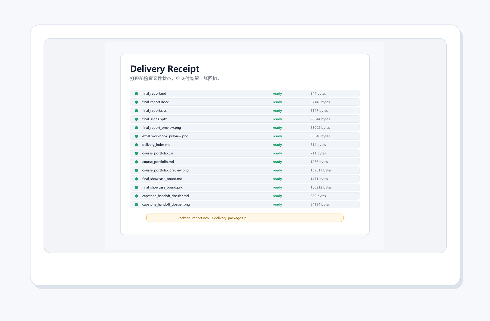
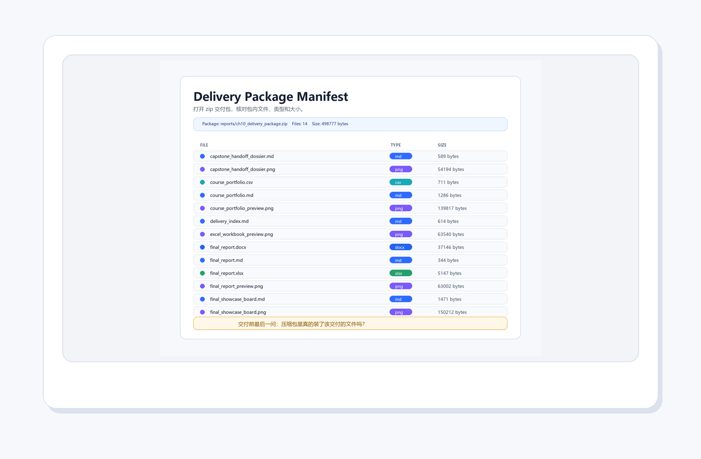
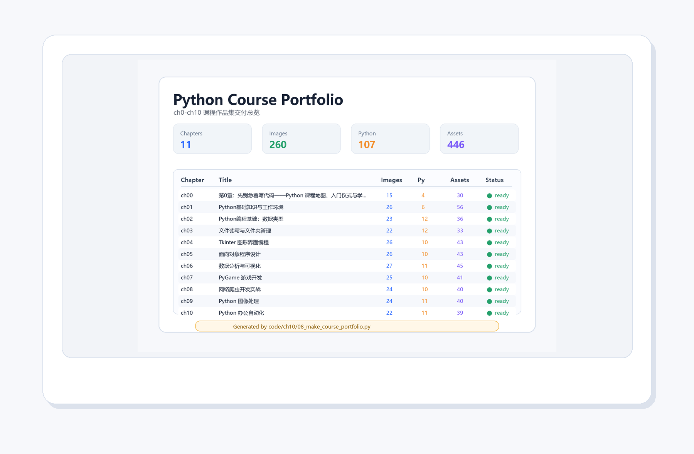
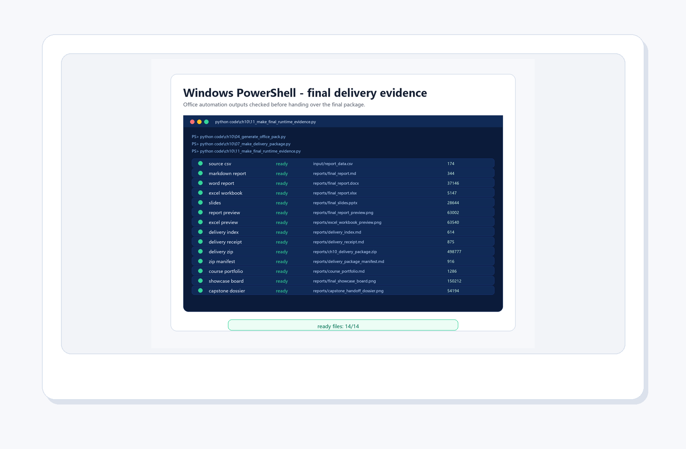

# 第 10 章：Python 办公自动化

<style>
figure {
  margin: 1.2em auto 1.8em;
  text-align: center;
}
figure img {
  max-width: 100%;
  display: block;
  margin: 0 auto;
}
figcaption {
  margin-top: 0.45em;
  color: #5f6673;
  font-size: 0.92em;
  line-height: 1.55;
}
figcaption strong {
  color: #2d3748;
}
</style>

<figure align="center">
  
  <figcaption><strong>图10-1 本章封面</strong>：办公自动化不是让电脑替你思考，而是把重复、容易出错、需要固定格式交付的工作交给程序。</figcaption>
</figure>

> 本章一句话：CSV 是原料，Python 是流水线，Word/Excel/PPT/Markdown 是成品出口。

前面章节已经让“科研卡片工厂”能跑代码、管文件、做图表、处理图片。第 10 章不再重复 ch0 的启动包，而是进入一个更具体的交付场景：把一批学习记录自动汇总成报告。最后你会得到一组真正的文件：`final_report.md`、`final_report.docx`、`final_report.xlsx`、`final_slides.pptx` 和一张报告预览图。

这就是办公自动化最迷人的地方：它不炫技，但很省命。少复制一次表格，少手动改一次标题，少在凌晨两点对着 Word 目录发呆，都是人类文明的小胜利。

---

## 10.0 本章真实任务

本章任务是：用 Python 生成一份“科研卡片工厂结课报告”。

你要完成的不是一个孤零零的 `print()`，而是一条完整链路：

1. 生成一份 CSV 数据。
2. 读取 CSV，生成 Markdown 报告。
3. 用 Python 自动生成 Word、Excel 和 PPT 文件。
4. 生成 Excel 预览图，确认表格成品不是黑盒。
5. 在 `reports/` 中检查成品。
6. 生成交付索引和交付回执。
7. 把最终文件打包成一个 zip。
8. 打开 zip 交付包，生成包内文件目录清单。

完成以后，你会更清楚地理解：办公自动化的核心不是“会不会某个库”，而是能不能把固定格式、固定来源、固定输出的工作变成稳定流程。

---

## 10.1 历史故事：表格自动化的老祖宗

<figure align="center">
  
  <figcaption><strong>图10-2 Hollerith 制表机</strong>：早期办公自动化从“少算错、快汇总”开始，和今天用 Python 处理表格的动机并不遥远。</figcaption>
</figure>

19 世纪末，美国人口普查的数据量越来越大，人工统计慢到让人怀疑人生。Herman Hollerith 用打孔卡和制表机加速统计工作，后来这条技术线也和 IBM 的历史联系在一起。

这个故事放在办公自动化开头非常合适：自动化从来不是为了让人显得神秘，而是为了解决一个朴素问题：数据太多、格式太固定、人工太容易错。今天我们用 Python 读 CSV、写 Excel、生成报告，本质上仍然是在做同一件事，只是打孔卡换成了文件，制表机换成了脚本。

---

## 10.2 另一个画面：打字员与模板

<figure align="center">
  
  <figcaption><strong>图10-3 打字机时代的办公室</strong>：模板的价值很早就存在，固定格式越多，自动化越值得上场。</figcaption>
</figure>

想象一间旧办公室：报告标题、日期、姓名、表格、结论，每天都要重复敲。真正折磨人的不是“打字”本身，而是差一点点就错的固定格式：今天漏了日期，明天把姓名贴错，后天表格复制少一行。

Python 的模板思维就是从这里长出来的：把变化的内容放进数据表，把不变的结构放进模板，再让程序把两者合成文档。心理学实验报告、学习反馈、科研资料汇总、课程结课材料，都很适合这种思路。

---

## 10.3 可靠交付：一摞代码也是一摞文档

<figure align="center">
  
  <figcaption><strong>图10-4 Margaret Hamilton 与阿波罗代码清单</strong>：真正重要的自动化不只会“生成”，还要能追踪、检查和复现。</figcaption>
</figure>

Margaret Hamilton 站在阿波罗导航软件代码清单旁边的照片，很适合放在办公自动化这一章。因为它提醒我们：文档不是“写完代码以后顺手补一下”的装饰，而是可靠系统的一部分。任务越重要，越不能只靠“我记得我做过”。

第10章虽然没有把火箭送上月球，但原则是相通的：脚本生成了 Word、Excel、PPT 以后，还要知道输入是什么、输出在哪里、哪个文件是最终版、能不能换一批数据再跑一次。办公自动化的成熟度，不在于一口气生成多少文件，而在于这些文件是否可检查、可复现、可交付。

---

## 10.4 协作现场：Bletchley Park 的启发

<figure align="center">
  
  <figcaption><strong>图10-5 Bletchley Park</strong>：复杂工作很少靠一个人硬扛，可靠流程、记录和协作界面会把集体智慧组织起来。</figcaption>
</figure>

Bletchley Park 是二战时期英国密码破译工作的著名地点。把这张照片放在这里，不是为了把办公自动化讲成谍战片，而是为了强调一个朴素事实：当信息量变大，靠人脑临时记、手工抄、口头传，很快会变得脆弱。复杂协作需要流程，需要记录，需要把任务分成可以检查的环节。

这和本章的报告工厂很像。CSV 是统一输入，脚本是可重复流程，`reports/` 是交付出口，交付索引是检查清单。一个人学习时这样做，是为了减少混乱；一个小组协作时这样做，是为了让别人也能接手。

---

## 10.5 现代办公界面：从 Alto 到今天的文档工作台

<figure align="center">
  
  <figcaption><strong>图10-6 Xerox Alto</strong>：图形界面、鼠标和文档工作台的想象，改变了人们处理文字、表格和演示材料的方式。</figcaption>
</figure>

Xerox Alto 经常被放进个人计算机和图形界面历史里讨论。它让我们看到，办公自动化不只是“命令行批处理”，也包括更友好的交互界面：窗口、鼠标、文档、排版、预览。今天我们用 Word、Excel、PPT 处理材料，其实站在很长的办公计算历史上。

Python 在这里扮演的角色不是替代所有办公软件，而是把它们串起来。你仍然可以用 Word 做最后润色，用 Excel 检查表格，用 PPT 做展示；Python 负责把重复的初稿、表格和结构先搭好。这样人负责判断和表达，程序负责搬运和排版，分工就舒服多了。

---

### 一个小插曲：电子表格为什么厉害

<figure align="center">
  
  <figcaption><strong>图10-7 VisiCalc 电子表格截图</strong>：电子表格把纸面表格变成了“可重算的模型”，这也是今天 Python 自动生成 Excel 的历史背景。</figcaption>
</figure>

VisiCalc 常被称作个人计算机早期的“杀手级应用”。它厉害的地方不只是把格子搬到屏幕上，而是让格子之间有了关系：改一个数字，相关结果可以重新计算。纸面表格像照片，电子表格像活的仪表盘。

本章用 Python 生成 Excel，延续的就是这个思路：不要只把数据“摆好看”，还要让数据能被筛选、排序、继续统计。Excel 文件不是终点，而是把结果交给下一个分析动作的桥。

---

## 10.6 心理学提醒：记忆会掉线，记录要上线

<figure align="center">
  
  <figcaption><strong>图10-8 Ebbinghaus 遗忘曲线</strong>：人脑不是可靠硬盘，越是重复交付的任务，越应该交给清单、日志和自动化脚本。</figcaption>
</figure>

Ebbinghaus 的遗忘曲线告诉我们一个略扎心的事实：人的记忆会快速衰减。今天你很确定“我刚才已经生成了最终版”，明天你可能就开始怀疑：到底是 `final_report.docx`，还是 `final_report_新版_真的最终.docx`？

办公自动化的心理学价值就在这里：它把一部分工作记忆负担外包给文件结构、命名规则、日志和交付索引。你不用把所有细节塞在脑子里，只要让脚本每次按同样规则执行，再让索引告诉你“成品齐不齐”。这不是偷懒，这是尊重人脑的带宽。

---

## 10.7 知识路线

<figure align="center">
  
  <figcaption><strong>图10-9 知识路线</strong>：本章只保留一张路线图，帮助你把“数据、模板、成品、检查”连成闭环。</figcaption>
</figure>

本章路线很短，但每一步都要落地：

| 顺序 | 主题 | 本章落点 |
| --- | --- | --- |
| 1 | CSV 数据 | `input/report_data.csv` 保存章节、作品和完成分 |
| 2 | Markdown 报告 | `reports/final_report.md` 作为轻量可读报告 |
| 3 | Word 文档 | `reports/final_report.docx` 作为正式文字报告 |
| 4 | Excel 表格 | `reports/final_report.xlsx` 作为可继续统计的表格 |
| 5 | PPT 文件 | `reports/final_slides.pptx` 作为展示材料 |
| 6 | 交付检查 | PowerShell 列出 `reports/` 中的真实文件 |

不要把这些输出看成“文件名清单”。它们对应不同使用场景：自己快速复盘看 Markdown，正式提交看 Word，继续处理看 Excel，展示分享看 PPT。

---

## 10.8 真实运行环境：PyCharm 先认准解释器

<figure align="center">
  
  <figcaption><strong>图10-10 PyCharm 解释器配置</strong>：运行办公自动化脚本前，先确认项目使用的是正确 Python 解释器，依赖库也安装在同一个环境里。</figcaption>
</figure>

在 PyCharm 里跑本章代码时，先别急着点运行。第一步是确认解释器，因为很多“明明安装了库却提示找不到”的问题，都来自解释器没选对。

可以按这个顺序检查：

1. 打开项目目录 `python_tutorial_ch10`。
2. 进入解释器设置，选择你正在使用的 Python，例如 Python 3.11。
3. 在同一个解释器环境里安装依赖：

```bash
python -m pip install -r code/ch10/requirements.txt
```

4. 先运行 `01_make_report_data.py`，确认 `input/report_data.csv` 出现。
5. 再运行后面的报告生成脚本。

PyCharm 的好处是适合读代码、改代码、调试代码；PowerShell 的好处是适合连续执行命令和检查文件。新手不需要在二者之间选边站，它们像厨房里的案板和灶台，各有用处。

---

## 10.9 真实运行环境：PowerShell 跑完整链路

<figure align="center">
  
  <figcaption><strong>图10-11 PowerShell 真实运行结果</strong>：这张运行图来自本机结果，能看到报告文件、预览图、交付回执和 zip 交付包都已经生成。</figcaption>
</figure>

在本章目录下，按顺序运行：

```bash
python code/ch10/01_make_report_data.py
python code/ch10/02_generate_markdown_report.py
python code/ch10/03_optional_docx_hint.py
python code/ch10/04_generate_office_pack.py
python code/ch10/05_generate_delivery_index.py
python code/ch10/06_make_excel_preview.py
python code/ch10/08_make_course_portfolio.py
python code/ch10/09_make_final_showcase_board.py
python code/ch10/07_make_delivery_package.py
python code/ch10/10_make_delivery_package_manifest.py
python code/ch10/11_make_final_runtime_evidence.py
```

然后检查输出：

```bash
Get-ChildItem reports
```

截图里最重要的不是蓝色窗口，而是那几行文件名：`final_report.docx`、`final_report.md`、`final_report.xlsx`、`final_report_preview.png`、`final_slides.pptx`。它们说明脚本不只是“运行了”，而是留下了可检查的成果。新增的 `delivery_index.md`、`excel_workbook_preview.png`、`course_portfolio.md`、`delivery_receipt.md` 和 `ch10_delivery_package.zip` 则负责最后一步：检查、预览、汇总、打包和交付。

如果你在这里遇到报错，先检查三件事：当前目录是不是 ch10，依赖是不是装在同一个 Python 环境里，`01_make_report_data.py` 是否已经先生成了 CSV。

---

## 10.10 核心概念：数据、模板、出口

<figure align="center">
  
  <figcaption><strong>图10-12 核心比喻</strong>：CSV 是原料仓，Python 是流水线，Word/Excel/PPT 是不同出口。</figcaption>
</figure>

本章可以用一句人话理解：把“会变的内容”放进数据，把“不怎么变的结构”放进程序或模板，然后让 Python 批量生成成品。

关键概念如下：

| 概念 | 人话理解 | 本章脚本 |
| --- | --- | --- |
| CSV | 最朴素的表格原料，适合让程序稳定读取 | `01_make_report_data.py` |
| Markdown | 轻量报告，适合快速检查内容和结构 | `02_generate_markdown_report.py` |
| Word | 正式文档，适合提交、归档和分享 | `03_optional_docx_hint.py`、`04_generate_office_pack.py` |
| Excel | 表格成品，适合继续排序、筛选和统计 | `04_generate_office_pack.py` |
| PPT | 展示出口，适合把结果讲给别人听 | `04_generate_office_pack.py` |
| 预览图 | 让报告结果能直接放进教程或复盘 | `04_generate_office_pack.py` |
| 课程作品集 | 把 ch0-ch10 的正文、图片、脚本和素材汇总成结课清单 | `08_make_course_portfolio.py` |
| 结课展示墙 | 把报告、Excel、作品集和交付物摆成一张分享总览 | `09_make_final_showcase_board.py` |
| 交付包 | 把最终文件打包成一个可发送成果 | `07_make_delivery_package.py` |
| 最终运行证据 | 检查 CSV、Word、Excel、PPT、zip、作品集和展示墙是否齐全 | `11_make_final_runtime_evidence.py` |

办公自动化的心理学价值也很实际：它降低了工作记忆负担。你不再把“第几行要复制到哪里、标题有没有改、表格有没有漏”全塞进脑子，而是让程序按固定顺序执行。脑子空出来，才能更认真地看内容本身。

---

## 10.11 看得见的成品

<figure align="center">
  
  <figcaption><strong>图10-13 Python 生成的报告预览</strong>：这张图由脚本生成，用来快速检查报告结构、章节作品和完成分。</figcaption>
</figure>

`04_generate_office_pack.py` 会读取 `input/report_data.csv`，一次生成四类成品：

```text
reports/
├── final_report.docx
├── final_report.md
├── final_report.xlsx
├── final_report_preview.png
└── final_slides.pptx
```

请注意 `final_report_preview.png`：它不是为了替代 Word 或 Excel，而是为了让你一眼确认报告长什么样。很多自动化脚本最怕“默默生成了一个错误文件”，所以预览图能提供很直接的反馈。

---

<figure align="center">
  
  <figcaption><strong>图10-14 Excel 工作簿预览</strong>：脚本读取真实生成的 `final_report.xlsx`，再把前几行画成预览图，方便快速检查表头和数据。</figcaption>
</figure>

Excel 文件很适合继续处理，但它也有一个小问题：如果只看文件名，你不知道里面是不是写对了。`06_make_excel_preview.py` 做的事情很简单：打开刚生成的工作簿，读取前几行，再画成一张预览图。

这一步像给报告拍一张“开箱照”。文件仍然是 Excel，但你可以在 Markdown 教程、项目复盘或交付说明里直接看到它的样子。自动化最怕黑盒，预览图就是把盒子打开一点点。

---

## 10.12 配套代码逐个导览

### 脚本 1：`01_make_report_data.py`

它负责生成原料表：

```bash
python code/ch10/01_make_report_data.py
```

运行后会得到：

```text
input/report_data.csv
```

这份 CSV 记录章节、状态、作品和完成分。以后你可以把它改成实验编号、被试人数、反应时均值、材料文件名，办公自动化就自然转成科研报告自动化。

### 脚本 2：`02_generate_markdown_report.py`

它负责把 CSV 变成 Markdown：

```bash
python code/ch10/02_generate_markdown_report.py
```

Markdown 的好处是轻、快、可读。很多自动化项目都可以先从 Markdown 开始，因为它最容易检查，也最不容易被复杂格式拖住。

### 脚本 3：`03_optional_docx_hint.py`

它演示 Word 文档生成：

```bash
python code/ch10/03_optional_docx_hint.py
```

如果缺少 `python-docx`，脚本会提示安装命令；如果依赖已经安装，就会生成 `reports/final_report.docx`。这一点很适合新手练习“依赖缺失时先读提示，不要立刻重装整个 Python”。

### 脚本 4：`04_generate_office_pack.py`

它是本章的成品脚本：

```bash
python code/ch10/04_generate_office_pack.py
```

它会生成 Excel、Word、PPT 和预览图。阅读这个脚本时，抓住三条线就够了：`read_rows()` 读取数据，`make_excel()`、`make_word()`、`make_ppt()` 负责不同出口，`make_preview()` 负责把结果画成可检查图片。

### 脚本 5：`05_generate_delivery_index.py`

它负责扫描 `reports/`，生成交付索引：

```bash
python code/ch10/05_generate_delivery_index.py
```

运行后会得到：

```text
reports/delivery_index.md
reports/delivery_index_preview.png
```

这个脚本是本章新增的“收尾动作”。很多自动化项目输在最后一公里：文件生成了，但不知道齐不齐、哪个是最终版、能不能交给别人。交付索引把这件事明明白白写下来。

### 脚本 6：`06_make_excel_preview.py`

它负责把真实 Excel 工作簿变成可快速查看的图片：

```bash
python code/ch10/06_make_excel_preview.py
```

运行后会得到：

```text
reports/excel_workbook_preview.png
```

这不是额外装饰，而是检查手段。你可以不用打开 Excel，就先确认表头、章节、作品和完成分有没有明显错位。

### 脚本 7：`08_make_course_portfolio.py`

它负责扫描全书 ch0-ch10 的 Markdown、manifest、脚本和素材，生成一份课程作品集总览：

```bash
python code/ch10/08_make_course_portfolio.py
```

运行后会得到：

```text
reports/course_portfolio.csv
reports/course_portfolio.md
reports/course_portfolio_preview.png
```

这个脚本让第10章真正成为收官章：它不只汇总本章文件，还把整套教程的学习成果装进一张可检查、可展示的作品清单里。

### 脚本 8：`09_make_final_showcase_board.py`

它负责把本章关键成果摆成一张结课展示墙：

```bash
python code/ch10/09_make_final_showcase_board.py
```

运行后会得到：

```text
reports/final_showcase_board.md
reports/final_showcase_board.png
```

这张展示墙很适合放在结课汇报开头：先让自己和别人看到“这门课最后到底做出了什么”，再逐个打开 Word、Excel、PPT、作品集和交付包。办公自动化不是让文件偷偷躺在文件夹里，而是让成果能被看见、被检查、被分享。

### 脚本 9：`07_make_delivery_package.py`

它负责把最终成果打包，并写一份交付回执。先运行 `08_make_course_portfolio.py` 和 `09_make_final_showcase_board.py`，再运行这个脚本，交付包就会把课程作品集和展示墙一起装进去：

```bash
python code/ch10/07_make_delivery_package.py
```

运行后会得到：

```text
reports/ch10_delivery_package.zip
reports/delivery_receipt.md
reports/delivery_receipt_preview.png
```

这一步很像快递出库：不是把东西随手一塞就算完成，而是检查、记录、封包。以后你做科研材料、课程作业、项目汇报，都可以沿用这种“生成文件 + 作品集 + 交付回执”的习惯。

### 脚本 10：`10_make_delivery_package_manifest.py`

它负责打开刚生成的 zip 交付包，读取包内文件名、类型和大小，再生成一份目录清单：

```bash
python code/ch10/10_make_delivery_package_manifest.py
```

运行后会得到：

```text
reports/delivery_package_manifest.md
reports/delivery_package_manifest.png
```

交付回执证明“打包动作完成了”，目录清单则回答另一个更细的问题：压缩包里到底装了什么。办公自动化做到最后，最可靠的不是“我觉得应该没问题”，而是每个交付文件都能被再次打开、再次核对。

### 脚本 11：`11_make_final_runtime_evidence.py`

```bash
python code/ch10/11_make_final_runtime_evidence.py
```

运行后会得到：

```text
reports/final_runtime_evidence.md
reports/final_runtime_evidence.png
assets/ch10/web/final_runtime_evidence.png
```

这个脚本像结课前的最后一次点名：CSV、Markdown、Word、Excel、PPT、预览图、交付索引、交付回执、zip 包、目录清单、课程作品集和展示墙，一个个确认。办公自动化的高级感不在于“生成了好多文件”，而在于这些文件可以被检查、解释、复用和交付。

---

## 10.13 常见坑

<figure align="center">
  
  <figcaption><strong>图10-15 常见坑地图</strong>：办公自动化的错误通常不是玄学，优先检查路径、依赖、文件占用和输入数据。</figcaption>
</figure>

本章常见坑：

- **当前目录错了**：在别的目录运行脚本，程序找不到 `input/` 或 `reports/`。
- **依赖装错环境**：PowerShell 里装了库，PyCharm 却用了另一个解释器。
- **文件被占用**：Word 或 Excel 正打开着目标文件，脚本保存失败。
- **先后顺序错了**：没有先生成 CSV，就直接生成报告。
- **只生成不检查**：文件有了，但内容是否正确完全没看。

遇到错误时，先读报错第一行和最后一行。很多时候 Python 已经把问题说出来了，只是它说话比较直，不会先安慰你。

---

## 10.14 本章小项目：科研卡片工厂结课报告

<figure align="center">
  
  <figcaption><strong>图10-16 本章项目</strong>：把章节作品汇总成可提交、可展示、可复盘的一组办公文件。</figcaption>
</figure>

项目目标：从 `input/report_data.csv` 出发，生成一组用于结课分享的文件。

项目结构可以这样安排：

```text
python_tutorial_ch10/
├── code/
│   └── ch10/
├── input/
├── reports/
└── assets/
```

完成标准：

1. 能运行 `01_make_report_data.py` 并生成 CSV。
2. 能运行 `02_generate_markdown_report.py` 并生成 Markdown 报告。
3. 能运行 `04_generate_office_pack.py` 并生成 Word、Excel、PPT 和预览图。
4. 能运行 `05_generate_delivery_index.py` 并生成交付索引。
5. 能运行 `06_make_excel_preview.py` 并生成 Excel 预览图。
6. 能运行 `08_make_course_portfolio.py` 并生成全书课程作品集。
7. 能运行 `09_make_final_showcase_board.py` 并生成结课展示墙和结课交付档案。
8. 能运行 `07_make_delivery_package.py` 并生成 zip 交付包和交付回执。
9. 能运行 `10_make_delivery_package_manifest.py` 并核对 zip 包内文件目录。
10. 能运行 `11_make_final_runtime_evidence.py` 并确认最终交付链路为 `14/14 ready`。
11. 能解释每个输出文件适合什么使用场景。
12. 能在复盘中写清楚：输入是什么，处理是什么，输出是什么。

---

## 10.15 最后一公里：交付索引

<figure align="center">
  
  <figcaption><strong>图10-17 Python 生成的交付索引</strong>：自动化不止负责生产文件，也负责检查文件是否齐全、用途是否清楚。</figcaption>
</figure>

这张图来自 `05_generate_delivery_index.py`。它扫描 `reports/` 目录，把每个交付文件的用途、状态和大小列出来。请注意，这不是形式主义。很多真实工作事故不是因为完全没做，而是因为“做了但交付错了”：少传一个 Excel、PPT 还是旧版、Word 被占用没保存、预览图没有更新。

交付索引像出门前摸口袋：手机、钥匙、钱包都在，再关门。办公自动化的最后一步，也应该有这样一个动作：文件都在，状态正确，用途清楚，然后再交付。

<figure align="center">
  
  <figcaption><strong>图10-18 Python 生成的交付回执</strong>：交付回执记录哪些文件已经 ready，并把最终成果打包成 `ch10_delivery_package.zip`。</figcaption>
</figure>

交付回执比交付索引再往前走一步：索引回答“文件齐不齐”，回执回答“我准备把哪一包交出去”。当你把 `ch10_delivery_package.zip` 发给别人时，`delivery_receipt.md` 就是一张随包说明：里面有什么，每个文件多大，生成时状态是什么。

这听起来有点正式，但它能减少很多现实麻烦。比如对方说“我没看到 PPT”，你可以先看回执；自己隔一周回来，也不用猜哪个 zip 才是最终版。

<figure align="center">
  
  <figcaption><strong>图10-19 Python 生成的交付包目录清单</strong>：`10_make_delivery_package_manifest.py` 会打开 zip 交付包，核对包内文件、类型和大小；这一步让“已打包”变成“包内内容可复查”。</figcaption>
</figure>

压缩包最容易制造一种错觉：只要文件名看起来像最终版，心里就踏实了。可真正交付时，关键不是 zip 图标漂不漂亮，而是里面有没有装对文件。目录清单像出库扫描仪：把包拆开看一遍，再把结果写成 Markdown 和图片。后面无论是提交作业、发给小组伙伴，还是放进项目档案，都更稳。

---

## 10.16 全书作品集：把十一章装进一页

<figure align="center">
  
  <figcaption><strong>图10-20 全书课程作品集总览</strong>：脚本读取 ch0-ch10 的当前文件，汇总每章正文图片、Python 脚本和素材数量，让结课成果可以一页看清。</figcaption>
</figure>

第10章最适合做一件收尾工作：不只生成“某一份报告”，还要把整套课程的成果装订起来。`08_make_course_portfolio.py` 会扫描 `python_tutorial_ch00` 到 `python_tutorial_ch10`，读取每章 Markdown、manifest、代码脚本和素材文件，然后生成：

```text
reports/course_portfolio.csv
reports/course_portfolio.md
reports/course_portfolio_preview.png
```

这张作品集总览很像一次结课展览的门口目录。走到这里，你不再只是说“我学过 Python”，而是能指着清单说：我有环境截图，有数据类型练习，有文件整理脚本，有 GUI，有游戏，有数据分析，有爬虫，有图像处理，还有自动生成的报告和交付包。

心理学上有一个很朴素但有效的学习原则：可见的成果会增强掌控感。学习不是把知识藏在脑子里等考试抽查，而是不断把能力外化成作品。课程作品集的意义就在这里：它让“我好像学了很多”变成“我确实做出了这些东西”。

---

## 10.17 结课展示墙：把成果摆出来

<figure align="center">
  
  <figcaption><strong>图10-21 Python 生成的结课展示墙</strong>：`09_make_final_showcase_board.py` 把报告预览、Excel 预览、课程作品集、交付索引、Word 报告和 PPT 展示放到一张可分享总览里。</figcaption>
</figure>

如果说课程作品集是目录，结课展示墙就是展厅入口。你不需要先解释一大串文件名，只要打开这张图，就能看到本章自动化流程已经生成了哪些可展示成果：报告、表格、作品集、索引、Word、PPT。

这一步特别适合展示分享。一个项目做完以后，最容易被忽视的不是代码，而是“怎么把成果讲清楚”。展示墙把分散的文件摆到一张桌面上：哪些适合正式提交，哪些适合给同伴快速浏览，哪些适合留给未来复盘，一眼就能分出层次。

<figure align="center">
  
  <figcaption><strong>图10-22 PowerShell 风格的最终运行证据</strong>：`11_make_final_runtime_evidence.py` 检查 CSV、Markdown、Word、Excel、PPT、预览图、交付索引、交付回执、zip 包、目录清单、课程作品集、展示墙和结课交付档案是否都已经生成。</figcaption>
</figure>

这张图是本章的“交付前深呼吸”。自动化流程跑到这里，已经不只是能生成报告，而是能证明每个关键成果都在它该在的位置。以后做科研材料整理、课程汇报或项目交付，你也可以照这个思路给自己的流程加一张运行证据表：不是靠感觉说“应该好了”，而是让文件自己排队报到。

最后再把视角从“文件检查”拉回“学习故事”。`09_make_final_showcase_board.py` 还会生成一份结课交付档案：它不替代 Word、Excel、PPT，也不替代 zip 包，而是像展览出口的一张总海报，把 ch0 到 ch10 的路线、作品集、报告、幻灯片和交付包收束成一个可讲述的成果。

<figure align="center">
  
  <figcaption><strong>图10-23 Python 生成的结课交付档案</strong>：`09_make_final_showcase_board.py` 在生成展示墙的同时生成这张档案图，把十一章的学习路线和最终交付包放在同一个画面里，帮你把“我学了很多”讲成“我完成了一套可交付的 Python 自动化系统”。</figcaption>
</figure>

这张图故意没有把解释文字塞满画面。真正要说的话在这里：第 0 章启动科研卡片工厂，第 1 章通电，第 2 章学会表示数据，第 3 章学会整理文件，第 4 章给工具加界面，第 5 章把能力封装成对象，第 6 章用图表看证据，第 7 章用游戏练反馈，第 8 章守规矩地采集公开资料，第 9 章处理图像，第 10 章把所有成果打包交付。走到这里，Python 不再是语法清单，而是一条能完成真实任务的流水线。

---

## 10.18 练习任务

1. 把 `report_data.csv` 中的章节换成自己的学习记录，再重新生成报告。
2. 给 CSV 增加一列 `note`，记录每章最难的地方，并把它写进 Markdown 报告。
3. 修改 `04_generate_office_pack.py`，让 Word 报告多一段“下一步计划”。
4. 故意打开 `reports/final_report.xlsx` 不关闭，再运行脚本，观察文件占用错误。
5. 修改 `05_generate_delivery_index.py`，让它把缺失文件用 `missing` 标出，并在 Markdown 中给出补救命令。
6. 修改 `06_make_excel_preview.py`，给低于 90 分的行加浅红色背景。
7. 修改 `08_make_course_portfolio.py`，给图片少于 15 张的章节标记 `needs_visuals`。
8. 修改 `09_make_final_showcase_board.py`，把自己的项目截图加入展示墙，并在结课交付档案里替换一处视觉元素。
9. 修改 `07_make_delivery_package.py`，把交付包文件名加上当天日期。
10. 修改 `10_make_delivery_package_manifest.py`，按文件类型统计 zip 包内的 Word、Excel、PPT 和图片数量。
11. 运行 `11_make_final_runtime_evidence.py`，故意删掉一个预览图再观察哪一项会变成 `missing`，然后重新生成它。
12. 把报告主题换成心理学实验材料整理：章节列改成实验条件，完成分改成平均反应时。

---

## 10.19 学习复盘模板

可以在 `reports/ch10_review.md` 中写下：

```markdown
# 第10章复盘

## 我新增的能力
- 我可以从 CSV 自动生成报告文件。

## 我跑通的脚本
- 

## 我完成的交付包
- 

## 我生成的文件
- 

## 我遇到的报错
- 报错信息：
- 原因：
- 修复方式：

## 我能迁移到哪里
- 心理学实验报告：
- 学习材料汇总：
- 科研资料整理：
```

复盘不是给别人表演“我很努力”，而是给未来的自己留一张维修说明书。几周后你再回来做综合项目，会感谢现在把路径、命令和坑记下来的自己。

---

## 10.20 本章总结

办公自动化的关键不是背 API，而是识别哪些任务值得自动化：重复、固定、容易错、需要交付文件。第 10 章已经把“科研卡片工厂”推进到一个很实用的位置：它不只会保存材料，还能把材料整理成报告、表格、展示文件、交付回执、交付包目录清单、全书课程作品集、结课展示墙和最终运行证据。

下一次复习时，不妨只问四个问题：

- 我的输入数据在哪里？
- 我的脚本做了哪些处理？
- 我的输出文件在哪里？
- 这个流程能不能换一批数据再跑一次？

如果答案都清楚，这一章就不是看过了，而是真的变成了你的办公生产线。
